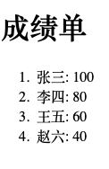

## 一、HTML 标签学习

###  1. 文本格式化标签

#### 1.1  标题标签

```
<h1>一级标题</h1>
<h2>二级标题</h2>
<h3>三级标题</h3>
<h4>四级标题</h4>
<h5>五级标题</h5>
<h6>六级标题</h6>
```

     <h1>一级标题</h1>
     <h2>二级标题</h2>
     <h3>三级标题</h3>
     <h4>四级标题</h4>
     <h5>五级标题</h5>
     <h6>六级标题</h6>

#### 1.2 段落标签

p

```
<p>范德萨发大水发生对焊法兰卡莉法机打开 f 佛挡杀佛</p>
```

#### 1.3  换行标签

`<br/>`

#### 1.4 文本格式化标签

场景：需要让文字**加粗**、<u>下划线</u>、*倾斜* 、~~删除线~~等效果

代码：突出重要性的强调语境

| 标签 |  说明  |      |  标签  |  说明  |
| :--: | :----: | ---- | :----: | :----: |
|  b   |  加粗  |      | strong |  加粗  |
|  u   | 下划线 |      |  ins   | 下划线 |
|  i   |  倾斜  |      |   em   |  倾斜  |
|  s   | 删除线 |      |  del   | 删除线 |

> 推荐：
>
> - strong、ins、em、del，表示的强调语义更强烈！

### 2. 媒体标签

#### 2.1 图片标签

- 代码：``
- 特点：
  - 单标签
  - `img` 标签需要展示对应的效果，需要借助标签的属性进行设置
- 属性注意点：
  - 标签的属性写在开始标签内部
  - 标签上可以同时存在多个属性
  - 属性之前以空格隔开
  - 标签名与属性之间必须以空格隔开
  - 属性指甲没有顺序之分
- 属性：
  - `alt` ： 替换文本
    - 当图片加载失败时，才会显示 alt 的文本
    - 当图片加载成功时，不会显示 alt 的文本
  - `title`：提示文本
    - 当鼠标悬停时，才会显示的文本
    - 注意点：title 属性不仅仅可以用于图片标签，还可以用于其他标签
  - `width` 和 `height`：宽度和高度
    - 如果只设置 `width` 或 `height` 中的一个，另一个没设置的话会自动等比缩放(此时图片不变形)
    - 如果同时设置了 `widht` 和 `height` 两个，若设置不当此时图片可能会变形

#### 2.2 路径

页面需要加载图片，需要先找到对应的图片。
路径分为：

- 绝对路径(了解)
- 相对路径(常用)

**绝对路径**

指目录下的绝对位置，可直接到达目的的位置，通常从盘符开始的路径。例如：

- 盘符开头：D:\day01\image\1.png
- 完整的网络地址：http://www.fdsfdsfdsf.com/11.png


**相对路径**

概念普及：

- 当前文件：当前的 `html` 网页
- 目标文件：要找到的图片

相对路径：从当前文件开始触发找到目标文件的过程

相对路径分类：

- 同级目录

  ```
  <image src="image.png">
  ```

- 下级目录

  ```
  <image src="./image/image.png">
  ```

- 上级目录

  ```
  <image src="../image/image.png">
  <image src="../../image/image.png">
  ```

#### 2.3 音频标签

代码：

```
<audio src="" controls></audio>
```

**常见属性**

|  属性名  |            功能            |
| :------: | :------------------------: |
|   src    |         音频的路径         |
| controls |       显示播放的控件       |
| autoplay | 自动播放(部分浏览器不支持) |
|   loop   |          循环播放          |

#### 2.4 视频标签

代码

```
<video src=""></video>
```

**常见属性**

|  属性名  |                       功能                        |
| :------: | :-----------------------------------------------: |
|   src    |                    视频的路径                     |
| controls |                  显示播放的控件                   |
| autoplay | 自动播放(谷歌浏览器中需要配合 muted 实现静音播放) |
|   loop   |                     循环播放                      |

### 3. 链接标签

场景：点击之后，从一个页面跳转到另一个页面

称呼：`a` 标签、超链接、锚链接

代码：

 ```
      <a href=" https://www.baidu.com">跳转到百度</a>
 
      <a href="./01-标题标签.html">点了就去 01-标题标签</a>
      
      <!-- 当开发网站初期,我们还不知道跳转地址的时候,href 的值书写为#(空连接)  -->
      <a href="#">空连接 ,不知道跳转到哪里去</a>
      
      href：跳转地址
 ```

特点：

- 双标签，内部可以包裹内容
- 如果需要 `a 标签`点击之后去指定页面，需要设置 `a 标签`的 `href` 属性

**属性**

- `target`：目标网页的打开形式

  |  取值  |                 效果                 |
  | :----: | :----------------------------------: |
  | _self  | 默认值，在当前窗口中跳转，覆盖原网页 |
  | _blank |       在新窗口跳转，保留原网页       |

  示例：

  ```
  <a href=" https://www.baidu.com" target=”_blank“>跳转到百度</a>
  ```


### 4 列表标签

- 列表的应用场景
- 无序列表
- 有序列表
- 自定义列表

#### 4.1 列表的应用场景

场景：在网页中按照行展示关联性的内容，如：新闻列表、排行榜、账单等。

特点：按照行的方式，整齐显示内容

种类：有序列表、无序列表、自定义列表

#### 4.2 无序列表

场景：在网页中表示一组无顺序之分的列表，如：新闻列表

标签组成：

| 标签名 |                    说明                    |
| :----: | :----------------------------------------: |
|   ul   |    表示无序列表的整体，用于包裹 li 标签    |
|   li   | 表示无序列表的每一项，用于包含每一行的内容 |

特点：列表的每一项前默认显示圆点表示

注意点：

- `ul` 标签中只允许包含 `li` 标签
- `li` 标签可以包含任意内容

示例：

```
....
<body>
     <h1>水果列表</h1>
     <ul>
          <li>榴莲</li>
          <li>香蕉</li>
          <li>苹果</li>
          <li>哈密瓜</li>
          <li>火龙果</li>
     </ul>
</body>
....
```


#### 4.3 有序列表

场景：在网页中表示一组有顺序之分的列表，如：排行榜

标签组成：

| 标签名 |                    说明                    |
| :----: | :----------------------------------------: |
|   ol   |    表示有序列表的整体，用于包裹 li 标签    |
|   li   | 表示有序列表的每一项，用于包含每一行的内容 |

特点：列表的每一项前默认显示有序表示

注意点：

- `ol` 标签中只允许包含 `li` 标签
- `li` 标签可以包含任意内容

示例：
```
...
<body>
     <h1>成绩单</h1>
     <ol>
          <li>张三: 100</li>
          <li>李四: 80</li>
          <li>王五: 60</li>
          <li>赵六: 40</li>
     </ol>
</body>
...
```



#### 4.4 自定义列表

场景：在网页底部导航中通常会使用自定义列表实现

标签组成：

| 标签名 |                    说明                    |
| :----: | :----------------------------------------: |
|   dl   | 表示自定义列表的整体，用于包裹 dt、dd 标签 |
|   dt   |            表示自定义列表的主题            |
|   dd   |    表示自定义列表的针对主题的每一项内容    |

特点：dd 前会默认显示缩进效果

注意点：

- `dl` 标签中只允许包含 `dt/dd` 标签
-  `dt/dd` 标签可以包含任意内容

示例：

```
...
<body>
     <h1>成绩单</h1>
     <ol>
          <li>张三: 100</li>
          <li>李四: 80</li>
          <li>王五: 60</li>
          <li>赵六: 40</li>
     </ol>
</body>
...
```


### 5. 表格标签


### 6. 表单标签


### 7. 语义化标签

###  8. 字符实体

