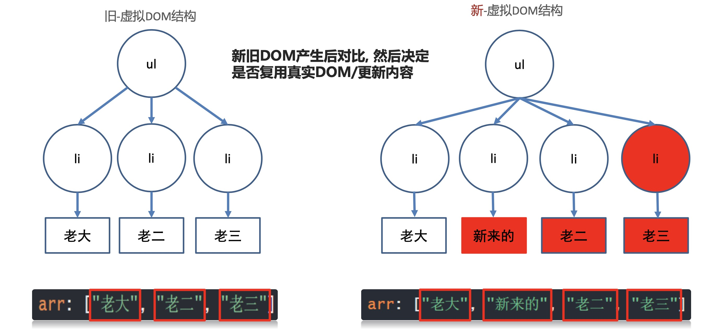
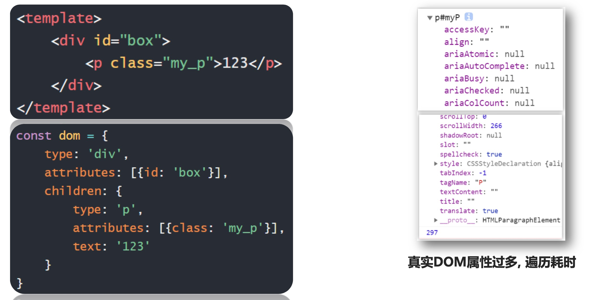
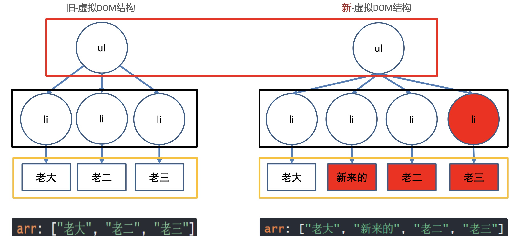
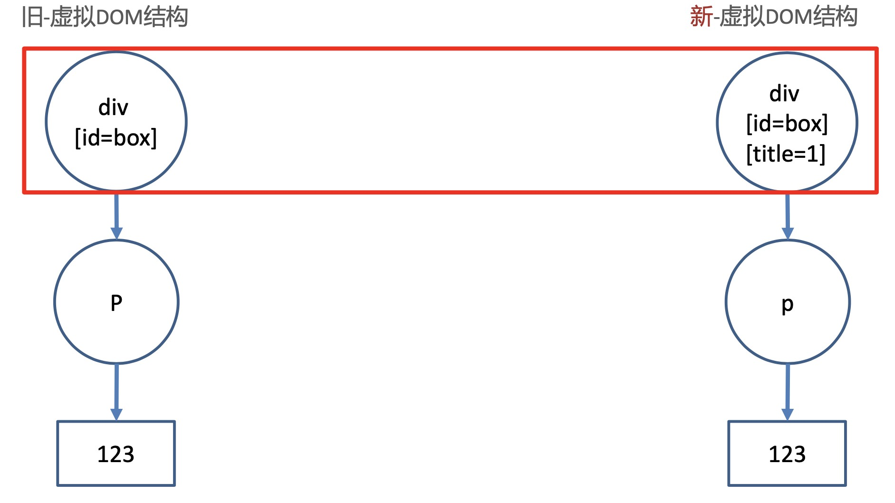

### 01 | v-for 更新检测

目标：目标结构变化，触发 `v-for` 的更新

- 情况一：数组翻转
- 情况二：数组截取
- 情况上：更新值
- 口诀：
  - 数组变更方法，就会导致 `v-for` 更新，页面更新
  - 数组非变更方法，返回新数组，不会导致 `v-for` 更新，可以采用覆盖数组或 `this.$set()`
  - push、pop、shift、unshift、splice、sort、reverse
  - filter、concat、slice

```js
<
```


#### v-for 就地更新

目标：当数组改变后，是如何更新的



- V-for 更新时，会循环出新的虚拟 DOM结构，和旧的虚拟 DOM 结构对比，尝试复用标签就地更新内容。

  

### 02 | 真事的 DOM

目标：在 document 对象上，渲染到浏览器上显示的标签


### 03 | 虚拟 DOM

目标：本质是保存节点信息，属性和内容的一个 JS 对象




目标：在内存中比较变化部分，然后给真实的DOM 打补丁(更新)



- 虚拟 DOM 本质上是一个 JS 对象，不保存 DOM关键信息
- 虚拟 DOM 的好处在于提高DOM 更新的性能，不频繁的使用真实的 DOM，在内存中找到变化部分，再更新真实的DOM


### 04 | diff 算法

- 同级比较，`根元素变化`，整个 dom 树删除重建


- 同级比较，`根元素不变`，属性改变更新属性

  

**总结：**

- diff 算法是同级比较新旧虚拟 DOM
- 根元素变化，删除重建整个 DOM 树
- 根元素不变，属性改变，DOM 复用，只更新属性


### 05 | 无 key

- 从第二个往后更新内容，性能不高

  ```js
  <ul id="myul">
  		<li v-for="str in arr">
        {{str }}  
        <input type="text">
      </li>  
  </ul>
  
  <button @click="addFn">下标为1的位置新增一个</button>
  ```

- 最大限度尝试就地修改/复用相同类型元素

- 