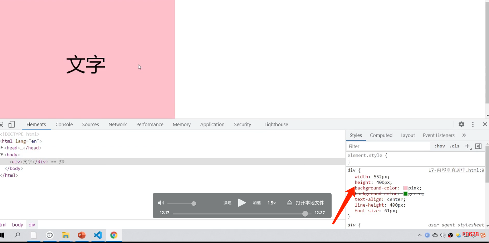
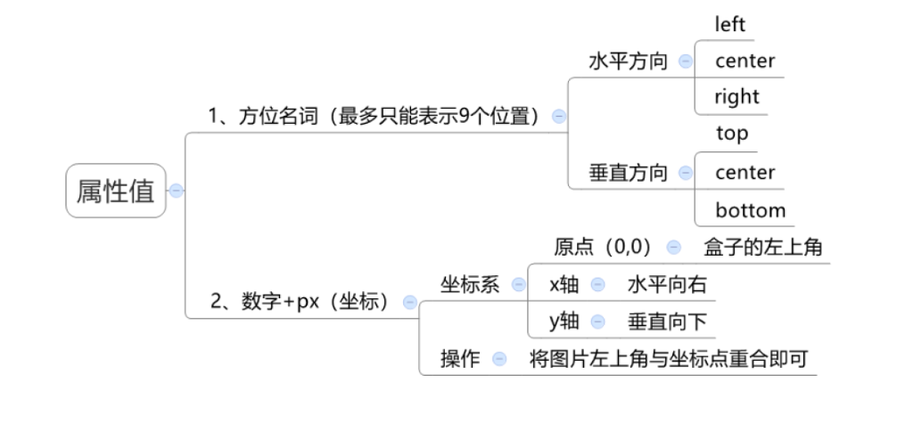
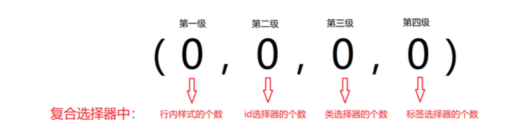
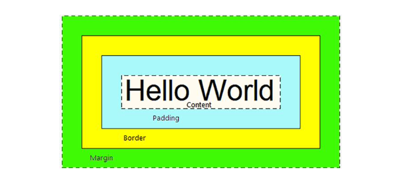
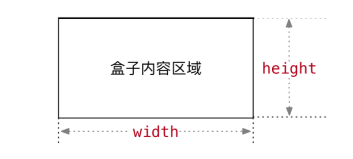

## 一、基础认识

**CSS 介绍**

CSS：层叠样式表（Cascading style sheets）
CCS 是写在 style 标签中，style 标签一般写道 header 标签里面，title 标签下面

**CSS引入方式**

- 内嵌式：css 写在 style 标签中
  - 提示：style 标签虽然可以写在页面任意位置，但是通常约定卸载 head 标签中
- 外联式：css 写在一个单独的.css 文件中
  - 提示：需要通过 link 标签在网页中引用
- 行内式：css 写在标签的 style 属性中
  - 提示：配合 js 使用

 css 常见三种引入方式的特点区别有哪些

| 引入方式 |                   书写位置                    | 作用范围 |   使用场景   |
| :------: | :-------------------------------------------: | :------: | :----------: |
|  内嵌式  |             css 写在 style 标签中             | 当前页面 |    小案例    |
|  外联式  | css 写在单独的 css 文件中，通过 link 标签引入 | 多个页面 |    项目中    |
|  行内式  |          css 写在标签的 style 属性中          | 当前标签 | 配合 js 使用 |

## 二、 选择器

### 2.1 标签选择器

结构：标签名 { css属性名: 属性值; }

作用：通过标签名，找到页面中所有这类标签，设置样式

注意点：

- 标签选择器选择的是一类标签，而不是单独一个
- 标签选择器无论嵌套关系有多深，都能找到对应的标签

### 2.2 类选择器

结构：.**类名** { css 属性名: 属性值; }

作用：通过类名，找到页面中所有带有这个类名的标签，设置样式

注意点：

- 所有标签上都有 class 属性，class 属性中的属性值称为类名
- 类名可以由数字、字母、下划线、中划线组成，但不能以数字或者中划线开头
- 一个标签可以同时有多个类名，类名之间以空格隔开
- 类名可以重复，一个类选择器可以同时选中多个标签

### 2.3 id 选择器

结构：#id 属性值 { css属性名: 属性值；}

作用：通过 id 属性值，找到页面中带有这个 id 属性值的标签，设置样式

注意点：

- 所有标签上都有 id 属性
- id 属性值类似于身份证号，在一个页面中是唯一的，不可重复
- 一个标签上只能有一个 id 属性值
- 一个 id 选择器只能选中一个标签

### 2.4 通配符选择器

结构体：* { css 属性名：属性值；}

作用：找到页面中所有的标签，设置样式

注意点：开发中使用极少，只会在极个别特殊情况才会用到

##  三、字体和文本样式

### 3.1 字体样式

- 字体大小：font-size

  - 数字+px。默认大小是 16px，例如：20px

- 字体粗细：font-weight

  - 取值：
    - 关键字：正常字体：normal；加粗字体：bold
    - 纯数字：100~900 取值的整百数。正常 400，加粗 700

- 字体样式：font-style。是否倾斜

  - 正常：normal；倾斜：italic

- 字体类型：font-family

- 字体类型：font 属性连写

  - font : style weight size family；例如：

    ```
    font: italic 700 16px 宋体;
    倾斜、加粗、16号字、宋体
    ```

    

### 3.2 文本样式

#### 3.2.1 文本缩进

属性名：text-indent

取值：

- 数字+px

- 数字+em（推荐：1em = 当前标签的 font-size 的大小）：1em 相当于一个字的大小

#### 3.2.2 文本水平对齐方式

属性名：text-align

取值：

- left：左对齐

- right：右对齐

- center：居中对齐

> text-align 可以使文本、span 标签、a 标签、input 标签、img 标签居中

> 如果需要让文本水平居中，text-align 属性给文本所在标签（文本的父元素）设置

#### 3.2.3 文本修饰

属性名：text-decoration

取值：

- underline：下划线，常用
- line-through：删除线，不常用
- overline：上划线，几乎不用
- none，无装饰线，常用

> 开发中胡使用 text-decoration： none；清除 a 标签默认的下划线

### 3.3 行高

作用：控制一行的上下间距

属性名：line-height

取值：

- 数字+px
- 倍数：当前标签 font-size 的倍数

应用：

- 让单行文本垂直居中可以设置 line-height：文字父元素高度
- 网页精准布局时，会设置 line-height：1，可以取消上下间距

> 行高与 font 连写的注意点：
>
> - 如果同时设置了行高和 font 连写，注意覆盖问题
> - font：style weight size/line-height family；

### 总结



这里出现黄色警号⚠️，说明这附近代码写错了。

出现横线代码被覆盖或者注释掉了

### 标签水平居中方法

如果需要让 div、p、h 水平居中：可以通过 margin: 0 auto; 实现

> 如果需要让 div、p、h 水平居中，直接给当前元素本身设置即可
>
> margin: 0 auto; 一般针对于固定宽度的盒子，如果大盒子没有设置宽度，此时会默认占满父元素的宽度

## 四、选择器进阶

### 4.1 后代选择器：空格

作用：根据 HTML 标签的嵌套关系，选择父元素 `后代中` 满足条件的元素

选择器语法：`选择器 1 选择器 2 { css }`

结果：在选择器 1 所找到标签后代(儿子，孙子，重孙子...)中，找到满足条件选择器 2 的标签，并设置样式

注意点：

- 后代包括：儿子，孙子，重孙子..
- 后代选择器中，选择器与选择器之前通过 `空格` 隔开

示例：

```jsx
<!DOCTYPE html>
<html lang="en">
<head>
 		 ...
     <style>
          /* 找到 div 的儿子 p,设置文字颜色是红色 */
          /* 父选择器 子选择器 {} */
          div p {
               color: red;
          }
     </style>
</head>
<body>
     <p>这是一个 p 标签</p>
     <div>
          <p>这是 div 的儿子</p>
     </div>
</body>
</html> 
```

### 4.2 子代选择器：>

作用：根据 HTML 标签的嵌套关系，选择父元素 `子代中` 满足条件的元素

选择器语法：`选择器 1 > 选择器 2 { css }`

作用：在选择器 1 所找到标签的子代(儿子)中，找到满足选择器 2 的标签，设置样式

注意点:

- 子代只包括：儿子
- 子代选择器中，选择器与选择器之前通过 > 隔开 

示例：

```
<!DOCTYPE html>
<html lang="en">
<head>
 		 ...
     <style>
          /* 找到 div 的儿子 p,设置文字颜色是红色 */
          /* 父选择器 子选择器 {} */
          div > p {
               color: red;
          }
     </style>
</head>
<body>
     <p>这是一个 p 标签</p>
     <div>
          <p>这是 div 的儿子</p>
     </div>
</body>
</html> 
```

### 4.3 并集选择器：,

作用：同事选择多组标签，设置相同的样式

选择器语法：选择器 1, 选择器 2 { css }

结果：找到选择器 1 和选择器 2 选中的标签，设置样式

注意点：

- 并集选择器中的每组选择器之间用 `,` 隔开
- 并集选择器中的每组选择器可以是基础选择器也可以是复合选择器
- 并集选择器中的每组选择器通常一行一个，提高代码的可读性

### 4.4 交集选择器：紧挨着

作用：选中页面中 同时满足 多个选择器的标签

选择器语法：选择器 1 选择器 2 { css }

结果：即又原则，找到页面中即能被选择器 1 选中，又能被选择器 2 选中的标签，设置样式

注意点：

- 交集选择器中的选择器之间是紧挨着的，没有东西分割
- 交集选择器中如果有标签选择器，标签选择器必须写在最前面

示例：

```
<!DOCTYPE html>
<html lang="en">
<head>
 		 ...
     <style>
     	   // 给 p 标签，class 是 title，设置颜色	
          p.title{
               color: red;
          }
     </style>
</head>
<body>
     <p class="tilte">这是一个 p 标签</p>
     <div>
          <p>这是 div 的儿子</p>
     </div>
</body>
</html> 
```

### 4.5 hover伪类选择器

作用：选中鼠标悬停在元素上的状态，设置样式

选择器语法：`选择器：hover {}`

注意点：伪类选择器选中的元素是某种状态，任何一个标签都可以设置伪类 hover

示例：

```jsx
<!DOCTYPE html>
<html lang="en">
<head>
     ...
     <style>
          /* 鼠标悬停的时候,a 标签 标称红色 */
          a:hover {
               color: red;
          }
     </style>
</head>
<body>
     <a href="#">鼠标悬停的时候是红色</a>
</body>
</html>
```

### 4.6 emmet 语法

作用：通过简写语法，快速生成代码

语法：类似于刚刚学习选择器的写法

|    记忆    |           示例           |                 效果                  |
| :--------: | :----------------------: | :-----------------------------------: |
|   标签名   |          `div`           |             `<div></div>`             |
|  类选择器  |          `.red`          |      `<div class=".red"></div>`       |
| id 选择器  |          `#one`          |        `<div id="one"></div>`         |
| 交集选择器 |       `p.red#one`        |     `<p class="red" i="one"></p>`     |
| 子代选择器 |         `ul>li`          |          `<ul><li></li><ul>`          |
|  内部文本  | `ul>li {我是 li 的内容}` |   `<ul><li>我是 li 的内容</li><ul>`   |
|  创建多个  |        `ul>li*3`         | `<ul><li></li><li></li><li></li><ul>` |

## 五、背景相关属性

### 5.1 背景平铺

属性名：background-repeat，bgr

属性值：

- repeat：默认值，水平和垂直方向都平铺
- no-repeat：不平铺。最常用的方式
- repeat-x：延水平方向( x 轴)平铺
- repeat-y：沿着垂直方向( y 轴)平铺

### 5.2 背景位置

属性名：background-positon，快捷方式 bgp

属性值：background-positon，水平方向位置，垂直方向位置



注意点：方位名词取值和坐标取值可以混使用，第一个取值表示水平，第二个取值表示垂直

### 5.3 背景相关属性的连写形式

属性名：background，快捷方式 bg

属性值：

- 单个属性值的合写，取值之间可以空格隔开

书写顺序：

- background: color、image、repeat、position

省略问题：

- 可以按照需要省略
- 特殊情况：在 PC 端，如果盒子大小和背景图片大小一样，此时可以直接写 background： url()

注意点：

- 如果需要设置单独的样式和连写
  - 要么把单独的样式连写的下面
  - 要么把单独的样式写在连写的里面

### 小结

背景相关属性连写：background

背景相关属性连写的取值写法：

- 单个属性值的合写，取值之间以空格隔开
- 推荐

### 拓展：img 标签和背景图片的区别

需求：需要在网页中展示一张图片的效果

方法一：直接写在 img 标签即可

- img 标签是一个标签，不设置宽高会默认以原尺寸显示

方法二：div 标签 + 背景图片

- **需要设置 div 的宽高**，因为背景图片只是装饰的 css，不能撑开 div 标签

## 六、显示模式

### 6.1 块级元素

显示特点：

- 独占一行，一行只能显示一个
- 宽度默认是父元素的宽度，高度默认由内容撑开
- 可以设置宽度

代表标签：

- div、p、h 系列、ul、li、dl、dt、dd、form、header、nav、footer...

### 6.2 行内元素

显示特点：

- 一行可以都显示多个
- 宽度和高度默认由内容撑开
- 不可以设置宽高

代表标签：

- a、span、b、u、i、s、strong、ins、em、del...

### 6.3 行内块

显示特点：

- 一行可以显示多个
- 可以设置宽高

代表标签：

- input、textarea、button、select...
- 特殊情况：img 标签有行内块元素特点，但是 Chrome 调试工具显示结果是 inline

### 6.4 元素显示模式转换

目的：改变元素默认的显示特点，让元素符合布局要求

语法：

|         属性          |       效果       | 使用频率 |
| :-------------------: | :--------------: | :------: |
|    display: block     |  转换成块级元素  |   较多   |
| display: inline-block | 转换成行内块元素 |   较多   |
|    display: inline    |  转换成行内元素  |   极少   |

示例：

```
....
<style>
		div {
			
			display: block;
		}
</style>
....
```

### HTML 嵌套规范注意点

- 块级元素一般作为大容器，可以嵌套：文本、块级元素、行内元素、行内块元素等等
  - 但是：p 标签中不能嵌套 div、p、h 等块级元素
- a 标签内可以嵌套任何元素
  - 但是：a 标签不能嵌套 a 标签

## 七、CSS 特性

 ### 7.1 继承性

特性：子元素有默认继承父元素样式的特点

可以继承的常见属性：文字控制属性都可以继承

- color
- font-style、font-weight、font-size、font-family
- text-indent、text-align
- line-height
- ....

> 注意点：
>
> - 可以通过调试工具判断样式是否可以继承
> - 如果元素有浏览器默认样式，此时继承性依然存在，但是
>   - a 标签的 color 会继承失效
>   - h 系列标签的 font-size 会继承失效

### 7.2 层叠性

特性：

- 给同一个标签设置不同的样式，此时样式会层叠叠加，会共同作用到标签上
- 给同一个标签设置相同的样式，此时样式会层叠覆盖，最终写在最后的样式会生效

> 当样式冲突时，只有当选择器优先级相同时，才会通过层叠性判断结果

 ## 八、CSS布局

### 8.1 优先级

特性：不同选择器具有不同的优先级，优先级高的选择器会覆盖优先级低的选择器样式

优先级公式：

- 继承 < 通配符选择器 < 标签选择器 < 类选择器 <  id 选择器 < 行内样式 < !important

> 注意点：
>
> -  !important 写在属性值的后面，分号的前面！
> -  !important 不能提升继承的优先级，**只要是继承优先级最低！**
> - 实际开发中不建议使用 !important！！

 ### 8.2 权重叠加计算

场景：如果是复合选择器，此时需要通过权重叠加计算方法，判断最终哪个选择器优先级最高位生效

权重叠加计算公式：每一级之间不存在进位



比较规则：

- 先比较第一级数字，如果比较出来了，之后的统统不看
- 如果第一级数字相同，此时再去比较第二级数字，如果比较出来了，之后的统统不看
- ....
- 如果最终所有数字都相同，表示优先级相同，则比较层叠性：谁写在下面，谁说了算

> 注意：** !important 如果不是继承，则权重最高！！**

示例：

```
```


## 九、盒子模型

### 9.1 盒子模型介绍

**盒子的概念**

页面中每一个标签都可以看做是一个”盒子“，通过盒子的视角更方便的进行布局，浏览器在渲染(显示)网页时，会将网页中的元素看做是一个个的矩形区域，我们也形象的称之为 `盒子`。

**盒子模型**

CSS 中规定每个盒子分别由：内容区域（content）、内边距区域（padding）、边框区域（border）、外边距区域（margin）构成，这就是盒子模型。



### 9.2 内容的宽度和高度

作用：利用 widht 和 height 属性默认设置盒子的 内容区域 的大小

属性：width、height

常见取值：数字+px



### 9.3 边框：border

#### 9.3.1 单个属性

作用：给设置边框粗细、边框样式、边框颜色效果

单个属性

|   作用   |    属性名    |                属性值                 |
| :------: | :----------: | :-----------------------------------: |
| 边框粗细 | border-width |                数字+px                |
| 边框样式 | border-style | 实现 solid、虚线 dashed、点线、dotted |
| 边框颜色 | border-color |               颜色取值                |

#### 9.3.1 连写形式

属性名：border

属性值：单个取值的连写，取值之间以空格隔开

- 如：border：10px solid red;

快捷键：bd + tab

#### 9.3.2 单方向设置

属性名：border

场景：只给盒子的某个方向单独设置边框

属性名：border - 方位名词

属性值：连写的取值

#### border 总结

给盒子设置四周 20 像素、实线、蓝色的边框，属性应该如何设置？

- border： 20 solid blue;

给盒子设置上边框 10 像素、虚线、黄色的边框，属性应该如何设置？

- border-top：10px dashed yellow;

### 9.4 内边距：padding

作用：设置 `边框` 与 `内容区域` 之间的距离

属性名：padding

常见取值：

|  取值  |             示例              |                        含义                        |
| :----: | :---------------------------: | :------------------------------------------------: |
| 一个值 |        padding：10px;         |               上下左右都设置为 10px                |
| 两个值 |      padding：10px 20px;      |          上下设置为 10px，左右设置为 20px          |
| 三个值 |   padding：10px 20px 30px;    |      上设置 10px，左右设置 20px，下设置 30px       |
| 四个值 | padding：10px 20px 30px 40px; | 上设置 10px，右设置 20px，下设置 30px，左设置 40px |

记忆规则：

**从上开始赋值，然后顺时针赋值，如果设置赋值的，看对面的**

#### 9.4.1 单方向设置

场景：只给盒子的某个方向单独设置内边距

属性名：padding - 方位名词

属性值：数字+px


