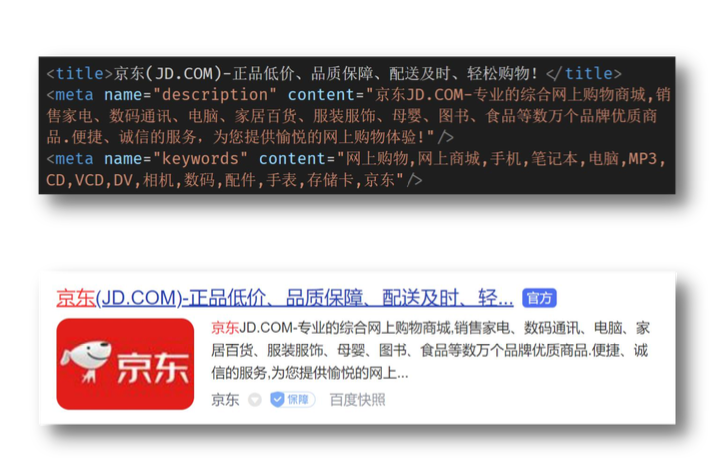
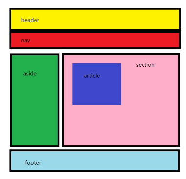
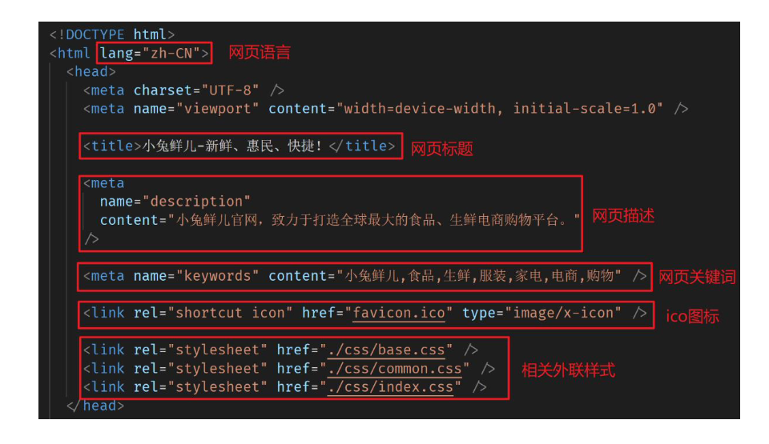

---
id：项目样式补充
title：样式补充
---

## 一、CSS 样式补充

### 1.1 精灵图

场景：项目中将多张小图片、合并成一张大图片，这张大图片称之为精灵图

优点：减少服务器发送次数，减轻服务器的压力，提高页面加载速度

例如：需要在网页中展示 8 张小图片

- 8 张小图片分别发送---发送 8 次
- 合成一张精灵图发送---发送一次

> 一般精灵图的标签都用行内标签：span、b、i 等

   

#### 1.2 精灵图的使用步骤

- 创建一个盒子
- 通过 PxCook 量取小图片大小，将小图片的宽高设置给盒子
- 将精灵图设置为盒子的背景图片
- 通过 PxCook 测量小图片左上角坐标，分别取负值设置给盒子的 background-position：xy


### 1.2 背景图片大小

作用：设置背景图片的大小

语法：background-size：宽度 高度

取值：

|  取值   |                           场景                           |
| :-----: | :------------------------------------------------------: |
| 数字+px |                      简单方便，常用                      |
| 百分比  |                相对于当前盒子的宽高百分比                |
| contain |    包含，将背景图片等比例缩放，直到不会超过盒子的最大    |
|  cover  | 覆盖，将背景图片等比例缩放，直到刚好填满整个盒子没有空白 |

#### background 连写拓展

完整连写：background：color image repeat positon/size；

注意点：background-size 和 background 连写同时设置时，需要注意覆盖问题

解决：

- 要么单独的样式写连写的下面
- 要么单独的样式写连写的里面


### 1.3 文字阴影

作用：给文字添加阴影效果，吸引用户注意

属性名：text-shadow

取值：

|   参数   |            作用            |
| :------: | :------------------------: |
| h-shadow | 必须，水平偏移量，允许负值 |
| v-shadow | 必须，垂直偏移量。允许负值 |
|   blur   |        可选，模糊度        |
|  color   |       可选，阴影颜色       |

> 拓展：
>
> - 阴影可以叠加设置，每组阴影取值之间以逗号隔开

### 1.4 盒子阴影

作用：给盒子添加阴影效果，吸引用户注意，体现页面的制作细节

属性名：box-shadow

取值：

|   参数   |            作用            |
| :------: | :------------------------: |
| h-shadow | 必须，水平偏移量，允许负值 |
| v-shadow | 必须，垂直偏移量。允许负值 |
|   blur   |        可选，模糊度        |
|  color   |       可选，阴影颜色       |
|  spread  |       可选，阴影扩大       |
|  inset   |  可选，将阴影改为内部阴影  |

### 1.5 过渡

作用，让元素的样式慢慢的变化，长配合 hover 使用，增强网页交互体验

属性名：transition

常见取值：

|    参数    |                             取值                             |
| :--------: | :----------------------------------------------------------: |
| 过渡的属性 | all：所有能过渡的属性都过渡；具体属性名如：width：只有 width 有过渡 |
| 过渡的时长 |                         数字+s（秒）                         |

> 属性可以是：widht、hegith、background-color、font-size 等

注意点：

- 过渡需要：默认状态和 hover 状态样式不同，才能有过渡效果
- transition 属性给需要多度的元素本身加
- transition 属性设置在不同的状态中，效果是不同的
  -  给默认状态设置，鼠标移入移出都有过渡效果
  - 给 hover 状态设置，鼠标移入有过渡效果，移出没有过渡效果


## 二、项目前置认识

### 2.1 网页骨架结构标签

```jsx
<!-- 文档类型声明,告知浏览器该网页的 HTML 版本 -->
<!DOCTYPE html>
<!-- 网页使用的语言 -->
<!-- 作用: 搜索引擎归类 + 浏览器翻译-->
<!-- 常见语言:zh-CN 简体中文; en 英文 -->
<html lang="en">
<head>
     <!-- 字符编码 -->
     <meta charset="UTF-8">
     <!-- ie 兼容 -->
     <meta http-equiv="X-UA-Compatible" content="IE=edge">
     <meta name="viewport" content="width=device-width, initial-scale=1.0">
     <title>Document</title>
</head>
```


### 2.2 SEO 三大标签

SEO：search engine optimization 搜索引擎优化

作用：让网站在搜索引擎上的排名靠前

提升 SEO 的常见方法：

- 竞价排名
- 将网页制作成 html 后缀
- 标签语义化 （在合适的地方使用合适的标签）
- ..........

三大标签：

- title ：网页标题标签
- description：网页描述标签
- keywords：网页关键词标签



#### 有语义的布局标签

场景：在 HTML5 新版本中，推出了一些有语义的布局标签，可以增强网页的语义化

标签：

| 标签名  |    语义    |
| :-----: | :--------: |
| header  |  网页头部  |
|   nav   |  网页导航  |
| footer  |  网页底部  |
|  aside  | 网页侧边栏 |
| section |  网页区块  |
| article |  网页文章  |



注意点：

- 以上标签显示特点和 div 一致，但是比 div 多了不同的语义


### 2.3 icon 图标设置

场景：显示在标签页标题左侧的小图标，习惯使用 .ico 格式的图标

常见代码：

```jsx
<link rel="shortcut icon" href="ico 图标路径" type="image/x-icon">
```


### 2.4 版心

场景：把页面的主题内容约束到网页中间

作用：让不同大小的屏幕都能看到页面的主题

代码：

```jsx
/* 版心 */
.container {
  	widht = 1240px;
  	margin: 0 autol;
}
```

> 注意点：
>
> - 版心类名常用：container、wrapper、w 等


### CSS 书写顺序

衡量程序员的能力，除了要看实现业务需求的能力，还要看平时写代码的规范

**不同的 CCSS 书写顺序会影响浏览器的渲染性能，推荐使用到专业的书写顺序习惯**

| 顺序 |     类别      |                         属性                          |
| :--: | :-----------: | :---------------------------------------------------: |
|  1   |   布局属性    | display、position、float、clear、visibility、overflow |
|  2   | 盒子模型+背景 |  widht、height、margin、padding、border、background   |
|  3   | 文本内容属性  | color、font、text-decoration、text-align、line-height |
|  4   |   点缀属性    |    cursor、border-radius、text-shadow、box-shadow     |

> 注意点：
>
> - 开发中推荐多用类+后代，但不是层级越多越好，一个选择器中的类选择器的个数推荐不超过 3 个


## 三、项目结构搭建

### 3.1 文件和目录准备

- 新建项目文件夹 xtx-pc-client，在VScode中打开

  - 在实际开发中，项目文件夹不建议使用中文

  - 所有项目相关文件都保存在 xtx-pc-client 目录中

- 复制 favicon.ico 到 xtx-pc-client 目录
  - 一般习惯将ico图标放在项目根目录

- 复制 images 和 uploads 目录到 xtx-pc-client 目录中

  - images :存放网站 **固定使用** 的图片素材，如:logo、样式修饰图片... 等

  - uploads:存放网站 **非固定使用** 的图片素材，如:商品图片、宣传图片...等

- 新建 index.html 在根目录

- 新建 css 文件夹保存网站的样式，并新建以下CSS文件:

  - base.css:基础公共样式

  - common.css:该网站中多个网页相同模块的重复样式，如:头部、底部

  - index.css:首页样式

  

### 3.2 基础公共样式

场景：一般项目开始前，首先会 去除掉浏览器默认样式，设置为 当前项目需要的初始化样式

作用：防止不同浏览器中标签默认样式不同的影响，统一不同浏览器的默认显示效果，方便后续项目开发

要求:

- 已经准备好base.css代码，同学们需要认识，项目中可以直接引入使用


### 3.3 index 页面骨架




