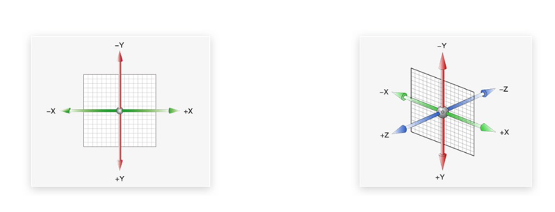
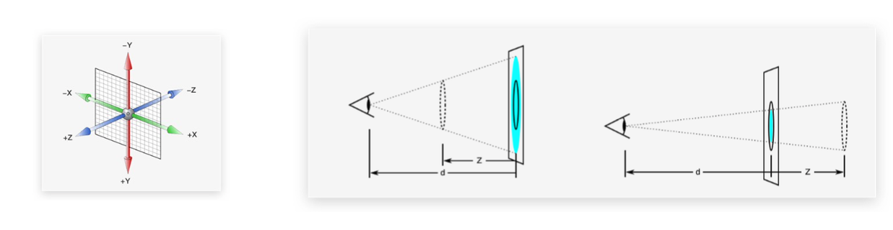
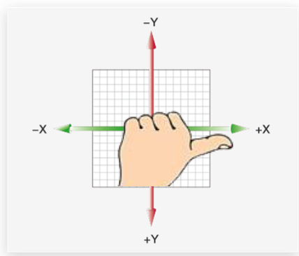

---
id：空间转换/动画
title：05 | 空间转换/动画
---

## 一、空间转换

目标：使用 transform 属性实现元素在空间内的位移、旋转、缩放等效果

空间：是从坐标轴角度定义的。x、y、z 三条坐标轴构成了一个立体空间，z 轴位移与视线位置相同

空间转换也叫 3D 转换

属性：transform



### 1.1 空间位移

目标：使用 translate 视线元素空间位移效果

语法：

- transform: translate3d(x, y, z);
- transform: translateX(值);
- transform: translateY(值);
- transform: translateZ(值);

取值：正负均可

- 像素单位数值
- 百分比

### 1.2 透视

目标：使用 `perspective` 属性实现透视效果

**思考：**

生活中，同一个物体，观察距离不同，视觉上有什么区别？

- 近大远小，近清楚远模糊

默认情况下，为什么无法观察到 Z 轴位移效果？

- Z 轴是视线方向，移动效果应该是距离的远和近，电脑屏幕是平面，默认无法观察远近


属性：添加给父级

- perspective：值
- 取值：像素单位数值，数值一般在 800 - 1200.

作用：

- 空间转换时，为元素添加近大远小，近实远虚的视觉效果。

> 透视距离也成为视距，所谓的视距就是人的眼睛到屏幕的距离。



### 1.3 空间旋转

目标：使用 rotate 实现元素空间旋转效果

语法：

- transfrom：rotateZ(值);
- transfrom：rotateX(值);
- transfrom：rotateY(值);

左手规则：

- 判断旋转方向：左手握住旋转轴，拇指指向正值方法，手指弯曲方向为旋转正值方向




拓展 ：

- rotate3d(x，y，z，角度度数): 用来设置自定义旋转转轴的位置及旋转的角度
- x、y、z 取值为 0 - 1 之间的数字


### 1.4 立体呈现

目标：使用 transform-style: preserve-3d 呈现立体图形

思考：使用 perspective 透视属性能否呈现立体图形？

答：不能，perspective 只能增加远大近小、近实远虚的视觉效果


实现方法：

- 添加：transform-style： preserver-3d;
- 使子元素处于真正的 3d 空间

呈现立体图形步骤：

- 盒子父元素添加 transform-style: preserver-3d;
- 按需求设置子盒子的位置(位移或者旋转)

> 注意：
>
> - 空间内，转换元素都有自己独立的坐标轴，互不干扰


#### 1.4.1 3D 导航

目标：使用立体呈现技巧实现 3D 导航效果

思考：绿色和橙色盒子是如何摆放的？

```
搭建立方体
	--  绿色盒子是立方体的前面
	--  橙色盒子是立方体的上面
```


结论：

- 橙色和绿色部分需要 3 个标签
- 一个父级标签
- 绿色和橙色共 2 个标签(子级)

实现思路：

- 搭建立方体：绿色盒子是立方体的前面，橙色盒子是立方体的上面
  - li 标签
    - 添加立体呈现属性 transform-style: preserver-3d;
    - 添加旋转属性。为了便于观察效果，案例完成后删除即可
  - a 标签
    - 调节位置
    - a 标签定位：子绝父相
    - 英文部分添加旋转和位移样式
    - 中文部分添加位移样式
- 添加 hover 状态旋转切换效果
  - 鼠标滑过 li，添加空间旋转样式
  - li 添加过渡属性


### 1.5 空间缩放

目标：使用 scale 实现空间缩放效果

语法：

- transform: scaleX(倍数);
- transform: scaleY(倍数);
- transform: scaleZ(倍数);
- transform: scale3d(x, y, z);


## 二、动画

目标：使用 animation 添加动画效果

思考：过渡可以实现什么效果？

- 可以实现 2 个状态间的变化过程

动画效果：实现多个状态间的变化过程，动画过程可控：重复播放、最终画面、是否暂停


动画的本质是快速切换大量图片时在人脑中形成的具有连续性的画面

构成动画的最小单元：帧或者动画帧


实现步骤：

1. 定义动画：

   ```jsx
   @keyframes 动画名臣 {
     from {}
     to {}
   }
   
   @keyframes 动画名称 {
     0% {}
     10% {}
     15% {}
     100% {}
   }
   ```

2. 使用动画

   - `animation: 动画名称 动画花费时长；`

### 2.1 动画属性

目标：使用 animation 相关属性控制动画执行过程

```
animation: 动画名称 动画时长 速度曲线  延迟时间  重复次数  动画方向  执行完毕时状态;
```

注意：

- 动画名称和动画时长必须赋值
- 取值不分先后顺序
- 如果有 2 个时间值，第一个时间表示动画时长，第二个时间表示延迟时间

|           属性            |        作用        |                    取值                     |
| :-----------------------: | :----------------: | :-----------------------------------------: |
|      animation-name       |      动画名称      |                                             |
|    animation-duration     |      动画时长      |                                             |
|      animation-delay      |      延迟时间      |                                             |
|    animation-fill-mode    | 动画执行完毕时状态 | forward：最后一帧状态，backward：第一帧状态 |
| animation-timing-function |      速度曲线      |            step(数字)：逐帧动画             |
| animation-iteration-count |      重复次数      |             infinite 为无限循环             |
|    animation-direction    |    动画执行方向    |             alternate 为反方向              |
|   animation-play-state    |      暂停动画      |     paused 为暂停，通常配合:hover 使用      |


