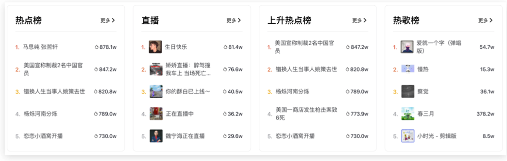

## 一、Flex 布局

目标：能够使用 Flex 布局模型灵活、快速的开发网页

Flex 布局/弹性布局：

- 是一种浏览器提倡的布局模型
- 布局网页更简单、灵活
- 避免浮动脱标的问题

### 1.1 Flex 布局模型构成

作用：

- 基于 Flex 精确灵活控制块级盒子的布局方式，避免浮动布局中脱离文档流现象发生
- Flex 布局非常适合结构化布局

设置方式：

- 父元素添加 display: flex，子元素可以自动的挤压或拉伸

组成部分：

- 弹性容器
- 弹性盒子
- 主轴
- 侧轴、交叉轴

### 1.2 主轴对齐方式

目标：使用 `justify-content` 调节元素在主轴的对齐方式

在 Flex 布局模型中，调节主轴或侧轴的对齐方式来设置盒子之间的 间距。

修改主轴对齐方式属性：`justify-content`

|    属性值     |                        作用                        |
| :-----------: | :------------------------------------------------: |
|  flex-start   |              默认值，起点开始依次排列              |
|   flex-end    |                  终点开始依次排列                  |
|    center     |                   沿主轴居中排列                   |
| space-around  | 弹性盒子沿主轴均匀排列，空白间距均分在弹性盒子两侧 |
| space-between | 弹性盒子沿主轴均匀排列，空间间距均分在相邻盒子之间 |
| space-evenly  | 弹性盒子沿主轴均匀排列，弹性盒子与容器之间间距相等 |

### 1.3 侧轴对齐方式

目标：使用 `align-items` 调节元素在侧轴的对齐方式

修改侧轴对齐方式属性：

- align-items：添加属性弹性容器
- align-self：控制某个弹性盒子在侧轴的对齐方式（添加到弹性盒子）

|   属性值   |                    作用                    |
| :--------: | :----------------------------------------: |
| flex-start |          默认值，起点开始依次排列          |
|  flex-end  |              终点开始依次排列              |
|   center   |               沿侧轴居中排列               |
|  stretch   | 默认值，弹性盒子沿着主轴线被拉伸至铺满容器 |

### 1.4 伸缩比

目标：使用 flex 属性修改弹性盒子伸缩比

属性：

- flex：值

取值分类：

- 数值（整数）

> 注意：只占用父盒子剩余尺寸

