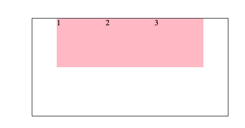
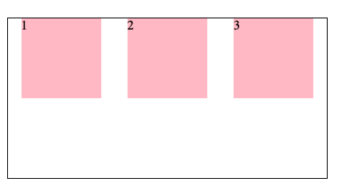

## 一、Flex 布局

目标：能够使用 Flex 布局模型灵活、快速的开发网页

Flex 布局/弹性布局：

- 是一种浏览器提倡的布局模型
- 布局网页更简单、灵活
- 避免浮动脱标的问题

### 1.1 Flex 布局模型构成

作用：

- 基于 Flex 精确灵活控制块级盒子的布局方式，避免浮动布局中脱离文档流现象发生
- Flex 布局非常适合结构化布局

设置方式：

- 父元素添加 display: flex，子元素可以自动的挤压或拉伸

组成部分：

- 弹性容器
- 弹性盒子
- 主轴
- 侧轴、交叉轴


### 1.2 主轴对齐方式：justify-content

目标：使用 `justify-content` 调节元素在主轴的对齐方式

在 Flex 布局模型中，调节主轴或侧轴的对齐方式来设置盒子之间的 间距。

修改主轴对齐方式属性：`justify-content`

|    属性值     |                        作用                        |
| :-----------: | :------------------------------------------------: |
|  flex-start   |              默认值，起点开始依次排列              |
|   flex-end    |                  终点开始依次排列                  |
|    center     |                   沿主轴居中排列                   |
| space-around  | 弹性盒子沿主轴均匀排列，空白间距均分在弹性盒子两侧 |
| space-between | 弹性盒子沿主轴均匀排列，空间间距均分在相邻盒子之间 |
| space-evenly  | 弹性盒子沿主轴均匀排列，弹性盒子与容器之间间距相等 |

示例：

```jsx
<head>
		 ....
     <style>
          * {
               margin: 0;
               padding: 0;
          }
          .box {
              
         			 margin: 100px auto;
               width: 400px;
               height: 200px;
               border: 1px solid #000;
          }

          .box ul {
               list-style: none;  
          }
          .box li {
               width: 100px;
               height: 100px;
               background-color: pink;
          }
     </style>
</head>
<body>
     <div class="box">
          <ul>
               <li>1</li>
               <li>2</li>
               <li>3</li>
          </ul>
     </div>
</body>
```

**`justly-content:ceter`**

```jsx
.box ul {
     display: flex;
     justify-content: center;
     list-style: none;  
}
```



**`justify-content: space-between`**

```jsx
.box ul {
     display: flex;
     justify-content: space-between;
     list-style: none;  
}
```


**`justify-content: space-around`**

```
.box ul {
     display: flex;
     justify-content: space-around;
     list-style: none;  
}
```



**`justify-content: space-evenly`**

```
.box ul {
     display: flex;
     justify-content: space-evenly;
     list-style: none;  
}
```


### 1.3 侧轴对齐方式：align-items

目标：使用 `align-items` 调节元素在侧轴的对齐方式

修改侧轴对齐方式属性：

- `align-items`：添加属性弹性容器
- `align-self`：控制某个弹性盒子在侧轴的对齐方式（添加到弹性盒子）

|   属性值   |                   作用                   |
| :--------: | :--------------------------------------: |
| flex-start |         默认值，起点开始依次排列         |
|  flex-end  |             终点开始依次排列             |
|   center   |              沿侧轴居中排列              |
|  stretch   | 默认值，弹性盒子沿侧轴线被拉伸至铺满容器 |


### 1.4 伸缩比：`flex: 值`

目标：使用 `flex` 属性修改弹性盒子伸缩比

属性：

- `flex：值`

取值分类：

- 数值（整数）

> 注意：只占用父盒子剩余尺寸


### 1.5 主轴方向：flex-direction

目标：使用 `flex-direction` 改变元素排列方向

主轴默认是水平方向，侧轴默认是垂直方向

修改主轴方向属性：`flex-direction`

|     属性值     |       作用       |
| :------------: | :--------------: |
|      row       | 行、水平，默认值 |
|    `column`    |    `列，垂直`    |
|  row-reverse   |   行，从右向左   |
| column-reverse |   列，从下向上   |

> 1. 先确定主轴方向
> 2. 在选择对应的属性直线主轴或侧轴

```jsx
// 修改主轴方向：列
flex-direction：column;

// 视觉效果：实现盒子水平居中
align-items: center;

// 视觉效果：垂直居中
justify-content: center;
```


### 1.5 弹性盒子换行：flex-wrap

目标：使用 `flex-wrap` 实现弹性盒子多行排列效果

思考：默认情况下，多个弹性盒子如何显示？

弹性盒子换行显示：flex-wrap: wrap;

调整行对齐方式：align-content

- 取值与 justify-content 基本相同：center、space-between、space-around


