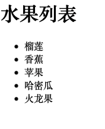
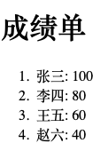
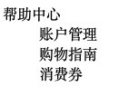
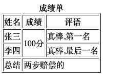
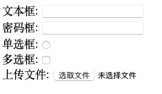
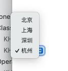
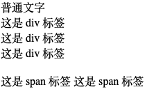
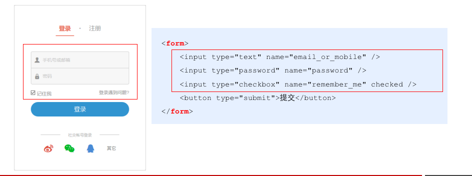

## 一、HTML 标签学习

###  1. 文本格式化标签

#### 1.1  标题标签

```
<h1>一级标题</h1>
<h2>二级标题</h2>
<h3>三级标题</h3>
<h4>四级标题</h4>
<h5>五级标题</h5>
<h6>六级标题</h6>
```

     <h1>一级标题</h1>
     <h2>二级标题</h2>
     <h3>三级标题</h3>
     <h4>四级标题</h4>
     <h5>五级标题</h5>
     <h6>六级标题</h6>

#### 1.2 段落标签

p

```
<p>范德萨发大水发生对焊法兰卡莉法机打开 f 佛挡杀佛</p>
```

#### 1.3  换行标签

`<br/>`

#### 1.4 文本格式化标签

场景：需要让文字**加粗**、<u>下划线</u>、*倾斜* 、~~删除线~~等效果

代码：突出重要性的强调语境

| 标签 |  说明  |      |  标签  |  说明  |
| :--: | :----: | ---- | :----: | :----: |
|  b   |  加粗  |      | strong |  加粗  |
|  u   | 下划线 |      |  ins   | 下划线 |
|  i   |  倾斜  |      |   em   |  倾斜  |
|  s   | 删除线 |      |  del   | 删除线 |

> 推荐：
>
> - strong、ins、em、del，表示的强调语义更强烈！

### 2. 媒体标签

#### 2.1 图片标签

- 代码：``
- 特点：
  - 单标签
  - `img` 标签需要展示对应的效果，需要借助标签的属性进行设置
- 属性注意点：
  - 标签的属性写在开始标签内部
  - 标签上可以同时存在多个属性
  - 属性之前以空格隔开
  - 标签名与属性之间必须以空格隔开
  - 属性指甲没有顺序之分
- 属性：
  - `alt` ： 替换文本
    - 当图片加载失败时，才会显示 alt 的文本
    - 当图片加载成功时，不会显示 alt 的文本
  - `title`：提示文本
    - 当鼠标悬停时，才会显示的文本
    - 注意点：title 属性不仅仅可以用于图片标签，还可以用于其他标签
  - `width` 和 `height`：宽度和高度
    - 如果只设置 `width` 或 `height` 中的一个，另一个没设置的话会自动等比缩放(此时图片不变形)
    - 如果同时设置了 `widht` 和 `height` 两个，若设置不当此时图片可能会变形

#### 2.2 路径

页面需要加载图片，需要先找到对应的图片。
路径分为：

- 绝对路径(了解)
- 相对路径(常用)

**绝对路径**

指目录下的绝对位置，可直接到达目的的位置，通常从盘符开始的路径。例如：

- 盘符开头：D:\day01\image\1.png
- 完整的网络地址：http://www.fdsfdsfdsf.com/11.png


**相对路径**

概念普及：

- 当前文件：当前的 `html` 网页
- 目标文件：要找到的图片

相对路径：从当前文件开始触发找到目标文件的过程

相对路径分类：

- 同级目录

  ```
  <image src="image.png">
  ```

- 下级目录

  ```
  <image src="./image/image.png">
  ```

- 上级目录

  ```
  <image src="../image/image.png">
  <image src="../../image/image.png">
  ```

#### 2.3 音频标签

代码：

```
<audio src="" controls></audio>
```

**常见属性**

|  属性名  |            功能            |
| :------: | :------------------------: |
|   src    |         音频的路径         |
| controls |       显示播放的控件       |
| autoplay | 自动播放(部分浏览器不支持) |
|   loop   |          循环播放          |

#### 2.4 视频标签

代码

```
<video src=""></video>
```

**常见属性**

|  属性名  |                       功能                        |
| :------: | :-----------------------------------------------: |
|   src    |                    视频的路径                     |
| controls |                  显示播放的控件                   |
| autoplay | 自动播放(谷歌浏览器中需要配合 muted 实现静音播放) |
|   loop   |                     循环播放                      |

### 3. 链接标签

场景：点击之后，从一个页面跳转到另一个页面

称呼：`a` 标签、超链接、锚链接

代码：

 ```
      <a href=" https://www.baidu.com">跳转到百度</a>
 
      <a href="./01-标题标签.html">点了就去 01-标题标签</a>
      
      <!-- 当开发网站初期,我们还不知道跳转地址的时候,href 的值书写为#(空连接)  -->
      <a href="#">空连接 ,不知道跳转到哪里去</a>
      
      href：跳转地址
 ```

特点：

- 双标签，内部可以包裹内容
- 如果需要 `a 标签`点击之后去指定页面，需要设置 `a 标签`的 `href` 属性

**属性**

- `target`：目标网页的打开形式

  |  取值  |                 效果                 |
  | :----: | :----------------------------------: |
  | _self  | 默认值，在当前窗口中跳转，覆盖原网页 |
  | _blank |       在新窗口跳转，保留原网页       |

  示例：

  ```
  <a href=" https://www.baidu.com" target=”_blank“>跳转到百度</a>
  ```


### 4 列表标签

- 列表的应用场景
- 无序列表
- 有序列表
- 自定义列表

#### 4.1 列表的应用场景

场景：在网页中按照行展示关联性的内容，如：新闻列表、排行榜、账单等。

特点：按照行的方式，整齐显示内容

种类：有序列表、无序列表、自定义列表

#### 4.2 无序列表

场景：在网页中表示一组无顺序之分的列表，如：新闻列表

标签组成：

| 标签名 |                    说明                    |
| :----: | :----------------------------------------: |
|   ul   |    表示无序列表的整体，用于包裹 li 标签    |
|   li   | 表示无序列表的每一项，用于包含每一行的内容 |

特点：列表的每一项前默认显示圆点表示

注意点：

- `ul` 标签中只允许包含 `li` 标签
- `li` 标签可以包含任意内容

示例：

```
....
<body>
     <h1>水果列表</h1>
     <ul>
          <li>榴莲</li>
          <li>香蕉</li>
          <li>苹果</li>
          <li>哈密瓜</li>
          <li>火龙果</li>
     </ul>
</body>
....
```



#### 4.3 有序列表

场景：在网页中表示一组有顺序之分的列表，如：排行榜

标签组成：

| 标签名 |                    说明                    |
| :----: | :----------------------------------------: |
|   ol   |    表示有序列表的整体，用于包裹 li 标签    |
|   li   | 表示有序列表的每一项，用于包含每一行的内容 |

特点：列表的每一项前默认显示有序表示

注意点：

- `ol` 标签中只允许包含 `li` 标签
- `li` 标签可以包含任意内容

示例：
```
...
<body>
     <h1>成绩单</h1>
     <ol>
          <li>张三: 100</li>
          <li>李四: 80</li>
          <li>王五: 60</li>
          <li>赵六: 40</li>
     </ol>
</body>
...
```



#### 4.4 自定义列表

场景：在网页底部导航中通常会使用自定义列表实现

标签组成：

| 标签名 |                    说明                    |
| :----: | :----------------------------------------: |
|   dl   | 表示自定义列表的整体，用于包裹 dt、dd 标签 |
|   dt   |            表示自定义列表的主题            |
|   dd   |    表示自定义列表的针对主题的每一项内容    |

特点：`dd` 前会默认显示缩进效果

注意点：

- `dl` 标签中只允许包含 `dt/dd` 标签
-  `dt/dd` 标签可以包含任意内容

示例：

```
...
<body>
     <dl>
          <dt>帮助中心</dt>
          <dd>账户管理</dd>
          <dd>购物指南</dd>
          <dd>消费券</dd>
     </dl>
</body>
...
```




#### 去掉列表符号

```
ul {
	list-style: none;
}
```

### 5. 表格标签

#### 5.1 表格的基本标签

场景：在网页中以行+列的单元格的方式整齐展示和数据，如：学生成绩单

基本标签：

| 标签名 |             说明             |
| :----: | :--------------------------: |
| table  | 表格整体，可用于包裹多个 tr  |
|   tr   |   表格每行，可用于包裹 td    |
|   td   | 表格单元格，可以用于包裹内容 |

注意点：

- 标签的嵌套关系：`table > tr > td`

示例：

```
<body>
     <table>
          <tr>
               <td>姓名</td>
               <td>成绩</td>
               <td>评语</td>
          </tr>
          <tr>
               <td>小哥哥</td>
               <td>100 分</td>
               <td>小哥哥真帅气</td>
          </tr>
          <tr>
               <td>小姐姐</td>
               <td> 100 分</td>
               <td>小姐姐真漂亮</td>
          </tr>
          <tr>
               <td>总结</td>
               <td>郎才女貌</td>
               <td>不错不错</td>
          </tr>
     </table>
</body>
```


#### 5.2 表格相关属性

场景：设置表格基本展示效果

常见属性：

| 属性名 | 属性值 |   效果   |
| :----: | :----: | :------: |
| border |  数字  | 边框宽度 |
| widht  |  数字  | 表格宽度 |
| height |  数字  | 表格高度 |

注意点：

- 实际开发时针对样式效果推荐用 css 设置

示例：

```
<body>
     <table border="1" width="400" height="50">
				...
     </table>
</body>
```


#### 5.3 表格标题和表头单元格标签

场景：在表格中表示整体大标题和一列小标题

其他标签：

| 标签名  |    名称    |                             说明                             |
| :-----: | :--------: | :----------------------------------------------------------: |
| caption | 表格大标题 |      表示表格整体大标题，默认在表格整体顶部居中位置显示      |
|   th    | 表头单元格 | 表示一列小标题，通常用于表格第一行，默认内部文字加粗并居中显示 |

注意点：

- caption 标签书写在 table 标签内部
- th 标签书写在 tr 标签内部(用于替换 td 标签)

示例：

```
<body>
     <table border="1">
          <caption><strong>成绩单</strong></caption>
          <tr>
               <th>姓名</th>
               <th>成绩</th>
               <th>评语</th>
          </tr>
          <tr>
               <td>张三</td>
               <td>100分</td>
               <td>真棒,第一名</td>
          </tr>
          <tr>
               <td>李四</td>
               <td>10分</td>
               <td>真棒,最后一名</td>
          </tr>
          <tr>
               <td>总结</td>
               <td>两步赔偿的</td>
               <td>我感觉不是很合适</td>
          </tr>
     </table>
</body>
```


#### 5.4 表格的结构标签(了解)

场景：让表格的内容结构分组，突出表格的不同部门(头部、主题、底部)，使语义更加清晰

结构标签：

| 标签名 |   名称   |
| :----: | :------: |
| thead  | 表格头部 |
| tbody  | 表格主题 |
| tfoot  | 表格底部 |

注意点：

- 表格结构标签内部用于包裹 tr 标签
- 表格的结构标签可以省略

示例：

```
<body>
     <table border="1">
          <caption><strong>成绩单</strong></caption>
          <thead>
               <tr>
                    <th>姓名</th>
                    <th>成绩</th>
                    <th>评语</th>
               </tr>
          </thead>
          <tbody>
               <tr>
                    <td>张三</td>
                    <td>100分</td>
                    <td>真棒,第一名</td>
               </tr>
               <tr>
                    <td>李四</td>
                    <td>10分</td>
                    <td>真棒,最后一名</td>
               </tr>
          </tbody>
          <tfoot>
               <tr>
                    <td>总结</td>
                    <td>两步赔偿的</td>
                    <td>我感觉不是很合适</td>
               </tr>
          </tfoot>

     </table>
</body>
```


> 真实效果，肉眼很难看到，只是让浏览器，浏览器会去做处理

#### 5.5 合并单元格

场景：将水平或垂直的多个单元格合并成一个单元格

合并单元格步骤：

- 1. 明确合并哪几个单元格

- 2. 通过左上原则，确定保留谁删除谁

  - 上下合并：只保留最上的，删除其他的
  - 左右合并：只保留最左的，删除其他的

- 3. 给保留的单元格设置：跨行合同(rowspan) 或 跨列合并(colspan)

  | 属性名  |      属性值      |               说明               |
  | :-----: | :--------------: | :------------------------------: |
  | rowspan | 合并单元格的个数 | 跨行合并，将多行的单元格垂直合并 |
  | colspan | 合并单元格的个数 | 跨列合并，将多列的单元格水平合并 |

注意点：

- 只有同一个结构标签中的单元格才能合并，不能跨结构便签合并(不能快：thead、tbody、tfoot)

示例：

```
<body>
     <table border="1">
          <caption><strong>成绩单</strong></caption>
          <thead>
               <tr>
                    <th>姓名</th>
                    <th>成绩</th>
                    <th>评语</th>
               </tr>
          </thead>
          <tbody>
               <tr>
                    <td>张三</td>
                    <!-- 跨行合并单元格 -->
                    <td rowspan="2">100分</td>
                    <td>真棒,第一名</td>
               </tr>
               <tr>
                    <td>李四</td>
                    <td>真棒,最后一名</td>
               </tr>
          </tbody>
          <tfoot>
               <tr>
                    <td>总结</td>
                    <!-- 跨列合并单元格 -->
                    <td colspan="2">两步赔偿的</td>
               </tr>
          </tfoot>

     </table>
</body>
```



### 6. 表单标签

#### 6.1 input 系列便签

场景：在网页中显示收集用户信息的表单效果，如：登录页、注册页

标签名：input

- input 标签可以通过 type 属性值的不同，展示不同的效果。

type 属性值：

| 标签名 | type 属性值 |                    说明                    |
| :----: | :---------: | :----------------------------------------: |
| input  |    text     |          文本框，用户输入单行文本          |
| input  |  password   |            密码框，用于输入密码            |
| input  |    radio    |             单选框，用于多选一             |
| input  |  checkbox   |             多选框，用于多选多             |
| input  |    file     |         文件选择，用于之后上传文件         |
| input  |   submit    |             提交按钮，用于提交             |
| input  |    reset    |             重置按钮，用于重置             |
| input  |   button    | 普通按钮，默认无功能，之后配合 js 添加功能 |

示例：

```jsx
<body>
     <!-- 写什么就显示什么 -->
     文本框: <input type="text">
     <br>
     <!-- 书写的内容会变成...显示 -->
     密码框: <input type="password">
     <br>
     单选框: <input type="radio">
     <br>
     多选框: <input type="checkbox">
     <br>
     上传文件: <input type="file">
</body>
```



##### 6.1.1 input系列标签-文本框

场景：在网页中显示输入单行文本的表单空间

type 属性值：text

常见属性：

|   属性名    |              说明              |
| :---------: | :----------------------------: |
| placeholder | 占位符。提示用户输入内容的文本 |

示例：

```jsx
<body>
     <input type="text" placeholder="用户名/Id">
     <input type="password" placeholder="请输入密码">
</body>
```

##### 6.1.2 input系列标签-单选框

场景：在网页中显示多选一的单选表单空间

type 属性值：radio

常见属性：

| 属性名  |                             说明                             |
| :-----: | :----------------------------------------------------------: |
|  name   | 分组。有相同name 属性值的单选框为一组，一组中同时只能有一个被选中 |
| checked |                           默认选中                           |

注意点：

- name 属性对于单选框有分组功能
- 有相同 name 属性值的单选框为一组，一组中只能同时有一个被选中。

示例：

```jsx
<body>
     性别: <input type="radio" name="性别">男 <input type="radio" name="性别">女
</body>
 ....
  
 <body>
     <!-- 默认选中第一个 -->
     性别: <input type="radio" name="性别" checked>男 <input type="radio" name="性别">女
</body>
```

##### 6.1.3 input系列标签-文件选择

场景：在网页中显示文件选择的表单控件

type 属性值：file

常见属性：

|  属性名  |    说明    |
| :------: | :--------: |
| multiple | 多文件选择 |

示例：

```jsx
<input type="file" multiple>
```

#### 6.2 button 按钮标签

场景：在网页中显示不同功能的按钮表单控件

type 属性值：

| 标签名 | type 属性值 |                    说明                    |
| :----: | :---------: | :----------------------------------------: |
| input  |   submit    |   提交按钮，点击之后提交数据给后端服务器   |
| input  |    reset    |      重置按钮。点击之后回复表单默认值      |
| input  |   button    | 普通按钮。默认无功能，之后配合 js 添加功能 |

注意点：

- 如果需要实现以上按钮功能，需要配合 form 标签使用
- form 使用方法：用 form 标签把表单标签一起包裹起来即可。

示例：

```jsx
<body>
     <form action="">
          <!-- 用户名 -->
          用户名: <input type="text">
          <br>
          密码 : <!-- 密码 -->
          <input type="password">
          <br>
          <!-- 按钮 -->
          <input type="submit">
          <!-- 重置 -->
          <input type="reset">
          <input type="button" value="免费">
     </form>

</body>
```

#### 6.3 select 下拉菜单标签

场景：在网页中提供多个选择项的下拉菜单表单控件

标签组成：

- select 标签：下拉菜单的整体
- option 标签：下拉菜单的每一项

常见属性：

- selected：下拉菜单中的默认选中

示例：

```jsx
<body>
     <select>
          <option>北京</option>
          <option>上海</option>
          <option>深圳</option>
       		<!-- 默认选中 -->
          <option selected>杭州</option>
     </select>
</body>
```



#### 6.4 textarea 文本域标签

场景：在网页中提供可输入多行文本的表单控件

标签名：textarea

常见属性：

- cols：规定了文本域内可见宽度
- rows：规定了文本域内可见行数

注意点：

- 右下角可以拖拽改变大小
- 实际开发时针对样式效果，推荐使用 CSS 设置

示例：

```jsx
<body>
     <textarea cols="30" rows="10">
          
     </textarea>
</body》
```

#### 6.5 label 标签

场景：常用于绑定内容与表单标签的关系

标签名：label

**使用方法一：**

- 使用 label 标签把内容（如：文本）包裹起来
- 在表单标签上添加 id 属性
- 在 label 标签的 for 属性中设置对应的 id 属性值

**使用方法二：**

- 直接使用 label 标签把内容（如：文本）和表单标签一起包裹起来
- 需要把 label 标签的 for 属性删除极客

示例：

```jsx
<body>
     性别:
     <!-- 方法一 -->
     <input type="radio" name="sex" id="man"> <label for="man">男</label>

     <!-- 方法二 -->
     <label><input type="radio" name="sex"> 女 </label>
</body>
```

### 7. 语义化标签

#### 7.1 没有语义的布局标签-div 和 span

场景：实际开发网页时会大量频繁的使用到 div 和 span 这两个没有语义的布局标签

标签名：

- div 标签：一行只显示一个（独占一行）
- span 标签：一行可以显示多个

示例：

```jsx
<body>
     普通文字
     <div>这是 div 标签</div>
     <div>这是 div 标签</div>
     <div>这是 div 标签</div>
     <br>
     <span>这是 span 标签</span>
     <span>这是 span 标签</span>
</body>
```



#### 7.2 有语义的布局标签--了解

场景：在 HTML5 新版本中，推出了一些有语义的布局标签供开发者使用。

标签：

| 标签名  |    语义    |
| :-----: | :--------: |
| header  |  网页头部  |
|   nav   |  网页导航  |
| footer  |  网页底部  |
|  aside  | 网页侧边栏 |
| section |  网页区块  |
| article |  网页文章  |

**手机端网页会使用，其他设备基本上不使用**

**手机端网页会使用，其他设备基本上不使用**

注意点：

- 以上标签显示特点和 div 一致，但是比 div 多了不同的语义

###  8. 字符实体

场景：在网页中展示特殊符号效果时，需要使用字符实体替代

结构：&英文;

常见字符实体：

| 显示结果 |       描述        |     实体名称      | 实体编号 |
| :------: | :---------------: | :---------------: | :------: |
|          |       空格        |       &nbsp       |  &#160   |
|    <     |      小于号       |       &lt;        |  &#60;   |
|    >     |      大于号       |       &gt;        |  &#62;   |
|    &     |       和号        |       &amp;       |  &#38;   |
|    "     |       引号        |      &quot;       |  &#34;   |
|    '     |       撇号        | &apos; (IE不支持) |  &#39;   |
|    ￠    |    分（cent）     |      &cent;       |  &#162;  |
|    £     |    镑（pound）    |      &pound;      |  &#163;  |
|    ¥     |     元（yen）     |       &yen;       |  &#165;  |
|    €     |   欧元（euro）    |      &euro;       | &#8364;  |
|    §     |       小节        |      &sect;       |  &#167;  |
|    ©     | 版权（copyright） |      &copy;       |  &#169;  |
|    ®     |     注册商标      |       &reg;       |  &#174;  |
|    ™     |       商标        |      &trade;      | &#8482;  |
|    ×     |       乘号        |      &times;      |  &#215;  |
|    ÷     |       除号        |     &divide;      |  &#247;  |


### 9 form 表单

#### 什么是表单

表单在网页中主要负责数据采集功能。HTML中的 `<form>` 标签，就是用于采集用户输入的信息，并通过 `<form>` 标签的提交操作，把采集到的信息提交到服务器端进行处理。




#### 表单的组成部分

```jsx
<form>
    <input type="text" name="email_or_mobile" />
    <input type="password" name="password" />
    <input type="checkbox" name="remember_me" checked />
    <button type="submit">提交</button>
</form>
```

表单由三部分组成：

- 表单标签：`<form></form>`
- 表单域：上面代码的 `input` 部分
  - 包含了文本框、密码框、隐藏域、多行文本框、复选框、单选框、下拉选择框、文件上传框等
- 表单按钮：上述代码的 `button`


#### 表单 form 的属性

`<form>` 标签用来采集数据，`<form>` 标签的属性则是用来规定**如何把采集的数据发送到服务器**

|  属性   |                              值                              |                    描述                     |
| :-----: | :----------------------------------------------------------: | :-----------------------------------------: |
| action  |                           URL地址                            |    规定当提交表单时，向何处发送表单数据     |
| method  |                          get、post                           | 规定以何种方式把表单数据提交到到 action URL |
| enctype | application/x-www-form-urlencoded
multipart/form-data
text/plain |   规定在发送表单数据之前如何对齐进行编码    |
| target  |               _blank
_self
_parent
_top
framename                |          规定在何处打开 action URL          |

**action：**

- `action` 属性用来规定当提交表单时，向何处发送表单数据。

- `action` 属性的值应该是后端提供的一个 `URL` 地址，这个 `URL` 地址专门负责接收表单提交过来的数据。

- 当 `<form>` 表单在未指定 `action` 属性值的情况下，`action` 的默认值为当前页面的 URL 地址。

>  注意：当提交表单后，页面会立即跳转到 `action` 属性指定的 `URL` 地址


**target：**

`target` 属性用来规定在何处打开 `action URL`。

它的可选值有 `5` 个，默认情况下，`target` 的值是 `_self`，表示在相同的框架中打开 `action URL`。

|  **值**   |            **描述**            |
| :-------: | :----------------------------: |
|  _blank   |        在新窗口中打开。        |
|   _self   |   默认。在相同的框架中打开。   |
|  _parent  |  在父框架集中打开。（很少用）  |
|   _top    |  在整个窗口中打开。（很少用）  |
| framename | 在指定的框架中打开。（很少用） |


**method：**

`method` 属性用来规定以何种方式把表单数据提交到 `action URL`。

它的可选值有两个，分别是 `get` 和 `post`。

默认情况下，`method` 的值为 `get`，表示通过 `URL` 地址的形式，把表单数据提交到 `action URL` 。

> 注意：
> `get` 方式适合用来提交少量的、简单的数据。
> `post` 方式适合用来提交大量的、复杂的、或包含文件上传的数据。
> 在实际开发中，`<form>` 表单的 `post` 提交方式用的最多，很少用 get。例如登录、注册、添加数据等表单操作，都需要使用 post 方式来提交表单。


**enctype：**

`enctype` 属性用来规定在发送表单数据之前如何对数据进行编码。

它的可选值有三个，默认情况下，`enctype` 的值为 `application/x-www-form-urlencoded`，表示在发送前编码所有的字符。

|              **值**               |                           **描述**                           |
| :-------------------------------: | :----------------------------------------------------------: |
| application/x-www-form-urlencoded |                 在发送前编码所有字符（默认）                 |
|        multipart/form-data        | 不对字符编码。 在使用包含文件上传控件的表单时，必须使用该值。 |
|            text/plain             |     空格转换为 “+” 加号，但不对特殊字符编码。（很少用）      |

> 注意：
> 在涉及到文件上传的操作时，必须将 `enctype` 的值设置为 `multipart/form-data`
> 如果表单的提交不涉及到文件上传操作，则直接将 `enctype` 的值设置为 `application/x-www-form-urlencoded` 即可！


#### 阻止表单默认的提交行为

当监听到表单的提交事件以后，可以调用事件对象的 event.preventDefault() 函数，来阻止表单的提交和页面的跳转，示例代码如下：

```jsx
$('#form1').submit(function(e) {
   // 阻止表单的提交和页面的跳转
   e.preventDefault()
})

$('#form1').on('submit', function(e) {
   // 阻止表单的提交和页面的跳转
   e.preventDefault()
})
```


#### 快速获取表单中的数据

**serialize(函数)**

为了简化表单中数据的获取操作，jQuery 提供了 `serialize()` 函数，其语法格式如下：

```jsx
$('选择器').serialize()
```

> serialize() 函数的好处：可以一次性获取到表单中的所有数据

示例：

```html
<form id="form1">
    <input type="text" name="username" />
    <input type="password" name="password" />
    <button type="submit">提交</button>
</form>
```

获取表单数据：

```jsx
$('#form1').serialize()
// 调用的结果：
// username=用户名的值&password=密码的值
```

> 注意：在使用 serialize() 函数快速获取表单数据时，必须为每个表单元素添加 name 属性！
