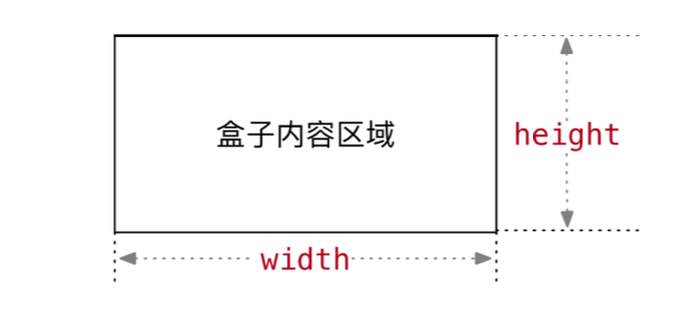

## 一、基础认识

**CSS 介绍**

CSS：层叠样式表（Cascading style sheets）
CCS 是写在 style 标签中，style 标签一般写道 header 标签里面，title 标签下面

**CSS引入方式**

- 内嵌式：css 写在 style 标签中
  - 提示：style 标签虽然可以写在页面任意位置，但是通常约定卸载 head 标签中
- 外联式：css 写在一个单独的.css 文件中
  - 提示：需要通过 link 标签在网页中引用
- 行内式：css 写在标签的 style 属性中
  - 提示：配合 js 使用

 css 常见三种引入方式的特点区别有哪些

| 引入方式 |                   书写位置                    | 作用范围 |   使用场景   |
| :------: | :-------------------------------------------: | :------: | :----------: |
|  内嵌式  |             css 写在 style 标签中             | 当前页面 |    小案例    |
|  外联式  | css 写在单独的 css 文件中，通过 link 标签引入 | 多个页面 |    项目中    |
|  行内式  |          css 写在标签的 style 属性中          | 当前标签 | 配合 js 使用 |

## 二、 选择器

### 2.1 标签选择器

结构：标签名 { css属性名: 属性值; }

作用：通过标签名，找到页面中所有这类标签，设置样式

注意点：

- 标签选择器选择的是一类标签，而不是单独一个
- 标签选择器无论嵌套关系有多深，都能找到对应的标签

### 2.2 类选择器

结构：.**类名** { css 属性名: 属性值; }

作用：通过类名，找到页面中所有带有这个类名的标签，设置样式

注意点：

- 所有标签上都有 class 属性，class 属性中的属性值称为类名
- 类名可以由数字、字母、下划线、中划线组成，但不能以数字或者中划线开头
- 一个标签可以同时有多个类名，类名之间以空格隔开
- 类名可以重复，一个类选择器可以同时选中多个标签

### 2.3 id 选择器

结构：#id 属性值 { css属性名: 属性值；}

作用：通过 id 属性值，找到页面中带有这个 id 属性值的标签，设置样式

注意点：

- 所有标签上都有 id 属性
- id 属性值类似于身份证号，在一个页面中是唯一的，不可重复
- 一个标签上只能有一个 id 属性值
- 一个 id 选择器只能选中一个标签

### 2.4 通配符选择器

结构体：* { css 属性名：属性值；}

作用：找到页面中所有的标签，设置样式

注意点：开发中使用极少，只会在极个别特殊情况才会用到

##  三、字体和文本样式

### 3.1 字体样式

- 字体大小：font-size

  - 数字+px。默认大小是 16px，例如：20px

- 字体粗细：font-weight

  - 取值：
    - 关键字：正常字体：normal；加粗字体：bold
    - 纯数字：100~900 取值的整百数。正常 400，加粗 700

- 字体样式：font-style。是否倾斜

  - 正常：normal；倾斜：italic

- 字体类型：font-family

- 字体类型：font 属性连写

  - font : style weight size family；例如：

    ```
    font: italic 700 16px 宋体;
    倾斜、加粗、16号字、宋体
    ```

    

### 3.2 文本样式

#### 3.2.1 文本缩进

属性名：text-indent

取值：

- 数字+px

- 数字+em（推荐：1em = 当前标签的 font-size 的大小）：1em 相当于一个字的大小

#### 3.2.2 文本水平对齐方式

属性名：text-align

取值：

- left：左对齐

- right：右对齐

- center：居中对齐

> text-align 可以使文本、span 标签、a 标签、input 标签、img 标签居中

> 如果需要让文本水平居中，text-align 属性给文本所在标签（文本的父元素）设置

#### 3.2.3 文本修饰

属性名：text-decoration

取值：

- underline：下划线，常用
- line-through：删除线，不常用
- overline：上划线，几乎不用
- none，无装饰线，常用

> 开发中胡使用 text-decoration： none；清除 a 标签默认的下划线

### 3.3 行高

作用：控制一行的上下间距

属性名：line-height

取值：

- 数字+px
- 倍数：当前标签 font-size 的倍数

应用：

- 让单行文本垂直居中可以设置 line-height：文字父元素高度
- 网页精准布局时，会设置 line-height：1，可以取消上下间距

> 行高与 font 连写的注意点：
>
> - 如果同时设置了行高和 font 连写，注意覆盖问题
> - font：style weight size/line-height family；

### 总结


这里出现黄色警号⚠️，说明这附近代码写错了。

出现横线代码被覆盖或者注释掉了

### 标签水平居中方法

如果需要让 div、p、h 水平居中：可以通过 margin: 0 auto; 实现

> 如果需要让 div、p、h 水平居中，直接给当前元素本身设置即可
>
> margin: 0 auto; 一般针对于固定宽度的盒子，如果大盒子没有设置宽度，此时会默认占满父元素的宽度

## 四、选择器进阶

### 4.1 后代选择器：空格

作用：根据 HTML 标签的嵌套关系，选择父元素 `后代中` 满足条件的元素

选择器语法：`选择器 1 选择器 2 { css }`

结果：在选择器 1 所找到标签后代(儿子，孙子，重孙子...)中，找到满足条件选择器 2 的标签，并设置样式

注意点：

- 后代包括：儿子，孙子，重孙子..
- 后代选择器中，选择器与选择器之前通过 `空格` 隔开

示例：

```jsx
<!DOCTYPE html>
<html lang="en">
<head>
 		 ...
     <style>
          /* 找到 div 的儿子 p,设置文字颜色是红色 */
          /* 父选择器 子选择器 {} */
          div p {
               color: red;
          }
     </style>
</head>
<body>
     <p>这是一个 p 标签</p>
     <div>
          <p>这是 div 的儿子</p>
     </div>
</body>
</html> 
```

### 4.2 子代选择器：>

作用：根据 HTML 标签的嵌套关系，选择父元素 `子代中` 满足条件的元素

选择器语法：`选择器 1 > 选择器 2 { css }`

作用：在选择器 1 所找到标签的子代(儿子)中，找到满足选择器 2 的标签，设置样式

注意点:

- 子代只包括：儿子
- 子代选择器中，选择器与选择器之前通过 > 隔开 

示例：

```
<!DOCTYPE html>
<html lang="en">
<head>
 		 ...
     <style>
          /* 找到 div 的儿子 p,设置文字颜色是红色 */
          /* 父选择器 子选择器 {} */
          div > p {
               color: red;
          }
     </style>
</head>
<body>
     <p>这是一个 p 标签</p>
     <div>
          <p>这是 div 的儿子</p>
     </div>
</body>
</html> 
```

### 4.3 并集选择器：,

作用：同事选择多组标签，设置相同的样式

选择器语法：选择器 1, 选择器 2 { css }

结果：找到选择器 1 和选择器 2 选中的标签，设置样式

注意点：

- 并集选择器中的每组选择器之间用 `,` 隔开
- 并集选择器中的每组选择器可以是基础选择器也可以是复合选择器
- 并集选择器中的每组选择器通常一行一个，提高代码的可读性

### 4.4 交集选择器：紧挨着

作用：选中页面中 同时满足 多个选择器的标签

选择器语法：选择器 1 选择器 2 { css }

结果：即又原则，找到页面中即能被选择器 1 选中，又能被选择器 2 选中的标签，设置样式

注意点：

- 交集选择器中的选择器之间是紧挨着的，没有东西分割
- 交集选择器中如果有标签选择器，标签选择器必须写在最前面

示例：

```
<!DOCTYPE html>
<html lang="en">
<head>
 		 ...
     <style>
     	   // 给 p 标签，class 是 title，设置颜色	
          p.title{
               color: red;
          }
     </style>
</head>
<body>
     <p class="tilte">这是一个 p 标签</p>
     <div>
          <p>这是 div 的儿子</p>
     </div>
</body>
</html> 
```

### 4.5 hover伪类选择器

作用：选中鼠标悬停在元素上的状态，设置样式

选择器语法：`选择器：hover {}`

注意点：伪类选择器选中的元素是某种状态，任何一个标签都可以设置伪类 hover

示例：

```jsx
<!DOCTYPE html>
<html lang="en">
<head>
     ...
     <style>
          /* 鼠标悬停的时候,a 标签 标称红色 */
          a:hover {
               color: red;
          }
     </style>
</head>
<body>
     <a href="#">鼠标悬停的时候是红色</a>
</body>
</html>
```

### 4.6 关系选择器

- 关系选择器：`h1>strong`
  - 表示选择嵌套在h1标记的子标记strong。
- 临近兄弟选择器：`h2+p`
  - 表示选择h2标记后紧邻的第一个兄弟标记p。
- 普通兄弟选择器：`p~h2`
  - 表示选择p标记所有的h2兄弟标记。
- 结构化伪类选择器：`:root`
  - 用于匹配文档根标记，使用“:root选择器”定义的样式，对所有页面标记都生效。
  - 

### 4.7 emmet 语法

作用：通过简写语法，快速生成代码

语法：类似于刚刚学习选择器的写法

|    记忆    |           示例           |                 效果                  |
| :--------: | :----------------------: | :-----------------------------------: |
|   标签名   |          `div`           |             `<div></div>`             |
|  类选择器  |          `.red`          |      `<div class=".red"></div>`       |
| id 选择器  |          `#one`          |        `<div id="one"></div>`         |
| 交集选择器 |       `p.red#one`        |     `<p class="red" i="one"></p>`     |
| 子代选择器 |         `ul>li`          |          `<ul><li></li><ul>`          |
|  内部文本  | `ul>li {我是 li 的内容}` |   `<ul><li>我是 li 的内容</li><ul>`   |
|  创建多个  |        `ul>li*3`         | `<ul><li></li><li></li><li></li><ul>` |

## 五、背景相关属性

### 5.1 背景平铺

属性名：background-repeat，bgr

属性值：

- repeat：默认值，水平和垂直方向都平铺
- no-repeat：不平铺。最常用的方式
- repeat-x：延水平方向( x 轴)平铺
- repeat-y：沿着垂直方向( y 轴)平铺

### 5.2 背景位置

属性名：background-positon，快捷方式 bgp

属性值：background-positon，水平方向位置，垂直方向位置


注意点：方位名词取值和坐标取值可以混使用，第一个取值表示水平，第二个取值表示垂直

### 5.3 背景相关属性的连写形式

属性名：background，快捷方式 bg

属性值：

- 单个属性值的合写，取值之间可以空格隔开

书写顺序：

- background: color、image、repeat、position

省略问题：

- 可以按照需要省略
- 特殊情况：在 PC 端，如果盒子大小和背景图片大小一样，此时可以直接写 background： url()

注意点：

- 如果需要设置单独的样式和连写
  - 要么把单独的样式连写的下面
  - 要么把单独的样式写在连写的里面

### 小结

背景相关属性连写：background

背景相关属性连写的取值写法：

- 单个属性值的合写，取值之间以空格隔开
- 推荐

### 拓展：img 标签和背景图片的区别

需求：需要在网页中展示一张图片的效果

方法一：直接写在 img 标签即可

- img 标签是一个标签，不设置宽高会默认以原尺寸显示

方法二：div 标签 + 背景图片

- **需要设置 div 的宽高**，因为背景图片只是装饰的 css，不能撑开 div 标签

## 六、显示模式

### 6.1 块级元素

显示特点：

- 独占一行，一行只能显示一个
- 宽度默认是父元素的宽度，高度默认由内容撑开
- 可以设置宽度

代表标签：

- div、p、h 系列、ul、li、dl、dt、dd、form、header、nav、footer...

### 6.2 行内元素

显示特点：

- 一行可以都显示多个
- 宽度和高度默认由内容撑开
- 不可以设置宽高

代表标签：

- a、span、b、u、i、s、strong、ins、em、del...

### 6.3 行内块

显示特点：

- 一行可以显示多个
- 可以设置宽高

代表标签：

- input、textarea、button、select...
- 特殊情况：img 标签有行内块元素特点，但是 Chrome 调试工具显示结果是 inline

### 6.4 元素显示模式转换

目的：改变元素默认的显示特点，让元素符合布局要求

语法：

|         属性          |       效果       | 使用频率 |
| :-------------------: | :--------------: | :------: |
|    display: block     |  转换成块级元素  |   较多   |
| display: inline-block | 转换成行内块元素 |   较多   |
|    display: inline    |  转换成行内元素  |   极少   |

示例：

```
....
<style>
		div {
			
			display: block;
		}
</style>
....
```

### HTML 嵌套规范注意点

- 块级元素一般作为大容器，可以嵌套：文本、块级元素、行内元素、行内块元素等等
  - 但是：p 标签中不能嵌套 div、p、h 等块级元素
- a 标签内可以嵌套任何元素
  - 但是：a 标签不能嵌套 a 标签

## 七、CSS 特性

 ### 7.1 继承性

特性：子元素有默认继承父元素样式的特点

可以继承的常见属性：文字控制属性都可以继承

- color
- font-style、font-weight、font-size、font-family
- text-indent、text-align
- line-height
- ....

> 注意点：
>
> - 可以通过调试工具判断样式是否可以继承
> - 如果元素有浏览器默认样式，此时继承性依然存在，但是
>   - a 标签的 color 会继承失效
>   - h 系列标签的 font-size 会继承失效

### 7.2 层叠性

特性：

- 给同一个标签设置不同的样式，此时样式会层叠叠加，会共同作用到标签上
- 给同一个标签设置相同的样式，此时样式会层叠覆盖，最终写在最后的样式会生效

> 当样式冲突时，只有当选择器优先级相同时，才会通过层叠性判断结果

 ## 八、CSS布局

### 8.1 优先级

特性：不同选择器具有不同的优先级，优先级高的选择器会覆盖优先级低的选择器样式

优先级公式：

- 继承 < 通配符选择器 < 标签选择器 < 类选择器 <  id 选择器 < 行内样式 < !important

> 注意点：
>
> -  !important 写在属性值的后面，分号的前面！
> -  !important 不能提升继承的优先级，**只要是继承优先级最低！**
> - 实际开发中不建议使用 !important！！

 ### 8.2 权重叠加计算

场景：如果是复合选择器，此时需要通过权重叠加计算方法，判断最终哪个选择器优先级最高位生效

权重叠加计算公式：每一级之间不存在进位


比较规则：

- 先比较第一级数字，如果比较出来了，之后的统统不看
- 如果第一级数字相同，此时再去比较第二级数字，如果比较出来了，之后的统统不看
- ....
- 如果最终所有数字都相同，表示优先级相同，则比较层叠性：谁写在下面，谁说了算

> 注意：** !important 如果不是继承，则权重最高！！**

示例：

```
```


## 九、盒子模型

### 9.1 盒子模型介绍

**盒子的概念**

页面中每一个标签都可以看做是一个”盒子“，通过盒子的视角更方便的进行布局，浏览器在渲染(显示)网页时，会将网页中的元素看做是一个个的矩形区域，我们也形象的称之为 `盒子`。


**盒子模型**

CSS 中规定每个盒子分别由：内容区域（content）、内边距区域（padding）、边框区域（border）、外边距区域（margin）构成，这就是盒子模型。


### 9.2 内容的宽度和高度

作用：利用 widht 和 height 属性默认设置盒子的 内容区域 的大小

属性：width、height

常见取值：数字+px




### 9.3 边框：border

#### 9.3.1 单个属性

作用：给设置边框粗细、边框样式、边框颜色效果

单个属性

|   作用   |    属性名    |                属性值                 |
| :------: | :----------: | :-----------------------------------: |
| 边框粗细 | border-width |                数字+px                |
| 边框样式 | border-style | 实现 solid、虚线 dashed、点线、dotted |
| 边框颜色 | border-color |               颜色取值                |


#### 9.3.1 连写形式

属性名：border

属性值：单个取值的连写，取值之间以空格隔开

- 如：border：10px solid red;

快捷键：bd + tab


#### 9.3.2 单方向设置

属性名：border

场景：只给盒子的某个方向单独设置边框

属性名：border - 方位名词

属性值：连写的取值


#### border 总结

给盒子设置四周 20 像素、实线、蓝色的边框，属性应该如何设置？

- border： 20 solid blue;

给盒子设置上边框 10 像素、虚线、黄色的边框，属性应该如何设置？

- border-top：10px dashed yellow;


### 9.4 内边距：padding

作用：设置 `边框` 与 `内容区域` 之间的距离

属性名：padding

常见取值：

|  取值  |             示例              |                        含义                        |
| :----: | :---------------------------: | :------------------------------------------------: |
| 一个值 |        padding：10px;         |               上下左右都设置为 10px                |
| 两个值 |      padding：10px 20px;      |          上下设置为 10px，左右设置为 20px          |
| 三个值 |   padding：10px 20px 30px;    |      上设置 10px，左右设置 20px，下设置 30px       |
| 四个值 | padding：10px 20px 30px 40px; | 上设置 10px，右设置 20px，下设置 30px，左设置 40px |

记忆规则：

**从上开始赋值，然后顺时针赋值，如果设置赋值的，看对面的**


#### 9.4.1 单方向设置

场景：只给盒子的某个方向单独设置内边距

属性名：padding - 方位名词

属性值：数字+px


### 9.5 CSS3 盒子模型：自动内减

需求：盒子尺寸 300 * 300，背景粉色，边框 10px 实线黑色，上下左右 20px 的内边距，如何完成?

- 给盒子设置 border 或者 padding 时，盒子会被撑大，如果不想盒子被撑大？

**解决方法一：手动内减**

- 操作：自己计算多余大小，手动在内容中减去
- 缺点：项目中计算量太大，很麻烦

**解决方法二：自动内减**

- 操作，给盒子设置属性 box-sizing：border-box; 即可
- 优点：浏览器会自动计算多余大小，自动在内容中减去


### 9.6 外边距：margin - 取值

作用：设置边框以外，盒子与盒子之间的距离

属性名：margin

常见取值：

|  取值  |             示例             |                        含义                        |
| :----: | :--------------------------: | :------------------------------------------------: |
| 一个值 |        margin：10px;         |               上下左右都设置为 10px                |
| 两个值 |      margin：10px 20px;      |          上下设置为 10px，左右设置为 20px          |
| 三个值 |   margin：10px 20px 30px;    |      上设置 10px，左右设置 20px，下设置 30px       |
| 四个值 | margin：10px 20px 30px 40px; | 上设置 10px，右设置 20px，下设置 30px，左设置 40px |

记忆规则：

**从上开始赋值，然后顺时针赋值，如果没有赋值，看对面的！！**

版心居中：margin：0 auto;

#### 9.6.1 单方向设置

场景：只给盒子的某个方向设置外边框

属性名：margin - 方位名词。例如：margin-left

属性值：数字+px

**单方向设置的应用**

|   方向   |     属性      |         效果         |
| :------: | :-----------: | :------------------: |
| 水平方向 |  margin-left  |  让当前盒子往右移动  |
| 水平方向 | margin-right  | 让右边的盒子往右移动 |
| 垂直方向 |  margin-top   |  让当前盒子往下移动  |
| 垂直方向 | margin-bottom | 让下面的盒子往下移动 |


#### 外边距折叠现象：合并现象

场景：垂直布局的块级元素，上下的 margin 会合并

结果：最终两者距离为 margin 的最大值

解决方法：避免就好，只给其中一个盒子设置 margin 即可。


#### 外边距折叠现象：塌陷现象

场景：互相嵌套的块级元素，子元素的 margin-top 会作用在父元素上

结果：导致父元素一起往下移动

解决方法：

- 给父元素设置 border-top 或者 padding-top （分割父子元素的 margin-top）
- 给父元素设置 overflow：hidden
- 转换成行内块元素
- 设置浮动


#### 行内元素的 margin 和 padding 无效情况

场景：给行内元素设置 margin 和 padding 时

结果：

- 水平方向的 margin 和 padding 布局中有效
- 垂直方向的 margin 和 padding 布局中无效


### 布局方式建议：

- 由外到内

- 先宽高背景色

- 放内容

- 调节内容的位置

- 控制文字细节


## 十、浮动

### 10.1 结构伪类选择器

**目标：能够使用 `结构伪类选择器` 在 HTML 中定位元素**

1. 作用与优势

   1. 作用：根据元素在 HTML 中的结构关系查找元素
   2. 优势：减少对于 HTML 中类的依赖，有利于保持代码整洁
   3. 场景：常用于查找某父级选择器中的子元素

2. 选择器：

   |          选择器          |                     说明                     |
   | :----------------------: | :------------------------------------------: |
   |    `E:first-child {}`    |   匹配父元素中第一个子元素，并且是 E 元素    |
   |    `E:last-child {}`     |  匹配父元素中最后一个子元素，并且是 E 元素   |
   |   `E:nth-child(n) {}`    |   匹配父元素中第 n 个子元素，并且是 E 元素   |
   | `E:nth-last-child(n) {}` | 匹配父元素中倒数第 n 个子元素，并且是 E 元素 |

   n 的注意点：

   1. n 为：0、1、2、3、4、5、6.....

   2. 通过 n 可以组成常见公式：

      |       功能        |      公式       |
      | :---------------: | :-------------: |
      |       偶数        |    2n、even     |
      |       奇数        | 2n+1、2n-1、odd |
      |    找到前 5 个    |      -n+5       |
      | 找到从第 5 个往后 |       n+5       |

      > 2也可以是其他数字，包括 5 也可以是其他数字

示例：

```jsx
<!DOCTYPE html>
<html lang="en">
<head>
	   ....
     <style>
          /* 选中第一个 */
          li:first-child {
               background-color: green;
          }
          /* 选中最后一个 */
          li:last-child {
               background-color: red;
          }
          /* 任意一个 */
          li:nth-child(3) {
               background-color: yellow;
          }
          /* 倒数第 x 个 */
          li:nth-last-child(2) {
               background-color: brown;
          }
     </style>
</head>
<body>
     <ul>
          <li>这是第1个li</li>
          <li>这是第2个li</li>
          <li>这是第3个li</li>
          <li>这是第4个li</li>
          <li>这是第5个li</li>
          <li>这是第6个li</li>
          <li>这是第7个li</li>
          <li>这是第8个li</li>
     </ul>
</body>
</html>
```


公式示例：

```jsx
<style>
      li:nth-child(2n) {
           background-color: aliceblue;
      }
      li:nth-child(2n+1) {
           background-color: red;
      }
 </style>
```


####  结构伪类选择器的易错点

**示例一**

代码：

```jsx
 <ul>
      <li><a href="#">我是第1个a标签</a></li>
      <li><a href="#">我是第2个a标签</a></li>
      <li><a href="#">我是第3个a标签</a></li>
      <li><a href="#">我是第4个a标签</a></li>
      <li><a href="#">我是第5个a标签</a></li>
      <li><a href="#">我是第6个a标签</a></li>
      <li><a href="#">我是第7个a标签</a></li>
      <li><a href="#">我是第8个a标签</a></li>
 </ul>
```

找到一个 a 标签：

```jsx
<style>
	 li:first-child a {
				background-color: red;
   }
</style>
```

**示例二**

代码：

```jsx
<ul>
    <li>
         <a href="#">我是第1个a标签</a>
         <a href="#">我是第2个a标签</a>
         <a href="#">我是第3个a标签</a>
         <a href="#">我是第4个a标签</a>
         <a href="#">我是第5个a标签</a>
    </li>
    <li><a href="#">我是第2个a标签</a></li>
    <li><a href="#">我是第3个a标签</a></li>
    <li><a href="#">我是第4个a标签</a></li>
    <li><a href="#">我是第5个a标签</a></li>
    <li><a href="#">我是第6个a标签</a></li>

</ul>
```

选中第 3 个 a

```jsx
<style>
    li:first-child a:nth-child(3) {
         background-color: red;
    }
</style>
```


### 10.2 伪元素

**目标：能够使用 `伪元素` 在网页中创建内容**

伪元素：一般页面中的非主体内容可以使用伪元素，一般用于网页中不重要的小图一般用伪元素

区别：

- 元素：HTML 设置的标签
- 伪元素：由 CSS 模拟出的标签结果

种类：

|  伪元素  |               作用               |
| :------: | :------------------------------: |
| ::before | 在父元素内容的最前添加一个伪元素 |
| ::after  | 在父元素内容的最后添加一个伪元素 |

注意点：

- 必须设置 content 属性才能生效
- 伪元素默认是行内元素

示例：

```jsx
<!DOCTYPE html>
<html lang="en">
<head>
     ....
     <style>
          .father {
               width: 300px;
               height: 300px;
               background-color: pink;
          }
          /* 通过伪元素,在爱的前面加上老鼠 */
          .father::before {
               content: "老鼠";
          }
          /* 通过伪元素,在爱的后面加上大米 */
          .father::after {
               content: "大米";
          }
     </style>
</head>
<body>
     <!-- 伪元素,通过 css 创建创建标签,装饰性的不重要的小图 -->

     <!-- 要找父级,在这个父级里面创建子级标签 -->
     <div class="father">爱</div>

     <!-- 老鼠老鼠爱大米 -->
      
</body>
</html>
```

### 10.3 标准流

**目标：能够认识标准流的默认排布方式及其特点**

标准流：又称文档流，是浏览器在渲染显示网页内容时默认采用的一套排版规则，规定了应该以何种方式排列元素

常见标准流排班规则：

- 块级元素：从上往下，垂直布局，独占一行
- 行内元素 或者 行内块元素：从左往右，水平布局，空间不够自动折行


### 10.4 浮动

作用：网页布局。让垂直布局的盒子变成水平布局。

属性名：float

属性值：

| 属性名 |  效果  |
| :----: | :----: |
|  left  | 左浮动 |
| right  | 右浮动 |

示例：

```jsx
 <style>
      div {
           width: 100px;
           height: 100px;
      }
      .one {
           background-color: pink;
           float: left; 
      }
      .two {
           background-color: skyblue;
           float: left;
      }
 </style>
```


#### 10.4.1 浮动的特点

1. 浮动元素会脱离标准流(简称脱标)，在标准流中不占位置。相当于从地面飘到空中
2. 浮动元素比标准流高半个级别，可以覆盖标准中的元素
3. 浮动找浮动，下一个浮动元素会在上一个浮动元素后面左右浮动
4. 浮动元素有特殊的显示效果
   - 一行可以显示多个
   - 可以设置宽高

> 注意点：
>
> - 浮动的元素不能通过 text-align：center 或者 margin：0 auto
> - 浮动后的标签具备行内块特点，但是比行内块高半个级别

#### 案例

```jsx
<!DOCTYPE html>
<html lang="en">
<head>
     <meta charset="UTF-8">
     <meta http-equiv="X-UA-Compatible" content="IE=edge">
     <meta name="viewport" content="width=device-width, initial-scale=1.0">
     <title>Document</title>
     <style>
          .header {
               width: 1226px;
               height: 100px;
               background-color: #ffc0cb;
               margin: 0 auto;
          }
          .content {
               width: 1226px;
               height: 460px;
               background-color: #333;
               margin: 0 auto;
          }
          .one {
               width: 234px;
               height: 460px;
               background-color: #ffa500;
               float: left;
          }
          .two {
               width: 992px;
               height: 460px;
               background-color: #87ceeb;
               
               float: left;
          }
     </style>
</head>
<body>
     
     <div class="header">头部</div>
     <div class="content">
          <div class="one"></div>
          <div class="two"></div>
     </div>
</body>
</html>
```


#### 综合案例

```jsx
<!DOCTYPE html>
<html lang="en">
<head>
     <meta charset="UTF-8">
     <meta http-equiv="X-UA-Compatible" content="IE=edge">
     <meta name="viewport" content="width=device-width, initial-scale=1.0">
     <title>Document</title>
     <style>
          * {
               margin: 0;
               padding: 0;
          }
          .box {
               margin: 0 auto;
               width: 1226px;
               height: 614px;
               /* background-color: pink; */
          }
          .left {
               float: left;

               width: 234px;
               height: 614px;
               background-color: #800080;
          }

          .right {
               float: right;

               width: 978px;
               height: 614px;
               /* background-color: green; */
          }
          ul {
               /* 去掉列表的符号 */
               list-style: none;
          }
          .right li {
               float: left;

               margin-right: 14px;
               margin-bottom: 14px; 
               width: 234px;
               height: 300px;
               background-color: #87ceeb;
          }
          /* 如果父级的宽度不够,子级会自动换行 */
          /* 第四个 li 和第八个 li 右侧间距清除 */
          .right li:nth-child(4n) {
               margin-right: 0;
          }

     </style>
</head>
<body>
     
     <div class="box">
          <div class="left"></div>
          <div class="right">
               <ul>
                    <li></li>
                    <li></li>
                    <li></li>
                    <li></li>
                    <li></li>
                    <li></li>
                    <li></li>
                    <li></li>
               </ul>
          </div>
     </div>
</body>
</html>
```


### CSS 的书写顺序

按下面的顺序写，浏览器的执行效率会更高

- 放浮动、display
- 放盒子模型：marigin、border、padding、width、height
- 文字样式


### 书写网页导航步骤

- 清除默认的 margin 和 padding
- 找到 ul，去除小圆点
- 找到 li 标签，设置浮动让 li 一行中显示
- 找到 a 标签，设置宽高 --> a 标签默认是行内元素，默认不能设置宽高
  - 方法一：给 a 标签设置 display：inline-block
  - 方法二：给 a 标签设置 display：block
  - 方法三：给 a 标签设置 float：left


## 十一、清除浮动

### 11.1 清除浮动的介绍

含义：清除浮动带来的影响

- 影响：如果子元素浮动了，此时子元素不能撑开标准流的块级父元素

原因：

- 子元素浮动后脱标，不占位置

目的：需要父元素有高度，从而不影响其他网页元素的布局


### 11.2 清除浮动的方法

**直接设置父元素高度**

特点：

- 优点：简单粗暴、方便
- 缺点：有些不居中 不能固定父元素高度。如：新闻列表、京东推荐模块


**额外标签法**

操作：

- 给父元素内容的最后添加一个块级元素
- 给添加的块级元素设置 clear:both

特点：

- 缺点：会在页面中添加额外的标签，会让页面的 HTML 结构变得复杂。


**单伪元素清除法**

操作：用伪元素替代了额外标签

基本写法：

```jsx
.clearfix::after {
	  content: '';
 		display: block;
  	clear: bothl
}
```

补充写法：

```jsx
.clearfix::after {
 		content: '';
 		display: block;
  	clear: bothl
    
     /* 补充代码：在网页中看不到伪元素 */
    height: 0;
  	visibility: hidden;
}
```

特点：

- 优点：项目中使用，直接给标签加类即可清除浮动


**双伪元素清除法**

操作：

```jsx
.clearfix::before，  
.clearfix::after {
 		content: '';
 		display: table;
  
}

.clearfix::after {
  	clear: bothl
}
```

特点：

- 优点：项目中使用，直接给标签加类即可清除浮动


**给父元素设置 overflow：hidden**

操作：

- 直接给父元素设置 overflow：hidden

特点：

- 优点：方便

#### 总结

清除浮动的方法：

- 直接给父元素设置高度
- 额外标签法：clear: both，清除左右浮动带来的影响
- 单伪元素清除法
- 双伪元素清除法
- 给父元素设置：overflow：hidden

  

## 十二、网页制作流程

### 12.1 根目录

**目标：能根据项目需求创建根目录**

**根目录：网站的第一级文件夹**

1. 图片文件夹：images
2. 样式文件夹：CSS
3. 首页：index.html

```jsx
<link rel="stylesheet" href="./css/index.css">
```


### 12.2 布局流程

**目标：掌握网页布局基本步骤**

- 从外到内，从上到下
- css 美化
  - 宽度、高度、背景色 ---> 调整位置
  - 放内容  --->  调整内容位置  --->  调整细节（文字样式等等）

### css 默认设置

```jsx
<!--  -->
* {
     margin: 0;
     padding: 0;
  		<!-- 内减模式，防止撑大 -->
     box-sizing: border-box;
}

<!-- 去除下划线 -->
a {
     text-decoration: none;
}

<!-- 去除默认样式小圆点 -->
ul {
     list-style: none;
}
 
<!-- 去除浮动的影响 -->
.clearfix::before, .clearfix::after {
     content: "";
     display: table;
}

<!-- 去除浮动的影响 -->
.clearfix::after {
     clear: both;
}

body {
     background-color: #f3f5f7;
}
```

## 十三、定位

**目标：能够说出定位的常见应用场景，并且能够说出不同定位方式的特点**

学习路径：

- 定位的基本介绍
- 定位的基本使用
- 静态定位
- 相对定位
- 绝对定位
- 子绝父相
- 固定定位
- 元素的层级关系

### 13.1 定位的基本介绍

**1. 标准流**

- 块级元素独占一行 -- 垂直布局
- 行内元素/行内块元素一行显示多个 -- 水平布局

**2. 浮动**

- 可以让原本垂直布局的块级元素变成水平布局

**3. 定位**

- 可以让元素自由的摆在网页的任意位置
- 一般用于盒子之间的层叠情况
- 

**定位的常见应用场景**

**可以解决盒子与盒子之间的层叠问题**

- 定位之后的元素层级最高，可以层叠在其他盒子上面

**可以让盒子使用固定在屏幕中的某个位置**


### 13.2 定位的基本使用

#### 13.2.1 使用定位的步骤

**1. 设置定位方式**

属性名：`position`

常见属性值：

| 定位方式 |  属性值  |                 相对与谁移动                  |   是否占位置   |
| :------: | :------: | :-------------------------------------------: | :------------: |
| 静态定位 |  static  |             不能通过方位属性移动              |     占位置     |
| 相对定位 | relative |           相对于自己原来的位置移动            |     占位置     |
| 绝对定位 | absolute |      相对于最近的且有定位的祖先元素移动       | 不占位置--脱标 |
| 固定定位 |  fixed   |           相对于浏览器可视区域移动            | 不占位置--脱标 |
| 粘性定位 |  sticky  | 在 CSS 中的表现类似于吸附。常见效果吸顶、吸底 |                |

**2. 设置偏移值**

偏移值设置分为两个方向，水平和垂直各选一个使用即可

选取的原则一般是就近原则：离哪个近用哪个

| 方向 | 属性名 | 属性值  |      含义      |
| :--: | :----: | :-----: | :------------: |
| 水平 |  left  | 数字+px | 距离左边的距离 |
| 水平 | right  | 数字+px | 距离右边的距离 |
| 垂直 |  top   | 数字+px | 距离上边的距离 |
| 垂直 | bottom | 数字+px | 距离下边的距离 |

#### 13.2.2 静态定位：static

介绍：静态定位是默认值，就是之前认识的标准流

代码：position：static；

注意点：

- 静态定位就是之前的标准流，不能通过方位属性进行移动

- 之后说的的定位不包括静态定位，一般特指后几种：相对、绝对、固定

  

### 13.3 相对定位：relative

介绍：自恋型定位，相对自己之前的位置进行移动

代码：position: relative;

特点：

- 需要配合方位属性实现移动
- 相对于自己原来位置进行移动
- 在页面中占位置 -- 没有脱标
- 占有原来的位置
- 仍然具有标签原有的显示模式特点

应用场景：

- 配合绝对定位组 CP（子绝父相）
- 用于小范围的移动

示例：

```jsx
<style>   
		.box {
  			position: relative;
    		left: 100px;
    		top: 200px
	  }  
<\style>
```


### 13.4 绝对定位：absolute

介绍：拼爹型定位，相对于非静态定位的父元素进行定位移动

代码：postion: absolute;

特点：

- 需要配合方位属性实现移动
- 默认相对于浏览器可视区域进行移动
- 在页面中不占位置---已经脱标

应用场景：

- 配合绝对定位组 CP（子绝父相）


### 13.5 子绝父相

场景：让子元素相对父元素进行自由移动

含义：

- 子元素：绝对定位
- 父元素：相对定位

子绝父相好处：

- 父元素是相对定位，则对网页布局影响最小

**子绝父相特殊场景：**

场景：在使用子绝父相的时候，发现父元素已经有绝对定位了，此时直接子绝即可：

原因：父元素已经有定位已满足要求，如果盲目修改父元素定位方式，可能会影响之前的布局。


### 子绝父相水平居中案例-解决方法

1. 子绝父相
2. 先让子盒子往右移动父盒子的一半
   - left：50%
3. 再让子盒子往左移动自己的一半
   - 普通做法：margin-left ： 负的子盒子宽度的一半
     - 缺点：子盒子宽度变化后需要重新改代码
   - 优化做法：transform：translateX(-50%)
     -  优点：表示沿着 X 轴方向(往左)始终移动自己宽度的一半，子盒子宽度变化不需要更新代码


### 13.6 固定定位

介绍：死心眼定位，相对于浏览器进行定位移动

代码：positon: fixed;

特点：

- 需要配合方位属性实现移动
- 相对于浏览器可视区域进行移动
- 在页面中不占位置---已经脱标

应用场景：

- 让盒子固定在屏幕中的某个位置


### 13.7 粘性定位：sticky

position:sticky 是 css 定位新增属性；可以说是 static（没有定位） 和 固定定位 fixed 的结合；它主要用在对 scroll 事件的监听上；简单来说，在滑动过程中，某个元素距离其父元素的距离达到 sticky 粘性定位的要求时(比如top：100px)；position:sticky这时的效果相当于fixed定位，固定到适当位置。

注意点：

- `sticky` 只能在父容器为 `overflow: scroll`中使用, 而且会根据最近的父容器 (`overflow:scroll`) 产生效果
- 必须规定 `top`, `left` ,`right`, `bottom` 中的一种, 否则 `stikcy` 定位相当于 `relative`
- 如果定义了 `top` 或`bottom` 属性. 那么父容器 `height`不能低于 `top` 或者 `bottom`的值
- `sticky` 属性目前在安卓上适配度不高, 所以 web 在安卓上慎用 sticky 属性

```
// 吸顶效果

position: sticky;
top: 0
z-index:999 // 防止被覆盖
```


### 13.8 元素的层级关系

#### 元素层级问题

不同布局方式元素的层级关系：

- 标准流 < 浮动 < 定位

不同定位之间的层级关系

- 相对、绝对、固定默认层级相同
- 此时 HTML 中写在下面的元素层级更高，会覆盖上面的元素


#### 更改定位元素的层级

场景：改变定位元素的层级

属性名：z-index

属性值：数字。数值越大，层级越高


## 十四、装饰

学习路径：

- 垂直对齐方式
- 光标类型
- 边框圆角
- overflow 溢出部分显示效果
- 元素本身隐藏 


### 14.1 认识基线

基线：浏览器文字类型元素排版中存在用于对齐的基线：baseline


### 14.2 装饰--文字对齐问题

场景：解决行内/行内块元素垂直对齐问题

问题：当图片和文字在一行显示时，其实底部不是对齐的


### 14.3 装饰--垂直对齐方式

属性名：vertical-align

属性值：

|  属性值  |      效果      |
| :------: | :------------: |
| baseline | 默认，基线对齐 |
|   top    |    顶部对齐    |
|  middle  |    中部对齐    |
|  bottom  |    底部对齐    |

### 项目中 vertical-algin 可以解决的问题

- 文本框和表单按钮无法对齐问题
- input 和 img 无法对齐问题
- div 中的文本框，文本框无法贴顶问题
- div 不设高度由 img 标签撑开，此时 img 标签下面会存在额外间隙问题
- 使用 line-hegiht 让 img 标签垂直居中问题

注意点：

- 学习浮动之后，不推荐使用行内块元素让 div 一行中显示，因为可能会出现垂直对齐问题
- 推荐优先使用浮动完成效果


### 14.4 装饰--光标类型

场景：设置鼠标光标在元素上时显示的样式

属性名：cursor

常见属性值：

| 属性值  |             效果             |
| :-----: | :--------------------------: |
| default |      默认值，通常是箭头      |
| pointer |  小手效果，提示用户可以点击  |
|  text   | 工字型，提示用户可以选择文字 |
|  move   |  十字光标，提示用户可以移动  |


### 14.5 装饰--边框圆角

场景：让盒子四个角变得圆润，增加页面细节，提升用户体验

属性名：border-radius

常见取值：数字+px、百分比

原理：


赋值规则：从左上角开始赋值，然后顺时针赋值，没有赋值的看对角！

```jsx
border-radius: 10px, 20px, 30px, 40px;
// 4值：左上  右上  右下  左下 --- 从左上角顺时针转一圈

border-radius: 10px;
// 每个角的圆角都是 10px

border-radius: 10px， 40px， 80px;
// 4值：左上10px  右上40px  右下80px  左下40px --- 从左上角顺时针转一圈

border-radius: 10px， 40px;
// 4值：左上10px  右上40px  右下10px  左下40px --- 从左上角顺时针转一圈
```


#### 边框圆角的常见应用 

画一个正圆：

- 盒子必须是正方形
- 设置边框圆角为盒子宽高的一般--border-radius：50%

胶囊按钮：

- 盒子要求是长方形
- 设置---border-radius：盒子高度的一半


### 14.6 overflow 溢出部分显示效果

溢出部分：指的是盒子内容部分所超出盒子范围的区域 

场景：控制内容溢出部门的显示效果，如：显示、隐藏、滚动条。。。。

属性名：overflow

常见属性值：

| 属性值  |                  效果                  |
| :-----: | :------------------------------------: |
| visible |          默认值，溢出部分可见          |
| hidden  |              溢出部分隐藏              |
| scroll  |       无论是否溢出，都显示滚动条       |
|  auto   | 根据是否移除吗，自动显示或者隐藏滚动条 |


### 14.7 元素本身隐藏

常见：让元素本身在屏幕中不可见。如：鼠标：hover 之后元素隐藏

常见属性：

- visibility：hidden
- display：none

区别：

- visibility：hidden 隐藏元素本身，并且在网页中占位置
- display：none ，隐藏元素本身，并且在网页中不占位置

注意点：

- 开发中经常会通过 display 属性完成元素的显示隐藏切换
- display：none；隐藏、display：block；显示


#### 元素整体透明度

场景：让元素整体（包括内容）一起变透明

属性名：opacity

属性值：0 ~ 1之间的数字

- 1：表示完全不透明
- 0：表示完全透明

注意点：

- opacity 会让元素整体透明，包括里面的内容。如：文字、子元素等


#### 边框合并

场景：让相邻表格边框进行合并，得到细线边框效果

代码：border-collapse：collapse；


## 十五、选择器拓展

### 15.1 链接伪类选择器

场景：常用于选中超链接的不同状态

选择器语法：

|  选择器语法  |           功能            |
| :----------: | :-----------------------: |
|  a:link {}   | 选中 a 链接未访问过的状态 |
| a:visited {} | 选中 a 链接访问之后的状态 |
|  a:hover {}  |    选中鼠标悬停的状态     |
| a:action {}  |    选中鼠标按下的状态     |

注意点：

- 如果需要同时实现以上四种伪类状态效果，需求按照 LVHA 顺序书写
  -  记忆口诀：男朋友送了你一个 LV 包，你开心的 Ha 哈笑

- 其中 :hover 伪类选择器使用更为频繁，常用于选择各种元素的悬停状态


### 15.2 焦点伪类选择器

场景：用于选中元素获取焦点时的状态，常用于表单控件

选择器语法：

```jsx
input: focus {
  	background-color:xxx;
}
```

效果：表单控件获取焦点时会默认显示外框轮廓线


### 15.3 属性选择器

场景：通过元素上的 HTML 属性来选择元素，常用于选择 input 标签

选择器语法：

|    选择器     |                      功能                      |
| :-----------: | :--------------------------------------------: |
|    E[attr]    |           选择具有attr 属性的 E 元素           |
| E[attr=“val”] | 选择具有 attr 属性并且属性值等于 val 的 E 元素 |


## 十六、属性选择器

CSS **属性选择器**通过已经存在的属性名或属性值匹配元素。

```jsx
/* 存在title属性的<a> 元素 */
a[title] {
  color: purple;
}

/* 存在href属性并且属性值匹配"https://example.org"的<a> 元素 */
a[href="https://example.org"] {
  color: green;
}

/* 存在href属性并且属性值包含"example"的<a> 元素 */
a[href*="example"] {
  font-size: 2em;
}

/* 存在href属性并且属性值结尾是".org"的<a> 元素 */
a[href$=".org"] {
  font-style: italic;
}

/* 存在class属性并且属性值包含以空格分隔的"logo"的<a>元素 */
a[class~="logo"] {
  padding: 2px;
}
```

语法：

- `[xxx]`：表示带有以xxx 属性的元素。例如：a[title] 表示存在 title 属性的 a 元素
- `[xxx=value]`：表示带有以 xxx 命名的属性，且属性值是 value 的元素

- `[xxx~=value]`：表示带有以 xxx 命名的属性的元素，并且该属性是一个以空格作为分隔的值列表，其中至少有一个值为 value。

更多语法看：https://developer.mozilla.org/zh-CN/docs/Web/CSS/Attribute_selectors


## 额外补充

### 消除按钮默认效果

```
button {
		...
		outline: none;
		border: none;
}
```


### 文字最后...

```css
// 文字不允许换行：单行文本
white-space: nowrap;
// 溢出部分隐藏
overflow: hidden;
// 文本溢出后，使用 ... 代替
text-overflow: ellipsis;
```


