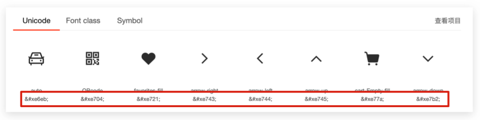
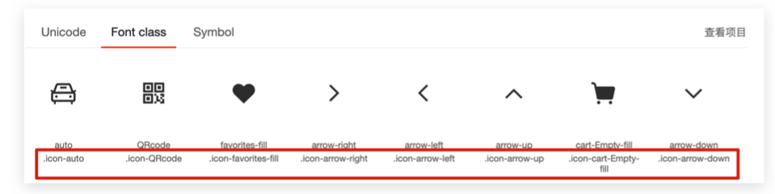
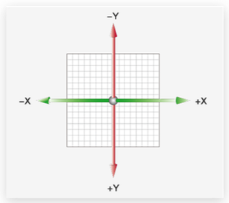
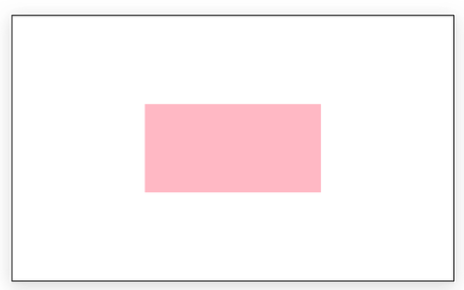

## 一、字体图标

目的：使用字体图标技巧实现网页中简洁的图标效果

字体图标：

- 字体图标展示的是图标，本质是字体
- 处理简单、颜色单一的图片

优点：

- 灵活性：灵活地修改样式，例如：尺寸、颜色等
- 轻量级：体积小、渲染快、降低服务器请求次数
- 兼容下：几乎兼容所有主流的浏览器
- 使用方便：
  - 下载字体包
  - 使用字体图标

图标库：Iconfont：https://www.iconfont.cn/

### 1.1 字体图标：Iconfont

下载字体包：

- 登录(新浪微博) → 选择图标库 → 选择图标，加入购物车 → 购物车 → 添加至项目 → 下载至本地

使用字体图标：

- Unicode 编码

  

- 类名

  


**Unicode 编码：**

- 引入样式表：iconfont.css

- 复制黏贴图标对应的 Unicode 编码

  - `<span>&#xe6f8;</span>`

- 设置文字字体

  ```jsx
  span {
  	font-family: 'iconfont';
  }
  ```


**类名：**

- 引入字体图标样式表
  - `<link rel="stylesheet" href="./iconfont.css">`
- 调用图标对应的类名，必须调用 2 个类名
  - iconfont 类：基本样式、包含字体的使用等
  - icon-xxx：图标对应的类名
  - `<span class="iconfont icon-xxx"></span>`


## 二、平面转换

目标：使用 transform 属性实现元素的位移、旋转、缩放等效果

平面转换：

- 改变盒子在平面上的形态：位移、旋转、缩放等
- 2D 转换

平面转换属性：transform

### 2.1 位移

目标：使用transform 实现元素的位移效果

语法：

- transform ： translate (水平移动距离，垂直移动距离);

取值：正负均可

- 像素单位数值
- 百分比（参照物为盒子自身尺寸）
- 注意：X 轴正向向右，Y 轴正向为下

​	

技巧：

- translate() 如果只给出一个值，表示 x 轴方向移动距离
- 单独设置某个方向的移动距离：translateX() & translateY()

#### 位移：绝对定位居中

目标：使用 translate 快速实现绝对定位的元素居中效果

实现方法：

```jsx
position： absolute;
left: 50%;
top: 50%;

margin-left: -100px;
margin-top: -50px;

widht： 200px;
height：100px;
```



**使用 translate 的核心代码：**

```jsx
position: absolute;
left: 50%;
top: 50%;
transform: translate(-50%, -50%);

widht： 200px;
height：100px;
```

原理：位移取值为百分比数值，参照盒子自身尺寸计算移动距离。

### 2.2 旋转

目标：使用 transform 的 rotate 实现元素旋转效果。

语法：transform：rotate(角度);

> 注意：角度的单位是 deg
>
> 例如：transform：rotate(100deg); 顺时针旋转 100 度

技巧：取值正负均可

- 取值为正，则顺时针旋转
- 取值为负，则逆时针旋转

### 2.3 转换原点

目标：使用 transform-orign 属性改变转换原点

语法：

- 默认圆点是盒子中心点
- transform-orgin：原点水平位置，原点垂直位置

示例：

```jsx
// 以坐下为圆点
transform-origin: left bottom;
```

取值：

- 方位名词：left、right、top、bottom、center
- 像素单位数值
- 百分比(参照盒子自身尺寸计算)

### 2.4 多重转换

目标：使用 transform 复合属性实现多形态转换

多重转换技巧：

- transform：translate()  rotate();

多重转换原理：

- 旋转会改变网页元素的坐标轴向
- 先写旋转，则后面的转换效果的轴向以旋转后的轴向为准，会影响转换结果

### 2.5 缩放

目标：使用 scale 改变元素的尺寸

语法：

- transform：scale(x轴缩放倍数，y 轴缩放倍数);

技巧：

- 一般情况下，只为 scale 设置一个值，表示 x 轴或者 x 轴等比例缩放

  - transform：scale(缩放倍数)；
  - scale 值大于 1 表示放大，scale 值小余 1 表示缩小

  

## 三、渐变

目标：使用 background-image 属性实现渐变背景效果

渐变是多个颜色逐渐变化的视觉效果

一般用于设置的背景

```jsx
background-image:linear-gradient(
	颜色 1，
  颜色 2
);
```

语法：

```jsx
background-image:linear-gradient(
  <!-- 透明 -->
	transparent,
  颜色 2
);
```


