## 一、Flex 布局

目标：能够使用 Flex 布局模型灵活、快速的开发网页

Flex 布局/弹性布局：

- 是一种浏览器提倡的布局模型
- 布局网页更简单、灵活
- 避免浮动脱标的问题

### 1.1 Flex 布局模型构成

作用：

- 基于 Flex 精确灵活控制块级盒子的布局方式，避免浮动布局中脱离文档流现象发生
- Flex 布局非常适合结构化布局

设置方式：

- 父元素添加 display: flex，子元素可以自动的挤压或拉伸

组成部分：

- 弹性容器
- 弹性盒子
- 主轴
- 侧轴、交叉轴


### 1.2 主轴对齐方式：justify-content

目标：使用 `justify-content` 调节元素在主轴的对齐方式

在 Flex 布局模型中，调节主轴或侧轴的对齐方式来设置盒子之间的 间距。

修改主轴对齐方式属性：`justify-content`

|    属性值     |                        作用                        |
| :-----------: | :------------------------------------------------: |
|  flex-start   |              默认值，起点开始依次排列              |
|   flex-end    |                  终点开始依次排列                  |
|    center     |                   沿主轴居中排列                   |
| space-around  | 弹性盒子沿主轴均匀排列，空白间距均分在弹性盒子两侧 |
| space-between | 弹性盒子沿主轴均匀排列，空间间距均分在相邻盒子之间 |
| space-evenly  | 弹性盒子沿主轴均匀排列，弹性盒子与容器之间间距相等 |

示例：

```jsx
<head>
		 ....
     <style>
          * {
               margin: 0;
               padding: 0;
          }
          .box {
              
         			 margin: 100px auto;
               width: 400px;
               height: 200px;
               border: 1px solid #000;
          }

          .box ul {
               list-style: none;  
          }
          .box li {
               width: 100px;
               height: 100px;
               background-color: pink;
          }
     </style>
</head>
<body>
     <div class="box">
          <ul>
               <li>1</li>
               <li>2</li>
               <li>3</li>
          </ul>
     </div>
</body>
```

**`justly-content:ceter`**

```jsx
.box ul {
     display: flex;
     justify-content: center;
     list-style: none;  
}
```

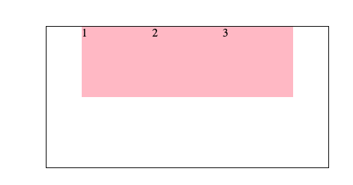

**`justify-content: space-between`**

```jsx
.box ul {
     display: flex;
     justify-content: space-between;
     list-style: none;  
}
```

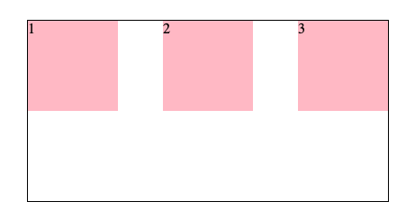

**`justify-content: space-around`**

```
.box ul {
     display: flex;
     justify-content: space-around;
     list-style: none;  
}
```

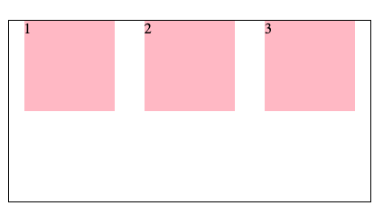

**`justify-content: space-evenly`**

```
.box ul {
     display: flex;
     justify-content: space-evenly;
     list-style: none;  
}
```

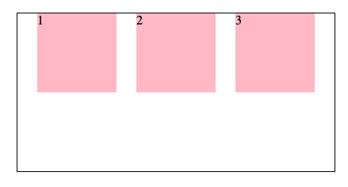

### 1.3 侧轴对齐方式：align-items

目标：使用 `align-items` 调节元素在侧轴的对齐方式

修改侧轴对齐方式属性：

- `align-items`：添加属性弹性容器
- `align-self`：控制某个弹性盒子在侧轴的对齐方式（添加到弹性盒子）

|   属性值   |                   作用                   |
| :--------: | :--------------------------------------: |
| flex-start |         默认值，起点开始依次排列         |
|  flex-end  |             终点开始依次排列             |
|   center   |              沿侧轴居中排列              |
|  stretch   | 默认值，弹性盒子沿侧轴线被拉伸至铺满容器 |


### 1.4 伸缩比：`flex: 值`

目标：使用 `flex` 属性修改弹性盒子伸缩比

属性：

- `flex：值`

取值分类：

- 数值（整数）

> 注意：只占用父盒子剩余尺寸


### 1.5 主轴方向：flex-direction

目标：使用 `flex-direction` 改变元素排列方向

主轴默认是水平方向，侧轴默认是垂直方向

修改主轴方向属性：`flex-direction`

|     属性值     |       作用       |
| :------------: | :--------------: |
|      row       | 行、水平，默认值 |
|    `column`    |    `列，垂直`    |
|  row-reverse   |   行，从右向左   |
| column-reverse |   列，从下向上   |

> 1. 先确定主轴方向
> 2. 在选择对应的属性直线主轴或侧轴

```jsx
// 修改主轴方向：列
flex-direction：column;

// 视觉效果：实现盒子水平居中
align-items: center;

// 视觉效果：垂直居中
justify-content: center;
```


### 1.5 弹性盒子换行：flex-wrap

目标：使用 `flex-wrap` 实现弹性盒子多行排列效果

思考：默认情况下，多个弹性盒子如何显示？

弹性盒子换行显示：flex-wrap: wrap;

调整行对齐方式：align-content

- 取值与 justify-content 基本相同：center、space-between、space-around


### 文字省略号技巧

```jsx
.txt {
     flex: 1;
     /* 溢出的时候,显示省略号 */
     /* 因为弹性盒子的尺寸可以被内容撑开 */
     width: 0;
}
.txt h5 {
     ...
     text-overflow: ellipsis;
     white-space: nowrap;
     overflow: hidden;
}

指定n 行换行
word-break: break-all;
overflow: hidden;
text-overflow: ellipsis;
display: -webkit-box;
-webkit-line-clamp: 2;
-webkit-box-orient: vertical;
```

## 二、rem

能够使用 rem 单位设置网页元素的尺寸

网页效果：

- 屏幕宽度不同，网页元素尺寸不同，要做到等比例缩放

px 单位或百分比可以实现吗？

- px 单位是绝对单位
- 百分比布局特点宽度自适应，高度固定

适配方案：

- rem
- vw、vh

### 2.1 rem

rem 单位：

- 相对单位
- rem 单位是相对于 HTML 标签的字号计算结果
- 1rem = 1HTML 字号大小


### 2.2 rem 移动适配 - 媒体查询

目标：能够使用媒体查询设置差异化 CSS 样式

思考：手机屏幕大小不同，分辨率不同，如何设置不同的 HTML 标签字号？

> 答：媒体查询

**媒体查询能够检测视口的宽度，然后编写差异化的 CSS 样式**

**当某个条件成立，执行对应的 CSS 样式**

语法：

```jsx
@media (媒体特性) {
	选择器 {
			CSS属性
	}
}

@media (width: 320px) {
	html {
			font-size: 32px;
	}
}
```


思考：

手机屏幕大小不同，分辨率不同，如何设置不同的 HTML 标签字号？

设备宽度不同，HTML 标签字号设置多少合适？

> 设备宽度大，元素尺寸大
> 设备宽度小，元素尺寸小

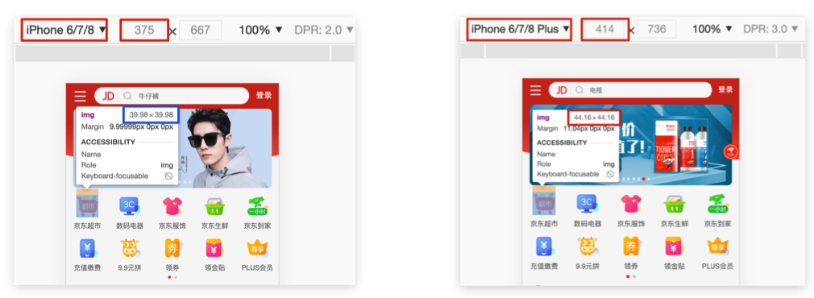

### 2.3 rem 移动适配

能够使用 rem 单位设置网页元素的尺寸

目前 rem 布局方案中，将网页等分成 10 份，HTML 标签的字号为视口宽度的 1/10

```jsx
// 视口宽度 320px，根字号为 320px
@media (widht: 320px) {
  	html {
      	font-size: 32px;
    }
}

// 视口宽度 375px，根字号为 37.5px
@media (widht: 375px) {
  	html {
      	font-size: 37.5px;
    }
}

// 视口宽度 414px，根字号为 41.4px
@media (widht: 414px) {
  	html {
      	font-size: 41.4px;
    }
}
```


### 2.4 rem 适配原理

目标：实现在不同宽度的设备中，网页元素尺寸等比例缩放效果

rem 单位尺寸：

1. 根据视口宽度，设置不同的 html 标签字号

2. 书写代码，尺寸是 rem 单位

   2.1  确定设计稿对应的设备的 HTML 标签字号

   > 查看设计稿宽度，确定参考设备宽度（视口宽度），确定基准根字号（1/10视口宽度）

   2.2  rem 单位尺寸

   > N * 37.5 = 68，N = 68 / 37.5
   >
   > rem 单位的尺寸 = px 单位数值 / 基准根字号


### 2.5 flexible

目标：能够使用 flexible js 配合 rem 实现不同设备宽度的设备中，网页元素尺寸等比例缩放效果

思考：咱们检测了 3 个视口，分别设置了根字号，有什么弊端吗？

> 答：手机设备多，屏幕尺寸不一，视口不仅仅有 3 个


**flexible.js 是手淘开发的一个用来适配移动端的 js 框架**
**核心原理就是根据不同的视口宽度给网页中 html 根节点设置不同的 font-size**

## 三、Less 语法

目标：使用 less 运算写法完成 px 单位到 rem 单位的转换

思考：在 px 单位转换到 rem 单位过程中，哪项工作是最麻烦的？

> 答：除法运算。CSS 不支持计算写法

解决方案：可以通过 Less 实现


### 3.1 Less

目标：使用 Less 语法快读编译生成 CSS 代码

- Less 是一个 CSS 预处理器，Less 文件后缀是.less

- 扩充了 CSS 语言，使CSS 具备了一定的逻辑性、计算能力

- 注意：浏览器不识别 Less 代码，目前阶段，网页要引入对应的 CSS 文件

Easy  Less：

- vscode 插件
- 作用：less 文件保存自动生成对应的 css 文件

### 3.2 Less 注释

单行注释：

- 语法：`// 注释内容`
- 快捷键：`commond + /`

块注释：

- 语法：`/* 注释内容 */`
- 快捷键：`shift + alt + a`


### 3.3 Less 语法

运算：

- 加、减、乘直接书写计算表达式
- 除法需要添加小括号或者.

注意：

- 表达式存在多个单位以第一个单位为准

```jsx
.box {
	 width = 100 + 50px;
   height = 5 * 4px;
  
  width: (100/ 4px);
  height: 100 ./ 4px;
}
```


**目标：能够使用 Less 嵌套书写生成后代选择器**

嵌套：

- 作用：快速生成后代选择器

- 语法：

  ```jsx
  .父级选择器 {
    	// 父级样式
      .子代选择器 {
        	// 子级样式
      }
  }
  
  .father {
    	color: red;
      .son {
        	widht = 100pxl
      }
  }
  
  .father {
  	  color: red;
  }
  
  .father .son {
    width = 100px;
  }
  ```

  注意：& 不生成后台选择器，表示 `当前选择器`，通常配合 `伪类或伪元素` 使用

  ```jsx
  .father {
    	color: red;
      &:hover {
        	color: green;
      }
  }
  
  .father {
  	  color: red;
  }
  
  .father:hover {
    width = 100px;
  }
  ```


### 3.4 能够使用 Less 变量设置属性值

变量：

- 思考：

  - 网页中，文字颜色基本都是统一的，如果网站改版，变换文字颜色，如何修改代码？

    > 方法：
    >
    > - 方法一：逐一修改属性值：太繁琐
    > - 方法二人：把颜色提前存储到一个容器，设置属性值为这个容器名


方法二：把颜色提前存储到一个容器，设置属性值为这个容器名

变量：存储数据，方便使用和修改

语法：

- 定义变量：@变量名：值；
- 使用变量：CSS 属性：@变量名；

 ```jsx
 // 1. 定义
 @fontColor：pink；
 
 // 2. 使用
 .box {
   color: @fontColor;
 }
 ```

### 3.5 使用 Less 导入写法引用其他 Less 文件

思考：

开发网站时，网页如何引入公共样式？

- CSS： 书写 link 标签
- Less：导入

导入: @import “文件路径”

```jsx
// 如果是 less 文件，可以省略后缀.less
@import 'base.less'
@import '01-体验 less'
```

### 3.6 使用 Less 语法导出 CSS 文件

方法一：

- 配置 Easy Less 插件，实现所有 Less 有相同的导出路径

- 配置插件：设置---搜索 Easy Less --- 在 setting.json 中编辑---添加代码：注意，必须是双引号

  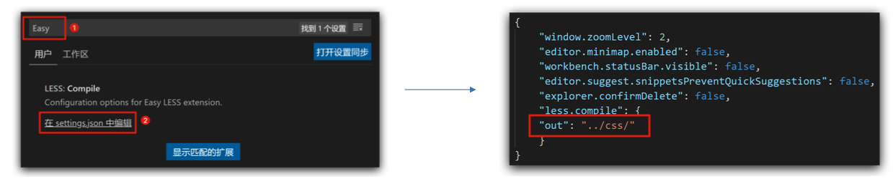

方法二：控制当前 less 文件导出路径

- less 文件第一行添加如下代码，注意文件夹名称后面添加/

  ```jsx
  // out: ./css/
  
  // out: ./css/common.css
  ```


思考：所有的 less 文件都需要导出 css 文件吗?

> 并不是所有的都需要

禁止导出：在 less 文件第一行添加: `// out: false`


## 四、vw、vh

目标能够使用 `vw 单位` 设置网页元素的尺寸

- 相对单位
- 相对 `视口的尺寸` 计算结果
- vw: viewport width：1vw = 1 / 100 视口宽度
- vh: viewport height：1vh = 1 / 100 视口高度


### 4.1 vw 适配原理

目标：实现不同宽度的设备中，网页元素尺寸等比例缩放效果

**vw 单位尺寸**

- 确定设计稿对应的 vw 尺寸：1 / 100 视口宽度
  - 查看设计稿宽度，确定参考设备宽度（视口宽度），确定 vw 尺寸（1 / 100 视口宽度）
- vw 单位的尺寸 = `px 单位数值` / (1 / 100 视口宽度)


### 4.2 vh 适配原理

**vh 单位尺寸**

- 确定好设计稿的对应的 vh 尺寸：1 / 100 视口高度
  - 查看设计稿宽度，确定参考设备高度（视口高度），确定 vh 尺寸（1 / 100 视口高度）
- vh 单位的尺寸 = `px 单位数值` / (1 / 100 视口高度)


### rem 和 vw/vh 的区别

**rem：**

- 市场比较常见
- 需要不断修改 html 文字大小
- 需要媒体查询 media
- 需要 flexible.js

**vw/vh: **

- 省去各种判断和修改。

## 五、响应式：媒体查询 - BootStraps

### 5.1 媒体查询

#### 5.1 基础语法

目标：能够根据设备宽度的变化，设置差异化样式

**开发常用写法：**

- 媒体特性常用写法：

  - max-width
  - min-width

  ```jsx
  @media (媒体特性) {
    	选择器 {
        	样式
      }
  }
  
  完整写法：
  @media 关键词 媒体类型 and (媒体特性) {
    	css代码
  }
  ```

##### 5.1.1 书写顺序

- min-width：从小到大
- max-width：从大到小
- 需求
  - 默认网页背景色是灰色
  - 屏幕宽度在 768-992 之间，网页背景色是粉色
  - 屏幕宽度在 992-1200 之间，网页背景色是 skyblue
  - 屏幕宽度大于 1200，网页背景色绿色


#### 5.1.2 关键词 

- and
- only
- not

#### 5.1.3 媒体类型

媒体是用来区分设备类型的，如屏幕设备、打印设备等，其中手机、电脑、平板都属于屏幕设备

|  类型名称  |   值   |           描述            |
| :--------: | :----: | :-----------------------: |
|    屏幕    | screen |       带屏幕的设备        |
|  打印预览  | print  |       打印预览模式        |
|   阅读器   | speech |       屏幕阅读模式        |
| 不区分类型 |  all   | 默认值，包括以上 3 种情形 |

#### 5.1.4 媒体特征

媒体特征主要用来描述媒体类型的具体特征，如当前屏幕的宽高、分辨率、横屏、竖屏等

|    特性名称    |         属性          |               值                |
| :------------: | :-------------------: | :-----------------------------: |
|  视口的宽和高  |     width、height     |              数值               |
| 视口最大宽和高 | max-widht、max-height |              数值               |
| 视口最小宽和高 | min-widht、min-height |              数值               |
|    屏幕方向    |      orientation      | portrait：竖屏  landscape：横屏 |

#### 5.1.5 基本使用

外联式 CSS 引入

```jsx
<link rel="stylesheet" media="逻辑符 媒体类型 and (媒体特性)" href="xx.css">
```

示例：

```jsx
<link rel="stylesheet" media="(min-widht: 1200px)" href="xx.css">
```


### 5.2 BootStrap

#### 5.2.1 简介

目标：使用 bootstrap 框架快速开发响应式网页

- bootstrap 是有推特公司开发维护的前端 UI 框架，它提供了大量编写好的 css 样式，允许开发者结合一定 HTML 结构及 JavaScript，快速编写功能完善的网页及常见的交互效果
- 中文官网：https://www.bootcss.com

#### 5.2.2 bootstrap 使用步骤

1. 下载：https://www.bootcss.com

   1. 首页--Bootstrap3 中文文档---下载 Bootstrap

2. 使用

3. 引入：Bootstrap 提供的 CSS 代码

   ```jsx
   <link rel="stylesheet" href="./bootstrap-3.3.7/css/bootstrap.css">
   ```

4. 调用类：使用 Bootstrap 提供的样式

   1. container：响应式布局版心类

#### 5.2.3 bootstrap 栅格系统

目标：使用 Bootstrap 栅格系统布局响应式网页

- 栅格化是指将这个网页的宽度分成若干等份

- BootStrap3 默认将网页分成 12 份

  |          | 超小屏幕 | 小屏幕   | 中等屏幕 | 大屏幕   |
  | -------- | -------- | -------- | -------- | -------- |
  | 响应断点 | < 768px  | >=768px  | >=992px  | >=1200px |
  | 别名     | xs       | sm       | md       | lg       |
  | 容器宽度 | 100%     | 750px    | 970px    | 1170px   |
  | 类前缀   | col-xs-* | col-sm-* | col-md-* | col-lg-* |
  | 列数     | 12       | 12       | 12       | 12       |
  | 列间隙   | 30px     | 30px     | 30px     | 30px     |

示例：

```jsx
<head>
     <meta charset="UTF-8">
     <meta http-equiv="X-UA-Compatible" content="IE=edge">
     <meta name="viewport" content="width=device-width, initial-scale=1.0">
     <title>Document</title>
     <link rel="stylesheet" href="./bootstrap-3.4.1-dist/css/bootstrap.min.css">
     <style>
          .container {
               height: 100px;
               background-color: pink;
          }
     </style>
</head>
<body>
     <div class="container">
          <div class="col-lg-3 col-md-6 col-xs-4  col-sm-3">1</div>
          <div class="col-lg-3 col-md-6 col-xs-4  col-sm-3">2</div>
          <div class="col-lg-3 col-md-6 col-xs-4  col-sm-3">3</div>
          <div class="col-lg-3 col-md-6 col-xs-4  col-sm-3">4</div>
     </div>
</body>
       
/*
   名词解释：
       col-lg-3 表示大屏幕一排排 4 个
       col-md-6 表示中等屏幕一排排 2 个
       col-sm-3 表示小屏幕一排排 4 个
       col-xs-4 表示超小屏幕一排排 3 个
       */
```


- `.container` 是 Bootstrap 中专门提供的类名，所有应用该类名的盒子，默认一倍指定宽度且居中
- `.container-fluid` 也是 BootStrap 中专门提供的类名，所有应用该类名的盒子，宽度均为 100% 
- 分别使用 `.row` 类名和 `col` 类名定义栅格布局的行和列

> 注意：
>
> - container 类自带间距 15px
> - row 类自带间距-15px

示例：

```jsx
<div class="container">11</div>
<div class="container">
  	<div class="row">22</div>
</div>
```

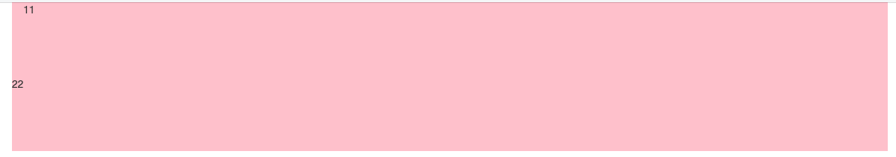

可以看出，row的效果


#### 5.2.4 全局样式

目标：掌握 BootStrap 手册语法，使用全局 CSS 样式美化标签

**手册语法**：

BootStrap 预定义了大量类用来美化页面，掌握手册的查找方法是学习全局样式的重点

网站首页---BootStrap3 中文文档---全局 CSS 样式---按分类导航查找目标类

```jsx
<button class="基础样式类 具体样式类">成功</button>
```

**布局类：表格**

- table：基本类名，初始化表格默认样式
- table-bordered：边框线
- table-striped：隔行变色
- table-hover：鼠标悬停效果
- table-responsive：表格宽溢出滚动

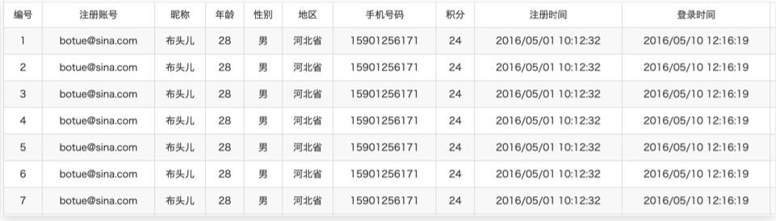


**美容内容类: 按钮**

- btn：基准样式
- btn-info；btn-success：设置按钮背景色
- btn-block：设置按钮为块级元素
- btn-log；btn-sm；btn-xs：设置按钮大小
- 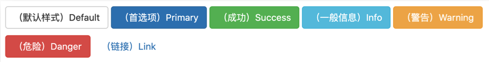


**布局类：表单**

- form-control：设置表单元素 input、select、textarea 的样式
- checkbox和 radio：设置复选框和单选框的样式
- form-inline：设置表单元素水平排列
- disabled：设置表单禁用状态样式
- input-lg ；input-sm：设置表单元素的大小
- 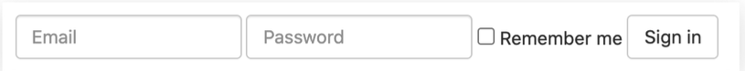


**美化内容类：图片**

- img-responsive：图片自适应
- img-rounded : 图片设置圆角
- img-circle : 图片设置正圆
- img-thumbnail : 图片添加边框线


**布局类: 辅助类**
- pull-right : 强制元素右浮动

- pull-left : 强制元素左浮动
- clearfix : 清除浮动元素的影响- text-left文 : 本左对齐
- text-right : 文本右对齐
- text-center : 文本居中对齐
- center-block : 块元素居中


**布局类：响应式工具，不同屏幕尺寸隐藏和显示页面内容**

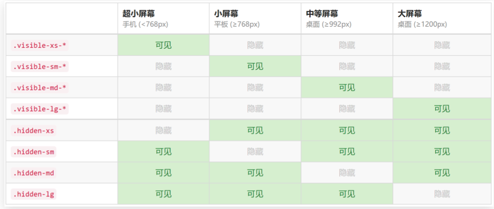


## 六、SCSS

[官方文档](https://www.sass.hk/)

> 首先注意,这里的sass和我们的scss是什么关系

sass 和 scss 其实是**`一样的 `** css 预处理语言，SCSS 是 Sass 3 引入新的语法，其后缀名是分别为 .sass和.scss两种。

SASS版本3.0之前的后缀名为.sass，而版本3.0之后的后缀名.scss。

两者是有不同的，继 sass 之后 scss 的编写规范基本和css一致，sass 时代是有严格的缩进规范并且没有‘{}’和‘；’。

S而scss则和css的规范是一致的。


### 搭建小型测试环境

> 为了方便应用scss，我们可以在vscode中安装一个名为**`easy sass`** 的插件，但是我们只在该项目中工作区中应用该插件，因为在项目中，不需要该插件的辅助

首先我们新建一个文件夹test，然后我们在test下新建一个index.html，并新建一个test.scss

```html
<!DOCTYPE html>
<html lang="en">
<head>
    <meta charset="UTF-8">
    <meta name="viewport" content="width=device-width, initial-scale=1.0">
    <title>Document</title>
    <link rel="stylesheet" href="./test.css">
</head>
<body>
    <nav> Scss样式 </nav>
    <div id="app">
        Hello World
    </div>
    <div id="content">
        <article>
            <h1>文章标题</h1>
            <p>文章内容 <a href="">百度</a> </p>
        </article>
        <aside>
            侧边栏
        </aside>
    </div>
</body>
</html>
```

我们使用的**`easy sass`**插件会自动的帮助我们把**`test.scss  =>  test.css`**

#### 变量

`sass` 使用 `$` 符号来标识变量 

```bash 
$highlight-color: #f90     
```

上面我们声明了一个 名为**`$highlight-color`**的变量, 我们可以把该变量用在任何位置

```bash
#app {
    background-color:  $highlight-color;
}     
```

以空格分割的多属性值也可以标识变量

```bash
$basic-border: 1px solid black;
```

```bash
#app {
    background-color:  $highlight-color;
    border: $basic-border
}     
```

**变量范围**

与`CSS`属性不同，变量可以在`css`规则块定义之外存在。当变量定义在`css`规则块内，那么该变量只能在此规则块内使用。如果它们出现在任何形式的`{...}`块中（如`@media`或者`@font-face`块），情况也是如此：

```bash
$nav-color: #F90;
nav {
  $width: 100px;
  width: $width;
  color: $nav-color;
  background-color: black
}

# 编译后 

nav {
  width: 100px;
  color: #F90;
  background-color: black;
}

```

在这段代码中，`$nav-color`这个变量定义在了规则块外边，所以在这个样式表中都可以像 `nav`规则块那样引用它。`$width`这个变量定义在了`nav`的`{ }`规则块内，所以它只能在`nav`规则块 内使用。这意味着是你可以在样式表的其他地方定义和使用`$width`变量，不会对这里造成影响。

**嵌套语法**

和less一样,scss同样支持**`嵌套型`**的语法

```scss
#content {
    article {
      h1 { color: #1dc08a }
      p {  font-style: italic; }
    }
    aside { background-color: #f90 }
  }
```

转化后

```scss
#content article h1 {
  color: #1dc08a;
}

#content article p {
  font-style: italic;
}

#content aside {
  background-color: #f90;
}

```

**&父选择器**

假如你想针对某个特定子元素 进行设置

比如

```scss
  #content {
    article {
      h1 { color: #1dc08a }
      p {  font-style: italic; }
      a {
        color: blue;
        &:hover { color: red }
      }
    }
    aside { background-color: #f90 }
  }
```

 >学到这里,我们会发现scss和less有很多相似之处,最大的区别就在于声明变量的方式,less采用的是**`@变量名`**, 而scss采用的**`$变量名`**

此时,我们再来看一下模板中的 **`styles/variables.scss`**


上述文件,实际上定义了我们的一些基础数值,方便大家在某个文件统一的处理.

**`本节任务`**：对scss进行了解和掌握

