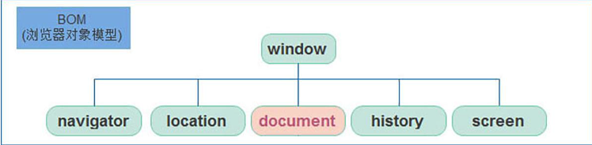
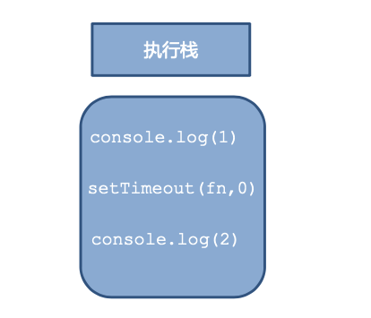
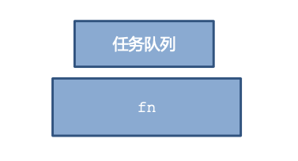
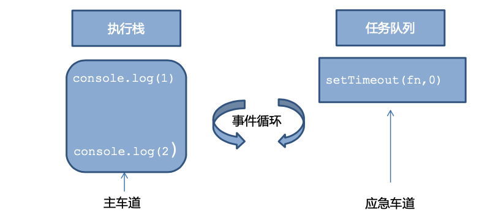
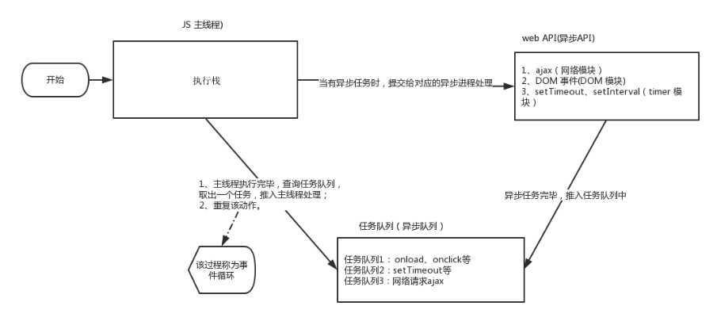
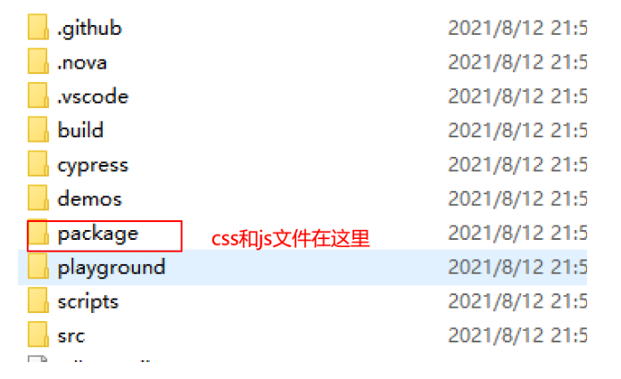

## 一、DOM：获取 DOM 元素、修改属性

### 1.1 Web API 基本认知

作用：使用 JS 去操作 HTML 和浏览器

分类：DOM 和 BOM

- DOM：操作 html 和 css
- BOM：操作浏览器


**什么是 DOM**

- DOM：Document Object Model--文档对象模型，是用来呈现以及任意 HTML 或 XML 文档交互的 API
- DOM 是浏览器提供的一套专门用来 `操作网页内容` 的功能
- DOM 作用：开发网页内容特效和实现用户交互
- 简单说：DOM 操作 htm 和 css

**DOM 树**

- 将 HTML 文档以树状结构只管的表现出来，我们称之为文档树或者 DOM树

- 描述网页内容关系的名词

- 作用：文档树直观的体现了标签与标签之间的关系

  

#### DOM对象

- DOM 对象：浏览器根据 html 标签生成的 js 对象
  - 所有的标签属性都可以在这个对象上面找到
  - 修改这个对象的属性会自动映射到标签身上
- DOM 核心思想：
  - 把网页内容当做对象来处理
- document 对象：
  - 是 DOM 提供的一个对象
  - 所有它提供的属性和方法都是用来访问和操作网页内容的
    - 例如：document.write
  - 网页所有内容都在 document 里面


### 1.2 获取 DOM 对象

#### 12.1 根据 CSS 选择器来获取 DOM 对象

**选择匹配的第一个元素**

语法：

```jsx
document.querySelector('css选择器')

参数：
包含一个或多个有效的css 选择器字符串

返回值：
css 选择器匹配的第一个元素，一个 HTMLElement 对象
如果没有匹配到，则返回 null

可以直接操作返回值
```

[参考文档](https://developer.mozilla.org/zh-CN/docs/Web/API/Document/querySelector)


**选择匹配多个元素**

语法:

```jsx
document.querySelectorAll('css 选择器')

参数：
包含一个或多个有效的 css 选择器字符串

返回值：
css 选择器匹配的 NodeList 对象集合

例如：
document.querySelectorAll('ul li')

无法直接操作，必须通过下标获取对应的 li 才能操作
```

`document.querySelectorAll('css 选择器')`：

- 获取单独是一个伪数组
  -  有长度有索引的数组
  - 但是没有 pop() 、push() 等数组方法
  - 想要得到里面的每一个对象，需要遍历获得


#### 1.2.2 其他获取 DOM 对象的方法

```jsx
// 根据 id 获取一个元素
documment.getElementById('Nav')

// 根据标签获取一类元素，获取页面所有的 div
document.getElementsByTagName('div')

// 根据类名获取元素 获取页面所有类名为 w 的元素
document.getElementsByClassName('w')
```


### 1.2 设置、修改 DOM 元素的内容

DOM 对象都是根据标签生成的，所有操作标签，本质上都是操作 DOM 对象

就是操作对象使用的点语法

如果想要修改标签元素里面的内容，可以使用以下几种方式：

- document.write()
- 对象.innerText 属性
- 对象.innerHTML 属性

**document.write()**

- 只能将文本内容追加到 `</body>` 前面的位置
- 文本中包含的标签会被解析

```jsx
document.write("NIHAO")
document.write('<h3> 你好，世界</h3>')
```


**对象.innerText 属性**

- 将文本内容添加/更新到任意标签位置 
- 文本中包含的标签不会被解析

```jsx
// innerText 将文本添加、更新到任意标签位置
let info = document.getElementById('info')

info.innerText = '<h4> 嗨，我叫李四</h4>'
```

> 只修改内容，不关注标签


**对象.innerHTML 属性**

- 文本内容添加/更新到任意标签位置 
- 文本中包含的标签会被解析

```jsx
box.innerHTML = '<h4> 嗨，我叫李四</h4>'
```

> 解析标签，可以修改内容和添加、更新标签信息


### 1.3 设置、修改 DOM 元素的属性

- 设置、修改元素常用属性
- 设置、修改元素样式属性
- 设置、修改表单元素属性


#### 1.3.1 设置、修改元素常用属性

- 还可以通过 JS 设置/修改标签元素属性，比如通过 src更换 图片 
- 最常见的属性比如: href、title、src 等
- **语法:**

```jsx
对象.属性 = 值

举例：
// 获取元素
let pic = document.querySelector('img')

// 操作元素
pic.src = './images/xxx.png'
pic.title = '这是一张图片'
```


#### 1.3.2 设置、修改元素样式属性

还可以通过 JS 设置/修改标签元素的样式属性。

- 比如通过 轮播图小圆点自动更换颜色样式

- 点击按钮可以滚动图片，这是移动的图片的位置 left 等等 

- 学习路径:

  - 通过 style 属性操作CSS

  - 操作类名(className) 操作CSS

  - 通过 classList 操作类控制CSS

##### 1.3.2.1 通过 style 属性操作CSS

语法：

```
对象.style.样式属性 = 值

例如：
let box = document.querySelector('.box')
// 修改背景颜色
box.style.backgroundcolor = 'red'
box.style.widht = '100px'
box.style.marginTop = '50px'
```

> 注意：
>
> - 修改样式通过 style 属性引出
> - 如果属性有 - 连接符，需要转换为小驼峰命名法
> - 赋值的时候，需要的时候不要忘记加 css 单位


##### 1.3.2.2 操作类名(className) 操作CSS

如果修改的样式比较多，直接通过 `style` 属性修改比较繁琐，我们可以通过借助与 css 类名的形式

语法：

```jsx
// active 是一个 css 类名
元素.className = 'active'
元素.className = '类名1 类名2 类名3....'
```

> 注意：
>
> - 由于 class 是关键字，所以使用 className 去代替
> - className 是使用新值替换旧值，如果需要添加一个类，需要保留之前的类名


##### 1.3.2.3 通过 classList 操作类控制CSS

为了解决 `className` 容易覆盖以前的类名，我们可以通过 `classList` 方式追加和删除类名

语法：

```jsx
// 追加一个类 
元素.classList.add('类名')
元素.classList.add('类名','类名','类名','类名'....)

// 删除一个类
元素.classList.remove('类名')
元素.classList.remove('类名','类名','类名','类名'....)

// 切换一个类：如果当前元素有这个类，就移除掉；如果当前类没有这个类就添加上
元素.classList.toggle('类名')
```


#### 1.3.3 设置、修改表单元素属性

表单很多情况，也需要修改属性，比如点击眼睛，可以看到密码，本质是把表单类型转换为文本框 正常的有属性有取值的 跟其他的标签属性没有任何区别

- 获取: DOM对象.属性名
- 设置: DOM对象.属性名 = 新值

```jsx
表单.value = '用户名'
表单.type = 'password'
```

表单属性中添加就有效果，移除就没有效果，一律使用布尔值表示。如果为true：代表添加了该属性；如果是 false：代表移除了该属性

比如: disabled、checked、selected


### 1.4 定时器--间歇函数

- 网页中经常会需要一种功能:每隔一段时间需要自动执行一段代码，不需要我们手动去触发 
- 例如:网页中的倒计时
- 要实现这种需求，需要定时器函数
- 定时器函数有两种，今天我先讲间歇函数


#### 1.4.1 定时器函数的基本使用

定时器函数可以开启和关闭定时器

**开启定时器**

```jsx
setInterval(函数，间隔时间)

- 作用：每个一段时间调用这个函数
- 间隔时间单位是毫秒
```

示例：

```jsx
function repeat() {
  	console.log("iOS 程序员，就是头发多")
}
// 每隔一秒调用 repeat 函数
setInterval(repeat, 1000)
```

> 注意：
>
> - 函数名字不需要加括号
> - 定时器返回的是一个 id 数字


** 关闭定时器**

```jsx
let 变量名 = setInterval(函数名, 间隔时间)
clearInterval(变量名)
```

一般不会刚创建就听着，则是满足一定条件再停止

### 总结：

- 根据 CSS 选择器来获取 DOM 对象
  - `document.querySelector('css选择器')` ：获取选择器的第一个元素
  - `document.querySelectorAll('css选择器')`：获取选择所有的元素，是一个伪数组。
- 根据 id 获取一个元素：documment.getElementById('Nav')
- 根据标签获取一类元素，获取页面所有的 div：document.getElementsByTagName('div')
- 根据类名获取元素 获取页面所有类名为 w 的元素：document.getElementsByClassName('w')
  


## 二、DOM 事件基础

### 2.1 事件

- 事件：
  - 事件是在编程时系统内发生的动作或者发生的事情。比如用户在网页上单机一个按钮

- 事件监听：

  - 让程序检测是否有事件产生，一旦有事件触发，就立即调用一个函数做出响应，也称为注册事件

- 语法：

  ```jsx
  元素.addEventListener('事件', 要执行的函数)
  ```

- 事件监听三要素：

  - 事件源：哪个 dom 元素被事件触发了，要获取 dom 元素
  - 事件：用什么方式触发，比如鼠标点击 click，鼠标经过 mouseover 等
  - 事件调用的函数：要做什么事


#### 2.1.1 事件监听：

```jsx
// 获取元素
let btn = document.querySelector('button')

//  事件监听：注册事件
btn.addEventListener('click', function(){
  	alert('被点击了')
})


```

注意：

- 事件类型要加引号
- 函数是点击之后再去执行，每次点击都会执行一次


#### 2.1.2 事件类型

- 鼠标事件：鼠标触发
  - click：鼠标点击
  - mouseenter：鼠标经过
  - mouseleave：鼠标离开
  
- 焦点事件：表单获取光标
  - focus：获取焦点
  - blur：失去焦点
  
- 键盘事件：键盘触发
  - keydown：键盘按下触发
  - keyup：键盘抬起触发
  
- 文本事件：表单输入触发
  - input：用户输入事件。只要输入就会触发
  
  - change：`离开`表单的时候，当表单里面的`值发生变化`的时候触发。
  
    


### 2.2 高级函数

高阶函数可以被简单理解成函数的高级应用，JS 中函数可以被当成 `“值” `来对待，基于这个特性实现函数的高级应用

`“值”` 就是 JS 中的数据，如数值、字符串、布尔、对象等


#### 2.2.1 函数表达式

函数表达式和普通函数并无本质上的区别：

```jsx
// 函数表达式与普通函数本质上是一样的
let counter = function (x, y) {
  	return x + y
}

// 调用函数
let result = counter(1,2)
console.log(result)
```

- 普通函数的声明与调用无顺序限制，推荐做法先声明再调用

- **函数表达式必须要先声明再调用**


#### 2.2.2 回调函数

如果将函数 A 作为参数传递给函数 B 时，我们称函数 A 是回调函数

简单理解：当一个函数当做参数传递给另外一个函数时，这个函数就是回调函数

例如：

```
function fn （） {
		console.log('我是回调函数')
}
// fn 传递给了 setInterval，fn 就是回调函数
setInterval(fn, 1000)

box.addEventListener('click', function() {
		console.log('我是回调函数')
})
```


### 环境变量

环境对象指的是函数内部特殊的变量 this，它代表着当前函数运行时所处的环境

作用：弄清楚 this 的指向，可以让我们代码更加简洁

- 函数的调用方式不同，this 指代的对象也不同
- `谁调用，this 就是谁` 是判断 this 指向的粗略规则
- 直接调用函数，其实相当于是 window 函数，所以 this 指代 window


## 三、DOM-节点操作、时间对象、重绘和回流

### 3.1 DOM 节点

- DOM 节点：DOM 树里每一个内容都被称为节点

- 节点类型：

  - 元素节点：.
    - 所有的标签。比如：div、body、span
    - html 是根节点
  - 属性节点：
    - 所有的属性。比如：href、title、class、id等
  - 文本节点：所有的文本。比如标签里面的文字
  - 其他

  

#### 3.1.1 查找节点

节点关系：

- 父节点
- 子节点
- 兄弟节点


**父节点查找**：

- parenNnode 属性

- 返回最近一级的父节点，找不到返回 null

- ```jsx
  子元素.parenNode
  ```


**子节点查找：**

- childNodes：获取所有子节点，包括文本节点（空格、换行）、注释节点等
- children：
  - 仅获得所有元素节点
  - 返回的是一个伪数组
  - `父元素.children`


**兄弟关系查找：**

- 下一个兄弟节点：`nextElementSibling` 属性
- 上一个兄弟节点：`previousElementSibling` 属性


#### 3.1.2 增加节点

很多情况下，我们需要在页面中增加元素。比如，点击发布按钮，可以新增一条消息

一般情况下，新增节点，按照如下操作：

- 创建一个新的节点
- 把创建的节点放入到指定的元素内部


学习路线：

- 增加节点
- 追加节点


**增加节点：**

创建节点：

- 即创建一个新的网页元素，在添加到网页内，一般先创建节点，然后在插入节点

- 创建元素节点方法：

- ```jsx
  // 创建一个新的元素节点
  document.createElement('标签名')
  ```


**追加节点：**

- 要想在界面看到，还得插入到某个父元素中

- 插入到父元素的最后一个子元素：

  ```jsx
  // 插入到这个父元素的最后
  父元素.appendChild(要插入的元素)
  ```

- 插入到父元素中某个子元素的前面

  ```jsx
  // 插入到某个子元素的前面
  父元素.insertBefore(要插入的元素， 在某个元素前面)
  ```

  

**克隆节点**

- 特殊情况下，新增节点，需要按照如下操作：

  - 复制一个原有的节点
  - 把复制的节点放入到指定的元素内部

- 克隆节点

  ```jsx
  元素.cloneNode(布尔值)
  ```

- cloneNode 会克隆出一个跟原标签一样的元素，括号内传入布尔值

  - 若为 true，则代表克隆时会包含后代节点一起克隆
  - 若为 false，则代表克隆时不包含后代节点
  - 默认 false


#### 3.1.3 删除节点

- 若把一个节点在网页中已不需要时，可以删除它

- 在 JS 原生 DOM 操作中，要删除元素必须通过 `父元素删除`

- 语法

  ```html
  父元素.removeChild(要删除的元素)
  ```

> 如果不存在父元素关系则删除不成功
>
> 删除节点和隐藏节点（display：none）有区别：
>
> - 隐藏节点还是存在
> - 删除，则是从 html 中删除节点


### 3.2 时间对象

- 时间对象：用来表示时间的对象
- 作用：可以得到当前系统时间


学习路径：

- 实例化
- 时间对象方法
- 时间戳


#### 3.2.1 实例化

在代码中发现 new 关键字时，一般将这个操作称为实例化

创建一个实践对象并获取时间：

- 获取当前时间：`let date = new Date()`
- 获取指定时间：`let date = new Date('1949-10-10')`


#### 3.2.1 时间对象方法

因为时间对象返回的数据我们不能直接使用，所以需要转换为实际开发中常用的格式

|      方法      |        作用        |         说明         |
| :------------: | :----------------: | :------------------: |
| getFullYeaer() |      获得年份      |    获取 四位年份     |
|   getMonth()   |      获得月份      |     取值：0 ~ 11     |
|   getDate()    | 获得月份中的每一天 | 不同月份取值也不相同 |
|    getDay()    |      获得星期      |     取值：0 ~ 6      |
|   getHours()   |      获得小时      |     取值：0 ~ 23     |
|  getMinutes()  |      获得分钟      |     取值：0 ~ 59     |
|  getSeconds()  |      获得秒数      |     取值：0 ~ 59     |


#### 3.2.1 时间戳

时间戳：是指1970年01月01日00时00分00秒起至现在的毫秒数，它是一种特殊的计量时间的方式

三种方式获取时间戳：

- 使用 `getTime()` 方法：

  ```jsx
  // 实例化
  let date = new Date()
  
  // 获取时间戳
  console.log(date.getTime())
  ```

- `简写 +new Date()`

  ```jsx
  console.log(+new Date()) 
  ```

- 使用`Date.now()`

  ```
  console.log(Date.now())
  ```

  - 无需实例化
  - 当时只能获取当前的时间戳，而前面两种可以返回指定时间的时间戳


### 3.3 重绘和回流

浏览器是如何进行界面渲染的

- 解析(Parser)HTML，生成DOM树(DOM Tree)
- 同时解析(Parser) CSS，生成样式规则 (Style Rules)
- 根据DOM树和样式规则，生成渲染树(Render Tree)
- 进行布局Layout(回流/重排):根据生成的渲染树，得到节点的几何信息(位置，大小) 
- 进行绘制Painting(重绘):根据计算和获取的信息进行整个页面的绘制
- display:展示在页面上


#### 3.3.1 重绘和回流(重排)

- **回流**(**重排**)
  - 当 Render Tree 中部分或者全部元素的尺寸、结构、布局等发生改变时，浏览器就会重新渲染部分或全部文档的过程称为 回流。

- **重绘** 
  - 由于节点(元素)的样式的改变并不影响它在文档流中的位置和文档布局时(比如:color、background-color、outline等), 称为重绘。
- **重绘不一定引起回流，而回流一定会引起重绘。**


**会导致回流(重排)的操作:**

- 页面的首次刷新
- 浏览器的窗口大小发生改变 
- 元素的大小或位置发生改变 
- 改变字体的大小

- 内容的变化(如:input框的输入，图片的大小) 
- 激活css伪类 (如::hover)
- 脚本操作DOM(添加或者删除可见的DOM元素)

> 简单理解就是影响到布局了，就会有回流


## 四、DOM - 事件高级

### 4.1 事件对象

#### 4.1.1 获取事件对象

事件对象是什么？

- 也是个对象，这个对象里有事件触发的相关信息
- 例如：鼠标点击事件中，事件对象就存了鼠标点在哪个位置等信息

如果获取：

- 在事件绑定的回调函数的第一个参数就是事件对象

- 一般命名为 event、ev、e

  ```jsx
  // 这个 e 就是事件对象
  元素.addEventListener('click', function(e) {
    
  })
  ```


#### 4.1.2 事件对象的常用属性

部分常用属性：

- type：获取当前事件类型
- clienttX、clientY：获取光标相对于浏览器可见窗口左上角的位置
- offsetX、offsetY：获取光标相对于当前 DOM 元素左上角的位置
- key：
  - 用户按下的键盘键的值
  - 现在不提供使用 keyCode
  - 事件类型：
    - keyup：获取的当前这一次的 value
    - keydown：获取的value 是上一次的
- pageX、pageY：和文档坐标有关系


### 4.2 事件流

#### 4.2.1 事件流和两个阶段说明

事件流指的是事件完整执行过程中的流动路径：

```jsx
事件捕获 ==> 事件目标阶段 ==> 时间冒泡

这整个完整的过程就是事件流
```


说明：假设页面里有个 div，当触发事件时，会经历两个阶段，分别是捕获阶段、冒泡阶段

简单来说：捕获阶段是从父到子，冒泡阶段是从子到父

> 实际开发中都是实用冒泡事件


#### 4.2.2 事件捕获和事件冒泡

**事件冒泡：**

事件冒泡的概念：当一个元素的事件被触发时，同样的事件将会在该元素的所有祖先元素中依次被触发。这一过程被称为事件冒泡

简单理解：当一个元素触发事件后，会依次向上调用所有父级元素的同名事件

事件冒泡是默认存在的：

- **事件冒泡的必要性：**
  - 如果没有冒泡给大盒子注册点击事件，点击的是里面的小盒子，会导致大盒子无法被点击
    

**事件捕获：**

事件捕获的概念：从 DOM 的根元素开始去执行对应的事件（从里到外）

事件捕获需要写对应代码才能看到效果

代码：

```jsx
DOM.addEventListener(事件类型，事件处理函数，是否使用捕获机制)
```

说明：

- addEventListener 第三个参数传入 true 代码是捕获阶段触发（很少使用）
- 若传入 false 代表冒泡阶段触发，默认就是 false
- 弱势用 L0 事件监听，则只有冒泡阶段，没有捕获


#### 4.2.3 阻止事件流动

- 因为默认就有冒泡模式的存在，所以容易导致事件影响到父级元素

- 若想把事件就限制在当前元素内，就需要阻止事件流动

- 阻止事件流动需要拿到事件对象

- 语法：

  ```jsx
  事件对象.stopPropagation()
  ```

- 此方法可以阻断事件流动传播，不光在冒泡阶段有效，捕获阶段也有效


> 鼠标经过事件：
>
> - mouseover 和 mouseout 会有冒泡效果
> - mouseenter 和 mouseleave 没有冒泡效果：推荐使用


**默认阻止：**

- 阻止默认行为，比如链接点击不跳转，表单域的不提交

- 语法：

  ```jsx
  事件对象.preventDefault()
  
  示例：
  <script>
    	let a = document.querySelector('a')
  		a.addEventListener('click', function(e) {
  				// 阻止默认行为
        	e.preventDetault()
      })
  </script>
  ```

#### 4.2.4 两种注册事件的区别

- 传统 on 注册：L0，onclick 等

  - 同一个对象，后面注册的事件会覆盖前面注册的（同一个事件）
  - 直接使用 null 覆盖偶就有可以实现事件的解绑
  - 都是冒泡阶段执行的
  - 绑定事件：`元素.onclick = function(){}`
  - 解绑事件：`元素.onclick = null`

- 事件监听注册：L2

  - 语法：**`addEventListener(事件类型，事件处理函数，获取捕捉或者冒泡阶段)`**
  - 后面注册的事件不会覆盖前面注册的时间（即使是同一事件也不会覆盖）
  - 可以通过第三个参数去确定是在冒泡阶段还是捕获阶段执行
  - 必须使用 **`removeEventListener(事件类型，事件处理函数，获取捕捉或者冒泡阶段)`**
  - 匿名函数无法被解绑

  


### 4.3 事件委托

事件委托是利用事件流的特征解决一些开发需求的知识技巧

总结：

- 优点：给父级元素加事件，可提高性能

- 原理：事件委托其实是利用事件冒泡的特点，给父元素添加事件，子元素可以触发

- 实现：**`事件对象.target`** 可以获得真正触发事件的元素

  ```jsx
  <script>
    	// 不是每个小 li 注册事件了，而是把时间委托给它的爸爸
  	  // 事件委托是父级添加事件，而不是孩子添加事件
  		let ul = document.querySelector('ul')
    	ul.addEventListener('click', function(e) {
       		// 获取当前元素 e.target
     			e.target.style.color = 'red' 	
  	  })
  </script>
  ```

  

## 五、网页特效篇

### 5.1 滚动事件和加载事件

#### 5.1.1 滚动事件

- 当网页进行滚动时触发的时间

- 为什么要学？

  - 很多网页需要检测用户把页面滚动到某一个区域做一些处理，比如固定导航栏、返回顶部

- 事件名：`scroll`

- 监听整个页面滚动：

  ```jsx
  // 页面滚动事件
  window.addEventListener('scroll', function() {
    	// 执行的操作
  })
  
  // 给 window 或 document 添加 scroll 事件
  ```

- 监听某个元素的内部滚动直接给某个元素加即可


#### 5.1.2 加载事件

- 加载外部资源加载完毕时触发的事件。例如图片、外联 CSS、JS 等

- 为什么要学？

  - 有时候需要等页面资源全部处理完了做一些事情
  - 老代码喜欢把 script 写在 head 中，这时候直接找 dom 元素找不到 

- 事件名：`load`

- 监听页面所有资源加载完毕

  - 给 window 添加 load 事件

    ```jsx
    // 页面加载事件
    window.addEventListener('load', function() {
      	// 执行的操作
    })
    ```

> 注意：不光可以监听整个页面资源加载完毕，也可以针对某个资源绑定 load 事件
>
> ```jsx
> // img 加载事件
> img.addEventListener('load', function() {
>   	// 执行的操作
> })
> ```


- 当初始的 HTML 文档被完全加载和解析完成之后，`DOMContentLoaded`事件被触发，而无需等待样式表、图像等完全加载

- 事件名：`DOMContentLoaded`

- 监听页面 DOM 加载完毕：

  - 给 `document` 添加 `DOMContentLoaded` 事件

    ```jsx
    document.addEventListener('DOMContentLoaded', function() {
      	// 执行的操作
    })
    ```

    

### 5.2 元素大小和位置

#### 5.2.1 scroll 家族

使用场景：

我们想要在页面滚动一段距离，比如 100px，让某些元素显示隐藏，那我们怎么知道，页面滚动了 100px 呢？

就可以使用 scrol 来检测页面滚动的距离了

**scroll 家族**

- 获取宽高：

  - 获取元素的 `内容总宽高`（不包含滚动条）返回值不带单位
  - `scrollWidth` 和 `scrollHeight`

- 获取位置

  - 获取元素内容往左、往上滚出去看不到的距离
  - `scrollLeft` 和 `scrollTop`
  - 这两个属性是可以修改的

  ```jsx
  div.addEventListener('scroll', function(e) {
    		console.log(this.scrollTop)
    		console.log(this.scrollLeft)
    		console.log(this.scrollWidth)
   			console.log(this.scrollHeight)
  })
  ```

- 开发中，我们经常检测页面滚动的距离，比如页面滚动了 100px，就可以显示一个元素，或者固定一个元素

  ```jsx
  // 页面滚动事件
  window.addEventListener('scroll', function() {
    	// document.documentElment.scrollTop 获取当前页面被卷去的头部
    	let num = document.documentElement.scrollTop
      console.log(num)
  })
  ```

  > `document.documentElment`：HTML 文档返回对象为 HTML 元素
  >
  > ```jsx
  > <html>
  > xxxxx
  > </html>
  > ```


#### 5.2.2 offset 家族

**使用场景：**

前面案例滚动多少距离，都是我们自己算的，最好是页面 滚动到某个元素，就可以做某些事。 简单说，就是通过js的方式，得到元素在页面中的位置 这样我们可以做，页面滚动到这个位置，就可以返回 顶部的小盒子显示...


**offset 家族：**

- 获取宽高：
  - 获取元素的自身宽高，包含元素自身设置的宽高、padding、border
  - `offsetWidht` 和 `offsetHeight`
- 获取位置：
  - 获取元素距离自己 `定位父级` 元素的左、上距离
  - `offsetLeft` 和 `offsetTop`：注意是只读属性


#### 5.2.3 client 家族

client 当前可视区域

- 获取宽高：
  - 获取元素的可见部分宽高：不包含边框、滚动条等
  - `clientWidht` 和 `clientHeight`
- 获取位置：
  - 获取左边框和上边边框宽度，可以理解成获取边框的宽度
  - `clientLeft` 和 `clientTop`：注意是只读属性

- 会在窗口尺寸改变的时候触发事件

  - 属性：`resize`

    ```jsx
    window.addEventListener('resize', function() {
    		// 执行的代码
    })
    ```

- 检测屏幕宽度

  - 属性：`resize`

    ```jsx
    window.addEventListener('resize', function () {
      	let w = document.documentElement.clientWidht
        console.log(w)
    })
    ```


## 六、BOM - 操作浏览器

### 6.1 window 对象

window 对象第一个全局对象，也可以说是 JavaScript 中的顶级对象

像 document、alert、console.log 这些都是 window 的属性，基本上 BOM 的属性和方法都是 window 的

所有通过 var 定义在全局作用域的变量、函数都会变成 window 对象的属性和方法


#### 6.1.1 BOM - 浏览器对象模型

- `BOM`：`browser Object Model`，浏览器对象模型

  

- `Window` 是浏览器内置中的全局对象，我们学习的所有 web apis 的知识内容都是基于 window 对象实现的

- `window` 对象下包含 `navigator`、`location`、`document`、`history`、`screen` 5 个属性，即所谓的 `BOM`（浏览器对象模型）

- `document` 是实现 `DOM` 的基础，它其实是依附于 `window` 的属性

> 注意：依附于 window 对象的所有属性和方法，使用时可以`省略 window`


#### 6.1.2 定时器 - 延时函数

- JavaScript 内置了一个用来让代码延迟执行的函数，叫 `setTimeout`

- 语法：

  ```jsx
  setTimeout(回调函数， 等待的毫秒数)
  ```

- `setTimeout` 仅仅只执行一次，所以可以理解为就是把一段代码延迟执行，平时省略 window

- 清除延时函数：

  ```jsx
  let timer = setTimeout(回调函数，等待的毫秒数)
  clearTimeout(timer)
  ```

- 结合递归函数可以使用 `setTimeout` 实现 `setInterval` 一样的功能

  ```jsx
  <div class="clock"></div>
  <script>
  		let clock = document.querySelector('.clock')
    	function myInterval() {
    			let d = new Date()
          clock.innerText = d.toLocaleString();
      		// 延时任务，自调用
      		setTimeout(myInterval, 1000)
  	  }
      // 启动定时任务
    	myInterval()
  </script>
  ```

> 注意：演示器需要等待，所以后面的代码先执行
>
> 每一次调用延时都会产生一个新的延时器


**setTimeout 和 setInterval 两种定时器对比：**

- setInterval 的特征是重复执行，首次执行会延时
- setTimeout 的特征是延迟执行，只执行一次
- setTimeout 结合递归函数，能模拟 setInterval 重复执行
- clearTimeout 清除由 setTimeout 创建的定时任务


#### 6.1.3 JS 执行机制

**JS 是单线程**

JavaScript 语言的一大特点就是单线程，也就是说，同一个时间只能做一件事。这是因为 Javascript 这 门脚本语言诞生的使命所致——JavaScript 是为处理页面中用户的交互，以及操作 DOM 而诞生的。比 如我们对某个 DOM 元素进行添加和删除操作，不能同时进行。 应该先进行添加，之后再删除。

单线程就意味着，所有任务需要排队，前一个任务结束，才会执行后一个任务。这样所导致的问 题是: 如果 JS 执行的时间过长，这样就会造成页面的渲染不连贯，导致页面渲染加载阻塞的感觉。


**同步和异步**

为了解决这个问题，利用多核 CPU 的计算能力，HTML5 提出 Web Worker 标准，允许 JavaScript 脚本创建多个线程。于是，JS 中出现了 `同步` 和 `异步`。


**同步**

前一个任务结束后再执行后一个任务，程序的执行顺序与任务的排列顺序是一致的、同步的。比如做饭的同步 做法:我们要烧水煮饭，等水开了(10分钟之后)，再去切菜，炒菜。

例如：let num = 10


**异步**

你在做一件事情时，因为这件事情会花费很长时间，在做这件事的同时，你还可以去处理其他事 情。比如做饭的异步做法，我们在烧水的同时，利用这10分钟，去切菜，炒菜。

定时器、事件 click、load 加载、ajax 都是异步任务


> **他们的本质区别: 这条流水线上各个流程的执行顺序不同。**


##### 6.1.3.1 同步和异步

**同步任务**

同步任务都在主线程上执行，形成一个**执行栈。**



**异步任务**

JS 的异步是通过回调函数实现的。 

一般而言，异步任务有以下三种类型:

- 普通事件，如 click、resize 等
- 资源加载，如 load、error 等
- 定时器，包括 setInterval、setTimeout 等 


异步任务相关添加到**任务队列**中(任务队列也称为消息队列)。




##### 6.1.3.2 JS 执行机制

- 先执行执行栈中的同步任务。 
- 异步任务放入任务队列中。

- 一旦执行栈中的所有同步任务执行完毕，系统就会按次序读取任务队列中的异步任务，于是被读取的异步任务 结束等待状态，进入执行栈，开始执行。




##### 总结：



> **由于主线程不断的重复获得任务、执行任务、再获取任务、再执行，所以这种机制被称为事件循环( event loop)。**


#### 6.1.4 location. 对象

- `location` 的数据类型是对象，它拆分并保存了 URL 地址的各个组成部分 

- **常用属性和方法:**

  - `href` 属性获取完整的 URL 地址，对其赋值时用于地址的跳转

    ```jsx
    // 可以得到当前文件 URL 地址
    console.log(location.href)
    
    // 可以通过 js 方式跳转到目标地址
    location.href = 'http://www.itcast.cn'
    ```

  - `search` 属性获取地址中携带的参数，符号 ?后面部分

    ```
    console.log(location.search)
    ```

  - `hash` 属性获取地址中的啥希值，符号 # 后面部分

    ```jsx
    console.log(location.search)
    
    // 后期vue路由的铺垫，经常用于不刷新页面，显示不同页面，比如 网易云音乐
    ```

  - `reload` 方法用来刷新当前页面，传入参数 true 时表示强制刷新

    ```jsx
    <button>点击刷新</button>
    <script>
    		let btn = document.querySelector('button')
    	  btn.addEventListener('click', function() {
        		location.reload(true)
        		// 强制刷新，类似 command + f5
    	  })
    </script>
    ```


#### 6.1.5 navigator 对象

- navigator 的数据类型是对象，该对象下记录了浏览器自身的相关信息

- 常用属性方法：

  - 通过 userAgent 检测浏览器的版本及平台

    ```jsx
    检测 userAgent 浏览器信息
    (function() {
      	const userAgent = navigator.userAgent
        // 验证是否为 android 或 iphone
        const android = userAgent.match(/(Android);?[\s\/]+([\d.]+)?/) 
        const iphone = userAgent.match(/(iPhone\sOS)\s([\d_]+)/)
        // 如果是Android或iPhone，则跳转至移动站点 
        if (android || iphone) {
    				location.href = 'http://m.itcast.cn' 
        }
    })()
    ```

    

#### 6.1.6 history 对象

管理历史记录：history.forward()、history.back()、history.go()

- history 的数据类型是对象，该对象与浏览器地址栏的操作相对应，如前进、后退、历史记录等
- 常见属性和方法：
  - back()：可以后退功能
  - forward()：前进功能
  - go()：前进后退功能
    - 如果参数是 1 前进一个页面
    - 如果参数是-1，后退一个页面

> history 对象一般在实际开发中比较少用，但是会在一些 OA 办公系统中常见


### 6.2 swiper 插件

- 插件: 就是别人写好的一些代码,我们只需要复制对应的代码,就可以直接实现对应的效果
- 学习插件的基本过程
  - 熟悉官网,了解这个插件可以完成什么需求 https://www.swiper.com.cn/
  - 看在线演示,找到符合自己需求的demo https://www.swiper.com.cn/demo/index.html 
  - 查看基本使用流程 https://www.swiper.com.cn/usage/index.html
  - 查看APi文档,去配置自己的插件 https://www.swiper.com.cn/api/index.html 
  - 注意: 多个swiper同时使用的时候, 类名需要注意区分


**本地文件：**




### 6.3 本地存储

#### 6.3.1 **本地存储特性**

随着互联网的快速发展，基于网页的应用越来越普遍，同时也变的越来越复杂，为了满足各种各样的需求，会经常性在 本地存储大量的数据，HTML5规范提出了相关解决方案。

1、数据存储在用户浏览器中 

2、设置、读取方便、甚至页面刷新不丢失数据 

3、容量较大，sessionStorage和localStorage约 5M 左右


#### 6.3.2 **localStorage**

1、生命周期永久生效，除非手动删除 否则关闭页面也会存在 

2、可以多窗口(页面)共享(同一浏览器可以共享)

3、以键值对的形式存储使用


**存储数据:**

```jsx
localStorage.setItem(key, value)
```


**获取数据:**

```jsx
localStorage.getItem(key)
```


**删除数据:**

```jsx
localStorage.removeItem(key)
```


**存储复杂数据类型存储**

- 本地只能存储字符串,无法存储复杂数据类型.需要将复杂数据类型转换成JSON字符串,在存储到本地


**JSON.stringify(复杂数据类型)**

- 将复杂数据转换成JSON字符串 **存储** 本地存储中 


**JSON.parse(JSON字符串)** 

- 将JSON字符串转换成对象 **取出** 时候使用


#### 6.3.3 **sessionStorage 了解**

1、生命周期为关闭浏览器窗口 

2、在同一个窗口(页面)下数据可以共享 

3、以键值对的形式存储使用

4、用法跟localStorage 基本相同


### 6.4 自定义属性--拓展

**固有属性**:

标签天生自带的属性 比如class id title等, 可以直接使用点语法操作


**自定义属性**:

由程序员自己添加的属性,在DOM对象中找不到, 无法使用点语法操作,必须使用专门的API

- getAttribute('属性名') ：获取自定义属性 

- setAttribute('属性名', '属性值')：设置自定义属性 

- removeAttribute('属性名')：删除自定义属性

  ```jsx
  <div class='box'></div>
  <script>
  		let box = document.querySelector('.box')
  	  box.setAtribute('myid', 10)
    	console.log(box.getAttribute('myid'))
  </script>
  ```


**data-自定义属性:**

传统的自定义属性没有专门的定义规则，开发者随意定值，不够规范，所以在html5中推出来了专门的 `data-自定义属性` 

在标签上一律以 `data-`开头

在DOM对象上一律以 `dataset对象` 方式获取

```jsx
<div class='box' data-id='10'></div>
<script>
		let box = documnet.querySelector('.box')
  	console.log(box.dataset.id)
</script>
```


## 七、正则表达式

### 7.1 什么是正则表达式

- 正则表达式(Regular Expression)是用于匹配字符串中字符组合的模式。在 JavaScript中，正则表达式也是对象
- 通常用来查找、替换那些符合正则表达式的文本，许多语言都支持正则表达式。
- 正则表达式在 JavaScript中的使用场景:
  - 例如验证表单:用户名表单只能输入英文字母、数字或者下划线， 昵称输入框中可以输入中文( `匹配` )
  - 比如用户名: /^[a-z0-9_-]{3,16}$/
  - 过滤掉页面内容中的一些敏感词(替换)，或从字符串中获取我们想要的特定部分( `提取` )等 。
  - 


### 7.2 正则表达式语法

我们想要查找是否有戴眼镜的人, 怎么做呢?

1. 定义规则: 戴眼镜的
2. 根据规则去查找:找到则返回
3. 

正则同样道理，我们分为两步:

1. 定义规则
2. 查找

比如:查找下面文本中是否包含字符串 '前端’

`let str = 'IT 培训，前端开发，web 前端培训，软件测试培训等'`

**语法**

**语法**

**语法**

JavaScript 中定义正则表达式的语法有两种，我们先学习其中比较简单的方法:

- 定义正则表达式语法：

  ```jsx
  let 变量名 = / 表达式 /
  ```

  - 其中 `/ /` 是正则表达式字面量
  - 比如：`let reg = /前端/`

- **判断是否有符合规则的字符串:**

  - `test()` 方法，用来查看正则表达式与指定的字符串是否匹配

  - 语法：

    ```jsx
    regObj.test(被检测的字符串)
    ```

  - 比如：

    ```jsx
    let str = 'IT 培训，前端开发，web 前端培训，软件测试培训等'
    let reg = /前端/
    let re = reg.test(str)
    console.log(re)
    ```

  - 如果正则表达式与指定的字符串匹配，返回 true，否则 false

- **检索(查找)符合规则的字符串:**

  - `exec()`：方法，在一个指定字符中执行一个搜索匹配

  - 语法：

    ```jsx
    regObj.exec(被检测的字符串)
    ```

  - 比如：

    ```jsx
    let str = 'IT 培训，前端开发，web 前端培训，软件测试培训等'
    let reg = /前端/
    let re = reg.exec(str)
    console.log(re) // 返回的是个数组
    ```

  - 如果匹配成功，exec() 方法返回一个 `数组`，否则返回 null


### 7.3 元字符

**普通字符：**

大多数的字符仅能够描述它们本身，这些字符称作普通字符，例如所有的字母和数字。
也就是说普通字符只能够匹配字符串中与它们相同的字符。


**元字符：特殊字符**

是一些具有特殊含义的字符，可以极大提高了灵活性和强大的匹配功能。

- 比如，规定用户只能输入英文26个英文字母，普通字符的话 abcdefghijklm.....
- 但是换成元字符写法: [a-z]


**参考文档：**

- MDN:https://developer.mozilla.org/zh-CN/docs/Web/JavaScript/Guide/Regular_Expressions 
- 正则测试工具: http://tool.oschina.net/regex


为了方便记忆和学习，我们对众多的元字符进行了分类：

- 边界符：表示位置，开头和结尾。必须用什么开头，用什么结尾
- 量词：表示重复次数
- 字符类：比如：\d 表示 0-9


#### 7.3.1 边界符

正则表达式中的边界符（位置符）用来提示字符所处的位置，主要有两个字符：

- `^`：表示匹配行首的文本。以谁开头

- `$`：表示匹配行尾的文本。以谁结束

- > 如果 ^ 和 $ 在一起，表示必须精确匹配

示例：

```jsx
console.log(/哈/.test('哈')) // true
console.log(/二哈/.test('二哈')) // true
console.log(/而哈/.test('很二哈哈')) // true

// 以 ^ 开头
console.log(/^二哈/.test('很二哈哈')) // false
console.log(/^二哈/.test('二哈很傻')) // true

// 以 $ 结尾
console.log(/^二哈$/.test('二哈很傻')) // false
console.log(/^二哈$/.test('二哈二哈')) // false
console.log(/^二哈$/.test('二哈')) // true
```


#### 7.3.2 量词

量词：用来设定某个模式出现的次数

| 量词  |        说明         |
| :---: | :-----------------: |
|   *   | 重复 0 次或者更多次 |
|   +   | 重复一次或者更多次  |
|  ？   |  重复零次或者一次   |
|  {n}  |      重复 n 次      |
| {n,}  | 重复 n 次或者更多次 |
| {n,m} |   重复 n 到 m 次    |

> 逗号左右两侧千万不要出现空格

示例：

```jsx
```


#### 7.3.3 字符类

- `[]` 匹配字符集合：匹配中括号的 `任意字符`

  - 后面的字符串只要包含 abc 中的任意一个字符，都返回 true

    ```jsx
    // 只要中括号里面的任意字符出现都会返回 true
    console.log(/[abc]/.test('andy')) // true
    console.log(/[abc]/.test('baby')) // true
    console.log(/[abc]/.test('cry')) // true
    console.log(/[abc]/.test('die')) // false
    ```

- `[-]`：中括号中间加上 - 连字符，表示一个范围

  - `[a-z]`：表示 a 到 z 26 个英文字符都可以

  - `[a-zA-Z]` ：表示a 到 z 26 个英文字符大小写都可以

  - `[0-9]`：表示 0 ~ 9 的数字都可以

  - 例如：

    ```jsx
    腾讯 QQ 号：
    ^[1-9][0-9]{4,}$
    腾讯 QQ 号从 10000 开始
    ```

- `[^]`：里面加上^取反符号

  - `[^a-z]`：匹配除了小写字母意外的字符
  - 注意 `^` 要写到中括号里面

- `.`：匹配除换行符之外的任何单个字符


预定义的字符类：指的是某些常见模式的简写模式

| 预定类 |                             说明                             |
| :----: | :----------------------------------------------------------: |
|   \d   |           匹配 0 ~ 9 之间的任一数字，相当于 [0-9]            |
|   \D   |            匹配 0 ~ 9 以外的字符，相当于`[^0-9]`             |
|   \w   |       匹配任意字母、数字、和下划线，相当于[a-zA-Z0-9_]       |
|   \W   | 除所有字母、数字、和下划线以外的字符，相当于`[^a-zA-Z0-9_]`  |
|   \s   | 匹配空格（包括换行符、制表符、空格符等），相当于[\t\r\n\v\f] |
|   \S   |           匹配非空格的字符，相当于`[^\t\r\n\v\f]`            |

> 日期格式：^\d{4}-\d{1,2}-\d{1,2}


#### 7.4 修饰符

修饰符约束正则执行的某些细节行为，如是否区分大小写、是否支持多行匹配等

语法：

```jsx
/表达式/修饰符
```

- `i` 是单词 `ignore` 的缩写，正则匹配时字母 `不区分` 大小写

- `g` 是单词 `global` 的所以，匹配所有满足正则表达式的结果

  ```jsx
  console.log(/a/i.test('a')) // true
  console.log(/a/i.test('A')) // true
  ```


**替换：replace 替换**

- 语法：

  ```jsx
  字符串.replace(/正则表达式/，.替换的文本)
  ```

  


## 额外知识


- console.dir()：打印对象所有的属性