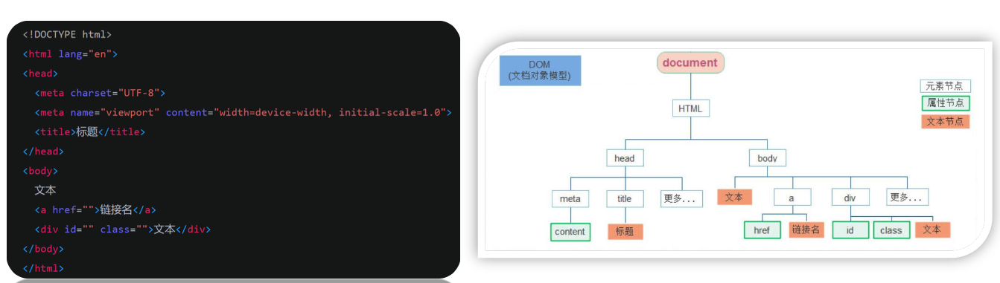

## 一、DOM：获取 DOM 元素、修改属性

### 1.1 Web API 基本认知

作用：使用 JS 去操作 HTML 和浏览器

分类：DOM 和 BOM

- DOM：操作 html 和 css
- BOM：操作浏览器


**什么是 DOM**

- DOM：Document Object Model--文档对象模型，是用来呈现以及任意 HTML 或 XML 文档交互的 API
- DOM 是浏览器提供的一套专门用来 `操作网页内容` 的功能
- DOM 作用：开发网页内容特效和实现用户交互
- 简单说：DOM 操作 htm 和 css

**DOM 树**

- 将 HTML 文档以树状结构只管的表现出来，我们称之为文档树或者 DOM树

- 描述网页内容关系的名词

- 作用：文档树直观的体现了标签与标签之间的关系

  

#### DOM对象

- DOM 对象：浏览器根据 html 标签生成的 js 对象
  - 所有的标签属性都可以在这个对象上面找到
  - 修改这个对象的属性会自动映射到标签身上
- DOM 核心思想：
  - 把网页内容当做对象来处理
- document 对象：
  - 是 DOM 提供的一个对象
  - 所有它提供的属性和方法都是用来访问和操作网页内容的
    - 例如：document.write
  - 网页所有内容都在 document 里面


### 1.2 获取 DOM 对象

#### 12.1 根据 CSS 选择器来获取 DOM 对象

**选择匹配的第一个元素**

语法：

```jsx
document.querySelector('css选择器')

参数：
包含一个或多个有效的css 选择器字符串

返回值：
css 选择器匹配的第一个元素，一个 HTMLElement 对象
如果没有匹配到，则返回 null

可以直接操作返回值
```

[参考文档](https://developer.mozilla.org/zh-CN/docs/Web/API/Document/querySelector)


**选择匹配多个元素**

语法:

```jsx
document.querySelectorAll('css 选择器')

参数：
包含一个或多个有效的 css 选择器字符串

返回值：
css 选择器匹配的 NodeList 对象集合

例如：
document.querySelectorAll('ul li')

无法直接操作，必须通过下标获取对应的 li 才能操作
```

`document.querySelectorAll('css 选择器')`：

- 获取单独是一个伪数组
  -  有长度有索引的数组
  - 但是没有 pop() 、push() 等数组方法
  - 想要得到里面的每一个对象，需要遍历获得


#### 1.2.2 其他获取 DOM 对象的方法

```jsx
// 根据 id 获取一个元素
documment.getElementById('Nav')

// 根据标签获取一类元素，获取页面所有的 div
document.getElementsByTagName('div')

// 根据类名获取元素 获取页面所有类名为 w 的元素
document.getElementsByClassName('w')
```


### 1.2 设置、修改 DOM 元素的内容

DOM 对象都是根据标签生成的，所有操作标签，本质上都是操作 DOM 对象

就是操作对象使用的点语法

如果想要修改标签元素里面的内容，可以使用以下几种方式：

- document.write()
- 对象.innerText 属性
- 对象.innerHTML 属性

**document.write()**

- 只能将文本内容追加到 `</body>` 前面的位置
- 文本中包含的标签会被解析

```jsx
document.write("NIHAO")
document.write('<h3> 你好，世界</h3>')
```


**对象.innerText 属性**

- 将文本内容添加/更新到任意标签位置 
- 文本中包含的标签不会被解析

```jsx
// innerText 将文本添加、更新到任意标签位置
let info = document.getElementById('info')

info.innerText = '<h4> 嗨，我叫李四</h4>'
```

> 只修改内容，不关注标签


**对象.innerHTML 属性**

- 文本内容添加/更新到任意标签位置 
- 文本中包含的标签会被解析

```jsx
box.innerHTML = '<h4> 嗨，我叫李四</h4>'
```

> 解析标签，可以修改内容和添加、更新标签信息


### 1.3 设置、修改 DOM 元素的属性

- 设置、修改元素常用属性
- 设置、修改元素样式属性
- 设置、修改表单元素属性


#### 1.3.1 设置、修改元素常用属性

- 还可以通过 JS 设置/修改标签元素属性，比如通过 src更换 图片 
- 最常见的属性比如: href、title、src 等
- **语法:**

```jsx
对象.属性 = 值

举例：
// 获取元素
let pic = document.querySelector('img')

// 操作元素
pic.src = './images/xxx.png'
pic.title = '这是一张图片'
```


#### 1.3.2 设置、修改元素样式属性

还可以通过 JS 设置/修改标签元素的样式属性。

- 比如通过 轮播图小圆点自动更换颜色样式

- 点击按钮可以滚动图片，这是移动的图片的位置 left 等等 

- 学习路径:

  - 通过 style 属性操作CSS

  - 操作类名(className) 操作CSS

  - 通过 classList 操作类控制CSS

##### 1.3.2.1 通过 style 属性操作CSS

语法：

```
对象.style.样式属性 = 值

例如：
let box = document.querySelector('.box')
// 修改背景颜色
box.style.backgroundcolor = 'red'
box.style.widht = '100px'
box.style.marginTop = '50px'
```

> 注意：
>
> - 修改样式通过 style 属性引出
> - 如果属性有 - 连接符，需要转换为小驼峰命名法
> - 赋值的时候，需要的时候不要忘记加 css 单位


##### 1.3.2.2 操作类名(className) 操作CSS

如果修改的样式比较多，直接通过 `style` 属性修改比较繁琐，我们可以通过借助与 css 类名的形式

语法：

```jsx
// active 是一个 css 类名
元素.className = 'active'
```

> 注意：
>
> - 由于 class 是关键字，所以使用 className 去代替
> - className 是使用新值替换旧值，如果需要添加一个类，需要保留之前的类名


##### 1.3.2.3 通过 classList 操作类控制CSS

为了解决 `className` 容易覆盖以前的类名，我们可以通过 `classList` 方式追加和删除类名

语法：

```jsx
// 追加一个类 
元素.classList.add('类名')

// 删除一个类
元素.classList.remove('类名')

// 切换一个类
元素.classList.toggle('类名')
```


#### 1.3.3 设置、修改表单元素属性

表单很多情况，也需要修改属性，比如点击眼睛，可以看到密码，本质是把表单类型转换为文本框 正常的有属性有取值的 跟其他的标签属性没有任何区别

- 获取: DOM对象.属性名
- 设置: DOM对象.属性名 = 新值

```jsx
表单.value = '用户名'
表单.type = 'password'
```

表单属性中添加就有效果，移除就没有效果，一律使用布尔值表示。如果为true：代表添加了该属性；如果是 false：代表移除了该属性

比如: disabled、checked、selected


### 1.4 定时器--间歇函数

- 网页中经常会需要一种功能:每隔一段时间需要自动执行一段代码，不需要我们手动去触发 
- 例如:网页中的倒计时
- 要实现这种需求，需要定时器函数
- 定时器函数有两种，今天我先讲间歇函数


#### 1.4.1 定时器函数的基本使用

定时器函数可以开启和关闭定时器

**开启定时器**

```jsx
setInterval(函数，间隔时间)

- 作用：每个一段时间调用这个函数
- 间隔时间单位是毫秒
```

示例：

```jsx
function repeat() {
  	console.log("iOS 程序员，就是头发多")
}
// 每隔一秒调用 repeat 函数
setInterval(repeat, 1000)
```

> 注意：
>
> - 函数名字不需要加括号
> - 定时器返回的是一个 id 数字


** 关闭定时器**

```jsx
let 变量名 = setInterval(函数名, 间隔时间)
clearInterval(变量名)
```

一般不会刚创建就听着，则是满足一定条件再停止

### 总结：

- 根据 CSS 选择器来获取 DOM 对象
  - `document.querySelector('css选择器')` ：获取选择器的第一个元素
  - `document.querySelectorAll('css选择器')`：获取选择所有的元素，是一个伪数组。
- 根据 id 获取一个元素：documment.getElementById('Nav')
- 根据标签获取一类元素，获取页面所有的 div：document.getElementsByTagName('div')
- 根据类名获取元素 获取页面所有类名为 w 的元素：document.getElementsByClassName('w')
  


## 额外知识

- console.dir()：打印对象所有的属性