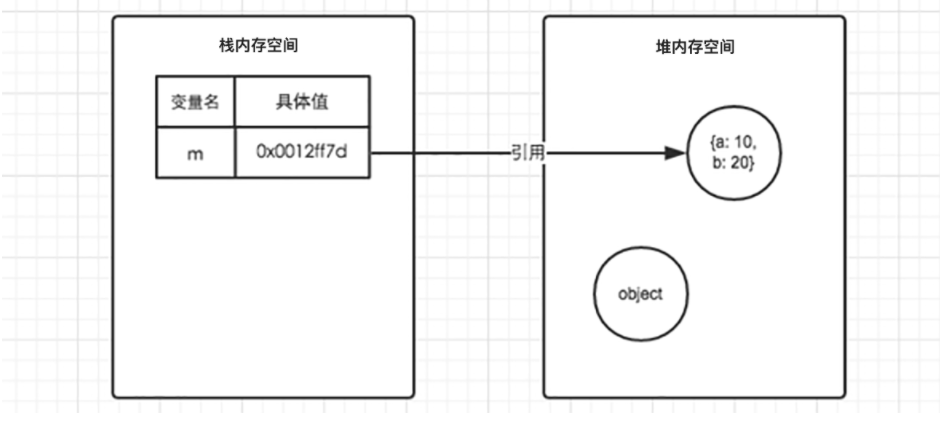
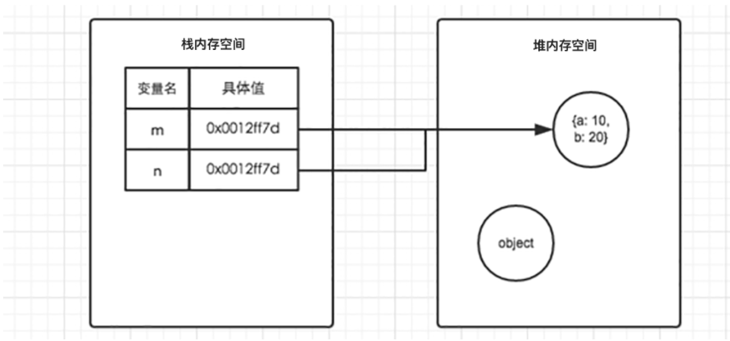
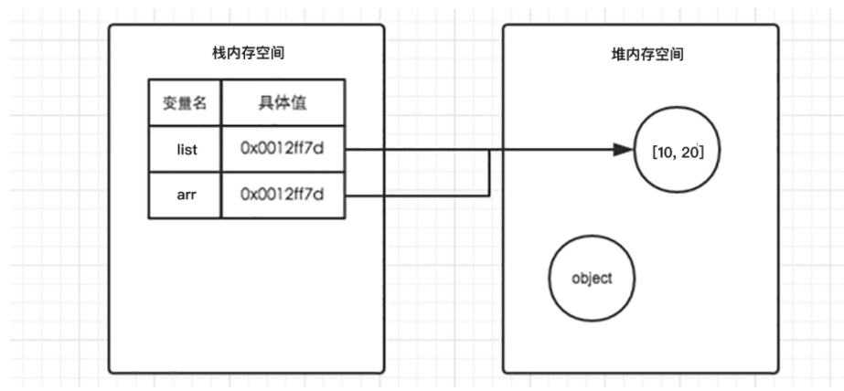
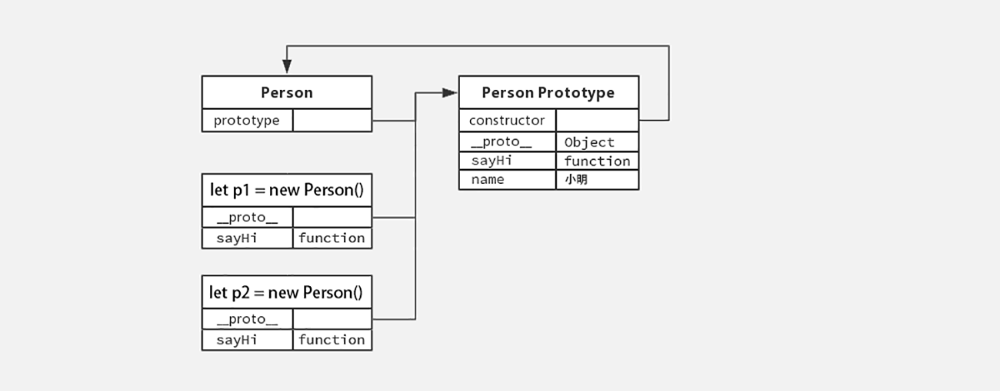
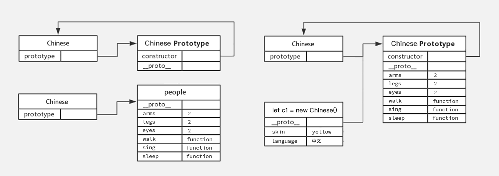
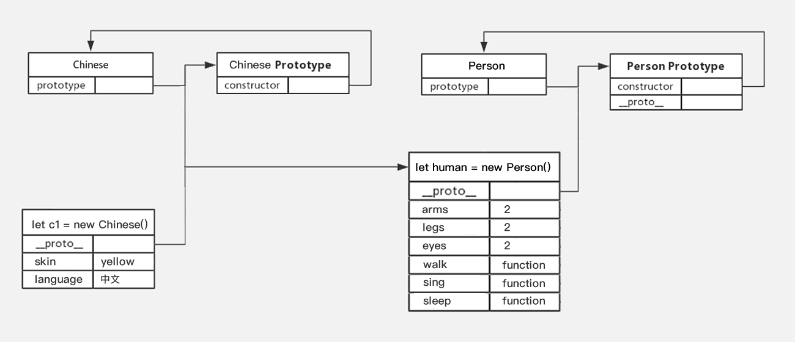

> 学习作用域、变量提升、闭包等语言特征，加深对 JavaScript 的理解，掌握变量赋值、函数声明的简洁语法，降低代码的冗余度。

- 理解作用域对程序执行的影响
- 能够分析程序执行的作用域范围
- 理解闭包本质，利用闭包创建隔离作用域
- 了解什么变量提升及函数提升
- 掌握箭头函数、解析剩余参数等简洁语法

## 一、作用域

作用域（scope）规定了变量能够被访问的“范围”，离开了这个“范围”变量便不能被访问，作用域分为全局作用域和局部作用域。

### 1.1 局部作用域

局部作用域分为函数作用域和块作用域。

#### 函数作用域

在函数内部声明的变量只能在函数内部被访问，外部无法直接访问。

```html
<script>
  // 声明 counter 函数
  function counter(x, y) {
    // 函数内部声明的变量
    let s = x + y;
    console.log(s); // 18
  }

  // 设用 counter 函数
  counter(10, 8);

  // 访问变量 s
  console.log(s); // 报错
</script>
```

总结：

1. 函数内部声明的变量，在函数外部无法被访问
2. 函数的参数也是函数内部的局部变量
3. 不同函数内部声明的变量无法互相访问
4. 函数执行完毕后，函数内部的变量实际被清空了


#### 块级作用域

在 JavaScript 中使用 `{}` 包裹的代码称为代码块，代码块内部声明的变量外部将【有可能】无法被访问。

```html
<script>
  {
    // age 只能在该代码块中被访问
    let age = 18;
    console.log(age); // 正常
  }
  
  // 超出了 age 的作用域
  console.log(age); // 报错
  
  let flag = true;
  if(flag) {
    // str 只能在该代码块中被访问
    let str = 'hello world!';
    console.log(str); // 正常
  }
  
  // 超出了 age 的作用域
  console.log(str); // 报错
  
  for(let t = 1; t <= 6; t++) {
    // t 只能在该代码块中被访问
    console.log(t); // 正常
  }
  
  // 超出了 t 的作用域
  console.log(t); // 报错
</script>
```

JavaScript 中除了变量外还有常量，常量与变量本质的区别是【常量必须要有值且不允许被重新赋值】，常量值为对象时其属性和方法允许重新赋值。

```html
<script>
  // 必须要有值
  const version = '1.0.0';

  // 不能重新赋值
  // version = '1.0.1';

  // 常量值为对象类型
  const user = {
    name: '小明',
    age: 18
  }

  // 不能重新赋值
  user = {};

  // 属性和方法允许被修改
  user.name = '小小明';
  user.gender = '男';
</script>
```

总结：

1. `let` 声明的变量会产生块作用域，`var` 不会产生块作用域
2. `const` 声明的常量也会产生块作用域
3. 不同代码块之间的变量无法互相访问
4. 推荐使用 `let` 或 `const`


注：开发中 `let` 和 `const` 经常不加区分的使用，如果担心某个值会不小被修改时，则只能使用 `const` 声明成常量。

| 关键字 | 块级作用域 | 变量提升 | 初始值 | 更改值 | 通过window调用 |
| ------ | :--------: | :------: | :----: | :----: | :------------: |
| let    |     √      |    ×√    |   -    |  Yes   |       No       |
| const  |     √      |    ×√    |  Yes   |   No   |       No       |
| var    |     ×      |    √     |   -    |  Yes   |      Yes       |

### 1.2 1.2 全局作用域

`<script>` 标签和 `.js` 文件的【最外层】就是所谓的全局作用域，在此声明的变量在函数内部也可以被访问。

```html
<script>
  // 此处是全局
  
  function sayHi() {
    // 此处为局部
  }

  // 此处为全局
</script>
```

全局作用域中声明的变量，任何其它作用域都可以被访问，如下代码所示：

```html
<script>
    // 全局变量 name
    let name = '小明';
  
  	// 函数作用域中访问全局
    function sayHi() {
      // 此处为局部
      console.log('你好' + name);
    }

    // 全局变量 flag 和 x
    let flag = true;
    let x = 10;
  
  	// 块作用域中访问全局
    if(flag) {
      let y = 5;
      console.log(x + y); // x 是全局的
    }
</script>
```

总结：

1. 为 `window` 对象动态添加的属性默认也是全局的，不推荐！
2. 函数中未使用任何关键字声明的变量为全局变量，不推荐！！！
3. 尽可能少的声明全局变量，防止全局变量被污染


> JavaScript 中的作用域是程序被执行时的底层机制，了解这一机制有助于规范代码书写习惯，避免因作用域导致的语法错误。


### 1.3 1.3 作用域链

在解释什么是作用域链前先来看一段代码：

```html
<script>
  // 全局作用域
  let a = 1;
  let b = 2;
	
  // 局部作用域
  function f() {
    let c;
    // 局部作用域
    function g() {
      let d = 'yo';
    }
  }
</script>
```

函数内部允许创建新的函数，`f` 函数内部创建的新函数 `g`，会产生新的函数作用域，由此可知作用域产生了嵌套的关系。

如下图所示，父子关系的作用域关联在一起形成了链状的结构，作用域链的名字也由此而来。


作用域链本质上是底层的变量查找机制，在函数被执行时，会优先查找当前函数作用域中查找变量，如果当前作用域查找不到则会依次逐级查找父级作用域直到全局作用域，如下代码所示：

```html
<script>
  // 全局作用域
  let a = 1;
  let b = 2;

  // 局部作用域
  function f() {
    let c;
    // let a = 10;
    console.log(a); // 1 或 10
    console.log(d); // 报错
    
    // 局部作用域
    function g() {
      let d = 'yo';
      // let b = 20;
      console.log(b); // 2 或 20
    }
    
    // 调用 g 函数
    g()
  }

  console.log(c); // 报错
  console.log(d); // 报错
  
  f();
</script>
```

总结：

1. 嵌套关系的作用域串联起来形成了作用域链
2. 相同作用域链中按着从小到大的规则查找变量
3. 子作用域能够访问父作用域，父级作用域无法访问子级作用域（就近原则）


### 1.4 闭包

闭包是一种比较特殊的函数，使用闭包能够访问函数作用域中的变量。从代码形式上看闭包是一个做为返回值的函数，如下代码所示：

```html
<script>
  function foo() {
    let i = 0;

    // 函数内部分函数
    function bar() {
			console.log(++i);
    }

    // 将函数做为返回值
    return bar;
  }
  
  // fn 即为闭包函数
  let fn = foo();
  
  fn(); // 1
</script>
```

总结：

闭包：一个作用域有权访问另外一个作用域的局部变量，

好处：可以把一个变量使用范围延伸

1. 闭包本质仍是函数，只不是从函数内部返回的
2. 闭包能够创建外部可访问的隔离作用域，避免全局变量污染
3. 过度使用闭包可能造成内存泄漏

注：回调函数也能访问函数内部的局部变量。


### 1.5 变量提升

变量提升是 JavaScript 中比较“奇怪”的现象，它允许在变量声明之前即被访问

```html
<script>
  // 访问变量 str
  console.log(str + 'world!');

  // 声明变量 str
  var str = 'hello ';
</script>

let和var都有提升，但是let定义的变量没有赋值之前是不可以使用、var可以使用是undefined
```

总结：

1. 变量在未声明即被访问时会报语法错误
2. 变量在声明之前即被访问，变量的值为 `undefined`
3. `let` 声明的变量不存在变量提升，推荐使用 `let`【也有人认为具有提升但是不赋值不能使用】
4. 变量提升出现在相同作用域当中
5. 实际开发中推荐先声明再访问变量

注：关于变量提升的原理分析会涉及较为复杂的词法分析等知识，而开发中使用 `let` 可以轻松规避变量的提升，因此在此不做过多的探讨，有兴趣可[查阅资料](https://segmentfault.com/a/1190000013915935)。


## 二、函数

知道函数参数默认值、动态参数、剩余参数的使用细节，提升函数应用的灵活度，知道箭头函数的语法及与普通函数的差异。

### 2.1 函数提升

函数提升与变量提升比较类似，是指函数在声明之前即可被调用。

```html
<script>
  // 调用函数
  foo();

  // 声明函数
  function foo() {
    console.log('声明之前即被调用...');
  }

  // 不存在提升现象
  bar();
  var bar = function () {
    console.log('函数表达式不存在提升现象...');
  }
</script>
```

总结：

1. 函数提升能够使函数的声明调用更灵活
2. 函数表达式不存在提升的现象
3. 函数提升出现在相同作用域当中


### 2.2 参数

函数参数的使用细节，能够提升函数应用的灵活度。

#### 2.2.1 默认值

```html
<script>
  // 设置参数默认值
  function sayHi(name="小明", age=18) {
    document.write(`<p>大家好，我叫${name}，我今年${age}岁了。</p>`);
  }
  // 调用函数
  sayHi();
  sayHi('小红');
  sayHi('小刚', 21);
</script>
```

总结：

1. 声明函数时为形参赋值即为参数的默认值
2. 如果参数未自定义默认值时，参数的默认值为 `undefined`
3. 调用函数时没有传入对应实参时，参数的默认值被当做实参传入


#### 2.2.2 动态参数

`arguments` 是函数内部内置的伪数组变量，它包含了调用函数时传入的所有实参。

```html
<script>
  // 求生函数，计算所有参数的和
  function sum() {
    // console.log(arguments);
    let s = 0;
    for(let i = 0; i < arguments.length; i++) {
      s += arguments[i];
    }
    console.log(s);
  }

  // 调用求和函数
  sum(5, 10); // 两个参数
  sum(1, 2, 4); // 两个参数
</script>
```

总结：

1. `arguments` 是一个伪数组
2. `arguments` 的作用是动态获取函数的实参


#### 2.2.3 剩余参数

```html
<script>
  function config(baseURL, ...other) {
    console.log(baseURL);
    // other 是真数组，动态获取实参
    console.log(other);
  }

  // 调用函数
  config('http://baidu.com', 'get', 'json');
</script>
```

总结：

1. `...` 是语法符号，置于最末函数形参之前，用于获取多余的实参
2. 借助 `...` 获取的剩余实参


### 2.3 箭头函数

箭头函数是一种声明函数的简洁语法，它与普通函数并无本质的区别，差异性更多体现在语法格式上。

```html
<script>
  // 箭头函数
  let foo = () => {
    console.log('^_^ 长相奇怪的函数...');
  }
  // 调用函数
  foo();
  
  // 更简洁的语法
  let form = document.querySelector('form');
  form.addEventListener('click', ev => ev.preventDefault());
</script>
```

总结：

1. 箭头函数属于表达式函数，因此不存在函数提升
2. 箭头函数只有一个参数时可以省略圆括号 `()`
3. 箭头函数函数体只有一行代码时可以省略花括号 `{}`，并自动做为返回值被返回
4. 箭头函数中没有 `arguments`，只能使用 `...` 动态获取实参
5. 涉及到this的使用，不建议用箭头函数


## 三、解构赋值

> 知道解构的语法及分类，使用解构简洁语法快速为变量赋值。

解构赋值是一种快速为变量赋值的简洁语法，本质上仍然是为变量赋值，分为数组解构、对象解构两大类型。


### 3.1 数组解构

数组解构是将数组的单元值快速批量赋值给一系列变量的简洁语法，如下代码所示：

```html
<script>
  // 普通的数组
  let arr = [1, 2, 3];
  // 批量声明变量 a b c 
  // 同时将数组单元值 1 2 3 依次赋值给变量 a b c
  let [a, b, c] = arr;
  console.log(a); // 1
  console.log(b); // 2
  console.log(c); // 3
</script>
```

总结：

1. 赋值运算符 `=` 左侧的 `[]` 用于批量声明变量，右侧数组的单元值将被赋值给左侧的变量
2. 变量的顺序对应数组单元值的位置依次进行赋值操作
3. 变量的数量大于单元值数量时，多余的变量将被赋值为  `undefined`
4. 变量的数量小于单元值数量时，可以通过 `...` 获取剩余单元值，但只能置于最末位
5. 允许初始化变量的默认值，且只有单元值为 `undefined` 时默认值才会生效

注：支持多维解构赋值，比较复杂后续有应用需求时再进一步分析


### 3.2 对象解构

对象解构是将对象属性和方法快速批量赋值给一系列变量的简洁语法，如下代码所示：

```html
<script>
  // 普通对象
  let user = {
    name: '小明',
    age: 18
  };

  // 批量声明变量 name age
  // 同时将数组单元值 1 2 3 依次赋值给变量 a b c
  let {name, age} = user;

  console.log(name); // 小明
  console.log(age); // 18
</script>
```

总结：

1. 赋值运算符 `=` 左侧的 `{}` 用于批量声明变量，右侧对象的属性值将被赋值给左侧的变量
2. 对象属性的值将被赋值给与属性名相同的变量
3. 对象中找不到与变量名一致的属性时变量值为 `undefined`
4. 允许初始化变量的默认值，属性不存在或单元值为 `undefined` 时默认值才会生效

注：支持多维解构赋值，比较复杂后续有应用需求时再进一步分析


### 三、面向对象

> 了解面向对象编程的基础概念及构造函数的作用，体会 JavaScript 一切皆对象的语言特征，掌握常见的对象属性和方法的使用。

- 了解面向对象编程中的一般概念

- 能够基于构造函数创建对象

- 理解 JavaScript 中一切皆对象的语言特征

- 理解引用对象类型值存储的的特征

- 掌握包装类型对象常见方法的使用

  

### 3.1 构造函数

构造函数是专门用于创建对象的函数，如果一个函数使用 `new` 关键字调用，那么这个函数就是构造函数。

```html
<script>
  // 定义函数
  function foo() {
    console.log('通过 new 也能调用函数...');
  }
  // 调用函数
  new foo;
</script>
```

总结：

2. 使用 `new` 关键字调用函数的行为被称为实例化
3. 实例化构造函数时没有参数时可以省略 `()`
4. 构造函数的返回值即为新创建的对象
5. 构造函数内部的 `return` 返回的值无效！

注：实践中为了从视觉上区分构造函数和普通函数，习惯将构造函数的首字母大写。


### 3.2 实例成员

通过构造函数创建的对象称为实例对象，实例对象中的属性和方法称为实例成员。

```html
<script>
  // 构造函数
  function Person() {
    // 构造函数内部的 this 就是实例对象

    // 实例对象中动态添加属性
    this.name = '小明';
    // 实例对象动态添加方法
    this.sayHi = function () {
      console.log('大家好~');
    }
  }

  // 实例化，p1 是实例对象
  // p1 实际就是 构造函数内部的 this
  let p1 = new Person();

  console.log(p1);
  console.log(p1.name); // 访问实例属性
  p1.sayHi(); // 调用实例方法
</script>
```

总结：

1. 构造函数内部 `this` 实际上就是实例对象，为其动态添加的属性和方法即为实例成员
2. 为构造函数传入参数，动态创建结构相同但值不同的对象
3. 实例对象的 `constructor`  属性指向了构造函数
4. `instanceof` 用于检测实例对象对应的构造函数

注：构造函数创建的实例对象彼此独立互不影响。


### 3.3 静态成员

在 JavaScript 中底层函数本质上也是对象类型，因此允许直接为函数动态添加属性或方法，构造函数的属性和方法被称为静态成员。

```html
<script>
  // 构造函数
  function Person(name, age) {
    // 省略实例成员
  }

  // 静态属性
  Person.eyes = 2;
  Person.arms = 2;
  // 静态方法
  Person.walk = function () {
    console.log('^_^人都会走路...');
    // this 指向 Person
    console.log(this.eyes);
  }
</script>
```

总结：

1. 静态成员指的是添加到构造函数本身的属性和方法
2. 一般公共特征的属性或方法静态成员设置为静态成员
3. 静态成员方法中的 `this` 指向构造函数本身


## 四、一切皆对象

> 体会 JavaScript 一切皆对象的语言特征，掌握各引用类型和包装类型对象属性和方法的使用。

在 JavaScript 中**最主要**的数据类型有 6 种，分别是字符串、数值、布尔、undefined、null 和 对象，常见的对象类型数据包括数组和普通对象。其中字符串、数值、布尔、undefined、null 也被称为简单类型或基础类型，对象也被称为引用类型。

在 JavaScript 内置了一些构造函数，绝大部的数据处理都是基于这些构造函数实现的，JavaScript 基础阶段学习的 `Date` 就是内置的构造函数。

```html
<script>
  // 实例化
	let date = new Date();
  
  // date 即为实例对象
  console.log(date);
    
    
    简单数据类型：字符串、数字、布尔、undefined、null
    (引用类型)复杂数据类型：对象（数组）
    
</script>
```

甚至字符串、数值、布尔、数组、普通对象也都有专门的构造函数，用于创建对应类型的数据。


### 4.1 引用类型

#### 4.1.1 Object

`Object` 是内置的构造函数，用于创建普通对象。

```html
<script>
  // 通过构造函数创建普通对象
  let user = new Object({name: '小明', age: 15});

  // 这种方式声明的变量称为【字面量】
  let student = {name: '杜子腾', age: 21}
  
  // 对象语法简写
  let name = '小红';
  let people = {
    // 相当于 name: name
    name,
    // 相当于 walk: function () {}
    walk () {
      console.log('人都要走路...');
    }
  }

  console.log(student.constructor);
  console.log(user.constructor);
  console.log(student instanceof Object);
</script>
```

下图展示了普通对象在内存中的存储方式：普通对象数据保存在堆内存之中，栈内存中保存了普通对象在堆内存的地址。



普能对象在赋值时只是复制了栈内中的地址，而非堆内存中的数据，如下图所示：



普通对象赋值后，无论修改哪个变量另一个对象的数据值也会相当发生改变。

总结：

1. 推荐使用字面量方式声明对象，而不是 `Object` 构造函数
2. `Object.assign` 静态方法创建新的对象
3. `Object.keys` 静态方法获取对象中所有属性
4. `Object.values` 表态方法获取对象中所有属性值

面试回答堆与栈的区别：

1. 堆和栈是内存中的数据存储空间
2. 简单类型的数据保存在内存的栈空间中
3. 引用类型的数据保存在内存的堆空间中，栈内存中存取的是引用类型的地址（房间号）


#### 4.1.2 Array

`Array` 是内置的构造函数，用于创建数组。

```html
<script>
  // 构造函数创建数组
  let arr = new Array(5, 7, 8);

  // 字面量方式创建数组
  let list = ['html', 'css', 'javascript'];

  console.log(list.constructor);
  console.log(list instanceof Array);
</script>

```

数组在内存中的存储方式与普通对象一样，如下图所示：


数组在赋值时只是复制了栈内中的地址，而非堆内存中的数据，如下图所示：



数组赋值后，无论修改哪个变量另一个对象的数据值也会相当发生改变。

总结：

1. 推荐使用字面量方式声明数组，而不是 `Array` 构造函数

2. 实例方法 `forEach` 用于遍历数组，替代 `for` 循环

   ```jsx
   arr.forEach(function(currentObj, index, arr) {
     
   })
   --- currentObj: 必须参数，当前正在处理的元素
   --- index：可选参数，当前处理元素的索引
   --- arr： 可选参数，当前操作的数组
   
   可以简写：
   arr.forEach(obj => console.log(obj))
   ```

3. 实例方法 `filter` 过滤数组单元值，生成新数组

4. 实例方法 `map` 迭代原数组，生成新数组

5. 实例方法 `join` 数组单元素拼接成了符串

6. 实例方法 `concat`  合并两个数组，生成新数组

7. 实例方法 `sort` 对原数组单元值排序

8. 实例方法 `splice` 删除或替换原数组单元

9. 实例方法 `indexOf` 检索数组单元值

10. 实例方法 `reverse` 反转数组

11. 静态方法 `from` 伪数组转成数组

12. 实例方法 `every` 测试一个数组内的所有元素是否都能通过某个指定函数的测试

    1. 若收到一个空数组，此方法在一切情况下都会返回 `true`
    2. 参数和上面的 `forEach` 一样，规则一样

13. 实例方法 `reduce`：对数组中的每个元素按序执行一个由您提供的 **reducer** 函数，每一次运行 **reducer** 会将先前元素的计算结果作

    为参数传入，最后将其结果汇总为单个返回值。

    ```
    / Arrow function
    reduce((previousValue, currentValue) => { /* ... */ } )
    reduce((previousValue, currentValue, currentIndex) => { /* ... */ } )
    reduce((previousValue, currentValue, currentIndex, array) => { /* ... */ } )
    reduce((previousValue, currentValue, currentIndex, array) => { /* ... */ }, initialValue)
    
    // Callback function
    reduce(callbackFn)
    reduce(callbackFn, initialValue)
    
    // Inline callback function
    reduce(function(previousValue, currentValue) { /* ... */ })
    reduce(function(previousValue, currentValue, currentIndex) { /* ... */ })
    reduce(function(previousValue, currentValue, currentIndex, array) { /* ... */ })
    reduce(function(previousValue, currentValue, currentIndex, array) { /* ... */ }, initialValue)
    ```

    - `previousValue`：上一次调用 `callbackFn` 时的返回值。第一次调用时，若指定了初始值 `initialValue` ，则值为 `initialValue`，否则为数组索引 0 的元素 `arr[0]`

    - `currentValue`：数组中正在处理的元素。在第一次调用时，若指定了初始值 `initialValue`，其值则为数组索引为 0 的元素 

      `array[0]`，否则为 `array[1]`。

    - `currentIndex`：数组中正在处理的元素的索引。若指定了初始值 `initialValue`，则起始索引号为 0，否则从索引 1 起始。

    - `array`：用于遍历的数组。

    - `initialValue`：作为第一次调用 `callback` 函数时参数 `previousValue` 的值。若指定了初始值 `initialValue`，则 `currentValue` 则将使用数组第一个元素；否则 `previousValue` 将使用数组第一个元素，而 `currentValue` 将使用数组第二个元素。


#### 4.1.3 RegExp

`RegExp` 内置的构造函数，用于创建正则表达式。

Regular Expression

```html
<script>
  // 构造函数创建正则
  let reg = new RegExp('\d', 'i');

  // 字面量方式创建正则
  // let reg = /(\d)/i;

  reg.exec('123');
</script>
```

总结：

1. 推荐使用字面量定义正则表达式，而不是 `RegExp` 构造函数
2. `RegExp` 静态属性 $1、$2、$3、... 获取正则分组单元

补充：当使用构造函数创建正则时有两种写法：

```html
<script>
  // 使用 // 定义正则
  let reg = new RegExp(/\d/);
  
  // 或者使用 '' 定义正则
  // 如果使用引号定义正则时，\d、\s、\w
    需要多添加一个 \
  let reg1 = new RegExp('\\d');
</script>
```


### 4.2 包装类型

在 JavaScript 中的字符串、数值、布尔具有对象的使用特征，如具有属性和方法，如下代码举例：

```html
<script>
  // 字符串类型
  let str = 'hello world!';
 	// 统计字符的长度（字符数量）
  console.log(str.length);
  
  // 数值类型
  let price = 12.345;
  // 保留两位小数
  price.toFixed(2);
</script>
```

之所以具有对象特征的原因是字符串、数值、布尔类型数据是 JavaScript 底层使用 Object 构造函数“包装”来的，被称为包装类型。


#### 4.2.1 String

`String` 是内置的构造函数，用于创建字符串。

```html
<script>
  // 使用构造函数创建字符串
  let str = new String('hello world!');

  // 字面量创建字符串
  let str2 = '你好，世界！';

  // 检测是否属于同一个构造函数
  console.log(str.constructor === str2.constructor); // true
  console.log(str instanceof String); // false
</script>
```

总结：

1. 推荐使用字面量方式声明字符串，而不是 `String` 构造函数
2. 实例属性 `length` 用来获取字符串的度长
3. 实例方法 `split` 用来将字符串拆分成数组
4. 实例方法 `toUpperCase` 用于将字母转换成大写
5. 实例方法 `toLowerCase` 用于将字母转换成小写
6. 实例方法 `slice` 用于字符串截取
7. 实例方法 `indexOf`  检测是否包含某字符
8. 实例方法 `startsWith` 检测是否以某字符开头
9. 实例方法 `endsWith` 检测是否以某字符结尾
10. 实例方法 `replace` 用于替换字符串，支持正则匹配
11. 实例方法  `padStart` 固定长度字符开始位置打补丁
12. 实例方法  `padEnd` 固定长度字符结束位置打补丁
13. 实例方法 `match` 用于查找字符串，支持正则匹配

注：String 也可以当做普通函数使用，这时它的作用是强制转换成字符串数据类型。


#### 4.2.2 Number

`Number` 是内置的构造函数，用于创建数值。

```html
<script>
  // 使用构造函数创建数值
  let x = new Number('10');
  let y = new Number(5);

  // 字面量创建数值
  let z = 20;

  // 检测是否属于同一个构造函数
  console.log(x.constructor === z.constructor);
</script>
```

总结：

1. 推荐使用字面量方式声明数值，而不是 `Number` 构造函数
2. 实例方法 `toFixed` 用于设置保留小数位的长度

注：Number 也可以当做普通函数使用，这时它的作用是强制转换成数值数据类型。


#### 4.2.3 Boolen

`Boolean` 是内置的构造函数，用于创建布尔值。

```html
<script>
  // 使用构造函数创建布尔类型
  let locked = new Boolean('10');

  // 字面量创建布尔类型
  let flag = true;

  // 检测是否属于同一个构造函数
  console.log(locked.constructor === flag.constructor);
</script>
```

总结：

1. 推荐使用字面量方式声明布尔值，而不是 `Boolean` 构造函数

注：Boolean 也可以当做普通函数使用，这时它的作用是强制转换成布尔类型数据，由其它数据类型转换成布尔类型的数据被称为真值（truly）或假值（falsly）。


### 4.3 总结

至此对 JavaScript 有了更深的理解，即 JavaScript 中一切皆为对象，还有以前学习的 window、Math 对象，最后补充一点无论是引用类型或是包装包类型都包含两个公共的方法 `toString` 和 `valueOf`

```html
<script>
  // 对象类型数据
  let user = {name: '小明', age: 18}
  // 数值类型	 
  let num = 12.345;
  // 字符串类型
  let str = 'hello world!';
  
  str.valueOf(); // 原始值
  user.toString(); // 表示该对象的字符串
</script>
```

总计：

1. `valueOf` 方法获取原始值，数据内部运算的基础，很少主动调用该方法
2. `toString` 方法以字符串形式表示对象


## 五、面向对象

面向对象编程是一种程序设计思想，它具有 3 个显著的特征：封装、继承、多态。

### 5.1 封装

封装的本质是将具有关联的代码组合在一起，其优势是能够保证代码复用且易于维护，函数是最典型也是最基础的代码封装形式，面向对象思想中的封装仍以函数为基础，但提供了更高级的封装形式。

#### 5.1.1 命名空间

先来回顾一下以往代码封装的形式：

```html
<script>
  // 普通对象（命名空间）形式的封装
  let beats = {
    name: '狼',
    setName: function (name) {
      this.name = this.name;
    },
    getName() {
      console.log(this.name);
    }
  }

  beats.setName('熊');
  beats.getName();
</script>
```

以往以普通对象（命名空间）形式封装的代码只是单纯把一系列的变量或函数组合到一起，所有的数据变量都被用来共享（使用 this 访问）。


#### 5.1.2 构造函数

对比以下通过面向对象的构造函数实现的封装：

```html
<script>
  function Person() {
    this.name = '佚名';
    // 设置名字
    this.setName = function (name) {
      this.name = name;
    }
    // 读取名字
    this.getName = () => {
      console.log(this.name);
    }
  }

  // 实例对像，获得了构造函数中封装的所有逻辑
  let p1 = new Person();
  p1.setName('小明');
  console.log(p1.--name);// 小明

  // 实例对象
  let p2 = new Person();
  console.log(p2.name); // 佚名
</script>
```

构造函数相当于一个"模子"，能够像字面量那样创建出对象来，所不同的是借助构造函数创建出来的实例对象之间是**彼此不影响**的。

总结：

1. 构造函数体现了面向对象的封装特性
2. 构造函数实例创建的对象彼此独立、互不影响
3. 命名空间式的封装无法保证数据的独立性

注：可以举一些例子，如女娲造人等例子，加深对构造函数的理解。


#### 5.1.3 原型对象

实际上每一个构造函数都有一个名为 `prototype` 的属性，译成中文是原型的意思，`prototype` 的是对象类据类型，称为构造函数的原型对象，每个原型对象都具有 `constructor` 属性代表了该原型对象对应的构造函数。

```html
<script>
  function Person() {
    
  }

  // 每个函数都有 prototype 属性
  console.log(Person.prototype);
</script>
```

如下图所示：


了解了 JavaScript 中构造函数与原型对象的关系后，再来看原型对象具体的作用，如下代码所示：

```html
<script>
  function Person() {
    // 此处未定义任何方法
  }

  // 为构造函数的原型对象添加方法
  Person.prototype.sayHi = function () {
    console.log('Hi~');
  }
	
  // 实例化
  let p1 = new Person();
  p1.sayHi(); // 输出结果为 Hi~
</script>
```

其结构如图所示：


构造函数 `Person` 中未定义任何方法，这时实例对象调用了原型对象中的方法 `sayHi`，接下来改动一下代码：

```html
<script>
  function Person() {
    // 此处定义同名方法 sayHi
    this.sayHi = function () {
      console.log('嗨!');
    }
  }

  // 为构造函数的原型对象添加方法
  Person.prototype.sayHi = function () {
    console.log('Hi~');
  }

  let p1 = new Person();
  p1.sayHi(); // 输出结果为 嗨!
</script>
```


构造函数 `Person` 中定义与原型对象中相同名称的方法，这时实例对象调用则是构造函中的方法 `sayHi`。

通过以上两个简单示例不难发现 JavaScript 中对象的工作机制：**当访问对象的属性或方法时，先在当前实例对象是查找，然后再去原型对象查找，并且原型对象被所有实例共享。**

```html
<script>
  function Person() {
    // 此处定义同名方法 sayHi
    this.sayHi = function () {
      console.log('嗨!' + this.name);
    }
  }

  // 为构造函数的原型对象添加方法
  Person.prototype.sayHi = function () {
    console.log('Hi~' + this.name);
  }
  // 在构造函数的原型对象上添加属性
  Person.prototype.name = '小明';

  let p1 = new Person();
  p1.sayHi(); // 输出结果为 嗨!
  
  let p2 = new Person();
  p2.sayHi();
</script>
```



什么是原型对象？？

 答：是构造函数的一个属性，它的数据类型是对象

 原型对象有啥用？？

 答：原型对象对应的构造函数的实例方法或属性不存在时会去查找原型对象

总结：**结合构造函数原型的特征，实际开发重往往会将封装的功能函数添加到原型对象中。**


### 5.2 继承

继承是面向对象编程的另一个特征，通过继承进一步提升代码封装的程度，JavaScript 中大多是借助原型对象实现继承的特性。

龙生龙、凤生凤、老鼠的儿子会打洞描述的正是继承的含义，分别封装中国人和日本人的行为特征来理解编程中继承的含义，代码如下：

```html
<script>
  // 封装中国人的行为特征
  function Chinese() {
    // 中国人的特征
    this.arms = 2;
    this.legs = 2;
    this.eyes = 2;

    this.skin = 'yellow';
    this.language = '中文';

    // 中国人的行为
    this.walk = function () {}
    this.sing = function () {}
    this.sleep = function () {}
  }

  // 封装日本人的行为特征
  function Japanese() {
    // 日本人的特征
    this.arms = 2;
    this.legs = 2;
    this.eyes = 2;

    this.skin = 'yellow';
    this.language = '日文';

    // 日本人的行为
    this.walk = function () {}
    this.sing = function () {}
    this.sleep = function () {}
  }
</script>
```

其实我们都知道无论是中国人、日本人还是其它民族，人们的大部分特征是一致的，然而体现在代码中时人的相同的行为特征被重复编写了多次，代码显得十分冗余，我们可以将重复的代码抽离出来：


#### 5.2.1 原型继承

基于构造函数原型对象实现面向对象的继承特性。

```html
<script>
  // 所有人
  function Person() {
    // 人的特征
    this.arms = 2;
    this.legs = 2;
    this.eyes = 2;
    
    // 人的行为
    this.walk = function () {}
    this.sing = function () {}
    this.sleep = function () {}
  }
  
  // 中国人
  function Chinese() {
    this.skin = 'yellow';
    this.language = '中文';
  }
  // 日本人
  function Japanese() {
    this.skin = 'yellow';
    this.language = '日文';
  }
</script>
```

上述代码可以理解成将 `Chinese` 和 `Japanese` 共有的属性和方法提取出来了，也就是说 `Chinese` 和 `Japanese` 需要【共享】一些属性和方法，而原型对象的属性和方法恰好是可以被用来共享的，因此我们看如下代码：

```html
<script>
  // 中国人
  function Chinese() {
    this.skin = 'yellow';
    this.language = '中文';
  }
  // 日本人
  function Japanese() {
    this.skin = 'yellow';
    this.language = '日文';
  }
  
  // 人们【共有】的行为特征
  let people = {
    // 人的特征
    arms: 2,
    legs: 2,
    eyes:2,
    // 人的行为
    walk: function () {},
    sleep: function () {},
    sing: function () {}
  }
  
  // 为 prototype 重新赋值
  Chinese.prototype = people;
  Chinese.prototype.constructor = Chinese;
</script>
```

如下图所示：



创建对象 `people` 将公共的的属性和方法独立出来，然后赋值给构造函数的 `prototype` 这样无论有多少个民族都可以共享公共的属性和方法了：

```html
<script>
  // 人们【共有】的行为特征
  let people = {
    // 人的特征
    arms: 2,
    legs: 2,
    eyes:2,
    // 人的行为
    walk: function () {},
    sleep: function () {},
    sing: function () {}
  }
  
  // 中国人
  function Chinese() {
    this.skin = 'yellow';
    this.language = '中文';
  }
  // 日本人
  function Japanese() {
    this.skin = 'yellow';
    this.language = '日文';
  }
  
  function Englist() {
    this.skin = 'white';
    this.language= '英文';
  }
  
  // 中国人
  Chinese.prototype = people;
  Chinese.prototype.constructor = Chinese;
  
  let c1 = new Chinese();
 	
  // 日本人
  Japanese.prototype = people;
  Janpanese.prototype.constructor = Japanese;
  // 英国人
  English.prototype = people;
  English.prototype.constructor = English;
  
  // ...
</script>
```

继承是一种可以“不劳而获”的手段！！！上述代码中 `Chinese`、`Japanese`、`English` 都轻松的获得了 `people` 的公共的方法和属性，我们说 `Chinese`、`Japanese`、`English` 继承了 `people`。

上述代码中是以命名空间的形式实现的继承，事实上 JavaScript 中继承更常见的是借助构造函数来实现：

```html
<script>
  // 所有人
  function Person() {
    // 人的特征
    this.arms = 2;
    this.legs = 2;
    this.eyes = 2;

    // 人的行为
    this.walk = function () {}
    this.sing = function () {}
    this.sleep = function () {}
  }

  // 封装中国人的行为特征
  function Chinese() {
    // 中国人的特征
    this.skin = 'yellow';
    this.language = '中文';
  }

  // 封装日本人的行为特征
  function Japanese() {
    // 日本人的特征
    this.skin = 'yellow';
    this.language = '日文';
  }

  // human 是构造函数 Person 的实例
  let human = new Person();

  // 中国人
  Chinese.prototype = new Person();
  Chinese.prototype.constructor = Chinese;
  // 日本人
  Japanese.prototype = human;
  Japanese.prototype.constructor = Japanese;
</script>
```

如下图所示：




#### 5.2.2 原型链

基于原型对象的继承使得不同构造函数的原型对象关联在一起，并且这种关联的关系是一种链状的结构，我们将原型对象的链状结构关系称为原型链，如下图所示：


```html
作用：用于查找成员提供机制

<script>
  // Person 构造函数
  function Person() {
    this.arms = 2;
    this.walk = function () {}
  }
	
  // Person 原型对象
  Person.prototype.legs = 2;
  Person.prototype.eyes = 2;
  Person.prototype.sing = function () {}
  Person.prototype.sleep = function () {}
	
  // Chinese 构造函数
  function Chinese() {
    this.skin = 'yellow';
    this.language = '中文';
  }
	
  // Chinese 原型对象
  Chinese.prototype = new Person();
  Chinese.prototype.constructor = Chinese;
	
  // 实例化
  let c1 = new Chinese();
  console.log(c1);
</script>
```

在 JavaScript 对象中包括了一个非标准备的属性 `__proto__` 它指向了构造函数的原型对象，通过它可以清楚的查看原型对象的链状结构。


### 总结

面向对象（OOP）是编程时的一种指导思想，需要通过不断的实践才能体会面向对象编程的优势，在 JavaScript 中面向对象编程的实现是以构造函数和原型对象为核心的，因此掌握构造函数和原型对象的语法是灵活运用面向对象的基础。

面向对象多态的特性在 JavaScript 中应用场景相对较少，本次课中暂不讲解。


## 六、异常处理

了解 JavaScript 中程序异常处理的方法，提升代码运行的健壮性。

### 6.1 throw

异常处理是指预估代码执行过程中可能发生的错误，然后最大程度的避免错误的发生导致整个程序无法继续运行。

```html
<script>
  function counter(x, y) {

    if(!x || !y) {
      // throw '参数不能为空!';
      throw new Error('参数不能为空!');
    }

    return x + y;
  }

  counter();
</script>
```

总结：

1. `throw` 抛出异常信息，程序也会终止执行
2. `throw` 后面跟的是错误提示信息
3. `Error` 对象配合 `throw` 使用，能够设置更详细的错误信息


### 6.2 try...catch

```html
<script>
  function foo() {

    try {
      // 查找 DOM 节点
      var p = docunent.querySelector('p');

    } catch(error) {
      // try 代码段中执行有错误时，会执行 catch 代码段

      // 查看错误信息
      console.log(error.message);

      // 终止代码继续执行
      return;
    }

    // 改变文本样式
    p.style.color = 'red';
  }

  foo();
</script>
```

总结：

1. `try...catch` 用于捕获错误信息
2. 将预估可能发生错误的代码写在 `try` 代码段中
3. 如果 `try` 代码段中出现错误后，会执行 `catch` 代码段，并截获到错误信息


## 七、this

> 了解函数中 this 在不同场景下的默认值，动态指定函数 this 的值，提升代码封装的灵活度。

- 能够区分不同场景下函数中 `this` 的默认值
- 知道箭头函数的普通函数的区别，掌握箭头函数的使用
- 能够动指定函数中 `this` 的值
- 了解基于类的面向对象的实现语法


### 7.1 默认值

`this` 是 JavaScript 最具“魅惑”的知识点，不同的应用场合 `this` 的取值可能会有意想不到的结果，在此我们对以往学习过的关于【 `this` 默认的取值】情况进行归纳和总结。

#### 7.1.1 普通函数

**普通函数**的调用方式决定了 `this` 的值，即【谁调用 `this` 的值指向谁】，如下代码所示：

```html
<script>
  // 普通函数
  function sayHi() {
    console.log(this);
  }
  // 函数表达式
  let sayHello = function () {
    console.log(this);
  }
	
  // 函数的调用方式决定了 this 的值
  sayHi(); // window
  window.sayHi();
	
 	// 普通对象
  let user = {
    name: '小明',
    walk: function () {
      console.log(this);
    }
  };
  // 动态为 user 添加方法
  user.sayHi = sayHi;
  uesr.sayHello = sayHello;
	
  // 函数调用方式，决定了 this 的值
  user.sayHi();
  user.sayHello();
</script>
```

注： 普通函数没有明确调用者时 `this` 值为 `window`，严格模式下没有调用者时 `this` 的值为 `undefined`。


#### 7.1.2 箭头函数

**箭头函数**中的 `this` 与普通函数完全不同，也不受调用方式的影响，事实上箭头函数中并不存在 `this` ！箭头函数中访问的 `this` 不过是箭头函数所在作用域的 `this` 变量。

```html
<script>
  console.log(this); // 此处为 window
  // 箭头函数
  let sayHi = function() {
    console.log(this); // 该箭头函数中的 this 为函数声明环境中 this 一致
  }

  // 普通对象
  let user = {
    name: '小明',
    // 该箭头函数中的 this 为函数声明环境中 this 一致
    walk: () => {
      console.log(this);
    },
    
    sleep: function () {
      let str = 'hello';
      console.log(this);
      let fn = () => {
        console.log(str);
        console.log(this); // 该箭头函数中的 this 与 sleep 中的 this 一致
      }
      // 调用箭头函数
      fn();
    }
  }

  // 动态添加方法
  user.sayHi = sayHi;
  
  // 函数调用
  user.sayHi();
  user.sleep();
  user.walk();
</script>
```

在开发中【使用箭头函数前需要考虑函数中 `this` 的值】，**事件回调函数**使用箭头函数时，`this` 为全局的 `window`，因此DOM事件回调函数不推荐使用箭头函数，如下代码所示：

```html
<script>
  // DOM 节点
  let btn = document.querySelector('.btn');

  // 箭头函数 此时 this 指向了 window
  btn.addEventListener('click', () => {
    console.log(this);
  })

  // 普通函数 此时 this 指向了 DOM 对象
  btn.addEventListener('click', function () {
    console.log(this);
  })
</script>
```

同样由于箭头函数 `this` 的原因，**基于原型的面向对象也不推荐采用箭头函数**，如下代码所示：

```html
<script>
  function Person() {

  }

  // 原型对像上添加了箭头函数
  Person.prototype.walk = () => {
    console.log('人都要走路...');
    console.log(this); // widow
  }

  let p1 = new Person();
  p1.walk();
</script>
```


### 7.2 定义值

以上归纳了普通函数和箭头函数中关于 `this` 默认值的情形，不仅如此 JavaScript 中还允许指定函数中 `this` 的指向，有 3 个方法可以动态指定普通函数中 `this` 的指向：

#### 7.2.1 call

使用 `call` 方法调用函数，同时指定函数中 `this` 的值，使用方法如下代码所示：

```html
<script>
  // 普通函数
  function sayHi() {
    console.log(this);
  }

  let user = {
    name: '小明',
    age: 18
  }

  let student = {
    name: '小红',
    age: 16，
  }

  // 调用函数并指定 this 的值
  sayHi.call(user); // this 值为 user
  sayHi.call(student); // this 值为 student

  // 求和函数
  function counter(x, y) {
    return x + y;
  }

  // 调用 counter 函数，并传入参数
  let result = counter.call(null, 5, 10);
  console.log(result);
</script>
```

总结：

1. `call` 方法能够在调用函数的同时指定 `this` 的值
2. 使用 `call` 方法调用函数时，第1个参数为 `this` 指定的值
3. `call` 方法的其余参数会依次自动传入函数做为函数的参数


#### 7.2.2 apply

使用 `call` 方法**调用函数**，同时指定函数中 `this` 的值，使用方法如下代码所示：

```html
<script>
  // 普通函数
  function sayHi() {
    console.log(this);
  }

  let user = {
    name: '小明',
    age: 18
  }

  let student = {
    name: '小红',
    age: 16
  }

  // 调用函数并指定 this 的值
  sayHi.apply(user); // this 值为 user
  sayHi.apply(student); // this 值为 student

  // 求和函数
  function counter(x, y) {
    return x + y;
  }

  // 调用 counter 函数，并传入参数
  let result = counter.apply(null, [5, 10]);
  console.log(result);
</script>
```

总结：

1. `apply` 方法能够在调用函数的同时指定 `this` 的值
2. 使用 `apply` 方法调用函数时，第1个参数为 `this` 指定的值
3. `apply` 方法第2个参数为数组，数组的单元值依次自动传入函数做为函数的参数


#### 7.2.3 bind

`bind` 方法并**不会调用函数**，而是创建一个指定了 `this` 值的新函数，使用方法如下代码所示：

```html
<script>
  // 普通函数
  function sayHi() {
    console.log(this);
  }

  let user = {
    name: '小明',
    age: 18
  }

  // 调用 bind 指定 this 的值
  let sayHello = sayHi.bind(user);

  // 调用使用 bind 创建的新函数
  sayHello();
</script>
```

注：`bind` 方法创建新的函数，与原函数的唯一的变化是改变了 `this` 的值。

**改变this三个方法总结：**

```
call：fun.call(this，arg1, arg2,......)
apply：fun.apply(this, [arg1, arg2,......])
bind：fun.bind(this, arg1, arg2,......)

相同点：
	都可以用来改变this指向，第一个参数都是this指向的对象
区别：
	call和apply：都会使函数执行，但是参数不同
	bind：不会使函数执行，参数同call
```


## 八、class

> 了解 JavaScript 中基于 class 语法的面向对象编程，为后续课程中的应用做好铺垫。

传统面向对象的编程序语言都是【类】的概念，对象都是由类创建出来，然而早期 JavaScript 中是没有类的，面向对象大多都是基于构造函数和原型实现的，但是 ECMAScript 6  规范开始增加了【类】相关的语法，使得 JavaScript 中的面向对象实现方式更加标准。


### 8.1 封装

class（类）是 ECMAScript 6 中新增的关键字，专门用于创建类的，类可被用于实现逻辑的封装。

```html
<script>
  // 创建类
  class Person {
	// 此处编写封装逻辑
  }

  // 实例化
  let p1 = new Person();
  console.log(p1);
</script>
```


#### 8.1.1 实例成员

```html
<script>
  // 创建类
  class Person {
    // 实例属性
    name = '小明';

    // 实例方法
    sleep () {
      console.log('sleeping...')
    }
  }

  // 实例化
  let p1 = new Person();
  p1.sayHi();
</script>
```

总结：

- 关键字 `class` 封装了所有的实例属性和方法

- 类中封装的并不是变量和函数，因此不能使用关键字 `let`、`const` 或 `var`


#### 8.1.2 静态成员

```html
<script>
  // 创建类
  class Person {
    // 静态属性
    static version = '1.0.0';

    // 静态方法
    static getVersion = function () {
      console.log(this.version);
    }
  }
	
  // 静态方法直接访问
  console.log(Person.version);
  Person.getVersion();
</script>
```

总结：

- `static` 关键字用于声明静态属性和方法
- 静态属性和方法直接通过类名进行访问


#### 8.1.3 构造函数

创建类时在类的内部有一个特定的方法 `constructor` ，该方法会在类被实例化时自动被调用，常被用于处理一些初始化的操作。

```html
<script>
  class Person {
    // 实例化时 立即执行
    // 构造函数、构造方法、构造器
    constructor (name, age) {
      this.name = name;
      this.age = age;
    }
	// 实例方法
    walk () {
      console.log(this.name + '正在走路...');
    }
  }
	
  // 实例化
  let p1 = new Person('小明', 18);
  p1.walk();
</script>
```

总结：

- `constructor` 是类中固定的方法名
- `constructor` 方法在实例化时立即执行
- `constructor` 方法接收实例化时传入的参数
- `constructor` 并非是类中必须要存在的方法


### 8.2 继承

#### 8.2.1 extends

`extends` 是 ECMAScript 6 中实现继承的简洁语法，代码如下所示：

```html
<script>
  class Person {
    // 父类的属性
    legs = 2;
    arms = 2;
    eyes = 2;
		// 父类的方法
    walk () {
      console.log('人类都会走路...');
    }
		// 父类的方法
    sleep () {
      console.log('人都得要睡觉...');
    }
  }

  // Chinese 继承了 Person 的所有特征
  class Chinese extends Person {}

  // 实例化
  let c1 = new Chinese();
  c1.walk();
</script>
```

如上代码所示 `extends` 是专门用于实现继承的语法关键字，`Person` 称为父类、`Chinese` 称为子类。


#### 8.2.2 super

在继承的过程中子类中 `constructor` 中必须调 `super` 函数，否则会有语法错误，如下代码所示：

```html
<script>
  class Person {
    // 构造函数
    constructor (name, age) {
      this.name = name;
      this.age = age;
    }
    
    // 父类的属性
    legs = 2;
  	arms = 2;
  
    walk () {
      console.log('人类都会走路...');
    }
  }

  // 子类 English 继承了父类 Person
  class English extends Person {
    // 子类的构造函数
    constructor (name, age) {
      super(name, age);
    }

    // 子类的属性
    skin = 'white';
  	language = '英文';
    }

  // 实例化
  let e1 = new English('jack', 18);
  console.log(e1.name);
</script>
```

子类构造函数中的 `super` 函数的作用是可以将子类实例化时获得的参数传入父类的构造函数之中


## 九、拷贝

拷贝不是直接赋值

**浅拷贝**

```
含义：只拷贝最外面层的拷贝方式
	let obj = {
			uname : '张三丰',
			age : 22,
			sex : '男',
			color : ['red', 'blue', 'yellow', 'pink'],
			message : {
				index : 1,
				score : 99
			}
		}

		let newObj = {};

		Object.assign(newObj, obj);

		console.log( obj, newObj );
```

**深拷贝**

```html
含义：所有层都拷贝的方式

let obj = {
			uname : '张三丰',
			age : 22,
			sex : '男',
			color : ['red', 'blue', 'yellow', 'pink'],
			message : {
				index : 1,
				score : 99
			}
		}

		let newObj = {};

		function kaobei (newObj, obj) {

			for ( let key in obj ) {

				if ( obj[key] instanceof Array ) {// obj[key] 是数组
					 // obj[key]是数组，遍历
					 newObj[key] = [];
					 kaobei(newObj[key], obj[key]);
				} else if ( obj[key] instanceof Object ) { // obj[key]是对象
					// obj[key]是对象，遍历
					newObj[key] = {};
					kaobei(newObj[key], obj[key]);
				} else {
					newObj[key] = obj[key];
				}

			}

		}

		kaobei(newObj, obj);

		obj.message.score = 123;

		console.log( obj, newObj );
```


