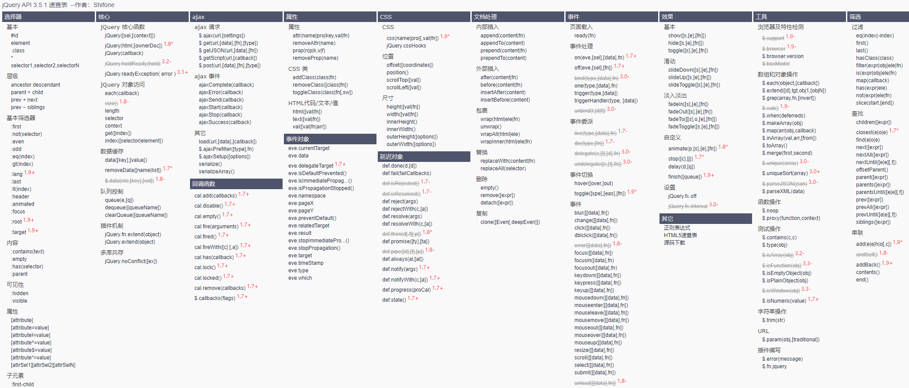
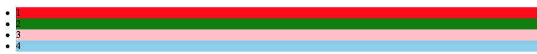
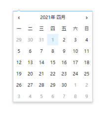
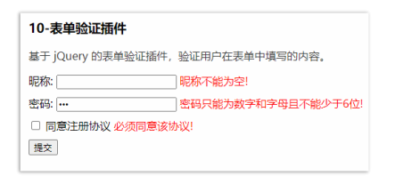

## jQuery

### 01- 认识 jQuery

- JavaScript 类库：js 文件
- 封装了很多简单易用的方法：考虑了浏览器兼容问题
- 多大多数操作来简化 DOM
- 提升开发效率
- 


- 下包：把 jQuery 下载到本地
- 导包：在希望使用的页面中导入下载好的 jQuery

官网地址：https://jquery.com/

### 02- 选择器

`jQuery` 中通过选择器来获取 DOM 节点，功能类似于原生的 `querySelectorAll` 方法，支持的选择器与 css 的选择器几乎一致。

语法：

```jsx
$('选择器')

例如：
$('选择器').css('backgroundColor', 'yellow')
// 类选择器
$('.box').css('backgroundColor', 'yellow')

// id 选择器
$('#box').css('backgroundColor', 'yellow')

// 后代选择器
$('.box span').css('backgroundColor', 'yellow')
```


### 03 - jQuery 对象

`jQuery` 中利用选择器获取到的并非原生的 DOM 对象，而是`jQuery` 对象

`jQuery` 对象和 DOM 对象不能混用

**DOM 对象转换成 jQuery 对象：**

```jsx
$(DOM对象)
```

示例：

```jsx
<Script>
		let li = document.querySelector('li')
  	let $li = $('li')
  
  	// JQ 对象的方法
  	$li.css('backgroundColor','pink')
  
	  // dom 对象转 JQ 对象
  	let $li2 = $(li)
  	$li2.css('backgroundColor', 'red')
  
</Script>
```

> JQ 对象的方法，比如 css 方法都是放在`原型`上的


### 04 - 事件绑定

在 `jQuery` 中以原生时间类型的名称为依据，疯转公里相对应的事件处理方法

```jsx
$('选择器').事件名(函数)

例如：
$('li').click(function () {
  	// 执行的逻辑
})
```

示例一：点击事件

```jsx
示例一：
// 通过类选择器获取 box
let $box =  $('.box')
// 更改其背景色
$box.css('backgroundColor','red')
console.log($box);

// 添加点击事件
$box.click(function () {
     console.log('11111111111');
})
```

示例二：焦点事件

```jsx
// 添加焦点事件
// 1. 通过属性选择器获取到
let $text = $('input[type=text]')
// 获取焦点事件
$text.focus(function (){
     console.log('2222222222');
})
// 失去焦点事件
$text.blur(function (){
     console.log('3333333333');
})
```

- 事件名开头不需要写 on

- 回调函数中的 this 就是触发事件的 dom 元素


### 05 - 链式编程

`链式编程` 通过点 （.）把多个操作连续的写下去，形成和链子一样的结构

语法：

```jsx
$(选择器).事件名(回调函数).事件名(回调函数).事件名(回调函数)

例如
$(.box).click(回调函数).mouseenter(回调函数).mouselevea(回调函数)
$(.text).focus(回调函数).blur(回调函数)
```

示例：

普通写法

```jsx
// 1. 通过属性选择器获取到
let $text = $('input[type=text]')
// 获取焦点事件
$text.focus(function (){
     console.log('2222222222');
})
// 失去焦点事件
$text.blur(function (){
     console.log('3333333333');
})
```

链式编程：

```jsx
// 1. 通过属性选择器获取到
let $text = $('input[type=text]')
// 获取焦点事件
$text.focus(function (){
     console.log('2222222222');
}).blur(function (){
     console.log('3333333333');
})

```


大部分 JQ 对象方法的返回值还是同一个对象


### 08 - 内容操作

`jQuery` 中封装了设置和读取网页元文本内容的方法 

语法：

```jsx
// 设置
$('选择器').html('内容')
$('选择器').text('内容')

// 读取
$('选择器').html()
$('选择器').text()
```

- 设置时：html 方法解析标签，text 不解析标签
  - 返回的是一个 JQ 对象
- 取值时：html 方法获取标签，text 只获取文本
  - 返回的是一个字符串
- **设置支持链式编程，取值时不支持链式编程**


### 09 - 过滤方法.

`jQuery` 中封装了过滤方法，对 `jQuery` 对象中的 DOM 元素再次筛选

语法：

```jsx
// 匹配第一个元素
.first()

// 匹配最后一个元素
.last()

// 根据索引匹配元素
.eq(索引)
```

- `eq` 方法的索引从 `0` 开始
- 返回的是 `jQuery` 对象

示例：

```jsx
<body>
     <ul>
          <li>1</li>
          <li>2</li>
          <li>3</li>
          <li>4</li>
     </ul>
     <script src="./jquery-3.6.0.min.js"></script>
     <script>
          $('li').css({
               background:'pink'
          })

          $('li').first().css({
               background:'red'
          })

          $('li').eq(1).css({
               background:'green'
          })
          $('li').last().css({
               background:'skyblue'
          })
     </script>
</body>
```




### 10 - 样式操纵

`jQuery` 中队样式的操作进行封装，可以设置或获取样式

#### 设置样式

语法：

```
// 键值对设置
.css('样式名', '值')
.css('backgroundColor', 'red')
.css('color', 'red')
.css('width', '20px')
.css('height', '100px')
```

数值类的样式省略单位，会默认使用 px

**对象方式设置：**

```jsx
// 对象方式设置
.css(对象)

例如：
.css({
  	backgroundColor: 'red',
  	color: 'red',
  	widht: '200px',
  	height: 100 
})
```


#### 获取样式

语法:

```jsx
.css('样式名')

// 示例
.css('widht')
```

#### 总结：

- 设置数值类的样式时省略单位，默认值是：px
- css 方法设置的样式在元素的什么位置？：行内：`<button style='xxxxxxxxxxx'>`
- css 方法取值时是否需要传递参数?：需要


### 11 - 样式操作

`jQuery` 中对属性的操作进行封装 , 可以设置、获取和删除属性

测试代码：

```jsx
<a href='https://baidu.com'>黑马程序员</a>
</img>
```

**语法：**

```jsx
// 赋值
.attr('属性名', '值')

// 取值
.attr('属性名')

// 删除属性
.removeAttr('属性名')

```


### 12 - 操作 value

`jQuery` 中封装了操纵表单元素value属性的方法，可以取值和赋值

语法：

```jsx
// 1. 赋值
.val('参数')

// 2. 取值
.val()
```

示例：

```jsx
// 给类 text 设置值
$(.text).val('我我我')
```


### 13 - 查找方法

`jQuery` 中封装了查找元素的方法，可以基于元素的结构关系查找新的元素

语法：

```jsx
// 父元素
.parent()

// 子元素：
// 可以传入选择器也可以不传
.children()
.children('选择器')

// 兄弟元素
// 可以传入选择器也可以不传
.siblings()
.siblings('选择器')

// 后代元素
// 必须传入选择器
.find('选择器')
```

示例：

```jsx
<body>
     <ul>
          <li class="first">1</li>
          <li class="first1">2</li>
          <li class="first2">3</li>
          <li class="first3">4</li>
          <li class="first4">5</li>
     </ul>
     <script src="./jquery-3.6.0.min.js"></script>
     <script>
          // 父元素
          $('.first').parent().css('backgroundColor','pink')

          // 子元素
          $('ul').children().css('color','red')
          $('ul').children('.first').css('color','#fff')

          // 兄弟元素
          $('.first').siblings().css('backgroundColor','red')
          $('.first').siblings('.first1').css('backgroundColor','#fff')

          // 后代元素
          $('ul').find('li').css('backgroundColor','#fff')
     </script>
</body>
```


### 14 - 操作类名

`jQuery` 中封装了为网页元素添加、移除、检测、切换类名的方法。

语法：

```jsx
// 添加类名
.addClass('类名')

// 移除类名
.removeClass('类名')

// 判断类名，返回布尔值
.hasClass('类名')

// 切换类名: 存在类名，就移除。不存在类名就添加上去
.toggleClass('类名')
```


### 15 - 事件进阶

` jQuery` 中封装了更为灵活的 on/off、one 方法处理 DOM 事件

测试代码：

```jsx
// 绑定点击事件
$('选择器').click(function(){})

// 绑定获取焦点事件
$('选择器').focus(function(){})
```

语法：

```jsx
// 注册事件
$('选择器').on('事件名', function(){})

// 移除指定事件
$('选择器').off('事件名')

// 移除所有事件
$('选择器').off()

// 注册一次性事件
$('选择器').one('事件名', function(){})
```

> On、one 方法回调函数中的 this 是触发事件的 DOM 元素


### 16 - 触发事件

 `jQuery` 中如何通过代码的方式触发绑定的事件

测试代码：

```jsx
// 初始状态
$('.words span').text(0)
$('.public_btn').addClass('disabled')

// 字数统计
$(.input-box textarea).on('input' function() {
  	let lenght = $(this).val().length
    // 优化
    $('.words span').text(length)
  	if (lenght === 0) {
      	$('public-btn').addClass('disabled')
    } else {
      	('public-btn').removeClass('disabled')
    }
})

```

语法：

```jsx
// 直接触发
.事件名

// trigger 触发
.trigger('事件名')

// 触发自定义事件
.trigger('自定义事件')

// 注册自定义事件
.on('自定义事件', function(){})
```

> 自定义事件是一种进阶用法，目前了解就可以

示例：

```jsx
$('.btn').click(function() {
  	console.log('1111')
})
// 直接触发点击事件
$('.btn').click()
```


### 17 - window 事件绑定

使用 jQuery 为window对象绑定事件

测试代码：

```jsx
// 滚动
window.addEventListener('scroll', function(){
  
})

$('window').scroll(function(){})

// 点击
window.addEventListener('click', function(){
  
})
$('window').click(function(){})

```

语法：

```jsx
// 滚动
$(window).scroll(function(){})

// 点击
$(window).click(function(){})
```

‘’选择器‘’ 可以直接传入 window 对象，不需要写成选择器


### 18 - 事件参数

`jQuery` 绑定的事件中可以获取事件参数(事件对象)，用法和原生 js 完全一致。

语法：

```jsx
// 没有设定事件参数
$('选择器').事件名(function () {})

// 设置时间参数
$('选择器').事件名(function (e) {})
$('选择器').事件名(function (event) {})
$('选择器').事件名(function (event) {
  	event.stopPropagation()
})
```

- `jQuery` 已经处理好了时间参数的兼容性


### 19 - 事件委托

`jQuery` 中封装了事件委托的支持，直接通过 `on` 方法可以即可使用

语法：

```jsx
// 直接绑定
$('选择器').on('事件名', function(){})

// 事件委托
$('祖先选择器').on('事件名', '后代选择器', function(){})
```

- 减少事件注册

- 解决动态增加后代元素的事件绑定问题

- 原理是冒泡原理

- 回调函数中的 `this` 是触发事件的 `DOM` 对象

  

### 20 - 获取位置

通过 `jQuery` 直接获取元素的位置

语法：

```jsx
// 取值
$('选择器').offset()

取值
$('选择器').position()

返回值
(top: 126, left: 59)

```

- 参照物不同
  - `offset` 参照 `html` 标签
  - `position` 参照离他最近有定位的祖先元素
- margin
  - `offset` 会把外边距 `margin` 计算进去
  - `position` 以外边距 `margin` 为边界，不计算  `margin`


### 21 - 滚动距离

通过 `jQuery` 获取元素的滚动距离

语法：

```jsx
// 取值
$('选择器').scrollLeft()
$('选择器').scrollTop()

// 赋值
$('选择器').scrollLeft(值)
$('选择器').scrollTop(值)
```


### 22 - 显示 & 隐藏动画

通过 `jQuery` 以动画的方式切换元素的显示&隐藏

语法：

```jsx
// 显示
$('选择器').show()
$('选择器').show(持续时间)

// 隐藏
$('选择器').hide()
$('选择器').hide(持续时间)

// 显示&隐藏
// 显示动画就隐藏，隐藏动画就显示
$('选择器').toggle()
$('选择器').toggle(持续时间)
```

- 毫秒为单位


### 23 - 淡入 & 淡出动画

通过 `jQuery` 以淡入&淡出的方式切换元素的显示隐藏

语法：

```jsx
// 淡入
$('选择器').fadeln()
$('选择器').fadeln(持续时间)

// 淡出 
$('选择器').fadeOut()
$('选择器').fadeOut(持续时间)

// 淡入 & 淡出
// 如果当前是淡出，就淡入
// 如果当前是淡入，就淡出
$('选择器').fadeToggle()
$('选择器').fadeToggle(持续时间)
```

- 毫秒为单位


### 25 - 展开 & 收起动画

通过 `jQuery` 以展开 & 收起的方式切换元素的显示隐藏

通过 `jQuery` 以展开(高度增大)&收起(高度减小)的方式切换元素的显示隐藏

语法：

```jsx
// 展开
$('选择器').slideDown()
$('选择器').slideDown(持续时间)

// 收起
$('选择器').slideUp()
$('选择器').slideUp(持续时间)

// 展开 & 收起
// 如果当前是展开，就收起
// 如果当前是收起，就展开
$('选择器').slideToggle()
$('选择器').slideToggle(持续时间)
```

- 毫秒为单位


### 25 - 动画队列及停止方法

通过 `jQuery` 为元素设置的多个动画会依次添加到动画队列中，并根据添加的顺序依次播放

```
// 动画队列
['动画 1']
['动画 1', '动画 2']
['动画 1', '动画 2','动画 3']
['动画 1', '动画 2','动画 3' ...]
```

语法：

```jsx
// 停止当前动画
$('选择器').stop()

// 清空队列，在动画当前状态停止
$('选择器').stop(true)

// 清空队列，直接到当前动画的结束状态
$('选择器').stop(true, true)
```

- 动画方法和 stop 方法返回等等是同一个 `jquery` 对象，支持链式编程


### 26 - 自定义动画

 `jQuery` 提供了 `animate` 方法来实现更为复杂的动画效果

**语法1：**

```jsx
$('选择器').animate(动画属性)

例如：
// 默认单位是 px
$('选择器').animate({
		widht: 100,
  	height: 100,
  	marigin: 100
})

$('选择器').animate({
		widht: 100,
  	height: 100%,
  	marigin: 100%
})

$('选择器').animate({
		scrollTop: 100,
  	scrollLeft: 100,
}
```

- 数值类样式支持动画，支持多个
- 默认单位是 px
- 支持非样式的特殊属性


**语法 2：**

```jsx
$('选择器').animate(动画属性, 持续时间)
```

- 动画的持续时间的单位是毫秒


### 27 - 插入节点

`jQuery` 中封装了在指定位置动态插入元素节点的方法，可以插入节点或者改变节点位置。

**语法：**

```jsx
// 4 个方法参数一样，位置不同
$('父元素选择器').append(参数) // 父元素结尾
$('父元素选择器').prepend(参数) // 父元素开头
$('兄弟元素选择器').before(参数) // 兄弟元素前面
$('兄弟元素选择器').after(参数)  // 兄弟元素后面
```

- 插入节点：传入创建的 DOM 元素或者 html 结构
- 改变位置：传入现有的 DOM 元素或者 `jQuery` 对象


### 28 - 删除节点

`jQuery` 中封装了动态删除元素节点的方法

语法：

```jsx
jQuery对象.remove()
```

- remove 方法删除的是调用方法的元素节点


### 29 - 动画的回调函数

所有的 `jQuery` 动画方法都支持传入回调函数 

**语法：**

```jsx
$('选择器').基础动画方法(回调函数)
$('选择器').基础动画方法(持续时间, 回调函数)
$('选择器').animate(属性, 回调函数)
$('选择器').animate(属性, 持续时间, 回调函数)
```

- 回调函数会在动画执行完毕时立即执行
- 回调函数中的 this 是执行动画的 DOM 元素


### 30 - 动画的延迟方法

`jQuery` 不仅可以设置动画执行的速度，还能在动画执行前设置一定的延时

**语法：**

```jsx
$('选择器').delay(延迟时间).动画方法()
$('选择器').delay(延迟时间).动画方法().delay(延迟时间).动画方法()
```

- 延迟时间的单位是毫秒


### 31 - 获取尺寸

`jQuery` 对获取元素尺寸进行了封装，使得在不同场景中获取元素尺寸十分方便

**样式：**

```jsx
width: 200px;
height: 100px
padding: 10px 29px;
border:10px dashed yellow;
margin: 20px 20px;
```

**语法：**

```jsx
$('选择器').width() // 内容宽度
$('选择器').height() // 内容高度

// 内边距：padding
$('选择器').innerWidht() // 内容宽度 + 内边距  
$('选择器').innerHeight() // 内容高度 + 内边距

// 内边距：padding
// 边框：boder
$('选择器').outerWidht() // 内容宽度 + 内边距 + 边框
$('选择器').outerHeight() // 内容高度 + 内边距 + 边框

// 内边距：padding
// 边框：boder
// 外边框：margin
$('选择器').outerWidht(true) // 内容宽度 + 内边距 + 边框 + 外边框
$('选择器').outerHeight(true) // 内容高度 + 内边距 + 边框 + 外边框
```


### 32 - 入口函数

`jQuery` 中提供了更为方便的入口函数写法：

测试代码：

```jsx
// 原生写法
window.addEventLister('load', function(){})

// JQ写法
$(window).on('load', function(){})
```

- 页面资源加载完毕时执行的逻辑代码。比如图片、css 等执行完毕

语法：

```jsx
// 完整写法
$(document).ready(function(){})

// 简化写法
$(function(){})
```

- DOM 载入完毕就会执行

> ready 会比 load 早执行


### 33 - 提交事件

`form` 标签本身具有提交数据的能力，但是限制基本不那么用

测试代码：

```jsx
<form>
  <input type="text" placeholder="用户名" />
  <br />
  <input type="password" placeholder="密码" />
  <br />
  <input type="submit" value="提交" />
  <button>提交</button>
</form>

```

- 点击提交按钮，输入区域点击回车都会触发表单提交
- 表单中的 button 默认是提交按钮


**现在比较流行在表单的 submit 事件中阻止默认行为，自己获取数据并提交**

```jsx
$('form').submit(function (event) {
  	// 阻止默认行为
  	event.preventDefault()
  	// 阻止默认行为
  	return false
})
```

- 返回 false 或者 preventDefault 都可以阻止默认行为


### 34 - 克隆

`jQuery` 中封装了克隆（复制），节点的方法

语法：

```jsx
// 不带事件
.clone()

// 带事件
.clone(true)
```

- 方法返回的还是 `jQuery` 对象
- 传入 true 事件也会一切克隆


### 35 - 获取 dom 对象

`jQuery` 封装了获取内部 `dom` 对象的方法

测试代码：

```jsx
// 播放视频
video标签.play()
// 暂停视频
video标签.pause()
// 重置表单
form表单.reset()
```

- `jQuery` 并没有封装所有 dom 方法

```jsx
// 播放视频
$('video').trigger('play')
// 暂停视频
$('video').trigger('pause')
// 重置表单
$('form').trigger('reset')
```

- `jQuery` 通过 `trigger` 可以触发这些方法


**获取 dom**

语法：

```jsx
// get 方法获取
.get(索引)

// 中括号获取
[索引]
```

- 索引从 `0` 开始
- 获取到的是 `dom` 对象


### 36 - 表单序列化

`jQuery` 中封装了快速获取表单数据的方法，叫做序列化

语法：

```jsx
$('from').serialize()
```

- 表单元素要有 `name` 属性才可以获取到 `value` 值
- 获取到的数据格式是：`name1=value1&name2=value2` 的字符串


### 37 - 插件机制

插件是 `jQuery` 提供的扩展机制 , 本质是往 `jQuery` 原型对象上添加方法

语法：

```jsx
jQuery.fn.extend({
  	插件名(参数) {
        // 逻辑
    }
})
```

- `jQuery` 是 `$` 的别名
- `jQuery` 内部也是通过这种方式添加方法


### 38 - 工具方法

`jQuery` 除了封装了大量的 `DOM` 操作外，还提供了一些工具方法，这些方法通过 `$` 或 `jQuery` 直接调用 

语法：

```jsx
// 遍历数组
$.each(数组，function(下标, 值){})

// 遍历并返回新数组
$.map(数组，function(值){
		// 返回新的值      	
})
```

- 这里只列出 2 个方法，不仅仅只有 2 个方法


### 39 - 多个版本 jQuery 共存

如果我们也要用 `$` 变量，可以通过 `jQuery` 封装的方法来起别名

语法：

```jsx
// 给$起别名 为 _
let _ = $.noConflict()
// 查看jquery的版本
console.log($.fn.jquery)
```

- 导入其他版本的 `jQuery` 需要放在调用方法之后


## 二、jQuery 插件

### 1 - 轮播图插件 - slick

**`jQuery` 的轮播图插件 slick**

- 下包：把插件下载到本地
- 导包：先导入 jQuery，再导入插件，导入 css（需要的话）
- 用包：根据文档使用


**导包：**

语法：

```jsx
// 引入插件所需要的样式表
<link rel="stylesheet" type="text/css" href="slick/slick.css"/>
<link rel="stylesheet" type="text/css" href="slick/slick-theme.css"/>

// 导入 jQuery
<script src="./jqury-3.6.0.js"></script>
// 在 jQuery 之后引入插件
<script type="text/javascript" src="slick/slick.min.js"></script>
```


**用包：**

```jsx
<div class="your-class">
  <div>轮播元素 一</div>
  <div>轮播元素 二</div>
  <div>轮播元素 三</div>
</div>

$('.your-class').slick()
$('.your-class').slick({
  	setting-name: setting-value
})
```

初始化配置值：

| 常用配置  |           含义           | 默认值 |    备注     |
| :-------: | :----------------------: | :----: | :---------: |
| autoplay  | 轮播图效果自动执行、播放 | false  | true、false |
|  arrows   |     是否显示翻页按钮     |  true  | true、false |
| prevArrow |   自定义，上一页 按钮    |   无   | 标签选择器  |
| nextArrow |   自定义，下一页 按钮    |   无   | 标签选择器  |
|   dots    |      是否显示指示器      | false  | true、false |

> 更多参数参考文档：https://www.slickjs.cn
>
> 更多配置也可以参考：:https://github.com/kenwheeler/slick

```jsx
// 调用插件方法初始化
$('.your-class').slick({
  	autoplay: true,
  	dots: false,
})
```

- 默认样式不符合需求直接添加 css 覆盖极客


### 2 - 懒加载插件 - lazyload

`jQuery` 的懒加载插件 `lazyload`

懒加载：图片用到了再去加载，常见于有大量图片的网页。比如电商

- 下包：把插件下载到本地
- 导包：先导入 jQuery，再导入插件，导入 css（需要的话）
- 用包：根据文档使用


**导包：**

语法：

```jsx
// 导入 jQuery
<script src="jQuery.js"></script>
<!-- 或 <script src="zepto.js"> -->
<script src="lazyload.min.js"></script>
```


**用包：**

```html
// 图片：

// 图片地址设置给 data-original

  
// 语法：
// 找到希望懒加载的图片并调用 lazyload 方法
$('.lazyload').lazyload()
```


> 更多参数参考文档：https://github.com/tuupola/lazyload/tree/1.x


### 3 - 全屏滚动插件 - fullpage

- 下包：把插件下载到本地
- 导包：先导入 jQuery，再导入插件，导入 css（需要的话）
- 用包：根据文档使用


**导包：**

语法：

```jsx
// 导入 fullpage 配餐样式
<link rel="stylesheet" type="text/css" href="fullpage.css" />

// 导入 jQuery
<script src="./jqury-3.6.0.js"></script>
<script type="text/javascript" src="fullpage.js"></script>
```


**用包：**

```html
<div id="fullpage">
	<div class="section">第一屏</div>
	<div class="section">第二屏</div>
	<div class="section">第三屏</div>
	<div class="section">第四屏</div>
</div>

$('#fullpage').fullpage({
	...
})
```

- 每个区域必须有 `section` 类名

|      常用配置      |                含义                 | 默认值 |        备注        |
| :----------------: | :---------------------------------: | :----: | :----------------: |
|     navigation     |            是否显示导航             | false  |    true、false     |
| navigationPosition |              导航位置               | right  |    left、right     |
|      anchors       |         每个区域的锚链接名          |   []   |      在地址栏      |
|     afterLoad      | 区域加载完毕的回调函数，有 2 个参数 |   无   | 参数：锚链接、索引 |

> 更多配置：https://github.com/alvarotrigo/fullPage.js/tree/2.9.7


### 4 - 日期选择器 - datepicker

`jQuery` 的日期选择器插件 `datepicker`，让用户在不同的浏览器下可以用一致的方式来选择日期。

- 下包：把插件下载到本地
- 导包：先导入 jQuery，再导入插件，导入 css（需要的话）
- 用包：根据文档使用
- 

**导包：**

语法：

```jsx
<!-- 导入日期选择器的样式 -->
<link rel="stylesheet" href="./datepicker/datepicker.css" />

<!-- 导入jQuery -->
<script src="./jquery/jquery-3.5.1.js"></script>
<!-- 导入日期选择器插件 -->
<script src="./datepicker/datepicker.js"></script>
<!-- 导入语言包 -->
<script src="./datepicker/i18n/datepicker.zh-CN.js"></script>
```

- 默认显示的是英文，需要导入 中文语言包

**用包：**

```html
<!-- 准备html结构 -->
<input type="text" class="datapicker" />

// 调用插件方法
$('.datapicker').datepicker({
  …
})

```

| 常用配置 |           含义           | 默认值 |        备注        |
| :------: | :----------------------: | :----: | :----------------: |
| autoPick |   是否自动选择当前日期   | false  |    true、false     |
| autoHide | 选择日期之后是否自动关闭 | false  |    true、false     |
| language |         语言模式         |   空   | 需要结合语言包使用 |

> 更多配置：https://github.com/fengyuanchen/datepicker/blob/master/README.md


### 5 - 表单验证 - validate

`jQuery` 的表单验证插件 `validate`，验证用户在表单中输入的内容

`jQuery` 的日期选择器插件 `datepicker`，让用户在不同的浏览器下可以用一致的方式来选择日期。

- 下包：把插件下载到本地
- 导包：先导入 jQuery，再导入插件，导入 css（需要的话）
- 用包：根据文档使用
- 

**导包：**

语法：

```jsx
    <!-- 导入jQuery -->
    <script src="./jquery/jquery-3.5.1.js"></script>
    <!-- 导入validate插件 -->
    <script src="./jquery-validate/jquery-validate.js"></script>

```


**用包：**

```html
$('form').validate({
  // 配置
})

```

|  常用配置   |                   含义                   | 默认值 |      备注       |
| :---------: | :--------------------------------------: | :----: | :-------------: |
|   onBlur    |              失去焦点时验证              | false  |   true、false   |
|  onSubmit   |              提交表单时验证              |  true  |   true、false   |
|  sendForm   |               是否提交表单               |  true  |   true、false   |
|    valid    |      所有表单验证通过执行的回调函数      |   无   | this 是 JQ 对象 |
|   invalid   | 至少一个表单项为通过验证时执行的回调函数 |   无   | this 是 JQ 对象 |
| description |               错误提示信息               |   无   |     Object      |

自定义属性1：

|  自定义属性   |        含义        |    备注    |
| :-----------: | :----------------: | :--------: |
| data-required | 验证表单项不能为空 |  不需要值  |
| data-pattern  | 基于正则表达式验证 | 正则表达式 |

语法：

```jsx
<input
  type="password"
  name="password"
  data-required
  data-pattern=".{6,}"
/>
```

- 表单元素要放在 form 里面

自定义属性2：

|    自定义属性    |          含义          |            备注             |
| :--------------: | :--------------------: | :-------------------------: |
| data-describedby | 指定显示错误信息的标签 |          标签的 id          |
| data-description |   指定错误信息的内容   | 和 description 中的属性对应 |

- 这两个属性需要结合 description 配置使用

语法：

```jsx
<input
  type="password"
  name="password"
  data-required
  data-describedby="password-error"
  data-description="password"
	data-pattern=".{6,}"
/>
<span class="error" id="password-error"></span>


$('form').validate({
		description: {
  	password: {
    		required: '密码不能为空!',
    		pattern: '密码不能少于6位!',
  	},
},
```


###

|
|
