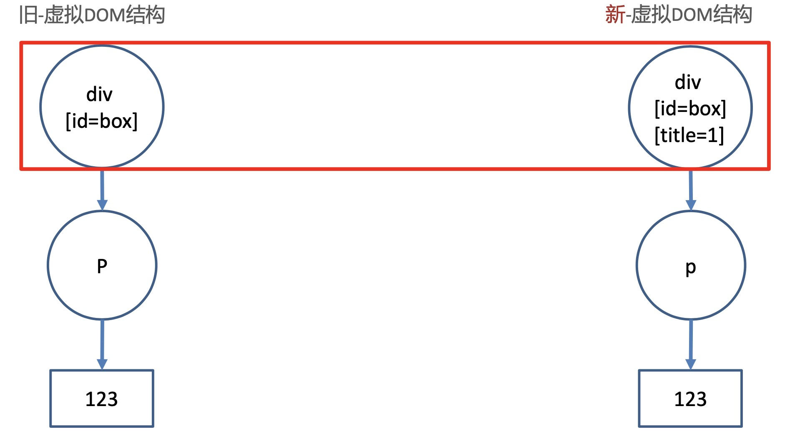

## 一、Vue 介绍

vue 是一个 JS 渐进式框架，渐进式就是按需逐步继承功能。

库是方法的集合， 框架是一套拥有自己规则的语法

### 01 | vue 脚手架环境介绍

用 vue 开发项目，不需要自己配置 webpack，vue 官方提供了@vue/cli 包，可以快速搭建基本的开发环境。

脚手架的好处：零基础，开箱即用，基于它快速搭建项目基本开发环境


### 02 | vue 安装全局包

```jsx
npm install vue -g
```

全局包会在计算机中配置全局命令（例：nodemon、vue命令）

### 03 | vue 创建脚手架项目--启动

vue create 项目名： 创建一个脚手架项目

yarn server 启动本地热更新开发服务器

> 注意：
>
> 项目名不能有大写字母、中文和特殊符号


**脚手架的主要文件和作用**：

- node_modules：都是下载的包
- public/index.html：浏览器运行的网页
- src/main.js： webpack打包的入口
- src/App.vue： Vue页面入口
- package.json： 项目描述文件

```jsx
项目                       		 // 项目目录
  ├── node_modules						// 项目依赖的第三方包
  ├── package-lock.json				// 项目依赖包版本锁定
  ├── package.json						// 项目依赖包列表
  ├── public									// 静态文件目录  
  │   ├── favicon.ico					// 浏览器小图标
  │   └── index.html					// 单页面的 html 文件，网站浏览的就是它
  ├── src											// 业务文件夹
  │   ├── App.vue							// 整个应用的根组件
  │   ├── assets							// 静态资源
  │   │   └── logo.png				// vue 的 logo 图片
  │   ├── components					// 组件目录
  │   │   └── HelloWorld.vue	// 欢迎页面的 vue 代码文件
  │   └── main.js							// 入口 js 文件
  └── vue.config.js						// vue 的配置文件
```


### 04 | vue 主要的 3 个文件和管理

- main.js
- App.vue
- index.html

关系：

- main.js：项目打开入口--vue 初始化

- app.vue：vue 页面入口

- index.html：浏览器运行的文件

- App.vue ==> main.js == >index.html

  

### 05 | vue.config.js

基于 webpack+node 环境

```jksx
module.exports = {
		devServer: {
				port: 3000,
				open: true, // 浏览器自动打开
		}
}
```

#### 处理 eslint 代码检查

方式一：

- 手动解决掉错误，以后介绍如何自动解决

方式二：

- 暂时关闭 eslint 检查：因为现在主要经历是学习 vue 语法，在 vue.config.js 配置后重启服务即可
- `lintOnSave：false`


### 06 | 单个 vue 文件开发介绍

单 vue 文件的好处：有独立的作用域，不再担心变量名重复

单个 vue 文件的注意事项：template 里只能有一个根标签

```vue
// template 必须，只能有一个根标签，影响渲染到页面的标签结构
<template>
  <div>欢迎使用 vue</div>
</template>

// js 相关
<script>
import HelloWorld from './components/HelloWorld.vue'

export default {
  name: 'App',
  components: {
    HelloWorld
  }
}
</script>

// 当前组件的样式，设置 scoped，可以保证样式只对当前页面有效
<style scoped>
#app {
  font-family: Avenir, Helvetica, Arial, sans-serif;
  -webkit-font-smoothing: antialiased;
  -moz-osx-font-smoothing: grayscale;
  text-align: center;
  color: #2c3e50;
  margin-top: 60px;
}
</style>

```

- Vue 推荐使用.vue 文件来开发项目
- template 里只能有一个根标签
- js 独立作用域互不影响
- style 配合 scoped 属性，保证样式只针对当前 template 内标签生效


### 07 | 脚手架项目—清理欢迎页面

- assets 和 components 文件夹下的一切都删除掉。不需要默认的欢迎页面
- scr/App.vue 默认有很多内容，可以全部删除，只留下 template、script、style 的框

```jsx
<template>

</template>

<script>

</script>

<style scoped>

</style>
```


## 二、Vue 语法

### 01 | 插值表达式

目标：在 dom 标签中，直接插入 vue 数据变量

- 又叫声明式渲染、文本插值
- 语法：
  - {{表达式}}

示例：

```vue
<template>
	<div>
    	<h1>
      		{{ msg }}
		  </h1>
			<h2>
    			{{obj.name}}
  		</h2>
  		<h3>
    			{{obj.age > 18 ? '成年' ： '未成年'}}
  		</h3>
  </div>
</template>

<script>
	export default {
    	data() {
        	return {
            msg:'hello',
            obj: {
              	name: '小 vue'
              	age： 5
            }
          }
      }
  }
</script>
```

- msg 和  obj 是 vue数据变量
- 要在 js 的 data 函数里声明


### 02 | MVVM 设计模式

目标：转变四维，用数据驱动视图改变，操作 dom 的事，vue 源码内干了

- 设计模式：是一套被反复使用、多数人知晓的、经过分类编目的、代码设计经验的总结


### 03 | v-bind、v-on

**v-bind：**

- 给标签属性设置 vue 变量的值

- 语法：`v-bind: 属性名='vue 变量'`

- 简写：`:属性名=‘vue 变量’`

- ```jsx
  // vue 指令：v-bind 属性动态赋值
  <a v-bind:href="url">我是 a 标签</a>
  <a :href="imgscr">sss</a>
  ```

**v-on:**

- 给标签绑定时间

- 语法：

  ```
  v-on:事件名 = "要执行的少量代码"
  v-on:事件名 = "methods中的函数名"
  v-on:事件名 = "methods 中的函数名(实参)"
  ```

- 语法简写：

  - 用@提到 v-on:

  ```jsx
  @事件名 = "要执行的少量代码"
  @事件名 = "methods中的函数名"
  @事件名 = "methods 中的函数名(实参)"
  ```

- 示例：

  ```jsx
  <template>
    <div>
      <p> 你要购买的数量: {{count}}</p>
      <!-- v-on:事件名 = "要执行的少量代码" -->
      <button v-on:click="count = count + 1">数量加一</button>
      <!-- v-on:事件名 = "methods中的函数名" -->
      <button v-on:click="addFn">+1</button>
      <!-- v-on:事件名 = "methods 中的函数名(实参)" -->
      <button v-on:click="addCountFn(5)">+5</button>
    </div>
  </template>
  
  <script>
  
  export default { 
    // 准备变量
    data() {
      return {
          count: 1
      }
    },
    // 定义函数
    methods: {
      addFn() {
        this.count++
      },
      addCountFn(num) {
        this.count += 5
      }
    },
  }
  ```


### 04 | v-on 事件对象

目标：vue 事件处理函数中，拿到事件对象

- 语法：

  - 无传参，通过形参直接接受

  - 传参，通过 `$event` 指定事件对象传给事件处理函数

    ```vue
    <template>
      <div>
        <a @click = "one" href="百度链接">阻止百度</a>
    		<a @click = "two(10, $event)" href="百度链接">阻止去百度</a>
      </div>
    </template>
    
    <script>
    
    export default { 
      // 定义函数
      methods: {
        one(e) {
    			e.preventDefault()
        },
        two(num, e) {
          e.preventDefault()
        }
      },
    }
    ```


### 05 | vue 事件_修饰符

目标：在事件的后面.修饰符名 - 给时间带来更强大的功能

- 语法：

  - @事件名.修饰符=“事件处理函数”

- 修饰符列表：

  - .stop：阻止事件冒泡
  - .prevent：阻止事件默认行为
  - .onece：程序运行期间，只触发一次事件处理函数

- 示例：

  ```jsx
  <template>
    <div @click="fatherFn">
      <p @click.stop="oneFn">.stop 阻止事件冒泡</p>
      <a href="www.baidu.com" @click.prevent>去百度</a>
      <a href="www.baidu.com" @click.prevent.stop>即阻止冒泡,又阻止默认行为</a>
      <a href="www.baidu.com" @click.once='ddd'>函数只会执行一次</a>
    </div>
  </template>
  ```

  

### 06 | vue 事件_按键修饰符

目标：给键盘事件，添加修饰符，增加能力

- 语法：

  - @keyup.enter：监测回车按键
  - @keyup.esc：监测返回按键

  ```jsx
  <template>
    <div @click="fatherFn">
      <input type="text" @keyup.enter="enterFn">用户按下了回车</input>
      <input type="text" @keyup.esc="escFn">用户触发了取消、返回键</input>
    </div>
  </template>
  ```

> 更多事件修饰符：https://cn.vuejs.org/v2/guide/events.html


### 07 | v-model 基础使用

目标：value 属性和 vue 数据变量，双向绑定到一起

- 语法：
  - `v-model="vue数据变量"`
- 双向数据绑定：
  - 变量变化 --> 视图自动同步
  - 视图变化 --> 变量自动同步
  - 数据绑定绑定的是 value 属性：value 属性 -- vue 变量

示例：

做个注册表单，了解 v-model 在各种表单标签如何使用

```vue
<template>
  <div>
    <div>
      <span>用户名:</span>
      <input type="text" class="text" v-model="username">
    </div>
  </div>
</template>
<script>
export default {
  data () {
    return {
      username: '',
    }
  }
}
</script>
```

**下拉菜单：**

下拉菜单 v-mode 要写在 select 上

```vue
<template>
  <div>
    <span>来自于:</span>
    <select  v-model="from">
      <option value="北京市">北京</option>
      <option value="南京市">南京</option>
      <option value="徐州市">徐州</option>
    </select>
  </div>
</template>
<script>
export default {
  data () {
    return {
      from: '南京市'
    }
  }
}
```


**复选框绑定：**

v-model 变量的值：

- 非数组：关联的是复选框的 checked 属性。false、true

- 数组：关联的是复选框的 value 属性

- ```jsx
  <template>
    <div>
      <div>
        <span>爱好</span>
        <input type="checkbox" value="抽烟" v-model="hobby">抽烟
        <input type="checkbox" value="喝酒" v-model="hobby">喝酒
        <input type="checkbox" value="打豆豆" v-model="hobby">打豆豆
      </div>
    </div>
  </template>
  <script>
  export default {
    data () {
      return {
      	// 如果这里不是数组，绑定搞的就是 checked 属性  
        hobby: []
      }
    }
  }
  ```

**单选框：**

```jsx
<template>
    <div>
      <span>性别:</span>
      <input type="radio" name="sex" value="男" v-model="gender">男
      <input type="radio" name="sex" value="女" v-model="gender">女
    </div>
  </div>
</template>
<script>
export default {
  data () {
    return {
      gender:''
    }
  }
}
```


### 08 | v-mode 修饰符

目标：让 v-model 拥有强大的功能

- 语法：`v-model.修饰符="vue数据变量"`
  - `.number`：以 parseFloat 转成数字类型
  - `.trim`：去除首位空白字符
  - `.lazy`：在 change时触发而非 input。失去焦点，内容改变时

示例：

```jsx
<template >
  <div>
    <div>
      <span>年龄</span>
      <input type="text" v-model.number="age">
    </div>
    <div>
      <span>人生格言</span>
      <input type="text" v-model.trim="motto">
    </div>
    <div>
      <span>人生格言</span>
      <input type="text" v-model.lazy="motto">
    </div>
    
  </div>
</template>
```


### 09 | v-text 和 v-html

目标：更新 dom 对象的 `innerText` 和 `innerHTML`

- 语法：
  - `v-text="vue 变量"`
  - `v-html="vue 变量"`

- 注意：会覆盖插值表达式：会覆盖 {{}}


示例:

```jsx
<template >
  <div>
    <p v-text="str"></p> // 不解析
    <p v-html="str"></p> // 解析成标签

  </div>
</template>
<script>
export default {
    data() {
      return {
        str: `<span>我是一个 span</span>`
      }
    },
}
```


### 10 | v-show 和 v-if

目标：控制标签的隐藏或出现

- 语法：
  - `v-show="vue 变量"`
  - `v-if="vue 变量"`
  - 这两个 `都可以` 控制标签的隐藏和显示
- 原理：
  - `v-show` 用的是`display：none 隐藏`，频繁切换使用
  - `v-if` 直接从 DOM 树上移除
- 高级
  - `v-else` 
  - `v-else-if`

示例：

```jsx
<template>
  <div>
      <h1 v-show="isok">我是 h1</h1>
      <h2 v-if='iskkk'>我是 h2</h2>
  </div>
</template>
<script>
export default {
  data() {
    return {
      // 显示
      isok: true,
      // 隐藏
      iskkk: false
    }
  },
}
```

`v-if` 和 `v-else`：

```jsx
<template>
  <div>
      <!-- v-if 和 v-else的使用 -->
      <p v-if="age > 18">成年了</p>
      <p v-else>未成年</p>
  </div>
</template>
<script>
export default {
  data() {
    return {
      age: 20
    }
  },
}
```


### 12 | v-for

 目标：列表渲染，所在标签结构，按照数据数量，循环生成

- 语法：
  - `v-for="(值变量， 索引变量）in 目标结构"`
  - `v-for="值变量 in 目标结构"`
- 目标结构：；
  - 可以遍历数组、对象、数字、字符串等可遍历结构
- 注意：
  - `v-for` 的临时变量不能用到 `v-for` 范围外
  - 想要谁循环，就把 `v-for` 放到谁的身上

示例：

```vue
<template>
  <div>
    <ul>
      // arr = ["",""]
      <li v-for="(item, index) in arr">
        {{item}} --- {{index}}
      </li>
    </ul>

    <ul>
      // stuArr = [{},{},{}]
      <li v-for="obj in stuArr" :key="obj.id">
         {{obj.name}}
      </li>
    </ul>
  </div>
</template>
```


### 13 | v-for 更新检

目标：目标结构变化，触发 `v-for` 的更新

- 情况一：数组翻转
- 情况二：数组截取
- 情况上：更新值
- 口诀：
  - 数组变更方法，就会导致 `v-for` 更新，页面更新
  - 数组非变更方法，返回新数组，不会导致 `v-for` 更新，可以采用覆盖数组或 `this.$set()`
  - push、pop、shift、unshift、splice、sort、reverse
  - filter、concat、slice

```js
<
```


#### v-for 就地更新

目标：当数组改变后，是如何更新的


- V-for 更新时，会循环出新的虚拟 DOM结构，和旧的虚拟 DOM 结构对比，尝试复用标签就地更新内容。

  

### 14 | 真事的 DOM

目标：在 document 对象上，渲染到浏览器上显示的标签


### 15 | 虚拟 DOM

目标：本质是保存节点信息，属性和内容的一个 JS 对象


目标：在内存中比较变化部分，然后给真实的DOM 打补丁(更新)


- 虚拟 DOM 本质上是一个 JS 对象，不保存 DOM关键信息
- 虚拟 DOM 的好处在于提高DOM 更新的性能，不频繁的使用真实的 DOM，在内存中找到变化部分，再更新真实的DOM


### 16 | diff 算法

- 同级比较，`根元素变化`，整个 dom 树删除重建


- 同级比较，`根元素不变`，属性改变更新属性

  

**总结：**

- diff 算法是同级比较新旧虚拟 DOM
- 根元素变化，删除重建整个 DOM 树
- 根元素不变，属性改变，DOM 复用，只更新属性


### 17 | 无 key

- 从第二个往后更新内容，性能不高

  ```js
  <ul id="myul">
  		<li v-for="str in arr">
        {{str }}  
        <input type="text">
      </li>  
  </ul>
  
  <button @click="addFn">下标为1的位置新增一个</button>
  ```

- 最大限度尝试就地修改/复用相同类型元素

- 

### 13 |


### 14 |


### 15 |


### 16 |


### 17 |


