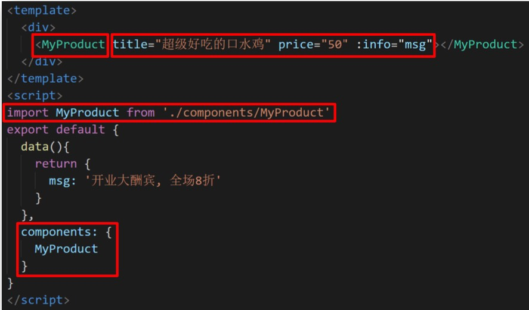

## 一、Vue 介绍

vue 是一个 JS 渐进式框架，渐进式就是按需逐步继承功能。

库是方法的集合， 框架是一套拥有自己规则的语法

### 01 | vue 脚手架环境介绍

用 vue 开发项目，不需要自己配置 webpack，vue 官方提供了@vue/cli 包，可以快速搭建基本的开发环境。

脚手架的好处：零基础，开箱即用，基于它快速搭建项目基本开发环境


### 02 | vue 安装全局包

```jsx
npm install vue -g
npm install @vue/cli -g
或者
yarn global add @vue/cli
```

全局包会在计算机中配置全局命令（例：nodemon、vue命令）

### 03 | vue 创建脚手架项目--启动

vue create 项目名： 创建一个脚手架项目

yarn server 启动本地热更新开发服务器

> 注意：
>
> 项目名不能有大写字母、中文和特殊符号


**脚手架的主要文件和作用**：

- node_modules：都是下载的包
- public/index.html：浏览器运行的网页
- src/main.js： webpack打包的入口
- src/App.vue： Vue页面入口
- package.json： 项目描述文件

```jsx
项目                       		 // 项目目录
  ├── node_modules						// 项目依赖的第三方包
  ├── package-lock.json				// 项目依赖包版本锁定
  ├── package.json						// 项目依赖包列表
  ├── public									// 静态文件目录  
  │   ├── favicon.ico					// 浏览器小图标
  │   └── index.html					// 单页面的 html 文件，网站浏览的就是它
  ├── src											// 业务文件夹
  │   ├── App.vue							// 整个应用的根组件
  │   ├── assets							// 静态资源
  │   │   └── logo.png				// vue 的 logo 图片
  │   ├── components					// 组件目录
  │   │   └── HelloWorld.vue	// 欢迎页面的 vue 代码文件
  │   └── main.js							// 入口 js 文件
  └── vue.config.js						// vue 的配置文件
```


### 04 | vue 主要的 3 个文件和管理

- main.js
- App.vue
- index.html

关系：

- main.js：项目打开入口--vue 初始化

- app.vue：vue 页面入口

- index.html：浏览器运行的文件

- App.vue ==> main.js == >index.html

  

### 05 | vue.config.js

基于 webpack+node 环境

```jksx
module.exports = {
		devServer: {
				port: 3000,
				open: true, // 浏览器自动打开
		}
}
```

#### 处理 eslint 代码检查

方式一：

- 手动解决掉错误，以后介绍如何自动解决

方式二：

- 暂时关闭 eslint 检查：因为现在主要经历是学习 vue 语法，在 vue.config.js 配置后重启服务即可
- `lintOnSave：false`


### 06 | 单个 vue 文件开发介绍

单 vue 文件的好处：有独立的作用域，不再担心变量名重复

单个 vue 文件的注意事项：template 里只能有一个根标签

```vue
// template 必须，只能有一个根标签，影响渲染到页面的标签结构
<template>
  <div>欢迎使用 vue</div>
</template>

// js 相关
<script>
import HelloWorld from './components/HelloWorld.vue'

export default {
  name: 'App',
  components: {
    HelloWorld
  }
}
</script>

// 当前组件的样式，设置 scoped，可以保证样式只对当前页面有效
<style scoped>
#app {
  font-family: Avenir, Helvetica, Arial, sans-serif;
  -webkit-font-smoothing: antialiased;
  -moz-osx-font-smoothing: grayscale;
  text-align: center;
  color: #2c3e50;
  margin-top: 60px;
}
</style>

```

- Vue 推荐使用.vue 文件来开发项目
- template 里只能有一个根标签
- js 独立作用域互不影响
- style 配合 scoped 属性，保证样式只针对当前 template 内标签生效


### 07 | 脚手架项目—清理欢迎页面

- assets 和 components 文件夹下的一切都删除掉。不需要默认的欢迎页面
- scr/App.vue 默认有很多内容，可以全部删除，只留下 template、script、style 的框

```jsx
<template>

</template>

<script>

</script>

<style scoped>

</style>
```


### 08 | 新建项目一般需要运行的命令

- vue create xxx
- cd xxx
- npm install less-loader@5.0.0 less
- npm install bootstrap
- vue init webpack vue-demo：打包

或者

- npm install -g yarn：安装 yarn
- yarn run dev
- yarn run serve
- yarn run build：打包
- yarn install 安装依赖


**其他第三方**

- npm install antd --save：阿里组件库

### 09 | 将单位转为 rem

- [postcss-pxtorem](https://github.com/cuth/postcss-pxtorem) 是一款 postcss 插件，用于将单位转化为 rem

  - 使用 [postcss-pxtorem](https://github.com/cuth/postcss-pxtorem) 将 `px` 转为 `rem`

  - ```js
    # yarn add -D postcss-pxtorem
    # -D 是 --save-dev 的简写
    npm install postcss-pxtorem -D
    ```

  - 然后在**项目根目录**中创建 `.postcssrc.js` 文件

  - ```js
    module.exports = {
      plugins: {
        'autoprefixer': {
          browsers: ['Android >= 4.0', 'iOS >= 8']
        },
        'postcss-pxtorem': {
          rootValue: 37.5,
          propList: ['*']
        }
      }
    }
    ```

  - 配置完毕，重新启动服务

  - **需要注意的是：**

    - 该插件**不能转换行内样式中的 `px`**，例如 `<div style="width: 200px;"></div>`

- [lib-flexible](https://github.com/amfe/lib-flexible) 用于设置 rem 基准值

  - 使用 [lib-flexible](https://github.com/amfe/lib-flexible) 动态设置 REM 基准值（html 标签的字体大小）
  - npm i amfe-flexible：安装
  - import 'amfe-flexible：导入

  

### 10 | 关于 `.postcssrc.js` 配置文件

```js
module.exports = {
  plugins: {
    'autoprefixer': {
      browsers: ['Android >= 4.0', 'iOS >= 8']
    },
    'postcss-pxtorem': {
      rootValue: 37.5,
      propList: ['*']
    }
  }
}
```

`.postcssrc.js` 是 PostCSS 的配置文件。

（1）PostCSS 介绍

[PostCSS](https://postcss.org/) 是一个处理 CSS 的处理工具，本身功能比较单一，它主要负责解析 CSS 代码，再交由插件来进行处理，它的插件体系非常强大，所能进行的操作是多种多样的，例如：

- [Autoprefixer](https://github.com/postcss/autoprefixer) 插件可以实现自动添加浏览器相关的声明前缀
- [PostCSS Preset Env](https://github.com/csstools/postcss-preset-env) 插件可以让你使用更新的 CSS 语法特性并实现向下兼容
- [postcss-pxtorem](https://github.com/cuth/postcss-pxtorem) 可以实现将 px 转换为 rem
- ....

目前 PostCSS 已经有 [200 多个功能各异的插件](https://github.com/postcss/postcss/blob/master/docs/plugins.md)。开发人员也可以根据项目的需要，开发出自己的 PostCSS 插件。

PostCSS 一般不单独使用，而是与已有的构建工具进行集成。

[Vue CLI 默认集成了 PostCSS](https://cli.vuejs.org/zh/guide/css.html#postcss)，并且默认开启了 [autoprefixer](https://github.com/postcss/autoprefixer) 插件。

> Vue CLI 内部使用了 PostCSS。
>
> 你可以通过 `.postcssrc` 或任何 [postcss-load-config](https://github.com/michael-ciniawsky/postcss-load-config) 支持的配置源来配置 PostCSS。也可以通过 `vue.config.js` 中的 `css.loaderOptions.postcss` 配置 [postcss-loader](https://github.com/postcss/postcss-loader)。
>
> 我们默认开启了 [autoprefixer](https://github.com/postcss/autoprefixer)。如果要配置目标浏览器，可使用 `package.json` 的 [browserslist](https://cli.vuejs.org/zh/guide/browser-compatibility.html#browserslist) 字段。

（2）Autoprefixer 插件的配置

 

[autoprefixer](https://github.com/postcss/autoprefixer) 是一个自动添加浏览器前缀的 PostCss 插件，`browsers` 用来配置兼容的浏览器版本信息，但是写在这里的话会引起编译器警告。

```js
Replace Autoprefixer browsers option to Browserslist config.
Use browserslist key in package.json or .browserslistrc file.

Using browsers option can cause errors. Browserslist config
can be used for Babel, Autoprefixer, postcss-normalize and other tools.

If you really need to use option, rename it to overrideBrowserslist.

Learn more at:
https://github.com/browserslist/browserslist#readme
https://twitter.com/browserslist
```

警告意思就是说你应该将 `browsers` 选项写到 `package.json` 或 `.browserlistrc` 文件中。

```js
[Android]
>= 4.0

[iOS]
>= 8
```

> 具体语法请[参考这里](https://github.com/browserslist/browserslist)。

（3）postcss-pxtorem 插件的配置

 

- `rootValue`：表示根元素字体大小，它会根据根元素大小进行单位转换
- `propList` 用来设定可以从 px 转为 rem 的属性
  - 例如 `*` 就是所有属性都要转换，`width` 就是仅转换 `width` 属性


`rootValue` 应该如何设置呢？

```js
如果你使用的是基于 lib-flexable 的 REM 适配方案，则应该设置为你的设计稿的十分之一。
例如设计稿是 750 宽，则应该设置为 75。
```


大多数设计稿的原型都是以 iphone6 为原型，iphone6 设备的宽是 750，我们的设计稿也是这样。

但是 Vant 建议设置为 37.5，为什么呢？

```js
因为 Vant 是基于 375 写的，所以如果你设置为 75 的话，Vant 的样式就小了一半。
```

所以如果设置为 `37.5` 的话，Vant 的样式是没有问题的，但是我们在测量设计稿的时候都必须除2才能使用，否则就会变得很大。


这样做其实也没有问题，但是有没有更好的办法呢？我就想实现测量多少写多少（不用换算）。于是聪明的你就想，可以不可以这样来做？

- 如果是 Vant 的样式，就把 `rootValue` 设置为 37.5 来转换
- 如果是我们的样式，就按照 75 的 `rootValue` 来转换


通过[查阅文档](https://github.com/cuth/postcss-pxtorem#options)我们可以看到 `rootValue` 支持两种参数类型：

- 数字：固定值
- 函数：动态计算返回
  - postcss-pxtorem 处理每个 CSS 文件的时候都会来调用这个函数
  - 它会把被处理的 CSS 文件相关的信息通过参数传递给该函数

所以我们修改配置如下：

```js
/**
 * PostCSS 配置文件
 */

module.exports = {
  // 配置要使用的 PostCSS 插件
  plugins: {
    // 配置使用 autoprefixer 插件
    // 作用：生成浏览器 CSS 样式规则前缀
    // VueCLI 内部已经配置了 autoprefixer 插件
    // 所以又配置了一次，所以产生冲突了
    // 'autoprefixer': { // autoprefixer 插件的配置
    //   // 配置要兼容到的环境信息
    //   browsers: ['Android >= 4.0', 'iOS >= 8']
    // },

    // 配置使用 postcss-pxtorem 插件
    // 作用：把 px 转为 rem
    'postcss-pxtorem': {
      rootValue ({ file }) {
        return file.indexOf('vant') !== -1 ? 37.5 : 75
      },
      propList: ['*']
    }
  }
}
```

配置完毕，把服务重启一下，最后测试，very good。


## 二、Vue 语法--指令

### 01 | 插值表达式

目标：在 dom 标签中，直接插入 vue 数据变量

- 又叫声明式渲染、文本插值
- 语法：
  - {{表达式}}

示例：

```vue
<template>
	<div>
    	<h1>
      		{{ msg }}
		  </h1>
			<h2>
    			{{obj.name}}
  		</h2>
  		<h3>
    			{{obj.age > 18 ? '成年' ： '未成年'}}
  		</h3>
  </div>
</template>

<script>
	export default {
    	data() {
        	return {
            msg:'hello',
            obj: {
              	name: '小 vue'
              	age： 5
            }
          }
      }
  }
</script>
```

- msg 和  obj 是 vue数据变量
- 要在 js 的 data 函数里声明


### 02 | MVVM 设计模式

目标：转变四维，用数据驱动视图改变，操作 dom 的事，vue 源码内干了

- 设计模式：是一套被反复使用、多数人知晓的、经过分类编目的、代码设计经验的总结


### 03 | v-bind、v-on

**v-bind：**

- 给标签属性设置 vue 变量的值

- 语法：`v-bind: 属性名='vue 变量'`

- 简写：`:属性名=‘vue 变量’`

- ```jsx
  // vue 指令：v-bind 属性动态赋值
  <a v-bind:href="url">我是 a 标签</a>
  <a :href="imgscr">sss</a>
  ```

**v-on:**

- 给标签绑定时间

- 语法：

  ```
  v-on:事件名 = "要执行的少量代码"
  v-on:事件名 = "methods中的函数名"
  v-on:事件名 = "methods 中的函数名(实参)"
  ```

- 语法简写：

  - 用@提到 v-on:

  ```jsx
  @事件名 = "要执行的少量代码"
  @事件名 = "methods中的函数名"
  @事件名 = "methods 中的函数名(实参)"
  ```

- 示例：

  ```jsx
  <template>
    <div>
      <p> 你要购买的数量: {{count}}</p>
      <!-- v-on:事件名 = "要执行的少量代码" -->
      <button v-on:click="count = count + 1">数量加一</button>
      <!-- v-on:事件名 = "methods中的函数名" -->
      <button v-on:click="addFn">+1</button>
      <!-- v-on:事件名 = "methods 中的函数名(实参)" -->
      <button v-on:click="addCountFn(5)">+5</button>
    </div>
  </template>
  
  <script>
  
  export default { 
    // 准备变量
    data() {
      return {
          count: 1
      }
    },
    // 定义函数
    methods: {
      addFn() {
        this.count++
      },
      addCountFn(num) {
        this.count += 5
      }
    },
  }
  ```


### 04 | v-on 事件对象

目标：vue 事件处理函数中，拿到事件对象

- 语法：

  - 无传参，通过形参直接接受

  - 传参，通过 `$event` 指定事件对象传给事件处理函数

    ```vue
    <template>
      <div>
        <a @click = "one" href="百度链接">阻止百度</a>
    		<a @click = "two(10, $event)" href="百度链接">阻止去百度</a>
      </div>
    </template>
    
    <script>
    
    export default { 
      // 定义函数
      methods: {
        one(e) {
    			e.preventDefault()
        },
        two(num, e) {
          e.preventDefault()
        }
      },
    }
    ```


### 05 | vue 事件_修饰符

目标：在事件的后面.修饰符名 - 给时间带来更强大的功能

- 语法：

  - @事件名.修饰符=“事件处理函数”

- 修饰符列表：

  - .stop：阻止事件冒泡
  - .prevent：阻止事件默认行为
  - .onece：程序运行期间，只触发一次事件处理函数

- 示例：

  ```jsx
  <template>
    <div @click="fatherFn">
      <p @click.stop="oneFn">.stop 阻止事件冒泡</p>
      <a href="www.baidu.com" @click.prevent>去百度</a>
      <a href="www.baidu.com" @click.prevent.stop>即阻止冒泡,又阻止默认行为</a>
      <a href="www.baidu.com" @click.once='ddd'>函数只会执行一次</a>
    </div>
  </template>
  ```

  

### 06 | vue 事件_按键修饰符

目标：给键盘事件，添加修饰符，增加能力

- 语法：

  - @keyup.enter：监测回车按键
  - @keyup.esc：监测返回按键

  ```jsx
  <template>
    <div @click="fatherFn">
      <input type="text" @keyup.enter="enterFn">用户按下了回车</input>
      <input type="text" @keyup.esc="escFn">用户触发了取消、返回键</input>
    </div>
  </template>
  ```

> 更多事件修饰符：https://cn.vuejs.org/v2/guide/events.html


### 07 | v-model 基础使用

目标：value 属性和 vue 数据变量，双向绑定到一起

- 语法：
  - `v-model="vue数据变量"`
- 双向数据绑定：
  - 变量变化 --> 视图自动同步
  - 视图变化 --> 变量自动同步
  - 数据绑定绑定的是 value 属性：value 属性 -- vue 变量

示例：

做个注册表单，了解 v-model 在各种表单标签如何使用

```vue
<template>
  <div>
    <div>
      <span>用户名:</span>
      <input type="text" class="text" v-model="username">
    </div>
  </div>
</template>
<script>
export default {
  data () {
    return {
      username: '',
    }
  }
}
</script>
```

**下拉菜单：**

下拉菜单 v-mode 要写在 select 上

```vue
<template>
  <div>
    <span>来自于:</span>
    <select  v-model="from">
      <option value="北京市">北京</option>
      <option value="南京市">南京</option>
      <option value="徐州市">徐州</option>
    </select>
  </div>
</template>
<script>
export default {
  data () {
    return {
      from: '南京市'
    }
  }
}
```


**复选框绑定：**

v-model 变量的值：

- 非数组：关联的是复选框的 checked 属性。false、true

- 数组：关联的是复选框的 value 属性

- ```jsx
  <template>
    <div>
      <div>
        <span>爱好</span>
        <input type="checkbox" value="抽烟" v-model="hobby">抽烟
        <input type="checkbox" value="喝酒" v-model="hobby">喝酒
        <input type="checkbox" value="打豆豆" v-model="hobby">打豆豆
      </div>
    </div>
  </template>
  <script>
  export default {
    data () {
      return {
      	// 如果这里不是数组，绑定搞的就是 checked 属性  
        hobby: []
      }
    }
  }
  ```

**单选框：**

```jsx
<template>
    <div>
      <span>性别:</span>
      <input type="radio" name="sex" value="男" v-model="gender">男
      <input type="radio" name="sex" value="女" v-model="gender">女
    </div>
  </div>
</template>
<script>
export default {
  data () {
    return {
      gender:''
    }
  }
}
```


### 08 | v-mode 修饰符

目标：让 v-model 拥有强大的功能

- 语法：`v-model.修饰符="vue数据变量"`
  - `.number`：以 parseFloat 转成数字类型
  - `.trim`：去除首位空白字符
  - `.lazy`：在 change时触发而非 input。失去焦点，内容改变时

示例：

```jsx
<template >
  <div>
    <div>
      <span>年龄</span>
      <input type="text" v-model.number="age">
    </div>
    <div>
      <span>人生格言</span>
      <input type="text" v-model.trim="motto">
    </div>
    <div>
      <span>人生格言</span>
      <input type="text" v-model.lazy="motto">
    </div>
    
  </div>
</template>
```


### 09 | v-text 和 v-html

目标：更新 dom 对象的 `innerText` 和 `innerHTML`

- 语法：
  - `v-text="vue 变量"`
  - `v-html="vue 变量"`

- 注意：会覆盖插值表达式：会覆盖 {{}}


示例:

```jsx
<template >
  <div>
    <p v-text="str"></p> // 不解析
    <p v-html="str"></p> // 解析成标签

  </div>
</template>
<script>
export default {
    data() {
      return {
        str: `<span>我是一个 span</span>`
      }
    },
}
```


### 10 | v-show 和 v-if

目标：控制标签的隐藏或出现

- 语法：
  - `v-show="vue 变量"`
  - `v-if="vue 变量"`
  - 这两个 `都可以` 控制标签的隐藏和显示
- 原理：
  - `v-show` 用的是`display：none 隐藏`，频繁切换使用
  - `v-if` 直接从 DOM 树上移除
- 高级
  - `v-else` 
  - `v-else-if`

示例：

```jsx
<template>
  <div>
      <h1 v-show="isok">我是 h1</h1>
      <h2 v-if='iskkk'>我是 h2</h2>
  </div>
</template>
<script>
export default {
  data() {
    return {
      // 显示
      isok: true,
      // 隐藏
      iskkk: false
    }
  },
}
```

`v-if` 和 `v-else`：

```jsx
<template>
  <div>
      <!-- v-if 和 v-else的使用 -->
      <p v-if="age > 18">成年了</p>
      <p v-else>未成年</p>
  </div>
</template>
<script>
export default {
  data() {
    return {
      age: 20
    }
  },
}
```


### 12 | v-for

 目标：列表渲染，所在标签结构，按照数据数量，循环生成

- 语法：
  - `v-for="(值变量， 索引变量）in 目标结构"`
  - `v-for="值变量 in 目标结构"`
- 目标结构：；
  - 可以遍历数组、对象、数字、字符串等可遍历结构
- 注意：
  - `v-for` 的临时变量不能用到 `v-for` 范围外
  - 想要谁循环，就把 `v-for` 放到谁的身上

示例：

```vue
<template>
  <div>
    <ul>
      // arr = ["",""]
      <li v-for="(item, index) in arr">
        {{item}} --- {{index}}
      </li>
    </ul>

    <ul>
      // stuArr = [{},{},{}]
      <li v-for="obj in stuArr" :key="obj.id">
         {{obj.name}}
      </li>
    </ul>
  </div>
</template>
```


### 13 | v-for 更新监测

目标：目标结构变化，触发 `v-for` 的更新

- 情况一：数组翻转
- 情况二：数组截取
- 情况上：更新值
- 口诀：
  - 数组调用变更方法，就会导致 `v-for` 更新，页面更新
    - 变更方法：push、pop、shift、unshift、splice、sort、reverse
  - 数组调用非变更方法，返回新数组，不会导致 `v-for` 更新，可以采用覆盖数组或 `this.$set()`
    - 非变更方法：filter、concat、slice

```js
<template>
  <div>
    <ul>
      <li v-for="(val, index) in arr" :key="index"> {{val}} </li>
    </ul>
    <button @click="revBtn">数组翻转</button>
    <button @click="spliceBtn">截取前 3 个元素</button>
    <button @click="changeItem">改掉第一个元素的值</button>
  </div>
</template>
<script>
export default {
  data() {
    return {
      arr: [5,34,2,1,4,6]
    }
  },
  methods: {
    revBtn() {
      // 数组翻转,可以让 v-for 更新
      this.arr .reverse()
    },
     spliceBtn() {
      // 数组 slice 方法不会造成 v-for 更新
      // slice 不会改变原始数据, 可以使用覆盖来更新
      this.arr = this.arr.slice(0, 3)
    },
    changeItem() {
      // 更新某个值的时候,v-for 是监测不到的
      this.arr[0] = 11
      // 可以使用 this.$set来解决
      this.$set(this.arr,0, 11)
    }
  },
}
```


#### v-for 就地更新

目标：当数组改变后，是如何更新的


- V-for 更新时，会循环出新的虚拟 DOM结构，和旧的虚拟 DOM 结构对比，尝试复用标签就地更新内容。

  

### 14 | 真实的 DOM

目标：在 document 对象上，渲染到浏览器上显示的标签


### 15 | 虚拟 DOM

目标：本质是保存节点信息，属性和内容的一个 JS 对象




目标：在内存中比较变化部分，然后给真实的DOM 打补丁(更新)


- 虚拟 DOM 本质上是一个 JS 对象，保存 DOM关键信息
- 虚拟 DOM 的好处在于提高 DOM 更新的性能，不频繁的使用真实的 DOM，在内存中找到变化部分，再更新真实的DOM


### 16 | diff 算法

- 同级比较，`根元素变化`，整个 dom 树删除重建


- 同级比较，`根元素不变`，属性改变更新属性

  

**总结：**

- diff 算法是同级比较新旧虚拟 DOM
- 根元素变化，删除重建整个 DOM 树
- 根元素不变，属性改变，DOM 复用，只更新属性


### 17 | 无 key

- 从第二个往后更新内容，性能不高

  ```js
  <ul id="myul">
  		<li v-for="str in arr">
        {{str }}  
        <input type="text">
      </li>  
  </ul>
  
  <button @click="addFn">下标为1的位置新增一个</button>
  ```

- 最大限度尝试就地修改/复用相同类型元素

- 


### 18 | 有 key，值为索引

- 有 key属性，基于 key ，来比较新旧虚拟 DOM，移除 key 不存在元素

```jsx
<ul id="myul">
	<li v-for="(str, index) in arr" :key="index">
  	{{ str }}
    <input type="text">
  </li> 
</ul>
```

- 先产生新旧虚拟 DOM，根据 key 比较，还是就地更新

  


### 14 | 有 key，值唯一不重复的字符串或数字

- 有 key 属性，基于 key 来比较新旧虚拟 DOM，移除 key 不存在元素

  - 给每个数据换成对象，准备 id，把 id 的值作为 key

  ```jsx
  <ul id="myul">
  	<li v-for="obj in arr" :key="obj.id">
    	{{ obj.name }}
      <input type="text">
    </li>
  </ul>
  ```

- 先产生新旧虚拟 DOM，根据 key 比较

  


### 阶段小结

#### key 小结

- 最元素或者内容改变会分两种情况：
  - 有 key，按照 key 比较
  - 无 key，就地更新
- key 值要求：
  - 唯一不重复的字符串或者数值
- key 应该怎么用：
  - 有 id 用 id，无 id 用索引
- key 的好处：
  - 可以配合虚拟 DOM 提高更新的性能


#### 阶段小结：

- 数组采用更新方法，才会导致 v-for 更新页面
- vue 是如何提高性能的？
  - 采用虚拟 DOM+diff 算法提高更新性能
- 虚拟 DOM：
  - 本质是保存 dom 关键信息的 js 对象
- diff 算法如何比较新旧虚拟 dom
  - 根元素改变，删除当前 DOM 树重新建
  - 根元素不变，属性改变，更新属性
  - 根元素不变，子元素 / 内容改变
    - 无 key 就地更新
    - 有 key，比较 key，按 key 更新


### 15 | 动态 class

- 用 `v-bind` 给标签 `class` 设置动态的值

- 语法：

  - `:class = "{类名: 布尔值}"`

  - ```vue
    <div>
    	<p :class="{redStr: bool}">
      值为 true，key 作为类名生效
      </p>
    </div>
    
    <style>
    	.redStr {
         color: red
      }
    </style>
    
    <script>
    	data() {
        return {
          bool: true
        }
      }
    </script>
    ```


### 16 | 动态 style

- 给标签动态设置 style 的值

- 语法：

  - `:style="{css属性名: 值}"`

  - ```jsx
    <div>
    	<p :style="{color: colorStr}">
      value 变量的值，将被赋予给 css 属性的 key 生效
      </p>
    </div>
    
    <script>
    	data() {
        return {
          colorStr: 'red'
        }
      }
    </script>
    ```

    

## 三、Vue 基础 - 过滤器 - 计算属性 - 侦听器

### 01 | 过滤器--定义使用

- 转换格式，过滤器就是一个函数，传入值返回处理后的值
- 过滤器只能用在：`插值表达式和 v-bind 动态属性里`
- vue 中的过滤器场景：
  - 字符串翻转，输入”hello，word“，输出”drow，olleh“
  - 字母转大写，输入”hello“，输出”HELLO“
- 语法：
  - `Vue.filter("过滤器名", (值) => {return "返回处理后的值"})`：写在 `main.js` 文件
  - `filters:{过滤器名字}: (值)=> {return "返回处理后的值"}` ： 写在具体的 `.vue` 文件中
- 过滤器的使用
  - `Vue 变量 | 过滤器名字`

示例：

- 全局过滤器：写在 `main.js`

  - ```jsx
    
    // 定义全局过滤器
    Vue.filter("reverse", function(val) {
      // let ne = new String()
        let arr = val.split("")
        arr.reverse()
        return arr.join("")
    })
    ```

- 局部过滤器：当个 vue 文件中

  - ```jsx
    export default {
      filters: {
         rev (val) {
            let arr = val.split("")
            arr.reverse()
            return arr.join("")
         },
      }
    }
    ```


### 02 | 过滤器 - 传参和多个过滤器

- 可同事使用多个过滤器，或者给过滤器传参

- 语法：

  - 过滤器传参：`vue 变量 | 过滤器(实参)`
  - 多个过滤器：`vue 变量 | 过滤器 1 | 过滤器 2`

- ```jsx
  ```


### 03 | 计算属性 - computed

- 一个变量的值，依赖林外一些数据计算而来的结果

- 语法：

  - ```jsx
    computed: {
      	"计算属性名" () {
          	return "值"
        }
    }
    
    <template>
    	<div>
      	<p>和为：{{num }}</p>
      </div>
    </template>
    ```

- 注意：

  - 计算属性也是 vue 数据变量，所以不要和 data 里重名，用法和 data 相同


### 04 | 计算属性 - 缓存

- 计算属性，基于依赖项的值进行缓存，依赖的变量不变，都直接从缓存取结果
- 计算属性的好处：
  - 带缓存
  - 依赖项不变，直接从缓存取
  - 依赖项改变，函数自动执行，并重新缓存
- 计算属性的使用场景：
  - 在变量值，依赖其他变量计算而来才用


### 05 | 计算属性完整写法

简单写法：

```jsx
exort default {
		computed: {
  			"计算属性名" () {
      			return "值"
    		}
		}
}
```

完整写法：

```vue
<template>
	<div>
    <div>
    	<span>名字：</span>  
      <input type="text" v-model="full">
  	</div>
  </div>
</template>

exort default {
	computed: {
			"属性名": {
					set(值) {},
					get() { return "值"}
			 }
	}
}

例如：

<script>
export default {
  computed: {
    full: {
      set(val) {
        
      },
      get(){
        return "默认值"
      }
    }
  },
}
</script>
```

- 需要给计算属性变量赋值的时候，需要用到计算机完整写法
- 

### 06 | 侦听器 - wathc

- 可以侦听 data 、computed 属性值的改变

- 语法：

  - ```jsx
    watch： {
       "被侦听的属性名" (newVal, oldVal){}
    }
    
    
    ```

示例：

```vue
<template>
		<div>
       <input type="text" v-model="name">
	  </div>
</template>

exprot default{
	data() {
		return {
			name:""
		}
	}
	watch: {
		// 当 name 发生改变时，触发该函数
		name(newVal, oldVal) {
			console.log(newVal, oldVal)
		}
	}
}
```


### 07 | 侦听器 - 深度侦听和立即执行

- 侦听复杂类型或者立即执行侦听函数

- 语法：

  - ```jsx
    watch: {
      	"要侦听的属性名": {
          immediate: true,   // 立即执行 
          deep: true,        // 深度侦听复杂类型内变化
          handler(newVal, oldVal) {
            
          }
        }
    }
    ```

  示例：

  ```
  <template >
    <div>
      <input type="text" v-model="obj.name">
    </div>
  </template>
  <script>
  export default {
    data() {
      return {
        obj: {
          name: "我是默认值"
        }
      }
    },
    watch: {
      obj: {
        deep: true,
        handler(newVal, oldVal) {
            console.log('newVal: '+ newVal.name + '\n' + 'oldVal:'+ oldVal.name);
        }
        
      }
    },
  }
  ```

  

## 其他参数

- `type="number"`：只能输入数字，input 的类型

- `maxlength="n"`：最多能输入 n 位

  

## 请求拦截器


在 `src/utils/request.js` 中添加拦截器统一设置 token：

```js
/**
 * 请求模块
 */
import axios from 'axios'
import store from '@/store'

const request = axios.create({
  baseURL: 'http://ttapi.research.itcast.cn/' // 接口的基准路径
})

// 请求拦截器
// Add a request interceptor
request.interceptors.request.use(function (config) {
  // Do something before request is sent
  // config ：本次请求的配置对象
  // config 里面有一个属性：headers
  const { user } = store.state
  if (user && user.token) {
    config.headers.Authorization = `Bearer ${user.token}`
  }
  return config
}, function (error) {
  // Do something with request error
  return Promise.reject(error)
})

// 响应拦截器

export default request
```

