## 一、组件基础

### 01 | 组件的概念

- 组件是可复用的 Vue 实例，封装标签，样式和 JS 代码

- 组件化：封装的思想，把页面上 `可重用的部分` 封装为 `组件`，从而方便项目的开发和维护

- 一个页面， 可以拆分成一个个组件，一个组件就是一个整体, 每个组件可以有自己独立的 结构 样式 和 行为(html, css和js)


### 02 | 组件的基本使用

目标：每个组件都是一个独立的个体，代码里体现为一个独立的.vue 文件

1. 创建组件，封装要复用的标签、样式、JS 代码

2. 注册组件

   1. 全局注册 --- main.js 中

      ```jsx
      import 组件对象 from 'vue 文件路径'
      
      Vue.component("组件名", 组件对象)
      ```

   2. 局部注册 --- 某个.vue 文件中

      ```jsx
      <script>
      import 组件对象 from 'vue 文件路径'
      export default {
        	components: {
            	"组件名": 组件对象
          }
      }
      </script>
      ```

3. 使用组件

   ```vue
   <template>
   		<div id="app">
         <h3>案例：折叠面板</h3>
         <组件名></组件名>
         <组件名></组件名>
     </div>
   </template>
   ```


### 03 | 组件 - scoped 的作用

- 准备：当前组件内标签都被添加 `data-v-hash 值` 的属性
- 获取：css 选择器都被添加 `[data-v-hash值]` 的属性选择器

```jsx
<div data-v-0a30544343></div>

div[data-v-0a30544343] {
  	background-color: red
}
```

- vue 组件内样式，只针对当前组件内标签生效的话，给 style 上添加 scoped
- 原理和过程：
  - 会自动给标签添加  `data-v-hash 值`属性，所有选择器都带属性选择


### 04 | 组件通信 - 父传子 - props

**目标：父组件 --> 子组件 传值**

- 首先明确父和子是谁，``在父引入子，被引入的是子``

  - 父：App.vue
  - 子：MyProduct.vue

- 创建 MyProduct.vue 如下图所示：

  - 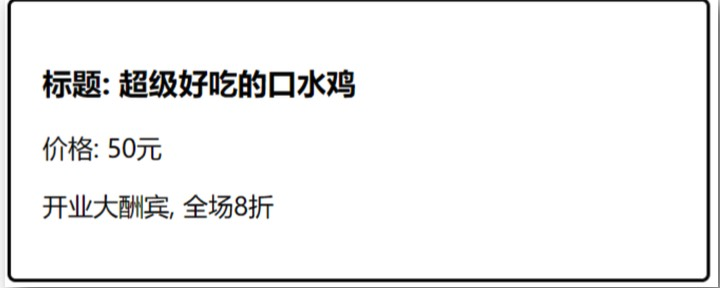

  - 子组件内，定义变量，准备接收，然后使用变量

  - ```js
    <template>
    	<div class="my-product">
        <h3>标题：{{ title }}</h3>
        <p>价格：{{ price }}</p>
        <p>{{ info }}</p>
      </div>
    </template>
    
    <script>
    export default {
      props: ['title', 'price', 'info']
    }
    </script>
    ```

- 父组件内，要展示封装的子组件：引入组件，注册组件，使用组件，传值进去
  - 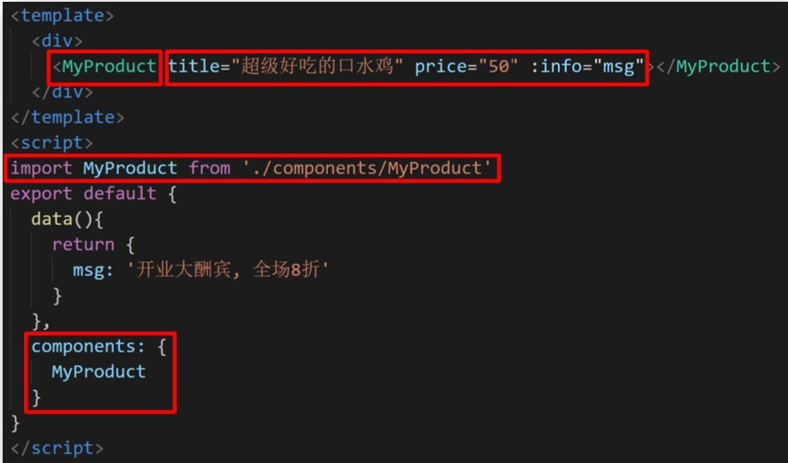

**对 props 的变量的值，进行校验，给默认值**

```
props: {
		// 外部插入此变量的值，必须是当前类型
		变量: 类型,
		变量: {
				type: 类型，
				default: 默认值,
				required: true/false, // 当前变量是不是必须要传入
		}
}
// 例如：
props: {
    background: String,
    color: {
         type: String, // 约束类型
         default: '#fff'
    }
}
```

> 其他字段可以看官网


**总结：**

- 从一个 vue 组件里把值传给另一个 vue 组件的时候，需要父传子技术
- 父传子口诀：
  - 子组件内，props 定义变量，在子组件使用变量
  - 父组件内，使用子组件，属性方式给 props 变量传值


### 05 | 组建通信 - 父向子-配和循环

**目标：父组件 --> 子组件 循环使用 -- 传值**

- 每次循环，变量和组件都是独立的

```vue
<template>
  <div>
    <My_Product 
        v-for="obj in list" :key="obj.id"
        :title="obj.title"
        :price="obj.price"
        :info="obj.info"
    ></My_Product>
  </div>
</template>

<script>
import MyProduct from './components/MyProduct.vue'
export default {
  data() {
    return {
      list: [
        {title: ' 开业大酬宾-小龙虾', price: 100, info: '我说好吃,你信吗?', id: 1},
        {title: ' 红烧大鲤鱼', price:  20, info: ' 那你?我是鱼,你要红纱我?', id: 2},
        {title: ' 滋养牛肉虾', price:  200.0, info: ' 你鱼肉下皮肤科盛大付款', id: 3},
        {title: ' 我说我是鱼', price:  1.00, info: '你会使睡吗吗', id: 4},
        ]
    }
  },
  components: {
    My_Product: MyProduct
  }
}
</script>
```


### 06 | 组建通信 - 单向数据流

**目标：从父到子的数据流向，就单向数据流**

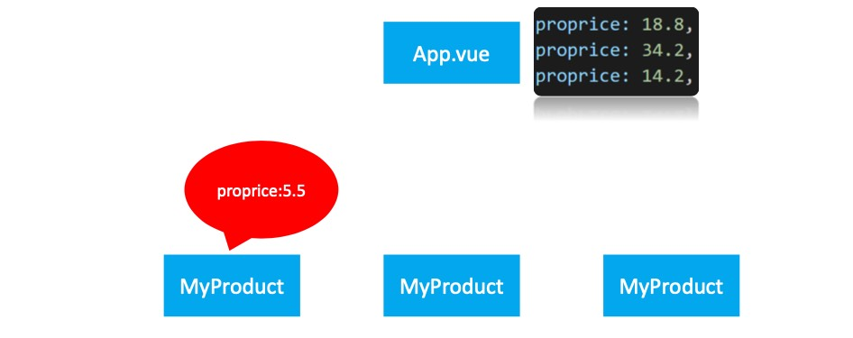

造成上图的原因是：子组件修改，不通知父级，造成数据不一致

vue 规定 props 里的变量，本身是只读的

> 为何不建议，子组件修改父组件传过来的值？
>
> - 因为父子数据不一致，而且子组件是依赖父组件传入的值
>
> 什么是单向数据流？
>
> - 从父到子的数据流向，叫单向数据流
>
> props 里定义的变量能修改吗？
>
> - 不能，props 里的变量本身是只读的


### 07 | 组建通信 - 子向父 - 自定义事件

**目标：子组件触发父自定义事件方法**

需求：商品组件，实现砍价功能

 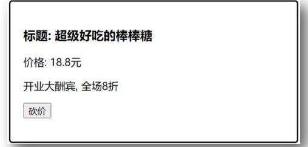

前置补充，父 -> 索引 -> 子组件：用于区分哪个子组件

```jsx
<MyProduct
  v-for="(obj, index) in list" :key="obj.id"
  :title="obj.proname"
  :price="obj.proprice"
  :info="obj.info"
  :index="index"
></MyProduct>
```

- 父组件内，绑定自定义事件和事件处理函数

- 语法：

  - `@自定义事件="父methods里的函数名"`

  - ```jsx
    // 父组件内
    <MyProduct
      v-for="(obj, index) in list" :key="obj.id"
      。。。
      :index="index"
      @subprice="fn"
    ></MyProduct>
    
    export default {
      methods: {
        fn(index, price) {
          ........
        }
      }
    }
    ```

- 子组件内，恰当时机，触发父组件给我绑定的自定义事件，导致父 methods 里事件处理函数执行

  - ```vue
    <template>
    	<div class="my-product">
        <h3>标题：{{ title }}</h3>
        <p>价格：{{ price }}元</p>
        <p>{{ info }}</p>
        <p>
          <button @click="kanFn">砍价</button>
      	</p>
      </div>
    </template>
    <script>
    export default {
      props: ["index", "title", "price", "info"]
      methods: {
      	kanFn(){
          this.$emit('subprice', this.index, 1)
        }
    	}
    }
    </script>
    ```

**总结：**

- 当想要去改变父组件的数据时候，需要用到子传父技术
- 实现过程：
  - 父组件内，给组件 `@自定义事件="父 methods 函数"`
  - 子组件内，恰当时机调用 `this.$emit('自定义事件名', 值)`


### 08 | 组件通信 - EventBus

**目标：App.vue 里引入 MyProduct.vue 和 List.vue**

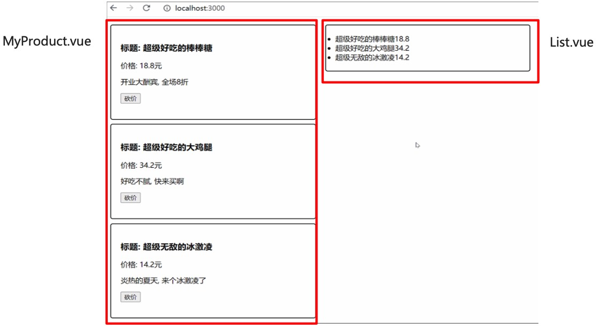

- `EventBus` 常用于跨组件通信时使用
- 语法：

  - `scr/EventBus/index.js`：创建空白 vue 对象并导出
  - 要在接收值的组件添加：`eventBus.$on('事件名', 函数体)`
  - 在传值的组件添加：`eventBus.$emit('事件名'， 值)`

示例：

1. 创建空白 vue 并导出 vue：/EventBus/index.js

   ```jsx
   import Vue from 'vue';
   //  导出空白的对象
   export default new Vue()
   ```

   

2. 接收数据方：List.vue

   ```jsx
   // 1. 引入空白 vue 对象
   import eventBus from '../EventBus/index'
   
   export default {
        props:['arr'],
        created() {
             // 接收数据,监听$on 事件
             eventBus.$on('send', (index, price)=> {
                  this.arr[index].proPrice -= price
             })
        },
   }
   ```

3. 发送数据方：MyProduct.vue

   ```jsx
   import eventBus from '../EventBus/index'
   export default {
   		 。。。
        methods: {
             kanFn () {
               		this.$emit('subPrice',this.index,1)
                   eventBus.$emit('send',this.index,1)
             }
        },
   }
   ```

   

**总结：**

- 当 2 个没有引用关系的组件之间要通信传值时，用 `eventBus` 技术
- `eventBus` 的本质是：

  - 空白 vue 对象，只负责 `$on` 和 `$emit`
  - 空白 vue 对象，只负责监听和触发事件
  


### 结论

- `label` 标签可以做关联表单，点击 `label` 标签，相当于点击表单

- 对象传值传的是引用类型的堆内存地址，多处使用共同的这个数组/对象

  

## 二、组件进阶

### 01 | vue 的生命周期

**目标：从创建到销毁的整个过程就是 - Vue 实例的 - 生命周期**


#### 01 | 钩子函数

**目标：Vue 框架内置函数，随着组件的生命周期阶段，自动执行**

- 作用：特定的时间点，执行特点的操作

- 场景：组件创建完毕后，可以在 `created 生命周期函数` 中发起 Ajax 请求，从而初始化 data 数据

- 分类：4 大阶段，8 个方法

  | 阶段   | 方法名        | 方法名    |
  | ------ | ------------- | --------- |
  | 初始化 | beforeCreated | created   |
  | 挂载   | beforeMount   | mounted   |
  | 更新   | beforeUpdate  | updated   |
  | 销毁   | beforeDestroy | destroyed |

  

#### 02 | 初始化

1. `new Vue()` ：vue 实例化，组件也是一个小的 vue 实例
2. `Init Event & Lifecycle`：初始化时间和生命周期函数
3. `beforeCreate`：生命周期钩子函数被执行
4. `Init injections & reactivity`：vue 内部添加 data 和 methods 等
5. `created`：生命周期钩子函数被执行，实例创建
6. 接下来是编译模板阶段：开始分析
7. `Has el option ?`：是否有 `el` 选项，检查要挂到哪里
   1. 没有，调用 `$mount`
   2. 有，继续检查 `template` 选项

 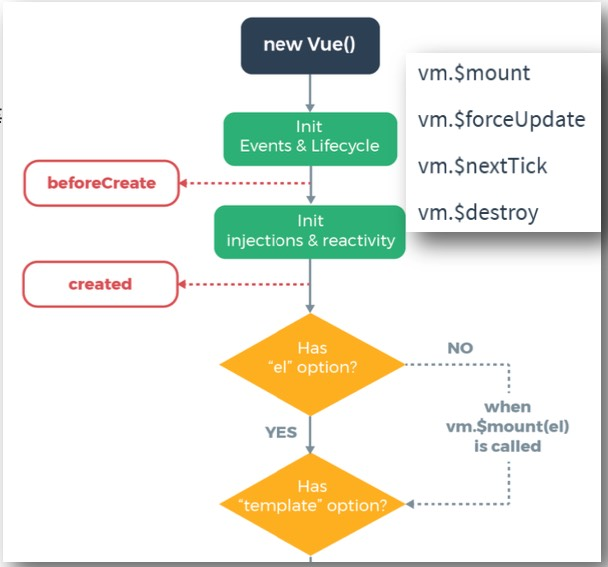

**小结：**

- Vue 实例从创建到编译模板执行了两个钩子函数：
  - `beforeCreate`
  - `created`
- `created` 函数触发能获取 data
  - 能获取 data，并不能获取真实的 `DOM`


#### 03 | 挂载

1. `template` 选项检查
   1. 有：编译 `template`，返回 `render` 渲染函数
   2. 没有：编译 `el` 选项对应标签作为 `template`（要渲染的模板）
2. 虚拟 DOM 挂载成真实的 DOM 之前
3. `beforeMount`：生命周期钩子函数被执行
4. `Create....`：把虚拟 DOM 和渲染的数据一并挂到真实的 DOM 上
5. 真实 DOM 挂载完毕
6. `mounted`：生命周期钩子函数被执行

 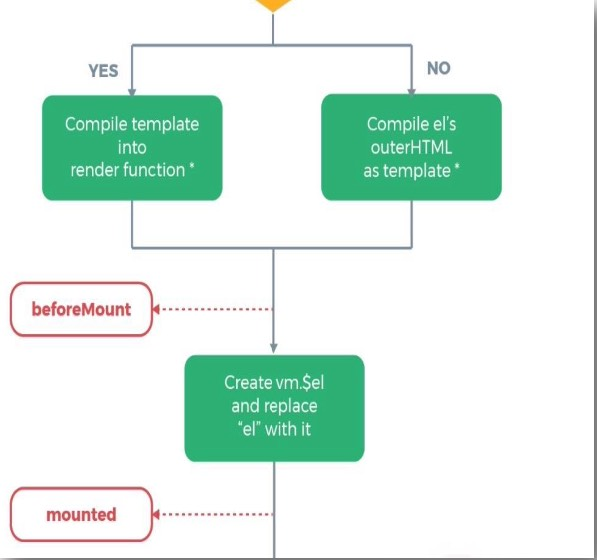


**小结：**

- Vue 实例从创建到显示经历了哪些钩子函数？
  - `beforeCreate`
  - `created`
  - `beforeMount`
  - `mounted`
- `created` 函数里，能获取真实的 DOM 吗?
  - 不能获取到真实的 DOM
- 在钩子函数里可以获取到真实 DOM 吗?
  - 可以，在 `mounted` 钩子函数


#### 04 | 更新

1. 当 data 里数据改变，更新 DOM 之前
2. `beforeUpdate`：生命周期钩子函数被执行
3. `Virtual DOM....`：虚拟 DOM 重新渲染，打补丁(更新)到真实 DOM
4. `updated`：生命周期钩子函数被执行
5. 当有 data 数据改变：重复这个循环

 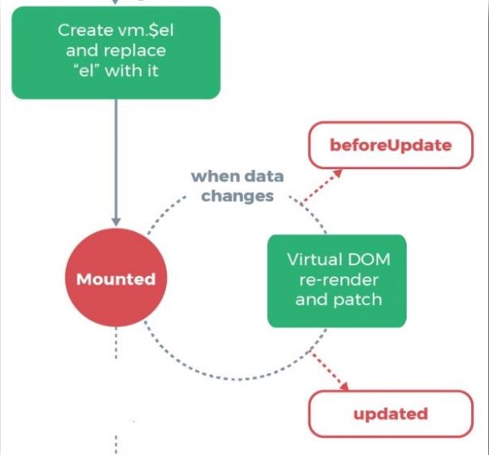

**小结：**

- 当数据发生变化并更新页面后，会执行 update 钩子函数
- 在 update 钩子函数里可以获取到更新后的 DOM


#### 05 | 销毁

1. 当 `$destory()` 被调用：比如组件 DOM 被移除。例如：v-if
2. `beforeDestory`：生命周期钩子函数被执行
3. 拆卸数据监视器，子组件和时间监听器
4. 实例销毁后，最后触发一个钩子函数
5. `destoryed`：生命周期钩子函数被执行

   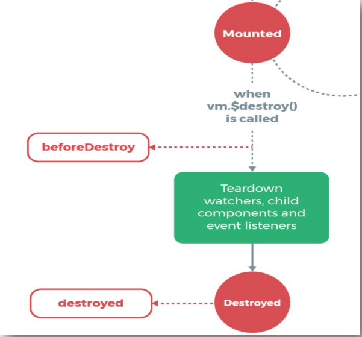


- 一般会在 `beforeDestroy`、`destoryed` 里：
  - 手动消除计时器
  - 定时器
  - 全局时间


#### 06 | 总结

- `created()`： 
  - 一般进行网络请求，注册全局组件
- `beforeMount`：挂载，真实 DOM 挂载之前
  - 预处理 data，不会触发 updated 钩子函数
- `mouonted()`：可以获取挂载后的真实 DOM
- `beforeUpdate`：data 数据更新的时候，会调用
- `updated`：获取更新后的 真实 DOM
- `beforeDestroy`：
- `destroyed`：


### 02 | axios 使用

**目标：axios 是一个专门用于发送 ajax 请求的库**

- 官网： http://www.axios-js.com/
- 特点：
  - 支持客户端发送 `Ajax` 请求
  - 支持服务端 `Node.js` 发送请求
  - 支持 `Promise` 相关方法
  - 支持请求和响应的拦截功能
  - 自动转换 JSON 数据
- axios 底层还是原生 JS 实现，内部通过 `Promise` 封装

```jsx
axios({
  methos: '请求方式'， // GET POST
  url   : '请求地址'， 
  data  : {   			 // 拼接到请求体的参数，POST 请求的参数
  	xxx : xxx,
	},
  params: {          // 拼接到请求体的参数，GET 请求的参数
  	xxx : xxx,    
  },
}).then(res => {
  console.log(res.data) // 从后台返回的结果
}).catch(err => {
  console.log(err)    // 后台报错返回
})
```


**小结：**

- `ajax` 是一种前端异步请求后端的技术
- `ajax` 原理：浏览器 window 接口 `XMLHttpRequest`
- `axios`：基于原生 `ajax + Promise` 技术封装通用于前后端的请求库


#### 01 | axios使用：GET获取数据

**目标：获取所有图书信息**

- 功能：点击调用后台接口，拿到所有数据，打印到控制台

- 接口：接口文档

- 引入：下载 axios，引入后才能使用

- ```jsx
  axios({
    url: 'http://123.57.109.30:3006/api/getbooks'
    method: 'get'
  }).then(function (res) {
    console.log(res)
  })
  ```

**小结：**

- axios 如何发起一次 get 请求
  - 在 method 选项配置为 true，也可以不写，默认就是 get
- axios 函数调用原地结果是什么？
  - 是一个 Promise 对象

- 如何拿到 Promise 里 ajax 的成功或失败的结果
  - then、catch


#### 02 | axios 使用：GET 传参

```jsx
axios({
  url: 'http://123.57.109.30:3006/api/getbooks',
  method: 'get',
  params: {
    bookname: this.bookName,
  }
}).then(function (res) {
  console.log(res)
})
```

- ajax 如何给后台传参
  - 在 url?拼接：查询字符串
  - 在 url 路径上：需要后台特殊处理
  - 在请求体 / 请求头传参给后台
- axios 在 params 配置想，会把参数自动写到 url? 后面


#### 03 | axios 使用：POST 获取数据

```jsx
axios({
  url: 'http://123.57.109.30:3006/api/addbook',
  method: 'POST',
  data: {
    appkey: 'xxxxxxxxxxx',
  }
}).then(function (res) {
  console.log(res)
})
```

- post 请求方式，一般在请求体中传递数据给后台
- axios 在 data 配置选项上，可以把参数自动转入
- axios 默认发送给后台的请求体数据是 json 字符串


#### 04 | axios 全局配置

**目标：配置基础地址，统一管理**

- 可以在官网看到 axios 的很多默认配置

  - `axios.default.baseURL = 'xxxxxxx`

- 修改请求URL ，以后的请求都不用带前缀基地址了，运行时，axios 的 baseURL 会自动拼在前

  ```jsx
  axios({
    url: '/api/addbook',
    method: 'POST',
    data: {
      appkey: 'xxxxxxxxxxx',
    }
  }).then(function (res) {
    console.log(res)
  })
  ```


### 03 | 获取 真实 DOM：通过 id 或 ref 属性获取原生的 DOM

**目标：通过 id 或 ref 属性获取原生的 DOM**

- 在 mounted 生命周期，有 2 种方式可以获取原生 DOM

  - 目标标签：添加 id / ref

    ```jsx
    <h1 ref="myH1" id="h">1. ref/id 获取原生 DOM</h1>
    ```

  - 恰当时机，通过 id、ref 属性获取目标标签

    ```jsx
    mounted() {
      	console.log(document.getElementById('h'))
      	console.log(this.$refs.myH1)
    }
    ```


### 04 | 获取组件对象：通过 ref 属性获取组件对象

**目标：通过 ref 属性获取组件对象**

- 创建 Demo 组件，写一个方法

- App.vue 使用 Demo 组件，给 ref 属性，名字随意

  - `<Demo ref="de"></Demo>`

- 恰当时机，通过 ref 属性，获取组件对象，可调用组件对象里的方法等

  - ```ksx
    mounted() {
    	thid.$ref.de.fn()
    }
    ```


**小结：**

- 通过给目标组件添加 ref 属性，通过 `this.$ref.名字` 获取组件对象
- 拿到组件可以调用组件里的属性和方法


### 05 | Vue 异步更新 DOM

**目标：点击改 data，获取原生的 DOM 内容**

1. 创建标签显示数据

   ```jsx
   <p ref="a"> 数字：{{count }}</p>
   <button @click="btnClick">点击+1，观察打印</button>
   ```

2. 点击+1，马上获取原生 DOM 内容

   ```jsx
   mehtods: {
   	btnClick() {
       this.count++;
       console.log('this.$ref.a.innerHTML')
     }
   }
   ```

   > 原因：vue 更新 dom 是异步的


####  $nextTick 使用

**目标：等 DOM 更新后，触发此方法里函数体执行**

- 语法：`this.$nextTick(该函数体)`

- ```jsx
  mehtods: {
  	btnClick() {
      this.count++;
      this.$nextTick(()=> {
  			console.log('DOM 更新后触发 $nextTick 函数')
        console.log('this.$ref.a.innerHTML')
      })
    }
  }
  ```

DOM 更新完会挨个触发 `$nextTick` 里面的函数体

**小结：**

- data 改变更新 DOM 是异步执行的
- 可以在下面两个方法内访问到更新的 DOM
  - `this.$nextTick` 里的函数体
  - `updated` 生命周期钩子函数
- `$nextTick` 函数原地返回的是 Promise 对象
- 如何在 JS 中主动触发标签的事件呢？
  - 获取到 DOM 对象，调用事件方法


### 06 |组件 name 属性的作用

**目标：组件 name 可用于注册组件名字**

- 组件定义 name 属性和值

  - 子组件内

  ```jsx
  <script>
  export default {
      name: 'ComNameHh'
  }
  </script>
  ```

- 注册组件可用上面的 name 值

  - 父组件使用

  ```
  <ComNameHh></ComNameHh>
  
  import ComName from '/components/ComName.vue'
  
  export default {
  		[ComName.name]: ComName
  }
  ```


## 三、动态组件 - 插槽 - 自定义指令

### 01 | 动态组件

**目标：多个组件使用同一个挂载点，并动态切换**

效果如下：

 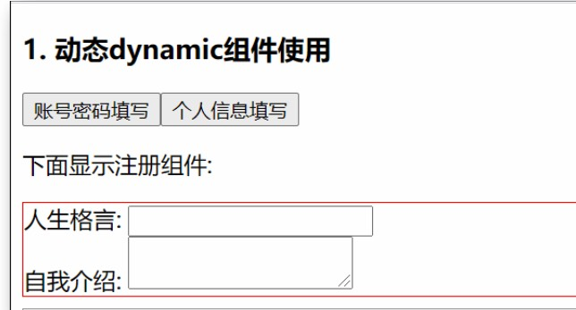


1. 准备被切换的：`UserName.vue` 和 `UserInfo.vue` 2 个组件
2. 引入到 `UseDynamic.vue` 注册
3. 准备变量来承载要显示的 `组件名`
4. 设置挂载点 `<component>`，使用 is 属性来设置要显示哪个组件
5. 点击按钮：修改 comName 变量里的‘’组件名‘’

```vue
import UserName from './username'
import UserInfo from './userinfo'

export default {
	data() {
		return {
			comName: "UserName"
		}
	},
	components: {
		UserName,
		UserInfo
	}
}

====
<p>下面显示注册组件：</p>
<div style="border: 1px solid red">
  	//	vue 内置的组件 component，可以动态显示组件
  	<component :is='comName'></component>
</div>

<button @click="comName=UserName">账号密码填写</button>
<button @click="comName=UserInfo">个人信息填写</button>
```

**小结：**

- 动态组件：在同一个挂载点，可以切换显示不同组件
- 动态组件的使用：vue 内置的 component 组件，配合 js 使用
  - `<component :is='comName'></component>`
- 如何切换？
  - 改变 is 属性的值，为要显示的组件名即可


### 02 | 组件缓存

- 语法：

  - vue 内置的 keep-alive 组件，包起来要频繁切换的组件

    ```jsx
    <keep-alive>
    	// vue 内置的 component，可以动态的显示组件
      <component :is="comName"></component>
    </keep-alive>
    ```

- 组件缓存好处：不会频繁的创建和销毁组件，页面更快的呈现


### 03 | 组件激活和非激活

**目标：扩展 2 个新的生命周期方法**

- 方法名：

  - `activated`：组件激活时，触发
  - `deactivated`：失去激活状态时触发

  ```jsx
  activated () {
    // 组件被激活
  }
  
  deactivated() {
    // 组件切换到非激活状态
  }
  ```


### 04 | 组件插槽

**目标：通过 slot 标签，让组件内可以接收不同的标签结构显示**

- 给组件插入什么标签，组件就显示什么标签

  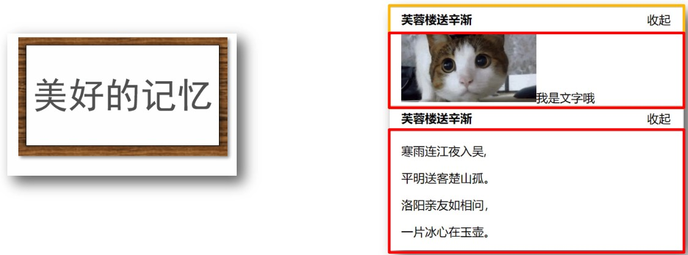

- 语法口诀：

  - 组件内用 `<slot></slot>` 占位
  - 使用组件时 `<Pannel></Pannel>` 夹着的地方，传入标签替换 `slot`

  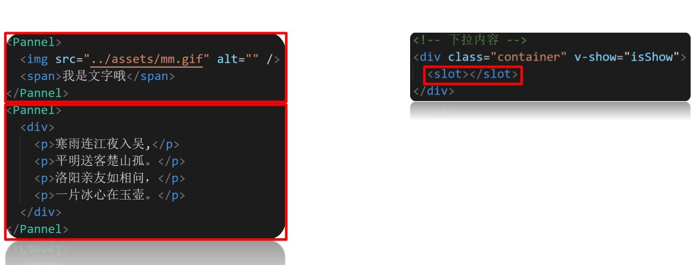

**小结：**

- 当组件内某一部分标签不确定时，用 `插槽技术`
- 插槽具体使用：
  - 先在组件内用 `slot` 占位
  - 使用组件时，传入具体标签插入
- 插槽运行效果：传入的标签会替换掉slot显示


### 05 | 组件进阶 - 插槽默认内容

**目标：如果外面不给传，想给个默认显示内容**

- 口诀：`<slot>` 内放置内容，作为默认显示内容

- 效果：

  - 不给组件传标签，slot 内容原地显示

  - 给组件内传标签，则 slot 整体被换掉

  - ```jsx
    <div class="container" v-show="isShow">
    	<slot>默认内容</slot>
    </div>
    ```


### 06 | 组件进阶 - 具名插槽

**目标：一个组件内有 2 处以上需要外部传入标签的地方**

- 语法
  - slot 使用 name 属性区分名字
  - temlate 配合 `v-slot:` 名字来分发对应标签 
- `v-slot:` 可以简化成 `#`

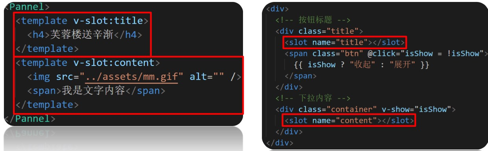


**小结：**

- 组件内多出不确定标签如何做：
  - `slot` 占位，给 `name` 属性起名字来区分
  - `template` 配合 `s-slot:name` 分发要替换的标签
- `v-slot:` 可以简化成 `#`


### 07 | 作用域插槽

准备工作：插在显示默认内容

需求：在使用此组件时，不改右侧源码，是否使用 defaultTwo 值替换默认内容

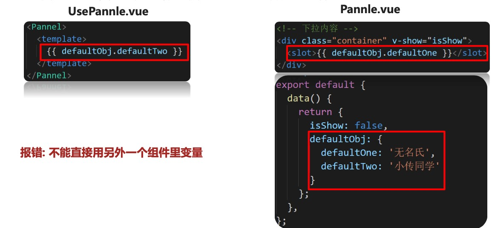

**目标：使用插槽时，想使用子组件内变量**

- 口诀
  - 子组件，在 slot 上绑定属性和子组件内的值
  - 使用组件，传入自定义标签，用 `template` 和 `v-slot=“自定义变量名”`
  - scope 变量名自动绑定 slot 上所有属性和值：`scope= {row: defaultObj}`

示例：

`UsePannel.vue`

```jsx
<Pannel>
	<template v-slot:"scope">
    {{scope.row.defaultObj}}
  </template>
</Pannel>
```

`Pannel.vue`

```jsx
<div class="xxx" v-show="isShow">
	<slot :row="defaultObj">{{defaultObj.defaultone}}</slot>
</div>
```


**小结：**

- 作用域插槽在什么时候使用？
  - 使用组件插槽技术时，需要用到子组件内变量
- 作用域插槽使用口诀？
  - 子组件在 `slot` 身上添加属性和子组件的值
  - 使用组件出 `template 配置 v-slot = “变量名”`
- 收集 slot 身上所有属性和值


### 08 | 组件进阶 - 作用域插槽使用场景

**目标：自定义组件内标签+内容**

-  准备MyTable.vue组件 – 内置表格, 传入数组循环铺设页面, 把对象每个内容显示在单元格里 
- 准备UseTable.vue – 准备数据传入给MyTable.vue使用
- 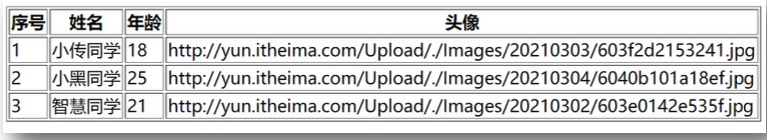

**例子：**

 我想要给td内显示图片, 需要传入自定义的img标签

- 在MyTable.vue的td中准备 `<slot>` 占位, 但是外面需要把图片地址赋予给src属性,所以在slot上把obj数据绑定 
- 在UseTable使用MyTable的时候, template上v-slot绑定变量, 传入img组件设置图片地址

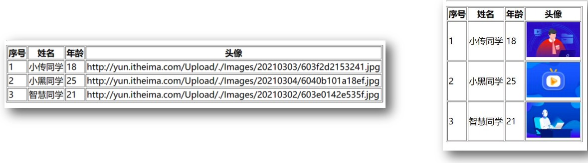

> 使用作用域插槽可以让组件更加灵活的适用于不同的场景和项目


### 09 | 自定义指令： 注册

**目标：获取标签，扩展额外的功能**

- 全局注册：语法

  ```jsx
  Vue.directive('指令名', {
  	'inserted' (el) {
      	// 可以对 el 标签扩展额外功能
    }
  })
  ```

- 局部注册： 语法

  ```jsx
  directives: {
    '指令名字': {
      inserted(el) {
         // 对 el 的操作
      }
    }
  }
  ```

> 在 vue 内置指令满足不了需求时，可以自己定义使用


### 10 | 自定义指令：传值

语法：

```jsx
Vue.directive('color', {
	inserted(el, binding) { // 当被绑定的元素插入到父元素中时调用
    el.style.color = binding.valuel
  },
  update(el, binding) { // 值或模板更新时，触发此函数
  	el.style.color = binding.value
	}
})
```

使用：

- 在标签上使用 `v-color=“red”`


**小结：**

- 指令传值：``v-指令名=“值”``

- 指令值变化触发方法：
  - 自定义指令的 update 方法二位 inserted 方法
