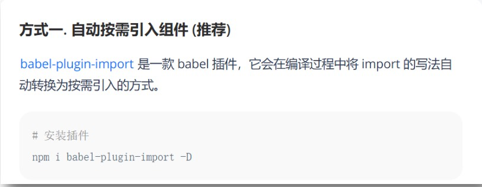

### 01 | node.js 路由

接口和服务的映射关系


- 路由是一种映射关系
- Vue 中的路由是路径和组件的映射关系


### 02 | 为什么要使用路由

- 具体使用示例: 网易云音乐 https://music.163.com/
- 单页面应用(SPA)：所有功能在一个 html 页面上实现
- 前端路由作用：实现业务场景切换
- 优点：
  - 整体不刷新页面，用户体验更好
  - 数据传递容易，开发效率高
- 缺点：
  - 开发成本高
  - 首次加载会比较慢一点，不利于 seo

**小结：**

- 什么是单页面应用：
  - 所有业务都在一个页面编写，只有一个 html
- 单页面应用的好处
  - 开发效率高，用户体验好
- 单页面如何切换场景？
  - 依赖路由切换显示


### 03 | vue-router

**目标：vue-router 本质是一个第三方包**

- 官网: https://router.vuejs.org/zh/
- `vue-router` 模块包
- 它和 `Vue.js` 深度集成
- 可以定义 - 视图表(映射规则)
- 模块化的
- 提供2个内置全局组件
- 声明式导航自动激活的 CSS class 的链接 
- ......

> Vue.js 官方的路由管理器
>
> Vue 中集成 vue-router 模块包来实现路由


### 04 | 组件分类

**目标：.vue 文件分 2 类，一个页面组件，一个复用组件**


- .vue 文件本质无区别，方便大家学习和理解，总结的一个经验
- src/views 文件夹
  - 页面组件：页面展示， 配合路由用
- src/components 文件夹
  - 复用组件：展示数据，常用于复用


**小结：**

- 把.vue 文件分类是为了方便理解和使用
- 页面组件：配合路由，切换页面
- 复用组件：用在页面组件，重复渲染结构一样的标签


### 05 | vue-router 路由的基本使用

- 下载 `vue-router`  模块到当前工程
- 在 `main.js` 中引入 `VueRouter `函数
- 添加到 `Vue.use()` 身上，注册全局 `RouterLink` 和 `RouterView` 组件
- 创建路由规则数组：路径和组件名对应的关系
- 用规则生成路由对象
- 把路由对象注入到 `new Vue` 实例中
- 用 `router-view` 作为挂载点，切换不同的路由页面


完整代码：

`Find.vue`

```vue
<template >
     <div>
           <p>警钟没多少分</p> 
           <p>防守打法史蒂夫</p> 
           <p>企鹅王群二</p> 
           <p>给对方给对方</p>
     </div>
</template>
```

`My.vue`

```vue
<template >
     <div>
          <p>我的收藏</p>
          <p>我的收藏</p>
          <p>我的收藏</p>
          <p>我的收藏</p>
     </div>
</template>
```

`Part.vue`

```jsx
<template >
     <div>
          <p>我的收藏</p>
          <p>喜欢明显</p>
          <p>喜欢吃饭</p>
           <p>我的收藏</p>
     </div>
</template>
```

`main.js`

```jsx
import Vue from 'vue'
import App from './App.vue'
import Find from './components/views/Find.vue'
import Part from './components/views/Part'
import My from './components/views/My'

Vue.config.productionTip = false

// 1. 导入 vue-router
import VueRouter from 'vue-router'
// 2. 注册全局组件
Vue.use(VueRouter)
// 3. 规则数组 
const routes = [
  {
    path:"/find",
    component: Find
  },
  {
    path:"/my",
    component: My
  },
  {
    path:"/part",
    component: Part
  },
]

// 4. 生成路由对象
const router = new VueRouter({
  // 5. // 固定的 key,传入规则数组,这里可以简写routes
  routes 
})

// 6. 注册到实例中
new Vue({
  router,
  render: h => h(App),
}).$mount('#app')
```

`App.vue`

```vue
<template>
  <div>
    <div class="footer_wrap">
      <a href="#/find">发现音乐</a>
      <a href="#/my">我的音乐</a>
      <a href="#/part">朋友</a>
    </div>
    <div class="top">
      <!-- 7. 设置挂载点,当 url 的 hash 值路径切换,显示规则里对饮搞的组件 -->
      <router-view></router-view>
    </div>
  </div>
</template>
```

> 注意：
>
> 一切都要以 url 上 hash 值为准

**小结：**

- vue-router 的本质是一个第三方包，下载后集成到 vue 项目中
- vue-router 使用：
  - 下包、引入、注册、规则、路由对象、注入、挂载点
- 规则如何生效？
  - 切换 url 上 hash 值，开始匹配规则，对应组件展示到 router-view 位置


### 06 | 声明式导航

**用组件 router-link 来替代 a 标签**

1. vue-router 提供了一个全局组件 router-link
2. router-link 实质上最终会渲染成 a 链接 to 属性等价于提供的 href 属性（to 无需#）
3. router-link 提供了声明式导航高亮的功能（自带类名）


```
// 上述 App.vue 中的代码替换
<template>
  <div>
    <div class="footer_wrap">
      <router-link to="/find">发现音乐</router-link>
      <router-link to="/m">我的音乐</router-link>
      <router-link to="/part">朋友</router-link>
    </div>
    <div class="top">
      <!-- 7. 设置挂载点,当 url 的 hash 值路径切换,显示规则里对饮搞的组件 -->
      <router-view></router-view>
    </div>
  </div>
</template>
```

**小结：**

- router-link 是什么？
  - VueRouter 在全局注册的组件，本质就是一个 a 标签
- router-link 怎么用？
  - 当标签使用，必须传入 to 属性，指定路由路径值
- router-link 的好处：
  - 自带激活时的类名，可以做高亮


### 07 | 声明式导航 - 跳转传参

**在跳转路由时，可以给路由对应的组件内传值**

- 在 router-link 上的 to 属性传值，语法格式如下
  - ``/path?参数名=值``
  - ``/path/值``：需要路由对象提前配置 path：`/path/参数名`
- 对应页面组件接收传递过来的值
  - `$route.query.参数名`
  - `$route.params.参数名`

相关代码：

`Part.vue` 准备接收路由上传递的参数和值

```jsx
<template >
     <div>
          <p>我的收藏</p>
          <p>喜欢明显</p>
          <p>喜欢吃饭</p>
          <p>我的收藏</p>
          <p>人名: {{ $route.query.name }} -- {{ $route.params.username }}</p>
     </div>
</template>
```

`main.js` 相关路由更改

```vue
// 3. 规则数组 
const routes = [
  {
    path:"/find",
    component: Find
  },
  {
    path:"/my",
    component: My
  },
  {
    path:"/part", 
    component: Part 
  },
  {
    path:"/part/:username", // 有:的路径代表要接收具体的值
    component: Part 
  },
]
```

`App.vue` 传值给 `Part.vue` 组件中

```jsx
<router-link to="/part/小智">朋友-小智</router-link>
<router-link to="/part?name=小传">朋友-小传</router-link>
```


### 08 | 路由 - 重定向

**匹配 path 后，强制跳转 path 路径**

- 网页打开 url 默认 hash 值是 `/路径`

- redirect 是设置重定向到哪个路由路径

  ```
  const routes = [
  	{
  		path: "/",
  		redirect :'/find'
  	},
  		{
  		path: "/find",
  		component: Find
  	},
  	{
  		path: "/my",
  		component: My
  	},
  ]
  ```


**小结：**

- 如何检测默认路由？
  - 规则定义 `path: "/"`’
- 如何重定向路由路径？
  - redirect 配置项，值为要强制切换的路由路径


### 09 | 路由 - 404

**找不到路径给个提示页面**

- 路由最后，path 匹配 *(任意路径)，前面不匹配就命中最后这个

```jsx
// 404组件页面
import NotFound from './components/NotFound'

const routes = [
	{
		path: "/",
		redirect :'find'
	},
	{
		path: "/find",
		component: Find
	},
	{....
	},
  {....
	},
  ....
  {
		path: "*",
		component: NotFound
	},
]
```


### 10 | 路由 - 模式设置

**修改路由在地址栏的模式**

- `hash` 路由例如: http://localhost:8080/#/home
- `history` 路由例如: http://localhost:8080/home (以后上线需要服务器端支持, 否则找的是文件夹)

```jsx
const router = new VueRouter({
  routes,
  mode: "history"
})
```


- 修改路由模式：在实例化路由对象时，传入 mode 选项和值修改


### 11 | 编程式导航 - 基础使用

**用 JS 代码来进行跳转**

- 语法：path或者 name 任选一个

  ```js
  this.$router.push {
    path: "路由路径", // 都去 router/index.js 定义
    name: "路由名"
  }
  ```

- 切换路由路径，在 `this.$router.push()` 配置 `path`、`name` 要和路由规则数组里对应

- 尽量用 name 参数，方便便捷

完整写法：

`main.js`

```
{
    path: "/find",
    name: "Find",
    component: Find
},
{
    path: "/my",
    name: "My",
    component: My
},
{
    path: "/part",
    name: "Part",
    component: Part
}
```

`App.vue`

```vue
<template>
  <div>
    <div class="footer_wrap">
      <span @click="btn('/find', 'Find')">发现音乐</span>
      <span @click="btn('/my', 'My')">我的音乐</span>
      <span @click="btn('/part', 'Part')">朋友</span>
    </div>
    <div class="top">
      <router-view></router-view>
    </div>
  </div>
</template>

<script>
// 目标: 编程式导航 - js方式跳转路由
// 语法:
// this.$router.push({path: "路由路径"})
// this.$router.push({name: "路由名"})
// 注意:
// 虽然用name跳转, 但是url的hash值还是切换path路径值
// 场景:
// 方便修改: name路由名(在页面上看不见随便定义)
// path可以在url的hash值看到(尽量符合组内规范)
export default {
  methods: {
    btn(targetPath, targetName){
      // 方式1: path跳转
      this.$router.push({
        // path: targetPath,
        name: targetName
      })
    }
  }
};
</script>
```


### 12 | 编程式导航 - 跳转传参

**JS 跳转路由，传参**

- 语法：query 或者 params 任选一个

  ```
  this.$router.push({
  	path: "路由路径",
  	name: "路由名",
  	query: {
  			"属性名":值
  	},
  	params: {
  			"属性名":值
  	}
  })
  ```

  ```jsx
  <template>
  	<div>
    	<p>1</p>
      <p>2</p>
      <p>3</p>
      <p>4: {{$route.query.name}}
    		---
        		{{$route.params.username}}	
      </p>
    </div>
  </template>
  ```

- query 传，用$route.query 接。

- params 传，用$route.params 接

完整写法：

`App.vue`

```jsx
<template>
  <div>
    <div class="footer_wrap">
      <span @click="btn('/find', 'Find')">发现音乐</span>
      <span @click="btn('/my', 'My')">我的音乐</span>
      <span @click="oneBtn">朋友-小传</span>
      <span @click="twoBtn">朋友-小智</span>
    </div>
    <div class="top">
      <router-view></router-view>
    </div>
  </div>
</template>

<script>
// 目标: 编程式导航 - 跳转路由传参
// 方式1:
// params => $route.params.参数名
// 方式2:
// query => $route.query.参数名
// 重要: path会自动忽略params
// 推荐: name+query方式传参
// 注意: 如果当前url上"hash值和?参数"与你要跳转到的"hash值和?参数"一致, 爆出冗余导航的问题, 不会跳转路由
export default {
  methods: {
    btn(targetPath, targetName){
      // 方式1: path跳转
      this.$router.push({
        // path: targetPath,
        name: targetName
      })
    },
    oneBtn(){
      this.$router.push({
        name: 'Part',
        params: {
          username: '小传'
        }
      })
    },
    twoBtn(){
      this.$router.push({
        name: 'Part',
        query: {
          name: '小智'
        }
      })
    }
  }
};
</script>
```

**小结：**

- 传参方式：

  - `params ==> $route.params.参数名`
  - `query ==> $route.query.参数名`
  - path 会自动忽略 params
  - 推荐使用 query +name 的方式传值

- 注意：

  - 如果当前 url 上的 `hash 值和?参数` 与要跳转到的`hash 值和?参数`一致，爆出冗余导航的问题，不会跳转路由

  

### 13 | 路由 - 路由嵌套

**在现有的一级路由下，在嵌套二级路由**

二级路由示例-网易云音乐-发现音乐下 https://music.163.com/

 

**步骤：**

- 创建所有需要的所有组件
  - src/views/Find.vue -- 发现音乐页
  - src/views/My.vue -- 我的音乐页
  - src/views/Second/Recommend.vue  ：发现音乐页 / 推荐页面
  - src/views/Second/Ranking.vue ： 发现音乐页 / 排行榜页面
  - src/views/Second/SongList.vue ： 发现音乐页 / 歌单页面
- main.js：继续配置 2 级路由
  - 一级路由 `path` 从 `/` 开始定义
  - 二级路由往后 `path` 直接写 `名字`, 无需 `/` 开头
  - 嵌套路由在上级路由的 `children` 数组里编写路由信息对象
- 说明：
  - App.vue 的 `router-view` 负责发现音乐和我的音乐页面, 切换 
  - Find.vue 的的 router-view 负责发现音乐下的, 三个页面, 切换


**配置二级导航和样式- 在Find.vue中**

```jsx
<template>
  <div>
    <!-- <p>推荐</p>
    <p>排行榜</p>
    <p>歌单</p> -->
    <div class="nav_main">
      <router-link to="/find/recommend">推荐</router-link>
      <router-link to="/find/ranking">排行榜</router-link>
      <router-link to="/find/songlist">歌单</router-link>
    </div>

    <div style="1px solid red;">
      <router-view></router-view>
    </div>
  </div>
</template>

<script>
export default {};
</script>

<style scoped>
...
</style>
```

**配置路由规则-二级路由展示**

```jsx
const routes = [
  // ...省略其他
  {
    path: "/find",
    name: "Find",
    component: Find,
    children: [
      {
        path: "recommend",
        component: Recommend
      },
      {
        path: "ranking",
        component: Ranking
      },
      {
        path: "songlist",
        component: SongList
      }
    ]
  }
  // ...省略其他
]
```


**小结：**

- 二级路由配置：
  - 创建需要的二级页面组件
  - 路由规则里的 children 中配置二级路由规则对象
  - 一级页面中设置 router-view 显示二级路由页面
- 二级路由注意事项：
  - 二级路由 path 一般不写``根路径 /``
  - 跳转时路径要从 `/` 开始写全。例如：`<router-link to="/find/recommend">推荐</router-link>`


### 14 | 声明式导航  - 类名区别

- 观察路由嵌套导航的样式

  - router-link-exact-active (精确匹配) url中hash值路径, 与href属性值完全相同, 设置此类名 
  - router-link-active (模糊匹配) url中hash值, 包含href属性值这个路径

   

- 自动添加的 2 个类名的区别：
  - router-link-exact-active：url 的 hash 值和 href 完全匹配
  - router-link-active：url 的 hash 值包含 herf 路径值匹配


### 15 | 全局前置守卫

**路由跳转之前，会触发一个函数**

> 目标: 路由跳转之前, 先执行一次前置守卫函数, 判断是否可以正常跳转


- 例如：登陆状态去 < 我的音乐 > 页面, 未登录弹窗提示 
- 语法：router.beforeEach((to, from, next) =>{})
  - 一定调next(), 才会跳转下一页

```jsx
let isLogin = false
router.beforeEach((to, form, next)=> {
  if (to.path == "/my" && isLogin === false) {
    	alert("请登录")
    	next(false) // 阻止路由跳转
  } else {
      next()
  }
})// 目标: 路由守卫
// 场景: 当你要对路由权限判断时
// 语法: router.beforeEach((to, from, next)=>{//路由跳转"之前"先执行这里, 决定是否跳转})
// 参数1: 要跳转到的路由 (路由对象信息)    目标
// 参数2: 从哪里跳转的路由 (路由对象信息)  来源
// 参数3: 函数体 - next()才会让路由正常的跳转切换, next(false)在原地停留, next("强制修改到另一个路由路径上")
// 注意: 如果不调用next, 页面留在原地

// 例子: 判断用户是否登录, 是否决定去"我的音乐"/my
const isLogin = true; // 登录状态(未登录)
router.beforeEach((to, from, next) => {
  if (to.path === "/my" && isLogin === false) {
    alert("请登录")
    next(false) // 阻止路由跳转
  } else {
    next() // 正常放行
  }
})
```

**小结：**

- 路由守卫：路由在真正跳转前, 会执行一次 `beforeEach` 函数, `next()`  调用则跳转, 也可以强制修改要跳转的路由
- `next()` 放行, `next(false)` 留在原地不跳转路由, `next(path路径)` 强制换成对应path路径跳转


### 16 | 路由懒加载

#### 01 | 懒加载

```js
const routes = [
  {
    path: '',
    name: '',
    // 路由懒加载
    component: () => import('@/.....')
  }
]
```


### 17 | 路由的跳转和返回

基础使用：

```js
this.$router.push {
  path: "路由路径", // 都去 router/index.js 定义
  name: "路由名"
}
```

在 `<template></template>` 等标签中也可以写成 `<div @click="$router.push(路由信息)"></div>`

- 跳转到新路由：`$router.push(xxx)`
- 返回上一级路由： `$router.back()`


### Vant 组件库

**Vant 是一个轻量、可靠的移动端 Vue 组件库，开箱即用**

- Vant组件库: https://vant-contrib.gitee.io/vant/#/zh-CN/
- 封装了很多的组件, 支持移动项目中大多数使用场景

- 特点
  - 提供 60 多个高质量组件，覆盖移动端各类场景 
  - 性能极佳，组件平均体积不到 1kb
  - 完善的中英文文档和示例
  - 支持 Vue 2 & Vue 3
  - 支持按需引入和主题定制

#### 01 | 全局引入

**看官网文档，下载，引入 Vant 组件库**

1. 全部引入, 快速开始: https://vant-contrib.gitee.io/vant/#/zh-CN/quickstart 
2. 下载Vant组件库到当前项目中
3. 在main.js中全局导入所有组件,
4. 使用按钮组件 – 作为示范的例子

```jsx
// Vant 支持一次性导入所有组件，引入所有组件会增加代码包体积，因此不推荐这种做法。
import { createApp } from 'vue';
import Vant from 'vant';
import 'vant/lib/index.css';

const app = createApp();
app.use(Vant);
```


 


#### 02 | 按需引入

**手动引入使用的某个组件**

手动单独引入, 快速开始: https://vant-contrib.gitee.io/vant/#/zh-CN/quickstart

```js
// 在不使用任何构建插件的情况下，可以手动引入需要使用的组件和样式。
// 引入组件脚本
import Button from 'vant/es/button/index';
// 引入组件样式
// 若组件没有样式文件，则无须引入
import 'vant/es/button/style/index';
```


**手动引入步骤**

- import 从vant库里引出某个组件
- import 单独引出样式 
- 在当前页面注册此组件名即可

 

#### 03 | 自动按需引入

**依赖插件自动按需引入**

快速开始: https://vant-contrib.gitee.io/vant/#/zh-CN/quickstart

 


自动按需引入Vant组件库：

- webpack依赖babel-plugin-import的插件 
- 把import按需引入方式, 自动转成只引入某个组件方式


#### 04 | 弹出框使用

弹出框地址: https://vant-contrib.gitee.io/vant/#/zh-CN/dialog

 