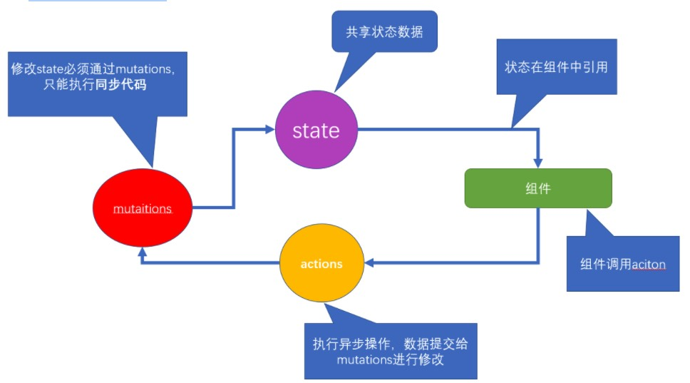

### 01 | vuex 基础-介绍

Vuex 是一个专为 Vue.js 应用程序开发的**状态管理模式**。它采用 `集中式` 存储管理应用的所有组件的状态，并以相应的规则保证状态以一种 `可预测` 的方式发生变化。



**小结：**

1. 修改state状态必须通过 `mutations`
2. `mutations` 只能执行同步代码，类似ajax、定时器之类的代码不能在mutations中执行
3. 执行异步代码，要通过actions，然后将数据提交给mutations才可以完成
4. state的状态即共享数据可以在组件中引用
5. 组件中可以调用action


### 02 | vuex 基础-初始化功能

> 建立一个新的脚手架项目, 在项目中应用vuex

`$ vue create  demo`

> 开始vuex的初始化建立，选择模式时，选择默认模式

**初始化：**

- 第一步：`npm i vuex --save`  => 安装到 `运行时依赖`   => 项目上线之后依然使用的依赖 ,开发时依赖  => 开发调试时使用  

> 开发时依赖 就是开开发的时候，需要的依赖，运行时依赖，项目上线运行时依然需要的

- 第二步： **在main.js中** `import Vuex from 'vuex'`

- 第三步：**在main.js中**  `Vue.use(Vuex)`  => 调用了 vuex中的 一个install方法

- 第四步：`const store = new Vuex.Store({...配置项})`

- 第五步：在根实例配置 store 选项指向 store 实例对象

- ```vue
  import Vue from 'vue'
  import Vuex from 'vuex'
  Vue.use(vuex)
  const store = new Vuex.Store({})
  new Vue({
    el: '#app',
    store
  })
  ```


### 03  | vuex 基础 - state

state是放置所有公共状态的属性，如果你有一个公共状态数据 ， 你只需要定义在 state对象中

**定义state**

```jsx
// 初始化vuex对象
const store = new Vuex.Store({
  // 实例化 Vuex 的构造参数：state、mutations、actions
  state: {
    // 管理数据
    count: 0
  }
}
```

> 如何在组件中获取count?

**原始形式**

插值表达式

`App.vue`

组件中可以使用  **this.$store** 获取到vuex中的store对象实例，可通过**state**属性属性获取**count**， 如下

```js
<div> state的数据：{{ $store.state.count }}</div>
```

**计算属性** 

将state属性定义在计算属性中

```js
// 把state中数据，定义在组件内的计算属性中
computed: {
  count () {
    return this.$store.state.count
  }
}
```

```js
<div> state的数据：{{ count }}</div>
```

**辅助函数** 

`mapState`

> mapState是辅助函数，帮助我们把store中的数据映射到 组件的计算属性中, 它属于一种方便用法

用法 ： 第一步：导入mapState

```js
import { mapState } from 'vuex'
```

第二步：采用数组形式引入state属性

```js
mapState(['count']) 
```

> 上面代码的最终得到的是 **类似**

```js
count () {
    return this.$store.state.count
}
```

第三步：利用**延展运算符**将导出的状态映射给计算属性

```js
computed: {
  ...mapState(['count'])
}
```

```js
 <div> state的数据：{{ count }}</div>
```

完整代码：

`App.vue`

```jsx
<template>
  <div>
    <!-- 原始形式应用 -->
    <div>{{ count }}</div>
  </div>
</template>

<script>
import {mapState} from 'vuex'

export default {
  computed: {
    // count() {
    //   return this.$store.state.count
    // },
    ...mapState(['count']) /// 相当于上面的 count 方法
    // 如果有多个共享状态 ...mapState(['count','age','name'])
  }
}
</script>
```


### 04 | vuex基础-mutations

> state数据的修改只能通过mutations，并且mutations必须是同步更新，目的是形成**`数据快照`**

数据快照：一次mutation的执行，**立刻**得到一种视图状态，因为是立刻，所以必须是同步

**定义mutations**

```js
const store  = new Vuex.Store({
  state: {
    count: 0
  },
  // 定义mutations
  mutations: {
     // 修改 state 的一个一个方法
  }
})
```

**格式说明**

mutations是一个对象，对象中存放修改state的方法

```jsx
mutations: {
  // 方法里参数: 
  // 第一个参数：state。是当前store的state属性
  // 第二个参数：payload 载荷 运输参数 调用mutaiions的时候 可以传递参数 传递载荷
  addCount (state) {
    state.count += 1
  }
},
```

> 如何在组件中调用mutations

**原始形式**

`$store`

```js
// 新建组件child-a.vue，内容为一个button按钮，点击按钮调用mutations
<template>
  <button @click="addCount">+1</button>
</template>

<script>
export default {
    methods: {
    //   调用方法
      addCount () {
         // 调用store中的mutations 提交给muations
        // commit('muations名称', 2)
        this.$store.commit('addCount', 10)  // 直接调用mutations,10为传递的参数
    }
  }
}
</script>
```

带参数的传递

```js
addCount (state, payload) {
    state.count += payload
}
this.$store.commit('addCount', 10)
```

**辅助函数** 

`mapMutations`

> mapMutations和mapState很像，它把位于mutations中的方法提取了出来，我们可以将它导入

```js
import  { mapMutations } from 'vuex'
methods: {
    ...mapMutations(['addCount'])
}
```

> 上面代码的含义是将mutations的方法导入了methods中，等同于

```js
methods: {
    // commit(方法名, 载荷参数)
    addCount () {
        this.$store.commit('addCount')
    }
}
```

此时，就可以直接通过this.addCount调用了

```js
<button @click="addCount(100)">+100</button>
```

但是请注意： Vuex中mutations中要求不能写异步代码，如果有异步的ajax请求，应该放置在actions中

完整代码：

`child-a.vue`

```js
<template>
  <div>
  			// 这里的 10 就是传递的参数，传入的载荷
       <button @click="addCount(10)">+1</button>
  </div>
</template>

<script>
import {mapMutations} from 'vuex'

export default {
     methods: {
          ...mapMutations(['addCount'])
     },
}
</script>
```


### 05 | vuex基础-actions

> state是存放数据的，mutations是同步更新数据，actions则负责进行异步操作

**定义actions**

```jsx
const store = new Vuex.Store({
  ...
  actions: {
    getAsyncCount(context, params) {

      setTimeout(() => {
        // 就去得到一个值
        context.commit('addCount', params)
      }, 2000); 
      // 2s
    }
  }
})
```

actions 中的方法中的参数：

- 第一个参数：context。相当于 `this.$store`。
  - 可以通过 context.state 获取状态，
  - 可以通过 context.commit 来提交 mutations
  - 可以通过 context.dispatch 调用其他 action

- 第二个参数：我们传递的参数

在 `child-a.vue`中调用如下：

**原始调用** 

`$store`


```jsx
addAsyncCount () {
   this.$store.dispatch('getAsyncCount')
}
```

**传参调用**

```js
addAsyncCount () {
   this.$store.dispatch('getAsyncCount', 123)
}
```

**辅助函数** 

`mapActions`

> actions也有辅助函数，可以将action导入到组件中

```js
import { mapActions } from 'vuex'
methods: {
    ...mapActions(['getAsyncCount'])
}
```

直接通过 this.方法就可以调用

```js
<button @click="getAsyncCount(111)">+异步</button>
```


### 06 | vuex基础-getters

> 除了state之外，有时我们还需要从state中派生出一些状态，这些状态是依赖state的，此时会用到getters

例如，state中定义了list，为1-10的数组，

```js
state: {
  list: [1,2,3,4,5,6,7,8,9,10]
}
```

组件中，需要显示所有大于5的数据，正常的方式，是需要list在组件中进行再一步的处理，但是getters可以帮助我们实现它

**定义getters**

```js
const store = new Vuex.Store({
  ...
  
	getters: {
  		// getters函数的第一个参数是 state
  		// 必须要有返回值
   		filterList:  state =>  state.list.filter(item => item > 5)
    	// 上下两个函数等同
			filterList1: function(state) {
  				return state.list.fillter(function (item) {
  						return item > 5
					})	
			}
  }
})
```

**使用getters**

**原始方式** 

`$store`

```js
<div>{{ $store.getters.filterList }}</div>
```

**辅助函数** 

`mapGetters`

```js
computed: {
		// 将 getter 中的计算属性导入到组件的计算属性中
    ...mapGetters(['filterList'])
}
```

```js
<div>{{ filterList }}</div>
```


### 07 | Vuex中的模块化-Module

#### 01 | 为什么会有模块化

> 由于使用单一状态树，应用的所有状态会集中到一个比较大的对象。当应用变得非常复杂时，store 对象就有可能变得相当臃肿。

这句话的意思是，如果把所有的状态都放在state中，当项目变得越来越大的时候，Vuex会变得越来越难以维护

由此，又有了Vuex的模块化


#### 02 | 模块化的简单应用

定义两个模块   **user** 和  **setting**

user中管理用户的状态  token 

setting中管理 应用的名称 name

```js
const store  = new Vuex.Store({
modules: {
  user: {
     state: {
       token: '12345'
     }
  },
  setting: {
    state: {
       name: 'Vuex实例'
    }
  }
})
```

定义child-b组件，分别显示用户的token和应用名称name

```js
<template>
  <div>
      <div>用户token {{ $store.state.user.token }}</div>
      <div>网站名称 {{ $store.state.setting.name }}</div>
  </div>
</template>
```

请注意： 此时要获取子模块的状态 需要通过 $store.**`state`**.**`模块名称`**.**`属性名`** 来获取

> 看着获取有点麻烦，我们可以通过之前学过的getters来改变一下

```js
getters: {
 token: state => state.user.token,
 name: state => state.setting.name
} 
```

请注意：这个getters是根级别的getters哦

**通过mapGetters引用**

```js
computed: {
     ...mapGetters(['token', 'name'])
}
```


#### 03 | 模块化中的命名空间

**命名空间**  **`namespaced`**

> 这里注意理解

默认情况下，模块内部的 action、mutation 和 getter 是注册在**全局命名空间**的——这样使得多个模块能够对同一 mutation 或 action 作出响应。

> 这句话的意思是 刚才的user模块还是setting模块，它的 action、mutation 和 getter 其实并没有区分，都可以直接通过全局的方式调用 如


```js
user: {
   state: {
     token: '12345'
   },
   mutations: {
    //  这里的state表示的是user的state
     updateToken (state) {
        state.token = 678910
     }
   }
},
```

**通过mapMutations调用**

```js
methods: {
     ...mapMutations(['updateToken'])
}
<button @click="updateToken">修改token</button>
```

> 但是，如果我们想保证内部模块的高封闭性，我们可以采用namespaced来进行设置

高封闭性？可以理解成 **一家人如果分家了，此时，你的爸妈可以随意的进出分给你的小家，你觉得自己没什么隐私了，我们可以给自**

**己的房门加一道锁（命名空间 namespaced）,你的父母再也不能进出你的小家了**

如：

```js
user: {
   namespaced: true,
   state: {
     token: '12345'
   },
   mutations: {
    //  这里的state表示的是user的state
     updateToken (state) {
        state.token = 678910
     }
   }
},
```

使用带命名空间的模块 **`action/mutations`**

方案1：**直接调用-带上模块的属性名路径**

```js
test () {
   this.$store.dispatch('user/updateToken') // 直接调用方法
}
```

方案2：**辅助函数-带上模块的属性名路径**

```js
methods: {
     ...mapMutations(['user/updateToken']),
     test () {
         this['user/updateToken']()
     }
 }
<button @click="test">修改token</button>
```

方案3： **createNamespacedHelpers**  创建基于某个命名空间辅助函数

```js
import { mapGetters, createNamespacedHelpers } from 'vuex'
const { mapMutations } = createNamespacedHelpers('user')
<button @click="updateToken">修改token2</button>
methods: {
     ...mapMutations(['updateToken'])
}
```

