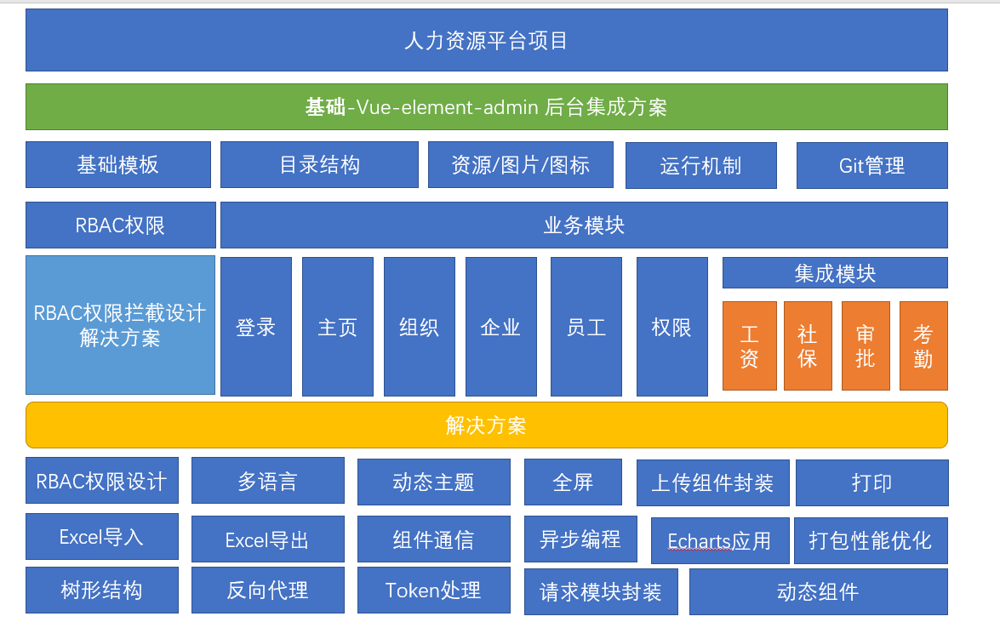

## vue-element-admin



[vue-element-admin](https://panjiachen.gitee.io/vue-element-admin-site/zh/) 是一个后台前端解决方案，它基于 [vue](https://github.com/vuejs/vue) 和 [element-ui](https://github.com/ElemeFE/element)实现。它使用了最新的前端技术栈，内置了 i18 国际化解决方

案，动态路由，权限验证，提炼了典型的业务模型，提供了丰富的功能组件，它可以帮助你快速搭建企业级中后台产品原型。

[vue-element-admin](http://panjiachen.github.io/vue-element-admin) 是一个后台集成方案, 集成了PC项目中很多的业务场景和功能, 

尤其在当下SPA的趋势下,我们可以从中获得很多成熟的解决方案.

这里是[官网地址](https://panjiachen.gitee.io/vue-element-admin-site/zh/)

这里是[线上demo地址](https://panjiachen.github.io/vue-element-admin/#/dashboard)

> [vue-element-admin](http://panjiachen.github.io/vue-element-admin) 有一个成熟的[集成方案](https://github.com/PanJiaChen/vue-element-admin)，里面包含了所有的业务功能和场景,并不适合直接拿来进行二次开发, 但是可以通过该项目中的一个案例来进行学习和使用.

```js
$ git clone https://github.com/PanJiaChen/vue-element-admin.git  #拉取代码
$ cd vue-element-admin #切换到具体目录下
$ npm run dev  #启动开发调试模式  查看package.json文件的scripts可知晓启动命令
```

> 集成方案并不适合我们直接拿来进行二次开发，[基础模板](https://github.com/PanJiaChen/vue-admin-template)则是一个更好的选择


基础框架目录结构：

```bash
├── build                      # 构建相关
├── mock                       # 项目mock 模拟数据
├── public                     # 静态资源
│   │── favicon.ico            # favicon图标
│   └── index.html             # html模板
├── src                        # 源代码
│   ├── api                    # 所有请求
│   ├── assets                 # 主题 字体等静态资源
│   ├── components             # 全局公用组件
│   ├── icons                  # 项目所有 svg icons
│   ├── layout                 # 全局 layout
│   ├── router                 # 路由
│   ├── store                  # 全局 store管理
│   ├── styles                 # 全局样式
│   ├── utils                  # 全局公用方法
│   ├── vendor                 # 公用vendor
│   ├── views                  # views 所有页面
│   ├── App.vue                # 入口页面
│   ├── main.js                # 入口文件 加载组件 初始化等
│   └── permission.js          # 权限管理
│   └── settings.js          # 配置文件
├── tests                      # 测试
├── .env.xxx                   # 环境变量配置
├── .eslintrc.js               # eslint 配置项
├── .babelrc                   # babel-loader 配置
├── .travis.yml                # 自动化CI配置
├── vue.config.js              # vue-cli 配置
├── postcss.config.js          # postcss 配置
└── package.json               # package.json
```


## vscode 插件

vscode编辑器插件 + **`vetur`** + **`eslint`**

在vscode 设置中进行一些参数的配置

```js
{ 
    "eslint.enable": true,
    "eslint.run": "onType",
    "eslint.options": {
        "extensions": [
            ".js",
            ".vue",
            ".jsx",
            ".tsx"
        ]
    },
    "editor.codeActionsOnSave": {
        "source.fixAll.eslint": true
    }
}
```

**VS Code插件**

- Atom One Dark Theme
- Bootstrap 3 Snippets
- Chinese
- Code Runner
- Code Spell Checker
- Dart
- Easy LESS
- Error Lens
- ESLint
- Flutter
- GitHub Theme
- HTML CSS Support
- HTML Snippets
- JavaScript (ES6) code snippets
- Markdown All in One
- Monokai Night Theme
- node-snippets
- One Monokai Theme
- open in browser
- Path Intellisense
- Vetur
- View In Browser
- vscode-icons
- vscode-icons-mac
- vue
- Vue 3 Snippets

## **前端第三方**

- npm install antd --save：阿里组件库

- ant-design-vue：阿里组件库

- axios：网络请求库

- vue-element-admin：后端解决方法，它使用了最新的前端技术，内置了 i18 国际化解决方案，动态路由、权限验证，提供了丰富的功能组件，可快速搭建企业级中后台产品原型
  - PC 端项目中使用

- vant：有赞组件库

- vue-router：路由

- vuex：共享状态、共享数据

- Vuex-persistedstate：支持 vuex 状态持久化的插件

  ```js
  npm install vuex-persistedstate
  
  // 根目录
  import { createStore } from 'vuex'
  import createPersistedState from 'vuex-persistedstate'
  export default createStore({
    ...
    plugins: [
       // 默认存储到 localstorage
      createPersistedState({
        // 本地存储名字-自定义
        key: 'erabxxxxx',
        // 指定需要存储的模块
        paths:['user','cart'...]
      })
    ]
  })
  ```

  

