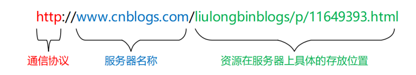

## 一、ajax

### 1.1 URL

URL（全称是UniformResourceLocator）中文叫统一资源定位符，用于标识互联网上每个资源的唯一存放位置。浏览器只有通过URL地址，才能正确定位资源的存放位置，从而成功访问到对应的资源。

**URL地址的组成部分：**

一般由三部分组成：

- 客户端与服务器之间的通信协议
- 存有该资源的服务器名称
- 资源在服务器上的具体的位置



### 1.2 客户端与服务器的通信过程


客户端：

- 打开浏览器
- 输入要访问的网站地址
- 回车，向服务器发起资源请求

服务器：

- 服务器接收到客户端发来的资源请求
- 服务器在内部处理这次请求，找到相关资源
- 服务器把找到的资源，响应（发送）给客户端

注意：

- 客户端与服务器之间的通信过程，分为 `请求---处理---响应` 三个步骤
- 网页中的每一个资源，都是通过 `请求---处理---响应` 的方式从服务器获取回来的


### 1.3 服务器对外提供了哪些资源

数据是网页的灵魂

- HTML 是网页的骨架
- CSS 是网页的颜值
- JavaScript 是网页的行为
- 数据是网页的另外

HTML、CSS、JS 皆为数据服务。


### 1.4 网页中如何请求数据

数据，也是服务器对外提供的一种资源。只要是资源，必然要通过 `请求 -- 处理 -- 响应` 的方式进行获取

如果在网页中请求服务器删搞的资源数据，需求用到 `XMLHTTPRequest` 对象

XMLHttpRequest（简称 xhr）是浏览器提供的 js 成员，通过它，可以请求服务器上的数据资源。

最简单的用法：``var xhrObj = new XMLHttpRequest()``


### 1.5 资源的请求方式

客户端请求服务器时，请求的方式有很多种，最常见的两种请求方式分别为 get 和 post 请求。

- get 请求通常用于获取服务端资源（向服务器要资源）
  - 例如：根据 URL 地址，从服务器获取 HTML 文件、css 文件、js文件、图片文件、数据资源等

- post 请求通常用于向服务器提交数据（往服务器发送资源）
  - 例如：登录时向服务器提交的登录信息、注册时向服务器提交的注册信息、添加用户时向服务器提交的用户信息等各种数据提交操作


### 1.6 了解 Ajax

Ajax 的全称是 Asynchronous Javascript And XML（异步 JavaScript 和 XML）。

通俗的理解：在网页中利用 XMLHttpRequest 对象和服务器进行数据交互的方式，就是Ajax。

浏览器中提供的 XMLHttpRequest 用法比较复杂，所以 `jQuery` 对 `XMLHttpRequest` 进行了封装，提供了一系列 `Ajax` 相关的函数，极大

地降低了 Ajax 的使用难度。

jQuery 中发起 Ajax 请求最常用的三个方法如下：

- `$get()`  
- `$post()`
- `$ajax`

### 1.7 jQuery 中的 Ajax

#### 1.7.1 get

jQuery 中 `$.get()` 函数的功能单一，专门用来发起 `get` 请求，从而将服务器上的资源请求到客户端来进行使用。

$.get() 函数的语法如下：

```jsx
$.get(url, [data], [callback])

// 例如：
$.get('http://www.baidu.com')
$.get('http://www.baidu.com', {name:'lisi'})
$.get('http://www.baidu.com', {name:'lisi'}, function(res){
  	// 回调
  	// res 服务器回调的数据
})
```

- url：要请求的资源地址
- data：Object 类型，非必选，请求资源期间要携带的参数
- callback：function，非必要，请求成功时的回调函数


**$.get() 发起不带参数的请求**

使用 $.get() 函数发起不带参数的请求时，直接提供请求的 URL 地址和请求成功之后的回调函数即可，示例代码如下：

```jsx
$.get('http://www.liulongbin.top:3006/api/getbooks', function(res) {
  	console.log(res); // res 是服务器返回的数据
})
```

示例：

```jsx
<body>
     <button id="btnGet">发起不带参数的 get 请求</button>
     <script src="./lib/jquery.js"></script>

     <script>
          $('#btnGet').click(function() {
               $.get('http://www.liulongbin.top:3006/api/getbooks', function(res) {
                    console.log(res);
               })
          })
     </script>
</body>
```


**$.get() 发起带参数的请求**

使用 $.get() 函数发起不带参数的请求时，直接提供请求的 URL 地址和请求成功之后的回调函数即可，示例代码如下：

```jsx
$.get('http://www.liulongbin.top:3006/api/getbooks', {id: 1}, function(res) {
  	console.log(res); // res 是服务器返回的数据
})
```

示例：

```jsx
<body>
     <button id="btnGet">带有参数的 get 请求</button>
     <script src="./lib/jquery.js"></script>
     <script>
          $('#btnGet').click(function() {
               $.get('http://www.liulongbin.top:3006/api/getbooks', {id:1}, function (res) {
                    console.log(res);
               })
          })
     </script>
</body>
```


#### 1.7.2 post

jQuery 中 `$.post()` 函数的功能单一，专门用来发起 post 请求，从而向服务器提交数据。

`$.post()` 函数的语法如下：

```jsx
$.post(url, [data], [callback])
```

- url：要请求的资源地址
- data：Object 类型，非必选，请求资源期间要携带的参数
- callback：function，非必要，请求成功时的回调函数

示例：

```jsx
$('#btnGet').click(function () {
     $.post('http://www.liulongbin.top:3006/api/getbooks',{bookname: '水浒传', author: '施耐庵', publisher: '上海图书出版社'}, function (res) {
          console.log(res);
     })
})
```


#### 1.7.3 Ajax

相比于 `$.get()` 和 `$.post()` 函数，jQuery 中提供的 `$.ajax()` 函数，是一个功能比较综合的函数，它允许我们对 Ajax 请求进行更详

细的配置。$.ajax() 函数的基本语法如下：

```jsx
$.ajax({
   type: '', // 请求的方式，例如 GET 或 POST
   url: '',  // 请求的 URL 地址
   data: { },// 这次请求要携带的数据
   success: function(res) { } // 请求成功之后的回调函数
})
```


**使用 ajax 发起 get 请求：**

示例：

```js
// GET
$.ajax({
      type: 'GET',
      url: 'http://www.liulongbin.top:3006/api/getbooks',
      data: {id:1},
      success: function (res) {
           console.log(res);
      }
})
// POST
$.ajax({
    type: 'POST',
    url: 'http://www.liulongbin.top:3006/api/addbook',
    data: { 
         bookname: '水浒传',
         author: '施耐庵',
         publisher: '上海图书出版社'},
    success: function(res) {
         console.log(res);
    }
})
```

