## 一、ajax

### 1.1 URL

URL（全称是UniformResourceLocator）中文叫统一资源定位符，用于标识互联网上每个资源的唯一存放位置。浏览器只有通过URL地址，才能正确定位资源的存放位置，从而成功访问到对应的资源。

**URL地址的组成部分：**

一般由三部分组成：

- 客户端与服务器之间的通信协议
- 存有该资源的服务器名称
- 资源在服务器上的具体的位置


### 1.2 客户端与服务器的通信过程


客户端：

- 打开浏览器
- 输入要访问的网站地址
- 回车，向服务器发起资源请求

服务器：

- 服务器接收到客户端发来的资源请求
- 服务器在内部处理这次请求，找到相关资源
- 服务器把找到的资源，响应（发送）给客户端

注意：

- 客户端与服务器之间的通信过程，分为 `请求---处理---响应` 三个步骤
- 网页中的每一个资源，都是通过 `请求---处理---响应` 的方式从服务器获取回来的


### 1.3 服务器对外提供了哪些资源

数据是网页的灵魂

- HTML 是网页的骨架
- CSS 是网页的颜值
- JavaScript 是网页的行为
- 数据是网页的另外

HTML、CSS、JS 皆为数据服务。


### 1.4 网页中如何请求数据

数据，也是服务器对外提供的一种资源。只要是资源，必然要通过 `请求 -- 处理 -- 响应` 的方式进行获取

如果在网页中请求服务器删搞的资源数据，需求用到 `XMLHTTPRequest` 对象

XMLHttpRequest（简称 xhr）是浏览器提供的 js 成员，通过它，可以请求服务器上的数据资源。

最简单的用法：``var xhrObj = new XMLHttpRequest()``


### 1.5 资源的请求方式

客户端请求服务器时，请求的方式有很多种，最常见的两种请求方式分别为 get 和 post 请求。

- get 请求通常用于获取服务端资源（向服务器要资源）
  - 例如：根据 URL 地址，从服务器获取 HTML 文件、css 文件、js文件、图片文件、数据资源等

- post 请求通常用于向服务器提交数据（往服务器发送资源）
  - 例如：登录时向服务器提交的登录信息、注册时向服务器提交的注册信息、添加用户时向服务器提交的用户信息等各种数据提交操作


### 1.6 了解 Ajax

Ajax 的全称是 Asynchronous Javascript And XML（异步 JavaScript 和 XML）。

通俗的理解：在网页中利用 XMLHttpRequest 对象和服务器进行数据交互的方式，就是Ajax。

浏览器中提供的 XMLHttpRequest 用法比较复杂，所以 `jQuery` 对 `XMLHttpRequest` 进行了封装，提供了一系列 `Ajax` 相关的函数，极大

地降低了 Ajax 的使用难度。

jQuery 中发起 Ajax 请求最常用的三个方法如下：

- `$get()`  
- `$post()`
- `$ajax`

### 1.7 jQuery 中的 Ajax

#### 1.7.1 get

jQuery 中 `$.get()` 函数的功能单一，专门用来发起 `get` 请求，从而将服务器上的资源请求到客户端来进行使用。

$.get() 函数的语法如下：

```jsx
$.get(url, [data], [callback])

// 例如：
$.get('http://www.baidu.com')
$.get('http://www.baidu.com', {name:'lisi'})
$.get('http://www.baidu.com', {name:'lisi'}, function(res){
  	// 回调
  	// res 服务器回调的数据
})
```

- url：要请求的资源地址
- data：Object 类型，非必选，请求资源期间要携带的参数
- callback：function，非必要，请求成功时的回调函数


**$.get() 发起不带参数的请求**

使用 $.get() 函数发起不带参数的请求时，直接提供请求的 URL 地址和请求成功之后的回调函数即可，示例代码如下：

```jsx
$.get('http://www.liulongbin.top:3006/api/getbooks', function(res) {
  	console.log(res); // res 是服务器返回的数据
})
```

示例：

```jsx
<body>
     <button id="btnGet">发起不带参数的 get 请求</button>
     <script src="./lib/jquery.js"></script>

     <script>
          $('#btnGet').click(function() {
               $.get('http://www.liulongbin.top:3006/api/getbooks', function(res) {
                    console.log(res);
               })
          })
     </script>
</body>
```


**$.get() 发起带参数的请求**

使用 $.get() 函数发起不带参数的请求时，直接提供请求的 URL 地址和请求成功之后的回调函数即可，示例代码如下：

```jsx
$.get('http://www.liulongbin.top:3006/api/getbooks', {id: 1}, function(res) {
  	console.log(res); // res 是服务器返回的数据
})
```

示例：

```jsx
<body>
     <button id="btnGet">带有参数的 get 请求</button>
     <script src="./lib/jquery.js"></script>
     <script>
          $('#btnGet').click(function() {
               $.get('http://www.liulongbin.top:3006/api/getbooks', {id:1}, function (res) {
                    console.log(res);
               })
          })
     </script>
</body>
```


#### 1.7.2 post

jQuery 中 `$.post()` 函数的功能单一，专门用来发起 post 请求，从而向服务器提交数据。

`$.post()` 函数的语法如下：

```jsx
$.post(url, [data], [callback])
```

- url：要请求的资源地址
- data：Object 类型，非必选，请求资源期间要携带的参数
- callback：function，非必要，请求成功时的回调函数

示例：

```jsx
$('#btnGet').click(function () {
     $.post('http://www.liulongbin.top:3006/api/getbooks',{bookname: '水浒传', author: '施耐庵', publisher: '上海图书出版社'}, function (res) {
          console.log(res);
     })
})
```


#### 1.7.3 Ajax

相比于 `$.get()` 和 `$.post()` 函数，jQuery 中提供的 `$.ajax()` 函数，是一个功能比较综合的函数，它允许我们对 Ajax 请求进行更详

细的配置。$.ajax() 函数的基本语法如下：

```jsx
$.ajax({
   type: '', // 请求的方式，例如 GET 或 POST
   url: '',  // 请求的 URL 地址
   data: { },// 这次请求要携带的数据
   success: function(res) { } // 请求成功之后的回调函数
})
```


**使用 ajax 发起 get 请求：**

示例：

```js
// GET
$.ajax({
      type: 'GET',
      url: 'http://www.liulongbin.top:3006/api/getbooks',
      data: {id:1},
      success: function (res) {
           console.log(res);
      }
})
// POST
$.ajax({
    type: 'POST',
    url: 'http://www.liulongbin.top:3006/api/addbook',
    data: { 
         bookname: '水浒传',
         author: '施耐庵',
         publisher: '上海图书出版社'},
    success: function(res) {
         console.log(res);
    }
})
```


## 二、模板引擎

### 2.1 渲染 UI 结构时遇到的问题

```jsx
var rows = []
$.each(res.data, function (i, item) { // 循环拼接字符串
    rows.push('<li class="list-group-item">'+ item.content +'<span class="badge cmt-date">评论时间：'+ item.time +'</span><span class="badge cmt-person">评论人：'+ item.username +'</span></li>')
})
$('#cmt-list').empty().append(rows.join('')) // 渲染列表的UI结构
```

上述代码是通过字符串拼接的形式，来渲染UI结构。

如果UI结构比较复杂，则拼接字符串的时候需要格外注意引号之前的嵌套。且一旦需求发生变化，修改起来也非常麻烦。


### 2.2 什么是模板引擎

模板引擎，顾名思义，它可以根据程序员指定的模板结构和数据，自动生成一个完整的HTML页面。


模板引擎的好处：

- 减少了字符串的拼接操作
- 使代码结构更清晰
- 使代码更易于阅读和维护


### 2.3 art-template 模板引擎

`art-template` 是一个简约、超快的模板引擎。中文官网首页为 http://aui.github.io/art-template/zh-cn/index.html


**art-template 的安装：**

在浏览器中访问 http://aui.github.io/art-template/zh-cn/docs/installation.html 页面，找到下载链接后，鼠标右键，选择“链接另

存为”，将 `art-template` 下载到本地，然后，通过 `<script>` 标签加载到网页上进行使用。


#### 2.3.1  art-template 模板引擎的基本使用

使用步骤：

- 导入 `art-templa`
- 定义数据
- 定义模板
- 调用 `template` 函数
- 渲染 `HTML` 结构

示例：

```jsx
<body>
     
     <div class="container"></div>
     <!-- 1. 引入模板隐藏 -->
     <script src="./lib/template-web.js"></script>
     <script src="./lib/jquery.js"></script>

     <!-- 3. 定义模板 -->
     <!-- 3.1 模板的 HTML 结构,必须定义在 script 中 -->
     <script type="text/html" id="tpl_user">
          <!-- {{}}: 占位符,填充数据 -->
          <h1>{{name}}</h1>
     </script>
     <script>
          // 2. 定义需要渲染的数据
          let data = {name: 'zs'}

          // 4. 调用 template 函数
          // 返回值: <h1>zs</h1>
          let htmlStr = template('tpl_user', data)

          //  5. 渲染: 渲染后 htmlStr 就会插入到响应元素中
          $('.container').html(htmlStr)
     </script>
</body>
```


#### 2.3.2  art-template 的标准语法

`art-template` 提供了 `{{ }}` 这种语法格式，在 ` {{ }}`  内可以进行变量输出，或循环数组等操作，这种  `{{ }}` 语法在 `art-template` 中被称为 `标准语法`。

**标准语法：输出**

```jsx
{{value}} 			// 直接输出 value 值
{{obj.key}}   	// 输出对象 key 对应的值
{{obj['key']}} 	// 输出对象的某个属性
{{a ? b : c}}  	// 通过三目运算符判断输出哪个值
{{a || b}}  		// 通过逻辑运算，判断是否输出
{{a + b}}       // 通过加减乘除运算，输出
```

在 `{{ }}` 语法中，可以进行变量的输出、对象属性的输出、三元表达式输出、逻辑或输出、加减乘除等表达式输出。


**标准语法：原文输出**

```jsx
{{@ value}}
```

如果要输出的 `value` 值中，包含了 `HTML` 标签结构，则需要使用原文输出语法，才能保证 `HTML` 标签被正常渲染。 

示例：

```jsx
<body>
     
     <div class="container"></div>
     <!-- 1. 引入模板隐藏 -->
     <script src="./lib/template-web.js"></script>
     <script src="./lib/jquery.js"></script>

     <!-- 3. 定义模板 -->
     <!-- 3.1 模板的 HTML 结构,必须定义在 script 中 -->
     <script type="text/html" id="tpl_user">
          <!-- {{}}: 占位符,填充数据 -->
          <h1>{{name}}</h1>
          <!-- 原文输出,如果含有标签,会显示标签的样式,并把内容设置到样式中 -->
          {{@ test}}
     </script>
     <script>
          // 2. 定义需要渲染的数据
          let data = {
               name: 'zs',
               age: 20,
               test: `<h3>测试原文输出</h3>`,
          }
          // 4. 调用 template 函数
          // 返回值: <h1>zs</h1>
          let htmlStr = template('tpl_user', data)

          //  5. 渲染: 渲染后 htmlStr 就会插入到响应元素中
          $('.container').html(htmlStr)
     </script>
</body>
```


**标准语法：条件输出**

如果要实现条件输出，则可以在 `{{ }}` 中使用 `if … else if … /if` 的方式，进行按需输出。

```jsx
{{if value}} 按需输出的内容 {{/if}}

{{if v1}} 按需输出的内容 {{else if v2}} 按需输出的内容 {{/if}}
```

示例：

```jsx
<script type="text/html" id="tpl_user">
    ....
    <!-- 标准语法：条件输出 -->
    <div>
         <!-- 如果 flag 对应的值成立,就打印''' -->
         {{if flag === 0}}
         我是大帅哥
         {{else if flag === 1}}
         梦里能暴富吗
         <!-- 结束 -->
         {{/if}}
    </div>
</script>
<script>
    // 2. 定义需要渲染的数据
    let data = {
         .....
         flag: 1,
    }
    // 4. 调用 template 函数
    // 返回值: <h1>zs</h1>
    let htmlStr = template('tpl_user', data)
    //  5. 渲染: 渲染后 htmlStr 就会插入到响应元素中
    $('.container').html(htmlStr)
</script>
```


**标准语法：循环输出**

如果要实现循环输出，则可以在 `{{ }}` 内，通过 `each` 语法循环数组，当前循环的索引使用 `$index` 进行访问，当前的循环项使用 `$value` 进行访问。

```jsx
{{each arr}}
    {{$index}} {{$value}}
{{/each}}
```

示例：

```jsx
<!-- 3. 定义模板 -->
<!-- 3.1 模板的 HTML 结构,必须定义在 script 中 -->
<script type="text/html" id="tpl_user">
    ....
    <ul>
         <!-- 循环开始 -->
         {{each hobby}}
         <li>索引是{{$index}}, 循环项: {{$value}}</li>
         <!-- 循环结束 -->
         {{/each}}
    </ul>
</script>
<script>
    // 2. 定义需要渲染的数据
    let data = {
         ....
         hobby: ['吃饭','睡觉','打豆豆'],
    }

    // 4. 调用 template 函数
    // 返回值: <h1>zs</h1>
    let htmlStr = template('tpl_user', data)

    //  5. 渲染: 渲染后 htmlStr 就会插入到响应元素中
    $('.container').html(htmlStr)
</script>
```


**标准语法：过滤器**


过滤器的本质，就是一个 `function` 处理函数。

```jsx
// 把 value 传给 filterName 函数，函数的返回值就是渲染的值
{{value | filterName}}
```

过滤器语法类似管道操作符，它的上一个输出作为下一个输入。

定义过滤器的基本语法如下：

```jsx
// filterName 相当于后面的函数，这个名字可以随意修改
template.defaults.imports.filterName = function(value){/*return处理的结果*/}
```

```jsx
// dateFormat 相当于：template.defaults.imports.dateFormat = function(value){/*return处理的结果*/}
<div>注册时间：{{regTime | dateFormat}}</div>
```

定义一个格式化时间的过滤器 dateFormat 如下：

```jsx
 template.defaults.imports.dateFormat = function(date) {
    var y = date.getFullYear()
    var m = date.getMonth() + 1
    var d = date.getDate()

    return y + '-' + m + '-' + d // 注意，过滤器最后一定要 return 一个值
 }
```

示例：

```jsx
<script type="text/html" id="tpl_user">
    .....
    <!-- 过滤器 -->
    <h3>{{regTime | dateFormat}}</h3>
</script>
<script>
    // 定义过滤器
    template.defaults.imports.dateFormat = function(date) {
         let y = date.getFullYear()
         let m = date.getMonth() + 1
         let d = date.getDate()

         return y + '-' + m + '-' + d
    }
    // 2. 定义需要渲染的数据
    let data = {
         ....
         regTime: new Date(),
    }

    // 4. 调用 template 函数
    // 返回值: <h1>zs</h1>
    let htmlStr = template('tpl_user', data)

    //  5. 渲染: 渲染后 htmlStr 就会插入到响应元素中
    $('.container').html(htmlStr)
</script>
```


### 2.4 模板引擎的实现原理

#### 2.4.1 正则与字符串操作

**基本语法：**

`exec()` 函数用于检索字符串中的正则表达式的匹配。

如果字符串中有匹配的值，则返回该匹配值，否则返回 null

```jsx
regObj.exec(string)
```

示例：

```jsx
let str = 'hello'
let reg = /o/
// 输出的结果["o", index: 4, input: "hello", groups: undefined]
console.log(reg.exec(str))
```


**分组：**

正则表达式中规定 `()`  包起来的内容表示一个分组，可以通过分组来提取自己想要的内容。

示例：

```jsx
 let str = '<div>我是{{name}}</div>'
 let pattern = /{{([a-zA-Z]+)}}/

 let patternResult = pattern.exec(str)
 console.log(patternResult)
 // 得到 name 相关的分组信息
 // ["{{name}}", "name", index: 7, input: "<div>我是{{name}}</div>", groups: undefined]

```


**字符串的 replace 函数：**

`replace()` 函数用于在字符串中用一些字符替换另一些字符，语法格式如下：

```jsx
// 得到的 result 的值为字符串 'abc456'
let result = '123456'.replace('123', 'abc') 
```

示例：

```jsx
let str = '<div>我是{{name}}</div>'
let pattern = /{{([a-zA-Z]+)}}/

let patternResult = pattern.exec(str)
// replace 函数返回值为替换后的新字符串
str = str.replace(patternResult[0], patternResult[1]) 
// 输出的内容是：<div>我是name</div>
console.log(str)
```

**多次 replace**

```jsx
let str = '<div>{{name}}今年{{ age }}岁了</div>'
let pattern = /{{\s*([a-zA-Z]+)\s*}}/

let patternResult = pattern.exec(str)
str = str.replace(patternResult[0], patternResult[1])
console.log(str) // 输出 <div>name今年{{ age }}岁了</div>

patternResult = pattern.exec(str)
str = str.replace(patternResult[0], patternResult[1])
console.log(str) // 输出 <div>name今年age岁了</div>

patternResult = pattern.exec(str)
console.log(patternResult) // 输出 null
```

**使用 while 循环 replace**

```jsx
let str = '<div>{{name}}今年{{ age }}岁了</div>'
let pattern = /{{\s*([a-zA-Z]+)\s*}}/

let patternResult = null
while(patternResult = pattern.exec(str)) {
   str = str.replace(patternResult[0], patternResult[1])
}
console.log(str) // 输出 <div>name今年age岁了</div>
```

**replace 替换为真值**

```jsx
let data = { name: '张三', age: 20 }
let str = '<div>{{name}}今年{{ age }}岁了</div>'
let pattern = /{{\s*([a-zA-Z]+)\s*}}/

var patternResult = null
while ((patternResult = pattern.exec(str))) {
   str = str.replace(patternResult[0], data[patternResult[1]])
}
console.log(str)
```


## 三、Ajax 加强

### 3.1 XMLHttpRequest 的基本使用

XMLHttpRequest（简称 xhr）是浏览器提供的 Javascript 对象，通过它，可以请求服务器上的数据资源。之前所学的 jQuery 中的 Ajax

函数，就是基于 xhr 对象封装出来的。

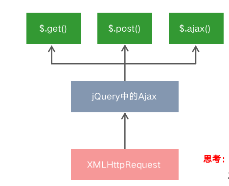


#### 3.1.1 使用 xhr 发起 GET 请求

步骤：

- 创建 `xhr` 对象
- 调用 `xhr.open()` 函数
- 调用 `xhr.send()` 函数
- 监听 `xhr.onreadystatechange` 事件

示例：

```js
<script>
    // 1. 创建 XHR 对象
    let xhr = new XMLHttpRequest() 
    // 2. 调用 open 函数,指定请求方式和 URL 地址
    xhr.open('GET', 'http://www.liulongbin.top:3006/api/getbooks')
    // 3. 调用 send 函数,发起 ajax 请求
    xhr.send()
    // 4. 监听 onreadystatechange 事件
    xhr.onreadystatechange = function (){
         // 4.1 监听 XHR 对象的请求状态 readyStatus 和服务器的响应的状态 status
         if (xhr.readyState === 4 && xhr.status === 200) {
              // 4.2 打印服务器响应的数据
              console.log(xhr.responseText);
         }
    }
</script>
```


#### 3.1.2 了解 xhr 对象的 readyStatus 属性

`XMLHttpRequest` 对象的 `readyState` 属性，用来表示当前 `Ajax` 请求所处的状态。每个 `Ajax` 请求必然处于以下状态中的一个：

| **值** |     **状态**     |                      **描述**                       |
| :----: | :--------------: | :-------------------------------------------------: |
|   0    |      UNSENT      | XMLHttpRequest 对象已被创建，但尚未调用 open方法。  |
|   1    |      OPENED      |               open() 方法已经被调用。               |
|   2    | HEADERS_RECEIVED |     send() 方法已经被调用，响应头也已经被接收。     |
|   3    |     LOADING      | 数据接收中，此时 response 属性中已经包含部分数据。  |
|   4    |       DONE       | Ajax 请求完成，这意味着数据传输已经彻底完成或失败。 |


#### 3.1.3 使用 xhr 发起带参数的 GET 请求

用 `xhr` 对象发起带参数的 `GET` 请求时，只需在调用 `xhr.open` 期间，为 `URL` 地址指定参数即可：

```jsx
// 1. 创建 XHR 对象
let xhr = new XMLHttpRequest() 
// 2. 调用 open 函数,指定请求方式和 URL 地址
xhr.open('GET', 'http://www.liulongbin.top:3006/api/getbooks?id=1')
```

这种在 URL 地址后面拼接的参数，叫做 `查询字符串`。


#### 3.1.4 查询字符串

定义：查询字符串（URL 参数）是指在 URL 的末尾加上用于向服务器发送信息的字符串（变量）。

格式：将英文的 ? 放在URL 的末尾，然后再加上 参数＝值 ，想加上多个参数的话，使用 & 符号进行分隔。以这个形式，可以将想要发送

给服务器的数据添加到 URL 中。

```jsx
// 不带参数的 URL 地址
http://www.liulongbin.top:3006/api/getbooks
// 带一个参数的 URL 地址
http://www.liulongbin.top:3006/api/getbooks?id=1
// 带两个参数的 URL 地址
http://www.liulongbin.top:3006/api/getbooks?id=1&bookname=西游记
```


**GET 请求携带参数的本质**

无论使用 `$.ajax()`，还是使用 `$.get()`，又或者直接使用 `xhr` 对象发起 `GET` 请求，当需要携带参数的时候，本质上，都是直接将参数以查询字符串的形式，追加到 URL 地址的后面，发送到服务器的。

```jsx
$.get('url', {name: 'zs', age: 20}, function() {})
// 等价于
$.get('url?name=zs&age=20', function() {})

$.ajax({ method: 'GET', url: 'url', data: {name: 'zs', age: 20}, success: function() {} })
// 等价于
$.ajax({ method: 'GET', url: 'url?name=zs&age=20', success: function() {} })
```


#### 3.1.5 URL 编码与解码

**什么是 URL 编码：**

URL 地址中，只允许出现英文相关的字母、标点符号、数字，因此，在 URL 地址中不允许出现中文字符。

如果 URL 中需要包含中文这样的字符，则必须对中文字符进行编码（转义）。

URL编码的原则：使用安全的字符（没有特殊用途或者特殊意义的可打印字符）去表示那些不安全的字符。

URL编码原则的通俗理解：使用英文字符去表示非英文字符。

```jsx
http://www.liulongbin.top:3006/api/getbooks?id=1&bookname=西游记
// 经过 URL 编码之后，URL地址变成了如下格式：
http://www.liulongbin.top:3006/api/getbooks?id=1&bookname=%E8%A5%BF%E6%B8%B8%E8%AE%B0
```


**如何对 URL 进行编码和解码**

浏览器提供了 URL 编码与解码的 API，分别是：

- `encodeURI()`  编码的函数
- `decodeURI()`  解码的函数

```jsx
encodeURI('黑马程序员')
// 输出字符串  %E9%BB%91%E9%A9%AC%E7%A8%8B%E5%BA%8F%E5%91%98
decodeURI('%E9%BB%91%E9%A9%AC')
// 输出字符串  黑马
```


**URL编码的注意事项**

由于浏览器会自动对 URL 地址进行编码操作，因此，大多数情况下，程序员不需要关心 URL 地址的编码与解码操作。

更多关于 URL 编码的知识，请参考如下博客：

https://blog.csdn.net/Lxd_0111/article/details/78028889


#### 3.1.6 使用 xhr 发起 POST 请求

步骤：

- 创建 `xhr` 对象
- 调用 `xhr.open()` 函数
- 设置 `Content-Type` 属性，固定写法
- 调用 `xhr.send()` 函数，同事指定要发送的数据
- 监听 `xhr.onreadystatechange` 事件

```jsx
// 1. 创建 XHR 对象
let xhr = new XMLHttpRequest() 
// 2. 调用 open 函数,指定请求方式和 URL 地址
xhr.open('POST', 'http://www.liulongbin.top:3006/api/getbooks')
// 3. 设置 Content-Type 属性
xhr.setRequestHeader('Content-Type', 'application/x-www-form-urlencoded')
// 4. 调用 send 函数, 同时将数据以查询字符串的形式,提交给服务器, 发起 ajax 请求
xhr.send('bookname=水浒传&author=施耐庵')
// 5. 监听 onreadystatechange 事件
xhr.onreadystatechange = function (){
     // 5.1 监听 XHR 对象的请求状态 readyStatus 和服务器的响应的状态 status
     if (xhr.readyState === 4 && xhr.status === 200) {
          // 5.2 打印服务器响应的数据
          console.log(xhr.responseText);
     }
}
```


## 四、数据交换格式

数据交换格式，就是服务器端与客户端之间进行数据传输与交换的格式。

前端领域，经常提及的两种数据交换格式分别是 XML 和 JSON。其中 XML 用的非常少，所以，我们重点要学习的数据交换格式就是 

JSON。


### 4.1 XML

**什么是 XML**

XML 的英文全称是 EXtensible Markup Language，即可扩展标记语言。因此，XML 和 HTML 类似，也是一种标记语言。

HTML:

```JSX
<!DOCTYPE html>
<html>
  <head>
    <title>Document</title>
  </head>
  <body></body>
</html>
```

XML:

```JSX
<note>
  <to>ls</to>
  <from>zs</from>
  <heading>通知</heading>
  <body>晚上开会</body>
</note>
```


**XML 与 HTML 的区别**

XML 和 HTML 虽然都是标记语言，但是，它们两者之间没有任何的关系。

- HTML 被设计用来描述网页上的内容，是网页内容的载体
- XML 被设计用来传输和存储数据，是数据的载体


**XML 的缺点：**

- XML 格式臃肿，和数据无关的代码多，体积大，传输效率低
- 在 Javascript 中解析 XML 比较麻烦


### 4.2 JSON

**什么是JSON**

概念：JSON 的英文全称是 JavaScript Object Notation，即“JavaScript 对象表示法”。简单来讲，JSON 就是 Javascript 对象和数组的字符

串表示法，它使用文本表示一个 JS 对象或数组的信息，因此，JSON 的本质是字符串。

作用：JSON 是一种轻量级的文本数据交换格式，在作用上类似于 XML，专门用于存储和传输数据，但是 JSON 比 XML 更小、更快、更

易解析。

现状：JSON 是在 2001 年开始被推广和使用的数据格式，到现今为止，JSON 已经成为了主流的数据交换格式。


**JSON 的两种结构：**

JSON 就是用字符串来表示 Javascript 的对象和数组。所以，JSON 中包含对象和数组两种结构，通过这两种结构的相互嵌套，可以表示各

种复杂的数据结构。

对象结构：

对象结构在 JSON 中表示为 { } 括起来的内容。数据结构为 { key: value, key: value, … } 的键值对结构。其中，key 必须是使用

英文的双引号包裹的字符串，value 的数据类型可以是数字、字符串、布尔值、null、数组、对象6种类型。

```jsx
{
    name: "zs",
    'age': 20,
    "gender": '男',
    "address": undefined,
    "hobby": ["吃饭", "睡觉", '打豆豆']
    say: function() {}
}
```


数组结构：

数组结构在 JSON 中表示为 [ ] 括起来的内容。数据结构为 [ "java", "javascript", 30, true … ] 。数组中数据的类型可以是数字、字符串、

布尔值、null、数组、对象6种类型。

```jsx
[ "java", "python", "php" ]
[ 100, 200, 300.5 ]
[ true, false, null ]
[ { "name": "zs", "age": 20}, { "name": "ls", "age": 30} ]
[ [ "苹果", "榴莲", "椰子" ], [ 4, 50, 5 ] ]
```


**JSON 的注意事项：**

- 属性名必须使用双引号包裹
- 字符串类型的值必须使用双引号包裹
- JSON 中不允许使用单引号表示字符串
- JSON 中不能写注释
- JSON 的最外层必须是对象或数组格式
- 不能使用 undefined 或函数作为 JSON 的值
- JSON 的作用：在计算机与网络之间存储和传输数据。
- JSON 的本质：用字符串来表示 Javascript 对象数据或数组数据


#### 4.2.1 JSON 与 JS 对象的关系

JSON 是 JS 对象的字符串表示法，它使用文本表示一个 js 对象的信息，本质是一个字符串。

例如：

```jsx
//这是一个对象
var obj = {a: 'Hello', b: 'World'}

//这是一个 JSON 字符串，本质是一个字符串
var json = '{"a": "Hello", "b": "World"}' 
```


#### 4.2.2 JSON 与 JS 对象的互转

要实现从 `JSON` 字符串转换为 `JS` 对象，使用 `JSON.parse()` 方法：

```jsx
var obj = JSON.parse('{"a": "Hello", "b": "World"}')
//结果是 {a: 'Hello', b: 'World'}
```

要实现从 `JS` 对象转换为 `JSON` 字符串，使用 `JSON.stringify()` 方法：

```jsx
var json = JSON.stringify({a: 'Hello', b: 'World'})
//结果是 '{"a": "Hello", "b": "World"}'
```


#### 4.2.3 序列号与反序列化

把 `数据对象` 转换为 `字符串` 的过程，叫做 `序列化`，例如：调用 `JSON.stringify()` 函数的操作，叫做 `JSON` 序列化。

把 `字符串` 转换为 `数据对象` 的过程，叫做 `反序列化` ，例如：调用 `JSON.parse()`  函数的操作，叫做  `JSON` 反序列化。


## 五、封装自己的 Ajax 函数

要实现的效果

```jsx
<!-- 1. 导入自定义的ajax函数库 -->
<script src="./itheima.js"></script>

<script>
    // 2. 调用自定义的 itheima 函数，发起 Ajax 数据请求
    itheima({
        method: '请求类型',
        url: '请求地址',
        data: { /* 请求参数对象 */ },
        success: function(res) { // 成功的回调函数
            console.log(res)     // 打印数据
        }
    })
</script>
```


### 5.1 定义 options 参数选项

`itheima()` 函数是要自定义的 `Ajax` 函数，它接收一个配置对象作为参数，配置对象中可以配置如下属性：

- `method`：请求的类型
- `url`：         请求的 URL 地址
- `data`：      请求携带的数据
- `success`：请求成功之后的回调函数


### 5.2 处理 data 数据

需要把 `data` 对象，转化成 `查询字符串` 的格式，从而提交给服务器，因此提前定义 `resolveData` 函数如下：

```jsx
/**
 * 处理 data 参数
 * @param {data} 需要发送到服务器的数据
 * @returns {string} 返回拼接好的查询字符串 name=zs&age=10
 */
function resolveData(data) {
  let arr = []
  for (let k in data) {
    arr.push(k + '=' + data[k])
  }
  return arr.join('&')
}
```


### 5.3 定义 itheima 函数

在 `itheima` 函数中，需要创建 xhr 对象，并监听 onreadystatechange 事件：

```jsx
function itheima(options) {
  let xhr = new XMLHttpRequest()
  // 拼接查询字符串
  let qs = resolveData(options.data)

  // 监听请求状态改变的事件
  xhr.onreadystatechange = function() {
    if (xhr.readyState === 4 && xhr.status === 200) {
      let result = JSON.parse(xhr.responseText)
      options.success(result)
    }
  }
}
```


### 5.4 判断请求的类型

不同的请求类型，对应 xhr 对象的不同操作，因此需要对请求类型进行 `if....else...` 的判断

```jsx
if (options.method.toUpperCase() === 'GET') {
  // 发起 GET 请求
  xhr.open(options.method, options.url + '?' + qs)
  xhr.send()
} else if (options.method.toUpperCase() === 'POST') {
  // 发起 POST 请求
  xhr.open(options.method, options.url)
  xhr.setRequestHeader('Content-Type', 'application/x-www-form-urlencoded')
  xhr.send(qs)
}

```


### 5.5 完整的函数如下：

```js
<script>
    function itheima(options) {
         let xhr = new XMLHttpRequest()
         let paramter = resolveData(options.data)
         let method = options.method.toUpperCase()
         if (method === 'GET') {
              // 发起 GET 请求
              xhr.open(method, options.url + '?' + paramter)
              xhr.send()
         } else if (method === 'POST') {
              // 发起 POST 请求
              xhr.open(method, options.url)
              xhr.setRequestHeader('Content-Type', 'application/x-www-form-urlencoded')
              xhr.send(paramter)
         }
         // 监听请求状态改变的事件
         xhr.onreadystatechange = function() {
              if (xhr.readyState === 4 && xhr.status === 200) {
                  let result = JSON.parse(xhr.responseText)
                  options.success(result)
               }
            }
    }

    function resolveData(data) {
         let arr = []
         for (let k in data) {
             arr.push(k + '=' + data[k])
         }
         return arr.join('&')
    }
</script>
```


## 六、XMLHTTPRequest Level 2 新特性

- 可以设置 `HTTP` 请求的时限
- 可以使用 `FormData` 对象管理表单数据
- 可以上传文件
- 可以获取数据传输的进度信息


### 6.1设置 HTTP 请求的时限

有时，`Ajax` 操作很耗时，而且无法预知要花多少时间。如果网速很慢，用户可能要等很久。新版本的 `XMLHttpRequest` 对象，增加了 

`timeout` 属性，可以设置 `HTTP` 请求的时限：

```jsx
xhr.timeout = 3000
```

上面的语句，将最长等待时间设为 3000 毫秒。过了这个时限，就自动停止`HTTP` 请求。与之配套的还有一个 `timeout`  事件，用来指定回

调函数：

```jsx
xhr.ontimeout = function(event){
     alert('请求超时！')
}
```


### 6.2 FormData 对象管理表单数据

`Ajax` 操作往往用来提交表单数据。为了方便表单处理，`HTML5` 新增了一个 `FormData` 对象，可以模拟表单操作：

```jsx
// 1. 新建 FormData 对象
let fd = new FormData()
// 2. 为 FormData 添加表单项
fd.append('uname', 'zs')
fd.append('upwd', '123456')
// 3. 创建 XHR 对象
let xhr = new XMLHttpRequest()
// 4. 指定请求类型与URL地址
xhr.open('POST', 'http://www.liulongbin.top:3006/api/formdata')
// 5. 直接提交 FormData 对象，这与提交网页表单的效果，完全一样
xhr.send(fd)
```

`FormData` 对象也可以用来获取网页表单的值，示例代码如下：

```jsx
// 获取表单元素
let form = document.querySelector('#form1')
// 监听表单元素的 submit 事件
form.addEventListener('submit', function(e) {
  e.preventDefault()
   // 根据 form 表单创建 FormData 对象，会自动将表单数据填充到 FormData 对象中
   let fd = new FormData(form)
   let xhr = new XMLHttpRequest()
   xhr.open('POST', 'http://www.liulongbin.top:3006/api/formdata')
   xhr.send(fd)
   xhr.onreadystatechange = function() {}
})
```


### 6.3 上传文件

新版 `XMLHttpRequest` 对象，不仅可以发送文本信息，还可以上传文件。

实现步骤：

- 定义 `UI` 结构
- 验证是否选择了文件
- 向 `FormData` 中追加文件
- 使用 `xhr` 发起上传文件的请求
- 监听 `onreadystatechange` 事件


**定义 UI 结构**

```jsx
<!-- 1. 文件选择框 -->
<input type="file" id="file1" />
<!-- 2. 上传按钮 -->
<button id="btnUpload">上传文件</button>
<br />
<!-- 3. 显示上传到服务器上的图片 -->

```


**验证是否选择了文件**

```jsx
// 1. 获取上传文件的按钮
let btnUpload = document.querySelector('#btnUpload')
// 2. 为按钮添加 click 事件监听
btnUpload.addEventListener('click', function() {
   // 3. 获取到选择的文件列表
   let files = document.querySelector('#file1').files
   if (files.length <= 0) {
       return alert('请选择要上传的文件！')
   }
   // ...后续业务逻辑
})
```


**向 FormData 追加文件**

```jsx
// 1. 创建 FormData 对象
let fd = new FormData()
// 2. 向 FormData 中追加文件
fd.append('avatar', files[0])
```


**使用 xhr 发起上传文件的请求**

```jsx
// 1. 创建 xhr 对象
let xhr = new XMLHttpRequest()
// 2. 调用 open 函数，指定请求类型与URL地址。其中，请求类型必须为 POST
xhr.open('POST', 'http://www.liulongbin.top:3006/api/upload/avatar')
// 3. 发起请求
xhr.send(fd)
```


 **监听 onreadystatechange 事件**

```jsx
   
xhr.onreadystatechange = function() {
  if (xhr.readyState === 4 && xhr.status === 200) {
    var data = JSON.parse(xhr.responseText)
    if (data.status === 200) { // 上传文件成功
      // 将服务器返回的图片地址，设置为  标签的 src 属性
      document.querySelector('#img').src = 'http://www.liulongbin.top:3006' + data.url
    } else { // 上传文件失败
      console.log(data.message)
    }
  }
}
```


**显示文件上传进度**

新版本的 `XMLHttpRequest` 对象中，可以通过监听 `xhr.upload.onprogress` 事件，来获取到文件的上传进度。

```jsx
// 需要导入的库
<link rel="stylesheet" href="./lib/bootstrap.css" />
<script src="./lib/jquery.js"></script>

// 基于Bootstrap渲染进度条
   
<!-- 进度条 -->
<div class="progress" style="width: 500px; margin: 10px 0;">
  <div class="progress-bar progress-bar-info progress-bar-striped active" id="percent" style="width: 0%">
    0%
  </div>
</div>
```

语法格式如下：

```jsx
// 创建 XHR 对象
let xhr = new XMLHttpRequest()
// 监听 xhr.upload 的 onprogress 事件
xhr.upload.onprogress = function(e) {
  // e.lengthComputable 是一个布尔值，表示当前上传的资源是否具有可计算的长度
  if (e.lengthComputable) {
      // e.loaded 已传输的字节
      // e.total  需传输的总字节
      let percentComplete = Math.ceil((e.loaded / e.total) * 100)
      $('#percent')
        // 2. 设置进度条的宽度
        .attr('style', 'width:' + percentComplete + '%')
        // 3. 显示当前的上传进度百分比
        .html(percentComplete + '%')
    }
  }
}

// 监听上传完成的事件
xhr.upload.onload = function() {
   $('#percent')
       // 移除上传中的类样式
       .removeClass()
       // 添加上传完成的类样式
       .addClass('progress-bar progress-bar-success')
}
```


## 七、jQuery 的高级用法

### 7.1 jQuery 实现文件上传

**定义 UI 结构**

```jsx
<!-- 导入 jQuery -->
<script src="./lib/jquery.js"></script>

<!-- 文件选择框 -->
<input type="file" id="file1" />
<!-- 上传文件按钮 -->
<button id="btnUpload">上传</button>
```


**验证是否选择了文件**

```jsx
$('#btnUpload').on('click', function() {
   // 1. 将 jQuery 对象转化为 DOM 对象，并获取选中的文件列表
   let files = $('#file1')[0].files
   // 2. 判断是否选择了文件
   if (files.length <= 0) {
       return alert('请选择图片后再上传！‘)
   }
})
```


**向 FormData 中追加文件**

```jsx
 // 向 FormData 中追加文件
 var fd = new FormData()
 fd.append('avatar', files[0])
```


**使用jQuery发起上传文件的请求**

```jsx
$.ajax({
   method: 'POST',
   url: 'http://www.liulongbin.top:3006/api/upload/avatar',
   data: fd,
   // 不修改 Content-Type 属性，使用 FormData 默认的 Content-Type 值
   contentType: false,
   // 不对 FormData 中的数据进行 url 编码，而是将 FormData 数据原样发送到服务器
   processData: false,
   success: function(res) {
       console.log(res)
   }
})
```


### 7.2 使用 jQuery 实现 loading 效果

**ajaxStart(callback)**

Ajax 请求开始时，执行 ajaxStart 函数。可以在 ajaxStart 的 callback 中显示 loading 效果，示例代码如下：

```jsx
 // 自 jQuery 版本 1.8 起，该方法只能被附加到文档
 $(document).ajaxStart(function() {
     $('#loading').show()
 })
```

注意： `$(document).ajaxStart()` 函数会监听当前文档内所有的 Ajax 请求。


**ajaxStop(callback)**

Ajax 请求结束时，执行 ajaxStop 函数。可以在 ajaxStop 的 callback 中隐藏 loading 效果，示例代码如下：

```jsx
   
 // 自 jQuery 版本 1.8 起，该方法只能被附加到文档
 $(document).ajaxStop(function() {
     $('#loading').hide()
 })
```


## 八、axios

`Axios` 是专注于网络数据请求的库。

相比于原生的 `XMLHttpRequest` 对象，`axios` 简单易用。

相比于 `jQuery`，``axios` 更加轻量化，只专注于网络数据请求。

### 8.1 axios 发起 GET 请求

`axios` 发起 `get` 请求的语法：

```jsx
 axios.get('url', { params: { /*参数*/ } }).then(callback)
```

具体的请求示例如下：

```jsx
 // 请求的 URL 地址
 let url = 'http://www.liulongbin.top:3006/api/get'
 // 请求的参数对象
 let paramsObj = { name: 'zs', age: 20 }
 // 调用 axios.get() 发起 GET 请求
 axios.get(url, { params: paramsObj }).then(function(res) {
     // res.data 是服务器返回的数据
     var result = res.data
     console.log(res)
 })
```


### 8.2 axios 发起 POST 请求

`axios` 发起 `post` 请求的语法：

```jsx
 axios.post('url', { /*参数*/ }).then(callback)
```

具体的请求示例如下：

```jsx
 // 请求的 URL 地址
 var url = 'http://www.liulongbin.top:3006/api/post'
 // 要提交到服务器的数据
 var dataObj = { location: '北京', address: '顺义' }
 // 调用 axios.post() 发起 POST 请求
 axios.post(url, dataObj).then(function(res) {
     // res.data 是服务器返回的数据
     var result = res.data
     console.log(result)
 })
```


### 8.3 直接使用 axios 发起请求

`axios` 也提供了类似于 jQuery 中 `$.ajax()` 函数，语法如下：

```jsx
 axios({
     method: '请求类型',
     url: '请求的URL地址',
     data: { /* POST数据 */ },
     params: { /* GET参数 */ }
 }) .then(callback)
```


**GET**

```jsx
axios({
   method: 'GET',
   url: 'http://www.liulongbin.top:3006/api/get',
   params: { // GET 参数要通过 params 属性提供
       name: 'zs',
       age: 20
   }
}).then(function(res) {
   console.log(res.data)
})
```


**POST**

```JSX
axios({
   method: 'POST',
   url: 'http://www.liulongbin.top:3006/api/post',
   data: { // POST 数据要通过 data 属性提供
       bookname: '程序员的自我修养',
       price: 666
   }
}).then(function(res) {
   console.log(res.data)
})
```


## 九、跨域

### 9.1 同源策略

#### 9.1.1 什么是同源

如果两个页面的协议，域名和端口都相同，则两个页面具有相同的源。

例如，下表给出了相对于 http://www.test.com/index.html 页面的同源检测：

| **URL**                            | **是否同源** | **原因**                                  |
| ---------------------------------- | ------------ | ----------------------------------------- |
| http://www.test.com/other.html     | 是           | 同源（协议、域名、端口相同）              |
| https://www.test.com/about.html    | 否           | 协议不同（http 与 https）                 |
| http://blog.test.com/movie.html    | 否           | 域名不同（www.test.com 与 blog.test.com） |
| http://www.test.com:7001/home.html | 否           | 端口不同（默认的 80 端口与 7001 端口）    |
| http://www.test.com:80/main.html   | 是           | 同源（协议、域名、端口相同）              |


#### 9.1.2 什么是同源策略

同源策略（英文全称 Same origin policy）是浏览器提供的一个安全功能。

MDN 官方给定的概念：同源策略限制了从同一个源加载的文档或脚本如何与来自另一个源的资源进行交互。这是一个用于隔离潜在恶意

文件的重要安全机制。

通俗的理解：浏览器规定，A 网站的 JavaScript，不允许和非同源的网站 C 之间，进行资源的交互，例如：

- 无法读取非同源网页的 Cookie、LocalStorage 和 IndexedDB
- 无法接触非同源网页的 DOM
- 无法向非同源地址发送 Ajax 请求


### 9.2 跨域

#### 9.2.1 什么是跨域 

同源指的是两个 URL 的协议、域名、端口一致，反之，则是跨域。

出现跨域的根本原因：浏览器的同源策略不允许非同源的 URL 之间进行资源的交互。

网页：http://www.test.com/index.html

接口：http://www.api.com/userlist


#### 9.2.2 浏览器对跨域请求的拦截

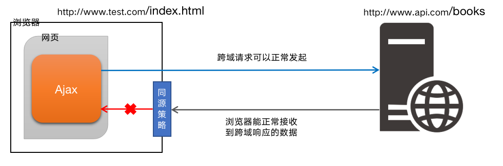

注意：浏览器允许发起跨域请求，但是，跨域请求回来的数据，会被浏览器拦截，无法被页面获取到！


#### 9.2.3 如何实现跨域数据请求

现如今，实现跨域数据请求，最主要的两种解决方案，分别是 `JSONP` 和 `CORS`。

- JSONP：
  - 出现的早，兼容性好（兼容低版本IE）。是前端程序员为了解决跨域问题，被迫想出来的一种临时解决方案。缺点是只支持 GET 请求，不支持 POST 请求。

- CORS：
  - 出现的较晚，它是 W3C 标准，属于跨域 Ajax 请求的根本解决方案。支持 GET 和 POST 请求。缺点是不兼容某些低版本的浏览器。


### 9.3 JSONP

JSONP (JSON with Padding) 是 JSON 的一种“使用模式”，可用于解决主流浏览器的跨域数据访问的问题。


**实现原理**

由于浏览器同源策略的限制，网页中无法通过 Ajax 请求非同源的接口数据。但是 `<script>` 标签不受浏览器同源策略的影响，可以通过 

src 属性，请求非同源的 js 脚本。

因此，JSONP 的实现原理，就是通过 `<script>` 标签的 src 属性，请求跨域的数据接口，并通过函数调用的形式，接收跨域接口响应回

来的数据。

#### 9.3.1 自己实现一个简单的 JSONP

定义一个 success 回调函数：

```jsx
 <script>
   function success(data) {
     console.log('获取到了data数据：')
     console.log(data)
   }
 </script>
```

通过 `<script>` 标签，请求接口数据：

```jsx
<script src="http://ajax.frontend.itheima.net:3006/api/jsonp?callback=success&name=zs&age=20"></script>
```


#### 9.3.2 JSONP 的缺点

由于 JSONP 是通过 `<script>` 标签的 src 属性，来实现跨域数据获取的，所以，JSONP 只支持 GET 数据请求，不支持 POST 请求。

注意：JSONP 和 Ajax 之间没有任何关系，不能把 JSONP 请求数据的方式叫做 Ajax，因为 JSONP 没有用到 XMLHttpRequest 这个对象。


#### 9.3.3 jQuery中的JSONP

jQuery 提供的 $.ajax() 函数，除了可以发起真正的 Ajax 数据请求之外，还能够发起 JSONP 数据请求。

例如：

```jsx
$.ajax({
  url: 'http://ajax.frontend.itheima.net:3006/api/jsonp?name=zs&age=20',
  // 如果要使用 $.ajax() 发起 JSONP 请求，必须指定 datatype 为 jsonp
  dataType: 'jsonp',
  success: function(res) {
     console.log(res)
  }
})
```

默认情况下，使用 jQuery 发起 JSONP 请求，会自动携带一个 callback=jQueryxxx 的参数，jQueryxxx 是随机生成的一个回调函数名

称。

**自定义参数及回调函数名称**

在使用 jQuery 发起 JSONP 请求时，如果想要自定义 JSONP 的参数以及回调函数名称，可以通过如下两个参数来指定：

```jsx
$.ajax({
  url: 'http://ajax.frontend.itheima.net:3006/api/jsonp?name=zs&age=20',
  dataType: 'jsonp',
  // 发送到服务端的参数名称，默认值为 callback
  jsonp: 'callback',
  // 自定义的回调函数名称，默认值为 jQueryxxx 格式
  jsonpCallback: 'abc',
  success: function(res) {
     console.log(res)
  }
})
```


**jQuery 中 JSONP 的实现过程**

jQuery 中的 JSONP，也是通过 `<script>` 标签的 src 属性实现跨域数据访问的，只不过，jQuery 采用的是动态创建和移除 `<script>` 

标签的方式，来发起 JSONP 数据请求。

- 在发起 JSONP 请求的时候，动态向 `<header>` 中 append 一个 `<script>` 标签；

- 在 JSONP 请求成功以后，动态从 `<header>` 中移除刚才 append 进去的 `<script>` 标签；


## 十、输入框的防抖 和 节流

### 10.1 防抖

**什么是防抖：**

防抖策略（debounce）是当事件被触发后，延迟 n 秒后再执行回调，如果在这 n 秒内事件又被触发，则重新计时。


**防抖的应用场景：**

用户在输入框中连续输入一串字符时，可以通过防抖策略，只在输入完后，才执行查询的请求，这样可以有效减少请求次数，节约请求资

源；


**输入框的防抖：**

```jsx
let timer = null                    // 1. 防抖动的 timer

function debounceSearch(keywords) { // 2. 定义防抖的函数
  timer = setTimeout(function() {
  // 发起 JSONP 请求
  getSuggestList(keywords)
  }, 500)
}

$('#ipt').on('keyup', function() {  // 3. 在触发 keyup 事件时，立即清空 timer
  clearTimeout(timer)
  // ...省略其他代码
  debounceSearch(keywords)
})

```


### 10.2 节流

**什么是节流：**

节流策略（throttle），顾名思义，可以减少一段时间内事件的触发频率。


**节流的应用场景：**

- 鼠标连续不断地触发某事件（如点击），只在单位时间内只触发一次；
- 懒加载时要监听计算滚动条的位置，但不必每次滑动都触发，可以降低计算的频率，而不必去浪费 CPU 资源；


#### 10.2.1 节流案例--鼠标跟随效果

**渲染 UI 结构并美化样式**

```jsx
<!-- UI 结构 -->


/* CSS 样式 */
html, body {
  margin: 0;
  padding: 0;
  overflow: hidden;
}#angel {
  position: absolute;
}
```


**不使用节流时实现鼠标跟随效果：**

```jsx
$(function() {
   // 获取图片元素
   var angel = $('#angel')
   // 监听文档的 mousemove 事件
   $(document).on('mousemove', function(e) {      // 设置图片的位置
      $(angel).css('left', e.pageX + 'px').css('top', e.pageY + 'px')
   })
})
```


**节流阀的概念：**

高铁卫生间是否被占用，由红绿灯控制，红灯表示被占用，绿灯表示可使用。

假设每个人上卫生间都需要花费5分钟，则五分钟之内，被占用的卫生间无法被其他人使用。

上一个人使用完毕后，需要将红灯重置为绿灯，表示下一个人可以使用卫生间。

下一个人在上卫生间之前，需要先判断控制灯是否为绿色，来知晓能否上卫生间。

节流阀为空，表示可以执行下次操作；不为空，表示不能执行下次操作。

当前操作执行完，必须将节流阀重置为空，表示可以执行下次操作了。

每次执行操作前，必须先判断节流阀是否为空。


**使用节流优化鼠标跟随效果：**

```jsx
$(function() {
  var angel = $('#angel')
  var timer = null // 1.预定义一个 timer 节流阀
  $(document).on('mousemove', function(e) {
    if (timer) { return } // 3.判断节流阀是否为空，如果不为空，则证明距离上次执行间隔不足16毫秒
    timer = setTimeout(function() {
      $(angel).css('left', e.pageX + 'px').css('top', e.pageY + 'px')
      timer = null // 2.当设置了鼠标跟随效果后，清空 timer 节流阀，方便下次开启延时器
    }, 16)
  })
})

```


### 10.3 总结：

- 防抖：如果事件被频繁触发，防抖能保证只有最有一次触发生效！前面 N 多次的触发都会被忽略！
- 节流：如果事件被频繁触发，节流能够减少事件触发的频率，因此，节流是有选择性地执行一部分事件！


## 十一、HTTP 协议加强

### 11.1 HTTP 协议简介

#### 什么是通信

通信，就是信息的传递和交换

通信三要素：

- 通信的主体
- 通信的内容
- 通信的方式


#### 现实终端通信

案例：张三要把自己考上北京大学的好消息写信告诉自己的朋友李四


其中：

通信的主体是张三和李四

通信的内容是考上北京大学

通信的方式是写信


#### 互联网中的通信

案例：服务器把传智专修学院的简介通过响应的方式发送给客户端浏览器。

其中，

通信的主体是服务器和客户端浏览器；

通信的内容是传智专修学院的简介；

通信的方式是响应；


#### 什么是通信协议

通信协议（Communication Protocol）是指通信的双方完成通信所必须遵守的规则和约定。

通俗的理解：通信双方采用约定好的格式来发送和接收消息，这种事先约定好的通信格式，就叫做通信协议。

客户端与服务器之间要实现网页内容的传输，则通信的双方必须遵守网页内容的传输协议。

网页内容又叫做超文本，因此网页内容的传输协议又叫做超文本传输协议（HyperText Transfer Protocol） ，简称 HTTP 协议。


#### 什么是 HTTP 协议

HTTP 协议即超文本传送协议 (HyperText Transfer Protocol) ，它规定了客户端与服务器之间进行网页内容传输时，所必须遵守的传输格

式。

例如：

- 客户端要以HTTP协议要求的格式把数据提交到服务器

- 服务器要以HTTP协议要求的格式把内容响应给客户端


#### HTTP 协议的交互模型

HTTP 协议采用了 请求/响应 的交互模型。

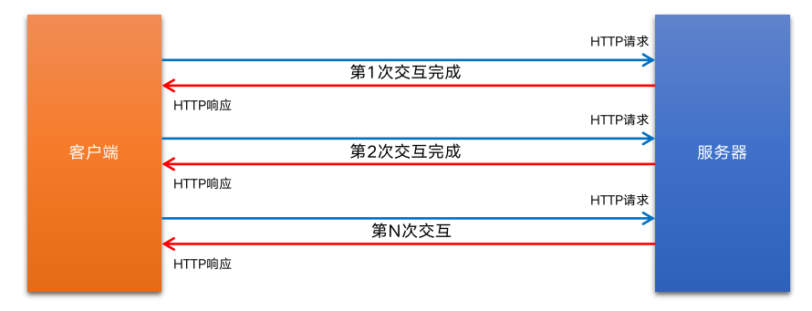


### 11.2 HTTP 请求

#### 什么是HTTP请求消息

由于 HTTP 协议属于客户端浏览器和服务器之间的通信协议。因此，客户端发起的请求叫做 HTTP 请求，客户端发送到服务器的消息，叫

做 HTTP 请求消息。

注意：HTTP 请求消息又叫做 HTTP 请求报文。


#### HTTP请求消息的组成部分

HTTP 请求消息由请求行（request line）、请求头部（ header ） 、空行 和 请求体 4 个部分组成。

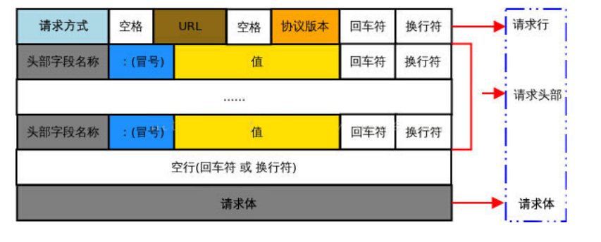

**请求行：**

请求行由请求方式、URL 和 HTTP 协议版本 3 个部分组成，他们之间使用空格隔开。

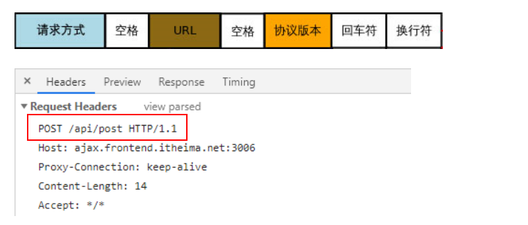

**请求头部**

请求头部用来描述客户端的基本信息，从而把客户端相关的信息告知服务器。比如：User-Agent 用来说明当前是什么类型的浏览器；

Content-Type 用来描述发送到服务器的数据格式；Accept 用来描述客户端能够接收什么类型的返回内容；Accept-Language 用来描述客

户端期望接收哪种人类语言的文本内容。

请求头部由多行 键/值对 组成，每行的键和值之间用英文的冒号分隔。

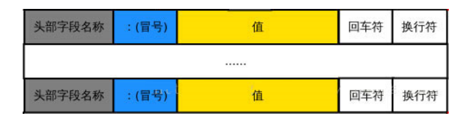

请求头部 – 常见的请求头字段:

|  **头部字段**   |                   **说明**                   |
| :-------------: | :------------------------------------------: |
|      Host       |              要请求的服务器域名              |
|   Connection    | 客户端与服务器的连接方式(close 或 keepalive) |
| Content-Length  |             用来描述请求体的大小             |
|     Accept      |        客户端可识别的响应内容类型列表        |
|   User-Agent    |             产生请求的浏览器类型             |
|  Content-Type   |      客户端告诉服务器实际发送的数据类型      |
| Accept-Encoding |        客户端可接收的内容压缩编码形式        |
| Accept-Language |       用户期望获得的自然语言的优先顺序       |

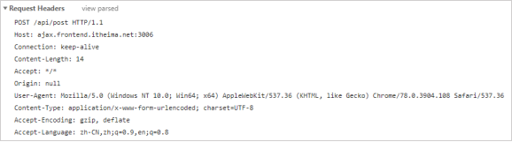

> 关于更多请求头字段的描述，可以查看 MDN 官方文档：https://developer.mozilla.org/zh-CN/docs/Web/HTTP/Headers

**空行**

最后一个请求头字段的后面是一个空行，通知服务器请求头部至此结束。

请求消息中的空行，用来分隔请求头部与请求体。

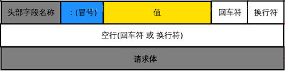

**请求体**

请求体中存放的，是要通过 POST 方式提交到服务器的数据。


> 注意：只有 POST 请求才有请求体，GET 请求没有请求体！


### 11.3 HTTP 响应

**什么是HTTP响应消息**

响应消息就是服务器响应给客户端的消息内容，也叫作响应报文。


**HTTP响应消息的组成部分**

HTTP响应消息由状态行、响应头部、空行 和 响应体 4 个部分组成，如下图所示：

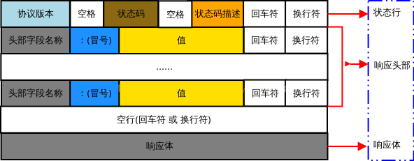

**状态行**

状态行由 HTTP 协议版本、状态码和状态码的描述文本 3 个部分组成，他们之间使用空格隔开;

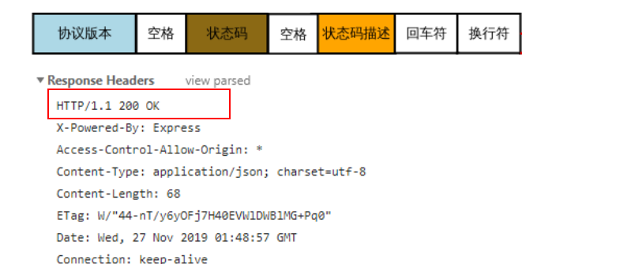

**响应头部**

响应头部用来描述服务器的基本信息。响应头部由多行 键/值对 组成，每行的键和值之间用英文的冒号分隔。

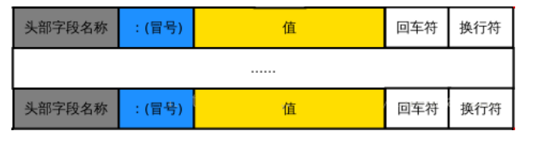

响应头部 – 常见的响应头字段

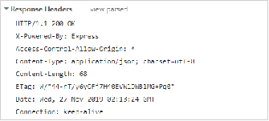

> 关于更多响应头字段的描述，可以查看 MDN 官方文档：https://developer.mozilla.org/zh-CN/docs/Web/HTTP/Headers

**空行**

在最后一个响应头部字段结束之后，会紧跟一个空行，用来通知客户端响应头部至此结束。

响应消息中的空行，用来分隔响应头部与响应体。

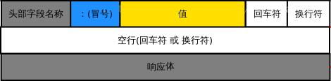


**响应体**

响应体中存放的，是服务器响应给客户端的资源内容。


### 11.4 HTTP 请求方法

HTTP 请求方法，属于 HTTP 协议中的一部分，请求方法的作用是：用来表明要对服务器上的资源执行的操作。最常用的请求方法是 GET 

和 POST。

| **序号** | **方法** | **描述**                                                     |
| :------: | :------- | :----------------------------------------------------------- |
|    1     | GET      | (查询)发送请求来获得服务器上的资源，请求体中不会包含请求数据，请求数据放在协议头中。 |
|    2     | POST     | (新增)向服务器提交资源（例如提交表单或上传文件）。数据被包含在请求体中提交给服务器。 |
|    3     | PUT      | (修改)向服务器提交资源，并使用提交的新资源，替换掉服务器对应的旧资源。 |
|    4     | DELETE   | (删除)请求服务器删除指定的资源。                             |
|    5     | HEAD     | HEAD 方法请求一个与 GET 请求的响应相同的响应，但没有响应体。 |
|    6     | OPTIONS  | 获取http服务器支持的http请求方法，允许客户端查看服务器的性能，比如ajax跨域时的预检等。 |
|    7     | CONNECT  | 建立一个到由目标资源标识的服务器的隧道。                     |
|    8     | TRACE    | 沿着到目标资源的路径执行一个消息环回测试，主要用于测试或诊断。 |
|    9     | PATCH    | 是对 PUT 方法的补充，用来对已知资源进行局部更新 。           |


### 11.5 HTTP 响应状态代码

HTTP 响应状态码（HTTP Status Code），也属于 HTTP 协议的一部分，用来标识响应的状态。

响应状态码会随着响应消息一起被发送至客户端浏览器，浏览器根据服务器返回的响应状态码，就能知道这次 HTTP 请求的结果是成功还

是失败了。

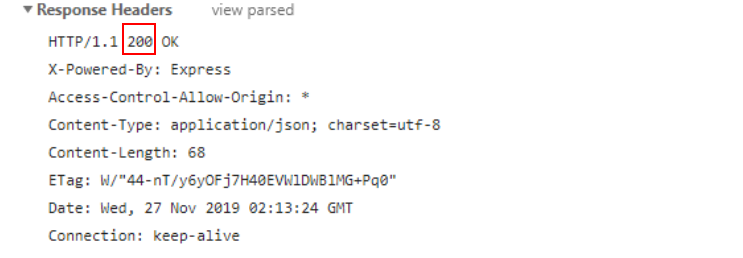

**HTTP响应状态码的组成及分类**

HTTP 状态码由三个十进制数字组成，第一个十进制数字定义了状态码的类型，后两个数字用来对状态码进行细分。

HTTP 状态码共分为 5 种类型：

| **分类** | **分类描述**                                                 |
| -------- | ------------------------------------------------------------ |
| 1**      | 信息，服务器收到请求，需要请求者继续执行操作（实际开发中很少遇到 1** 类型的状态码） |
| 2**      | 成功，操作被成功接收并处理                                   |
| 3**      | 重定向，需要进一步的操作以完成请求                           |
| 4**      | 客户端错误，请求包含语法错误或无法完成请求                   |
| 5**      | 服务器错误，服务器在处理请求的过程中发生了错误               |

> 完整的 HTTP 响应状态码，可以参考 MDN 官方文档 https://developer.mozilla.org/zh-CN/docs/Web/HTTP/Status

#### 2**成功相关的响应状态码

2** 范围的状态码，表示服务器已成功接收到请求并进行处理。常见的 2** 类型的状态码如下：

| **状态码** | **状态码英文名称** | **中文描述**                                                |
| ---------- | ------------------ | ----------------------------------------------------------- |
| 200        | OK                 | 请求成功。一般用于 GET 与 POST 请求                         |
| 201        | Created            | 已创建。成功请求并创建了新的资源，通常用于 POST 或 PUT 请求 |


#### 3**重定向相关的响应状态码

`3**` 范围的状态码，表示表示服务器要求客户端重定向，需要客户端进一步的操作以完成资源的请求。常见的 3** 类型的状态码如下：

| **状态码** | **状态码英文名称** | **中文描述**                                                 |
| ---------- | ------------------ | ------------------------------------------------------------ |
| 301        | Moved Permanently  | 永久移动。请求的资源已被永久的移动到新URI，返回信息会包括新的URI，浏览器会自动定向到新URI。今后任何新的请求都应使用新的URI代替 |
| 302        | Found              | 临时移动。与301类似。但资源只是临时被移动。客户端应继续使用原有URI |
| 304        | Not Modified       | 未修改。所请求的资源未修改，服务器返回此状态码时，不会返回任何资源（响应消息中不包含响应体）。客户端通常会缓存访问过的资源。 |


#### 4**客户端错误相关的响应状态码

4** 范围的状态码，表示客户端的请求有非法内容，从而导致这次请求失败。常见的 4** 类型的状态码如下：

| **状态码** | **状态码英文名称** | **中文描述**                                                 |
| ---------- | ------------------ | ------------------------------------------------------------ |
| 400        | Bad Request        | 1、语义有误，当前请求无法被服务器理解。除非进行修改，否则客户端不应该重复提交这个请求。 2、请求参数有误。 |
| 401        | Unauthorized       | 当前请求需要用户验证。                                       |
| 403        | Forbidden          | 服务器已经理解请求，但是拒绝执行它。                         |
| 404        | Not Found          | 服务器无法根据客户端的请求找到资源（网页）。                 |
| 408        | Request Timeout    | 请求超时。服务器等待客户端发送的请求时间过长，超时。         |


#### 5**服务器错误相关的响应状态码

5** 范围的状态码，表示服务器未能正常处理客户端的请求而出现意外错误。常见的 5** 类型的状态码如下：

| **状态码** | **状态码英文名称**    | **中文描述**                                                 |
| ---------- | --------------------- | ------------------------------------------------------------ |
| 500        | Internal Server Error | 服务器内部错误，无法完成请求。                               |
| 501        | Not Implemented       | 服务器不支持该请求方法，无法完成请求。只有 GET 和 HEAD 请求方法是要求每个服务器必须支持的，其它请求方法在不支持的服务器上会返回501 |
| 503        | Service Unavailable   | 由于超载或系统维护，服务器暂时的无法处理客户端的请求。       |