## 一、初识 Node.js

### 1.1 什么是 Node.js

Node.js® 是一个基于 [Chrome V8 引擎](https://v8.dev/) 的 JavaScript 运行时环境。

Node.js 的官网地址: https://nodejs.org/zh-cn/


### 1.2 Node.js 简介

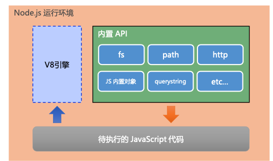

注意：

- 浏览器是 JS 的前端运行环境
- Node.js 是 JS 的后端运行环境
- Node.js 中无法调用 DOM 和 BOM 等浏览器内置 API

#### Node.js 可以做什么

Node.js 作为一个 JavaScript 的运行环境，仅仅提供了基础的功能和 API。然而，基于 Node.js 提供的这些基础能，很多强大 的工具和框

架如雨后春笋，层出不穷，所以学会了 Node.js ，可以让前端程序员胜任更多的工作和岗位:

- 基于 Express 框架(http://www.expressjs.com.cn/)，可以快速构建 Web 应用 
- 基于 Electron 框架(https://electronjs.org/)，可以构建跨平台的桌面应用
- 基于 restify 框架(http://restify.com/)，可以快速构建 API 接口项目
- 读写和操作数据库、创建实用的命令行工具辅助前端开发、etc...

总之:Node.js 是大前端时代的“大宝剑”，有了 Node.js 这个超级 buff 的加持，前端程序员的行业竞争力会越来越强!


#### Node.js 怎么学

浏览器中的 JavaScript 学习路径:

 JavaScript 基础语法 + 浏览器内置 API(DOM + BOM) + 第三方库(jQuery、art-template 等)


Node.js 的学习路径:

JavaScript 基础语法 + Node.js 内置 API 模块(fs、path、http等)+ 第三方 API 模块(express、mysql 等)


### 1.3 node 代码提示

- Vscode 安装 `node-snippets`
- 安装 `typings`：
  - 全局安装：`npm install -g typings`
  - 项目根目录：`typings init`
    - 目录下会出现一个`typings.json`的文件，这个文件就是`typings`的配置文件。
  - 项目根目录：``typings install dt~node --global --save`
    - `–-global`：代表全局文件）
    - （`–-save` ：表示将此次的安装信息记录到上面讲的`typings.json`中)
  - 项目根目录：`touch jsconfig.json`

- experess代码提示：
  - npm i -D @types/express  


### 1.4 项目需要的库

```js
npm init -y // 初始化package.json文件
npm install express
npm install -g nodemon
npm install cors
npm install mysql

```


## 二、fs 文件系统模板

### 2.1 什么是 fs 文件系统模板

`fs` 模块是 `Node.js` 官方提供的，用来操作文件的模块。它提供了一系列的方法和属性，用来满足用户对文件的操作需求。 

例如:

- `fs.readFile()` 方法，用来读取指定文件中的内容
- `fs.writeFile()` 方法，用来向指定的文件中写入内容

如果要在 `JavaScript` 代码中，使用 `fs` 模块来操作文件，则需要使用如下的方式先导入它:

```jsx
const fs = requeire('fs')
```


### 2.2 读取指定文件中的内容

**fs.readFile() 的语法格式**：

使用 `fs.readFile()` 方法，可以读取指定文件中的内容。

语法如下：

```jsx
fs.readFile(path[, option]， callback)

// 例如
fr.readFile('./11.text', 'utf8', function(err, dataStr){
  
})
```

参数解读：

- 参数 1：必选参数，字符串，表示文件的路径
- 参数 2：可选参数，表示以什么 `编码格式` 来读取文件
- 参数 3：必选参数，文件读取完成后，通过回调函数拿到读取的结果

示例：

以 utf8 的编码格式，读取指定文件的内容，并打印 err 和 dataStr 的值:

```jsx
const fs = require('fs')
fs.readFile('./Files/1111.txt', 'utf-8',function(err, dataStr) {
     console.log(err)
     console.log('================')
     console.log(dataStr)
})
```


### 2.3 向指定的文件中写入内容：

**fs.write()**

使用 `fs.writeFile()` 方法，可以向指定的文件中写入内容。

语法格式如下:

```jsx
fs.write(file, data, [option], callback)
```

参数：

- 参数1：必选参数，需要指定一个文件路径的字符串，表示文件的存放路径
- 参数 2：必选参数，表示要写入的内容
- 参数 3：可选参数，表示以什么格式写入文件内容，默认值是 utf8。
- 参数4：必选参数，文件写入完成后的回调函数。

示例：

```jsx
// 导入 fs 
const fs = require('fs')
fs.writeFile('./Files/222.txt', '222222222', function(err) {
     console.log('回调');
     console.log(err);
})
```


### 2.4 案例

```jsx
// 导入 fs
const fs = require('fs')
// 读取文件
fs.readFile('./Files/成绩.txt','utf8', function(err, dataStr) {
     // 文件是否读取成功
     if (err) {
          console.log('读取文件失败');
          return
     }
     // 文件读取成功
     console.log('读取成功,文件内容: \n' + dataStr);
     // 分割字符串
      let arrOld = dataStr.split(' ')
     //  临时新数组
      let arrNew = []
     // 循环数组:重组数组
     arrOld.forEach(item => {
          console.log(item);
          arrNew.push(item.replace('=',':'))
     });
     // 数组转字符串
     let newStr = arrNew.join('\r\n')
     // 写入数据
     fs.writeFile('./Files/成绩-ok.txt', newStr, function(err) {
          // 数据是否写入成功
          if (err) {
               console.log('写入文件失败');
               return
          }
          // 写入成功
          console.log('写入文件成功');
     })

})
```


### 2.5 fs 模块 - 路径动态拼接的问题

在使用 fs 模块操作文件时，如果提供的操作路径是以 ./ 或 ../ 开头的相对路径，很容易出现路径动态拼接错误的问题。

原因：代码在运行的时候，会以执行 node 命令时所处的目录，动态拼接出被操作文件的完整路径

出现路径拼接错误的问题，是因为提供了 ./ 或 ../ 开头的相对路径

如果要解决这个问题，可以直接提供一个完整的文件存放路径

可以使用完整路径或者关键字 `__dirname`.

`__dirname` ：表示当前文件所处的目录

示例：

```js
const fs = require('fs')

// 在当前文件下的/Files/111.txt中读取数据
fs.readFile(__dirname + '/Files/111.txt', 'utf8', function(err, dataStr) {
     console.log(err);
     console.log('-========');
     console.log(dataStr);
})
```


## 三、path 路径模板

### 3.1 什么是 path 路径模块

`path` 模块是 Node.js 官方提供的，用来处理路径的模块。它提供了一系列的方法和属性，用来满足用户对路径的处理 需求。

例如:

- `path.join()` 方法：用来将多个路径片段拼接成一个完整的路径字符串 
- `path.basename()` 方法：用来从路径字符串中，将文件名解析出来

如果要在 JavaScript 代码中，使用 `path` 模块来处理路径，则需要使用如下的方式先导入它:

```
const path = require('path')
```


### 3.2 路径拼接

**path.join() 的语法格式**

使用 `path.join()` 方法，可以把多个路径片段拼接为完整的路径字符串，语法格式如下:

```jsx
path.join([...paths])
```

参数：

- `...paths<string>`：路径片段的序列
- 返回值是 `<string>`

示例：

使用 `path.join()` 方法，可以把多个路径片段拼接为完整的路径字符串:

```jsx
const path = require('path')
cosnt pathStr = path.join('/a', '/b/c', '../', './d', 'e')
console.log(pathStr)

const pathStr2 = path.join(_dirname, './file.txt')
console.log(pathStr2) // 当前文件所有的目录是
```

> 注意：
>
> 今后凡是涉及到路劲拼接的操作，都要使用 path.join() 方法进行处理。不要直接使用 + 拼接

读取文件示例：

```jsx
const fs = require('fs')
const path = require('path')

fs.readFile(path.join(__dirname + '/Files/111.txt'), 'utf8', function(err, dataStr) {
     console.log(err);
     console.log('-===');
     console.log(dataStr);
})
```


### 3.3 获取路径中的文件名

**path.basename()** **的语法格式**

使用 `path.basename()` 方法，可以获取路径中的最后一部分，经常通过这个方法获取路径中的文件名。

语法格式如下:

```jsx’
path.basename(path, [, ext])
```

参数：

- path：必选参数，表示一个路径的字符串
- ext：可选参数，表示文件扩展名
- 返回：string，表示路径中的最后一部分

示例：

```jsx
// 使用 path.basename() 方法，可以从一个文件路径中，获取到文件的名称部分:
const fpath = '/a/b/c/index.html'

let fullName = path.basename(fname)
console.log(fullName)

let nameWithoutExt = path.basename(fpath, '.html')
console.log(nameWithoutExt) // 输出 index
```


### 3.4 获取路径中的文件扩展名

**path.extname()** **的语法格式**

使用 path.extname() 方法，可以获取路径中的扩展名部分。

语法格式如下:

```jsx
path.extname(path)
```

参数：

- path：必选参数，表示路径
- 返回值：扩展名字符串

示例：

```jsx
const fpath = '/a/b/c/index.html'

const fext = path.extname(fpath)
console.log(fext)
```


## 四、http 模块

### 4.1 **什么是** **http** **模块**

回顾:什么是客户端、什么是服务器? 在网络节点中，负责消费资源的电脑，叫做客户端;负责对外提供网络资源的电脑，叫做服务器。

`http` 模块是 Node.js 官方提供的、用来创建 web 服务器的模块。通过 http 模块提供的 `http.createServer()` 方法，就 能方便的把一台普

通的电脑，变成一台 Web 服务器，从而对外提供 Web 资源服务。

如果要希望使用 `http` 模块创建 Web 服务器，则需要先导入它:

```
const http = require('http')
```


### 4.2 **进一步理解** **http** **模块的作用**

服务器和普通电脑的**区别**在于，服务器上安装了 web 服务器软件，例如:IIS、Apache 等。通过安装这些服务器软件， 就能把一台普通的

电脑变成一台 web 服务器。

在 Node.js 中，我们不需要使用 IIS、Apache 等这些第三方 web 服务器软件。因为我们可以基于 Node.js 提供的 http 模块，**通过几行简**

**单的代码，就能轻松的手写一个服务器软件**，从而对外提供 web 服务。


### 4.3 **服务器相关的概念**

#### ip 地址

**IP** **地址**就是互联网上每台计算机的唯一地址，因此 IP 地址具有唯一性。如果把“个人电脑”比作“一台电话”，那么“IP地 址”就相当于“电话号

码”，只有在知道对方 IP 地址的前提下，才能与对应的电脑之间进行数据通信。

IP 地址的格式:通常用“点分十进制”表示成(a.b.c.d)的形式，其中，a,b,c,d 都是 0~255 之间的十进制整数。例如:用 点分十进表示的 IP地址

(192.168.1.1)

注意:

- **互联网中每台** **Web** **服务器，都有自己的** **IP** **地址**，例如:大家可以在 Windows 的终端中运行 ping www.baidu.com 命 令，即可查看到百度服务器的 IP 地址。

- 在开发期间，自己的电脑既是一台服务器，也是一个客户端，为了方便测试，可以在自己的浏览器中输入 127.0.0.1 这个 IP 地址，就能把自己的电脑当做一台服务器进行访问了。


#### **域名和域名服务器**

尽管 IP 地址能够唯一地标记网络上的计算机，但IP地址是一长串数字，不直观，而且不便于记忆，于是人们又发明了另一套

字符型的地址方案，即所谓的**域名(****Domain Name****)地址**。

IP地址和域名是一一对应的关系，这份对应关系存放在一种叫做**域名服务器**(DNS，Domain name server)的电脑中。使用者 只需通过好

记的域名访问对应的服务器即可，对应的转换工作由域名服务器实现。因此，**域名服务器就是提供** **IP** **地址和域名 之间的转换服务的服务器**。

注意:

- 单纯使用 IP 地址，互联网中的电脑也能够正常工作。但是有了域名的加持，能让互联网的世界变得更加方便。
- 在开发测试期间， 127.0.0.1 对应的域名是 localhost，它们都代表我们自己的这台电脑，在使用效果上没有任何区别。


#### **端口号**

计算机中的端口号，就好像是现实生活中的门牌号一样。通过门牌号，外卖小哥可以在整栋大楼众多的房间中，准确把外卖 送到你的手

中。

同样的道理，在一台电脑中，可以运行成百上千个 web 服务。每个 web 服务都对应一个唯一的端口号。客户端发送过来的 网络请求，通

过端口号，可以被准确地交给对应的 web 服务进行处理。

注意:

- 每个端口号不能同时被多个 web 服务占用。
- 在实际应用中，URL 中的 80 端口可以被省略。


### 4.4  **创建最基本的** **web** **服务器**

- 导入 http 模块
- 创建 web 服务器实例
- 为服务器示例绑定 request 时间，监听客户端的请求
- 启动服务器

#### 步骤一、导入 http 模块

如果希望在自己的电脑上创建一个 web 服务器，从而对外提供 web 服务，则需要导入 http 模块:

```jsx
const http = require('http')
```

#### 步骤二、创建最基本的 web 服务器

调用 `http.createServer()` 方法，即可快速创建一个 web 服务器实例:

```jsx
const server = http.createServer()
```

#### 步骤三、为服务器实例绑定 request 事件

为服务器实例绑定 request 事件，即可监听客户端发送过来的网络请求:

```jsx
// 使用服务器实例的 .on() 方法，为服务器绑定一个 request 事件
server.on('request', (req, res)=> {
  	// 只要有客户端来请求服务器，就会触发 request 事件，从而调用这个事件触发函数
  	console.log('xxxxxxxxxxxxxx')
})
```

**req 请求对象：**

只要服务器接收到了客户端的请求，就会调用通过 server.on() 为服务器绑定的 request 事件处理函数。 如果想在事件处理函数中，访问

与客户端相关的**数据**或**属性**，可以使用如下的方式:

```
server.on('request',(req)=> {
		// req 是请求对象，它包含了与客户端相关的数据和属性。
		// 例如：
		// req.url 是客户端请求的 URL 地址
		// req.mehto 是客户端请求的类型
		const str = '请求的URLK ${req.url}, 请求的类型 ${req.method}'
})
```

**res 响应对象：**

在服务器的 request 事件处理函数中，如果想访问与服务器相关的**数据**或**属性**，可以使用如下的方式:

```jsx
server.on('request', (req, res)=> {
  	// res 是响应对象，它包含了与服务器相关的数据和属性
    // 例如：要发送给客户端的字符串
    const str = '请求的URLK ${req.url}, 请求的类型 ${req.method}'
    // res.end() 方法的作用：
    // 向客户端发送指定的内容，并结束这次请求的处理过程
    res.end(str)
})
```


#### 步骤四、启动服务器

调用服务器实例的 `.listen()` 方法，即可启动当前的 web 服务器实例:

```jsx
// 调用 server.listen(端口号, cb回调)方法，即可启动当前的 web 服务器实例:
server.listen(90, ()=>{
  	console.log('---------')
})
```

#### 解决中文乱码问题：

当调用 res.end() 方法，向客户端发送中文内容的时候，会出现乱码问题，此时，需要手动设置内容的编码格式:

```jsx
server.on('request', (req, res)=> {
  	// res 是响应对象，它包含了与服务器相关的数据和属性
    // 例如：要发送给客户端的字符串
    const str = '请求的URLK ${req.url}, 请求的类型 ${req.method}'
    // 为了防止中文显示乱码的问题，设置响应头
    res.setHeader('Content-Type', 'text/html: charset=utf-8')
    // res.end() 方法的作用：
    // 向客户端发送指定的内容，并结束这次请求的处理过程
    res.end(str)
})
```


## 五、模块化

### 5.1 模块的基本概念

**什么是模块化：**

**模块化**是指解决一个复杂问题时，自顶向下逐层把系统划分成若干模块的过程。对于整个系统来说，模块是可组 合、分解和更换的单

元。

编程领域中的模块化，就是 **遵守固定的规则**，把一个大文件拆成独立并互相依赖的多个小模块。

把代码进行模块化拆分的好处: 

1. 提高了代码的复用性
2. 提高了代码的可维护性
3. 可以实现按需加载


**模块化规范：**

**模块化规范 **就是对代码进行模块化的拆分与组合时，需要遵守的那些规则。

例如:

- 使用什么样的语法格式来引用模块
- 在模块中使用什么样的语法格式向外暴露成员

**模块化规范的好处**：大家都遵守同样的模块化规范写代码，降低了沟通的成本，极大方便了各个模块之间的相互调用， 利人利己。


### 5.2 Node.js 中的模块化

**Node.js 中模块的分类：**

Node.js 中根据模块来源的不同，将模块分为 3 大类：

1. 内置模块：内置模块由 Node.js 官方提供的。例如fs、http、path 等
2. 自定义模块：用户创建的每个 js 文件，都是自定义模块
3. 第三方模块：由第三方开发出来的模块，并非官方提供的内置模块，也不是用户自己创建的，使用需要先下载。


**加载模块：**

使用强大的 `require()` 方法，可以加载需要的内置模块、自定义模块、第三方模块进行使用。

例如：

```jsx
// 加载内置的 fs 模块
const fs = require('fs')
// 加载用户的自定义模块
const custom = require('./custom.js')
// 加载第三方模块
const other = require('other')
```

> 在使用 `require` 加载自定义模块时，可以省略后缀名


**Node.js 中的模块作用域：**

模块作用域：和函数作用域类似，在自定义模块中自定义的变量、方法等成员，只能在当前模块内被访问，这种模块级别的访问限制，叫做模块作用域


**模块作用域的好处：**

防止了全局变量污染的问题

`模块作用域.js`

```jsx
const userName = '张三'

function sayHello() {
     console.log('大家好,我是' + userName);
}
```

测试：

```jsx
const cus = require('./模块作用域')

console.log(cus);
// 打印：
// {} 空对象
```


#### 5.2.1 向外共享模块作用域中的成员

**module 对象**

在每个 js 自定义模块中都有一个 module 对象，它里面存储了和当前模块有关的信息。

打印如下：

```jsx
console.log(module)

// 打印
/*
Module {
  id: '.',
  path: '/Users/lcf/Desktop/Code/Web/Node/模块',
  exports: {},
  filename: '/Users/lcf/Desktop/Code/Web/Node/模块/作用域 test.js',
  loaded: false,
  children: [
    Module {
      id: '/Users/lcf/Desktop/Code/Web/Node/模块/模块作用域.js',
      path: '/Users/lcf/Desktop/Code/Web/Node/模块',
      exports: {},
      filename: '/Users/lcf/Desktop/Code/Web/Node/模块/模块作用域.js',
      loaded: true,
      children: [],
      paths: [Array]
    }
  ],
  paths: [
    '/Users/lcf/Desktop/Code/Web/Node/模块/node_modules',
    '/Users/lcf/Desktop/Code/Web/Node/node_modules',
    '/Users/lcf/Desktop/Code/Web/node_modules',
    '/Users/lcf/Desktop/Code/node_modules',
    '/Users/lcf/Desktop/node_modules',
    '/Users/lcf/node_modules',
    '/Users/node_modules',
    '/node_modules'
  ]
}
*/
```


**module.exports 对象**

在自定义模块中，可以使用 `module.exports` 对象，将模块内的成员共享出去，供外界使用。

在外界用 `require()` 方法导入自定义模块时，得到的就是 `module.exports` 所指向的对象。

示例：

```jsx
// 自定义模块
// 在一个自定义模块中,默认情况下 module.expoerts = {}
// 向 module.expoerts 对象上添加一个 username 属性
module.exports.username = '张三'

module.exports.sayHello = function () {
     console.log('Hello');
}

// 加载自定义模块
//  在外界使用 require 方法 导入一个自定义模块的时候,
// 得到的成员是 module.exports 对象
const m = require('./11-自定义模块')
console.log(m);
// 打印：
// { username: '张三', sayHello: [Function (anonymous)] }
```


**共享成员时的注意点：**

使用 `require()` 方法导入模块时，导入的结果，**永远以** **module.exports** **指向的对象为准**。

```jsx
module.exports = {
     username: 'sss',
     ...
}
```


**exports 对象：**

由于 module.exports 单词写起来比较复杂，为了简化向外共享成员的代码，Node 提供了 exports 对象。默认情况 下，exports 和

module.exports 指向同一个对象。最终共享的结果，还是以 module.exports 指向的对象为准。

```jsx
// 自定义模块
exports.usernmame = '张萨姆'
exports.sayHello = function () {
     console.log('Hello');
}


// 加载自定义模块
//  在外界使用 require 方法 导入一个自定义模块的时候,
// 得到的成员是 module.exports 对象
const m = require('./11-自定义模块')
console.log(m);
// 打印：
// { username: '张萨姆', sayHello: [Function (anonymous)] }
```


**exports** **和** **module.exports** **的使用误区**

时刻谨记，``require()`` 模块时，得到的永远是 `module.exports` 指向的对象:

> **注意:**
>
> 为了防止混乱，建议大家不要在同一个模块中同时使用 exports 和 module.exports


**Node.js** **中的模块化规范**

Node.js 遵循了 `CommonJS` 模块化规范，``CommonJS` 规定了模块的特性和各模块之间如何相互依赖。

`CommonJS` 规定:

1. 每个模块内部，`module` 变量代表当前模块。
2. module 变量是一个对象，它的 exports 属性(即 module.exports)是对外的接口。
3. 加载某个模块，其实是加载该模块的 module.exports 属性。require() 方法用于加载模块。


#### ... 在 module 的使用

```jsx
const xxx = require('xxx')
module.exports = {
  ...xxx
}
```

会把所有 xxx 包里的暴露对象添加到 exports 中


## 六、npm 与包

### 6.1 包

`Node.js` 中的第三方模块又叫做包。 就像电脑和计算机指的是相同的东西，第三方模块和包指的是同一个概念，只不过叫法不同。

不同于 `Node.js` 中的内置模块与自定义模块，包是由第三方个人或团队开发出来的，免费供所有人使用。

**注意**：`Node.js` 中的包都是免费且开源的，不需要付费即可免费下载使用。


**为什么需要包**

由于 `Node.js` 的内置模块仅提供了一些底层的 API，导致在基于内置模块进行项目开发的时，效率很低。

包是基于内置模块封装出来的，提供了更高级、更方便的 API，极大的提高了开发效率。 

包和内置模块之间的关系，类似于 jQuery 和 浏览器内置 API 之间的关系。


**从哪里下载包**

国外有一家 IT 公司，叫做 **npm, Inc.** 这家公司旗下有一个非常著名的网站: https://www.npmjs.com/ ，它是**全球最 大的包共享平台**，你

可以从这个网站上搜索到任何你需要的包，只要你有足够的耐心!

到目前位置，全球约 1100 多万的开发人员，通过这个包共享平台，开发并共享了超过 120 多万个包 供我们使用。 **npm, Inc.** **公司**提供

了一个地址为 https://registry.npmjs.org/ 的服务器，来对外共享所有的包，我们可以从这个服务器上下载自己所需要的包。

**注意:**

- 从 https://www.npmjs.com/ 网站上搜索自己所需要的包
- 从 https://registry.npmjs.org/ 服务器上下载自己需要的包


**如何下载包**

**npm, Inc.** **公司**提供了一个包管理工具，我们可以使用这个包管理工具，从 https://registry.npmjs.org/ 服务器把需要 的包下载到本地使

用。

这个包管理工具的名字叫做 `Node Package Manager`(简称 npm 包管理工具)，这个包管理工具随着 Node.js 的安 装包一起被安装到了用

户的电脑上。

大家可以在终端中执行 **npm -v** 命令，来查看自己电脑上所安装的 npm 包管理工具的版本号:


### 6.2 **npm** 初体验

**1.** **格式化时间的传统做法**

- 创建格式化时间的自定义模块

- 定义格式化时间的方法

- 创建补零函数

- 从自定义模块中导出格式化时间的函数 

- 导入格式化时间的自定义模块

- 调用格式化时间的函数

  ```jsx
  function dateFormat (dateStr) {
       const dt = new Date(dateStr)
       const y = dt.getFullYear()
       const m = padZero(dt.getMonth() + 1)
       const d = padZero(dt.getDate())
       const h = padZero(dt.getHours())
       const mm = padZero(dt.getMinutes())
       const ss = padZero(dt.getSeconds())
  
       return `${y}-${m}-${d} ${h}:${mm}:${ss}`
  }
  
  // 定义补零函数
  function padZero (n) {
       return n > 9 ? n : '0' + n
  }
  
  module.exports = {
       dateFormat
  }
  ```

​		使用：

- 

  ```jsx
  const Time = require('./时间格式化')
  
  const dt = new Date()
  console.log(dt);
  const newDt = Time.DateFormat(dt)
  console.log(newDt);
  
  // 打印：
  2022-04-21T08:25:28.461Z
  2022-04-21 16:25:28
  ```

  


**2.** **格式化时间的高级做法**

- 使用 `npm` 包管理工具，在项目中安装格式化时间的包 `moment`

- 使用 `require()` 导入格式化时间的包
- 参考 `momen`t` 的官方 API 文档对时间进行格式化

```jsx
// 导入的名称就是装包的名称
const moment = require('moment')

const dt = moment().format('YYYY-MM-DD HH:mm:ss')
console.log(dt);
```


**3.** **在项目中安装包的命令**

如果想在项目中安装指定名称的包，需要运行如下的命令:

```jsx
npm install 包的完整名称
```

上述的装包命令，可以简写成如下格式：

```jsx
npm i 包的完整名称
```


**4.** **初次装包后多了哪些文件**

初次装包完成后，在项目文件夹下多一个叫做 node_modules 的文件夹和 package-lock.json 的配置文件。

其中:

node_modules 文件夹用来存放所有已安装到项目中的包。require() 导入第三方包时，就是从这个目录中查找并加载包。 package-

lock.json 配置文件用来记录 node_modules 目录下的每一个包的下载信息，例如包的名字、版本号、下载地址等。

>  注意:程序员不要手动修改 node_modules 或 package-lock.json 文件中的任何代码，npm 包管理工具会自动维护它们。


**5.** **安装指定版本的包**

默认情况下，使用 npm install 命令安装包的时候，会自动安装最新版本的包。如果需要安装指定版本的包，可以在包 名之后，通过 @ 

符号指定具体的版本，例如:

```jsx
npm i moment@22.2
```


**6.** **包的语义化版本规范**

包的版本号是以“点分十进制”形式进行定义的，总共有三位数字，例如 **2.24.0** 

其中每一位数字所代表的的含义如下:

第1位数字:大版本

第2位数字:功能版本

第3位数字:Bug修复版本 


>  版本号提升的规则:只要前面的版本号增长了，则后面的版本号归零。


### 6.3 包管理配置文件

npm 规定，在项目根目录中，**必须**提供一个叫做 package.json 的包管理配置文件。用来记录与项目有关的一些配置 信息。

例如:

- 项目的名称、版本号、描述等
- 项目中都用到了哪些包
- 哪些包只在开发期间会用到
- 那些包在开发和部署时都需要用到


**1.** **多人协作的问题**

整个项目的体积是 30.4M，第三方包的体积是 28.8M，项目源代码的体积 1.6M。

遇到的问题:

- 第三方包的体积过大，不方便团队成员之间共享项目源代码。

解决方案:共享时剔除 `node_modules`


**2.** **如何记录项目中安装了哪些包**

在项目根目录中，创建一个叫做 package.json 的配置文件，即可用来记录项目中安装了哪些包。从而方便剔除 node_modules 目录之

后，在团队成员之间共享项目的源代码。

>  **注意**:
>
> 今后在项目开发中，一定要把 node_modules 文件夹，添加到 .gitignore 忽略文件中。


**3.** **快速创建** **package.json**

npm 包管理工具提供了一个快捷命令，可以在执行命令时所处的目录中，快速创建 package.json 这个包管理 配置文件:

```jsx
npm init -y
```

> 注意:
>
> - 上述命令只能在英文的目录下成功运行!所以，项目文件夹的名称一定要使用英文命名，不要使用中文，不能出现空格。 
> - 运行 npm install 命令安装包的时候，npm 包管理工具会自动把包的名称和版本号，记录到 package.json 中。


**4.** **dependencies** **节点**

`package.json` 文件中，有一个 `dependencies` 节点，专门用来记录您使用 `npm install` 命令安装了哪些包。


**5.** **一次性安装所有的包**

当我们拿到一个剔除了 `node_modules` 的项目之后，需要先把所有的包下载到项目中，才能将项目运行起来。 否则会报类似于下面的错

误:

```jsx
// 由于项目运行依赖于 moment 这个包，如果没有安装，就会报如下错：
Error：Cannot find module 'moment'
```

可以运行 `npm install` 命令(或 npm i)一次性安装所有的依赖包:

```
// 执行 npm install 命令时，npm 包管理工具会先读取 package.json 中的 dependencies 节点
// 读取到记录的所有依赖包名称和版本后，npm 包管理工具会把这些包一次性下载到项目中
npm install
```


**6.** **卸载包**

可以运行 `npm uninstall` 命令，来卸载指定的包:

```jsx
// 使用 npm uninstall 具体的包名，来卸载包
npm uninstall mement
```

> 注意:
>
> npm uninstall 命令执行成功后，会把卸载的包，自动从 package.json 的 dependencies 中移除掉。


**7.** **devDependencies** **节点**

如果某些包**只在项目开发阶段**会用到，在**项目上线之后不会用到**，则建议把这些包记录到 devDependencies 节点中。 与之对应的，如果

某些包在开发和项目上线之后都需要用到，则建议把这些包记录到 dependencies 节点中。

您可以使用如下的命令，将包记录到 devDependencies 节点中:

```jsx
// 安装指定的包，并记录到 devDependencies 节点中
npm i 包名 -D

// 注意：上述命苦了是简写，等价于下面完整写法
npm install 包名 --save-dev
```


### 6.4 解决下包速度慢的问题

**切换** **npm** **的下包镜像源**

下包的镜像源，指的就是下包的服务器地址。

```jsx
// 查看当前的下包镜像源
npm config get registry

// 将下包的镜像源切换为淘宝镜像源
npm config set registry=https://registry.nmp.taobao.org/

// 检查镜像源是否下载成功
npm config get registry
```


**nrm**

为了更方便的切换下包的镜像源，我们可以安装 **nrm** 这个小工具，利用 nrm 提供的终端命令，可以快速查看和切换下 包的镜像源。

```jsx
// 通过 npm 包管理器，将 nrm 安装为全局可用的工具
npm i nrm -g

// 查看所有可用的镜像源
nrm ls

// 将下包的镜像源切换为 taobao 镜像
nrm use taobao
```


### 6.5 包的分类

使用 npm 包管理工具下载的包，共分为两大类，分别是: 

- 项目包
- 全局包

#### 6.5.1 项目包

那些被安装到项目的 node_modules 目录中的包，都是项目包。

项目包又分为两类，分别是:

- 开发依赖包(被记录到 devDependencies 节点中的包，只在开发期间会用到)
- 核心依赖包(被记录到 dependencies 节点中的包，在开发期间和项目上线之后都会用到)

```jsx
npm i 包名 -D  // 开发依赖包：会被记录到 devDependencies 节点下
npm i 包名     // 核心依赖包：会被记录到 dependencies 节点下
```


#### 6.5.2 全局包

在执行 npm install 命令时，如果提供了 -g 参数，则会把包安装为全局包。 

全局包会被安装到 C:\Users\用户目录\AppData\Roaming\npm\node_modules 目录下。

```jsx
npm -i 包名 -g         // 全局安装指定的包
npm uninstall 包名 -g  // 卸载全局安装的包
```

> 注意:
>
> - 只有工具性质的包，才有全局安装的必要性。因为它们提供了好用的终端命令。 
> - 判断某个包是否需要全局安装后才能使用，可以参考官方提供的使用说明即可。


#### 6.5.3 **i5ting_toc**

`i5ting_toc` 是一个可以把 `md` 文档转为 `html` 页面的小工具，使用步骤如下:

```jsx
// 将 i5ting_toc 安装为全局包
npm i i5ting_toc -g

// 调用i5ting_toc ，轻松实现 md 转 html 的功能
i5ting_toc -f 要转换的 md 文件路径 -o
```


### 6.6 **规范的包结构**

在清楚了包的概念、以及如何下载和使用包之后，接下来，我们深入了解一下包的内部结构。

一个规范的包，它的组成结构，必须符合以下 3 点要求:

- 包必须以单独的目录而存在
- 包的顶级目录下要必须包含 package.json 这个包管理配置文件
- `package.json` 中必须包含 `name`、`version`、`main` 这三个属性，分别代表包的名字、版本号、包的入口。

注意:以上 3 点要求是一个规范的包结构必须遵守的格式，关于更多的约束，可以参考如下网址:

https://yarnpkg.com/zh-Hans/docs/package-json


### 6.7 **开发属于自己的包**

 **需要实现的功能**

- 格式化日期
- 转义 HTML 中的特殊字符 
- 还原 HTML 中的特殊字符


```jsx
// 到日自己的包
const itheima = require('itehima-utils')

// 格式化日期
const dt = itheima.dateFormat(new Date())
```

```jsx
const ithima = require('itehima-utils')

const htmlStr = '<h1 style='color: red;'> 你好！防守打法<span>xxfdsf</span></h1>'
const str = ithima.htmlEscape(htmlStr)
console.log(styr)
```

```jsx
const ithima = require('itehima-utils')

const rawHTML = ithima.htmlUsEscape(str)
console.log(rawHTML)
```


#### 6.7.1 初始化包的基本结构

- 新建 itheima-tools 文件夹，作为包的根目录

- 在 itheima-tools 文件夹中，新建如下三个文件:
  - package.json (包管理配置文件) 
  - index.js (包的入口文件) 
  - README.md (包的说明文档)


#### 6.7.2 初始化 package.json

```json
{
     "name": "itheima-tools",
     "version": "1.0.0",
     "main": "index.js",
     "description": "提供了格式化时间,HTMLEscape 功能",
     "keywords": ["itheima", "dateFormat", "escape"],
     "license": "ISC"
}
```

- name：包名
- version：版本号
- main：主页
- description：描述信息
- keywords：关键字
- license：开源许可协议

> 关于更多 license 许可协议相关的内容，可参考 https://www.jianshu.com/p/86251523e898


#### 6.7.3 **在** index.js 中定义格式化时间的方法

```jsx
//  定义格式化时间的函数
function dateFormat(dateStr) {
     const dt = new Date(dateStr)

     const y = dt.getFullYear()
     const m = padZero(dt.getMonth() + 1)
     const d = padZero(dt.getDate())

     const h = padZero(dt.getHours())
     const mm = padZero(dt.getMinutes())
     const ss = padZero(dt.getSeconds())

     return `${y}-${m}-${d} ${h}:${mm}:${ss}`
}

function padZero(num) {
     return num > 9 ? num : '0' + num
}

// 向外暴露需要的成员
module.exports = {
     dateFormat    
}
```


#### 6.7.4 **在** index.js 中定义转义 HTML 的方法

```jsx
// 定义转移 HTML 的函数
function htmlEscape(htmlStr) {
     const reg = /<|>|"|&/g
     const ret = htmlStr.replace(reg, (match) => {
           switch (match) {
                case '<':
                     return '&lt'
                case '>':
                     return '&gt'
                case '"':
                     return '&quot'
                case '&':
                     return '&amp'
           }
     })
     return ret
}

// 向外暴露需要的成员
module.exports = {
     dateFormat,
     htmlEscape,    

}
```


#### 6.7.5 **在** index.js 中定义还原 HTML 的方法

```jsx
// 定义还原 HTML 的函数
function htmlUnEscape(htmlStr) {
     const reg = /&lt;|&gt;|&quot;|&amp;/g
     const ret = htmlStr.replace(reg, (match) => {
           switch (match) {
                case '&lt;':
                     return '<'
                case '&gt;':
                     return '>'
                case '&quot;':
                     return '"'
                case '&amp;':
                     return '&'
           }
     })
     return ret
}
// 向外暴露需要的成员
module.exports = {
     dateFormat,
     htmlEscape, 
     htmlUnEscape   
}
```


#### 6.7.6 将不同的功能进行模块化拆分

- 将格式化时间的功能，拆分到 `src -> dateFormat.js` 中
- 将处理 `HTML` 字符串的功能，拆分到 `src -> htmlEscape.js` 中 
- 在 `index.js` 中，导入两个模块，得到需要向外共享的方法
- 在 `index.js` 中，使用 `module.exports` 把对应的方法共享出去


#### 6.7.7 编写包的说明文档

包根目录中的 `README.md` 文件，是包的使用说明文档。通过它，我们可以事先把包的使用说明，以 `markdown` 的 格式写出来，方便用

户参考。

README 文件中具体写什么内容，没有强制性的要求;只要能够清晰地把包的作用、用法、注意事项等描述清楚即可。 我们所创建的这个

包的 README.md 文档中，会包含以下 6 项内容:

安装方式、导入方式、格式化时间、转义 HTML 中的特殊字符、还原 HTML 中的特殊字符、开源协议


#### 6.7.8 发布包

**1. 注册** **npm** **账号**

- 访问 https://www.npmjs.com/ 网站，点击 sign up 按钮，进入注册用户界面 
- 填写账号相关的信息:Full Name、Public Email、Username、Password
- 点击 Create an Account 按钮，注册账号
- 登录邮箱，点击验证链接，进行账号的验证


**2.** **登录** **npm** **账号**

npm 账号注册完成后，可以在终端中执行 npm login 命令，依次输入用户名、密码、邮箱后，即可登录成功。

> 注意:
>
> 在运行 npm login 命令之前，必须 先把下包的服务器地址切换为 npm 的官方 服务器。否则会导致发布包失败!


**3.** **把包发布到** **npm** **上**

将终端切换到包的根目录之后，运行 `npm publish` 命令，即可将包发布到 npm 上(注意:包名不能雷同)。


**4.** **删除已发布的包**

运行 npm unpublish 包名 --force 命令，即可从 npm 删除已发布的包。

`npm unpublish 包名 --force`

> 注意:
>
> - npm unpublish 命令只能删除 72 小时以内发布的包
> - npm unpublish 删除的包，在 24 小时内不允许重复发布
> - 发布包的时候要慎重，尽量不要往 npm 上发布没有意义的包!


## 七、模块的加载机制

#### 优先从缓存中加载

**模块在第一次加载后会被缓存**。 这也意味着多次调用 require() 不会导致模块的代码被执行多次。 注意:不论是内置模块、用户自定义模

块、还是第三方模块，它们都会优先从缓存中加载，从而提高模块的加载效率。


#### 内置模块的加载机制

内置模块是由 Node.js 官方提供的模块，内置模块的加载优先级最高。

例如，``require('fs')`` 始终返回内置的 fs 模块，即使在 node_modules 目录下有名字相同的包也叫做 fs。


#### 自定义模块的加载机制

使用 require() 加载自定义模块时，必须指定以 ./ 或 ../ 开头的路径标识符。在加载自定义模块时，如果没有指定 ./ 或 ../ 这样的路径标识

符，则 node 会把它当作内置模块或第三方模块进行加载。

同时，在使用 require() 导入自定义模块时，如果省略了文件的扩展名，则 Node.js 会按顺序分别尝试加载以下的文件: 

- 按照确切的文件名进行加载
- 补全 .js 扩展名进行加载
- 补全 .json 扩展名进行加载
- 补全 .node 扩展名进行加载 
- 加载失败，终端报错


#### 第三方模块的加载机制

如果传递给 require() 的模块标识符不是一个内置模块，也没有以 ‘./’ 或 ‘../’ 开头，则 Node.js 会从当前模块的父 目录开始，尝试从 

/node_modules 文件夹中加载第三方模块。

如果没有找到对应的第三方模块，则移动到再上一层父目录中，进行加载，直到文件系统的根目录。 例如，假设在 

'C:\Users\itheima\project\foo.js' 文件里调用了 require('tools')，则 Node.js 会按以下顺序查找: 

- C:\Users\itheima\project\node_modules\tools
- C:\Users\itheima\node_modules\tools
- C:\Users\node_modules\tools
- C:\node_modules\tools


#### 目录作为模块

当把目录作为模块标识符，传递给 require() 进行加载的时候.

有三种加载方式:

- 在被加载的目录下查找一个叫做 package.json 的文件，并寻找 main 属性，作为 require() 加载的入口
- 如果目录里没有 package.json 文件，或者 main 入口不存在或无法解析，则 Node.js 将会试图加载目录下的 index.js 文件。 
- 如果以上两步都失败了，则 Node.js 会在终端打印错误消息，报告模块的缺失:Error: Cannot find module 'xxx'


## 八、Express

### 8.1 初识 Express

#### 8.1.1 Exress 简介

##### 1. 什么是 Express

官方给出的概念：`Express` 是基于 `Node.js` 平台，快速、开放、极简的 Web 开发框架。

通俗的理解：Express 的作用和 Node.js 内置的 http 模块类似，是专门用来创建 Web 服务器的。 

**Express** **的本质**：就是一个 npm 上的第三方包，提供了快速创建 Web 服务器的便捷方法。

Express 的中文官网: http://www.expressjs.com.cn/


##### 2. 进一步理解 Express

思考：不使用 `Express` 能否创建 Web 服务器? 

答案：能，使用 Node.js 提供的原生 http 模块即可。


思考：既生瑜何生亮(有了 http 内置模块，为什么还有用 Express)?

答案：http 内置模块用起来很复杂，开发效率低；Express 是基于内置的 http 模块进一步封装出来的，能够极大的提高开发效率。

思考：http 内置模块与 Express 是什么关系?
答案：类似于浏览器中 Web API 和 jQuery 的关系。后者是基于前者进一步封装出来的。


##### 3. Express 能做什么

对于前端程序员来说，最常见的两种服务器，分别是:

- Web 网站服务器:专门对外提供 Web 网页资源的服务器。
- API 接口服务器:专门对外提供 API 接口的服务器。


使用 Express，我们可以方便、快速的创建 Web 网站的服务器或 API 接口的服务器。


#### 8.1.2 Express 的基本使用

##### 1. 安装

在项目所处的目录中，运行如下的终端命令，即可将 express 安装到项目中使用:

```jsx
npm i express@4.17.1
```


##### 2.  创建基本的 Web 服务器

```jsx
// 1. 导入 express
const express = require('express')

// 2. 创建 web 服务器
const app = express()
// 3.启动 web 服务
app.listen(80, function (){
     console.log('express server running at http://127.0.01:80');
})
```


##### 3. 监听 GET 请求

通过 app.get() 方法，可以监听客户端的 GET 请求，具体的语法格式如下:

```jsx
app.get('请求 URL', function(req, res) {
     // 调用 express 提供的 res.send 方法, 向客户端发送一个 json 对象
     res.send({name:'zhansan',age:19})
}
```


##### 4. 监听 POST 请求

通过 `app.post()` 方法，可以监听客户端的 POST 请求，具体的语法格式如下:

```jsx
app.post('请求 URL', function(req, res) {
     // 调用 express 提供的 res.send 方法, 向客户端发送一个 json 对象
     res.send({name:'zhansan',age:19})
}
```

 

##### 5. 把内容响应给客户端

通过 `res.send()` 方法，可以把处理好的内容，发送给客户端:

```jsx
// 4. 监听客户端的 post 和 get 请求,并向用户响应具体的内容
app.get('/user', function(req, res) {
     // 调用 express 提供的 res.send 方法, 向客户端发送一个 json 对象
     res.send({name:'zhansan',age:19})
})

app.post('/user', function(req, res) {
     // 调用 express 提供的 res.send 方法, 向客户端发送一个 文本字符
     res.send('请求成功')
})
```


##### 6. 获取 URL 中携带的查询参数

通过 `req.query` 对象，可以访问到客户端通过查询字符串的形式，发送到服务器的参数:

```jsx
app.get('/', (req, res) {
     //  req.query 默认是一个空对象
     //  客户端使用 ?name=zs&age=20 这种查询字符串形式,发送到服务器的参数
     //  可以通过 req.query 对象访问到,
     //  例如:
     //  req.query.name   req.query.age
})
```


##### 7. 获取 URL 中的动态参数

通过 `req.params` 对象，可以访问到 URL 中，通过 **:** 匹配到的动态参数:

```jsx
app.post('/user/:id', function(req, res) {
     // req.params 默认是一个空对象
     // 里面存放着通过:动态匹配到的参数值
     console.log(req.params);
})
```

这里的 `:id` 是一个动态的参数

多个动态参数：

```jsx
app.post('/user/:id/:name', function(req, res) {
     // req.params 默认是一个空对象
     // 里面存放着通过:动态匹配到的参数值
     console.log(req.params);
})

// 请求的 url：http://127.0.0.1:80/user/23/l 成福
// 打印是：
{
    "id": "23",
    "name": "l 成福"
}
```

匹配两个动态参数：id 和 name。


##### 8. 获取 POST 的请求体

在服务器，可以使用 req.body 这个属性，来接收客户端发送过来的请求体数据

默认情况下，如果不配置解析表单数据的中间件，则 req.body 默认等于 undefined

这种情况用 `express.json()` 中间件解析一下就可以了

```jsx
app.use(express.json())
```


#### 8.1.3 托管静态资源

##### 1. express.static()

express 提供了一个非常好用的函数，叫做 express.static()，通过它，我们可以非常方便地创建一个静态资源服务器，

例如，通过如下代码就可以将 public 目录下的图片、CSS 文件、JavaScript 文件对外开放访问了:

```jsx
app.use(express.static('public'))
```

现在，你就可以访问 public 目录中的所有文件了:

http://localhost:3000/images/bg.jpg

http://localhost:3000/css/style.css

http://localhost:3000/js/login.js

> **注意:**Express 在指定的静态目录中查找文件，并对外提供资源的访问路径。
>
> 因此，存放静态文件的目录名不会出现在 URL 中。

示例：

```jsx
// 1. 导入
const express = require('express')

// 创建 web 服务器
const app = express()

// 资源服务
app.use(express.static('./Public'))
// 3. 开启 web 服务
app.listen(80, ()=> {
     console.log('express server running at 127.0.0.1:80');
})
```

可以通过http://127.0.0.1:80/xxxx，访问对应的资源了


##### 2. 托管多个静态资源目录

如果要托管多个静态资源目录，请多次调用 `express.static()` 函数:

```js
app.use(express.static('public'))
app.use(express.static('files'))
```

访问静态资源文件时，express.static() 函数会根据目录的添加顺序查找所需的文件。


##### 3. 挂载路径前缀

如果希望在托管的静态资源访问路径之前，挂载路径前缀，则可以使用如下的方式:

```jsx
app.use('/public', express.static('public'))
```

现在，你就可以通过带有 /public 前缀地址来访问 public 目录中的文件了: 

http://localhost:3000/public/images/kitten.jpg 

http://localhost:3000/public/css/style.css 

http://localhost:3000/public/js/app.js


#### 8.1.4 nodemon

##### 1. 为什么要用 nodemon

在编写调试 Node.js 项目的时候，如果修改了项目的代码，则需要频繁的手动 close 掉，然后再重新启动，非常繁琐。

现在，我们可以使用 nodemon(https://www.npmjs.com/package/nodemon) 这个工具，它能够监听项目文件 的变动，当代码被修改

后，nodemon 会自动帮我们重启项目，极大方便了开发和调试。


##### 2. 安装 nodemon

在终端中，运行如下命令，即可将 nodemon 安装为全局可用的工具:

```
npm install nodemon -g
```


##### 3. 使用 nodemon

当基于 Node.js 编写了一个网站应用的时候，传统的方式，是运行 node app.js 命令，来启动项目。

这样做的坏处是：代码被修改之后，需要手动重启项目。

现在，我们可以将 node 命令替换为 nodemon 命令，使用 nodemon app.js 来启动项目。这样做的好处是:代码 被修改之后，会被 

nodemon 监听到，从而实现自动重启项目的效果。

```jsx
node app.js

// 将上面的终端命令，替换为下面的命令，即可实现自动重启项目的效果
nodemon app.js
```


### 8.2 Express 路由

#### 8.2.1 路由的概念

##### 1. 什么是路由

广义上来讲，路由就是映射关系。


##### 2. Express 中的路由

在 Express 中，路由指的是客户端的请求与服务器处理函数之间的映射关系。

Express 中的路由分 3 部分组成：

- 请求的类型
- 请求的 URL 地址
- 处理函数

格式如下：

```jsx
app.METHOD(PATH, HANDLER)
```

- MEHOD：请求的类型
- PATH：请求的 URL 地址
- HANDLER：处理函数


##### 3. Express 中路由的例子

```jsx
// 匹配 GET 请求，且请求 URL 为/
app.get('/', function(req, res) {
  	res.send('Hello world!')
})

// 匹配 POST 请求，且请求 URL 为/
app.post('/',function(req, res) {
  	res.send('Got a Post request')
})
```


##### 4. 路由的匹配过程

每当一个请求到达服务器之后，需要先经过路由的匹配，只有匹配成功之后，才会调用对应的处理函数。

在匹配时，会按照路由的顺序进行匹配，如果请求类型和请求的 URL 同时匹配成功，则 Express 会将这次请求，转交给对应的 function 

函数进行处理。

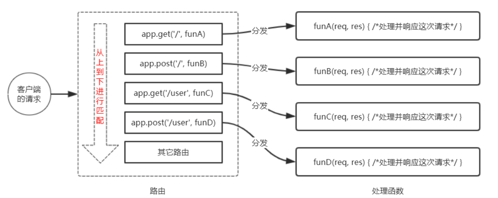

路由匹配的注意点:

- 按照定义的先后顺序进行匹配
- 请求类型和请求的URL同时匹配成功，才会调用对应的处理函数


#### 8.2.2 路由的简单使用

##### 1. 最简单的用法

在 Express 中使用路由最简单的方式，就是把路由挂载到 app 上，示例代码如下:

```jsx
const express = require('express')

const app = express()
// 挂载路由
app.get('/', function(req, res) {})
app.post('/', function(req, res) {})

app.listen(80, ()=> {})
```


##### 2. 模块化路由

为了方便对路由进行模块化的管理，Express **不建议**将路由直接挂载到 app 上，而是推荐将路由抽离为单独的模块。 将路由抽离为单独模块的步骤如下:

- 创建路由模块对应的 .js 文件
- 调用 express.Router() 函数创建路由对象
- 向路由对象上挂载具体的路由
- 使用 module.exports 向外共享路由对象 
- 使用 app.use() 函数注册路由模块


##### 3. 创建路由模块

```jsx
// 1. 导入 express
const express = require('express')
// 2. 创建路由对象
const router = express.Router()

// 3.挂载获取用户列表的路由
router.get('/user/list', (req,res)=> {
     res.send('Get user list')
})
// 4. 挂载添加用户的路由
router.get('/user/add', (req, res)=>{
     res.send('Get user add')
})
// 5. 向外导出路由对象
module.exports = router
```


##### 4. 注册路由模块

```jsx
// 1.1 导入路由模块
const userRouter = require('./05-router')
// 2. 使用 app.use() 注册路由模块
app.use(userRouter)
```

> app.use() 函数的作用，就是注册全局中间件


##### 5. 为路由模块添加前缀

类似于托管静态资源时，为静态资源统一挂载访问前缀一样，路由模块添加前缀的方式也非常简单:

```jsx
// 1.1 导入路由模块
const userRouter = require('./05-router')
// 2. 使用 app.use() 注册路由模块, 并添加统一的访问前缀 /api
app.use('/api',userRouter)
```


### 8.3 Express 中间件

#### 8.3.1 中间件的概念

##### 1. 什么是中间件

中间件(Middleware )，特指业务流程的中间处理环节。


##### 2. 现实生活中的例子

在处理污水的时候，一般都要经过三个处理环节，从而保证处理过后的废水，达到排放标准。

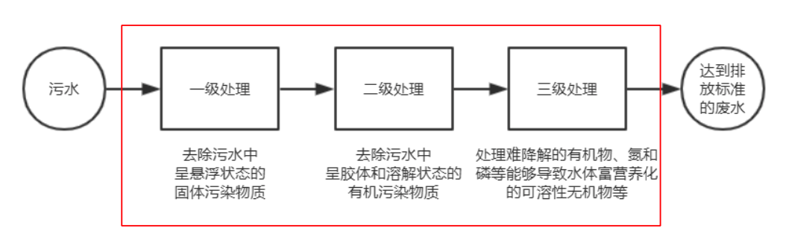

处理污水的这三个中间处理环节，就可以叫做中间件。

中间件必须有输入和输出，上一级的输出，就是是下一级的输入


##### 3. Express 中间件的调用流程

当一个请求到达 Express 的服务器之后，可以连续调用多个中间件，从而对这次请求进行预处理。

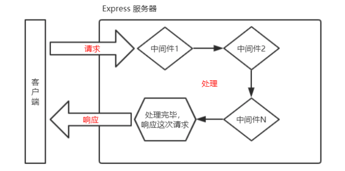


##### 4. Express 中间件的格式

Express 的中间件，本质上就是一个 **function** **处理函数**，Express 中间件的格式如下:

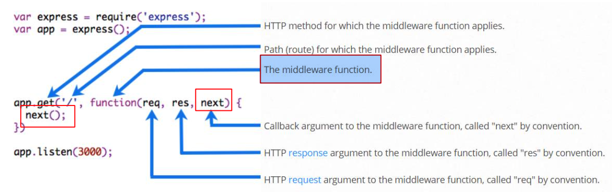

> 注意:
>
> 中间件函数的形参列表中，必须包含 next 参数。而路由处理函数中只包含 req 和 res。


##### 5. next 函数的作用

**next** **函数**是实现 `多个中间件` 连续调用的关键，它表示把流转关系转交给下一个中间件或路由。

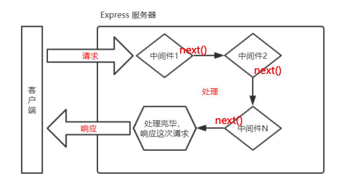


#### 8.3.2 Express 中间件的初体验

##### 1. 定义中间件函数

可以通过如下的方式，定义一个最简单的中间件函数:

```jsx
// 常量 mw 所指向的是一个中间件函数
const mw = function(req, res, next) {
     console.log('这是一个简单的中间件函数');
     // 注意: 在当前中间件的业务处理完毕后,必须调用 next() 函数
     // 表示把流转关系转交给下一个中间件或者路由
     next()
}
```


##### 2. 全局生效的中间件

客户端发起的任何请求，到达服务器之后，都会触发的中间件，叫做全局生效的中间件。 

通过调用 app.use(中间件函数)，即可定义一个全局生效的中间件，示例代码如下:

```jsx
// 常量 mw 所指向的是一个中间件函数
const mw = function(req, res, next) {
     console.log('这是一个简单的中间件函数');
     // 注意: 在当前中间件的业务处理完毕后,必须调用 next() 函数
     // 表示把流转关系转交给下一个中间件或者路由
     next()
}

// 全局的中间件
app.use(mw)
```

示例：

```jsx
// 1. 导入 express
const express = require('express')
// 1.1 导入路由模块
const userRouter = require('./05-router')

// 2. 创建 web 服务器
const app = express()

// 常量 mw 所指向的是一个中间件函数
const mw = function(req, res, next) {
     console.log('这是一个简单的中间件函数');
     // 注意: 在当前中间件的业务处理完毕后,必须调用 next() 函数
     // 表示把流转关系转交给下一个中间件或者路由
     next()
}

// 全局的中间件
app.use(mw)


// 2. 使用 app.use() 注册路由模块
app.use(userRouter)


/// 3. 启动服务器
app.listen(80, ()=> {
     console.log('express server running at 127.0.0.1:80');
}) 
```


##### 3. 定义全局中间的简化形式

```jsx
// 全局生效的中间件
app.use(function(req, res, next) {
     console.log('这是一个最简单的中间件函数');
     next()
})
```


##### 4. 中间件的作用

多个中间件之间，**共享同一份** **req** **和** **res**。基于这样的特性，我们可以在上游的中间件中，**统一**为 req 或 res 对象添

加自定义的属性或方法，供下游的中间件或路由进行使用。

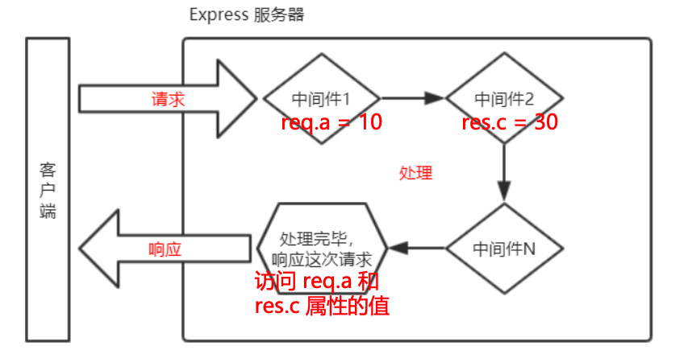


##### 5. 定义多个全局中间件

可以使用 app.use() 连续定义多个全局中间件。客户端请求到达服务器之后，会按照中间件定义的先后顺序依次进行 调用，示例代码如下:

```jsx
// 第一个中间件
app.use(function(req, res, next) {
     console.log('调用第一个中间件');
     next()
})

// 第二个中间件
app.use(function(req, res, next) {
     console.log('调用第二个中间件');
     next()
})

// 第三个中间件
app.use(function(req, res, next) {
     console.log('调用第三个中间件');
     next()
})
```


##### 6. 局部生效的中间件

**不使用** app.use() 定义的中间件，叫做局部生效的中间件，示例代码如下:

```jsx
const express = require('express');

const app = express()

const mw = function(req, res, next) {
     console.log('我是中间件函数');
     next()
}

// mw 这个中间件函数只在当前路由中生效,这种用户属于局部中间件
app.get('/', mw, function(req, res) {
     res.send('Home Page')
})

app.get('/user', function(req, res) {
     res.send('User page')
})

app.listen(80)
```


##### 7. 定义多个局部中间件

可以在路由中，通过如下两种等价的方式，使用多个局部中间件:

```jsx
// mw 这个中间件函数只在当前路由中生效,这种用户属于局部中间件
app.get('/', mw, mw1, function(req, res) {
     res.send('Home Page')
})

app.get('/', [mw, mw1], function(req, res) {
     res.send('Home Page')
})
```

多个中间件函数有两种方式：

- 可以通过 `,` 隔开
- 可以通过数组的形式


##### 8. 了解中间件的 5 个使用注意事项

- 一定要在路由之前注册中间件
- 客户端发送过来的请求，可以连续调用多个中间件进行处理
- 执行完中间件的业务代码之后，不要忘记调用 next() 函数
- 为了防止代码逻辑混乱，调用 next() 函数后不要再写额外的代码 
- 连续调用多个中间件时，多个中间件之间，共享 req 和 res 对象


#### 8.3.3 中间件的分类

为了方便大家理解和记忆中间件的使用，Express 官方把常见的中间件用法，分成了 5 大类，分别是: 

- 应用级别的中间件
- 路由级别的中间件
- 错误级别的中间件

- Express 内置的中间件 
- 第三方的中间件


##### 1. 应用级别的中间件

通过 `app.use()` 或 `app.get()` 或 `app.post()` ，绑定到 app 实例上的中间件，叫做应用级别的中间件，代码示例如下:

```js
app.get('/', [mw, mw1], function(req, res) {
     res.send('Home Page')
})

app.use(function(req, res, next) {
     next()
})
```


##### 2. 路由级别的中间件

绑定到 express.Router() 实例上的中间件，叫做路由级别的中间件。它的用法和应用级别中间件没有任何区别。只不 过，应用级别中间

件是绑定到 app 实例上，路由级别中间件绑定到 router 实例上，代码示例如下:

```jsx
// 2. 创建路由对象
const router = express.Router()

// 路由级别的中间件
router.use(function(req, res, next) {
     next()
})
```


##### 3. 错误级别的中间件

错误级别中间件的**作用**:专门用来捕获整个项目中发生的异常错误，从而防止项目异常崩溃的问题。

**格式**:错误级别中间件的 function 处理函数中，必须有 4 个形参，形参顺序从前到后，分别是 (err, req, res, next)。

```jsx
// 路由
app.get('/', function(req, res) { 
     // 抛出一个自定义的错误
     throw new Error('服务器内部发生了错误')
     res.send('Home Page')
})

// 错误级别的中间件
app.use(function(err, req, res, next) {
     // 在服务器打印错误消息
     console.log('发生了错误' + err.message);
     // 向客户端响应错误的相关信息
     res.send('Error' + err.message)
})
```

错误级别中间件的 function 处理函数中，必须有 4 个形参，形参顺序从前到后，分别是 (err, req, res, next)。

> **注意:**
>
> 错误级别的中间件， 必须注册在所有路由之后!


##### 4. Express 内置的中间件

自 Express 4.16.0 版本开始，Express 内置了 3 个常用的中间件，极大的提高了 Express 项目的开发效率和体验: 

- `express.static` 快速托管静态资源的内置中间件，例如: HTML 文件、图片、CSS 样式等(无兼容性)

- `express.json` 解析 JSON 格式的请求体数据(有兼容性，仅在 4.16.0+ 版本中可用)

- `express.urlencoded` 解析 URL-encoded 格式的请求体数据(有兼容性，仅在 4.16.0+ 版本中可用

```js
// 配置解析 application/json 格式数据的内置中间件
app.use(express.json())

// 配置解析 application/x-www-form-urlencoded 格式数据的内置中间件
app.use(express.urlencoded({ extended: false}))
```


##### 5. 第三方的中间件

非 Express 官方内置的，而是由第三方开发出来的中间件，叫做第三方中间件。在项目中，大家可以按需下载并配置 第三方中间件，从

而提高项目的开发效率。

例如:在 express@4.16.0 之前的版本中，经常使用 body-parser 这个第三方中间件，来解析请求体数据。使用步 骤如下:

- 运行 npm install body-parser 安装中间件 
- 使用 require 导入中间件
- 调用 app.use() 注册并使用中间件

> 注意:
> Express 内置的 express.urlencoded 中间件，就是基于 body-parser 这个第三方中间件进一步封装出来的。


#### 8.3.4 自定义中间件

##### 1. 需求的描述与实现步骤

自己手动模拟一个类似于 express.urlencoded 这样的中间件，来解析 POST 提交到服务器的表单数据。

 实现步骤:

- 定义中间件
- 监听req的data事件
- 监听req的end事件
- 使用 querystring 模块解析请求体数据 
- 将解析出来的数据对象挂载为 req.body 
- 将自定义中间件封装为模块


##### 2. 定义中间件

使用 app.use() 来定义全局生效的中间件，代码如下:

```jsx
const express = require('express')

const app = express()

app.use(function(req, res, next) {
     // 中间件的业务逻辑
})
```


##### 3. 监听 req 的 data 事件

在中间件中，需要监听 req 对象的 data 事件，来获取客户端发送到服务器的数据。

如果数据量比较大，无法一次性发送完毕，则客户端会把数据切割后，分批发送到服务器。所以 data 事件可能会触 发多次，每一次触发 

data 事件时，获取到数据只是完整数据的一部分，需要手动对接收到的数据进行拼接。

```jsx
app.use(function(req, res, next) {
     // 中间件的业务逻辑
     // 定义变量, 用来存储客户端发送过来的请求数据
     let str = ''
     // 监听 req 的 data 时间: 客户端发送过来的新的请求体数据
     req.on('data',function(chunk) {
          // 拼接请求体数据,隐式转换为字符串
          str += chunk
     })
})
```


##### 4. 监听 req 的 end 事件

当请求体数据接收完毕之后，会自动触发 req 的 end 事件。

因此，我们可以在 req 的 end 事件中，拿到并处理完整的请求体数据。示例代码如下:

```jsx
// 监听 req 对象的 end 事件,请求体发送完毕自动触发
req.on('end', function() {
    // 打印完整的请求体数据
    console.log(str);
    // TODO: ba 把字符串格式的请求体数据,解析成对象格式
})
```


#####  5. 使用 querystring 模块解析请求体数据

Node.js 内置了一个 querystring 模块，专门用来处理查询字符串。通过这个模块提供的 parse() 函数，可以轻松把 查询字符串，解析成

对象的格式。示例代码如下:

```js
const qs = require('querystring')

const body = qs.parse(str)
```


##### 6. 将解析出来的数据对象挂载为 req.body

上游的中间件和下游的中间件及路由之间，**共享同一份** **req** **和** **res**。因此，我们可以将解析出来的数据，挂载为 req 的自定义属性，命名

为 req.body，供下游使用。示例代码如下:

```jsx
// 监听 req 对象的 end 事件,请求体发送完毕自动触发
req.on('end', function() {
    // 打印完整的请求体数据
    console.log(str);
    // TODO: ba 把字符串格式的请求体数据,解析成对象格式
    const body = qs.parse(str)
    req.body = body
    next()
})
```


##### 7. 完整代码

```jsx
const express = require('express')
const qs = require('querystring')

const app = express()

app.use(function(req, res, next) {
     // 中间件的业务逻辑
     // 定义变量, 用来存储客户端发送过来的请求数据
     let str = ''
     // 监听 req 的 data 时间: 客户端发送过来的新的请求体数据
     req.on('data',function(chunk) {
          // 拼接请求体数据,隐式转换为字符串
          str += chunk
     })
     // 监听 req 对象的 end 事件,请求体发送完毕自动触发
     req.on('end', function() {
          // 打印完整的请求体数据
          console.log(str);
          // TODO: ba 把字符串格式的请求体数据,解析成对象格式
          const body = qs.parse(str)
          req.body = body
          next()
     })
})

app.listen(80)

```


##### 8. 将自定义中间件封装为模块

为了优化代码的结构，我们可以把自定义的中间件函数，封装为独立的模块，示例代码如下:

`custom-body-parser.js`

```jsx
const qs = require('querystring')

const bodyParser = function (req, res, next) {
     // 中间件的业务逻辑
     // 定义变量, 用来存储客户端发送过来的请求数据
     let str = ''
     // 监听 req 的 data 时间: 客户端发送过来的新的请求体数据
     req.on('data',function(chunk) {
          // 拼接请求体数据,隐式转换为字符串
          str += chunk
     })
     // 监听 req 对象的 end 事件,请求体发送完毕自动触发
     req.on('end', function() {
          // 打印完整的请求体数据
          console.log(str);
          // TODO: ba 把字符串格式的请求体数据,解析成对象格式
          const body = qs.parse(str)
          req.body = body
          next()
     })
}

module.exports = bodyParser
```

使用自定义中间件的使用：

```jsx
// 导入自己封装的中间件模块
const customBodyParser = require('./custom-body-parser.js')

app.use(customBodyParser)
```


### 8.4 使用 Express 写接口

#### 8.4.1 创建基本的服务器

```js
// 导入 express
const express = require('express')

// 创建服务器实例
const app = express()


// 启动服务器
app.listen(80, ()=> {
     console.log('express server running at 127.0.0.1:80');
})
```


#### 8.4.2 创建 API 路由模块

`ApiRouter.js`:

```js
// 导入 express
const express = require('express')

const router = express.Router()

// 挂载路由

module.exports = router
```

导入使用路由：

```jsx
// 导入路由模块
const router = require('./apiRouter')
// 把路由模块注册到 app
app.use('/api',router)

```


#### 8.4.3 编写 GET 接口

`ApiRouter.js`:

```js
// 挂载路由
apiRouter.get('/get', (req, res)=> {
     const query = req.query
     res.send({
          status: 0 ,
          msg: 'Get 请求成功',
          data: query
     })
})
```


#### 8.4.4 编写 POST 接口

```js
apiRouter.post('/post', (req, res)=> {
     const bodu = req.body
     res.send({
          status: 0 ,
          msg: 'Post 请求成功',
          data: bodu
     })
})
```

> 注意:
>
> 如果要获取 URL-encoded 格式的请求体数据，
>
> 必须配置中间件 app.use(express.urlencoded({ extended: false }))


#### 完整代码

`ApiRouter.js`

```js
// 导入 express
const express = require('express')

const apiRouter = express.Router()

// 挂载路由
apiRouter.get('/get', (req, res)=> {
     const query = req.query
     res.send({
          status: 0 ,
          msg: 'Get 请求成功',
          data: query
     })
})

apiRouter.post('/post', (req, res)=> {
     const bodu = req.body
     res.send({
          status: 0 ,
          msg: 'Post 请求成功',
          data: bodu
     })
})
module.exports = apiRouter
```

使用文件：

```jsx
// 导入 express
const express = require('express')

// 创建服务器实例
const app = express()

// 导入路由模块
const router = require('./apiRouter')
// 把路由模块注册到 app
app.use('/api',router)

// 启动服务器
app.listen(80, ()=> {
     console.log('express server running at 127.0.0.1:80');
})
```


#### 8.4.5 CORS 跨域资源共享

##### 1. 接口的跨域问题

刚才编写的 GET 和 POST接口，存在一个很严重的问题：不支持跨域请求。 

解决接口跨域问题的方案主要有两种:

- CORS(主流的解决方案，推荐使用)
- JSONP(有缺陷的解决方案：只支持 GET 请求)


##### 2. 使用 **cors 中间件**解决跨域问题

cors 是 Express 的一个第三方中间件。通过安装和配置 cors 中间件，可以很方便地解决跨域问题。 

使用步骤分为如下 3 步:

- 运行 `npm install cors` 安装中间件
- 使用 `const cors = require('cors')` 导入中间件

- 在路由之前调用 `app.use(cors())` 配置中间件


##### 3. 什么是 CORS

CORS (Cross-Origin Resource Sharing，跨域资源共享)由一系列 HTTP 响应头组成，**这些** **HTTP** **响应头决定**

**浏览器是否阻止前端** **JS** **代码跨域获取资源**。

浏览器的同源安全策略默认会阻止网页“跨域”获取资源。但如果接口服务器配置了 CORS 相关的 HTTP 响应头， 

就可以解除浏览器端的跨域访问限制。

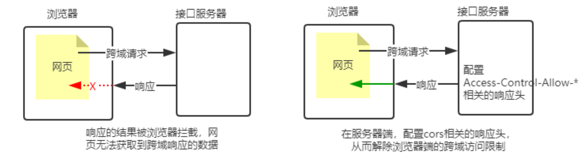


##### 4. CORS的注意事项

- CORS 主要在服务器端进行配置。客户端浏览器**无须做任何额外的配置**，即可请求开启了 CORS 的接口。

- CORS 在浏览器中有兼容性。只有支持 XMLHttpRequest Level2 的浏览器，才能正常访问开启了 CORS 的服 

  务端接口(例如:IE10+、Chrome4+、FireFox3.5+)。

  

##### 5. CORS 响应头部 - Access-Control-Allow-`Origin`

响应头部中可以携带一个 **Access-Control-Allow-Origin** 字段，其语法如下:

```JS
Access-Control-Allow-Origin: <origin> | *
```

其中，origin 参数的值指定了允许访问该资源的外域 URL。 

例如，下面的字段值将**只允许**来自 http://itcast.cn 的请求:

```JS
res.setHeader('Access-Control-Allow-Origin', 'http://itcaset.com')
```

如果指定了 Access-Control-Allow-Origin 字段的值为通配符 *****，表示允许来自任何域的请求，示例代码如下:

```JS
res.setHeader('Access-Control-Allow-Origin', '*')
```


##### 6. CORS 响应头部 - Access-Control-Allow-`Headers`

默认情况下，CORS **仅**支持客户端向服务器发送如下的 9 个请求头:

Accept、Accept-Language、Content-Language、DPR、Downlink、Save-Data、Viewport-Width、Width 、 

Content-Type (值仅限于 text/plain、multipart/form-data、application/x-www-form-urlencoded 三者之一)

如果客户端向服务器发送了额外的请求头信息，则需要在服务器端，通过 Access-Control-Allow-Headers 对额外 

的请求头进行声明，否则这次请求会失败!

```JS
// 允许客户端额外向服务器发送 Content-Type 请求头和 X-Custom-Header 请求头
// 注意：多个请求头之间使用英文的逗号进行分割
res.setHeader('Access-Control-Allow-Headers', 'Content-Type, X-Custom-Header')
```


##### 7. CORS 响应头部 - Access-Control-Allow-`Methods`

默认情况下，CORS 仅支持客户端发起 GET、POST、HEAD 请求。

如果客户端希望通过 PUT、DELETE 等方式请求服务器的资源，则需要在服务器端，

通过 Access-Control-Alow-Methods 来指明实际请求所允许使用的 HTTP 方法。

示例代码如下:

```JSX
// 只允许 GET、POST、HEAD, DELETE 请求方法
res.setHeader('Access-Control-Allow-Methods', 'GET、POST、HEAD, DELETE')

// 允许所有的 HTTP 请求方法
res.setHeader('Access-Control-Allow-Methods', '*')
```


##### 8. CORS 请求的分类

客户端在请求 CORS 接口时，根据请求方式和请求头的不同，可以将 CORS 的请求分为两大类，分别是: 

- 简单请求
- 预检请求


##### 9. 简单请求

同时满足以下两大条件的请求，就属于简单请求:

- 请求方式:GET、POST、HEAD 三者之一

- HTTP 头部信息不超过以下几种字段:无自定义头部字段、Accept、Accept-Language、Content-Language、

  DPR、 Downlink、Save-Data、Viewport-Width、Width 、Content-Type(只有三个值application/x-www-

  form- urlencoded、multipart/form-data、text/plain)


##### 10. 预检请求

只要符合以下任何一个条件的请求，都需要进行预检请求:

- 请求方式为 GET、POST、HEAD 之外的请求 Method 类型 
- 请求头中包含自定义头部字段
- 向服务器发送了 application/json 格式的数据


在浏览器与服务器正式通信之前，浏览器会先发送 OPTION 请求进行预检，以获知服务器是否允许该实际请求，

所以这一 次的 OPTION 请求称为“预检请求”。服务器成功响应预检请求后，才会发送真正的请求，并且携带真实

数据。


##### 11. 简单请求与预检请求

**简单请求的特点**：客户端与服务器之间只会发生一次请求。

 **预检请求的特点**：客户端与服务器之间会发生两次请求，`OPTION` 预检请求成功之后，才会发起真正的请求。


#### 8.4.6 JSONP 接口

##### 1. 回顾 JSONP 的概念和特点

概念：浏览器端通过 `<script>` 标签的 src 属性，请求服务器上的数据，同时，服务器返回一个函数的调用。这种

请求数据的方式叫做 JSONP。
特点:

- `JSONP` 不属于真正的 `Ajax` 请求，因为它没有使用 `XMLHttpRequest` 这个对象。 
- `JSONP` 仅支持 `GET` 请求，不支持 `POST`、`PUT`、`DELETE` 等请求。


##### 2. 创建 JSONP 接口的注意事项

如果项目中已经配置了 `CORS` 跨域资源共享，为了**防止冲突**，必须在配置 `CORS` 中间件之前声明  `JSONP` 的接口。

否则 `JSONP` 接口会被处理成开启了 `CORS` 的接口。

示例代码如下:

```js
// 优先创建 JSONP 接口，这个接口不会被处理成 CORS 接口
app.get('/api/jsonp', (req, res)=>{})

// 在配置 CORS 中见面就：后续所有的接口，都会被处理成 CORS 接口
app.use(cors())

// 这是一个开启了 CORS 的接口
app.get('/api/get', (req, res)=>{
  
})
```


##### 3. 实现 JSONP 接口的步骤

- 获取客户端发送过来的回调函数的名字
- 得到要通过  `JSONP` 形式发送给客户端的数据
- 根据前两步得到的数据，拼接出一个函数调用的字符串
- 把上一步拼接得到的字符串，响应给客户端的 `<script>` 标签进行解析执行


##### 4. 实现 JSONP 的具体代码

````js
app.get('/api/jsonp', (req, res)=> {
  	const funcNmae =req.query.callbak
    
    const data = {name: 'zd', age: 22}
  
	  const scripeStr = `${funcNmae}(${JSON.stringify(data)})`

    res.send(scripeStr)
})
````


##### 5. 在网页中使用 jQuery 发起 JSONP 请求

调用 `$.ajax()` 函数，提供  `JSONP` 的配置选项，从而发起  `JSONP` 请求，示例代码如下:

```js
$('#btb'),click(functon {
		$.ajax({
    		type: 'GET',
        url : '',
        dateType: 'jsonp', // 表示要发起 JSONP 请求
        success: ()=>{
  
				}
		})                
})
```


## 九、MySQL 和身份认证

### 9.1 数据库的基本概念

#### 9.1.1 什么是数据库

数据库(database)是用来组织、存储和管理数据的仓库。 当今世界是一个充满着数据的互联网世界，充斥着大量的数据。

数据的来源有很多，比如出行记录、消费记录、浏览的网页、发送的消息等等。除了文本类型的数据，图像、音乐、声音都是数据。

为了方便管理互联网世界中的数据，就有了数据库管理系统的概念(简称：数据库)。用户可以对数据库中的数据进行新增、查询、更新、

删除等操作。


#### 9.1.2 常见的数据库和分类

市面上的数据库有很多种，最常见的数据库有如下几个:

- MySQL 数据库(目前使用最广泛、流行度最高的开源免费数据库; Community + Enterprise) 
- Oracle 数据库(收费)
- SQL Server 数据库(收费)
- Mongodb 数据库(Community + Enterprise)


其中，MySQL、Oracle、SQL Server 属于**传统型数据库**(又叫做:关系型数据库 或 SQL 数据库)，这三者的 设计理

念相同，用法比较类似。

而 Mongodb 属于**新型数据库**(又叫做：非关系型数据库 或 NoSQL 数据库)，它在一定程度上弥补了传统型 数据库

的缺陷。


#### 9.1.3 传统型数据库的数据组织结构

数据的组织结构：指的就是数据以什么样的结构进行存储。

传统型数据库的数据组织结构，与 Excel 中数据的组织结构 比较类似。

因此，我们可以对比着 Excel 来了解和学习传统型数据库的 数据组织结构。


##### 1. Excel  的数据组织结构

每个 Excel 中，数据的组织结构分别为工作簿、工作表、数据行、列这 4 大部分组成。

- 整个 Excel 叫做工作簿
- users 和 books 是工作表
- users 工作表中有 3 行数据 
- 每行数据由 6 列信息组成
- 每列信息都有对应的数据类型

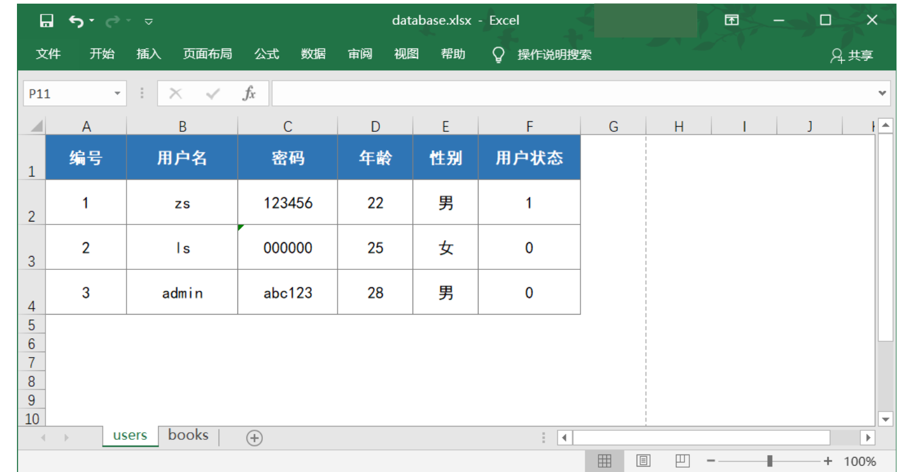


##### 2. 传统型数据库的数据组织结构

在传统型数据库中，数据的组织结构分为数据库(database)、数据表(table)、数据行(row)、字段(field)这 4 大部分

组成。

- 数据库类似于 Excel 的工作簿
- 数据表类似于 Excel 的工作表
- 数据行类似于 Excel 的每一行数据 
- 字段类似于 Excel 的列
- 每个字段都有对应的数据类型


##### 3. 实际开发中的库、表、行、字段的关系

- 在实际项目开发中，一般情况下，每个项目都对应独立的数据库。

- 不同的数据，要存储到数据库的不同表中，例如：用户数据存储到 users 表中，图书数据存储到 books 表中。

- 每个表中具体存储哪些信息，由字段来决定，例如：我们可以为 users 表设计 id、username、password 这 3 

  个 字段。

- 表中的行，代表每一条具体的数据。

  

### 9.2 安装并配置 MySQL

#### 9.2.1 了解需要安装哪些 MySQL 相关的软件

对于开发人员来说，只需要安装 `MySQL Server` 和 `MySQL Workbench` 这两个软件，就能满足开发的需要了。

- MySQL Server：专门用来提供数据存储和服务的软件。

- MySQL Workbench：可视化的 MySQL 管理工具，通过它，可以方便的操作存储在 MySQL Server 中的数

  据。


#### 9.2.2 MySQL 在 Mac 环境下的安装

在 Mac 环境下安装 MySQL 的过程比 Windows 环境下的步骤简单很多:

- 先运行 **mysql-8.0.19-macos10.15-x86_64.dmg** 这个安装包，将 MySQL Server 安装到 Mac 系统

- 再运行 **mysql-workbench-community-8.0.19-macos-x86_64.dmg** 这个安装包，将可视化的 MySQL 

- Workbench 工具安装到 Mac 系统

  

具体的安装教程，可以参考 素材 -> MySQL for Mac ->安装教程 - Mac系统安装MySql -> README.md


#### 9.2.3 MySQL 在 Win 环境下的安装

在 Windows 环境下安装 MySQL，只需要运行 **mysql-installer-community-8.0.19.0.msi** 这个安装包，就能一

次 性将 MySQL Server 和 MySQL Workbench 安装到自己的电脑上。

具体的安装教程，可以参考 素材 -> MySQL for Windows ->安装教程 - Windows系统安装MySql -> README.md


### 9.3 MySQL 的基本使用

#### 9.3.1 使用 MySQL Workbench 管理数据库

##### 1. 连接数据库

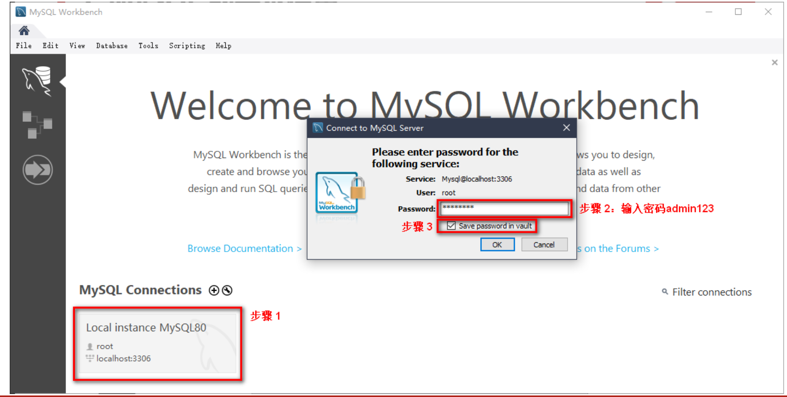


##### 2. 了解主界面的组成部分

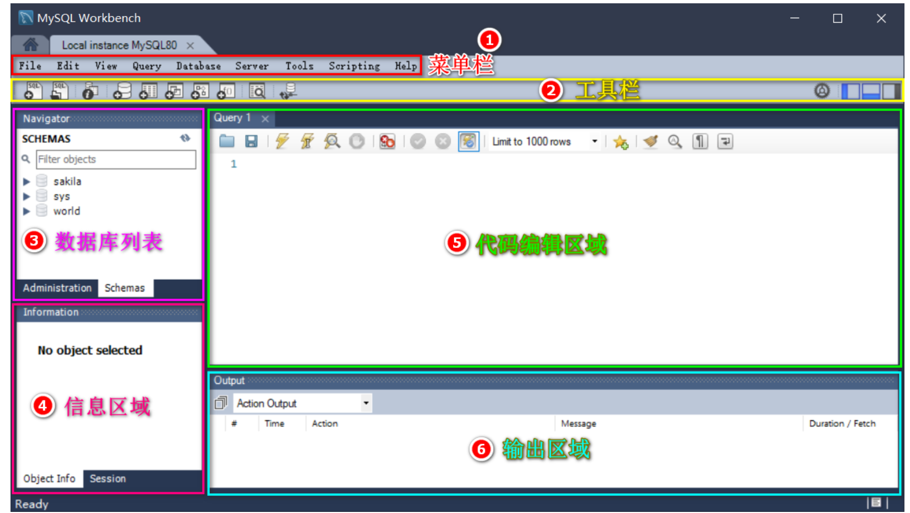


##### 3. 创建数据库

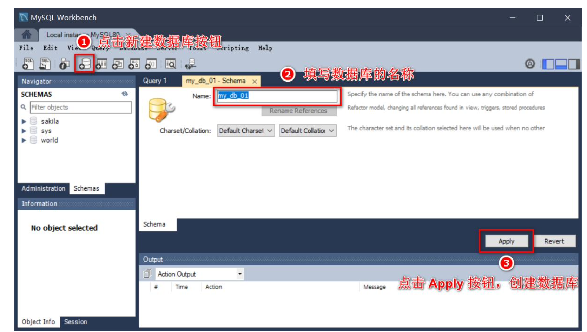


##### 4. 创建数据表

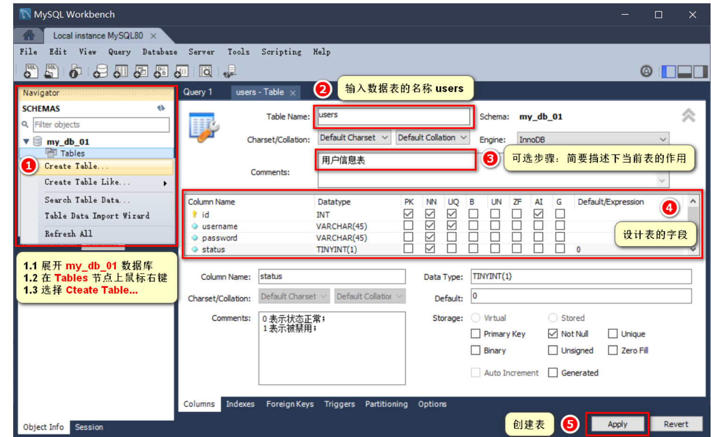

 

DataType 数据类型: 

- int整数
- varchar(len) 字符串 
- tinyint(1) 布尔值 

字段的特殊标识:

- PK(Primary Key)主键、唯一标识 
- NN(Not Null)值不允许为空
- UQ(Unique)值唯一
- AI(Auto Increment)值自动增长 


##### 5. 向表中写入数据

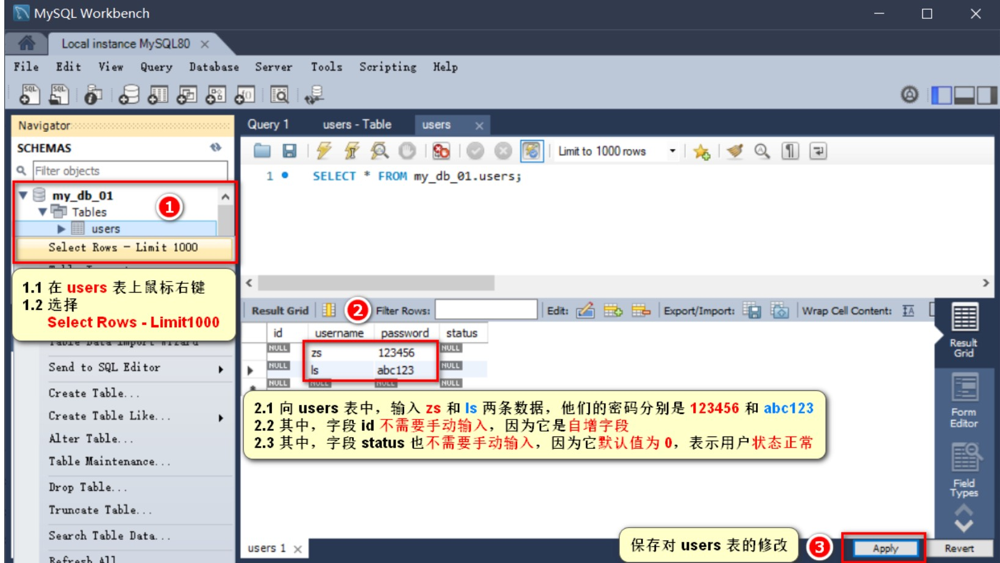


#### 9.3.2 使用 SQL 管理数据库

##### 1. 什么是 SQL

SQL(英文全称:Structured Query Language)是结构化查询语言，专门用来访问和处理数据库的编程语言。

能够让我们**以编程的形式**，**操作数据库里面的数据**。

三个关键点:

- SQL 是一门数据库编程语言
- 使用 SQL 语言编写出来的代码，叫做 SQL 语句

- SQL 语言只能在关系型数据库中使用(例如 MySQL、Oracle、SQL Server)。非关系型数据库(例如 Mongodb) 不支持 SQL 语言

  

##### 2. SQL 能做什么

- 从数据库中查询数据
- 向数据库中插入新的数据
- 更新数据库中的数据
- 从数据库删除数据
- 可以创建新数据库
- 可在数据库中创建新表
- 可在数据库中创建存储过程、视图 
- etc...


##### 3. SQL 的学习目标

重点掌握如何使用 SQL 从数据表中:

查询数据(select) 、插入数据(insert into) 、更新数据(update) 、删除数据(delete)

额外需要掌握的 4 种 SQL 语法:

where 条件、and 和 or 运算符、order by 排序、count(*) 函数


#### 9.3.3 SQL 的 SELECT 语句

##### 1. 语法

SELECT 语句用于从表中查询数据。执行的结果被存储在一个结果表中(称为结果集)。

语法格式如下:

```sql
--- 从 FROM 指定的表中，查询到所有的数据。 * 表示所有列
SELECT * FROM 表名称

--- 从 FROM 指定的表中，查询出指定的列名称字段的数据
SELECT 列名称 FROM 表名称
```

>   注意：
>
> SQL 语句中的关键字对**大小写不敏感**。SELECT 等效于 select，FROM 等效于 from。


##### 2. SELECT * 示例

我们希望从 users 表中选取所有的列，可以使用符号 * 取代列的名称，示例如下:

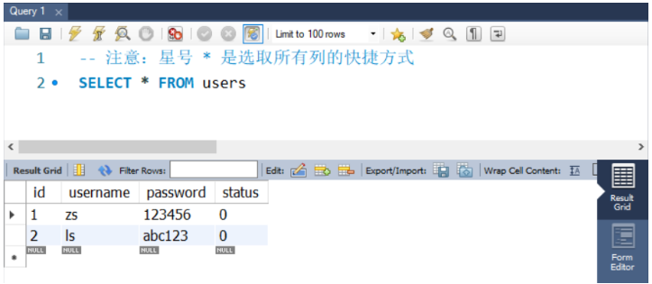

##### 3. SELECT 列名称 示例

如需获取名为 "username" 和 "password" 的列的内容(从名为 "users" 的数据库表)，请使用下面的 SELECT 语句:

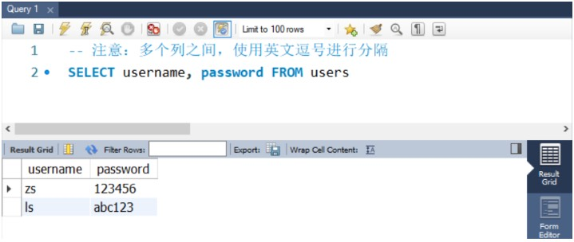

#### 9.3.4 SQL  的 INSERT INTO 语句

##### 1. 语法

INSERT INTO 语句用于向数据表中插入新的数据行，语法格式如下:

```js
-- 向指定的表中，插入如下几列数据，列的值通过 values --指定
-- 注意：列和值要一一对应，多个列和多个值之间，使用英文逗号分割
INSERT INTO 表名 (列 1，列 2，...) VALUES (值 1，值 2，...)
```


##### 2. INSERT INTO 示例

向 users 表中，插入一条 username 为 tony stark，password 为 098123 的用户数据，示例如下:

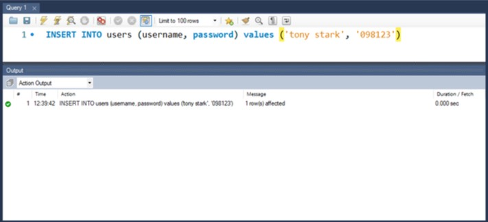

```SQL
insert into users (username, password) values ("王五1", "fsdf132");
```


#### 9.3.5 SQL 的 UPDATE 语句

##### 1. 语句

Update 语句用于修改表中的数据。语法格式如下:

``` 
--- 用 update 指定要更新哪个表中的数据
--- 用 set 指定列对应的新值
--- 用 WHERE 指定要更新的条件
--- 更新多列数据，用英文逗号隔开
UPDATE 表名称 SET 列名称=新值 WHERE 列名称=某值
```


##### 2. UPDATE 示例 - 更新某一列中的一个列

把 users 表中 id 为 7 的用户密码，更新为 888888。示例如下:


```sql
update users set password='11111111' where username='王五';
```


##### 3. UPDATE 示例 - 更新某一行中的若干列

把 users 表中 id 为 2 的用户密码和用户状态，分别更新为 admin123 和 1。示例如下:

```jsx
update users set password='admin123', status=1 where id=2;
```


#### 9.3.6 SQL 的DELETE 语句

##### 1. 语句

DELETE 语句用于删除表中的行。语法格式如下:

```sql
--- 语法解读：
--- 从指定的表中，根据 WHERE 条件，删除对应的数据
DELETE FROM 表名 WHERE 列名称 = 值
```


##### 2. DELETE 示例：

从 users 表中，删除 id 为 4 的用户，示例如下:

```sqlite
DELETE FROM users WHERE id = 4
```


#### 9.3.7 SQL 的 WHERE 子句

##### 1. 语法

WHERE 子句用于限定选择的标准。在 SELECT、UPDATE、DELETE 语句中，皆可使用 WHERE 子句来限定选择的标准。

```sql
--- 查询语句中的 WHERE 条件
SELECT 列名称 FROM 表名称 WHERE 列 运算符 值

--- 更新语句中的 WHERE 条件
UPDATE 表名称 SET 列=新值 WHERE 列 运算符 值

--- 删除语句中的 WHERE 条件
DELETE FROM 表名称 列 运算符 值
```


##### 2. 可在 WHERE 子句中使用的运算符

下面的运算符可在 WHERE 子句中使用，用来限定选择的标准:

| **操作符** | **描述**     |
| :--------- | :----------- |
| =          | 等于         |
| `<>`       | 不等于       |
| >          | 大于         |
| <          | 小于         |
| >=         | 大于等于     |
| <=         | 小于等于     |
| BETWEEN    | 在某个范围内 |
| LIKE       | 搜索某周模式 |

注意:在某些版本的 SQL 中，操作符 `<>` 可以写为 `!=`


##### 3. WHERE 子句示例

可以通过 WHERE 子句来限定 SELECT 的查询条件:

```sql
--- 查询 status 为 1 的所有用户
SELECT * FROM users WHERE status = 1

--- 查询 id 大于 2 的所有用户
SELECT * FROM users WHERE status > 2

--- 查询 username 不等于 admin 的所有用户
SELECT * FROM users WHERE username <> 'admin'
```


#### 9.3.8 SQL 的 AND 和 OR 运算符

##### 1.语法

AND 和 OR 可在 WHERE 子语句中把两个或多个条件结合起来。

AND 表示必须同时满足多个条件，相当于 JavaScript 中的 && 运算符，例如 if (a !== 10 && a !== 20) 

OR 表示只要满足任意一个条件即可，相当于 JavaScript 中的 || 运算符，例如 if(a !== 10 || a !== 20)


##### 2. AND 运算符示例

使用 AND 来显示所有 status 为 0，并且 id 小于 3 的用户:

```sql
SELECT * FROM users WHERE status=0 AND id < 3
```


##### 3. OR 运算符示例

使用 OR 来显示所有 status 为 1，或者 username 为 zs 的用户:

```
SELECT * FROM user WHERE status =1 OR username='zs'
```


#### 9.3.9 SQL 的 ORDER BY 子句

##### 1. 语法

ORDER BY 语句用于根据指定的列对结果集进行排序。

ORDER BY 语句**默认**按照升序对记录进行排序。 

如果您希望按照**降序**对记录进行排序，可以使用 DESC 关键字。

- ASC 升序
- DESC 降序


##### 2. ORDER BY 子句 - 升序排序

对 users 表中的数据，按照 status 字段进行升序排序，示例如下:

```sql
SELECT * FROM user ORDER BY status;
SELECT * FROM user ORDER BY statu ASC;
```


##### 3. ORDER BY 子句 - 降序排序

对 users 表中的数据，按照 id 字段进行降序排序，示例如下:

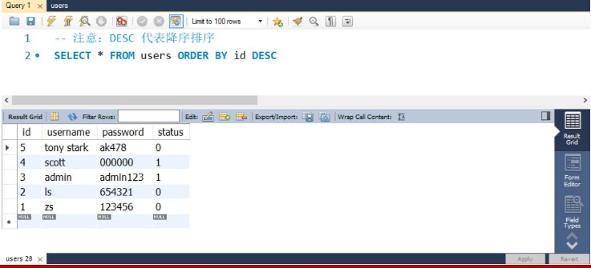

```sql
SELECT * FROM users ORDER BY id DESC;
```


##### 4. ORDER BY 子句 - 多重排序

对 users 表中的数据，先按照 status 字段进行降序排序，再按照 username 的字母顺序，进行升序排序，示例如下:

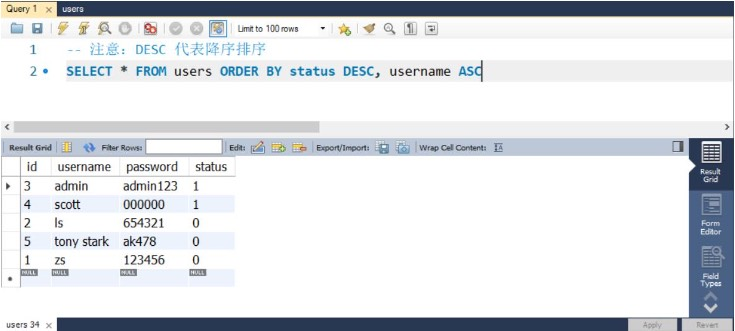

```sql
SELECT * FROM users ORDER BY status DESC, username ASC;
```


#### 9.3.10 SQL 的 COUNT(*) 函数

##### 1. 语法

COUNT(*) 函数用于返回查询结果的总数据条数，语法格式如下

```jsx
SELECT COUNT(*) FROM 表名称
```


##### 2. COUNT(*) 示例

查询 users 表中 status 为 0 的总数据条数:

```jsx
SELECT COUNT(*) FROM users WHERE status = 0
```


##### 3. 使用 AS 为列设置别名

如果希望给查询出来的列名称设置别名，可以使用 AS 关键字，示例如下:

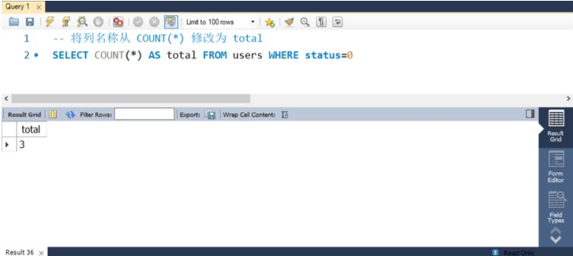


### 9.4 在项目中操作 MySQL

#### 9.4.1 在项目中操作数据库的步骤

- 安装操作 MySQL 数据库的第三方模块(mysql) 
- 通过 mysql 模块连接到 MySQL 数据库
- 通过 mysql 模块执行 SQL 语句

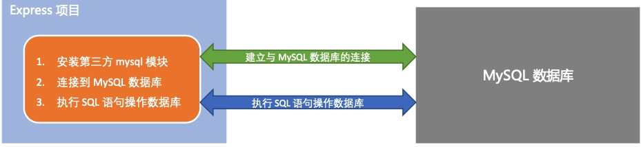


#### 9.4.2 安装与配置 mysql 模块

##### 1. 安装 mysql 模块

mysql 模块是托管于 npm 上的第三方模块。它提供了在 Node.js 项目中连接和操作 MySQL 数据库的能力。 想要在项目中使用它，需要

先运行如下命令，将 mysql 安装为项目的依赖包:

```js
npm install mysql
```


##### 2. 配置 mysql 模块

在使用 mysql 模块操作 MySQL 数据库之前，必须先对 mysql 模块进行必要的配置，主要的配置步骤如下:

```jsx
// 1. 导入 mysql 模块
const mysql = require('mysql')
// 2. 建立与 mysql 数据库的连接
const db = mysql.createPool ({
  	host: '127.0.0.1',         // 数据库的 IP 地址
  	user: 'root',							 // 登录数据库的账号
  	password: 'admin123',      // 登录数据库的密码
		database: 'my_db_01',      // 指定要操作哪个数据库
})
```


##### 3. 测试 mysql 模块能否正常工作

调用 db.query() 函数，指定要执行的 SQL 语句，通过回调函数拿到执行的结果:

```sql
db.query('SELECT 1',  (err, results)=> {
		if (err) {
    		console.log(err)
        return
		}         
    console.log(results)
})
```


#### 9.4.3 使用 mysql 模块操作 MySQL 数据库

##### 1.查询数据

查询 users 表中的所有数据

```jsx
// 查询 users 表中的用户数据
db.query('SELECT * FROM users', (err, results)=> {
		// 查询失败
  	if(err) {
      	console.log(err.message)
      	return
    }
  	// 查询成功
  	console.log(results)
})
```

获取的结果是数组


##### 2. 插入数据

向 users 表中新增数据， 其中 username 为 Spider-Man，password 为 pcc321。示例代码如下:

```jsx
// 要插入的数据
const user = {username: 'Spider-Man', password: 'pcc321'}
// 待执行的 sql 语句,其中 ? 是占位符
const qr = 'insert into users (username, password) values(?, ?)'
// 使用数组的形式,依次为 ? 占位符指定具体的值
db.query(qr, [user.username, user.password], (err, results) => {
     if (err) {
          console.log(err.message);
          return
     }
     if (results.affectedRows === 1) {
          console.log('插入数据成功');
     }
})
```


##### 3. 插入数据的便捷方式

向表中新增数据时，如果数据对象的每个属性和数据表的字段**一一对应**，则可以通过如下方式快速插入数据:

```jsx
// 要出啊如到 users 表中的数据对象
const user2r = {username: 'z反倒3是', password: 'xxfdsx'}
// 待执行的 sql 语句,其中 ? 表示占位符
const sqlStr = 'insert into users SET ?'
// 直接将数据当做占位符的值
db.query(sqlStr, user2r,(err, results) => {
     if (err) {
          console.log(err.message);
          return
     }
     if (results.affectedRows === 1) {
          console.log('插入数据成功');
     }
})
```

> insert into users SET ? : set ? 简化写法，不需要一一对应每个字段值

##### 4.更新数据

可以通过如下方式，更新表中的数据:

```js
// 要更新的数据对象
const user = {id : 8, username:"反倒是", password: '0000'}
// 待执行的 sql 语句
const sqlStr = 'update users set username=?, password=? where id=?'
db.query(sqlStr, [user.username, user.password, user.id], (err, results)=> {
     if (err) {
          console.log(err.message);
          return
     }
     if (results.affectedRows === 1) {
          console.log('更新数据成功');
     }
})
```


##### 5. 更新数据的便捷模式

更新表数据时，如果数据对象的每个属性和数据表的字段**一一对应**，则可以通过如下方式快速更新表数据:

```jsx
// 1. 要更新的数据对象
const user = {id : 8, username:"11111111", password: '000fd0'}
// 2. 待执行的 sql 语句
const sqlStr = 'update users set ? where id=?'
// 调用 query 执行语句
db.query(sqlStr, [user, user.id], (err, results)=> {
     if (err) {
          console.log(err.message);
          return
     }
     if (results.affectedRows === 1) {
          console.log('更新数据成功');
     }
})
```


##### 6. 删除数据

在删除数据时，推荐根据 id 这样的唯一标识，来删除对应的数据。示例如下:

```jsx
// 删除数据
// 1. 待执行的 sql 语句
const sqlStr = 'delete from users where id=?'
// 执行
db.query(sqlStr, 8, (err, results)=> {
     if (err) {
          console.log(err.message);
          return
     }
     if (results.affectedRows === 1) {
          console.log('删除数据成功');
     }
})
```

> 如果 sql 语句中有多个占位符，则必须使用 `数组` 为每个占位符指定具体的值
>
> 如果 sql 只有一个占位符，则可以省略数据


##### 7. 标记删除

使用 DELETE 语句，会把真正的把数据从表中删除掉。为了保险起见，**推荐使用**标记删除的形式，来**模拟删除的动作**。 所谓的标记删除，

就是在表中设置类似于 **status** 这样的**状态字段**，来**标记**当前这条数据是否被删除。

当用户执行了删除的动作时，我们并没有执行 DELETE 语句把数据删除掉，而是执行了 UPDATE 语句，将这条数据对应 的 status 字段标

记为删除即可。

```jsx
// 待执行的 sql 语句
const sqlStr = 'update users set status=? where id=?'
db.query(sqlStr, [1, 11], (err, results)=> {
     if (err) {
          console.log(err.message);
          return
     }
     if (results.affectedRows === 1) {
          console.log('标记删除数据成功');
     }
})
```


### 9.5 前后端的身份认证

#### 9.5.1 Web 开发模式

目前主流的 Web 开发模式有两种，分别是: 

- 基于服务端渲染的传统 Web 开发模式
- 基于前后端分离的新型 Web 开发模式


##### 1.服务端渲染的传统 Web 开发模式

服务端渲染的概念：服务器发送给客户端的 HTML 页面，是在服务器通过字符串的拼接，动态生成的。因此，客户端不需要使用 Ajax 这

样的技术额外请求页面的数据。

代码示例如下:

```jsx
```


##### 2. 服务端渲染的优缺点

优点:

- **前端耗时少。**因为服务器端负责动态生成 HTML 内容，浏览器只需要直接渲染页面即可。尤其是移动端，更省电。 
- **有利于SEO。**因为服务器端响应的是完整的 HTML 页面内容，所以爬虫更容易爬取获得信息，更有利于 SEO。

缺点:

- **占用服务器端资源。**即服务器端完成 HTML 页面内容的拼接，如果请求较多，会对服务器造成一定的访问压力。

- **不利于前后端分离，开发效率低。**使用服务器端渲染，则**无法进行分工合作**，尤其对于**前端复杂度高**的项目，不利于项目高效开发。


##### 3. 前后端分离的 Web 开发模式

前后端分离的概念：

前后端分离的开发模式，**依赖于** **Ajax** **技术的广泛应用**。简而言之，前后端分离的 Web 开发模式， 就是**后端只负责**

**提供** **API** **接口，前端使用** **Ajax** **调用接口**的开发模式。


##### 4. **前后端分离的优缺点**

优点:

- **开发体验好。**前端专注于 UI 页面的开发，后端专注于api 的开发，且前端有更多的选择性。
- **用户体验好。**Ajax 技术的广泛应用，极大的提高了用户的体验，可以轻松实现页面的局部刷新。 
- **减轻了服务器端的渲染压力。**因为页面最终是在每个用户的浏览器中生成的。

缺点:

- **不利于 SEO。**因为完整的 HTML 页面需要在客户端动态拼接完成，所以爬虫对无法爬取页面的有效信息。(解决方案:利用 Vue、

  React 等前端框架的 **SSR** (server side render)技术能够很好的解决 SEO 问题!)


##### 5. 如何选择 Web 开发模式

不谈业务场景而盲目选择使用何种开发模式都是耍流氓。

- 比如企业级网站，主要功能是展示而没有复杂的交互，并且需要良好的 SEO，则这时我们就需要使用服务器端渲染; 

- 而类似后台管理项目，交互性比较强，不需要考虑 SEO，那么就可以使用前后端分离的开发模式。

  

另外，具体使用何种开发模式并不是绝对的，为了**同时兼顾**了**首页的渲染速度**和**前后端分离的开发效率**，一些网站采用了首屏服务器端

渲染 + 其他页面前后端分离的开发模式。


#### 9.5.2 身份认证

##### 1. 什么是身份认证

**身份认证**(Authentication)又称“身份验证”、“鉴权”，是指**通过一定的手段，完成对用户身份的确认**。

- 日常生活中的身份认证随处可见，例如:高铁的验票乘车，手机的密码或指纹解锁，支付宝或微信的支付密码等。 
- 在 Web 开发中，也涉及到用户身份的认证，例如:各大网站的**手机验证码登录**、**邮箱密码登录**、**二维码登录**等。


##### 2. 为什么需要身份认证

身份认证的目的，是为了**确认当前所声称为某种身份的用户，确实是所声称的用户**。例如，你去找快递员取快递，你要怎么证明这份快

递是你的。

在互联网项目开发中，如何对用户的身份进行认证，是一个值得深入探讨的问题。例如，如何才能保证网站不会错误的将 “马云的存款数

额”显示到“马化腾的账户”上。


##### 3. 不同开发模式下的身份认证

对于服务端渲染和前后端分离这两种开发模式来说，分别有着不同的身份认证方案: 

- 服务端渲染推荐使用 **Session** **认证机制**
- 前后端分离推荐使用 **JWT** **认证机制**


#### 9.5.3 Session 认证机制

##### 1. HTTP 协议的无状态性

了解 HTTP 协议的无状态性是进一步学习 Session 认证机制的必要前提。

HTTP 协议的无状态性，指的是客户端**的每次** **HTTP** **请求都是独立的**，连续多个请求之间没有直接的关系，**服务器不会 主动保留每次** 

**HTTP** **请求的状态**。


##### 2. 如何突破 HTTP 无状态的限制

对于超市来说，为了方便收银员在进行结算时给 VIP 用户打折，超市可以为每个 VIP 用户发放会员卡。

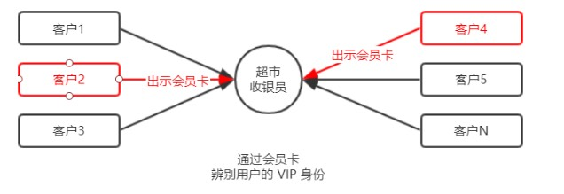

> 注意:现实生活中的**会员卡身份认证方式**，在 Web 开发中的专业术语叫做 **Cookie**。


##### 3. 什么是 Cookie

Cookie 是**存储在用户浏览器中的一段不超过** **4 KB** **的字符串**。它由一个名称(Name)、一个值(Value)和其它几个用

于控制 Cookie 有效期、安全性、使用范围的可选属性组成。

 不同域名下的 Cookie 各自独立，每当客户端发起请求时，会**自动**把**当前域名下**所有**未过期的** **Cookie** 一同发送到服务器。 

**Cookie**的几大特性:

- 自动发送

- 域名独立

- 过期时限

- 4KB限制 

  

##### 4. Cookie 在身份认证中的作用

客户端第一次请求服务器的时候，服务器**通过响应头的形式**，向客户端发送一个身份认证的 Cookie，客户端会自动 将 Cookie 保存在浏

览器中。

随后，当客户端浏览器每次请求服务器的时候，浏览器会**自动**将身份认证相关的 Cookie，**通过请求头的形式**发送给 服务器，服务器即可

验明客户端的身份。


##### 5. Cookie 不具有安全性

由于 Cookie 是存储在浏览器中的，而且**浏览器也提供了读写** **Cookie** **的** **API**，因此 **Cookie** **很容易被伪造**，不具有安全

性。因此不建议服务器将重要的隐私数据，通过 Cookie 的形式发送给浏览器。

> **注意:**
>
> 千万不要使用** **Cookie** **存储重要且隐私的数据**!比如用户的身份信息、密码等。


##### 6. 提高身份认证的安全性

为了防止客户伪造会员卡，收银员在拿到客户出示的会员卡之后，可以**在收银机上进行刷卡认证**。只有收银机确认存在的会员卡，才能被

正常使用。

这种“**会员卡** **+** **刷卡认证**”的设计理念，就是 Session 认证机制的精髓。


##### 7. Session 的工作原理

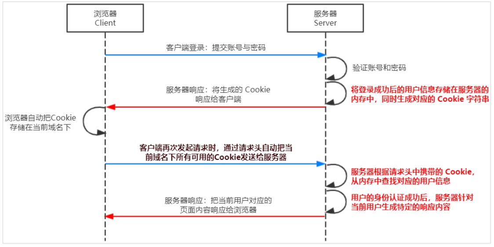

#### 9.5.4 在 Express 中使用 Session 认证

##### 1. 安装express-session 中间件

在 Express 项目中，只需要安装 express-session 中间件，即可在项目中使用 Session 认证:

```npm
npm install express-session
```


##### 2. 配置 express-session 中间件

express-session 中间件安装成功后，需要通过 app.use() 来注册 session 中间件，示例代码如下:

```jsx
```


##### 3. 向 session 中存数据

当 express-session 中间件配置成功后，即可通过 **req.session** 来访问和使用 session 对象，从而存储用户的关键信息:

```jsx
```


##### 4. 从 session 取数据

可以直接从 **req.session** 对象上获取之前存储的数据，示例代码如下:

```jsx
```


##### 5. 清空 session

调用 **req.session.destroy()** 函数，即可清空服务器保存的 session 信息。

```jsx
```


#### 9.5.5 JWT 认证机制

##### 1. 了解 Session 认证的局限性

Session 认证机制需要配合 Cookie 才能实现。由于 Cookie 默认不支持跨域访问，所以，当涉及到前端跨域请求后端接

口的时候，**需要做很多额外的配置**，才能实现跨域 Session 认证。

> 注意:
>
> - 当前端请求后端接口**不存在跨域问题**的时候，**推荐使用** **Session** 身份认证机制。
> - 当前端需要跨域请求后端接口的时候，不推荐使用 Session 身份认证机制，推荐使用 JWT 认证机制。


##### 2. 什么是 JWT

JWT(英文全称:JSON Web Token)是目前**最流行**的**跨域认证解决方案**。


##### 3. JWT 认证机制

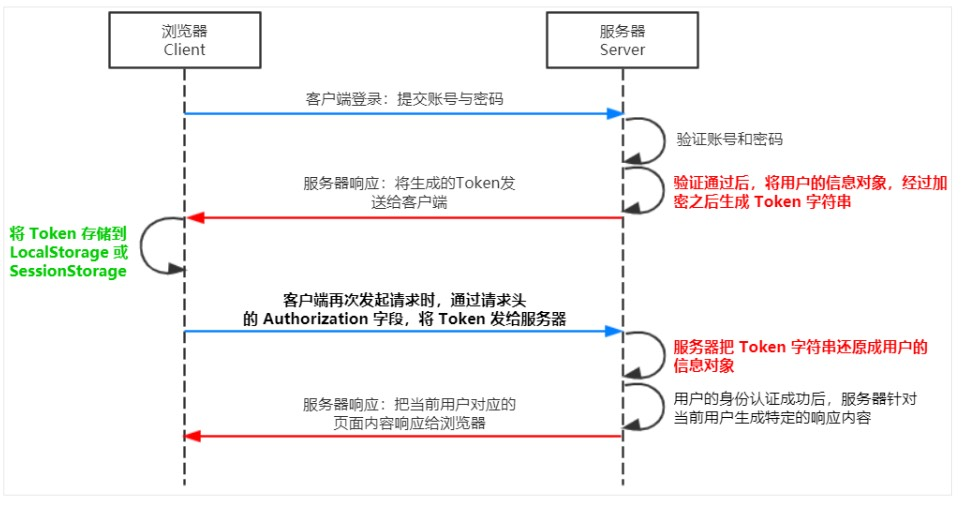

总结:用户的信息通过 Token 字符串的形式，保存在客户端浏览器中。服务器通过还原 Token 字符串的形式来认证用户的身份。


##### 4. JWT 的组成部分

JWT 通常由三部分组成，分别是 Header(头部)、Payload(有效荷载)、Signature(签名)。

三者之间使用英文的“.”分隔，格式如下:

```jsx
Header.Payload.Signature
```

下面是 JWT 字符串的示例:

```jsx
```


##### 5. JWT 三个部分各自代表的含义

JWT 的三个组成部分，从前到后分别是 Header、Payload、Signature。
 其中:

- **Payload** 部分**才是真正的用户信息**，它是用户信息经过加密之后生成的字符串。 
- Header 和 Signature 是**安全性相关**的部分，只是为了保证 Token 的安全性。

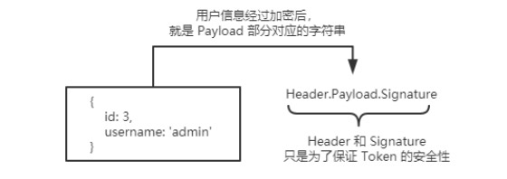

##### 6. JWT 的使用方式

客户端收到服务器返回的 JWT 之后，通常会将它储存在 localStorage 或 sessionStorage 中。

此后，客户端每次与服务器通信，都要带上这个 JWT 的字符串，从而进行身份认证。推荐的做法是**把** **JWT** **放在** **HTTP** **请求头的** 

**Authorization** **字段中**，格式如下:

```jsx
Authorization：Bearer <token>
```


#### 9.5.6 在 Express 中使用 JWT

##### 1. 安装 JWT 相关的包

运行如下命令，安装如下两个 JWT 相关的包:

```jsx
npm install jsonwebtoken express-jwt
```

其中:

- **jsonwebtoken** 用于**生成** **JWT** **字符串**
- **express-jwt** 用于**将** **JWT** **字符串解析还原成** **JSON** **对象**


##### 2. 导入 JWT 相关的包

使用 **require()** 函数，分别导入 JWT 相关的两个包:

```jsx
```


##### 3. 定义 secret 秘钥

为了保证 JWT 字符串的安全性，防止 JWT 字符串在网络传输过程中被别人破解，我们需要专门定义一个用于**加密**和**解密** 的 secret 密钥:

- 当生成 JWT 字符串的时候，需要使用 secret 密钥对用户的信息进行加密，最终得到加密好的 JWT 字符串 
- 当把 JWT 字符串解析还原成 JSON 对象的时候，需要使用 secret 密钥进行解密

```jsx
```


##### 4. 登录成功后生成 JWT 字符串

调用 **jsonwebtoken** 包提供的 **sign()** 方法，将用户的信息加密成 JWT 字符串，响应给客户端:

```jsx
```


##### 5. 将  JWT 字符串还原为 JSON 对象

客户端每次在访问那些有权限接口的时候，都需要主动通过**请求头中的** **Authorization** **字段**，将 Token 字符串发送到服务器进行身份认

证。

此时，服务器可以通过 **express-jwt** 这个中间件，自动将客户端发送过来的 Token 解析还原成 JSON 对象:

```
```


#####  6. 使用 req.user 获取用户信息

当 express-jwt 这个中间件配置成功之后，即可在那些有权限的接口中，使用 **req.user** 对象，来访问从 JWT 字符串 中解析出来的用户信

息了，示例代码如下:

```jsx
```


##### 7. 捕获解析 JWT 失败后产生的错误

当使用 express-jwt 解析 Token 字符串时，如果客户端发送过来的 Token 字符串**过期**或**不合法**，会产生一个**解析失败** 的错误，影响项目

的正常运行。我们可以通过 **Express** **的错误中间件**，捕获这个错误并进行相关的处理，示例代码如下:

```jsx
```


## 安装插件

- Atom one Dart theme
- bootstrap 3 snippets
- chinese
- code runner
- code spell checker
- Dart
- Easy LESS
- Flutter
- Github theme
- HTML CSS Supper
- HTML Snippets
- JS Snippets
- Markdown all in one
- monokai night theme
- Node-Snippets
- One dark pro
- Open in browser
- path intellisense
- Russian code spell checker
- view in browser
- Viscode-icons
- Viscode-icons-mac
- 

