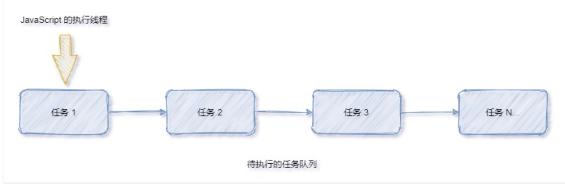
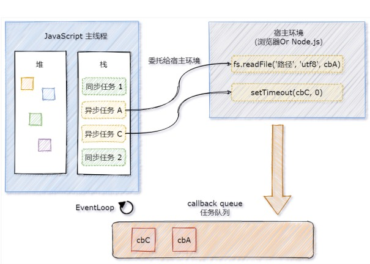
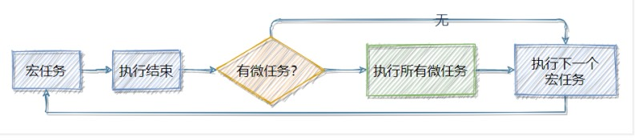

## 一、ES6 模块化

### 01 | 在 node.js 中如何实现模块化

node.js 遵循了 CommonJS 的模块化规范。其中

- 导入其它模块使用 `require()` 方法
- 模块对外共享成员使用 `module.exports` 对象


模块化的好处：

- 大家都遵守同样的模块化规范写代码，降低了沟通的成本，极大方便了各个模块之间的相互调用。


### 02 | 前端模块化规范的分类

在 ES6 模块化规范诞生之前，JS 社区已经尝试并提出了 AMD、CMD、CommonJS 等模块化规范。


但是，这些由社区提出的模块化标准，还是存在一定的差异性和局限性，并不是浏览器与服务器通用的模块化标准。例如：

- AMD 和 CMD 适用于浏览器端的 JS 模块化
- CommonJS 适用于服务器的 JS 模块化


太多的模块化规范给开发者增加了学习的难度与开发的成本。因此，大一统的 ES6 模块化规范诞生了。


### 03 | 什么是 ES6 模块化规范

ES6 模块化规范是浏览器与服务器端通用的模块化开发规范。它的出现极大的降低了前端开发的模块化学习成本，开发者不需要再额外学习 AMD、CMD 或 CommonJS 等模块化规范。


ES6 模块化规范定义：

- 每个 js 文件都是一个独立的模块
- 导入其他模块成员使用 `import` 关键字
- 向外提供模块成员使用 `export` 关键字


### 04 | 在 node.js 中体验 ES6 模块化

node.js 中默认仅支持 CommonJS 模块化规范，若想基于 node.js 体验与学习 ES6 的模块化语法。

可以按照如下两个步骤进行配置：

- 确保安装了 v14.15.1 或更高版本的 node.js
- 在 package.json 的根节点中添加 "type": "module" 节点


### 05 | ES6 模块化的基本语法

ES6 的模块化主要包含如下 3 种用法：

- 默认导出与默认导入
- 按需导出与按需导入
- 直接导入并执行模块中的代码


#### 05-01 | 默认导出和默认导入

**默认导出：**

默认导出的语法：export default 默认导出的成员

```js
// 定义模块私有成员
let n1 = 10
// 定义模块私有成员 n2，外界访问不到 n2，因为她没有被共享出去
let n2 = 20
// 定义模块私有方法 show
function show() {}

// 使用 export default 默认导出，向外共享 n1 和 show 两个成员
export default {
  n1,
  show
}
```


**默认导入：**

默认导入的语法：

```js
import 接收名称 from '模块标识符'
```

```js
// 从 01_m1.js 模块中导入 export default 向外共享的成员
// 并使用 m1 成员进行接收
import m1 from './01_m1.js'

// 打印输出的结果为：
// { n1: 10, show: [function: show]}
console.log(m1)
```


**默认导出的注意事项：**

每个模块中，只允许使用唯一的一次 `export default` ，否则会报错！


**默认导入的注意事项：**

默认导入时的接收名称可以任意名称，只要是合法的成员名称即可


#### 05-02 | 按需导出与按需导入

**按需导出：**

按需导出的语法：

```js
export 按需导出的成员
```

```js
// 当前模块为 03_m2.js

// 向外按需导出变量 s1
export const s1 = 'aaa'
// 向外按需导出变量 s2
export let s2 = 'ccc'

// 向外按需导出方法 say
export function say(){}
```


**按需导入：**

按需导入的语法：

```js
import { s1 } from '模块标识符'
```

```js
// 导入模块成员
import { s1, s2, say } from './03_m2.js'

// 打印输出 aaa
console.js(s1)
// 打印输出 ccc
console.js(s2)
// 打印输出 [Funtion: say]
console.js(say)
```


**按需导出和按需导入的注意事项：**

- 每个模块中可以多次按需导出
- 按需导入的成员名称必须和按需导出的名称必须保持一致
- 按需导入时，可以使用 `as` 关键字进行重命名
- 按需导入可以和默认导入一起使用


#### 05-03 | 直接导入并执行模块中的代码

如果只想单纯得执行某个模块中的代码，并不需要得到模块中向外共享的成员。此时，可以直接导入并执行模块代码。

示例如下：

```jsx
// 当前文件模块 03_m3.js

// 在当前模块中执行一个 for 循环操作
for (let i = 0, i < 3; ++i) {
  console.log(i)
}

------------------分割线-------------------

// 直接导入并执行模块代码，不需要得到模块向外共享的代码
import './03_m3.js'
```


## 二、Promise

### 01 | 回调地域、Promise 的基本概念

**回调地域：**

多层回调函数的相互嵌套，就形成了回调地域。

```
setTimeout(()=> {
	console.log('延时1s')
	
	setTimeout(()=> {
		console.log('延时2s')
			setTimeout(()=> {
				console.log('延时2s')
			}, 3000)
	}, 2000)
}, 1000)
```

回调地域的特点：

- 代码耦合性太强，牵一发而动全身，难以维护
- 大量冗余的代码相互嵌套，代码的可读性变差


**如何解决回调地域的问题：**

- 为了解决回调地域的问题，ES6 中新增了 Promise 的概念。


**Promise 的基本概念：**

- Promise 是一个构造函数

  - 我们可以创建 Promise 的实例：`const p = new Promise()`
  - `new` 出来的 Promise 实例对象，代表一个异步操作

- `Promise.prototype` 上包含一个 `.then()` 方法

  - 每一次 `new Promise()` 构造函数得到的实例对象，都可以通过原型链的方式访问到 `.then()` 方法。例如：`p.then()`

- `.then()` 方法用来预先指定成功和失败的回调函数

  - `p.then(成功的回调函数, 失败的回调函数)`
  - `p.then(reult => {}, error => {})`
  - 调用 `.then()` 方法时，成功的回调函数是必选的、失败的回调函数是可选的

  

### 02 | 基于回调函数按顺序读取文件内容

```js
// 读取文件 1.txt
fs'readFile('./files/1.txt', 'uft8', (err1, r1) => {
	if (err) {
    return console.log(err.message)
  }
	console.log(r1)
	
	// 读取文件 2.txt
	fs'readFile('./files/2.txt', 'uft8', (err2, r2) => {
		if (err2) {
    	return console.log(err2.message)
  	}
		console.log(r2)

		// 读取文件 3.txt
		fs'readFile('./files/3.txt', 'uft8', (err3, r3) => {
			if (err3) {
    		return console.log(err3.message)
	  	}
			console.log(r3)
		})
	})
})

```


### 03 | 基于 then-fs 读取文件内容

由于 node.js 官方提供的 fs 模块仅支持以回调函数的方式读取文件，不支持 Promise 的调用方式。因此，需要先运行如下的命令，安装 `then-fs` 这个第三方包，从而支持我们基于 `Promise` 的方式读取文件的内容

```
npm install then-fs
```


#### 03-01 | then-fs 的基本使用

调用 `then-fs` 提供的 `readFile()` 方法，可以异步地读取文件的内容，它的返回值是 `Promise` 的实例对象。因此可以调用 `.then()`

方法为每个 `Promise` 异步操作指定成功和失败之后的回调函数。

示例代码如下：

```js
// 基于 Promise 的方式读取文件

import thenFs from 'then-fs'

// 注意： .then() 中失败回调是可选的，可以被忽略
thenFs.readFile('./files/1.txt', 'uft8').then(r1 => {console.log(r1)}, err1 => {console.log(err1.message)})

thenFs.readFile('./files/2.txt', 'uft8').then(r2 => {console.log(r2)}, err2 => {console.log(err2.message)})

thenFs.readFile('./files/3.txt', 'uft8').then(r3 => {console.log(r3)}, err3 => {console.log(err3.message)})
```

> 注意：上述的代码无法保证文件的读取顺序，可以做进一步的改进！


#### 03-02 | .then() 方法的特性

如果上一个 `.then()` 方法中返回了一个新的 `Promise` 实例对象，则可以通过下一个 `.then()` 继续进行处理。通过 ``.then()`` 方法

的链式调用，就解决了回调地狱的问题。


#### 03-03 | 基于 Promise 按顺序读取文件的内容

Promise 支持链式调用，从而来解决回调地域的问题。示例如下：

```js
thenFs.readFile('./files/1.txt', 'uft8') // 1. 返回值是 Promise 的实例对象
  .then(r1 => { // 2. 通过.then 为第一个 Promise 实例指定成功的回调函数
  	 console.log(r1)
  	 return thenFs.readFile('./files/2.txt', 'uft8') // 3. 在第一个 .then 中返回一个新的Promise 的实例对象
	})
  .then(r2 => { // 4. 继续调用 .then 为上一个返回值（新的Promise 的实例）指定成功的回调函数
  	 console.log(r2)
  	 return thenFs.readFile('./files/3.txt', 'uft8') // 5. 在第二个 .then 中返回一个新的Promise 的实例对象
	})
  .then(r3 => { // 6. 继续调用 .then 为上一个返回值（新的Promise 的实例）指定成功的回调函数
  	 console.log(r3)
	})
```


#### 03-04 | 通过 .catch 捕获错误

在 `Promise` 的链式操作中如果发生了错误，可以使用 `Promise.prototype.catch` 方法进行捕获和处理：

```js
thenFs.readFile('./files/1.txt', 'uft8') 
  .then(r1 => { 
  	 console.log(r1)
  	 return thenFs.readFile('./files/2.txt', 'uft8') 
	})
  .then(r2 => { 
  	 console.log(r2)
  	 return thenFs.readFile('./files/3.txt', 'uft8') 
	})
  .then(r3 => { 
  	 console.log(r3)
	})
	.catch(err => { // 捕获第一行发生的错误，并输出错误的消息
  	console.log(err.message)
	})
```


如果不希望前面的错误导致后续的 .then 无法正常执行，则可以将 .catch 的调用提前，示例代码如下：

```js
thenFs.readFile('./files/1.txt', 'uft8') 
	.catch(err => { // 捕获第一行发生的错误，并输出错误的消息
  	console.log(err.message) // 由于错误已被即使厝里，不影响后续 .then 的正常执行
	})
  .then(r1 => { 
  	 console.log(r1)
  	 return thenFs.readFile('./files/2.txt', 'uft8') 
	})
  .then(r2 => { 
  	 console.log(r2)
  	 return thenFs.readFile('./files/3.txt', 'uft8') 
	})
  .then(r3 => { 
  	 console.log(r3)
	})
```


#### 03-05 | Promise.all() 方法

`Promise.all()` 方法会发起并行的 `Promise` 异步操作，等所有的异步操作全部结束后才会执行下一步的 `.then`  操作（等待机制）。

示例代码如下：

```js
// 定义一个数组，存放 3 个读文件的异步操作
const promiseArr = [
  thenFs.readFile('./files/1.txt', 'uft8'),
  thenFs.readFile('./files/2.txt', 'uft8'),
  thenFs.readFile('./files/3.txt', 'uft8'),
]

// 2. 将 Promise 的数组，作为 Promise.all() 的参数
Promise.all(promiseArr)
	.then(([r1, r2, r3]) => { // 所有文件读取成功：等待机制
  	console.log(r1, r2, r3)
	}) 
	.catch(err => { // 捕获 Promise 异步操作中的错误
  	console.log(err.message)
	})
```

注意：数组中的 Promise 实例的顺序，就是最终结果的顺序


#### 03-06 | Promise.race() 方法

`Promise.race()` 方法会发起并行的 `Promise` 异步操作，只要任何一个异步操作完成，就立即执行下一步的 .then 操作（赛跑机制）。

示例代码如下：

```js
// 定义一个数组，存放 3 个读文件的异步操作
const promiseArr = [
  thenFs.readFile('./files/1.txt', 'uft8'),
  thenFs.readFile('./files/2.txt', 'uft8'),
  thenFs.readFile('./files/3.txt', 'uft8'),
]

// 2. 将 Promise 的数组，作为 Promise.reace() 的参数
Promise.race(promiseArr)
	.then(result => { // 只要任何一个异步操作完成，就会立即执行成功的回调函数：赛跑机制
  	console.log(result)
	}) 
	.catch(err => { // 捕获 Promise 异步操作中的错误
  	console.log(err.message)
	})
```


### 04 | 基于 Promise 封装读文件的方法

方法的封装要求：

- 方法的名称要定义为 getFile
- 方法接收一个形参 `fpath`，表示要读取的文件的路径
- 方法的返回值为 Promise 实例对象


#### 04-01 | getFile 方法的基本定义

```js
// 方法接收一个形成 fpath，表示要读取文件的路径
function getFile(fpath) {
	return new Promise()
}
```

> 第 3 行中的 new Promise() 只是创建了一个形式上的异步操作


#### 04-02 | 创建具体的异步操作

如果想要创建具体的异步操作，则需要在 `new Promise()` 构造函数期间，传递一个 function 函数，将具体的异步操作定义到 function函

数内部。示例代码如下：

```js
// 方法接收一个形成 fpath，表示要读取文件的路径
function getFile(fpath) {
	return new Promise(function() {
    // 具体要读取文件的异步操作
    fs.readFile(fpath, 'utf8 ', (err, dataStr) => {
      
    })
  })
}
```


#### 04-03 | 获取.then 的两个参数

通过 `.then` 指定的成功和失败的回调函数，可以在 function 中的形参进行接收，示例如下：

```jsx
// 方法接收一个形成 fpath，表示要读取文件的路径
function getFile(fpath) {
  // resolve 形参是：调用 getFile() 方法时，通过 .then 指定的 `成功的` 回调函数
  // reject 形参是：调用 getFile() 方法时，通过 .then 指定的 `失败的` 回调函数
	return new Promise(function(resolve, reject) {
    // 具体要读取文件的异步操作
    fs.readFile(fpath, 'utf8 ', (err, dataStr) => {})
  })
}

// getFile 方法的调用过程
getFile('./files/1.txt').then(成功的回调函数，失败的回调函数)
// 1. 成功的回调函数，对应 resolve
// 2. 失败的回调函数，对应 reject
```


#### 04-04 | 调用 resolve 和 reject 回调函数

`Promise` 异步操作的结果，可以调用 `resolve` 或 `reject` 回调函数进行处理。示例代码如下：

```js
// 方法接收一个形成 fpath，表示要读取文件的路径
function getFile(fpath) {
  // resolve 形参是：调用 getFile() 方法时，通过 .then 指定的 `成功的` 回调函数
	return new Promise(function(resolve, reject) {
    // 具体要读取文件的异步操作
    fs.readFile(fpath, 'utf8 ', (err, dataStr) => {
      if (err) {
        // 如果读取失败，则调用 `失败的回调函数`
        return reject(err)
      }
      // 如果读取成功，则调用 `成功的回调函数`
      resolve(dataStr)
    })
  })
}

// getFile 方法的调用过程
getFile('./files/1.txt').then(成功的回调函数，失败的回调函数)
```


### 05 | 使用 try...catch 捕获 Promise 异常错误

可以使用 try...catch 捕获 Promise 异步任务中产生的异常错误，并在 catch 中进行处理


## 三、async、await

### 01 | 什么是 async、await

`async/await` 是 ES8（ECMAScript 2017）引入的新语法，用来简化 Promise 异步操作。在 async/await 出现之前，开发者只能通过链

式 .then() 的方式处理 Promise 异步操作。示例代码如下：

```js
thenFs.readFile('./files/1.txt', 'uft8') 
	.catch(err => { // 捕获第一行发生的错误，并输出错误的消息
  	console.log(err.message) // 由于错误已被即使厝里，不影响后续 .then 的正常执行
	})
  .then(r1 => { 
  	 console.log(r1)
  	 return thenFs.readFile('./files/2.txt', 'uft8') 
	})
  .then(r2 => { 
  	 console.log(r2)
  	 return thenFs.readFile('./files/3.txt', 'uft8') 
	})
  .then(r3 => { 
  	 console.log(r3)
	})
```

- .then 链式调用的优点：解决了回调地域的问题
- .then 链式调用的缺点：代码冗余、阅读性差、不易理解


### 02 |async、await 的基本使用

使用 `async/await` 简化 Promise 异步操作的示例代码如下：

```js
import thenFs from 'then-fs'

// 按照顺序读取文件 1， 2， 3
async function getAllFile() {
  const r1 = await thenFs.readFile('./files/1.txt', 'uft8')
  console.log(r1)
 
  const r2 = await thenFs.readFile('./files/2.txt', 'uft8')
  console.log(r2)
  
  const r3 = await thenFs.readFile('./files/3.txt', 'uft8')
  console.log(r3)
}

getAllFile()
```


### 03 |async、await 的使用注意事项

- 如果在 function 中使用了 await，则 function 必须被 async 修饰
- 在 async 方法中，第一个 await 之前的代码会同步执行，await 之后的代码会异步执行

```js
import thenFs from 'then-fs'

console.log('A')
// 按照顺序读取文件 1， 2， 3
async function getAllFile() {
  console.log('B')
  
  const r1 = await thenFs.readFile('./files/1.txt', 'uft8')
  const r2 = await thenFs.readFile('./files/2.txt', 'uft8')
  const r3 = await thenFs.readFile('./files/3.txt', 'uft8')
  console.log(r1, r2, r3)
  
  console.log('D')
}

getAllFile()
console.log('C')
```

最终输出的顺序：

```js
A
B
C
111 222 333
D
```


## 四、EventLoop

### 01 | JavaScript 是单线程的语言

JavaScript 是一门单线程执行的编程语言。也就是说，同一时间只能做一件事情。



单线程执行任务队列的问题：
如果前一个任务非常耗时，则后续的任务就不得不一直等待，从而导致程序假死的问题。


### 02 | 同步任务和异步任务

为了防止某个耗时任务导致程序假死的问题，JavaScript 把待执行的任务分为了两类：

- 同步任务（synchronous）
  - 又叫做非耗时任务，指的是在主线程上排队执行的那些任务
  - 只有前一个任务执行完毕，才能执行后一个任务
- 异步任务（asynchronous）
  - 又叫做耗时任务，异步任务由 JavaScript 委托给宿主环境进行执行
  - 当异步任务执行完成后，会通知 JavaScript 主线程执行异步任务的回调函数


### 03 | 同步任务和异步任务的执行过程



1. 同步任务由 JavaScript 主线程次序执行
2. 异步任务委托给宿主环境执行
3. 已完成的异步任务对应的回调函数，会被加入到任务队列中等待执行
4. JavaScript 主线程的执行栈被清空后，会读取任务队列中的回调函数，次序执行
5. JavaScript 主线程不断重复上面的第 4 步


### 04 | EventLoop 的基本概念

JavaScript 主线程从“任务队列”中读取异步任务的回调函数，放到执行栈中依次执行。这个过程是循环不断的，所以整个的这种运行机制

又称为 EventLoop（事件循环）。

 


### 05 | 结合 EventLoop 分析输出的顺序

```js
import thenFs from 'then-fs'

console.log('A')
thenFs.readFile('./1.text', 'utf8').then(dataStr => {
  console.log('B')
})

setTimeOut(()=>{
  console.log('C')
}, 0)

console.log('D')
```

正确的输出结果：ADCB。其中

- A 和 D 属于同步任务。会根据代码的先后顺序依次被执行
- C 和 B 属于异步任务。它们的回调函数会被加入到任务队列中，等待主线程空闲时再执行


## 五、宏任务和微任务

### 01 | 什么是宏任务和微任务

JavaScript 把异步任务又做了进一步的划分，异步任务又分为两类，分别是：

- 宏任务（macrotask）
  - 异步 Ajax 请求、
  - setTimeout、setInterval、
  - 文件操作
  - 其它宏任务
- 微任务（microtask）
  - Promise.then、.catch 和 .finally
  - process.nextTick
  - 其它微任务


### 02 | 宏任务和微任务的执行顺序

 

每一个宏任务执行完之后，都会检查是否存在待执行的微任务，

如果有，则执行完所有微任务之后，再继续执行下一个宏任务。


### 03 | 去银行办业务的场景

- 小云和小腾去银行办业务。首先，需要取号之后进行排队
 - 宏任务队列
- 假设当前银行网点只有一个柜员，小云在办理存款业务时，小腾只能等待
 - 单线程，宏任务按次序执行
- 小云办完存款业务后，柜员询问他是否还想办理其它业务？
 - 当前宏任务执行完，检查是否有微任务
- 小云告诉柜员：想要买理财产品、再办个信用卡、最后再兑换点马年纪念币？
 - 执行微任务，后续宏任务被推迟
- 小云离开柜台后，柜员开始为小腾办理业务
 - 所有微任务执行完毕，开始执行下一个宏任务


### 04 | 分析以下代码输出的顺序

```
setTimeout(()=>{
	console.log('A')
}, 0)

new Promise( resolve => {
	console.log('B')
}.then(() => {
	console.log('C')
})

console.log('D')
```

正确的输出顺序：BDCA

分析：

- 先执行所有的同步任务：执行第 6 行、第 12 行代码

- 再执行微任务：执行第 9 行代码

- 再执行下一个宏任务：执行第 2 行代码


## 六、API 接口案例

### 01 | 案例需求

基于 MySQL 数据库 + Express 对外提供用户列表的 API 接口服务。用到的技术点如下：

- 第三方包 express 和 mysql2
- ES6 模块化
- Promise
- async/await


### 02 | 主要的实现步骤

- 搭建项目的基本结构
- 创建基本的服务器
- 创建 db 数据库操作模块
- 创建 user_ctrl 业务模块
- 创建 user_router 路由模块


### 03 | 搭建项目的基本结构

- 启用 ES6 模块化支持
  - 在 package.json 中声明 "type": "module"
- 安装第三方依赖包
  - 运行 npm  install  express@4.17.1  mysql2@2.2.5 


### 04 | 创建基本的服务器

```js
// 使用 ES6 的默认导入语法
import express from 'express'
const app express()

app.listen(80, ()=> {
  console.log('server running')
})
```


### 05 |  创建 db 数据库操作模块

```js
import mysql from 'mysql2'

const pool = mysql.createPool({
  host: '127.0.0.1',
  port: 3006,
  database: 'my_db_01',
  user: 'root',
  password: 'admin123'
})

export default pool.promise()
```


### 06 | 创建 user_ctrl 模块

```js
import db from '../db/index.js'

export async function getAllUser(req, res) {
  const [rows] = await db.query('select id, username, nickname from ev_users')
  res.send({
    status: 0,
    message: '获取用户数据成功',
    data: rows
  })
}
```


### 07 | 创建 user_router 模块

```js
import express from 'express'

import { getAllUser } from './user_ctrl.js'

const router = new express.Router()

router.get('/user', getAllUser)

export default router
```


### 08 | 导入并挂载路由模块

```js
// 使用 ES6 的默认导入语法
import express from 'express'
import userRouter from './user_router .js'

const app express()

app.use('/api', userRouter)

app.listen(80, ()=> {
  console.log('server running')
})
```


### 09 | 使用 try…catch 捕获异常

```
import db from '../db/index.js'

export async function getAllUser(req, res) {
	try {
		 	const [rows] = await db.query('select id, username, nickname from ev_users')
  	 	res.send({
    		status: 0,
    		message: '获取用户数据成功',
    		data: rows
  		})
	} catch (e) {
		res.send({
				status: 1,
    		message: '获取用户数据失败',
    		desc：e.message
		})
	}
}
```


### 总结：

- 能够知道如何使用 ES6 的模块化语法
  - 默认导出与默认导入、按需导出与按需导入
- 能够知道如何使用 Promise 解决回调地狱问题
  - promise.then()、promise.catch()
- 能够使用 async/await 简化 Promise 的调用
  - 方法中用到了 await，则方法需要被 async 修饰
- 能够说出什么是 EventLoop
  - EventLoop 示意图
- 能够说出宏任务和微任务的执行顺序
  - 在执行下一个宏任务之前，先检查是否有待执行的微任务