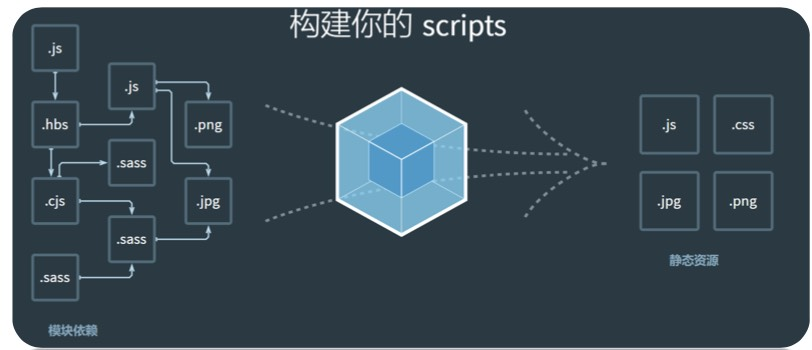
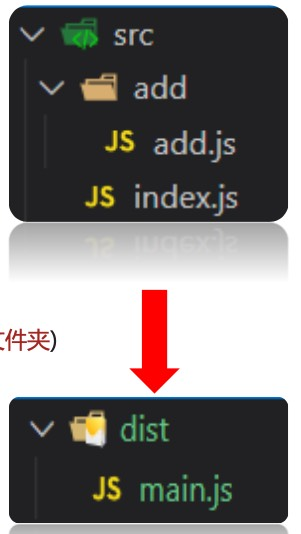
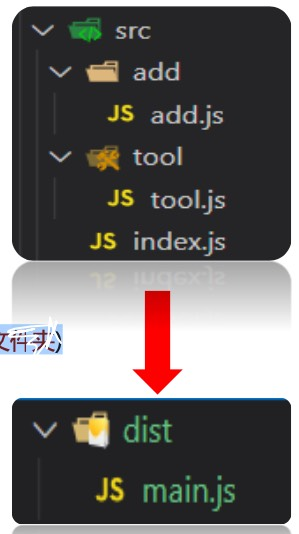
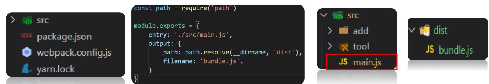
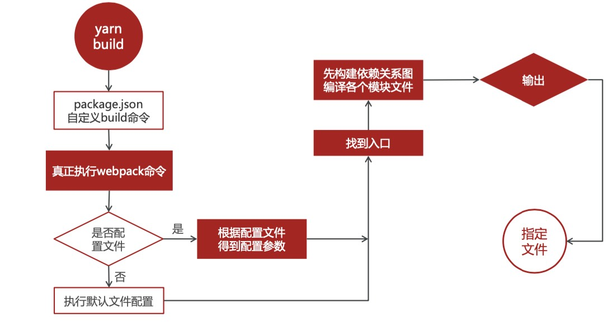

## 一、webpack 基本概念

### 01 | 为什么要学习 webpack

 


是不是让浏览器加载资源更快呀?

我们为什么学习webpack？

- 减少文件数量
- 缩减代码体积
- 提高浏览器打开的速度


### 02 | webpack 基本概述

webpack本质是：一个第三方模块包，用于分析，并打包代码

- 支持所有类型文件的打包
- 支持 `less/sass => css`
- 支持 `ES6/7/8 => ES5`
- 压缩代码，提高加载速度

 

什么是 `webpack` 呢? 作用是什么? 目的是?

- 它是一个模块包
- 识别代码,翻译,压缩,整合打包 
- 提高打开网站的速度


## 二、webpack 使用步骤

### 01 | 环境准备

1. 初始化环境

   ```js
   yarn init
   ```

2. 安装依赖包

   ```js
   yarn add webpack webpack-cli -D
   ```

3. 配置`script`：自定义命令

   ```js
   "script": {
     "build": "webpack"
   },
   ```


**使用webpack需要做哪些准备工作?**

- 初始化文件包环境，得到 `package.json` 文件
- 下载 `webpack` 等模块包
- 在 `package.json` 自定义命令，为打包做准备


### 02 | 案例：webpack 基础使用

需求：2 个 js 文件 --> 打包成 1 个 js 文件

分析：

- 新建 `src` 下的资源
- `add.js`：定义求和函数并导出
- `index.js`：引入 add 模块并使用函数输出结果
- 执行 `yarn build` 自定义命令，进行打包（确保终端路径在 src 的父级文件夹）
- 打包默认生成 `dist` 和 `main.js`，观察其中代码

```js
src
--- add
------- add.js
--- index.js

======
dist
--- main.js
```

 


### 03 | webpack 使用

1. 默认 `src/index.js` 打包入口文件
2. 需要引入到入口的文件才会参与打包
3. 执行 `package.json` 里 `build` 命令，执行 `webpack` 打包命令 
4. 默认输出 `dist/main.js` 的打包结果


### 04 | 案例：webpack 再次打包

需求:代码更多后, 如何打包呢?
分析:

1. `src` 下新建 `tool/tool.js`
2. 定义数组求和函数导出
3. `index.js`：引入 tool 模块的函数并使用, 打印结果
4. 执行 `yarn build` 自定义命令, 进行打包 (确保终端路径在 src 的父级文件夹) 
5. 打包后默认生成 `dist` 和 `main.js`，观察其中代码

 


### 05 | 代码增加后，如何打包？

- 确保在 `src/index.js` 引入和使用
- 重新执行 `yarn build` 打包命令


## 三、webpack 的配置

### 01 | webpack：入口和出口

**配置文档：https://webpack.docschina.org/concepts/#entry**

1. 新建 `webpack.config.js `
2. 填入配置
3. 修改入口文件名
4. 打包观察效果




> 注意：webpack 基于 node,，所以导出，遵守 CommonJS 规范


**修改webpack入口和出口：**

1. 新建 `webpack.config.js` ( webpack 默认配置文件名) 
2. 通过 `entry` 设置入口文件路径
3. 通过 `output` 对象设置出口路径和文件名


### 02 | yarn build 执行流程图

 

**重点：所有要被打包的资源都要跟入口产生直接或间接的引用关系**

> 一句话总结下`yarn build`后干了什么
>
> - 执行webpack命令,找到配置文件,入口和依赖关系, 打包代码输出到指定位置


### 03 | 案例：隔行变色

webpack打包代码，jquery实现功能

需求：新建项目，yarn 下载 jquery，然后模块化引入到 js 中，编写 jq 代码实现隔行变色

效果如下:

 


步骤:

1. 从 0 准备环境，初始化包环境，下载 webpack 和 webpack-cli 包, 配置自定义命令 build 
2. yarn 下载 jquery，新建 `public/index.html`，准备一些 li 标签
3. `src/main.js` 引入 `jquery`， 编写功能代码
4. 执行打包命令
5. 复制 `public/index.html` 到 `dist/`， 然后引入打包后的 js，运行网页观察效果

> 重点：webpack 打包后端 js 引入到 html 中使用


**用yarn下的包, 如何作用在前端项目中?**

1. 借助 webpack，把模块和代码打包
2. 把 js 文件引入到 html 执行查看效果


### 04 | html-webpack-plugin 插件

**配置文档：https://webpack.docschina.org/plugins/html-webpack-plugin/**

1. 下载插件

   ```js
   yarn add html-webpack-plugin -D
   ```

2. webpack.config.js 添加配置

   ```js
   const HtmlWebpackPlugin = require('html-webpack-plugin')
   
   module exports = {
     // ... 其他配置
     plugins: [
       new HtmlWebpackPlugin({
         template: './public/index.html'
       })
     ]
   }
   ```


> Webpack 就像一个人，webpack.config.js 是人物属性，给它穿什么装备就干什么活


**如何让webpack打包时, 自动生成html文件呢?**

1. 依赖 `html-webpack-plugin` 插件，yarn 下载此插件 
2. 在 `webpack.config.js` 配置写入即可


### 05 | webpack 打包 css 文件

**编写 css 代码，让 webpack 打包**

1. 新建：`src/css/index.css`
2. 编写去除 li 圆点样式代码
3. **（重要）一定要引入到入口才会被 webpack 打包**
4. 执行打包命令观察效果

> 报错：因为 webpack 默认只能处理 js 文件


### 06 | webpack：使用加载器

**css-loader 文档： https://webpack.docschina.org/loaders/css-loader/** 

**style-loader 文档：https://webpack.docschina.org/loaders/style-loader/**

`css-loader` 让 webpack 能处理 css 类型文件 

`style-loader`  把 css 插入到 DOM 中 

1. 下载加载器

   ```js
   yarn add css-loader style-loader -D
   ```

2. webpack.config.js配置

   ```js
   module.exports = {
     // ... 其他配置
     module: {
       rules: [
         {
           test: /\.css$/i,
           use: ['style-loader', 'css-loader']
         }
       ]
     }
   }
   ```

3. 打包观察效果


**webpack如何支持css打包? 打包后样式在哪里? 如何生效?**

1. 依赖 `css-loader` 和 `style-loader`
2. css 代码被打包进 js 文件中
3. style-loader 会把 css 代码插入到 head 下 style 标签内


### 07 | webpack 处理 less 文件

**less-loader文档：https://webpack.docschina.org/loaders/less-loader/**

less-loader 作用：识别 less 文件
 less 作用：将 less 编译为 css

1. 新建 `src/less/index.less` ，设置 li 字体大小 

2. 把 index.less 引入到入口处

3. 下载加载器来处理 less 文件

   ```js
   yarn add less less-loader -D
   ```

4. webpack.config.js 针对 less 配置

   ```js
   module.exports = {
     // ... 其他配置
     module: {
       rules: [
         {
           test: /\.css$/i,
           use: ['style-loader', 'css-loader']
         },
               {
           test: /\.less$/i,
           use: ['style-loader', 'css-loader', 'less-loader']
         }
       ]
     }
   }
   ```

5. 打包观察效果


**webpack如何支持less打包? 需要注意什么?**

1. 依赖 less-loader 和 less 模块包
2. 转换 css 后还需要 css-loader 和 style-loader 的处理


### 08 | webpack 处理图片文件

1. 在 `src/assets/` 准备图片文件
2. 在 `index.less` 对 `body` 设置背景图片
3. 在入口导入图片文件, 设置到img标签插入到body 4. 打包观察效果

> 报错：因为 webpack 无法自己处理图片文件


**webpack5 使用 asset module技术实现字体文件和图片文件处理，无需配置额外 loader**

**文档：https://webpack.docschina.org/guides/asset-modules/**

以前用 `url-loader` 和 `file-loader` 来处理

现在 `webpack.config.js` ， 针对图片文件设置 `type: “assets“`

```js
module.exports = {
  // ... 其他配置
  module: {
    rules: [
      {
        test: /\.(png|jpg|gif|jpeg)$/i,
        type: 'asset'
      }
    ]
  }
}
```

再次打包观察效果

小于 8KB 文件，文件转 base64 打包在 js 中, 大于 8KB，文件自动命名输出到 dist 下，打包观察效果和2图区别

 

**webpack如何支持图片打包? 对图片有哪2种处理方案?**

1. webpack5，在 rules 里，针对图片文件设置 `type:asset` 
2. 小于 8KB 转 base64 字符串进 js 里，大于 8KB 输出文件


**webpack 加载文件优缺点**

- 图片翻译成了 base64， 放到了 js 文件中
  - 好处：浏览器不用发请求了，直接可以读取，速度快
  - 坏处：图片太大，再转 `base64` 就会让图片的体积增大 30% 左右，得不偿失


### 09 | webpack 处理字体图标

1. src/assets 下 放入 fonts 字体相关文件夹(预习资料里)

2. src/main.js 引入 assets/fonts/iconfont.css

3. src/main.js 创建一个i标签, 使用字体图标标签添加到 body 上

4. 添加针对字体文件的加载器规则, 使用 `asset/resource` (直接输出文件并配置路径)

   ```js
   module.exports = {
     // ... 其他配置
     module: {
       rules: [
         {// webpack5 默认内部不认识这些文件，所以当做静态资源直接输出接口
           test: /\.(eot|svg|ttf|woff|woff2)$/i,
           type: 'asset/resource'
           generator: {
           	filename: 'font/[name].[hash:6][ext]'
   	      }
         }
       ]
     }
   }
   ```

5. 打包后运行网页观察效果


### 10 | webpack 对 JS 语法降级

**babel 官网：https://www.babeljs.cn/**

**babel-loader文档：https://webpack.docschina.org/loaders/babel-loader/**

babel：一个 javascript 编译器，把高版本 js 语法降级处理输出兼容的低版本语法
babel-loader：可以让 webpack 转译打包的 js 代码

1. 在 src/main.js ，定义箭头函数，并打印箭头函数变量 (千万不能调用, 为了让 webpack 打包函数，看降级效果) 

   ```js
   // 高级语法
   const fn = () => {
     console.log("你好babel");
   }
   console.log(fn) // 这里必须打印不能调用/不使用, 不然webpack会精简成一句打印不要函数了/不会编译未使用的代码
   // 没有babel集成时, 原样直接打包进lib/bundle.js
   // 有babel集成时, 会翻译成普通函数打包进lib/bundle.js
   ```

2. 下载加载器

   ```js
   yarn add -D babel-loader @babel/core @babel/preset-env
   ```

3. 配置到 webpack.config.js上 

   ```js
   module: {
     rules: [
       {
           test: /\.js$/,
           exclude: /(node_modules|bower_components)/,
           use: {
               loader: 'babel-loader',
               options: {
                   presets: ['@babel/preset-env'] // 预设:转码规则(用bable开发环境本来预设的)
               }
           }
       }
     ]
   }
   ```

4. 打包观察是否降级，打包后观察 lib/bundle.js - 被转成成普通函数使用了 - 这就是babel降级翻译的功能


## 四、webpack 开发服务器

### 01 | webpack开发服务器-为何学?

文档地址: https://webpack.docschina.org/configuration/dev-server/

抛出问题: 每次修改代码, 都需要重新 yarn build 打包, 才能看到最新的效果, 实际工作中, 打包 yarn build 非常费时 (30s - 60s) 之间

为什么费时? 

1. 从 0 构建依赖
2. 磁盘读取对应的文件到内存, webpack 才开始加载  
3. 用对应的 loader 进行处理  
4. 将处理完的内容, 输出到磁盘指定目录  

解决问题：起一个开发服务器,  在电脑内存中打包，缓存一些已经打包过的内容，只重新打包修改的文件，最终运行加载在内存中给浏览

器使用

> 总结: webpack开发服务器, 把代码运行在内存中, 自动更新, 实时返回给浏览器显示


**为什么要使用webpack开发服务器呢?**

1. 打包在内存中,速度快
2. 自动更新打包变化的代码,实时返回给浏览器显示


### 02 | webpack-dev-server 模块使用

1. 下载模块包

   ```bash
   yarn add webpack-dev-server -D
   ```

2. 配置自定义命令：自定义 webpack 开发服务器启动命令 serve，在 package.json 里

   ```js
   scripts: {
   	"build": "webpack",
   	"serve": "webpack serve"
   }
   ```

3. 运行命令-启动webpack开发服务器

   ```bash
   yarn serve
   #或者 npm run serve
   ```

4. 重新编写代码, 观察控制台和浏览器是否自动打包和更新


> 总结: 以后改了src下的资源代码, 就会直接更新到内存打包, 然后反馈到浏览器上了


**如何使用webpack开发服务器实时打包我们代码呢?**

1. 确保下载了 webpack-dev-server 到工程中
2. 在 package.json，配置自定义命令,然后启动即可
3. webpack-dev-server 会给我们一个地址 + 端口浏览器访问即可看到在内存中打包的 index.html 页面


### 03 | webpack-dev-server配置

**webpack-dev-server 配置文档：https://webpack.docschina.org/configuration/dev- server/#devserverafter**

1. 在 webpack.config.js 中添加服务器配置

   ```js
   module.exports = {
       // ...其他配置
       devServer: {
         port: 3000 // 端口号
       }
   }
   ```

2. 重新启动webpack开发服务器观察效果


**如何修改webpack开发服务器的配置呢?**

1. 去文档查找配置项的名字
2. 在 webpack.config.js–devServer 选项里添加