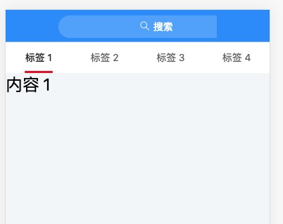

### 01 | 路径中@使用问题

`@` 在 `scr` 文件夹对应的是 src 文件夹

- 在 JS 中使用：`@/views/home/index.vue`。代表是`.../src/views/home/index.vue`
- 在 CSS 中如果想使用@来表示路径，需要在前面加上`~`
  - `~@/views/home/index.vue`。代表是`.../src/views/home/index.vue`


### 02 | CSS 深度操作符、深度选择器

子组件样式 ，在 scoped 作用域中，只影响根节点，要影响后代节点，需要添加深度操作符 `/deep/`

当 `<style>` 标签有 scoped 属性时，它的 CSS 只作用于当前组件中的元素

操作符有：

- `/deep/`
- `>>>`：有些工具不认
- `::v-deep`

**bug效果**

 

**解决办法：**

```js
// 方式一
.home-container {
  ::v-deep.van-nav-bar__title  {
    max-width: unset;
  }
}
// 方式二
.home-container {
  /deep/.van-nav-bar__title  {
    max-width: unset;
  }
}
```


### 03 | 数组展开操作`...` - 在合并数组的时候经常使用

```
let list = [1,2,3,4,5]
let list1 = [6,7,8,9]

// 如果想把list1添加到 list 中有以下办法
// 1. 循环 list1，挨个添加到list -- 不推荐

// 2. 利用展开操作符`...`,添加list1到 list 中
list.push(...list1)
```

**...arr**:

会把数组中一个一个元素展开来


### 04 | 快速找到是哪个元素产生的滚动

把下面的代码粘贴到调试工具中运行一下，然后滚动页面，就可以看到是哪个元素产生的滚动了

```js
function findScroller(element) {
  element.onscroll = function() {
    console.log(element)
  }
  Array.from(element.children).forEach(findScroller)
}

findScroller(document.body)
```


如果多嵌套列表，如何让各自的文章列表有自己的滚动容器？

- 固定高度：`height：xxx；`
- 溢出滚动：`overflow-y：auto；`


给列表的根节点设置样式如下:

```js
.list {
  height: 100%;
  overflow-y: auto;
}
```

这时候可能会发现页面没了，是因为高度可能会 0，为 0 的原因是父元素没有高度。

解决办法就是用 vw 和 vh。

vw 和 vh 是 CSS3 增加的一种视口单位。视口：根据浏览器窗口的大小，不受父元素的影响

> 在移动端，视口单位相对于布局视口

- 1vh = 可视窗口高度的百分之一。比如窗口高度 750，则 1vh = 750 / 100 = 7.5px
- 1vw = 可视窗口宽度的百分之一。比如窗口高度 410，则 1w = 410 / 100 = 4.1px

使用它唯一需要注意的就是它的兼容性：

- pc 端已兼容到 IE9
- 在移动端 iOS 8 以上及 Android 4.4 以上获得支持，并且在微信 x5 内核也完美支持

最终给列表设置的样式如下：

```js
.list {
  height: 79vh;
  overflow-y: auto;
}
```

