### 01 | 小程序与普通网页开发的区别

**运行环境不同**

- 网页运行在浏览器环境中
- 小程序运行在微信环境中


**API 不同**

由于运行环境的不同，所以小程序中，无法调用 DOM 和 BOM 的 API。但是小程序中可以调用微信环境提供的各种 API。例如：

- 地理定位
- 扫码
- 支付


**开发模式不同：**

网页的开发模式：浏览器 + 代码编辑器

小程序有自己的一套标准开发模式：

- 申请小程序开发者账号
- 安装小程序开发者工具
- 创建和配置小程序项目


### 02 | 第一个小程序

#### 02-01 | 微信平台注册

**1. 点击立即注册**

使用浏览器打开 https://mp.weixin.qq.com/ 网址，点击右上角的“**立即注册**”即可进入到小程序开发账号 的注册流程，主要流程截图如下: 

**2. 选择注册账号的类型**

**3. 填写账号信息**

**4. 邮箱激活**

**5. 选择主题类型，主题信息等级**

**6. 获取小程序的 AppID**

开发设置--小程序 ID


#### 02-02 | 安装开发者工具

**1. 了解微信开发者工具：**

微信开发者工具是官方推荐使用的小程序开发工具，它提供了主要功能如下：

1. 快速创建小程序项目
2. 代码的查看和编辑
3. 对小程序功能进行调试
4. 小程序的预览和发布


**2. 下载：**

推荐下载和安装最新的稳定版(Stable Build)的微信开发者工具。

下载页面的链接如下: https://developers.weixin.qq.com/miniprogram/dev/devtools/stable.html


**3. 安装：**

**4. 扫码登录**

**5. 设置外观和代理**


#### 02-03 | 创建小程序项目

1. 点击 “加号” 按钮
2. 填写项目信息
3. 项目创建完成
4. 在模拟器上查看项目效果
5. 在真机上预览项目效果


### 03 | 小程序代码的构成

#### 03-01 | 项目结构

 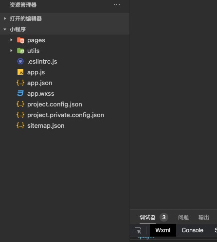 

1. `pages` 用来存放所有小程序的页面
2. `utils` 用来存放工具性质的模块。例如：格式化时间的自定义模块
3. `app.js` 小程序项目的入口文件
4. `app.json` 小程序项目的全局配置文件
5. `app.wxss` 小程序项目的全局样式文件
6. `project.config.json` 项目的配置文件
7. `sitemap.json` 用来配置小程序及其页面是否允许被微信索引


**小程序页面的组成部分：**

小程序官方建议把所有小程序的页面，都存放在 pages 目录中，以单独的文件夹存在，如图所示：

 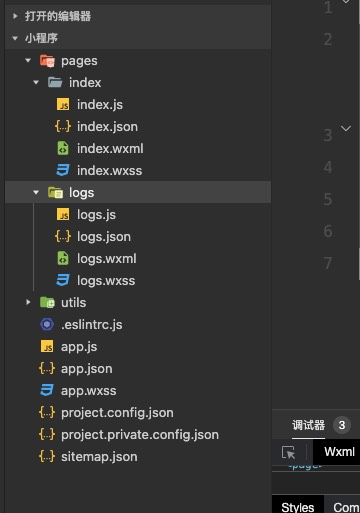

其中，每个页面由 4 个基本文件组成，它们分别是：

1. `.js` 文件：页面的脚本文件，存放页面的数据、事件处理函数等
2. `.json` 文件：当前页面的配置文件，配置窗口的外观、表现等
3. `.wxml` 文件：页面的模板结构文件
4. `.wxss` 文件：当前页面的样式表文件


#### 03-02 | JSON配置文件

##### 01 | JSON **配置文件的作用

JSON 是一种数据格式，在实际开发中，JSON 总是以配置文件的形式出现。小程序项目中也不例外：通过不同的 `.json` 配置文件，可以

对小程序项目进行不同级别的配置。

小程序项目中有 4 种 json 配置文件，分别是：

1. 项目根目录中的 `app.json` 配置文件
2. 项目根目录中的 `project.config.json` 配置文件
3. 项目根目录中的 `sitemap.json` 配置文件
4. 每个页面文件夹中的 .json 配置文件


##### 02 |app.json 文件

`app.json` 是当前小程序的全局配置，包括了小程序的所有页面路径、窗口外观、界面表现、底部 tab 等。

Demo 项目里边的 `app.json` 配置内容如下：

```js
{
  "pages":[
    "pages/index/index",
    "pages/logs/logs"
  ],
  "window":{
    "backgroundTextStyle":"light",
    "navigationBarBackgroundColor": "#fff",
    "navigationBarTitleText": "Weixin",
    "navigationBarTextStyle":"black"
  },
  "style": "v2",
  "sitemapLocation": "sitemap.json"
}
```

简单了解下这 4 个配置项的作用：

1. `pages`：用来记录当前小程序所有页面的路径
2. `window`：全局定义小程序所有页面的背景色、文字颜色等
3. `style`：全局定义小程序组件所使用的样式版本
4. `sitemapLocation`：用来指明 `sitemap.json` 的位置


##### 03 | project.config.json 文件

`project.config.json` 是项目配置文件，用来记录我们对小程序开发工具所做的个性化配置。

例如：

- `setting` 中保存了编译相关的配置
- `projectname` 中保存的是项目名称
- `appid` 中保存的是小程序的账号 ID


##### 04 | sitemap.json 

微信现已开放小程序内搜索，效果类似于 PC 网页的 SEO。`sitemap.json` 文件用来配置小程序页面是否允许 微信索引。

当开发者允许微信索引时，微信会通过爬虫的形式，为小程序的页面内容建立索引。当用户的搜索关键字和页 面的索引匹配成功的时

候，小程序的页面将可能展示在搜索结果中。

 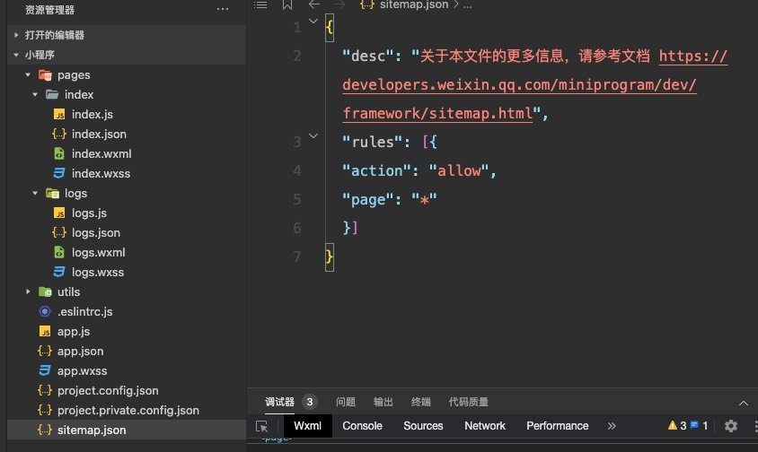

注意：`sitemap` 的索引提示是默认开启的，如需要关闭 `sitemap` 的索引提示，可在小程序项目配置文件 `project.config.json` 的 `setting` 中配置字段 `checkSiteMap` 为 `false`


##### 05 | 页面的 .json 配置文件

小程序中的每一个页面，可使用 .json 文件来对本页面的窗口外观进行配置，页面中的配置项会覆盖 app.json 的 window 中相同的配置

项。例如：

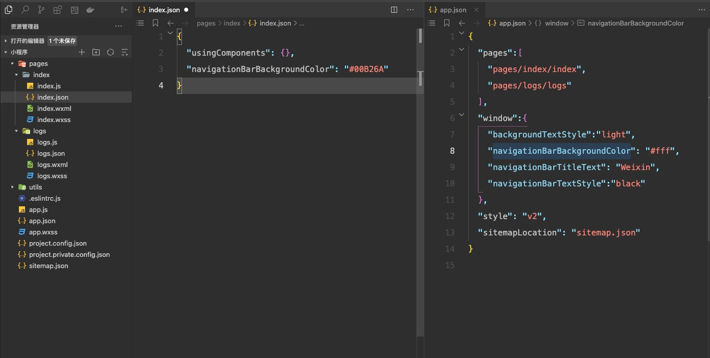


##### 06 | 新建小程序页面

只需要在 `app.json -> pages`  中新增页面的存放路径，小程序开发者工具即可帮我们自动创建对应的页面文件， 如图所示:

 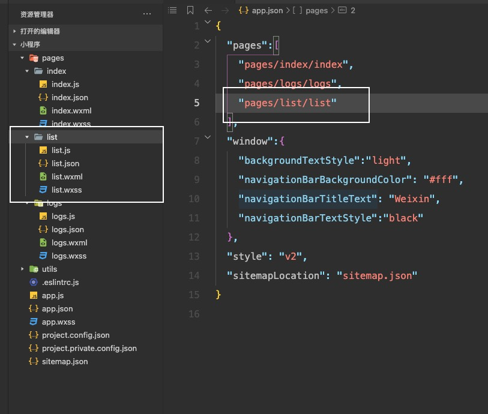


##### 07 | 修改项目首页

只需要调整 `app.json -> pages` 数组中页面路径的前后顺序，即可修改项目的首页。小程序会把排在第一位的页面，当作项目首页进行

渲染，如图所示:  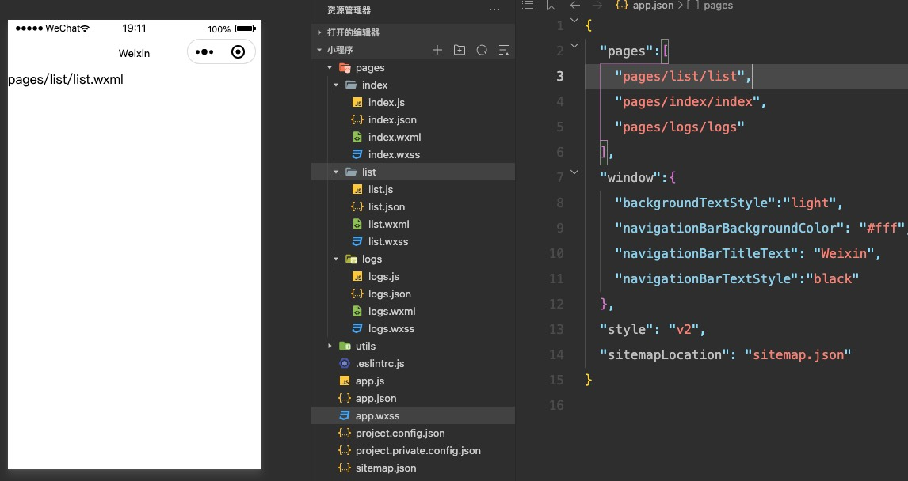


#### 03-03 | WXML 模块

**什么是 WXML：**

WXML(WeiXin Markup Language)是小程序框架设计的一套标签语言，用来构建小程序页面的结构，其作用类似于网页开发中的 

HTML。


**WXML** **和** **HTML** **的区别**

1. 标签名称不同
   - HTML：div、span、i、a
   - WXML：view、text、image、navigator
2. 属性节点不同
   - `<a href="#">超链接</a>`
   - `<navigator url="/page/home/home"></navigator >`
3. 提供了类似于 vue 中的模板语法
   - 数据绑定
   - 列表渲染
   - 条件渲染


#### 03-04 | WXSS 样式

**什么是 WXSS**

WXSS (WeiXin Style Sheets)是一套样式语言，用于描述 WXML 的组件样式，类似于网页开发中的 CSS。


**WXSS 和 CSS 的区别**

1. 新增了 rpx 尺寸单位

   - CSS 中需要手动进行像素单位换算，例如 rem
   - WXSS 在底层支持新的尺寸单位 rpx，在不同大小的屏幕上小程序会自动进行换算

2. 提供了全局的样式和局部样式

   - 项目根目录中的 `app.wxss` 会作用于所有小程序页面

   - 局部页面的 `.wxss` 样式仅对当前页面生效

3. WXSS 仅支持部分 CSS 选择器

   - `.class` 和 `#id`
   - `element`
   - 并集选择器、后代选择器
   - `::after` 和 `::before` 等伪类选择器


#### 03-05 | JS 逻辑交互

**小程序中的 .js 文件**

一个项目仅仅提供界面展示是不够的，在小程序中，我们通过 .js 文件来处理用户的操作。例如:响应用户的点击、获取用户的位置等等


**小程序中 JS 文件分为三大类，分别是：**

1. app.js
   - 是整个小程序项目的入口文件，通过调用 App() 函数来启动整个小程序
2. 页面的 .js 文件
   - 是页面的入口文件，通过调用 Page() 函数来创建并运行页面
3. 普通的 .js 文件
   - 是普通的功能模块文件，用来封装公共的函数或属性供页面使用


### 04 | 小程序的宿主环境

#### 04-01 | 什么是宿主环境

宿主环境(host environment)指的是程序运行所**必须的依赖环境**。例如:

Android 系统和 iOS 系统是两个不同的宿主环境。安卓版的微信 App 是不能在 iOS 环境下运行的，所以， 

Android 是安卓软件的宿主环境，脱离了宿主环境的软件是没有任何意义的!

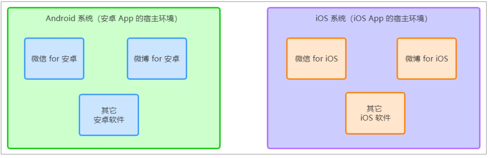


#### 04-02 | 小程序的宿主环境

手机微信是小程序的宿主环境 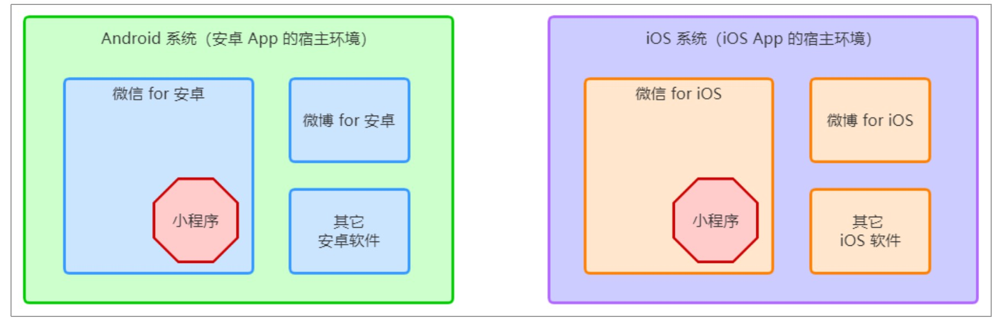

小程序借助宿主环境提供的能力，可以完成许多普通网页无法完成的功能。

例如：微信扫码、微信支付、微信登录、地理定位、etc…


#### 04-03 | 小程序的宿主环境包含的内容

1. 通信模型
2. 运行机制
3. 组件
4. API


#### 04-04 | 通信模型

##### 01 | 通信的主体

小程序中通信的主体是渲染层和逻辑层，其中：

- WXML 模板和 WXSS 样式工作在渲染层

- JS 脚本工作在逻辑层

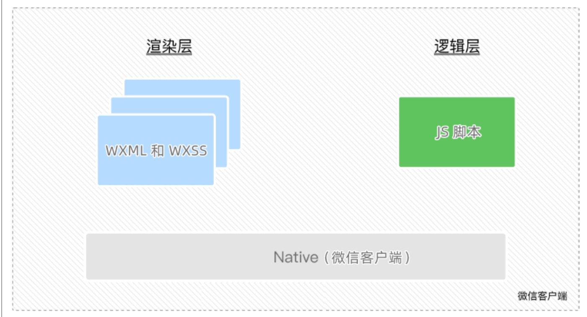


##### 02 | 小程序的通信模型

小程序中的通信模型分为两部分：

1. 渲染层和逻辑层之间的通信
   - 由微信客户端进行转发

2. 逻辑层和第三方服务器之间的通信
   - 由微信客户端进行转发

 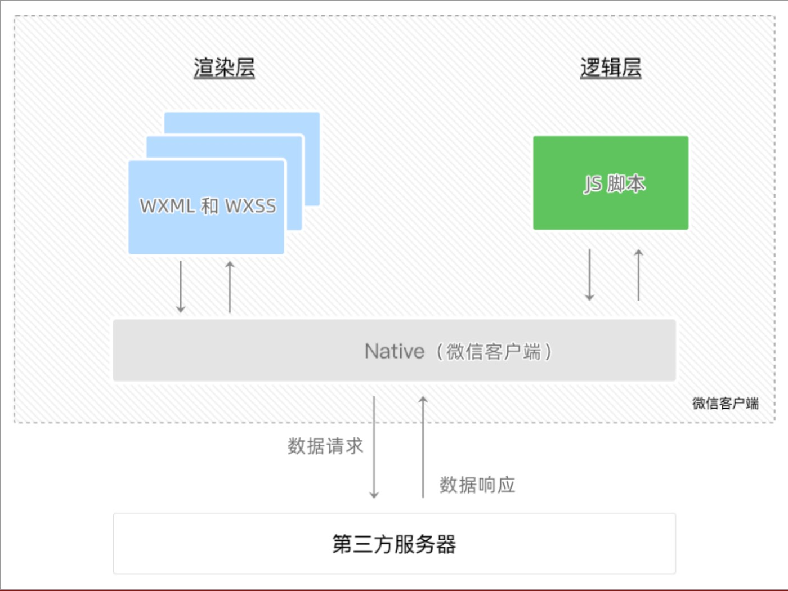


#### 04-05 | 运行机制

##### 01 | 小程序启动的过程

1. 把小程序的代码包下载到本地
2. 解析 app.json 全局配置文件
3. 执行 app.js 小程序入口文件，调用 App() 创建小程序实例
4. 渲染小程序首页
5. 小程序启动完成


##### 02 | 页面渲染的过程

1. 加载解析页面的 .json 配置文件
2. 加载页面的 .wxml 模板和 .wxss 样式
3. 执行页面的 .js 文件，调用 Page() 创建页面实例
4. 页面渲染完成


#### 04-06 | 组件

##### 01 | 小程序中组件的分类

小程序中的组件也是由宿主环境提供的，开发者可以基于组件快速搭建出漂亮的页面结构。官方把小程序的组

件分为了 9 大类，分别是：

1. 视图容器
2. 基础内容
3. 表单组件
4. 导航组件
5. 媒体组件
6. map 地图组件
7. canvas 画布组件
8. 开放能力
9. 无障碍访问


##### 02 | 常用的视图容器类组件

1. view
   - 普通视图区域
   - 类似于 HTML 中的 div，是一个块级元素
   - 常用来实现页面的布局效果

2. scroll-view

   - 可滚动的视图区域

   - 常用来实现滚动列表效果

3. swiper 和 swiper-item
   - 轮播图容器组件 和 轮播图 item 组件


##### 03 | view 组件的基本使用

实现如图的 flex 横向布局效果：

   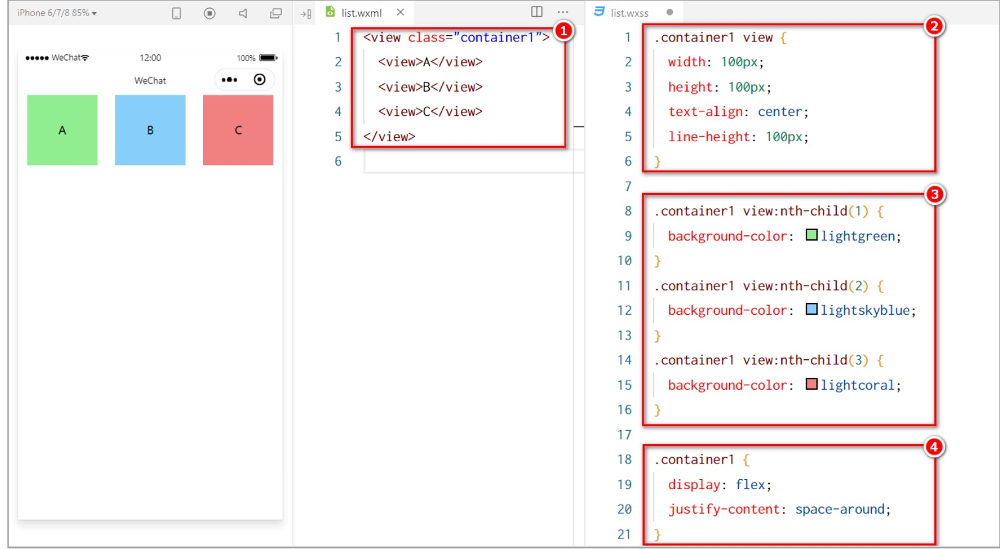


##### 04 | scroll-view 组件的基本使用

实现如图的纵向滚动效果：

   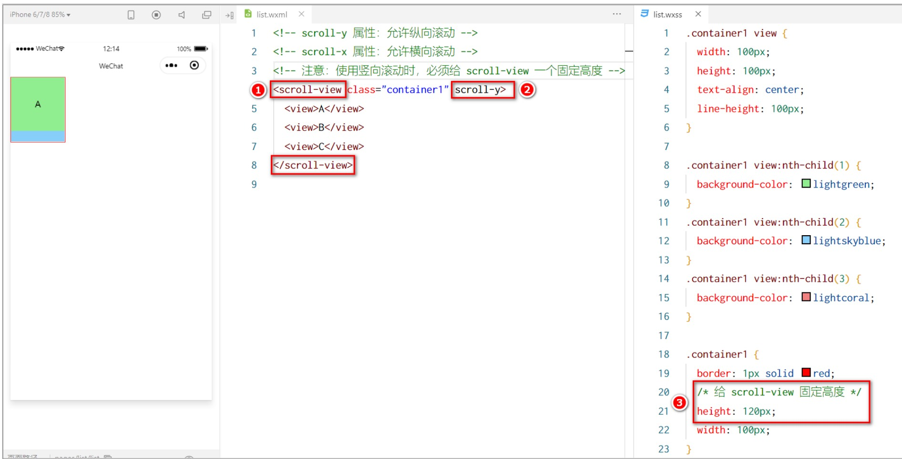

- scroll-x 属性：允许横向滚动
- scroll-y 属性：允许纵向滚动


##### 05 |  swiper 和 swiper-item 组件的基本使用

实现如图的轮播图效果：

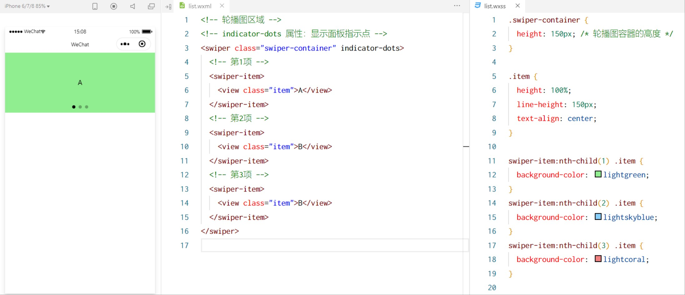


**swiper 组件常用属性**

|          属性          |  类型   |       默认值       |         说明         |
| :--------------------: | :-----: | :----------------: | :------------------: |
|     indicator-dots     | boolean |       false        |  是否显示面板指示点  |
|    indicator-color     |  color  | rgba(0, 0, 0, 0.3) |      指示点颜色      |
| indicator-active-color |  color  |      #000000       | 当前选中的指示点颜色 |
|        autoplay        | boolean |       false        |     是否自动切换     |
|        interval        | number  |        5000        |   自动切换时间健哥   |
|        circular        | boolean |       false        |   是否采用链接滑动   |


##### 06 | 常用的基础内容组件


#### 04-07 | API

