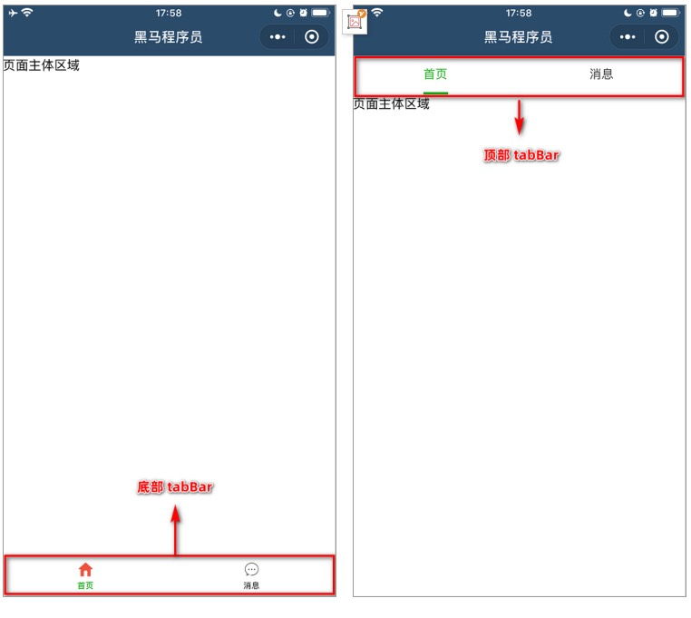

## 一、WXML 模板语法

### 01 | 数据绑定

 **1. 数据绑定的基本原则**

- 在 data 中定义数据
- 在 WXML 中使用数据


**2. 在 data 中定义页面的数据**

在页面对应的.js 文件中，把数据定义到 data 对象中即可：

```js
Page({
  data: {
    // 字符串类型的数据
    info: 'init data',
    // 数组类型的数据
    msgList: [{msg: 'hello'}, {msg:'world'}]
  },
```


**3. Mustache 语法的格式**

把data中的数据绑定到页面中渲染，使用 **Mustache 语法**（双大括号）将变量包起来即可。类似于 Vue 的插值表达式

语法格式为：

```js
<view>{{ 要绑定的数据名称 }}</view>
```


**4. Mustache 语法的应用场景**

Mustache 语法的主要应用场景如下：

- 绑定内容
- 绑定属性
- 运算：三元运算、算术运算等


**5. 动态绑定内容**

页面的数据如下：

```js
page({
  data: {
    info: 'init data'
  }
})
```

页面的结构如下：

```js
<view>{{ info }}</view>
```


**6. 动态绑定属性**

页面的数据如下：

```js
page({
  data: {
    imgSrc: 'http://xxxxxxxxxx.png'
  }
})
```

页面的结构如下：

```js
<image src="{{ imgSrc }}"></image>
```


**7. 三元运算**

页面的数据如下：

```js
page({
  data: {
    randomNum: Math.random() * 10 // 生成 10 以内的随机数
  }
})
```

页面的结构如下：

```js
<view>{{ randomNum >= 5 > '随机数字大于等于 5' : '随机数字小于 5' }}</view>
```


**8. 算数运算**

页面的数据如下：

```js
page({
  data: {
    randomNum: Math.random().toFixed(2) // 生成一个带两位小数的随机数，例如：0.44
  }
})
```

页面的结构如下：

```js
<view>生成100 以内的随机数：{{ randomNum * 100 }}</view>
```


### 02 | 事件绑定

#### 01 | 什么是时间

事件是渲染层到逻辑层的通讯方式。通过事件可以将用户在渲染层产生的行为，反馈到逻辑层进行业务的处理。

 

#### 02 | 小程序中常用的事件

| 类型   | 绑定方式                  | 事件描述                                        |
| ------ | ------------------------- | ----------------------------------------------- |
| tap    | bindtap 或 bind:tap       | 手指触摸后马上离开，类似于 HTML 中的 click 事件 |
| input  | bindinput 或 bind:input   | 文本框的输入事件                                |
| change | bindchange 或 bind:change | 状态改变时触发                                  |


#### 03 | **事件对象的属性列表**

当事件回调触发的时候，会收到一个事件对象 event，它的详细属性如下表所示：

| 属性           | 类型       | 说明                                         |
| -------------- | ---------- | -------------------------------------------- |
| type           | String     | 事件类型                                     |
| timeStamp      | Integer    | 页面打开到触发事件所经过的毫秒数             |
| **target**     | **Object** | **触发事件的组件的一些属性值合集**           |
| currentTarget  | Object     | 当前组件的一些属性值合集                     |
| **detail**     | **Object** | **额外的信息**                               |
| touchs         | Array      | 触摸时间，当前停留在屏幕中的触摸点信息的数组 |
| changedTouches | Array      | 触摸时间，当前变化的触摸点信息的数组         |


#### 04 |  **target 和 currentTarget 的区别**

target 是触发该事件的源头组件，而 currentTarget 则是当前事件所绑定的组件。

举例如下：

```js
<view class="outer-view" bindtap="outerHandler">
  <button type="primary">按钮</button>
</view>
```

点击内部的按钮时，点击事件以冒泡的方式向外扩散，也会触发外层 view 的 tap 事件处理函数。

此时，对于外层的 view 来说：

- e.target 指向的是触发事件的源头组件，因此，**e.target 是内部的按钮组件**
- e.currentTarget 指向的是当前正在触发事件的那个组件，因此，**e.currentTarget 是当前的 view 组件**


#### 05 | bindtap 的语法格式

在小程序中，不存在 HTML 中的 onclick 鼠标点击事件，而是通过 tap 事件来响应用户的触摸行为。

- 通过 bindtap，可以为组件绑定 tap 触摸事件，语法如下：

  ```js
  // 页面的 wxml 文件
  
  <button type="primary" bindtap="btnTapHandler">按钮</button>
  ```

- 在页面的 .js 文件中定义对应的事件处理函数，事件参数通过形参 event（一般简写成 e） 来接收：

  ```js
  // 页面对应的 js 文件
  
  Page({
    btnTapHandler(e) { // tap 事件处理函数
      console.log(e)   // 数对象 e
    }
  })
  ```

  

#### 06 | **在事件处理函数中为 data 中的数据赋值**

通过调用 `this.setData(dataObject)` 方法，可以给页面 data 中的数据重新赋值，示例如下：

```js
// 页面的 js 文件
Page({
	data: {
		count: 0
	},
	// 修改 count 的值
	changeCount() {
		this.setData({
			count: this.data.count+1
		})  
	}
})
```


#### 07 | 事件传参

小程序中的事件传参比较特殊，不能在绑定事件的同时为事件处理函数传递参数。例如，下面的代码将不能正常工作

```js
// 页面的 wxml 文件

<button type="primary" bindtap="btnTapHandler(123)">按钮</button>
```

因为小程序会把 bindtap 的属性值，统一当作事件名称来处理，相当于要调用一个名称为 btnHandler(123) 的事件处理函数。


**正确传参：**

可以为组件提供 `data-*` 自定义属性传参，其中 `*` 代表的是参数的名字，示例代码如下：

```js
// 页面的 wxml 文件

<button type="primary" bindtap="btnTapHandler" data-info="{{}2}">按钮-事件传参</button>
```

最终：

- `info` 会被解析为参数的名字
- `数值 2` 会被解析为参数的值


**获取参数：**

在事件处理函数中，通过 `event.target.dataset.参数名` 即可获取到具体参数的值，示例代码如下：

```js
// 页面对应的 js 文件

btnTapHandler (event) {
  // dataset 是一个对象，包含了所有通过 data-* 传递过来的参数
	console.log(event.target.dataset)
  // 通过 dataset 可以访问到具体参数的值
  console.log(event.target.dataset.info)
}
```

- `dataset` 是一个对象，包含了所有通过 `data-*` 传递过来的参数


#### 08 |  **bindinput 的语法格式**

在小程序中，通过 input 事件来响应文本框的输入事件，语法格式如下：

- 通过 bindinput，可以为文本框绑定输入事件：

  ```js
  <input type="text" bindinput="inputHnadler"></input>
  ```

- 在页面的 .js 文件中定义事件处理函数：

  ```js
  inputHnadler(event) {
    // e.detail.value 是变化后的值，文本框最新的值
    console.log(e.detail.value)
  }
  ```


#### 09 | **实现文本框和 data 之间的数据同步**

实现步骤：

1. 定义数据
2. 渲染结构
3. 美化样式
4. 绑定 input 事件处理函数


**1. 定义数据**

```js
// 页面的 js 文件

Page({
  data: {
    msg: '你好'
  }
})
```


**2. 渲染结构**

```html
// 页面的 wxml 文件

<input type="text" bindinput="inputHnadler" value="{{ msg }}"></input>
```


**3. 美化样式**

```css
// 页面的 wxss 文件

input {
  border: 1px solid #eee;
  padding: 5px;
  margin: 5px;
  boder-radius: 3px;
}
```


**4. 绑定 input 事件处理函数**

```js
// 页面的 js 文件

Page({
  data: {
    msg: '你好'
  }, 
  // 文本框内容改变的事件
  inputHnadler(event) {
    this.setData({
      // 通过 e.detail.value 获取到文本框最新的值
      msg: event.detaul.value
    })
  }
})
```


### 03 | 条件渲染

#### 01 | wx:if

在小程序中，使用 `wx:if="{{condition}}"` `来判断是否需要渲染该代码块：

```html
// 页面的 wxml 文件

<view wx:if="{{condition}}"> True </view>
```

也可以用 wx:elif 和 wx:else 来添加 else 判断：

```js
// 页面的 wxml 文件

<view wx:if="{{type === 1}}"> True </view>
<view wx:elif="{{type === 2}}"> True </view>
<view wx:else> 保密 </view>
```


**总结：**

- 类似于 vue 中的 v-if、v-else等
- wx:if
- wx:elif
- wx:else


#### 02 | 结合 `<block>` 使用 wx:if

如果要一次性控制 `多个` 组件的展示与隐藏，可以使用一个  `<block></block>` 标签将多个组件包装起来，并在 `<block>` 标签上使用 `wx:if` 控制属性，示例如下：

```js
// 页面的 wxml 文件

<block wx:if="{{true}}">
  <view>view1</view>
  <view>view2</view>
  <view>view3</view>
</block>
```

> 注意： `<block>` 并不是一个组件，它只是一个包裹性质的容器，不会在页面中做任何渲染。


#### 03 | hidden

在小程序中，直接使用 `hidden="{{ condition }}"` 也能控制元素的显示与隐藏：

```js
// 页面的 wxml 文件

<view hidden="{{ contition }}">条件为 true 隐藏，条件为 false 显示</view>
```


#### 04 | **wx:if 与 hidden 的对比**

- 运行方式不同 
  - `wx:if` 以动态 `创建` 和 `移除` 元素的方式，控制元素的展示与隐藏
  - `hidden` 以切换样式的方式（display: none/block;），控制元素的显示与隐藏

- 使用建议
  - 频繁切换时，建议使用 hidden
  - 控制条件复杂时，建议使用 wx:if 搭配 wx:elif、wx:else 进行展示与隐藏的切换


### 04 | 列表渲染

#### 01 | wx:for

通过 `wx:for` 可以根据指定的数组，循环渲染重复的组件结构，语法示例如下：

```js
// 页面的 wxml 文件

<view wx:for="{{ array }}">
  索引是：{{ index }}，当前项是: {{ item }}
</view>
```

默认情况下，当前循环项的 `索引` 用 `index` 表示；`当前循环项` 用 `item` 表示。


#### 02 | **手动指定索引和当前项的变量名\*** 

- 使用 `wx:for-index` 可以指定当前循环项的索引的变量名

- 使用 `wx:for-item` 可以指定当前项的变量名

示例代码如下：

```js
// 页面的 wxml 文件

<view wx:for="{{ array }}" wx:for-index="idx" wx:for-item="obj">
  索引是：{{ idx }}，当前项是: {{ obj }}
</view>
```


#### 03 |  wx:key 的使用

类似于 Vue 列表渲染中的 ``**:key**``，小程序在实现列表渲染时，也建议为渲染出来的列表项指定唯一的 key 值，从而提高渲染的效率，

示例代码如下：

```js
data: {
  userList: [
    {id: 1, name: "战三"},
    {id: 2, name: "李四"},
    {id: 3, name: "王五"},
    {id: 4, name: "赵六"},
  ]
}

// wxml 结构

<view wx:for="{{ userList }}" wx:key="id">{{ item.name }}</view>
```


## 二、WXSS 模板样式

WXSS (WeiXin Style Sheets)是一套样式语言，用于美化 WXML 的组件样式，类似于网页开发中的 CSS。


**wxss 和 css 的关系：**

WXSS 具有 CSS 大部分特性，同时，WXSS 还对 CSS 进行了扩充以及修改，以适应微信小程序的开发。与 CSS 相比，WXSS 扩展的特性

有：

- rpx 尺寸单位

- @import 样式导入


### 01 | rpx

rpx（responsive pixel）是微信小程序独有的，用来解决屏适配的尺寸单位。


#### 01 | rpx 的实现原理

rpx 的实现原理非常简单：鉴于不同设备屏幕的大小不同，为了实现屏幕的自动适配，rpx 把所有设备的屏幕，在宽度上等分为 750 份

（即：当前屏幕的总宽度为 750rpx）。

- 在较小的设备上，1rpx 所代表的宽度较小

- 在较大的设备上，1rpx 所代表的宽度较大

小程序在不同设备上运行的时候，会自动把 rpx 的样式单位换算成对应的像素单位来渲染，从而实现屏幕适配。


#### 02 |  **rpx 与 px 之间的单位换算\***

在 iPhone6 上，屏幕宽度为375px，共有 750 个物理像素，等分为 750 rpx。则：

750rpx = 375px = 750 物理像素

1rpx = 0.5px = 1 物理像素

| 设备         | rpx 换算 px：屏幕宽度 / 750 | px换算 rpx：750 / 屏幕宽度 |
| ------------ | --------------------------- | -------------------------- |
| iphone5      | 1 rpx = 0.42 px             | 1px = 2.34 rpx             |
| Iphone6      | 1 rpx = 0.5 px              | 1 px = 2 rpx               |
| Iphone6 Plus | 1 rpx = 0.552 px            | 1 px = 1.81 rpx            |

官方建议：开发微信小程序时，设计师可以用 iPhone6 作为视觉稿的标准。

开发举例：在 iPhone6 上如果要绘制宽100px，高20px的盒子，换算成rpx单位，宽高分别为 200rpx 和 40rpx。


### 02 | 样式导入

使用 WXSS 提供的 @import 语法，可以导入外联的样式表。


**@import 的语法格式**

@import 后跟需要导入的外联样式表的相对路径，用 ; 表示语句结束。示例如下：

```css
// common.wxss
.small-p {
  padding: 5px
}

// app.wxss
@import "common.wxss"
.middle-p {
	padding: 15px;    
}
```


### 03 | **全局样式和局部样式**

**全局样式：**

定义在 `app.wxss` 中的样式为全局样式，作用于每一个页面。


**局部样式：**

在页面的  `.wxss` 文件中定义的样式为局部样式，只作用于当前页面。

注意：

- 当局部样式和全局样式冲突时，根据就近原则，局部样式会覆盖全局样式

- 当局部样式的权重大于或等于全局样式的权重时，才会覆盖全局的样式


## 三、全局配置

### 01 | **全局配置文件及常用的配置项**

小程序根目录下的 app.json 文件是小程序的全局配置文件。常用的配置项如下：

- pages
  - 记录当前小程序所有页面的存放路径

- window
  - 全局设置小程序窗口的外观

- tabBar
  - 设置小程序底部的 tabBar 效果

- style
  - 是否启用新版的组件样式


### 02 | window

**小程序窗口的组成部分**

 

#### 01 | **了解 window 节点常用的配置项**

| 属性名                       | 类型     | 默认值  | 说明                                              |
| ---------------------------- | -------- | ------- | ------------------------------------------------- |
| navigationBarTitleText       | String   | 字符串  | 导航栏标题文字内容                                |
| navigationBarBackgroundColor | HexColor | #000000 | 导航栏背景颜色，如#000000                         |
| navigationBarTextStyle       | String   | white   | 导航栏标题颜色，仅支持 black、white               |
| backgroundColor              | HexColor | #ffffff | 窗口的背景色                                      |
| backgroundTextStyle          | String   | dark    | 下拉 loading 的样式，仅支持 dark、light           |
| enablePullDownRefresh        | Boolean  | false   | 是否全局开启下拉刷新                              |
| onReachBottomDistance        | Number   | 50      | 页面上拉触底事件触发时距页面底部的距离，单位为 px |


**设置导航栏的标题**

设置步骤：

app.json -->  window --> navigationBarTitleText


**设置导航栏的背景色**

设置步骤：

app.json -->  window --> navigationBarBackgroundColor


**设置导航栏的标题颜色**

设置步骤：

app.json -->  window --> navigationBarTextStyle


**全局开启下拉刷新功能**

下拉刷新是移动端的专有名词。

设置步骤：

app.json -->  window --> 把 enablePullDownRefresh 的值设置为 true

> 注意： 在 app.json 中启用下拉刷新功能，会作用于每个小程序页面


**设置下拉刷新时窗口的背景色**

当全局开启下拉刷新功能滞后，默认的窗口颜色为白色。如果自定义下拉刷新窗口背景色，设置步骤为：

app.json -->  window --> 为 backgroundColor 指定 16 进制的颜色值 #efefef。


**设置下拉刷新时 loading 的样式**

当全局开启下拉刷新功能滞后，默认的 loading 样式为白色。如果自要更改 loading 样式的效果，设置步骤为：

app.json -->  window --> 为 backgroundTextStyle 指定dark 值。


**设置上拉触底的距离**

概念：上拉触底是移动端的专有名词，通过手指在屏幕上的上拉滑动操作，从而加载更多数据的行为。

设置步骤：

app.json -->  window --> 为 onReachBottomDistance 设置新的数值。

> 默认距离是 50px，如果没有特殊需求，建议使用默认值


### 03 | tabbar

#### 01 | 什么是 tabbar

tabBar 是移动端应用常见的页面效果，用于实现多页面的快速切换。小程序中通常将其分为：

- 底部 tabBar

- 顶部 tabBar

注意：

- tabBar中只能配置最少 2 个、最多 5 个 tab 页签

- 当渲染顶部 tabBar 时，不显示 icon，只显示文本s

 

#### 02 | **tabBar 的 6 个组成部分**

- backgroundColor：tabBar 的背景色

- selectedIconPath：选中时的图片路径

- borderStyle：tabBar 上边框的颜色

- iconPath：未选中时的图片路径

- selectedColor：tab 上的文字选中时的颜色

- color：tab 上文字的默认（未选中）颜色

 


#### 03 |  **tabBar 节点的配置项**

| 属性            | 类型     | 必填 | 默认值 | 描述                                    |
| --------------- | -------- | ---- | ------ | --------------------------------------- |
| position        | String   | 否   | bottom | tabBar 的位置，仅支持 bottom、top       |
| borderStyle     | String   | 否   | black  | tabBar 上边框的颜色，仅支持 black/white |
| color           | HexColor | 否   |        | tab 上文字的默认（未选中）颜色          |
| selectedColor   | HexColor | 否   |        | tab 上的文字选中时的颜色                |
| backgroundColor | HexColor | 否   |        | tabBar 的背景色                         |
| list            | Array    | 是   |        | tab 页签的列表，最少 2 个，最多 5 个    |


#### 04 |  **每个 tab 项的配置选项**

| 属性             | 类型   | 必填 | 默认值                                                |
| ---------------- | ------ | ---- | ----------------------------------------------------- |
| pagePath         | String | 是   | 页面路径，页面必须在 pages 中预先定义                 |
| text             | String | 是   | tab 上显示的文字                                      |
| iconPath         | String | 否   | 未选中时的图标路径；当 postion 为 top 时，不显示 icon |
| selectedIconPath | String | 否   | 选中时的图标路径；当 postion 为 top 时，不显示 icon   |


## 四、页面配置

 **1. 页面配置文件的作用**

小程序中，每个页面都有自己的 .json 配置文件，用来对当前页面的窗口外观、页面效果等进行配置。


 **2. 页面配置和全局配置的关系**

小程序中，`app.json` 中的 window 节点，可以全局配置小程序中每个页面的窗口表现。

如果某些小程序页面想要拥有特殊的窗口表现，此时，“页面级别的 .json 配置文件”就可以实现这种需求。

注意：当页面配置与全局配置冲突时，根据就近原则，最终的效果以页面配置为准。


**3. 页面配置中常用的配置项**

| 属性名                       | 类型     | 默认值  | 说明                                              |
| ---------------------------- | -------- | ------- | ------------------------------------------------- |
| navigationBarTitleText       | String   | 字符串  | 当前页面导航栏标题文字                            |
| navigationBarBackgroundColor | HexColor | #000000 | 当前页面导航栏背景颜色，如#000000                 |
| navigationBarTextStyle       | String   | white   | 当前页面导航栏标题颜色，仅支持 black、white       |
| backgroundColor              | HexColor | #ffffff | 当前页面窗口的背景色                              |
| backgroundTextStyle          | String   | dark    | 当前页面下拉 loading 的样式，仅支持 dark、light   |
| enablePullDownRefresh        | Boolean  | false   | 是否为当前页面开启下拉刷新                        |
| onReachBottomDistance        | Number   | 50      | 页面上拉触底事件触发时距页面底部的距离，单位为 px |


## 五、网络数据请求

### 01 | **小程序中网络数据请求的限制**

出于安全性方面的考虑，小程序官方对数据接口的请求做出了如下

两个限制：

- 只能请求 HTTPS 类型的接口

- 必须将接口的域名添加到信任列表中

 


### 02 |  **配置 request 合法域名**

需求描述：假设在自己的微信小程序中，希望请求 https://www.escook.cn/ 域名下的接口

配置步骤：登录微信小程序管理后台 -> 开发 -> 开发设置 -> 服务器域名 -> 修改 request 合法域名

注意事项：

- 域名只支持 https 协议

- 域名不能使用 IP 地址或 localhost

- 域名必须经过 ICP 备案

- 服务器域名一个月内最多可申请 5 次修改


### 03 |  **发起 GET 请求**

调用微信小程序提供的 wx.request() 方法，可以发起 GET 数据请求，示例代码如下：

```js
wx.request({
  url: 'url',
  method: 'GET'
  data: {
    name: 'zs',
    age: 22
  },
  success: (res) => {
    console.log(res)
  }
})
```


### 04 | 发起 POST 请求

调用微信小程序提供的 wx.request() 方法，可以发起 POST 数据请求，示例代码如下：

```js
wx.request({
  url: 'url',
  method: 'POST'
  data: {
    name: 'zs',
    age: 22
  },
  success: (res) => {
    console.log(res)
  }
})
```


### 05 |  **在页面刚加载时请求数据**

在很多情况下，我们需要在页面刚加载的时候，自动请求一些初始化的数据。此时需要在页面的 onLoad 事件中调用获取数据的函数。

示例代码如下：

 


### 06 | **跳过 request 合法域名校验**

如果后端程序员仅仅提供了 http 协议的接口、暂时没有提供 https 协议的接口。

此时为了不耽误开发的进度，我们可以在微信开发者工具中，临时开启「开发环境不校验请求域名、TLS 版本及 HTTPS 证书」选项，

跳过 request 合法域名的校验。

 

注意：

跳过 request 合法域名校验的选项，仅限在开发与调试阶段使用！


### 07 |  关于跨域和 Ajax 的说明

跨域问题只存在于基于浏览器的 Web 开发中。由于小程序的宿主环境不是浏览器，而是微信客户端，所以小程序中不存在跨域的问题。

Ajax 技术的核心是依赖于浏览器中的 XMLHttpRequest 这个对象，由于小程序的宿主环境是微信客户端，所以小程序中不能叫做“发起 

Ajax 请求”，而是叫做“发起网络数据请求”。
