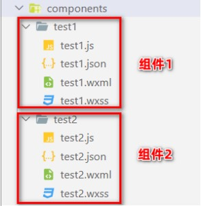
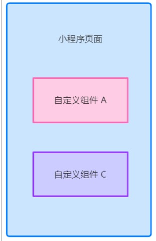

## 一、自定义组件

### 01 | 组件的创建和引用

#### 01 |  **创建组件**

1. 在项目的根目录中，鼠标右键，创建 components -> test 文件夹

2. 在新建的 components -> test 文件夹上，鼠标右键，点击“新建 Component” 

3. 键入组件的名称之后回车，会自动生成组件对应的 4 个文件，后缀名分别为 .js，.json， .wxml 和 .wxss

   

注意：为了保证目录结构的清晰，建议把不同的组件，存放到单独目录中，例如：

 


#### 02 |  **引用组件**

组件的引用方式分为“局部引用”和“全局引用”，顾名思义：

- 局部引用：组件只能在当前被引用的页面内使用

- 全局引用：组件可以在每个小程序页面中使用


#### 03 | 局部引用组件

在页面的 .json 配置文件中引用组件的方式，叫做“局部引用”。示例代码如下：

```js
{
  "usingComponents": {
    "my_test1": "./components/test1/test1"
  }
}

// 在页面的 .wxml 文件中，使用组件
<my_test1></my_test1>
```


#### 04 | 全局引用组件

在 app.json 全局配置文件中引用组件的方式，叫做“全局引用”。示例代码如下：

```js
// 在 app.json 文件 usingComponents 字段中，引入组件
{
  "pages":[ ... ],
  "window":{ ... },
  "usingComponents": {
    "my_test2": "/components/test2/test2"
  }
}

// 在页面的 .wxml 做文件中使用组件
<my_test2></my_test2>
```


#### 05 | **全局引用 VS 局部引用**

根据组件的使用频率和范围，来选择合适的引用方式：

- 如果某组件在多个页面中经常被用到，建议进行“全局引用”

- 如果某组件只在特定的页面中被用到，建议进行“局部引用”


#### 06 | **组件和页面的区别**

从表面来看，组件和页面都是由 .js、.json、.wxml 和 .wxss 这四个文件组成的。但是，组件和页面的 .js 与 .json 文件有明显的不同：

- 组件的 .json 文件中需要声明 "component": true 属性

- 组件的 .js 文件中调用的是 Component() 函数

- 组件的事件处理函数需要定义到 methods 节点中


### 02 | **样式**

#### 01 | **组件样式隔离**

默认情况下，自定义组件的样式只对当前组件生效，不会影响到组件之外的 UI 结构，如图所示：

- 组件 A 的样式不会影响组件 C 的样式

- 组件 A 的样式不会影响小程序页面的样式

- 小程序页面的样式不会影响组件 A 和 C 的样式

好处：

- 防止外界的样式影响组件内部的样式

- 防止组件的样式破坏外界的样式

 


#### 02 | **组件样式隔离的注意点**

- app.wxss 中的全局样式对组件无效

- 只有 class 选择器会有样式隔离效果，id 选择器、属性选择器、标签选择器不受样式隔离的影响


建议：在组件和引用组件的页面中建议使用 class 选择器，**不要使用** id、属性、标签选择器！


#### 03 | **修改组件的样式隔离选项**

默认情况下，自定义组件的样式隔离特性能够防止组件内外样式互相干扰的问题。但有时，我们希望在外界能够控制组件内部的样式，此

时，可以通过 styleIsolation 修改组件的样式隔离选项，用法如下:

```js
// 在组件的 .js 文件中新增如下配置
Component({
  options: {
    styleIsolation: 'isolated'
  }
})

// 或在组件的 .json 中新增如下配置
{
  "styleIsolation": "isolated"
}
```


#### 04 | **styleIsolation 的可选值**

|    可选值    | 默认值 |                             描述                             |
| :----------: | :----: | :----------------------------------------------------------: |
|   isolated   |   是   | 表示启用样式隔离，在自定义组件内外，使用 class 指定的样式将不会相互影响 |
| apply-shared |   否   | 表示页面 wxss 样式将影响到自定义组件，但自定义组件 wxss 中指定的样式不会影响页面 |
|    shared    |   否   | 表示页面 wxss 样式将影响到自定义组件，自定义组件 wxss 中指定的样式也会影响页面和其他设置了 apply-shared 或 shared 的自定义组件 |


### 03 |  **数据、方法和属性**

#### 01 | data 数据

在小程序组件中，用于组件模板渲染的私有数据，需要定义到 data 节点中，示例如下：

```js
Component({
  options: {
    styleIsolation: 'isolated'
  }，
  // 组件的初始数据
  data: {
  	count: 0
  }
})
```


#### 02 |  **methods 方法**

在小程序组件中，事件处理函数和自定义方法需要定义到 methods 节点中，示例代码如下：

```js
Component({
  options: {
    styleIsolation: 'isolated'
  }，
  // 组件的初始数据
  data: {
  	count: 0
  },
	methods: {
     addCount() {
  			this.setData({
          count: thid.data.count + 1
        }),
        this._showCount();
		 },
     _showCount() {
       wx.showToast({
         title: 'count值为：' + this.data.count,
         icon: 'none'
       })
     }
  }
})
```


#### 03 | **properties 属性**

在小程序组件中，properties 是组件的对外属性，用来接收外界传递到组件中的数据，示例代码如下：

```js
Component({
  ...
  properties: {
    max: {  // 完整定义属性的方式: 当需要指定属性默认值时，建议使用此方式
      type: Number, // 属性值的数据类型
      value: 10  // 属性默认值
    },
    max: Number // 简化定义属性的方式：不需要指定属性默认值时，可以使用简化方式
  }
})
```


#### 04 | **data 和 properties 的区别**

在小程序的组件中，properties 属性和 data 数据的用法相同，它们都是可读可写的，只不过：

- data 更倾向于存储组件的私有数据

- properties 更倾向于存储外界传递到组件中的数据

```js
Component({
  methods: {
    showInfo() {
      console.log(this.data)
      console.log(this.properties)
      console.log(this.data === this.properties)
    }
  }
})
```


#### 05 | **使用 setData 修改 properties 的值**

由于 data 数据和 properties 属性在本质上没有任何区别，因此 properties 属性的值也可以用于页面渲染，或使用 setData 为 

properties 中的属性重新赋值，示例代码如下：

```js
// 在组件的 .wxml 文件中使用 properties 属性的值
<view> max属性的值为：{{ max }} </view>

Component({
  properties: {max: Number}, // 定义属性
  methods: {
    addCount: {
      // 使用 setData 修改属性的值
      this.setData({ max: this.properties.max + 1})
    }
  }
})
```


### 04 |  **数据监听器**

#### 01 | **什么是数据监听器**

数据监听器用于监听和响应任何属性和数据字段的变化，从而执行特定的操作。它的作用类似于 vue 中的 watch 侦听器。在小程序组件

中，数据监听器的基本语法格式如下：

```js
Component({
  observers: {
    '字段 A，字段 B': function(字段 A 的新值, 字段 B 的新值) {
       // do something
    }
  }
})
```


#### 02 | **数据监听器的基本用法**

组件的 UI 结构如下：

```html
<view> {{ n11}} + {{ n2 }}</view>
<button size="mini" bindtap="addN1">n1自增</button>
<button size="mini" bindtap="addN2">n2自增</button>
```

组件的 .js 文件代码如下：

```js
Component({
  data: {n1: 0, n2: 0, sum: 0}, // 数据节点
  methods: { // 方法列表
    addN1(){ this.setData({ n1: this.data.n1 + 1 })},
    addN2(){ this.setData({ n2: this.data.n2 + 1 })},
  },
  observers: { // 数据监听节点
    'n1, n2': function(n1, n2) { // 监听 n1 和 n2 数据的变化
      this.setData({ sum: n1 + n2 }) // 通过监听器，自动计算 sum 的值
    }
  }
})
```


#### 03 |  **监听对象属性的变化**

数据监听器支持监听对象中单个或多个属性的变化，示例语法如下：

```js
Component({
  observers: {
    '对象.属性A, 对象.属性B': function(属性 A 的新值, 属性 B 的新值) {
      // 触发此监听器的 3 种情况
      // 为 属性A 赋值，使用 setData 设置 this.data.对象.属性A 时触发
      // 为 属性B 赋值，使用 setData 设置 this.data.对象.属性B 时触发
      // 直接为对象赋值，使用 setData 设置 this.data.对象 时触发
      // do something
    }
  }
})
```


### 05 | **纯数据字段**

#### 01 |  **什么是纯数据字段**

概念：纯数据字段指的是那些不用于界面渲染的 data 字段。

应用场景：例如有些情况下，某些 data 中的字段既不会展示在界面上，也不会传递给其他组件，仅仅在当前组件内部使用。带有这种特

性的 data 字段适合被设置为纯数据字段。

好处：纯数据字段有助于提升页面更新的性能。


#### 02 | 使用规则

在 Component 构造器的 options 节点中，指定 pureDataPattern 为一个正则表达式，字段名符合这个正则表达式的字段将成为纯数据

字段，示例代码如下：

```js
Component({
  options: {
    // 指定所有 _ 开头的数据字段为纯数据字段
  },
  data: {
    a: true, // 普通数据字段
    _b: true // 纯数据字段
  }
})
```


#### 03 | **使用纯数据字段改造数据监听器案例**

```js
Component({
  options: {
    // 指定所有 _ 开头的数据字段为纯数据字段
    pureDataPattern: /^_/
  },
  data: {
    // 将 rgb 改造为以 _ 开头的纯数据字段
    _rgb: {
      r: 0,
      g: 0,
      b: 0
    },
    fullColor: '0,0,0'
  }
})
```


### 06 | 组件的生命周期

#### 01 |  组件全部的生命周期函数

| **生命周期函数** | **参数** | **描述说明**                             |
| ---------------- | -------- | ---------------------------------------- |
| **created**      | **无**   | **在组件实例刚刚被创建时执行**           |
| **attached**     | **无**   | **在组件实例进入页面节点树时执行**       |
| ready            | 无       | 在组件在视图层布局完成后执行             |
| moved            | 无       | 在组件实例被移动到节点树另一个位置时执行 |
| **detached**     | **无**   | **在组件实例被从页面节点树移除时执行**   |
| error            | 无       | 每当组件方法抛出错误时执行               |


#### 02 | 组件主要的生命周期函数

在小程序组件中，最重要的生命周期函数有 3 个，分别是 created、**attached**、detached。它们各自的特点如下：

1. 组件实例刚被创建好的时候，created 生命周期函数会被触发
   - 此时还不能调用 setData
   - 通常在这个生命周期函数中，只应该用于给组件的 this 添加一些自定义的属性字段

2. 在组件完全初始化完毕、进入页面节点树后， attached 生命周期函数会被触发
   - 此时， this.data 已被初始化完毕
   - 这个生命周期很有用，绝大多数初始化的工作可以在这个时机进行（例如发请求获取初始数据）

3. 在组件离开页面节点树后， detached 生命周期函数会被触发
   - 退出一个页面时，会触发页面内每个自定义组件的 detached 生命周期函数
   - 此时适合做一些清理性质的工作


#### 03 |  **lifetimes** **节点**

在小程序组件中，生命周期函数可以直接定义在 Component 构造器的第一级参数中，可以在 lifetimes 字段内进行声明（这是推荐的方

式，其优先级最高）。示例代码如下：

```js
Component({
  // 推荐用法
  lifetimes: {
    attached() { }, // 在组件实例进入页面节点树时执行
    detached() { }, // 在组件实例被从页面节点树移除时执行
  }
})
```


### 07 | **组件所在页面的生命周期**

#### 01 |  **什么是组件所在页面的生命周期**

有时，自定义组件的行为依赖于页面状态的变化，此时就需要用到组件所在页面的生命周期。

例如：每当触发页面的 show 生命周期函数的时候，我们希望能够重新生成一个随机的 RGB 颜色值。

在自定义组件中，组件所在页面的生命周期函数有如下 3 个，分别是：

| 生命周期函数 | 参数        | 描述                         |
| ------------ | ----------- | ---------------------------- |
| show         | 无          | 组件所在的页面被展示时执行   |
| hide         | 无          | 组件所在的页面被隐藏时执行   |
| resize       | Object Size | 组件所在的页面尺寸变化时执行 |


#### 02 | **pageLifetimes** **节点**

组件所在页面的生命周期函数，需要定义在 pageLifetimes 节点中，示例代码如下：

```js
Component({
  // 推荐用法
  pageLifetimes: {
    show: function() {}, // 页面被展示
    hide: function() {}, // 页面被隐藏
    resize: function() {}, // 页面尺寸变化
  }
})
```


## 二、使用 npm 包


## 三、全局数据共享


## 四、分包


