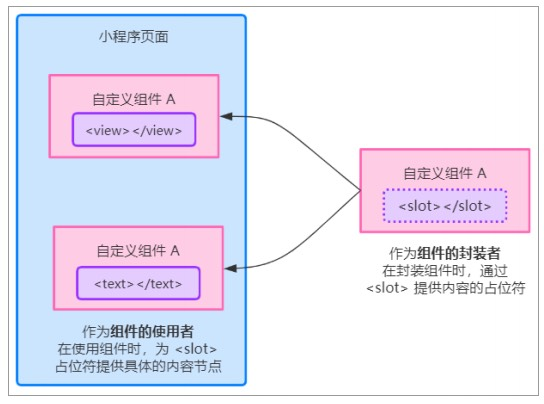
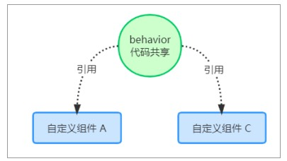
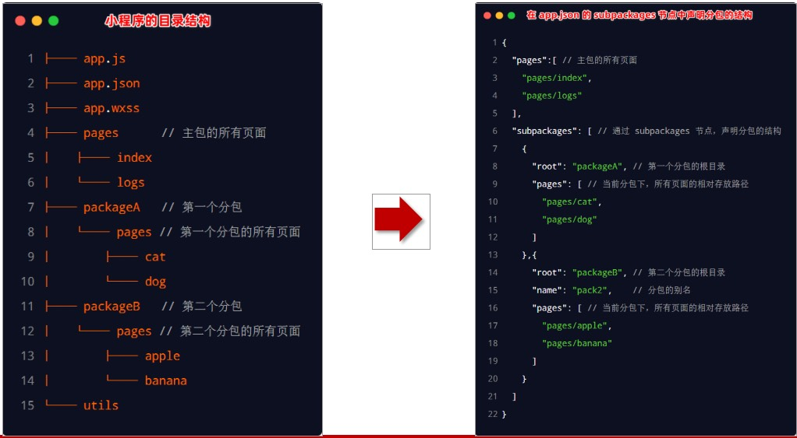
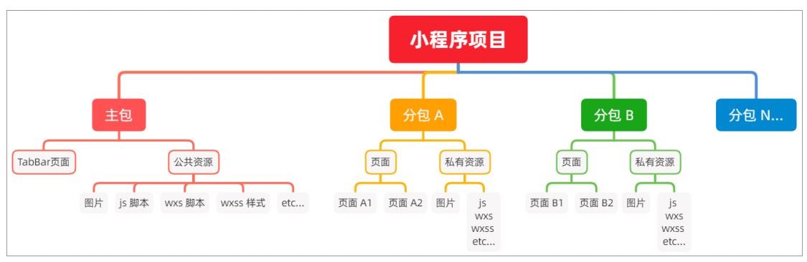
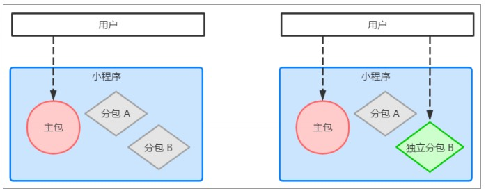
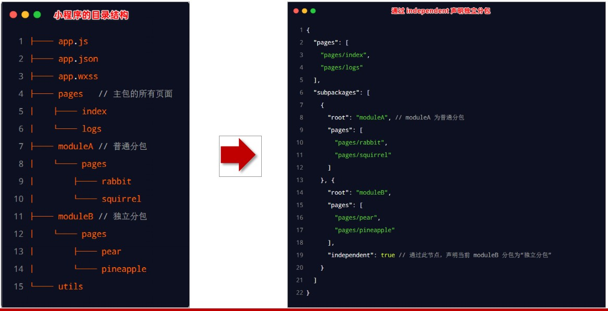
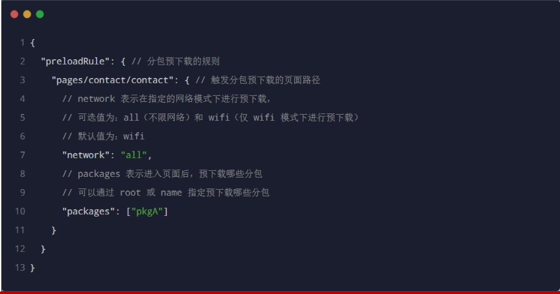
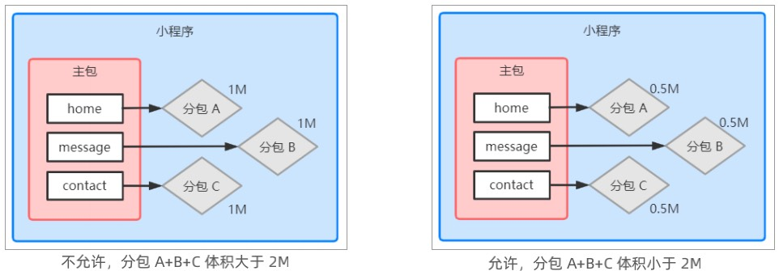

## 一、自定义组件

### 01 | 组件的创建和引用

#### 01 |  **创建组件**

1. 在项目的根目录中，鼠标右键，创建 components -> test 文件夹

2. 在新建的 components -> test 文件夹上，鼠标右键，点击“新建 Component” 

3. 键入组件的名称之后回车，会自动生成组件对应的 4 个文件，后缀名分别为 .js，.json， .wxml 和 .wxss

   

注意：为了保证目录结构的清晰，建议把不同的组件，存放到单独目录中，例如：

 


#### 02 |  **引用组件**

组件的引用方式分为“局部引用”和“全局引用”，顾名思义：

- 局部引用：组件只能在当前被引用的页面内使用

- 全局引用：组件可以在每个小程序页面中使用


#### 03 | 局部引用组件

在页面的 .json 配置文件中引用组件的方式，叫做“局部引用”。示例代码如下：

```js
{
  "usingComponents": {
    "my_test1": "./components/test1/test1"
  }
}

// 在页面的 .wxml 文件中，使用组件
<my_test1></my_test1>
```


#### 04 | 全局引用组件

在 app.json 全局配置文件中引用组件的方式，叫做“全局引用”。示例代码如下：

```js
// 在 app.json 文件 usingComponents 字段中，引入组件
{
  "pages":[ ... ],
  "window":{ ... },
  "usingComponents": {
    "my_test2": "/components/test2/test2"
  }
}

// 在页面的 .wxml 做文件中使用组件
<my_test2></my_test2>
```


#### 05 | **全局引用 VS 局部引用**

根据组件的使用频率和范围，来选择合适的引用方式：

- 如果某组件在多个页面中经常被用到，建议进行“全局引用”

- 如果某组件只在特定的页面中被用到，建议进行“局部引用”


#### 06 | **组件和页面的区别**

从表面来看，组件和页面都是由 .js、.json、.wxml 和 .wxss 这四个文件组成的。但是，组件和页面的 .js 与 .json 文件有明显的不同：

- 组件的 .json 文件中需要声明 "component": true 属性

- 组件的 .js 文件中调用的是 Component() 函数

- 组件的事件处理函数需要定义到 methods 节点中


### 02 | **样式**

#### 01 | **组件样式隔离**

默认情况下，自定义组件的样式只对当前组件生效，不会影响到组件之外的 UI 结构，如图所示：

- 组件 A 的样式不会影响组件 C 的样式

- 组件 A 的样式不会影响小程序页面的样式

- 小程序页面的样式不会影响组件 A 和 C 的样式

好处：

- 防止外界的样式影响组件内部的样式

- 防止组件的样式破坏外界的样式

 


#### 02 | **组件样式隔离的注意点**

- app.wxss 中的全局样式对组件无效

- 只有 class 选择器会有样式隔离效果，id 选择器、属性选择器、标签选择器不受样式隔离的影响


建议：在组件和引用组件的页面中建议使用 class 选择器，**不要使用** id、属性、标签选择器！


#### 03 | **修改组件的样式隔离选项**

默认情况下，自定义组件的样式隔离特性能够防止组件内外样式互相干扰的问题。但有时，我们希望在外界能够控制组件内部的样式，此

时，可以通过 styleIsolation 修改组件的样式隔离选项，用法如下:

```js
// 在组件的 .js 文件中新增如下配置
Component({
  options: {
    styleIsolation: 'isolated'
  }
})

// 或在组件的 .json 中新增如下配置
{
  "styleIsolation": "isolated"
}
```


#### 04 | **styleIsolation 的可选值**

|    可选值    | 默认值 |                             描述                             |
| :----------: | :----: | :----------------------------------------------------------: |
|   isolated   |   是   | 表示启用样式隔离，在自定义组件内外，使用 class 指定的样式将不会相互影响 |
| apply-shared |   否   | 表示页面 wxss 样式将影响到自定义组件，但自定义组件 wxss 中指定的样式不会影响页面 |
|    shared    |   否   | 表示页面 wxss 样式将影响到自定义组件，自定义组件 wxss 中指定的样式也会影响页面和其他设置了 apply-shared 或 shared 的自定义组件 |


### 03 |  **数据、方法和属性**

#### 01 | data 数据

在小程序组件中，用于组件模板渲染的私有数据，需要定义到 data 节点中，示例如下：

```js
Component({
  options: {
    styleIsolation: 'isolated'
  }，
  // 组件的初始数据
  data: {
  	count: 0
  }
})
```


#### 02 |  **methods 方法**

在小程序组件中，事件处理函数和自定义方法需要定义到 methods 节点中，示例代码如下：

```js
Component({
  options: {
    styleIsolation: 'isolated'
  }，
  // 组件的初始数据
  data: {
  	count: 0
  },
	methods: {
     addCount() {
  			this.setData({
          count: thid.data.count + 1
        }),
        this._showCount();
		 },
     _showCount() {
       wx.showToast({
         title: 'count值为：' + this.data.count,
         icon: 'none'
       })
     }
  }
})
```


#### 03 | **properties 属性**

在小程序组件中，properties 是组件的对外属性，用来接收外界传递到组件中的数据，示例代码如下：

```js
Component({
  ...
  properties: {
    max: {  // 完整定义属性的方式: 当需要指定属性默认值时，建议使用此方式
      type: Number, // 属性值的数据类型
      value: 10  // 属性默认值
    },
    max: Number // 简化定义属性的方式：不需要指定属性默认值时，可以使用简化方式
  }
})
```


#### 04 | **data 和 properties 的区别**

在小程序的组件中，properties 属性和 data 数据的用法相同，它们都是可读可写的，只不过：

- data 更倾向于存储组件的私有数据

- properties 更倾向于存储外界传递到组件中的数据

```js
Component({
  methods: {
    showInfo() {
      console.log(this.data)
      console.log(this.properties)
      console.log(this.data === this.properties)
    }
  }
})
```


#### 05 | **使用 setData 修改 properties 的值**

由于 data 数据和 properties 属性在本质上没有任何区别，因此 properties 属性的值也可以用于页面渲染，或使用 setData 为 

properties 中的属性重新赋值，示例代码如下：

```js
// 在组件的 .wxml 文件中使用 properties 属性的值
<view> max属性的值为：{{ max }} </view>

Component({
  properties: {max: Number}, // 定义属性
  methods: {
    addCount: {
      // 使用 setData 修改属性的值
      this.setData({ max: this.properties.max + 1})
    }
  }
})
```


### 04 |  **数据监听器**

#### 01 | **什么是数据监听器**

数据监听器用于监听和响应任何属性和数据字段的变化，从而执行特定的操作。它的作用类似于 vue 中的 watch 侦听器。在小程序组件

中，数据监听器的基本语法格式如下：

```js
Component({
  observers: {
    '字段 A，字段 B': function(字段 A 的新值, 字段 B 的新值) {
       // do something
    }
  }
})
```


#### 02 | **数据监听器的基本用法**

组件的 UI 结构如下：

```html
<view> {{ n11}} + {{ n2 }}</view>
<button size="mini" bindtap="addN1">n1自增</button>
<button size="mini" bindtap="addN2">n2自增</button>
```

组件的 .js 文件代码如下：

```js
Component({
  data: {n1: 0, n2: 0, sum: 0}, // 数据节点
  methods: { // 方法列表
    addN1(){ this.setData({ n1: this.data.n1 + 1 })},
    addN2(){ this.setData({ n2: this.data.n2 + 1 })},
  },
  observers: { // 数据监听节点
    'n1, n2': function(n1, n2) { // 监听 n1 和 n2 数据的变化
      this.setData({ sum: n1 + n2 }) // 通过监听器，自动计算 sum 的值
    }
  }
})
```


#### 03 |  **监听对象属性的变化**

数据监听器支持监听对象中单个或多个属性的变化，示例语法如下：

```js
Component({
  observers: {
    '对象.属性A, 对象.属性B': function(属性 A 的新值, 属性 B 的新值) {
      // 触发此监听器的 3 种情况
      // 为 属性A 赋值，使用 setData 设置 this.data.对象.属性A 时触发
      // 为 属性B 赋值，使用 setData 设置 this.data.对象.属性B 时触发
      // 直接为对象赋值，使用 setData 设置 this.data.对象 时触发
      // do something
    }
  }
})
```


### 05 | **纯数据字段**

#### 01 |  **什么是纯数据字段**

概念：纯数据字段指的是那些不用于界面渲染的 data 字段。

应用场景：例如有些情况下，某些 data 中的字段既不会展示在界面上，也不会传递给其他组件，仅仅在当前组件内部使用。带有这种特

性的 data 字段适合被设置为纯数据字段。

好处：纯数据字段有助于提升页面更新的性能。


#### 02 | 使用规则

在 Component 构造器的 options 节点中，指定 pureDataPattern 为一个正则表达式，字段名符合这个正则表达式的字段将成为纯数据

字段，示例代码如下：

```js
Component({
  options: {
    // 指定所有 _ 开头的数据字段为纯数据字段
  },
  data: {
    a: true, // 普通数据字段
    _b: true // 纯数据字段
  }
})
```


#### 03 | **使用纯数据字段改造数据监听器案例**

```js
Component({
  options: {
    // 指定所有 _ 开头的数据字段为纯数据字段
    pureDataPattern: /^_/
  },
  data: {
    // 将 rgb 改造为以 _ 开头的纯数据字段
    _rgb: {
      r: 0,
      g: 0,
      b: 0
    },
    fullColor: '0,0,0'
  }
})
```


### 06 | 组件的生命周期

#### 01 |  组件全部的生命周期函数

| **生命周期函数** | **参数** | **描述说明**                             |
| ---------------- | -------- | ---------------------------------------- |
| **created**      | **无**   | **在组件实例刚刚被创建时执行**           |
| **attached**     | **无**   | **在组件实例进入页面节点树时执行**       |
| ready            | 无       | 在组件在视图层布局完成后执行             |
| moved            | 无       | 在组件实例被移动到节点树另一个位置时执行 |
| **detached**     | **无**   | **在组件实例被从页面节点树移除时执行**   |
| error            | 无       | 每当组件方法抛出错误时执行               |


#### 02 | 组件主要的生命周期函数

在小程序组件中，最重要的生命周期函数有 3 个，分别是 created、**attached**、detached。它们各自的特点如下：

1. 组件实例刚被创建好的时候，created 生命周期函数会被触发
   - 此时还不能调用 setData
   - 通常在这个生命周期函数中，只应该用于给组件的 this 添加一些自定义的属性字段

2. 在组件完全初始化完毕、进入页面节点树后， attached 生命周期函数会被触发
   - 此时， this.data 已被初始化完毕
   - 这个生命周期很有用，绝大多数初始化的工作可以在这个时机进行（例如发请求获取初始数据）

3. 在组件离开页面节点树后， detached 生命周期函数会被触发
   - 退出一个页面时，会触发页面内每个自定义组件的 detached 生命周期函数
   - 此时适合做一些清理性质的工作


#### 03 |  **lifetimes** **节点**

在小程序组件中，生命周期函数可以直接定义在 Component 构造器的第一级参数中，可以在 lifetimes 字段内进行声明（这是推荐的方

式，其优先级最高）。示例代码如下：

```js
Component({
  // 推荐用法
  lifetimes: {
    attached() { }, // 在组件实例进入页面节点树时执行
    detached() { }, // 在组件实例被从页面节点树移除时执行
  }
})
```


### 07 | **组件所在页面的生命周期**

#### 01 |  **什么是组件所在页面的生命周期**

有时，自定义组件的行为依赖于页面状态的变化，此时就需要用到组件所在页面的生命周期。

例如：每当触发页面的 show 生命周期函数的时候，我们希望能够重新生成一个随机的 RGB 颜色值。

在自定义组件中，组件所在页面的生命周期函数有如下 3 个，分别是：

| 生命周期函数 | 参数        | 描述                         |
| ------------ | ----------- | ---------------------------- |
| show         | 无          | 组件所在的页面被展示时执行   |
| hide         | 无          | 组件所在的页面被隐藏时执行   |
| resize       | Object Size | 组件所在的页面尺寸变化时执行 |


#### 02 | **pageLifetimes** **节点**

组件所在页面的生命周期函数，需要定义在 pageLifetimes 节点中，示例代码如下：

```js
Component({
  // 推荐用法
  pageLifetimes: {
    show: function() {}, // 页面被展示
    hide: function() {}, // 页面被隐藏
    resize: function() {}, // 页面尺寸变化
  }
})
```


#### 03 | **生成随机的 RGB 颜色值**

```js
Component({
  pageLifetimes: {
    // 组价所在的页面被展示时，立即调用 _randomColor 函数生成随机颜色
    show: function() {
      this.__randomColor()
    }
  },
  methods: {
    // 生成随机 RGB 颜色的方法，非事件处理函数建议以 _ 开头
    _randomColor() {
      this.setData({ // 为 data 里面的 _rgb 纯数据字段重新赋值
        _rgb: {
          r: Math.random() * 256,
          g: Math.random() * 256,
          b: Math.random() * 256,
        }
      })
    }
  }
})
```


### 08 | 插槽

#### 01 | **什么是插槽**

在自定义组件的 wxml 结构中，可以提供一个  `<slot>` 节点（插槽），用于承载组件使用者提供的 wxml 结构。

 


#### 02 | 单个插槽

在小程序中，默认每个自定义组件中只允许使用一个 `<slot>` 进行占位，这种个数上的限制叫做单个插槽。

`某个组件`

```js
// wxml 文件 
<!-- 组件模板 -->
<view class="wrapper">
  <view>这里是组件的内部节点</view>
  <slot></slot>
</view>
```

`使用组件者`

```js
// .json 文件
{
  "usingComponents": {
    "component-tag-name": "/commonents/test/slotTest"
  }
}

// .wxml 文件
<view>
  <component-tag-name>
    <!-- 这部分内容将被放置在组件 <slot> 的位置上 -->
    <view>这里是插入到组件slot中的内容</view>
  </component-tag-name>
</view>
```


#### 03 |  启用多个插槽

在小程序的自定义组件中，需要使用多 `<slot>` 插槽时，可以在组件的 .js 文件中，通过如下方式进行启用。

示例代码如下：

```js
Component({
  options: {
    multipleSlots: true // 在组件定义时的选项中启用多slot支持
  },
  properties: { /* ... */ },
  methods: { /* ... */ }
})
```


#### 04 | 定义多个插槽

可以在组件的 .wxml 中使用多个 `<slot>` 标签，以不同的 name 来区分不同的插槽。示例代码如下：

 ```js
 <!-- 组件模板 -->
 <view class="wrapper">
   <slot name="before"></slot>
   <view>这里是组件的内部细节</view>
   <slot name="after"></slot>
 </view>
 ```


#### 05 | 使用多个插槽

在使用带有多个插槽的自定义组件时，需要用 slot 属性来将节点插入到不同的 `<slot>` 中。示例代码如下：

```js
<!-- 引用组件的页面模板 -->
<view>
  <component-tag-name>
    <!-- 这部分内容将被放置在组件 <slot name="before"> 的位置上 -->
    <view slot="before">这里是插入到组件slot name="before"中的内容</view>
    <!-- 这部分内容将被放置在组件 <slot name="after"> 的位置上 -->
    <view slot="after">这里是插入到组件slot name="after"中的内容</view>
  </component-tag-name>
</view>
```


### 09 | **父子组件之间的通信**

#### 01 |  **父子组件之间通信的 3 种方式**

- 属性绑定
  - 用于父组件向子组件的指定属性设置数据，仅能设置 JSON 兼容的数据

- 事件绑定
  - 用于子组件向父组件传递数据，可以传递任意数据

- 获取组件实例

  - 父组件还可以通过 this.selectComponent() 获取子组件实例对象

  - 这样就可以直接访问子组件的任意数据和方法


#### 02 | **属性绑定**

**父组件传递数据**

属性绑定用于实现父向子传值，而且只能传递普通类型的数据，无法将方法传递给子组件。父组件的示例代码如下：

```js
// 父组件的 data 节点
data: {
  dataFieldA:"",
  dataFieldB:""
}

<!-- 引用组件的页面模板 -->
<view>
  <component-tag-name prop-a="{{dataFieldA}}" prop-b="{{dataFieldB}}">
    <!-- 这部分内容将被放置在组件 <slot> 的位置上 -->
    <view>这里是插入到组件slot中的内容</view>
  </component-tag-name>
</view>
```


**子组件接收数据**

子组件在 properties 节点中声明对应的属性并使用。示例代码如下：

```js
// 子组件的 properties 节点
properties: {
  prop-a: String,
  prop-b: String
}

// 子组件的 wxml 文件
<view>{{ prop-a }}</view>
<view>{{ prop-b }}</view>
```


#### 03 | **事件绑定**

事件绑定用于实现子向父传值，可以传递任何类型的数据。使用步骤如下：

- 在父组件的 js 中，定义一个函数，这个函数即将通过自定义事件的形式，传递给子组件

- 在父组件的 wxml 中，通过自定义事件的形式，将步骤 1 中定义的函数引用，传递给子组件

- 在子组件的 js 中，通过调用 this.triggerEvent('自定义事件名称', { /* 参数对象 */ }) ，将数据发送到父组件

- 在父组件的 js 中，通过 e.detail 获取到子组件传递过来的数据


**步骤一：**

在父组件的 js 中，定义一个函数，这个函数即将通过自定义事件的形式，传递给子组件。

```js
// 在父组件中定义 syncCount 方法
// 将来，这个方法会被传递给子组件，供子组件进行调用
syncCount() {
  console.log('xxxx')
}
```


**步骤二：**

在父组件的 wxml 中，通过自定义事件的形式，将步骤 1 中定义的函数引用，传递给子组件

```html
<view>
  <component-tag-name count="{{ count }}" bind:sync="syncCount">
    <!-- 这部分内容将被放置在组件 <slot> 的位置上 -->
    <view>这里是插入到组件slot中的内容</view>
  </component-tag-name>
  <component-tag-name count="{{ count }}" bindsync="syncCount"></component-tag-name>
</view>
```

- 上述中的 `sync` 可以定义成其他名称：
  - `bind:xxx`
  - `bindxxx`


**步骤三：**

在子组件的 js 中，通过调用 `this.triggerEvent('自定义事件名称', { /* 参数对象 */ })` ，将数据发送到父组件

```js
// wxml 组件
<view class="wrapper">
  <view>这里是组件的内部节点</view>
  <slot></slot>
  <view>数量：{{ count }}</view>
  <button type="primary" bindtap="AddCount">+1</button>
</view>

// .js 文件
methods: {
  AddCount(e) {
    this.setData({
      count: this.data.count + 1
    })
    this.triggerEvent('sync', {value: this.properties.count})
  }
}
```

- `this.triggerEvent('sync', {value: this.properties.count})`，中的 `sync`  和步骤二中的 `bind:xxx` 的 `xxx` 保持一致


**步骤四：**

在父组件的 js 中，通过 e.detail 获取到子组件传递过来的数据。

```js
// 步骤二定义的方法：syncCount
syncCount(e) {
  console.log('点我干啥');
  this.setData({
    count: e.detail.value
  })
}
```


#### 04 | **获取组件实例**

可在父组件里调用 this.selectComponent("id或class选择器") ，获取子组件的实例对象，从而直接访问子组件的任意数据和方法。调用时

需要传入一个选择器，例如 this.selectComponent(".my-component")。

```html
// .wxml
<my_test3 count="{{ count }}" bind:sync="syncCount" class="customA" id="cA"></my_test3>
<button bindtap="getChild">获取子组件示例</button>
```

```js
// .js
getChild() { // 按钮的 tap 时间处理函数
	// 切记下面参数不能传递标签选择器 '<my_test3', 不然返回的是 null
  const child = this.selectComponent('.customA') // 也可以传递 id 选择器 #cA
  child.setData({  // 调用子组件的 setData 方法
    count: child.properties.count + 1 
  })
  child.addCount() // 调用子组件的 addCount 方法
}
```


### 10 | **behaviors**

#### 01 |  **什么是 behaviors**

behaviors 是小程序中，用于实现组件间代码共享的特性，类似于 Vue.js 中的 “mixins”。

 


#### 02 |  **behaviors 的工作方式**

每个 behavior 可以包含一组属性、数据、生命周期函数和方法。组件引用它时，它的属性、数据和方法会被合并到组件中。

每个组件可以引用多个 behavior，behavior 也可以引用其它 behavior。

详细的参数含义和使用请参考 [Behavior 参考文档](https://developers.weixin.qq.com/miniprogram/dev/reference/api/Behavior.html)。


#### 03 | **创建 behavior**

调用 `Behavior(Object object)` 方法即可创建一个共享的 `behavior` 实例对象，供所有的组件使用：

```js
// 调用 Behavior() 方法，创建实例对象
// 并使用module.exports 将 behavior 实例对象共享出去
module.exports = Behavior({
  // 属性节点
  properties: {},
  
  // 私有数据节点
  data: {username: ''},
  // 方法节点
  methods: {}
  // 其他节点
})
```


#### 04 | 导入并使用 behavior

在组件中，使用 require() 方法导入需要的 behavior，挂载后即可访问 behavior 中的数据或方法，示例代码如下：

```js
// my-component.js
var myBehavior = require('my-behavior')
Component({
  // 将导入的 behavior 实例对象，挂载到 behaviors 数组节点中，即可生效
  behaviors: [myBehavior],
  properties: {
    myProperty: {
      type: String
    }
  },
  data: {
    myData: 'my-component-data'
  },
  created: function () {
    console.log('[my-component] created')
  },
  attached: function () { 
    console.log('[my-component] attached')
  },
  ready: function () {
    console.log('[my-component] ready')
  },
  methods: {
    myMethod: function () {
      console.log('[my-component] log by myMethod')
    },
  }
})
```

在上例中， `my-component` 组件定义中加入了 `my-behavior`，

而 `my-behavior` 结构为：

- 属性：`myBehaviorProperty`
- 数据字段：`myBehaviorData`
- 方法：`myBehaviorMethod`
- 生命周期函数：`attached`、`created`、`ready`

这将使 `my-component` 最终结构为：

- 属性：`myBehaviorProperty`、`myProperty`
- 数据字段：`myBehaviorData`、`myData`
- 方法：`myBehaviorMethod`、`myMethod`
- 生命周期函数：`attached`、`created`、`ready`

当组件触发生命周期时，上例生命周期函数执行顺序为：

1. `[my-behavior] created`
2. `[my-component] created`
3. `[my-behavior] attached`
4. `[my-component] attached`
5. `[my-behavior] ready`
6. `[my-component] ready`


#### 05 | behavior  中所有可用的节点

| 可用的节点 | 类型         | 是否必填 | 描述                |
| ---------- | ------------ | -------- | ------------------- |
| properties | Object Map   | 否       | 同组件的属性        |
| data       | Object       | 否       | 同组件的数据        |
| methods    | Object       | 否       | 同自定义组件的方法  |
| behaviors  | String Array | 否       | 引入其它的 behavior |
| created    | Function     | 否       | 生命周期函数        |
| attached   | Function     | 否       | 生命周期函数        |
| ready      | Function     | 否       | 生命周期函数        |
| moved      | Function     | 否       | 生命周期函数        |
| detached   | Function     | 否       | 生命周期函数        |


#### 06 | **同名字段的覆盖和组合规则**

组件和它引用的 `behavior` 中可以包含同名的字段，对这些字段的处理方法如下：

- 如果有同名的属性 (properties) 或方法 (methods)：
  1. 若组件本身有这个属性或方法，则组件的属性或方法会覆盖 `behavior` 中的同名属性或方法；
  2. 若组件本身无这个属性或方法，则在组件的 `behaviors` 字段中定义靠后的 `behavior` 的属性或方法会覆盖靠前的同名属性或方法；
  3. 在 2 的基础上，若存在嵌套引用 `behavior` 的情况，则规则为：`引用者 behavior` 覆盖 `被引用的 behavior` 中的同名属性或方法。
- 如果有同名的数据字段 (data)：
  - 若同名的数据字段都是对象类型，会进行对象合并；
  - 其余情况会进行数据覆盖，覆盖规则为： `引用者 behavior` > `被引用的 behavior` 、 `靠后的 behavior` > `靠前的 behavior`。（优先级高的覆盖优先级低的，最大的为优先级最高）
- 生命周期函数不会相互覆盖，而是在对应触发时机被逐个调用：
  - 对于不同的生命周期函数之间，遵循组件生命周期函数的执行顺序；
  - 对于同种生命周期函数，遵循如下规则：
    - `behavior` 优先于组件执行；
    - `被引用的 behavior` 优先于 `引用者 behavior` 执行；
    - `靠前的 behavior` 优先于 `靠后的 behavior` 执行；
  - 如果同一个 `behavior` 被一个组件多次引用，它定义的生命周期函数只会被执行一次。

关于详细的覆盖和组合规则，大家可以参考微信小程序官方文档给出的说明：https://developers.weixin.qq.com/miniprogram/dev/framework/custom-component/behaviors.html


### 总结：

1. 能够创建并引用组件
   - 全局引用、局部引用、usingComponents

2. 能够知道如何修改组件的样式隔离选项
   - options -> styleIsolation（ isolated, apply-shared, shared） 

3. 能够知道如何定义和使用数据监听器
   - observers

4. 能够知道如何定义和使用纯数据字段
   - options -> pureDataPattern

5. 能够知道实现组件父子通信有哪3种方式
   - 属性绑定、事件绑定、this.selectComponent(' id或class选择器')

6. 能够知道如何定义和使用behaviors

   - 调用 Behavior() 构造器方法

   

## 二、使用 npm 包

### 01 | **小程序对 npm 的支持与限制**

目前，小程序中已经支持使用 npm 安装第三方包，从而来提高小程序的开发效率。但是，在小程序中使用 npm 包有如下 3 个限制：

1. 不支持依赖于 Node.js 内置库的包

2. 不支持依赖于浏览器内置对象的包

3. 不支持依赖于 C++ 插件的包

总结：虽然 npm 上的包有千千万，但是能供小程序使用的包却“为数不多”。


### 02 | **Vant Weapp**

#### 01 | **什么是 Vant Weapp**

Vant Weapp 是有赞前端团队开源的一套小程序 UI 组件库，助力开发者快速搭建小程序应用。它所使用的是 MIT 开源许可协议，对商业

使用比较友好。

官方文档地址 https://youzan.github.io/vant-weapp


#### 02 | **安装 Vant 组件库**

在小程序项目中，安装 Vant 组件库主要分为如下 3 步：

1. 通过 npm 安装（建议指定版本为@1.3.3） 

2. 构建 npm 包 
3. 修改 app.json


详细的操作步骤，大家可以参考 Vant 官方提供的快速上手教程：

https://youzan.github.io/vant-weapp/#/quickstart#an-zhuang


#### 03 |  **使用 Vant 组件**

安装完 Vant 组件库之后，可以在 app.json 的 usingComponents 节点中引入需要的组件，即可在 wxml 中直接使用组件。

示例代码如下：

```js
// app.json
"usingComponents": {
  "van-button": "@vant/weapp/button/index"
}

// 页面的 .wxml 文件
<van-button type="primary">按钮</van-button>
```


#### 04 | **定制全局主题样式**

Vant Weapp 使用 CSS 变量来实现定制主题。 关于 CSS 变量的基本用法，请参考 MDN 文档：

https://developer.mozilla.org/zh-CN/docs/Web/CSS/Using_CSS_custom_properties


#### 05 | 定制全局主题样式

在 app.wxss 中，写入 CSS 变量，即可对全局生效：

```
page {
  --button-border-radius: 10px;
  --button-default-color: #f2f3f5;
  --toast-max-width: 100px;
  --toast-background-color: pink;
}
```

所有可用的颜色变量，请参考 Vant 官方提供的配置文件：https://github.com/youzan/vant-weapp/blob/dev/packages/common/style/var.less


### 03 | **API Promise化**

#### 01 | **基于回调函数的异步 API 的缺点**

默认情况下，小程序官方提供的异步 API 都是基于回调函数实现的，例如，网络请求的 API 需要按照如下的方式调用：

```js
wx.request({
  url: '',
  method: '',
  data: {} ,
  success: ()=> { },
  fai: ()=> { },
  complete:  ()=> { }
})
```

缺点：容易造成回调地狱的问题，代码的可读性、维护性差！


#### 02 | **什么是 API Promise 化**

**API Promise化**，指的是通过额外的配置，将官方提供的、基于回调函数的异步 API，升级改造为基于 Promise 的异步 API，从而提高代

码的可读性、维护性，避免回调地狱的问题。


#### 03 |  **实现 API Promise 化**

在小程序中，实现 API Promise 化主要依赖于 miniprogram-api-promise 这个第三方的 npm 包。它的安装和使用步骤如下：

```js
npm install --save miniprogram-api-promise@1.0.4
```

```
// 在小程序入口文件中 `app.js` ，只需要调用一次 promisifyAll() 方法
// 就可以实现异步 api 的 Promise 化
import { promisifyAll } from 'miniprogram-api-promise'

const wxp = {}
promisifyAll(wx, wxp)

```


#### 04 | **调用 Promise 化之后的异步 API**

```js
// 页面的 .wxml 
<van-button type="danger" bindtap="getInfo">vant按钮</van-button>

// 页面的 .js 
async getInfo() {
  const { data: res } = await wx.p.request({
    url: 'url',
    method: '',
    data: {....}
  })
  console.log(res);
}
```


## 三、全局数据共享

### 01 | 什么叫全局数据共享

全局数据共享（又叫做：状态管理）是为了解决组件之间数据共享的问题。

开发中常用的全局数据共享方案有：Vuex、Redux、MobX 等。


### 02 |  **小程序中的全局数据共享方案**

在小程序中，可使用 mobx-miniprogram 配合 mobx-miniprogram-bindings 实现全局数据共享。其中：

- mobx-miniprogram 用来创建 Store 实例对象

- mobx-miniprogram-bindings 用来把 Store 中的共享数据或方法，绑定到组件或页面中使用


### 03 | **MobX**

#### 01 |  **安装 MobX 相关的包**

在项目中运行如下的命令，安装 MobX 相关的包：

```js
npm install --save mobx-miniprogram@4.13.2 mobx-miniprogram-bindings@1.2.1
```

注意：MobX 相关的包安装完毕之后，记得删除 miniprogram_npm 目录后，重新构建 npm。


#### 02 |  **创建 MobX 的 Store 实例**

```js
// store.js
import { observable, action } from "mobx-miniprogram";

export const store = observable({
  // 数据字段
  numA: 1,
  numB: 2,

  // 计算属性
  get sum() {
    return this.numA + this.numB;
  },

  // actions
  update: action(function () {
    const sum = this.sum;
    this.numA = this.numB;
    this.numB = sum;
  }),
  updateNum: action(function(step) {
    	this.numA += step
  })
});
```


#### 03 | 将 Store 中的成员绑定到页面中

```js
import { createStoreBindings } from "mobx-miniprogram-bindings";
import { store } from "./store";

Page({
  data: {
    someData: "...",
  },
  onLoad() {
    this.storeBindings = createStoreBindings(this, {
      store,
      fields: ["numA", "numB", "sum"],
      actions: ["update","updateNum"],
    });
  },
  onUnload() {
    this.storeBindings.destroyStoreBindings();
  },
  myMethod() {
    this.data.sum; // 来自于 MobX store 的字段
  },
});
```


#### 04 |  **在页面上使用 Store 中的成员**

```vue
<view>{{ numA }} + {{ numB }} = {{ sum }}</view>
<van-button type="primary" bindtap="btnHanler" date-step="{{ 1 }}">
numA + 1
</van-button>

<van-button type="danger" bindtap="btnHanler" date-step="{{ -1 }}">
numA - 1
</van-button>

btnHanler(e) {
	this.updateNum(e.target.dataset.step)
}
```


#### 05 | 将 Store 中的成员绑定到组件中

```js
import { storeBindingsBehavior } from "mobx-miniprogram-bindings";
import { store } from "./store";

Component({
  behaviors: [storeBindingsBehavior],
  data: {
    someData: "...",
  },
  storeBindings: {
    store,
    fields: {
      numA: () => store.numA,
      numB: (store) => store.numB,
      sum: "sum",
    },
    actions: {
      buttonTap: "update",
      updateNum: 'updateNum'
    },
  },
  methods: {
    myMethod() {
      this.data.sum; // 来自于 MobX store 的字段
    },
  },
});
```


#### 06 | **在组件中使用 Store 中的成员**

```js
<view>{{ numA }} + {{ numB }} = {{ sum }}</view>
<van-button type="primary" bindtap="btnHanler1" date-step="{{ 1 }}">
numA + 1
</van-button>

<van-button type="danger" bindtap="btnHanler1 date-step="{{ -1 }}">
numA - 1
</van-button>

methods: {
  btnHanler1(e) {
		this.updateNum(e.target.dataset.step)
	}
}
```


## 四、分包

### 01 | 基础概念

分包指的是把一个完整的小程序项目，按照需求划分为不同的子包，在构建时打包成不同的分包，用户在使用时按需进行加载。

**1. 分包的好处**

对小程序进行分包的好处主要有以下两点： 

- 可以优化小程序首次启动的下载时间

- 在多团队共同开发时可以更好的解耦协作


**2. 分包前项目的构成：**

分包前，小程序项目中所有的页面和资源都被打包到了一起，导致整个项目体积过大，影响小程序首次启动的下载时间。


 **3. 分包后项目的构成：**

分包后，小程序项目由 1 个主包 + 多个分包组成：

- 主包：一般只包含项目的启动页面或 TabBar 页面、以及所有分包都需要用到的一些公共资源

- 分包：只包含和当前分包有关的页面和私有资源


**4. 分包的加载规则**

- 在小程序启动时，默认会下载主包并启动主包内页面
  - tabBar 页面需要放到主包中

- 当用户进入分包内某个页面时，客户端会把对应分包下载下来，下载完成后再进行展示
  - 非 tabBar 页面可以按照功能的不同，划分为不同的分包之后，进行按需下载


**5. 分包的体积限制**

目前，小程序分包的大小有以下两个限制：

- 整个小程序所有分包大小不超过 16M（主包 + 所有分包）

- 单个分包/主包大小不能超过 2M


### 02 | 使用分包

#### 01 | 配置方法

 


#### 02 | 打包原则

- 小程序会按 subpackages 的配置进行分包，subpackages 之外的目录将被打包到主包中

- 主包也可以有自己的 pages（即最外层的 pages 字段）

- tabBar 页面必须在主包内

- 分包之间不能互相嵌套


#### 03 | **引用原则**

- 主包无法引用分包内的私有资源
- 分包之间不能相互引用私有资源
- 分包可以引用主包内的公共资源




### 03 | 独立分包

#### 01 | 什么是独立分包

独立分包本质上也是分包，只不过它比较特殊，可以独立于主包和其他分包而单独运行。

 

#### 02 |  **独立分包和普通分包的区别**

最主要的区别：是否依赖于主包才能运行

- 普通分包必须依赖于主包才能运行

- 独立分包可以在不下载主包的情况下，独立运行


#### 03 | **独立分包的应用场景**

开发者可以按需，将某些具有一定功能独立性的页面配置到独立分包中。原因如下：

- 当小程序从普通的分包页面启动时，需要首先下载主包

- 而独立分包不依赖主包即可运行，可以很大程度上提升分包页面的启动速度


注意：一个小程序中可以有多个独立分包。


#### 04 | **独立分包的配置方法**




#### 05 | **引用原则**

独立分包和普通分包以及主包之间，是相互隔绝的，不能相互引用彼此的资源！例如：

- 主包无法引用独立分包内的私有资源

- 独立分包之间，不能相互引用私有资源

- 独立分包和普通分包之间，不能相互引用私有资源


**特别注意：**独立分包中不能引用主包内的公共资源


### 04 | 分包预下载

分包预下载指的是：在进入小程序的某个页面时，由框架自动预下载可能需要的分包，从而提升进入后续分包页面时的启动速度。


#### 01 | **配置分包的预下载**

预下载分包的行为，会在进入指定的页面时触发。在 app.json 中，使用 preloadRule 节点定义分包的预下载规则，示例代码如下：

 


#### 02 |   **分包预下载的限制**

同一个分包中的页面享有共同的预下载大小限额 2M，例如：

 