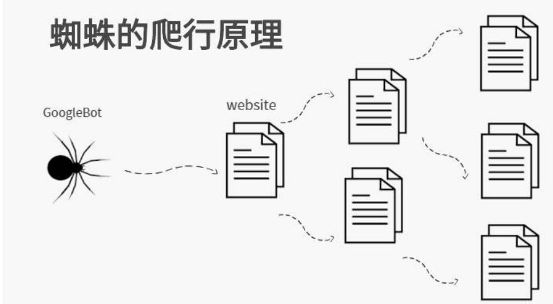
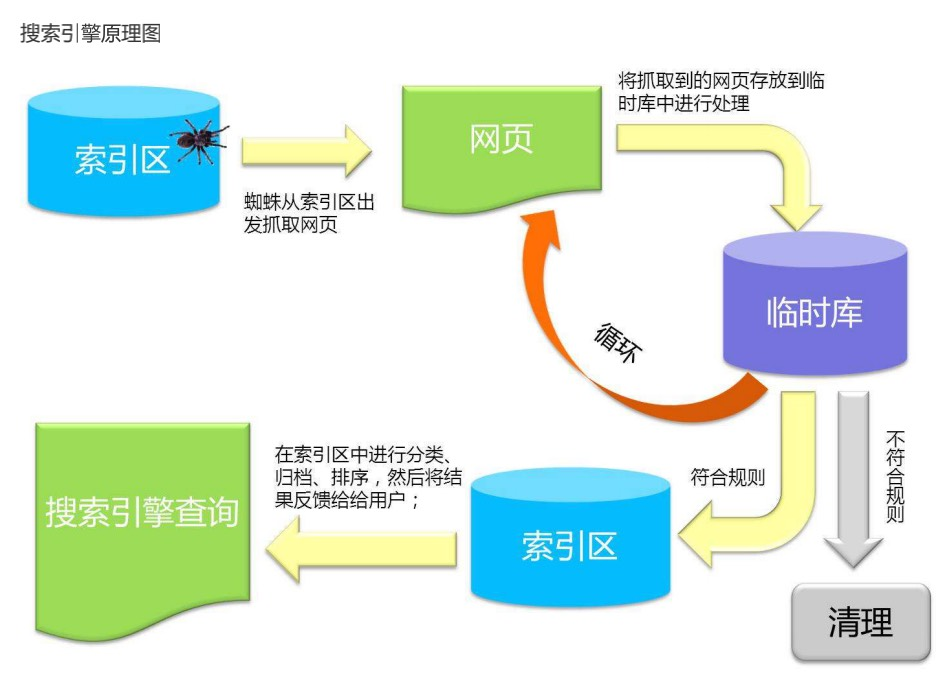

## 01 | 爬虫初识

**什么是爬虫：**

网络爬虫，是一种按照一定规则，自动抓取互联网信息的程序或者脚本。由于互联网数据的多样性和资源的有限性，根据用户需求定向抓取相关网页并分析已成为如今主流的爬取策略。


**爬虫可以做什么？**

可以爬取你想要的图片、想看的视屏等，只要你能通过浏览器访问的数据都可以通过爬虫获取


**爬虫的本质是什么**

模拟浏览器打开网页，或者网页中我们想要的那部分数据。

 

 


## 02 | 基本流程

- 准备工作
  - 通浏览器查看分析目标网页，学习编程基础规范
- 获取数据
  - 通过 HTTP 库向目标站点发起请求，请求可以包含额外的 header 等信息，如果服务器能正常响应，会得到一个 Response，便是所要获取的页面内容。
- 解析内容
  - 得到的内容可能是 HTML、json 等格式，可以用页面解析库、正则表达式等进行解析
- 保存数据
  - 保存形式多样，可以存为文本，也可以保存到数据库，或者特点的格式文件


### 2.1 | 准备工作

URL 分析：

- 页面包括 250 条电影数据，分 10 页，每页 25 条
- 每页的 URL 的不同之处：最后的数值=(页数-1) * 25


#### 2.1.1 | 编码规范

- 一般 Python 程序第一行需要加入：`#-*- coding: utf-8 -*-` 或者 `coding = utf-8`
  - 这样配置可以在代码中包含中文
- 在 Python 中，使用函数实现单一功能或者相关联功能的代码段，可以提高可读性和代码重复利用率，函数代码块以 `def` 关键字开头，后接空格、函数标识符名称、圆括号()、冒汗:，括号中可以传入参数。函数段缩进(Tab或 4 个空格，只能选一种)，return 用于结束函数，可以返回一个返回值，也可以不带任何表达式，表示返回 None
- Python 文件中可以加入 main 函数用于测试程序：`if __name__ == '__main__':` 程序的入口
- Python 使用 # 添加注释，说明代码的作用


#### 2.1.2 引入模块

模块 module：用来从逻辑上组织Python 代码(变量、类、函数)，本质上是py 文件，提高代码的可维护性。Python 使用 import  来导入模块。

例如：

```python
import bs4 # 网页解析, 获取数据
import re # 正则表达式,进行文字匹配
import urllib.request, urllib.error # 制定 url,获取网页数据
import xlwt # 进行 excel 操作
import  sqlite3 # 进行 sqlite 数据库操作

def main():
  print("开始爬取")
  baseurl = "https://movie.douban.com/top250?start="
  datalist = getData(baseurl)
  savepath = "./豆瓣电影TOP250.xml"
  saveData(datalist, savepath)
```

`模块 module`：一般情况下，是一个以.py为后缀的文件。module 可看作一个工具类，可共用或者隐藏代码细节，将相关代码放置在一个

module以便让代码更好用、易懂，让coder重点放在高层逻辑上。

module能定义函数、类、变量，也能包含可执行的代码。module来源有3种：

- Python内置的模块（标准库）；

- 第三方模块；

- 自定义模块。

**包** **package**： 为避免模块名冲突，Python引入了按目录组织模块的方法，称之为 包（package）。包是含有Python模块的文件夹。


### 2.2 获取数据

Python 一般使用 urllib 库获取数据。

一般步骤：

- 对每一个页面，调用 askURL 函数获取页面内容
- 定义一个获取页面的函数 askURL，传入一个 url 参数，表示网址，如 `https://movie.douban.com/top250?start=`
- `urllib.Request` 生成请求，`urllib.urlopen ` 发送请求获取响应，read 获取页面内容
- 在访问页面时财经处会出现错误，为了程序的正常运行，加入异常捕获 `try...except...` 语句

```python
# 得到指定一个 url 的网页内容
def askURL(url):
    # 用户代理，告诉豆瓣服务器，是什么类型机器，浏览器。
    head = {
        # 模拟豆瓣的user-agent
        "User-Agent": "Mozilla/5.0 (Macintosh; Intel Mac OS X 10_15_7) AppleWebKit/537.36 (KHTML, like Gecko) Chrome/92.0.4515.159 Safari/537.36"
    }
    req = urllib.request.Request(url=url, headers=head)
    html = ""
    try:
        response = urllib.request.urlopen(req)
        html = response.read().decode('utf-8')
        # print(html)
    except urllib.error.URLError as e:
        if hasattr(e, "code"):
            print(e.code)
        if hasattr(e, "reason"):
            print(e.reason)
    return html
```


> 可以使用 httpbin.org 来测试请求


### 2.3 解析数据

```python
# 创建正则表达式对象，表示规则，字符串匹配模式
# 找到影片详情链接的规则
findLink = re.compile(r'<a href="(.*?)">')
# 找到影片图片链接的规则
find_img_link = re.compile(r'', re.S)  # re.s 让换行符包含在内
# 找到影片标题的规则
find_title = re.compile(r'<span class="title">(.*)</span>')
# 找到影片的评分
find_rating = re.compile(r'<span class="rating_num" property="v:average">(.*)</span>')
# 找到评价人数
find_judge = re.compile(r'<span>(\d*)人评价</span>')
# 找到概况
find_inq = re.compile(r'<span class="inq">(.*)</span>')
# 找到影片的相关内容
find_bd = re.compile(r'<p class="">(.*?)</p>', re.S)

# 
def getdata(baseurl):
    datalist = []

    for i in range(0, 10):
        url = baseurl + str(i*25)
        # 保存获取到的网页源码
        html = askURL(url)
        # 2. 逐一解析
        soup = BeautifulSoup(html, "html.parser")
        index = 0
        # 查找符合要求的字符串，形成列表
        for item in soup.find_all('div', class_="item"):
            # print(item) # 测试：查看电影 item 全部信息
            data = []  # 保存一部电影的所有信息
            item = str(item)
            # 获取到影片详情的链接
            link = re.findall(findLink, item)[0]  # re 库用来通过正则表达式来查找指定字符串
            data.append(link)
            # 获取到影片图片链接
            imglink = re.findall(find_img_link, item)[0]
            data.append(imglink)
            # 获取到影片名称：中国名 外国名
            titles = re.findall(find_title, item)
            if len(titles) == 2:
                ctitle = titles[0]
                data.append(ctitle)
                otitle = titles[1].replace("/", "")  # 去掉无关的符号
                data.append(otitle)
            else:
                data.append(titles[0])
                data.append(' ')  # 外国电影名留空

            # 获取到影片的评分
            rating = re.findall(find_rating, item)[0]
            data.append(rating)
            # 获取到影片评价人数
            judge = re.findall(find_judge, item)[0]
            data.append(judge)
            # 获取到影片简介
            inq = re.findall(find_inq, item)[0]
            if len(inq) != 0:
                inq = inq.replace("。", "")  # 去掉句号
                data.append(inq)
            else:
                data.append(" ")  # 留空

            # 获取到影片内容
            bd = re.findall(find_bd, item)[0]
            bd = re.sub(r'<br(\s+)?/>', " ", bd)  # 去掉 br
            bd = re.sub("/", " ", bd)
            data.append(bd)

            datalist.append(data)
        print(datalist)
    return datalist
```


### 2.4 保存数据

```python
def saveDataToDB(datalist, dbpath):
    db_init(dbpath)
    connect = sqlite3.connect(dbpath)
    cur = connect.cursor()

    for data in datalist:
        for index in range(len(data)):
            # 对应的第五和第六个位置是数值型
            if index == 4 or index === 5:
                continue
            data[index] = '"' + data[index] + '"'
        sql = '''
            insert into movieTop250 (
            info_link, pic_link, cname, ename, score, reted, instroduct, info
            ) values (%s)'''%",".join(data)
        print(sql)
        cur.execute(sql)
        connect.commit()
    cur.close()
    connect.close()
```


## 模块介绍

### 01 | urllib 模块

- `urllib.request`：请求模块
- `urllib.err`：异常处理模块
- `urllib.parse`：解析模块

#### 1.1 | **GET 请求**

```python
import urllib.request
# get 请求
import urllib.request

response = urllib.request.openurl("http://www.baidu.com")
# 读取数据
data = response.read()
# utf-8 编码
data = data.decode('utf-8')
```


#### 1.2 | **POST 请求：**

```python
# post 请求
import urllib.request
import urllib.parse

data = bytes(urllib.parse.re({"Hello":"xxxx"}),encoding="utf-8")
response = urllib.request.urlopen("https://httpbin.org/post",data=data)
print(response.read().decode('utf-8'))
```


#### 1.3 | **超时处理：**

```python
# 超时处理
import urllib.request

response = urllib.request.urlopen('http://httpbin.org/get',timeout=1) 
print(response.read())
```

```python
import urllib.request 
import socket 
import urllib.error 
try:
  response = urllib.request.urlopen('http://httpbin.org/get',timeout=0.01) 
except urllib.error.URLError as e: 
  if isinstance(e.reason,socket.timeout):#判断错误原因 
    print('time out!')
```


#### 1.4 | **打印出响应类型，状态码，响应头:**

```python
import urllib.request 

response = urllib.request.urlopen('http://www.baidu.com') 
print(response.status) # 状态码 判断请求是否成功 
print(response.getheaders()) # 响应头 得到的一个元组组成的列表 
print(response.getheader('Server')) #得到特定的响应头 
print(response.read().decode('utf-8')) #获取响应体的内容，字节流的数据，需要转成utf-8格式
```


#### 1.5 | **请求添加参数：**

由于使用urlopen无法传入参数，我们需要解决这个问题，我们需要声明一个request对象，通过这个对象来添加参数

```python
import urllib.request 
request = urllib.request.Request('https://python.org') #由于urlopen无法传参数，声 明一个Request对象 
response = urllib.request.urlopen(request) 
print(response.read().decode('utf-8'))
```

我们还可以分别创建字符串、字典等等来带入到request对象里面

```python
from urllib import request,parse 
url='http://httpbin.org/post' 
headers={ 
  'user-agent': 'Mozilla/5.0 (Windows NT 6.1; Win64; x64) AppleWebKit/537.36 (KHTML, like Gecko) Chrome/71.0.3578.98 Safari/537.36', 'Host':'httpbin.org' 
}

dict={'name':'jay' }
data = bytes(parse.urlencode(dict),encoding='utf-8') 
req=request.Request(url=url,data=data,headers=headers,method='POST') 
response=request.urlopen(req) 
print(response.read().decode('utf-8'))
```


#### 1.6 | **请求头添加信息：**

我们还可以通过 `addheaders` 方法不断的向原始的 `requests` 对象里不断添加

```python
from urllib import request,parse 

url ='http://httpbin.org/post' 
dict = { 'name':'cq' }
data=bytes(parse.urlencode(dict),encoding='utf-8') 

req = request.Request(url=url,data=data,method='POST') 
req.add_header(
  'user-agent', 'Mozilla/5.0 (Windows NT 6.1; Win64; x64) AppleWebKit/537.36 (KHTML, like Gecko) Chrome/71.0.3578.98 Safari/537.36'
) 
response=request.urlopen(req) 
print(response.read().decode('utf-8')
```


#### 1.7 | **cookie 处理：**

打印出信息cookies

下面这段程序获取response后声明的cookie对象会被自动赋值

```python
import http.cookiejar,urllib.request 

cookie = http.cookiejar.CookieJar() 
handerler=urllib.request.HTTPCookieProcessor(cookie) 
opener=urllib.request.build_opener(handerler) 
response=opener.open('http://www.baidu.com') #获取response后cookie会被自动赋值 
for item in cookie: 
	print(item.name+'='+item.value)
```

存cookie文件,两种格式

```python
import http.cookiejar,urllib.request 

filename='cookie.txt' 
cookie = http.cookiejar.MozillaCookieJar(filename) 
handerler = urllib.request.HTTPCookieProcessor(cookie) 
opener = urllib.request.build_opener(handerler) 
response = opener.open('http://www.baidu.com') #获取response后cookie会被自动赋值 
cookie.save(ignore_discard=True,ignore_expires=True) #保存cookie.txt文件
```

```python
import http.cookiejar,urllib.request 

filename = 'cookie2.txt' 
cookie = http.cookiejar.LWPCookieJar(filename) 
handerler = urllib.request.HTTPCookieProcessor(cookie) 
opener = urllib.request.build_opener(handerler) 
response=opener.open('http://www.baidu.com') #获取response后cookie会被自动赋值 
cookie.save(ignore_discard=True,ignore_expires=True) #保存cookie.txt文件
```

用文本文件的形式维持登录状态

```python
import http.cookiejar,urllib.request 

cookie = http.cookiejar.MozillaCookieJar() 
cookie.load('cookie.txt',ignore_discard=True,ignore_expires=True) 
handerler = urllib.request.HTTPCookieProcessor(cookie) 
opener = urllib.request.build_opener(handerler) 
response = opener.open('http://www.baidu.com') 
print(response.read().decode('utf-8'))
```


#### 1.8 | **异常处理**

关于异常处理部分，需要了解有httperror和urlerror两种，父类与子类的关系。

```python
#父类，只有一个reason 
from urllib import request,error 
try:
  response = request.urlopen('http://www.bai.com/index.html') 
except error.URLError as e: 
  print(e.reason) 
  
  
#子类，有更多的属性 
from urllib import request,error 
try:
  response = request.urlopen('http://abc.123/index.html') 
except error.HTTPError as e: 
  print(e.reason,e.code,e.headers,sep='\n')
```


#### 1.9 | **解析,将一个url解析：**

```python
from urllib.parse import urlparse 
result = urlparse('http://www.baidu.com/index.html;user?id=5#comment') 
print(result)#协议内容、路径、参数 print(type(result)) 


from urllib.parse import urlparse 
result = urlparse('www.baidu.com/index.html;user?id=5#comment',scheme='https') 
print(result) 


from urllib.parse import urlparse 
result = urlparse('http://www.baidu.com/index.html;user? id=5#comment',scheme='https') 
print(result) 


from urllib.parse import urlparse 
result = urlparse('http://www.baidu.com/index.html;user? id=5#comment',allow_fragments=False) #会被拼接 
print(result) 


from urllib.parse import urlparse 
result = urlparse('http://www.baidu.com/index.html#comment',allow_fragments=False) #会被 拼接到path没有query 
print(result)
```


#### 1.10 | **url拼接：**

```python
from urllib.parse import urlunparse 
data=['http','www.baidu.com','index.html','user','a=6','comment'] 
print(urlunparse(data))
```

```python
from urllib.parse import urljoin 
#拼接两个url 
#截图，以后面的为基准，有留下，没有拼接  

print(urljoin('http://www.baidu.com','HAA.HTML')) print(urljoin('https://wwww.baidu.com','https://www.baidu.com/index.html;questio n=2'))
```

```python
#字典方式直接转换成url参数 
from urllib.parse import urlencode 

params = { 'name':'germey', 'age':'122' }
base_url='http://www.baidu.com?' 
url=base_url+urlencode(params) 
print(url)
```


> 更多细节可以参考：https://www.cnblogs.com/qikeyishu/p/10748497.html


### 02 | BeautifulSoup模块

参考： http://www.jsphp.net/python/show-24-214-1.html

#### 01 | BeautifulSoup简介

BeautifulSoup4 和 lxml 一样，Beautiful Soup 也是一个HTML/XML 的解析器，主要的功能也是如何解析和提取 HTML/XML 数据。

BeautifulSoup支持 Python 标准库中的 HTML 解析器，还支持一些第三方的解析器，如果我们不安装它，则 Python 会使用 Python默认

的解析器，lxml 解析器更加强大，速度更快，推荐使用lxml 解析器。

Beautiful Soup 自动将输入文档转换为 Unicode 编码，输出文档转换为 utf-8 编码。你不需要考虑编码方式，除非文档没有指定一个编码

方式，这时，Beautiful Soup就不能自动识别编码方式了。然后，你仅仅需要说明一下原始编码方式就可以了。


#### 02 | BeautifulSoup4主要解析器，以及优缺点:

| 解析器           | 使用方法                                                     | 优势                                                      | 劣势                                             |
| ---------------- | ------------------------------------------------------------ | --------------------------------------------------------- | ------------------------------------------------ |
| Python 标准库    | `BeautifulSoup(markup, "html.parser")`                       | Python 的内置标准库执行速度始终，文档容错能力强           | Python 2.7.3 or 3.2.2 前的版本中文文档容错能力差 |
| lxml HTML 解析器 | `BeautifulSoup(markup, "lxml")`                              | 速度快，文档容错能力强                                    | 需要安装 c 语言库                                |
| lxml XML 解析器  | `BeautifulSoup(markup, ["lxml-xml"]])`   `BeautifulSoup(markup, "xml")` | 速度快，唯一支持 XML 的解析器                             | 需要安装 c 语言库                                |
| html5lib         | `BeautifulSoup(markup, "html5lib")`                          | 最好的容错性，以浏览器的方式解析文档生成 HTML5 格式的文档 | 速度慢，不依赖外部扩展                           |


#### 03 | BeautifulSoup4简单使用

假设有这样一个Html，具体内容如下：

```html
<!DOCTYPE html> 
<html> 
  <head>
    <meta content="text/html;charset=utf-8" http-equiv="content-type" /> 
    <meta content="IE=Edge" http-equiv="X-UA-Compatible" /> 
    <meta content="always" name="referrer" /> 
    <link href="https://ss1.bdstatic.com/5eN1bjq8AAUYm2zgoY3K/r/www/cache/bdorz/baidu.min. css" rel="stylesheet" type="text/css" /> 
    <title>百度一下，你就知道 </title> 
  </head> 
  <body link="#0000cc"> 
    <div id="wrapper"> 
      <div id="head"> 
        <div class="head_wrapper"> 
          <div id="u1"> 
            <a class="mnav" href="http://news.baidu.com" name="tj_trnews">新闻 </a> 
            <a class="mnav" href="https://www.hao123.com" name="tj_trhao123">hao123 </a> 
            <a class="mnav" href="http://map.baidu.com" name="tj_trmap">地图 </a> 
            <a class="mnav" href="http://v.baidu.com" name="tj_trvideo">视频 </a> 
            <a class="mnav" href="http://tieba.baidu.com" name="tj_trtieba">贴吧 </a> 
            <a class="bri" href="//www.baidu.com/more/" name="tj_briicon" style="display: block;">更多产品 </a> 
          </div> 
        </div> 
      </div> 
    </div> 
  </body> 
</html>
```

创建 beautifulsoup4 对象：

```python
from bs4 import BeautifulSoup 
file = open('./aa.html', 'rb') 
html = file.read() 
bs = BeautifulSoup(html,"html.parser") # 缩进格式 

print(bs.prettify()) # 获取title标签的所有内容 
print(bs.title) # 获取title标签的名称 
print(bs.title.name) # 获取title标签的文本内容 
print(bs.title.string) # 获取head标签的所有内容 
print(bs.head) # 获取第一个div标签中的所有内容 
print(bs.div) # 获取第一个div标签的id的值 
print(bs.div["id"]) # 获取第一个a标签中的所有内容 
print(bs.a) # 获取所有的a标签中的所有内容 
print(bs.find_all("a")) # 获取id="u1"
```

```python
print(bs.find(id="u1")) # 获取所有的a标签，并遍历打印a标签中的href的值 
for item in bs.find_all("a"): 
  print(item.get("href")) # 获取所有的a标签，并遍历打印a标签的文本值 
  
for item in bs.find_all("a"): 
  print(item.get_text())
```


#### 04  | BeautifulSoup4四大对象种类

BeautifulSoup4 将复杂 HTML 文档转换成一个复杂的树形结构,每个节点都是Python对象,所有对象可以归纳为4种:

- `Tag`
- `NavigableString`：标签里的字符串
- `BeautifulSoup` ：整个文档
- Comment：特殊的 NavigableString，输出的内容不包含注释符号

##### 04-01 | **Tag:**

Tag通俗点讲就是HTML中的一个个标签，例如：

```python
from bs4 import BeautifulSoup 

file = open('./aa.html', 'rb') 
html = file.read() 
bs = BeautifulSoup(html,"html.parser") 
# 获取title标签的所有内容 
print(bs.title) 
# 获取head标签的所有内容 
print(bs.head) 
# 获取第一个a标签的所有内容 
print(bs.a) 
# 类型
print(type(bs.a))
```

我们可以利用 soup 加标签名轻松地获取这些标签的内容，这些对象的类型是bs4.element.Tag。但是注意，它查找的是在所有内容中的

第一个符合要求的标签。对于 Tag，它有两个重要的属性，是 name 和 attrs

```python
from bs4 import BeautifulSoup 

file = open('./aa.html', 'rb') 
html = file.read() 
bs = BeautifulSoup(html,"html.parser") 
# [document] #bs 对象本身比较特殊，它的 name 即为 [document] 
print(bs.name) 
# head #对于其他内部标签，输出的值便为标签本身的名称 
print(bs.head.name) 
# 在这里，我们把 a 标签的所有属性打印输出了出来，得到的类型是一个字典。 
print(bs.a.attrs) 
#还可以利用get方法，传入属性的名称，二者是等价的
print(bs.a['class']) # 等价 bs.a.get('class') 
# 可以对这些属性和内容等等进行修改
bs.a['class'] = "newClass" 
print(bs.a) 
# 还可以对这个属性进行删除 
del bs.a['class'] 
print(bs.a)
```


##### 04-02 | **NavigableString**

既然我们已经得到了标签的内容，那么问题来了，我们要想获取标签内部的文字怎么办呢？很简单，用.string 即可，例如

```python
from bs4 import BeautifulSoup 

file = open('./aa.html', 'rb') 
html = file.read() 
bs = BeautifulSoup(html,"html.parser") 
print(bs.title.string) 
print(type(bs.title.string))
```


##### 04-03 | **BeautifulSoup**

BeautifulSoup对象表示的是一个文档的内容。大部分时候，可以把它当作 Tag 对象，是一个特殊的 Tag，我们可以分别获取它的类型名

称，以及属性，例如：

```python
from bs4 import BeautifulSoup 
file = open('./aa.html', 'rb') 
html = file.read() 

bs = BeautifulSoup(html,"html.parser") 
print(type(bs.name)) 
print(bs.name) 
print(bs.attrs)
```


##### 04-04 | **Comment**

Comment 对象是一个特殊类型的 NavigableString 对象，其输出的内容不包括注释符号。

```python
from bs4 import BeautifulSoup 
file = open('./aa.html', 'rb') 
html = file.read() 
bs = BeautifulSoup(html,"html.parser") 
print(bs.a) 
# 此时不能出现空格和换行符，a标签如下： 
# <a class="mnav" href="http://news.baidu.com" name="tj_trnews"><!--新闻--></a> 
print(bs.a.string) # 新闻 
print(type(bs.a.string)) # <class 'bs4.element.Comment'>
```


#### 05 | **遍历文档树**

- **.contents**：.contents：获取Tag的所有子节点，返回一个list

  ```python
  # tag的.content 属性可以将tag的子节点以列表的方式输出 
  print(bs.head.contents) 
  # 用列表索引来获取它的某一个元素 
  print(bs.head.contents[1])
  ```

- `.children`：获取 Tag 的所有子节点，返回一个生成器

  ```python
  for child in bs.body.children: 
    print(child)
  ```

- `.descendants`：获取 Tag 的所有子孙节点

- `.strings`：如果 Tag 包含多个字符串，即在子孙节点中有内容，可以用此获取，而后进行遍历

- `.stripped_strings`：与 strings 用法一致，只不过可以去除掉那些多余的空白内容

- `.parent`：获取 Tag 的父节点

- `.parents`：递归得到父辈元素的所有节点，返回一个生成器

- `.previous_sibling`：获取当前 Tag 的上一个节点，属性通常是字符串或空白，真实结果是当前标签与上一个标签之间的顿号和换行符

- `.next_sibling`：获取当前 Tag 的下一个节点，属性通常是字符串或空白，真是结果是当前标签与下一个标签之间的顿号与换行符

- `.previous_siblings`：获取当前 Tag 的上面所有的兄弟节点，返回一个生成器

- `.next_siblings`：获取当前 Tag 的下面所有的兄弟节点，返回一个生成器

- `.previous_element`：获取解析过程中上一个被解析的对象(字符串或 tag )，可能与 previous_sibling 相同，但通常是不一样的

- `.next_element`：获取解析过程中下一个被解析的对象(字符串或 tag)，可能与 next_sibling 相同，但通常是不一样的

- `.previous_elements`：返回一个生成器，可以向前访问文档的解析内容

- `.next_elements`：返回一个生成器，可以向后访问文档的解析内容

- `.has_attr`：判断 Tag 是否包含属性

 

#### 06 | **搜索文档树**

##### 06-01 | **find_all(name, attrs, recursive, text, \**kwargs)**

在上面的例子中我们简单介绍了 find_all 的使用，接下来介绍一下 find_all 的更多用法-过滤器。这些过滤器贯穿整个搜索API，过滤器可

以被用在tag的name中，节点的属性等。

###### 01 | name 参数

字符串过滤：会查找与字符串完全匹配的内容

```python
a_list = bs.find_all("a") # 所有 a 标签
print(a_list)
```

**正则表达式过滤**：如果传入的是正则表达式，那么 BeautifulSoup4 会通过 search() 来匹配内容

```python
from bs4 import BeautifulSoup 
import re 

file = open('./aa.html', 'rb') 
html = file.read() 
bs = BeautifulSoup(html,"html.parser") 
t_list = bs.find_all(re.compile("a")) # 标签中含有 a 的第一都会找出来
for item in t_list: 
  print(item)
```

**列表**：如果传入一个列表，BeautifulSoup4将会与列表中的任一元素匹配到的节点返回

```python
t_list = bs.find_all(["meta","link"]) 
for item in t_list: 
  print(item)
```

**方法**：传入一个方法，根据方法来匹配

```python
from bs4 import BeautifulSoup 

file = open('./aa.html', 'rb') 
html = file.read() 
bs = BeautifulSoup(html,"html.parser") 
def name_is_exists(tag): 
  return tag.has_attr("name") 

t_list = bs.find_all(name_is_exists) 
for item in t_list: 
  print(item)
```


######  02 |**kwargs**参数：

```python
from bs4 import BeautifulSoup 
import re 

file = open('./aa.html', 'rb') 
html = file.read() 
bs = BeautifulSoup(html,"html.parser") 
# 查询id=head的Tag 
t_list = bs.find_all(id="head")
print(t_list) 
# 查询href属性包含ss1.bdstatic.com的Tag 
t_list = bs.find_all(href=re.compile("http://news.baidu.com")) 
print(t_list) 
# 查询所有包含class的Tag(注意：class在Python中属于关键字，所以加_以示区别) 
t_list = bs.find_all(class_=True) 
for item in t_list: 
  print(item)
```


######  03 |**attrs**参数：

- 并不是所有的属性都可以使用上面这种方式进行搜索，比如 HTML 的 data-* 属性：

  ```python
  t_list = bs.find_all(data-foo="value")
  ```

- 如果执行这段代码，将会报错。我们可以使用attrs参数，定义一个字典来搜索包含特殊属性的tag：

  ```python
  t_list = bs.find_all(attrs={"data-foo":"value"}) 
  for item in t_list: 
    print(item)
  ```


######  04 |**text**参数：

- 通过text参数可以搜索文档中的字符串内容，与name参数的可选值一样，text参数接受 字符串，正则表达式，列表

  ```python
  from bs4 import BeautifulSoup 
  import re 
  
  file = open('./aa.html', 'rb') 
  html = file.read() 
  bs = BeautifulSoup(html, "html.parser") 
  t_list = bs.find_all(attrs={"data-foo": "value"}) 
  
  for item in t_list: 
    print(item) 
    
  t_list = bs.find_all(text="hao123") 
  for item in t_list: 
    print(item) 
    
  t_list = bs.find_all(text=["hao123", "地图", "贴吧"]) 
  for item in t_list: 
    print(item) 
    
  t_list = bs.find_all(text=re.compile("\d")) 
  for item in t_list: 
    print(item)
  ```

- 当我们搜索text中的一些特殊属性时，同样也可以传入一个方法来达到我们的目的：

  ```python
  def length_is_two(text): 
    return text and len(text) == 2 
  
  t_list = bs.find_all(text=length_is_two) 
  for item in t_list: 
    print(item)
  ```


######  05 | **limit**参数：

- 可以传入一个limit参数来限制返回的数量，当搜索出的数据量为5，而设置了limit=2时，此时只会返回前2个数据

  ```python
  from bs4 import BeautifulSoup 
  import re 
  
  file = open('./aa.html', 'rb') 
  html = file.read() 
  bs = BeautifulSoup(html, "html.parser") 
  t_list = bs.find_all("a",limit=2) 
  for item in t_list:
    print(item)
  ```

- find_all 除了上面一些常规的写法，还可以对其进行一些简写：

  ```python
  # 两者是相等的 
  # t_list = bs.find_all("a") => t_list = bs("a") 
  t_list = bs("a") # 两者是相等的 
  
  # t_list = bs.a.find_all(text="新闻") => t_list = bs.a(text="新闻")
  t_list = bs.a(text="新闻")
  ```


##### 06-02 | **find()**

find() 将返回符合条件的第一个Tag，有时我们只需要或一个Tag时，我们就可以用到fifind()方法了。当然了，也可以使用fifind_all()方

法，传入一个limit=1，然后再取出第一个值也是可以的，不过未免繁琐。

```python
from bs4 import BeautifulSoup 
import re 

file = open('./aa.html', 'rb') 
html = file.read() 
bs = BeautifulSoup(html, "html.parser") 
# 返回只有一个结果的列表 
t_list = bs.find_all("title",limit=1) 
print(t_list) 
# 返回唯一值 
t = bs.find("title") 
print(t) 
# 如果没有找到，则返回None 
t = bs.find("abc") 
print(t)
```

从结果可以看出fifind_all，尽管传入了limit=1，但是返回值仍然为一个列表，当我们只需要取一个值时，远不如fifind方法方便。但是如

果未搜索到值时，将返回一个None


#### 07 | 选择器查找

在上面介绍BeautifulSoup4的时候，我们知道可以通过bs.div来获取第一个div标签，如果我们需要获取第一个div下的第一个div，我们可

以这样：

```python
t = bs.div.div 
# 等价于 
t = bs.find("div").find("div")
```

BeautifulSoup 支持发部分的 CSS 选择器，在 Tag 获取 BeautifulSoup 对象的 .select() 方法中传入字符串参数，即可使用 CSS 选择器的

语法找到 Tag。

##### 07-01 | 通过 标签选择器 查找

```python
print(bs.select('title')) 
print(bs.select('a'))
```


##### 07-02 |通过 类选择器  查找

```python
print(bs.select('.mnav'))
```


##### 07-03 | 通过 id 选择器 查找

```python
print(bs.select('#u1'))
```


##### 07-04 | 使用组合来查找

```python
print(bs.select('div .bri'))
```


##### 07-05 | **属性查找**

```python
print(bs.select('a[class="bri"]')) 
print(bs.select('a[href="http://tieba.baidu.com"]'))
```


##### 07-06 | **直接子标签查找**

```python
t_list = bs.select("head > title") print(t_list)
```


##### 07-07 | **兄弟节点标签查找**

```python
t_list = bs.select(".mnav ~ .bri") print(t_list)
```


##### 07-08 | **获取内容**

```python
t_list = bs.select("title") 
print(bs.select('title')[0].get_text())
```


### 03  | re 模块

#### 03-01 | **常用操作符：**

| 操作符   | 说明                             | 实例                                                 |
| -------- | -------------------------------- | ---------------------------------------------------- |
| .        | 表示任何单个字符                 |                                                      |
| [ ]      | 字符集，对单个字符给出取值范围   | [abc] 表示 a、b、c。[a-z] 表示 a 到 z 之间的单个字符 |
| [^ ]     | 非字符集，对单个字符给出排除范围 | [^abc] 表示非 a或b 或 c 的单个字符                   |
| *        | 前一个字符 0 次 或者 无限次出现  | abc*表示 ab、abc、abcc、abccccccccc 等               |
| +        | 前一个字符 1 次 或者  无限次出现 | abc+表示 abc、abcc、abccc 等                         |
| ?        | 前一个字符 0 次 或者 1 次出现    | abc表示 ab、abc                                      |
| \|       | 左右表达式任意一个               | abc \| def 表示 abc、def                             |
| { m }    | 前一个字符出现 m 次              | ab{2}c 表示 abbc                                     |
| { m, n } | 前一个字符 出现 m 到 n 次。含 n  | ab{1,2}c 表示 abc、abbc                              |
| ^        | 匹配以某个字符开头               | ^abc 表示以 abc 开头的字符串                         |
| $        | 匹配以某个字符结尾               | abc$ 表示以 abc 结尾的字符串                         |||
| (  )     | 分组标记，内部只能使用 \| 操作符 | (abc)表示 abc，(abc\|def)表示 abc、def               |
| \d       | 数字，等价于[0-9]                |                                                      |
| \w       | 单词字符，等价于[a-zA-Z0-9_]     |                                                      |
| \D | 匹配任意非数字 | |
| \W | 匹配非字母数字及下划线 | |
| \s | 匹配任意空白字符，等价于[ \t\n\r\f] | |
| \S | 匹配任意非空字符 | |
| \A | 匹配字符串开始 | |


#### 03-02 | **re库主要功能函数：**

| 函数          | 说明                                                         |
| ------------- | ------------------------------------------------------------ |
| re.search()   | 在一个字符串中搜索匹配正则表达式的第一个位置，返回 match 对象 |
| re.match()    | 从一个字符串的开始位置起匹配正则表达式，返回 match 对象      |
| re.findall()  | 搜索字符串，以列表类型返回全部能匹配的子串                   |
| re.split()    | 将一个字符串按照正则表达式匹配结果进行分割，返回列表类型     |
| re.finditer() | 搜索字符串，返回一个匹配结果的迭代类型，每个迭代元素是 match 对象 |
| re.sub()      | 在一个字符串中替换所有匹配正则表达式的子串，返回替换后的字符串 |


正则表达式可以包含一些可选标志修饰符来控制匹配的模式。修饰符被指定为一个可选的标志。多个标志可以通过按位 OR(|) 它们来指

定。如 re.I | re.M 被设置成 I 和 M 标志：

| 修饰符 | 描述                                                     |
| ------ | -------------------------------------------------------- |
| re.l   | 使匹配对大小写不敏感                                     |
| re.L   | 做本地化识别匹配：local-aware                            |
| re.M   | 多行匹配，影响 ^ 和 $                                    |
| re.S   | 使 . 匹配包括换行在内的所有字符串                        |
| re.U   | 根据 Unicode 字符集解析字符。这个标志影响 \w、\W、\b、\B |
| re.X   | 该标志通过给予更灵活的格式以便将正则表达式写的更容易理解 |


#### 03-03 | re模块下的函数

##### 01 | compile(patern)：创建模式对象

```python
import re 

pat=re.compile("A") 
#m=pat.search("CBA") 
m=pat.search("ABC") 
#等价于 re.search( A , CBA ) 
print(m) 

#<re.Match object; span=(2, 3), match='A'> 表示匹配到了 

m=pat.search("CBD") 
print(m) #None 表示没匹配到
```


##### 02 | search(pattern,string)：在字符串中寻找模式

```python
import re 
m = re.search("asd" , "ASDasd" ) 
print(m) 
# <_sre.SRE_Match object at 0xb72cd6e8> #匹配到了，返回MatchObject（True） 
m = re.search("asd" , "ASDASD" ) 
print(m)
```


##### 03 | match(pattern,string)：在字符串开始处匹配模式

```python
# 等价于 
pat=re.compile( "a" ) 
print(pat.match( "Aasd" )) 
#输出None 

print(pat.match("aASD" )) 
#输出 <_sre.SRE_Match object at 0xb72cd6e8> 

# 上面的函数返回都可以在if条件语句中进行判断： 
if pat.search("asd"): 
  print ("OK") #OK #找到返回 
  
if re.search("a","ASD" ): 
  print ("OK") #没有找到
```


##### 04 | split(pattern,string)：根据模式分割字符串,返回列表

```python
re.split( , , a,s,d,asd ) 
[ a , s , d , asd ] #返回列表 

pat = re.compile( , )
pat.split( a,s,d,asd ) 
[ a , s , d , asd ] #返回列表 

re.split( [, ]+ , a , s ,d ,,,,,asd ) #正则匹配：[, ]+，后面说明 
[ a , s , d , asd ] 

re.split( [, ]+ , a , s ,d ,,,,,asd ,maxsplit=2) # maxsplit 最多分割次数 
[ a , s , d ,,,,,asd ] 

pat = re.compile( [, ]+ ) #正则匹配：[, ]+，后面说明 
pat.split( a , s ,d ,,,,,asd ,maxsplit=2) # maxsplit 最多分割次数 
[ a , s , d ,,,,,asd ]
```


##### 05 | findall(pattern,string)：列表形式返回匹配项

```python
import re 
print(re.findall( "a" , "ASDaDFGAa" )) 
#[ a , a ] 
#列表形式返回匹配到的字符串 

pat = re.compile( "a" ) 
print(pat.findall( "ASDaDFGAa" )) 
#[ a , a ] 
#列表形式返回匹配到的字符串 

pat = re.compile( "[A-Z]+" ) #正则匹配：[A-Z]+ 后面有说明 
print(pat.findall( "ASDcDFGAa" )) 
#[ ASD , DFGA ] #找到匹配到的字符串 

pat = re.compile( [A-Z] ) 
pat.findall( ASDcDFGAa ) #正则匹配：[A-Z]+ 后面有说明 
[ A , S , D , D , F , G , A ] #找到匹配到的字符串 

pat = re.compile( [A-Za-z] ) #正则匹配：[A-Za-z]+ 匹配所有单词，后面有说明 
pat.findall( ASDcDFGAa ) 
[ A , S , D , c , D , F , G , A , a ]
```


##### 06 | sub(pat,repl,string) ：用repl替换 pat匹配项

(留的是中间的，因为中间在中心) 

```python
re.sub( a , A , abcasd ) #找到a用A替换，后面见和group的配合使用 
AbcAsd 

pat = re.compile( a ) 
pat.sub( A , abcasd ) 
AbcAsd pat=re.compile(r www.(.*)..{3} ) #正则表达式 

#在Python的string前面加上‘r’， 是为了告诉编译器这个string是个raw string，不要转译反斜杠 。
#例如， 在raw string中，是两个字符，和n， 而不会转译为换行符。 
#由于正则表达式和 会有冲突，因此，当一个字符串使用了正则表达式后，最好在前面加上 r 。 
#与大多数编程语言相同，正则表达式里使用""作为转义字符，这就可能造成反斜杠困扰。 
#假如你需要匹配文本中的字符""，那么使用编程语言表示的正则表达式里将需要4个反斜杠"\\"： 
#前两个和后两个分别用于在编程语言里转义成反斜杠，转换成两个反斜杠后再在正则表达式里转义成一个 反斜杠。 
#Python里的原生字符串很好地解决了这个问题，这个例子中的正则表达式可以使用r"\"表示。 
#同样，匹配一个数字的"\d"可以写成r"d"。 
#有了原生字符串，你再也不用担心是不是漏写了反斜杠，写出来的表达式也更直观。 
#不是说 加了r 就没有转译功能，好乱，就直接记住1句话： 
#当一个字符串使用了正则表达式后，最好在前面加上 r ，这样你再也不用担心是不是漏写了反斜杠，写出来的表达式也更直观 

pat.match( www.dxy.com ).group(1) 
dxy 

re.sub(r www.(.*)..{3} ,r , hello,www.dxy.com ) 

pat.sub(r , hello,www.dxy.com ) 
hello,dxy 

# r 1 是第一组的意思 
#通过正则匹配找到符合规则的"www.dxy.com" ，取得 组1字符串 去替换 整个匹配。 

pat=re.compile(r (w+) (w+) ) #正则表达式 
s= hello world ! hello hz ! 
pat.findall( hello world ! hello hz ! ) 
[( hello , world ), ( hello , hz )] pat.sub(r ,s) #通过正则得到组1(hello)，组2(world)，再通过sub去替换。 即组1替换组2，组2替换组1，调换位置。 
world hello!hz hello!
```


##### 07 | escape(string) ：对字符串里面的特殊字符串进行转义

```python
re.escape( www.dxy.cn ) 
www\.dxy\.cn #转义
```

上面的函数中，只有match、search有group方法，其他的函数没有。


#### 03-04 | 函数的方法

##### 01 | group：获取子模式(组)的匹配项

```python
pat = re.compile(r www.(.*).(.*) ) #用()表示1个组，2个组 
m = pat.match( www.dxy.com ) 
m.group() #默认为0，表示匹配整个字符串 
www.dxy.com 

m.group(1) #返回给定组1匹配的子字符串 
dxy 

m.group(2) 
com
```


##### 02 | start：给定组匹配项的开始位置

```python
m.start(2) #组2开始的索引 
8
```


##### 03 | end：给定组匹配项的结束位置

```python
m.end(2) #组2结束的索引 
11
```


##### 04 | span：给定组匹配项的开始结束位置

```python
m.span(2) #组2开始、结束的索引 
(8, 11)
```


### 04 | xlwt 模块

简单使用xlwt

```python
import xlwt #导入模块 

workbook = xlwt.Workbook(encoding='utf-8') #创建workbook 对象 
worksheet = workbook.add_sheet('sheet1') #创建工作表sheet 
worksheet.write(0, 0, 'hello') #往表中写内容,第一各参数 行,第二个参数列,第三个参数内容 
workbook.save('students.xls') #保存表为students.xls
```

```python
import xlwt

# 1. 创建 workbook 对象
workbook = xlwt.Workbook(encoding='utf-8')
# 2. 创建工作表
worksheet = workbook.add_sheet("sheet1")
# 3. 写入数据
# 第一个参数：行
# 第二个参数：列
# 第三个参数：存储内容
worksheet.write(0, 0, 'hello')
# 4. 保存数据表
workbook.save("111.xls")
```

99乘法表

```python
# 1. 创建 workbook 对象
workbook = xlwt.Workbook(encoding='utf-8')
# 2. 创建工作表
worksheet = workbook.add_sheet("sheet1")
# 3. 写入数据
worksheet = workbook.add_sheet("sheet2")
for i in range(1, 10):
    for j in range(1, i+1):
        value = str(i) + 'x' + str(j) + '=' + str(i * j)
        worksheet.write(i-1, j-1, value)

workbook.save('111.xls')
```


更多：

https://www.jianshu.com/p/fc97dd7e822c

https://www.cnblogs.com/caesar-id/p/11802440.html


<<<<<<< HEAD
### 05 | sqlite

**连接数据库：**

```python
import sqlite3

# 打开或创建数据库文件
connect = sqlite3.connect("test.db")
```

**创建一张表：**

```python
import sqlite3

# 打开或创建数据库文件
connect = sqlite3.connect("test.db")
print("成功打开数据库")
# 获取游标
cursor = connect.cursor()
# 执行 sql
sql = '''
    create table company 
        (id int primary key not null,
        name text not null,
        age int not null,
        address char[50],
        salary real);
'''
# 执行 sql
cursor.execute(sql)
# 提交数据库操作
connect.commit()
# 关闭数据库连接
connect.close()
print("成功建表")
```

**增：**

```python
# 打开或创建数据库文件
connect = sqlite3.connect("test.db")
print("成功打开数据库")
# 获取游标
cursor = connect.cursor()
# 执行 sql
sql = '''
    insert into company (id, name,age,address,salary) 
    values (5,'张三', 32, "成都",8000);
'''
# 执行 sql
cursor.execute(sql)
# 提交数据库操作
connect.commit()
# 关闭数据库连接
connect.close()
print("插入数据完毕")
```


**查：**

```python
# 打开或创建数据库文件
connect = sqlite3.connect("test.db")
print("成功打开数据库")
# 获取游标
cursor = connect.cursor()
# 执行 sql
sql = "select id, name, age,address,salary from company"
# 执行 sql
cursorData = cursor.execute(sql)
for row in cursorData:
    print("id = ",row[0])
    print("name = ", row[1])
    print("age = ", row[2])
    print("address = ", row[3])
    print("salary = ", row[4], "\n")
# 关闭数据库连接
connect.close()
print("查询完毕")
```

**sql 插入知识点：**

数据插入方法：

- VALUES：

  ``` python
  data = "170141000,'张三','男',20,'GIS'"
  sql = '''
  	insert info table VALUES(%s)
  '''%data
  
  # 如果是循环数组也可以
  dataList = [["1","2","3"],["4m","fds"]]
  for data in dataList:
    dataStr = ",".join(data)  # 转化后为'"1","2","3"'
   	sql = '''
  		insert info table VALUES(%s)
  	'''%dataStr 
  ```

- 问号法：

  ```python
  cur.execute('INSERT INTO Student VALUES(?,?,?,?,?)',(170141000,'亮','男',21,'滋麻开花'))
  ```

- VALUES 指定字段

  ```python
  cur.execute("INSERT INTO Student (SNO,Sname,Sage,Sdept) values(170151000,'豪',20,'GIS'),(170151999,'喜羊羊',9,'GIS');")
  ```

  

### 06 | Crypto

m3u8文件加密时，使用“from Crypto.Cipher import AES”相关函数解密：

\#EXT-X-KEY 记录了加密的方式，一般是AES-128以及加密的KEY信息

pip install Crypto 基本上会出现问题，

解决办法如下：

- 安装crypto库（首字母c是小写）：pip install crypto
- 进入python的库管理位置，site-packages文件夹，找到crypto，将其首字母c改为大写

或者尝试安装：可以尝试安装pycryptodome库 或 pycrypto库：

pip install pycryptodome

pip install pycrypto （安装这个库，基本会失败，会报错）


### 知识点：

