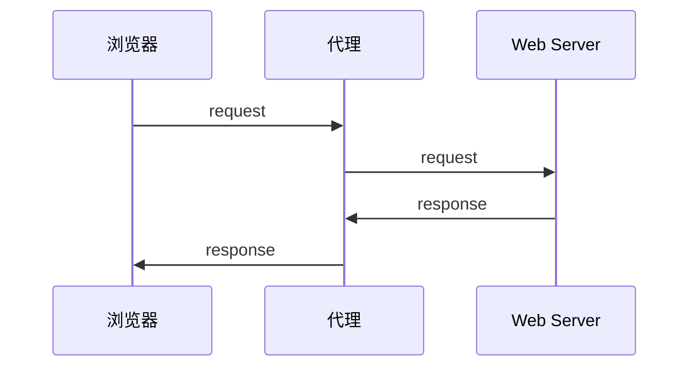

## Requests

> requests文档<http://docs.python-requests.org/zh_CN/latest/index.html>
>
> 安装：pip install requests

### 01 | get 请求

```python
import requests

url = 'wwwwwwwwwwww'
response = requests.get(url)
print(response)
```


### 02 | 响应对象

```python
# 1.2.2-response.content
import requests 

# 目标url
url = 'https://www.baidu.com' 

# 向目标url发送get请求
response = requests.get(url)

# 打印响应内容
# print(response.text)
print(response.content.decode()) # 注意这里！
```

- response.text
  - 类型：str
  - 解码类型：requests 模块自动根据 HTTP 头部对响应的编码做出有根据的推测，推测的文本编码
- response.content
  - 类型：bytes
  - 解码类型，没有指定


#### 2.1 | 通过对 response.content 进行 decode，来解决中文乱码

- response.content.decode()` 默认utf-8
- `response.content.decode("GBK")`
- 常见的编码字符集
  - utf-8
  - gbk
  - gb2312
  - ascii  （读音：阿斯克码）	
  - iso-8859-1


#### 2.2 | response响应对象的其它常用属性或方法

> `response = requests.get(url) `中response是发送请求获取的响应对象；response响应对象中除了text、content获取响应内容以外还有其它常用的属性或方法：

- `response.url`：响应的 url，有时候响应的 url 和请求的 url 不一样
- `response.status.code`：响应状态码
- `response.request.headers`：响应对应的请求头
- `response.headers`：响应头
- `response.request._cookie`：响应对应请求的 cookie，返回 cookieJar 类型
- `response.cookies`：响应的 cookie，经过了 set-cookie 动作，返回 cookieJar 类型
- `response.json()`：自动将 json 字符串类型的响应类型转换为 python 对象（dict or list）


### 03 | requests 模块发送GET请求

#### 3.1 带 headers 的请求

```python
import requests

url = 'https://www.baidu.com'

headers = {"User-Agent": "Mozilla/5.0 (Windows NT 10.0; Win64; x64) AppleWebKit/537.36 (KHTML, like Gecko) Chrome/54.0.2840.99 Safari/537.36"}

# 在请求头中带上User-Agent，模拟浏览器发送请求
response = requests.get(url, headers=headers) 

print(response.content)

# 打印请求头信息
print(response.request.headers)
```


#### 3.2 带参数的请求

**在url携带参数**

```python
import requests

headers = {"User-Agent": "Mozilla/5.0 (Windows NT 10.0; Win64; x64) AppleWebKit/537.36 (KHTML, like Gecko) Chrome/54.0.2840.99 Safari/537.36"}

url = 'https://www.baidu.com/s?wd=python'

response = requests.get(url, headers=headers)
```


**通过params携带参数字典**

- 构建请求参数字典
- 向接口发送请求的时候带上参数字典，参数字典设置给params

```python
import requests

headers = {"User-Agent": "Mozilla/5.0 (Windows NT 10.0; Win64; x64) AppleWebKit/537.36 (KHTML, like Gecko) Chrome/54.0.2840.99 Safari/537.36"}

# 这是目标url
# url = 'https://www.baidu.com/s?wd=python'

# 最后有没有问号结果都一样
url = 'https://www.baidu.com/s?'

# 请求参数是一个字典 即wd=python
kw = {'wd': 'python'}

# 带上请求参数发起请求，获取响应
response = requests.get(url, headers=headers, params=kw)

print(response.content)
```


#### 3.3 在headers参数中携带cookie

> 网站经常利用请求头中的Cookie字段来做用户访问状态的保持，那么我们可以在headers参数中添加Cookie，模拟普通用户的请求。我们以github登陆为例：


##### 3.3.1 github登陆抓包分析

1. 打开浏览器，右键-检查，点击 Network，勾选 Preserve log
2. 访问 github 登陆的url地址 `https://github.com/login`
3. 输入账号密码点击登陆后，访问一个需要登陆后才能获取正确内容的url，比如点击右上角的Your profile访问`https://github.com/USER_NAME`
4. 确定url之后，再确定发送该请求所需要的请求头信息中的User-Agent和Cookie


##### 3.3.2 完成代码

- 从浏览器中复制User-Agent和Cookie
- 浏览器中的请求头字段和值与headers参数中必须一致
- headers请求参数字典中的Cookie键对应的值是字符串

```python
import requests

url = 'https://github.com/USER_NAME'

# 构造请求头字典
headers = {
    # 从浏览器中复制过来的User-Agent
    'User-Agent': 'Mozilla/5.0 (Windows NT 10.0; Win64; x64) AppleWebKit/537.36 (KHTML, like Gecko) Chrome/67.0.3396.87 Safari/537.36',
    # 从浏览器中复制过来的Cookie
    'Cookie': 'xxx这里是复制过来的cookie字符串'
}

# 请求头参数字典中携带cookie字符串
resp = requests.get(url, headers=headers)

print(resp.text)
```


#### 3.4 cookies参数的使用

1. cookies参数的形式：字典

   `cookies = {"cookie的name":"cookie的value"}`

   - 该字典对应请求头中Cookie字符串，以分号、空格分割每一对字典键值对
   - 等号左边的是一个cookie的name，对应cookies字典的key
   - 等号右边对应cookies字典的value

2. cookies参数的使用方法

   `response = requests.get(url, cookies)`

3. 将cookie字符串转换为cookies参数所需的字典：

   `cookies_dict = {cookie.split('=')[0]:cookie.split('=')[-1] for cookie in cookies_str.split('; ')}`

4. 注意：**cookie一般是有过期时间的，一旦过期需要重新获取**

```python
import requests

url = 'https://github.com/USER_NAME'

# 构造请求头字典
headers = {
    'User-Agent': 'Mozilla/5.0 (Windows NT 10.0; Win64; x64) AppleWebKit/537.36 (KHTML, like Gecko) Chrome/67.0.3396.87 Safari/537.36'
}
# 构造cookies字典
cookies_str = '从浏览器中copy过来的cookies字符串'

cookies_dict = {cookie.split('=')[0]:cookie.split('=')[-1] for cookie in cookies_str.split('; ')}

# 请求头参数字典中携带cookie字符串
resp = requests.get(url, headers=headers, cookies=cookies_dict)

print(resp.text)
```


#### 3.5 cookieJar对象转换为cookies字典的方法

> 使用requests获取的resposne对象，具有cookies属性。该属性值是一个cookieJar类型，包含了对方服务器设置在本地的cookie。我们如何将其转换为cookies字典呢？

1. 转换方法

   `cookies_dict = requests.utils.dict_from_cookiejar(response.cookies)`

2. 其中response.cookies返回的就是cookieJar类型的对象

3. `requests.utils.dict_from_cookiejar`函数返回cookies字典


#### 3.6 超时参数timeout的使用

1. 超时参数timeout的使用方法

   `response = requests.get(url, timeout=3)`

2. timeout=3表示：发送请求后，3秒钟内返回响应，否则就抛出异常

```python
import requests


url = 'https://twitter.com'
response = requests.get(url, timeout=3)     # 设置超时时间
```


#### 3.7 了解代理以及proxy代理参数的使用

> proxy代理参数通过指定代理ip，让代理ip对应的正向代理服务器转发我们发送的请求，那么我们首先来了解一下代理ip以及代理服务器

##### 3.7.1 理解使用代理的过程

1. 代理ip是一个ip，指向的是一个代理服务器
2. 代理服务器能够帮我们向目标服务器转发请求



##### 3.7.2 正向代理和反向代理的区别

> 前边提到proxy参数指定的代理ip指向的是正向的代理服务器，那么相应的就有反向服务器；现在来了解一下正向代理服务器和反向代理服务器的区别

1. 从发送请求的一方的角度，来区分正向或反向代理
2. 为浏览器或客户端（发送请求的一方）转发请求的，叫做正向代理
   - 浏览器知道最终处理请求的服务器的真实ip地址，例如VPN
3. 不为浏览器或客户端（发送请求的一方）转发请求、而是为最终处理请求的服务器转发请求的，叫做反向代理
   - 浏览器不知道服务器的真实地址，例如nginx


##### 3.7.3 代理ip（代理服务器）的分类

1. 根据代理ip的匿名程度，代理IP可以分为下面三类：

   - 透明代理(Transparent Proxy)：透明代理虽然可以直接“隐藏”你的IP地址，但是还是可以查到你是谁。目标服务器接收到的请求头如下：

     ```
     REMOTE_ADDR = Proxy IP
     HTTP_VIA = Proxy IP
     HTTP_X_FORWARDED_FOR = Your IP
     ```

   - 匿名代理(Anonymous Proxy)：使用匿名代理，别人只能知道你用了代理，无法知道你是谁。目标服务器接收到的请求头如下：

     ```
     REMOTE_ADDR = proxy IP
     HTTP_VIA = proxy IP
     HTTP_X_FORWARDED_FOR = proxy IP
     ```

   - 高匿代理(Elite proxy或High Anonymity Proxy)：高匿代理让别人根本无法发现你是在用代理，所以是最好的选择。**毫无疑问使用高匿代理效果最好**。目标服务器接收到的请求头如下：

     ```
     REMOTE_ADDR = Proxy IP
     HTTP_VIA = not determined
     HTTP_X_FORWARDED_FOR = not determined
     ```

2. 根据网站所使用的协议不同，需要使用相应协议的代理服务。从代理服务请求使用的协议可以分为：

   - http代理：目标url为http协议
   - https代理：目标url为https协议
   - socks隧道代理（例如socks5代理）等：
     1. socks 代理只是简单地传递数据包，不关心是何种应用协议（FTP、HTTP和HTTPS等）。
     2. socks 代理比http、https代理耗时少。
     3. socks 代理可以转发http和https的请求

##### 3.7.4 proxies代理参数的使用

> 为了让服务器以为不是同一个客户端在请求；为了防止频繁向一个域名发送请求被封ip，所以我们需要使用代理ip；那么我们接下来要学习requests模块是如何使用代理ip的

- 用法：

  ```python
  response = requests.get(url, proxies=proxies)
  ```

- proxies的形式：字典

- 例如：

  ```python
  proxies = { 
      "http": "http://12.34.56.79:9527", 
      "https": "https://12.34.56.79:9527", 
  }
  ```

- 注意：如果proxies字典中包含有多个键值对，发送请求时将按照url地址的协议来选择使用相应的代理ip


#### 3.8 使用verify参数忽略CA证书

> 在使用浏览器上网的时候，有时能够看到下面的提示（2018年10月之前的12306网站）：
>
> 您的链接不是私密链接............

运行代码查看代码中向不安全的链接发起请求的效果

> 运行下面的代码将会抛出包含`ssl.CertificateError ...`字样的异常

```python
import requests
url = "https://sam.huat.edu.cn:8443/selfservice/"
response = requests.get(url)
```

**解决方案**

> 为了在代码中能够正常的请求，我们使用`verify=False`参数，此时requests模块发送请求将不做CA证书的验证：verify参数能够忽略CA证书的认证

```python
import requests
url = "https://sam.huat.edu.cn:8443/selfservice/" 
response = requests.get(url,verify=False)
```


### 04 | requests模块发送post请求

> 思考：哪些地方我们会用到POST请求？
>
> 1. 登录注册（ 在web工程师看来POST 比 GET 更安全，url地址中不会暴露用户的账号密码等信息）
> 2. 需要传输大文本内容的时候（ POST 请求对数据长度没有要求）
>
> 所以同样的，我们的爬虫也需要在这两个地方回去模拟浏览器发送post请求

**requests发送post请求的方法**

- `response = requests.post(url, data)`
- `data`参数接收一个字典
- **requests模块发送post请求函数的其它参数和发送get请求的参数完全一致**


**百度翻译的代码实现：**

```python
import requests
import json


class King(object):

    def __init__(self, word):
        self.url = "http://fy.iciba.com/ajax.php?a=fy"
        self.word = word
        self.headers = {
            "User-Agent": "Mozilla/5.0 (Macintosh; Intel Mac OS X 10_12_6) AppleWebKit/537.36 (KHTML, like Gecko) Chrome/71.0.3578.98 Safari/537.36"
        }
        self.post_data = {
            "f": "auto",
            "t": "auto",
            "w": self.word
        }

    def get_data(self):
        response = requests.post(self.url, headers=self.headers, data=self.post_data)
        # 默认返回bytes类型，除非确定外部调用使用str才进行解码操作
        return response.content

    def parse_data(self, data):

        # 将json数据转换成python字典
        dict_data = json.loads(data)

        # 从字典中抽取翻译结果
        try:
            print(dict_data['content']['out'])
        except:
            print(dict_data['content']['word_mean'][0])

    def run(self):
        # url
        # headers
        # post——data
        # 发送请求
        data = self.get_data()
        # 解析
        self.parse_data(data)

if __name__ == '__main__':
    # king = King("人生苦短，及时行乐")
    king = King("China")
    king.run()
    # python标准库有很多有用的方法，每天看一个标准库的使用
```


### 05 | 利用requests.session进行状态保持

requests模块中的Session类能够自动处理发送请求获取响应过程中产生的cookie，进而达到状态保持的目的。接下来我们就来学习它

#### 5.1 requests.session的作用以及应用场景

- requests.session的作用
  - 自动处理cookie，即 **下一次请求会带上前一次的cookie**
- requests.session的应用场景
  - 自动处理连续的多次请求过程中产生的cookie


#### 5.2  requests.session使用方法

> session实例在请求了一个网站后，对方服务器设置在本地的cookie会保存在session中，下一次再使用session请求对方服务器的时候，会带上前一次的cookie

```python
session = requests.session() # 实例化session对象
response = session.get(url, headers, ...)
response = session.post(url, data, ...)
```

session对象发送get或post请求的参数，与requests模块发送请求的参数完全一致

#### 5.3 github登陆示例

1. 对github登陆以及访问登陆后才能访问的页面的整个完成过程进行抓包
2. 确定登陆请求的url地址、请求方法和所需的请求参数
   - 部分请求参数在别的url对应的响应内容中，可以使用re模块获取
3. 确定登陆后才能访问的页面的的url地址和请求方法
4. 利用requests.session完成代码

```python
import requests
import re


# 构造请求头字典
headers = {
    'User-Agent': 'Mozilla/5.0 (Windows NT 10.0; Win64; x64) AppleWebKit/537.36 (KHTML, like Gecko) Chrome/67.0.3396.87 Safari/537.36',
}

# 实例化session对象
session = requests.session()

# 访问登陆页获取登陆请求所需参数
response = session.get('https://github.com/login', headers=headers)
authenticity_token = re.search('name="authenticity_token" value="(.*?)" />', response.text).group(1) # 使用正则获取登陆请求所需参数

# 构造登陆请求参数字典
data = {
    'commit': 'Sign in', # 固定值
    'utf8': '✓', # 固定值
    'authenticity_token': authenticity_token, # 该参数在登陆页的响应内容中
    'login': input('输入github账号：'),
    'password': input('输入github账号：')
}

# 发送登陆请求（无需关注本次请求的响应）
session.post('https://github.com/session', headers=headers, data=data)

# 打印需要登陆后才能访问的页面
response = session.get('https://github.com/1596930226', headers=headers)
print(response.text)
```


## jsonpath

如果有一个多层嵌套的复杂字典，想要根据key和下标来批量提取value，这是比较困难的。jsonpath模块就能解决这个痛点，接下来我们

就来学习jsonpath模块。

**jsonpath可以按照key对python字典进行批量数据提取**


### 01 | jsonpath 模块的使用方法

jsonpath是第三方模块，需要额外安装

```
pip install jsonpath
```

jsonpath模块提取数据的方法

```python
from jsonpath import jsonpath
ret = jsonpath(a, 'jsonpath语法规则字符串')
```

**语法规则：**

| jsonpath | 描述                                                         |
| -------- | ------------------------------------------------------------ |
| $        | 根节点                                                       |
| @        | 现行节点                                                     |
| . or []  | 取子节点                                                     |
| n/a      | 取父节点，Jsonpath 未支持                                    |
| ..       | 就是不管位置，选择所有符合条件的条件                         |
| *        | 匹配所有元素节点                                             |
| n/a      | 根据属性访问，Json 不支持，因为 Json 是个 key-value 递归结构，不需要属性访问 |
| []       | 迭代器标示：可以在里边做简单的迭代操作，如数组下标，根据内容选值等 |
| [,]      | 支持迭代器中做多选                                           |
| ?()      | 支持过滤操作                                                 |
| ()       | 支持表达式计算                                               |
| n/a      | 分组，Jsonpath 不支持                                        |


### 02 | jsonpath使用示例

```python
book_dict = { 
  "store": {
    "book": [ 
      { "category": "reference",
        "author": "Nigel Rees",
        "title": "Sayings of the Century",
        "price": 8.95
      },
      { "category": "fiction",
        "author": "Evelyn Waugh",
        "title": "Sword of Honour",
        "price": 12.99
      },
      { "category": "fiction",
        "author": "Herman Melville",
        "title": "Moby Dick",
        "isbn": "0-553-21311-3",
        "price": 8.99
      },
      { "category": "fiction",
        "author": "J. R. R. Tolkien",
        "title": "The Lord of the Rings",
        "isbn": "0-395-19395-8",
        "price": 22.99
      }
    ],
    "bicycle": {
      "color": "red",
      "price": 19.95
    }
  }
}

from jsonpath import jsonpath

print(jsonpath(book_dict, '$..author')) # 如果取不到将返回False # 返回列表，如果取不到将返回False
```


**示例二**

>  我们以拉勾网城市JSON文件 <http://www.lagou.com/lbs/getAllCitySearchLabels.json> 为例，获取所有城市的名字的列表，并写入文件。

```python
import requests
import jsonpath
import json

# 获取拉勾网城市json字符串
url = 'http://www.lagou.com/lbs/getAllCitySearchLabels.json'
headers = {"User-Agent": "Mozilla/5.0 (compatible; MSIE 9.0; Windows NT 6.1; Trident/5.0)"}
response =requests.get(url, headers=headers)
html_str = response.content.decode()

# 把json格式字符串转换成python对象
jsonobj = json.loads(html_str)

# 从根节点开始，获取所有key为name的值
citylist = jsonpath.jsonpath(jsonobj,'$..name')

# 写入文件
with open('city_name.txt','w') as f:
    content = json.dumps(citylist, ensure_ascii=False)
    f.write(content)
```

