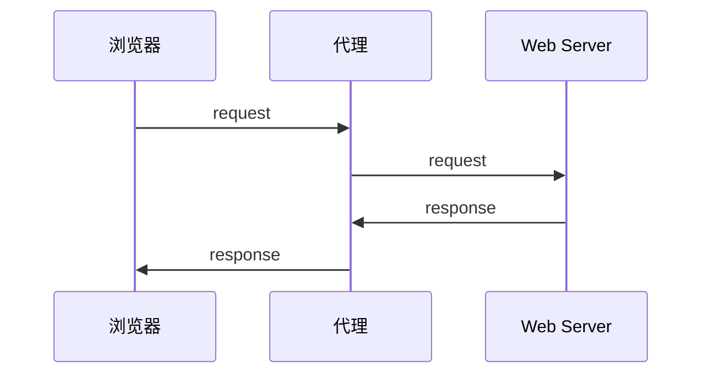
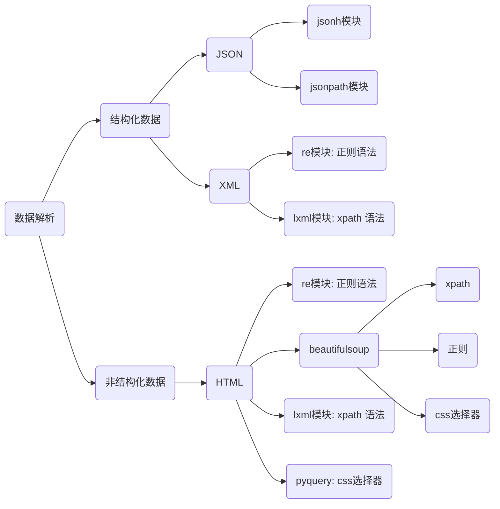
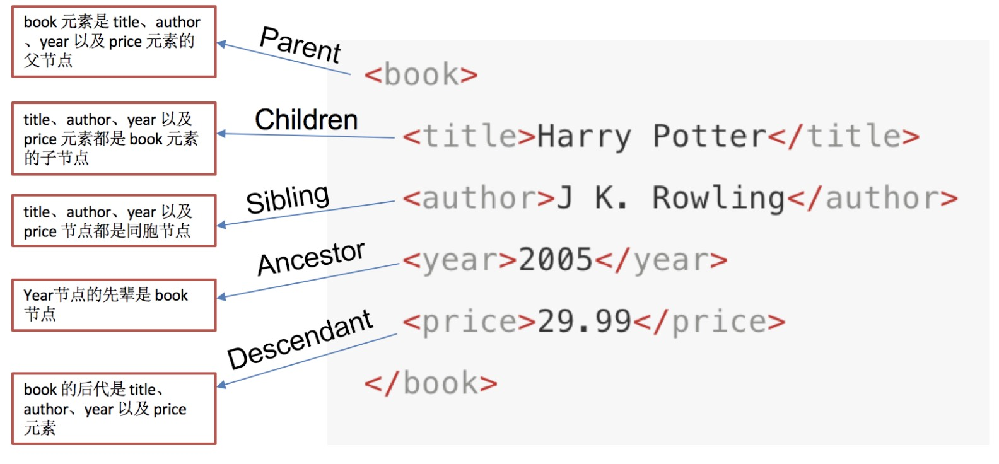
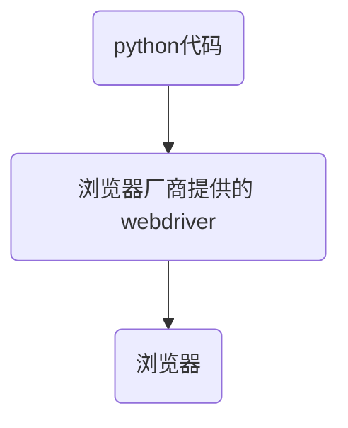

- requests
- jsonpath
- xpath
- selenium

## Requests

> requests文档<http://docs.python-requests.org/zh_CN/latest/index.html>
>
> 安装：pip install requests

### 01 | get 请求

```python
import requests

url = 'wwwwwwwwwwww'
response = requests.get(url)
print(response)
```


### 02 | 响应对象

```python
# 1.2.2-response.content
import requests 

# 目标url
url = 'https://www.baidu.com' 

# 向目标url发送get请求
response = requests.get(url)

# 打印响应内容
# print(response.text)
print(response.content.decode()) # 注意这里！
```

- response.text
  - 类型：str
  - 解码类型：requests 模块自动根据 HTTP 头部对响应的编码做出有根据的推测，推测的文本编码
- response.content
  - 类型：bytes
  - 解码类型，没有指定


#### 2.1 | 通过对 response.content 进行 decode，来解决中文乱码

- response.content.decode()` 默认utf-8
- `response.content.decode("GBK")`
- 常见的编码字符集
  - utf-8
  - gbk
  - gb2312
  - ascii  （读音：阿斯克码）	
  - iso-8859-1


#### 2.2 | response响应对象的其它常用属性或方法

> `response = requests.get(url) `中response是发送请求获取的响应对象；response响应对象中除了text、content获取响应内容以外还有其它常用的属性或方法：

- `response.url`：响应的 url，有时候响应的 url 和请求的 url 不一样
- `response.status.code`：响应状态码
- `response.request.headers`：响应对应的请求头
- `response.headers`：响应头
- `response.request._cookie`：响应对应请求的 cookie，返回 cookieJar 类型
- `response.cookies`：响应的 cookie，经过了 set-cookie 动作，返回 cookieJar 类型
- `response.json()`：自动将 json 字符串类型的响应类型转换为 python 对象（dict or list）


### 03 | requests 模块发送GET请求

#### 3.1 带 headers 的请求

```python
import requests

url = 'https://www.baidu.com'

headers = {"User-Agent": "Mozilla/5.0 (Windows NT 10.0; Win64; x64) AppleWebKit/537.36 (KHTML, like Gecko) Chrome/54.0.2840.99 Safari/537.36"}

# 在请求头中带上User-Agent，模拟浏览器发送请求
response = requests.get(url, headers=headers) 

print(response.content)

# 打印请求头信息
print(response.request.headers)
```


#### 3.2 带参数的请求

**在url携带参数**

```python
import requests

headers = {"User-Agent": "Mozilla/5.0 (Windows NT 10.0; Win64; x64) AppleWebKit/537.36 (KHTML, like Gecko) Chrome/54.0.2840.99 Safari/537.36"}

url = 'https://www.baidu.com/s?wd=python'

response = requests.get(url, headers=headers)
```


**通过params携带参数字典**

- 构建请求参数字典
- 向接口发送请求的时候带上参数字典，参数字典设置给params

```python
import requests

headers = {"User-Agent": "Mozilla/5.0 (Windows NT 10.0; Win64; x64) AppleWebKit/537.36 (KHTML, like Gecko) Chrome/54.0.2840.99 Safari/537.36"}

# 这是目标url
# url = 'https://www.baidu.com/s?wd=python'

# 最后有没有问号结果都一样
url = 'https://www.baidu.com/s?'

# 请求参数是一个字典 即wd=python
kw = {'wd': 'python'}

# 带上请求参数发起请求，获取响应
response = requests.get(url, headers=headers, params=kw)

print(response.content)
```


#### 3.3 在headers参数中携带cookie

> 网站经常利用请求头中的Cookie字段来做用户访问状态的保持，那么我们可以在headers参数中添加Cookie，模拟普通用户的请求。我们以github登陆为例：


##### 3.3.1 github登陆抓包分析

1. 打开浏览器，右键-检查，点击 Network，勾选 Preserve log
2. 访问 github 登陆的url地址 `https://github.com/login`
3. 输入账号密码点击登陆后，访问一个需要登陆后才能获取正确内容的url，比如点击右上角的Your profile访问`https://github.com/USER_NAME`
4. 确定url之后，再确定发送该请求所需要的请求头信息中的User-Agent和Cookie


##### 3.3.2 完成代码

- 从浏览器中复制User-Agent和Cookie
- 浏览器中的请求头字段和值与headers参数中必须一致
- headers请求参数字典中的Cookie键对应的值是字符串

```python
import requests

url = 'https://github.com/USER_NAME'

# 构造请求头字典
headers = {
    # 从浏览器中复制过来的User-Agent
    'User-Agent': 'Mozilla/5.0 (Windows NT 10.0; Win64; x64) AppleWebKit/537.36 (KHTML, like Gecko) Chrome/67.0.3396.87 Safari/537.36',
    # 从浏览器中复制过来的Cookie
    'Cookie': 'xxx这里是复制过来的cookie字符串'
}

# 请求头参数字典中携带cookie字符串
resp = requests.get(url, headers=headers)

print(resp.text)
```


#### 3.4 cookies参数的使用

1. cookies参数的形式：字典

   `cookies = {"cookie的name":"cookie的value"}`

   - 该字典对应请求头中Cookie字符串，以分号、空格分割每一对字典键值对
   - 等号左边的是一个cookie的name，对应cookies字典的key
   - 等号右边对应cookies字典的value

2. cookies参数的使用方法

   `response = requests.get(url, cookies)`

3. 将cookie字符串转换为cookies参数所需的字典：

   `cookies_dict = {cookie.split('=')[0]:cookie.split('=')[-1] for cookie in cookies_str.split('; ')}`

4. 注意：**cookie一般是有过期时间的，一旦过期需要重新获取**

```python
import requests

url = 'https://github.com/USER_NAME'

# 构造请求头字典
headers = {
    'User-Agent': 'Mozilla/5.0 (Windows NT 10.0; Win64; x64) AppleWebKit/537.36 (KHTML, like Gecko) Chrome/67.0.3396.87 Safari/537.36'
}
# 构造cookies字典
cookies_str = '从浏览器中copy过来的cookies字符串'

cookies_dict = {cookie.split('=')[0]:cookie.split('=')[-1] for cookie in cookies_str.split('; ')}

# 请求头参数字典中携带cookie字符串
resp = requests.get(url, headers=headers, cookies=cookies_dict)

print(resp.text)
```


#### 3.5 cookieJar对象转换为cookies字典的方法

> 使用requests获取的resposne对象，具有cookies属性。该属性值是一个cookieJar类型，包含了对方服务器设置在本地的cookie。我们如何将其转换为cookies字典呢？

1. 转换方法

   `cookies_dict = requests.utils.dict_from_cookiejar(response.cookies)`

2. 其中response.cookies返回的就是cookieJar类型的对象

3. `requests.utils.dict_from_cookiejar`函数返回cookies字典


#### 3.6 超时参数timeout的使用

1. 超时参数timeout的使用方法

   `response = requests.get(url, timeout=3)`

2. timeout=3表示：发送请求后，3秒钟内返回响应，否则就抛出异常

```python
import requests


url = 'https://twitter.com'
response = requests.get(url, timeout=3)     # 设置超时时间
```


#### 3.7 了解代理以及proxy代理参数的使用

> proxy代理参数通过指定代理ip，让代理ip对应的正向代理服务器转发我们发送的请求，那么我们首先来了解一下代理ip以及代理服务器

##### 3.7.1 理解使用代理的过程

1. 代理ip是一个ip，指向的是一个代理服务器
2. 代理服务器能够帮我们向目标服务器转发请求



##### 3.7.2 正向代理和反向代理的区别

> 前边提到proxy参数指定的代理ip指向的是正向的代理服务器，那么相应的就有反向服务器；现在来了解一下正向代理服务器和反向代理服务器的区别

1. 从发送请求的一方的角度，来区分正向或反向代理
2. 为浏览器或客户端（发送请求的一方）转发请求的，叫做正向代理
   - 浏览器知道最终处理请求的服务器的真实ip地址，例如VPN
3. 不为浏览器或客户端（发送请求的一方）转发请求、而是为最终处理请求的服务器转发请求的，叫做反向代理
   - 浏览器不知道服务器的真实地址，例如nginx


##### 3.7.3 代理ip（代理服务器）的分类

1. 根据代理ip的匿名程度，代理IP可以分为下面三类：

   - 透明代理(Transparent Proxy)：透明代理虽然可以直接“隐藏”你的IP地址，但是还是可以查到你是谁。目标服务器接收到的请求头如下：

     ```
     REMOTE_ADDR = Proxy IP
     HTTP_VIA = Proxy IP
     HTTP_X_FORWARDED_FOR = Your IP
     ```

   - 匿名代理(Anonymous Proxy)：使用匿名代理，别人只能知道你用了代理，无法知道你是谁。目标服务器接收到的请求头如下：

     ```
     REMOTE_ADDR = proxy IP
     HTTP_VIA = proxy IP
     HTTP_X_FORWARDED_FOR = proxy IP
     ```

   - 高匿代理(Elite proxy或High Anonymity Proxy)：高匿代理让别人根本无法发现你是在用代理，所以是最好的选择。**毫无疑问使用高匿代理效果最好**。目标服务器接收到的请求头如下：

     ```
     REMOTE_ADDR = Proxy IP
     HTTP_VIA = not determined
     HTTP_X_FORWARDED_FOR = not determined
     ```

2. 根据网站所使用的协议不同，需要使用相应协议的代理服务。从代理服务请求使用的协议可以分为：

   - http代理：目标url为http协议
   - https代理：目标url为https协议
   - socks隧道代理（例如socks5代理）等：
     1. socks 代理只是简单地传递数据包，不关心是何种应用协议（FTP、HTTP和HTTPS等）。
     2. socks 代理比http、https代理耗时少。
     3. socks 代理可以转发http和https的请求

##### 3.7.4 proxies代理参数的使用

> 为了让服务器以为不是同一个客户端在请求；为了防止频繁向一个域名发送请求被封ip，所以我们需要使用代理ip；那么我们接下来要学习requests模块是如何使用代理ip的

- 用法：

  ```python
  response = requests.get(url, proxies=proxies)
  ```

- proxies的形式：字典

- 例如：

  ```python
  proxies = { 
      "http": "http://12.34.56.79:9527", 
      "https": "https://12.34.56.79:9527", 
  }
  ```

- 注意：如果proxies字典中包含有多个键值对，发送请求时将按照url地址的协议来选择使用相应的代理ip


#### 3.8 使用verify参数忽略CA证书

> 在使用浏览器上网的时候，有时能够看到下面的提示（2018年10月之前的12306网站）：
>
> 您的链接不是私密链接............

运行代码查看代码中向不安全的链接发起请求的效果

> 运行下面的代码将会抛出包含`ssl.CertificateError ...`字样的异常

```python
import requests
url = "https://sam.huat.edu.cn:8443/selfservice/"
response = requests.get(url)
```

**解决方案**

> 为了在代码中能够正常的请求，我们使用`verify=False`参数，此时requests模块发送请求将不做CA证书的验证：verify参数能够忽略CA证书的认证

```python
import requests
url = "https://sam.huat.edu.cn:8443/selfservice/" 
response = requests.get(url,verify=False)
```


### 04 | requests模块发送post请求

> 思考：哪些地方我们会用到POST请求？
>
> 1. 登录注册（ 在web工程师看来POST 比 GET 更安全，url地址中不会暴露用户的账号密码等信息）
> 2. 需要传输大文本内容的时候（ POST 请求对数据长度没有要求）
>
> 所以同样的，我们的爬虫也需要在这两个地方回去模拟浏览器发送post请求

**requests发送post请求的方法**

- `response = requests.post(url, data)`
- `data`参数接收一个字典
- **requests模块发送post请求函数的其它参数和发送get请求的参数完全一致**


**百度翻译的代码实现：**

```python
import requests
import json


class King(object):

    def __init__(self, word):
        self.url = "http://fy.iciba.com/ajax.php?a=fy"
        self.word = word
        self.headers = {
            "User-Agent": "Mozilla/5.0 (Macintosh; Intel Mac OS X 10_12_6) AppleWebKit/537.36 (KHTML, like Gecko) Chrome/71.0.3578.98 Safari/537.36"
        }
        self.post_data = {
            "f": "auto",
            "t": "auto",
            "w": self.word
        }

    def get_data(self):
        response = requests.post(self.url, headers=self.headers, data=self.post_data)
        # 默认返回bytes类型，除非确定外部调用使用str才进行解码操作
        return response.content

    def parse_data(self, data):

        # 将json数据转换成python字典
        dict_data = json.loads(data)

        # 从字典中抽取翻译结果
        try:
            print(dict_data['content']['out'])
        except:
            print(dict_data['content']['word_mean'][0])

    def run(self):
        # url
        # headers
        # post——data
        # 发送请求
        data = self.get_data()
        # 解析
        self.parse_data(data)

if __name__ == '__main__':
    # king = King("人生苦短，及时行乐")
    king = King("China")
    king.run()
    # python标准库有很多有用的方法，每天看一个标准库的使用
```


### 05 | 利用requests.session进行状态保持

requests模块中的Session类能够自动处理发送请求获取响应过程中产生的cookie，进而达到状态保持的目的。接下来我们就来学习它

#### 5.1 requests.session的作用以及应用场景

- requests.session的作用
  - 自动处理cookie，即 **下一次请求会带上前一次的cookie**
- requests.session的应用场景
  - 自动处理连续的多次请求过程中产生的cookie


#### 5.2  requests.session使用方法

> session实例在请求了一个网站后，对方服务器设置在本地的cookie会保存在session中，下一次再使用session请求对方服务器的时候，会带上前一次的cookie

```python
session = requests.session() # 实例化session对象
response = session.get(url, headers, ...)
response = session.post(url, data, ...)
```

session对象发送get或post请求的参数，与requests模块发送请求的参数完全一致

#### 5.3 github登陆示例

1. 对github登陆以及访问登陆后才能访问的页面的整个完成过程进行抓包
2. 确定登陆请求的url地址、请求方法和所需的请求参数
   - 部分请求参数在别的url对应的响应内容中，可以使用re模块获取
3. 确定登陆后才能访问的页面的的url地址和请求方法
4. 利用requests.session完成代码

```python
import requests
import re


# 构造请求头字典
headers = {
    'User-Agent': 'Mozilla/5.0 (Windows NT 10.0; Win64; x64) AppleWebKit/537.36 (KHTML, like Gecko) Chrome/67.0.3396.87 Safari/537.36',
}

# 实例化session对象
session = requests.session()

# 访问登陆页获取登陆请求所需参数
response = session.get('https://github.com/login', headers=headers)
authenticity_token = re.search('name="authenticity_token" value="(.*?)" />', response.text).group(1) # 使用正则获取登陆请求所需参数

# 构造登陆请求参数字典
data = {
    'commit': 'Sign in', # 固定值
    'utf8': '✓', # 固定值
    'authenticity_token': authenticity_token, # 该参数在登陆页的响应内容中
    'login': input('输入github账号：'),
    'password': input('输入github账号：')
}

# 发送登陆请求（无需关注本次请求的响应）
session.post('https://github.com/session', headers=headers, data=data)

# 打印需要登陆后才能访问的页面
response = session.get('https://github.com/1596930226', headers=headers)
print(response.text)
```


## 数据提取

数据解析：



效率排行：

- 正则
- xpath
- lxml
- beautifulsoup


### jsonpath

如果有一个多层嵌套的复杂字典，想要根据key和下标来批量提取value，这是比较困难的。jsonpath模块就能解决这个痛点，接下来我们

就来学习jsonpath模块。

**jsonpath可以按照key对python字典进行批量数据提取**


#### 01 | jsonpath 模块的使用方法

jsonpath是第三方模块，需要额外安装

```
pip install jsonpath
```

jsonpath模块提取数据的方法

```python
from jsonpath import jsonpath
ret = jsonpath(a, 'jsonpath语法规则字符串')
```

**语法规则：**

| jsonpath    | 描述                                                         |
| ----------- | ------------------------------------------------------------ |
| **$**       | **根节点，可以理解成最外层的大括号**                         |
| @           | 现行节点                                                     |
| **. or []** | **取子节点**                                                 |
| n/a         | 取父节点，Jsonpath 未支持                                    |
| **..**      | **就是不管位置，选择所有符合条件的条件。子孙节点**           |
| *           | 匹配所有元素节点                                             |
| n/a         | 根据属性访问，Json 不支持，因为 Json 是个 key-value 递归结构，不需要属性访问 |
| []          | 迭代器标示：可以在里边做简单的迭代操作，如数组下标，根据内容选值等 |
| [,]         | 支持迭代器中做多选                                           |
| ?()         | 支持过滤操作                                                 |
| ()          | 支持表达式计算                                               |
| n/a         | 分组，Jsonpath 不支持                                        |

> 常用：`$`、`.`、`..`


#### 02 | jsonpath使用示例

```python
book_dict = { 
  "store": {
    "book": [ 
      { "category": "reference",
        "author": "Nigel Rees",
        "title": "Sayings of the Century",
        "price": 8.95
      },
      { "category": "fiction",
        "author": "Evelyn Waugh",
        "title": "Sword of Honour",
        "price": 12.99
      },
      { "category": "fiction",
        "author": "Herman Melville",
        "title": "Moby Dick",
        "isbn": "0-553-21311-3",
        "price": 8.99
      },
      { "category": "fiction",
        "author": "J. R. R. Tolkien",
        "title": "The Lord of the Rings",
        "isbn": "0-395-19395-8",
        "price": 22.99
      }
    ],
    "bicycle": {
      "color": "red",
      "price": 19.95
    }
  }
}

from jsonpath import jsonpath

print(jsonpath(book_dict, '$..author')) # 如果取不到将返回False # 返回列表，如果取不到将返回False
```


**示例二**

>  我们以拉勾网城市JSON文件 <http://www.lagou.com/lbs/getAllCitySearchLabels.json> 为例，获取所有城市的名字的列表，并写入文件。

```python
import requests
import jsonpath
import json

# 获取拉勾网城市json字符串
url = 'http://www.lagou.com/lbs/getAllCitySearchLabels.json'
headers = {"User-Agent": "Mozilla/5.0 (compatible; MSIE 9.0; Windows NT 6.1; Trident/5.0)"}
response =requests.get(url, headers=headers)
html_str = response.content.decode()

# 把json格式字符串转换成python对象
jsonobj = json.loads(html_str)

# 从根节点开始，获取所有key为name的值
citylist = jsonpath.jsonpath(jsonobj,'$..name')

# 写入文件
with open('city_name.txt','w') as f:
    content = json.dumps(citylist, ensure_ascii=False)
    f.write(content)
```


### lxml模块：xpath

- lxml模块可以利用XPath规则语法，来快速的定位HTML\XML 文档中特定元素以及获取节点信息（文本内容、属性值）
- XPath (XML Path Language) 是一门在 HTML\XML 文档中查找信息的**语言**，可用来在 HTML\XML 文档中对**元素和属性进行遍历**。
  - W3School官方文档：<http://www.w3school.com.cn/xpath/index.asp>
- 提取xml、html中的数据需要lxml模块和xpath语法配合使用

> 安装谷歌插件：XPath Helper

安装：

```python
pip/pip3 install lxml
```


#### 01 | xpath的节点关系

> 每个html、xml的标签我们都称之为节点，其中最顶层的节点称为根节点。我们以xml为例，html也是一样的

```html
<book>
  <title>xxxxx</title>
</book>
```

- book 就是根节点
- title 是节点

 

**`author`是`title`的第一个兄弟节点**


#### 02 | xpath语法-基础节点选择语法

> 1. XPath 使用路径表达式来选取 XML 文档中的节点或者节点集。
> 2. 这些路径表达式和我们在常规的**电脑文件系统中看到的表达式**非常相似。
> 3. **使用chrome插件选择标签时候，选中时，选中的标签会添加属性class="xh-highlight"**

| 表达式                   | 描述                                                       |
| ------------------------ | ---------------------------------------------------------- |
| nodename：其实就是标签名 | 选中该元素。                                               |
| /                        | 从根节点选取、或者是元素和元素间的过渡。                   |
| //                       | 从匹配选择的当前节点选择文档中的节点，而不考虑它们的位置。 |
| .                        | 选取当前节点。                                             |
| ..                       | 选取当前节点的父节点。                                     |
| @                        | 选取属性。如：@href                                        |
| text()                   | 选取文本。                                                 |

- 选择所有的h2下的文本
  - `//h2/text()`
- 获取所有的a标签的href
  - `//a/@href`
- 获取html下的head下的title的文本
  - `/html/head/title/text()`
- 获取html下的head下的link标签的href
  - `/html/head/link/@href`


#### 03 | 节点修饰语法

可以根据标签的属性值、下标等来获取特定的节点


| 路径表达式                          | 结果                                                         |
| ----------------------------------- | ------------------------------------------------------------ |
| //title[@lang="eng"]                | 选择lang属性值为eng的所有title元素                           |
| /bookstore/book[1]                  | 选取属于 bookstore 子元素的第一个 book 元素。                |
| /bookstore/book[last()]             | 选取属于 bookstore 子元素的最后一个 book 元素。              |
| /bookstore/book[last()-1]           | 选取属于 bookstore 子元素的倒数第二个 book 元素。            |
| /bookstore/book[position()>1]       | 选择bookstore下面的book元素，从第二个开始选择                |
| //book/title[text()='Harry Potter'] | 选择所有book下的title元素，仅仅选择文本为Harry Potter的title元素 |
| /bookstore/book[price>35.00]/title  | 选取 bookstore 元素中的 book 元素的所有 title 元素，且其中的 price 元素的值须大于 35.00。 |

**关于xpath的下标**

- 在xpath中，第一个元素的位置是1
- 最后一个元素的位置是last()
- 倒数第二个是last()-1


**语法练习**

- 所有的学科的名称
  - `//div[@class="nav_txt"]//a[@class="a_gd"]`
- 第一个学科的链接
  - `//div[@class="nav_txt"]/ul/li[1]/a/@href`
- 最后一个学科的链接
  - `//div[@class="nav_txt"]/ul/li[last()]/a/@href`


#### 04 | 其他常用节点选择语法

可以通过**通配符**来选取未知的html、xml的元素

| 通配符 | 描述                 | 示例         |                                 |
| ------ | -------------------- | ------------ | ------------------------------- |
| *      | 匹配任何元素节点。   | /bookstore/* | 选取 bookstore 元素的所有子元素 |
| node() | 匹配任何类型的节点。 | //*          | 选取文档中的所有元素            |
| @*     | 匹配任何属性节点。   | //title[@*]  | 选取所有带有属性的 title 元素。 |

**语法练习**

- 全部的标签
  - `//*`
- 全部的属性
  - `//node()`


#### 05 | 其他方法

**Contains()**

Contains() 是一个在 XPath 表达式中使用的方法。当任何属性的值动态变化（例如，登录信息）时，将使用该属性。

contain 功能可以查找具有部分文本的元素，如以下示例所示。

在这个例子中，我们尝试仅仅通过属性的部分文本值来辨认元素。在下面的 XPath 表达式中部分值’sub’用来替代提交按钮。可以观察到成功找到了元素。

‘Type’的完整值是’submit’但是只使用了部分值’sub’。

```py
Xpath=//*[contains(@type,'sub')] 
```

‘name’的完整值是’btnLogin’但是只用了部分值’btn’。

```python
Xpath=//*[contains(@name,'btn')]
```


**使用 OR & AND**

在 OR 表达式中，有两个条件要用到，条件一或者条件二应为真。如果任何一个条件为真或两者皆为真，则也适

用。 意味着任何一种条件都应为真才能找到该元素。

在下面的 XPath 表达式中，辨认出了单个条件或者两个条件皆为真的元素。

```js
Xpath=//*[@type='submit' or @name='btnReset']
```

在 AND 表达式中，有两个条件要用到，这两个条件必须全部为真才能找到元素。如果任意一个条件为假就不能查

找到元素。

```python
Xpath=//input[@type='submit' and @name='btnLogin']
```


**Starts-with**

XPath starts-with() 是一个用来查找属性值随着页面刷新或者其他动态操作而改变的页面元素的函数。在这个方法

中，属性的开始文件被匹配到用来查找属性值动态变化的元素。你也可以查找属性值是静态 (不变) 的元素。

例如：假设特定元素的 ID 这样动态变化：

```python
Id=”message12”

Id=”message345”

Id=”message8769”
```

等等等等… 但是初始文本是一样的。在这种情况下，我们就可以使用 Start-with 表达式。

在下面的函数中，有两个以”message” 开头的 id 元素 (例如：’用户 - Id 不能为空’&’密码不能为空’)。在下面的表达

式中，XPath 查找到这些以’message’开头的’ID’元素。

```python
Xpath=//label[starts-with(@id, 'message')]
```


#### 06 | 运算符

下面列出了可用在 XPath 表达式中的运算符：

| 运算符 | 描述           | 实例                      | 返回值                                                       |
| :----- | :------------- | :------------------------ | :----------------------------------------------------------- |
| \|     | 计算两个节点集 | //book \| //cd            | 返回所有拥有 book 和 cd 元素的节点集                         |
| +      | 加法           | 6 + 4                     | 10                                                           |
| -      | 减法           | 6 - 4                     | 2                                                            |
| *      | 乘法           | 6 * 4                     | 24                                                           |
| div    | 除法           | 8 div 4                   | 2                                                            |
| =      | 等于           | price=9.80                | 如果 price 是 9.80，则返回 true。如果 price 是 9.90，则返回 false。 |
| !=     | 不等于         | price!=9.80               | 如果 price 是 9.90，则返回 true。如果 price 是 9.80，则返回 false。 |
| <      | 小于           | price<9.80                | 如果 price 是 9.00，则返回 true。如果 price 是 9.90，则返回 false。 |
| <=     | 小于或等于     | price<=9.80               | 如果 price 是 9.00，则返回 true。如果 price 是 9.90，则返回 false。 |
| >      | 大于           | price>9.80                | 如果 price 是 9.90，则返回 true。如果 price 是 9.80，则返回 false。 |
| >=     | 大于或等于     | price>=9.80               | 如果 price 是 9.90，则返回 true。如果 price 是 9.70，则返回 false。 |
| or     | 或             | price=9.80 or price=9.70  | 如果 price 是 9.80，则返回 true。如果 price 是 9.50，则返回 false。 |
| and    | 与             | price>9.00 and price<9.90 | 如果 price 是 9.80，则返回 true。如果 price 是 8.50，则返回 false。 |
| mod    | 计算除法的余数 | 5 mod 2                   | 1                                                            |


#### 07 | 轴（Axes）

轴可定义相对于当前节点的节点集。

| 轴名称             | 结果                                                     |
| :----------------- | :------------------------------------------------------- |
| ancestor           | 选取当前节点的所有先辈（父、祖父等）。                   |
| ancestor-or-self   | 选取当前节点的所有先辈（父、祖父等）以及当前节点本身。   |
| attribute          | 选取当前节点的所有属性。                                 |
| child              | 选取当前节点的所有子元素。                               |
| descendant         | 选取当前节点的所有后代元素（子、孙等）。                 |
| descendant-or-self | 选取当前节点的所有后代元素（子、孙等）以及当前节点本身。 |
| following          | 选取文档中当前节点的结束标签之后的所有节点。             |
| following-sibling  | 选取当前节点之后的所有兄弟节点                           |
| namespace          | 选取当前节点的所有命名空间节点。                         |
| parent             | 选取当前节点的父节点。                                   |
| preceding          | 选取文档中当前节点的开始标签之前的所有节点。             |
| preceding-sibling  | 选取当前节点之前的所有同级节点。                         |
| self               | 选取当前节点。                                           |


#### 08 |  lxml模块的使用

1. 导入 lxml 的 etree 库

   ``from lxml import etree``

2. 利用etree.HTML，将html字符串（bytes类型或str类型）转化为Element对象，Element对象具有xpath的方法，返回结果的列表

   ```python
   html = etree.HTML(text) 
   ret_list = html.xpath("xpath语法规则字符串")
   ```

3. xpath方法返回列表的三种情况

   - 返回空列表：根据xpath语法规则字符串，没有定位到任何元素
   - 返回由字符串构成的列表：xpath字符串规则匹配的一定是文本内容或某属性的值
   - 返回由Element对象构成的列表：xpath规则字符串匹配的是标签，列表中的Element对象可以继续进行xpath

**示例：**

```python
from lxml import etree
text = ''' 
<div> 
  <ul> 
    <li class="item-1">
      <a href="link1.html">first item</a>
    </li> 
    <li class="item-1">
      <a href="link2.html">second item</a>
    </li> 
    <li class="item-inactive">
      <a href="link3.html">third item</a>
    </li> 
    <li class="item-1">
      <a href="link4.html">fourth item</a>
    </li> 
    <li class="item-0">
      a href="link5.html">fifth item</a>
  </ul> 
</div>
'''

html = etree.HTML(text)

#获取href的列表和title的列表
href_list = html.xpath("//li[@class='item-1']/a/@href")
title_list = html.xpath("//li[@class='item-1']/a/text()")

#组装成字典
for href in href_list:
    item = {}
    item["href"] = href
    item["title"] = title_list[href_list.index(href)]
    print(item)
```

#### 09 | lxml模块中etree.tostring函数的使用

运行下边的代码，观察对比html的原字符串和打印输出的结果

```python

from lxml import etree
html_str = ''' <div> <ul> 
        <li class="item-1"><a href="link1.html">first item</a></li> 
        <li class="item-1"><a href="link2.html">second item</a></li> 
        <li class="item-inactive"><a href="link3.html">third item</a></li> 
        <li class="item-1"><a href="link4.html">fourth item</a></li> 
        <li class="item-0"><a href="link5.html">fifth item</a> 
        </ul> </div> '''

html = etree.HTML(html_str)

handeled_html_str = etree.tostring(html).decode()
print(handeled_html_str)
```

**现象和结论**

> 打印结果和原来相比：
>
> 1. 自动补全原本缺失的`li`标签
> 2. 自动补全`html`等标签

```html
<html><body><div> <ul> 
<li class="item-1"><a href="link1.html">first item</a></li> 
<li class="item-1"><a href="link2.html">second item</a></li> 
<li class="item-inactive"><a href="link3.html">third item</a></li> 
<li class="item-1"><a href="link4.html">fourth item</a></li> 
<li class="item-0"><a href="link5.html">fifth item</a> 
</li></ul> </div> </body></html>
```

**结论**：

- lxml.etree.HTML(html_str)可以自动补全标签

- `lxml.etree.tostring`函数可以将转换为Element对象再转换回html字符串
- 爬虫如果使用lxml来提取数据，应该以`lxml.etree.tostring`的返回结果作为提取数据的依据


## selenium

Selenium是一个Web的自动化测试工具，最初是为网站自动化测试而开发的，Selenium 可以直接调用浏览器，

它支持所有主流的浏览器（包括PhantomJS这些无界面的浏览器），可以接收指令，让浏览器自动加载页面，获

取需要的数据，甚至页面截屏等。我们可以使用selenium很容易完成之前编写的爬虫，接下来我们就来看一下

selenium的运行效果

**selenium的作用和工作原理**

利用浏览器原生的API，封装成一套更加面向对象的Selenium WebDriver API，直接操作浏览器页面里的元素，甚

至操作浏览器本身（截屏，窗口大小，启动，关闭，安装插件，配置证书之类的）



- 不同的浏览器使用各自不同的 webdriver
- webdriver 本质是一个 web-server，对外提供 webapi，其中封装了浏览器各种功能的 api
- phantomjs 无界面浏览器被封装到了 webdriver

> PhantomJS 是一个基于Webkit的“无界面”(headless)浏览器，它会把网站加载到内存并执行页面上的 JavaScript。下载地址：<http://phantomjs.org/download.html>


### 01 | selenium的安装以及简单使用

> 以谷歌浏览器的 chromedriver 为例

`pip/pip3 install selenium`

**下载版本符合的webdriver**

1. 查看谷歌浏览器的版本
2. 访问https://npm.taobao.org/mirrors/chromedriver，点击进入不同版本的chromedriver下载页面
3. 点击notes.txt进入版本说明页面
4. 查看chrome和chromedriver匹配的版本
5. 根据操作系统下载正确版本的chromedriver
6. 解压压缩包后获取python代码可以调用的谷歌浏览器的webdriver可执行文件
   1. windows为`chromedriver.exe`
   2. linux和macos为`chromedriver`
7. chromedriver环境的配置
   1. windows环境下需要将 chromedriver.exe 所在的目录设置为path环境变量中的路径
   2. linux/mac环境下，将 chromedriver 所在的目录设置到系统的PATH环境值中
      1. echo $PATH：获取 Mac 中环境值的目录
      2. 把 chromedriver 拷贝到任一目录


**selenium的简单使用**

接下来我们就通过代码来模拟百度搜索

```python
import time
from selenium import webdriver

# 通过指定chromedriver的路径来实例化driver对象，chromedriver放在当前目录。
# driver = webdriver.Chrome(executable_path='./chromedriver')
# chromedriver已经添加环境变量
driver = webdriver.Chrome()

# 控制浏览器访问url地址
driver.get("https://www.baidu.com/")

# 在百度搜索框中搜索'python'
driver.find_element_by_id('kw').send_keys('python')
# 点击'百度搜索'
driver.find_element_by_id('su').click()

time.sleep(6)
# 退出浏览器
driver.quit()
```

- `webdriver.Chrome(executable_path='./chromedriver')`中executable参数指定的是下载好的chromedriver文件的路径
- `driver.find_element_by_id('kw').send_keys('python')`定位id属性值是'kw'的标签，并向其中输入字符串'python'
- `driver.find_element_by_id('su').click()`定位id属性值是su的标签，并点击

  - click函数作用是：触发标签的js的click事件


### 02 | 提取数据

#### 2.1 driver 对象的常用属性和方法

在使用 selenium 过程中，实例化 driver 对象后，driver对象的一些常用的属性和方法

- `driver.page_source` 当前标签页浏览器渲染之后的网页源代码
- `driver.current_url` 当前标签页的url
- `driver.close()` 关闭当前标签页，如果只有一个标签页则关闭整个浏览器
- `driver.quit()` 关闭浏览器
- `driver.forward()` 页面前进
- `driver.back()` 页面后退
- `driver.screen_shot(img_name)` 页面截图


#### 2.2 driver对象定位标签元素获取标签对象的方法

在 selenium 中可以通过多种方式来定位标签，返回标签元素对象

```
find_element_by_id 						(返回一个元素)
find_element(s)_by_class_name 			(根据类名获取元素列表)
find_element(s)_by_name 				(根据标签的name属性值返回包含标签对象元素的列表)
find_element(s)_by_xpath 				(返回一个包含元素的列表)
find_element(s)_by_link_text 			(根据连接文本获取元素列表)
find_element(s)_by_partial_link_text 	(根据链接包含的文本获取元素列表)
find_element(s)_by_tag_name 			(根据标签名获取元素列表)
find_element(s)_by_css_selector 		(根据css选择器来获取元素列表)
```

> 注意：
>
> - find_element和find_elements的区别：
>   - 多了个s就返回列表，没有s就返回匹配到的第一个标签对象
>   - find_element匹配不到就抛出异常，find_elements匹配不到就返回空列表
> - by_link_text和by_partial_link_tex的区别：全部文本和包含某个文本
> - 以上函数的使用方法
>   - `driver.find_element_by_id('id_str')`


#### 2.3  标签对象提取文本内容和属性值

find_element仅仅能够获取元素，不能够直接获取其中的数据，如果需要获取数据需要使用以下方法

- 对元素执行点击操作`element.click()`

  - 对定位到的标签对象进行点击操作

- 向输入框输入数据`element.send_keys(data)`

  - 对定位到的标签对象输入数据

- 获取文本`element.text`

  - 通过定位获取的标签对象的`text`属性，获取文本内容

- 获取属性值`element.get_attribute("属性名")`

  - 通过定位获取的标签对象的`get_attribute`函数，传入属性名，来获取属性的值

- 代码实现，如下：

  ```python
  from selenium import webdriver
  
  driver = webdriver.Chrome()
  
  driver.get('http://www.itcast.cn/')
  
  ret = driver.find_elements_by_tag_name('h2')
  print(ret[0].text) # 
  
  ret = driver.find_elements_by_link_text('黑马程序员')
  print(ret[0].get_attribute('href'))
  
  driver.quit()
  ```

  

### 03 |  selenium标签页的切换

当selenium控制浏览器打开多个标签页时，如何控制浏览器在不同的标签页中进行切换呢？需要我们做以下两步:

- 获取所有标签页的窗口句柄

- 利用窗口句柄字切换到句柄指向的标签页

  - 这里的窗口句柄是指：指向标签页对象的标识
  - [关于句柄请课后了解更多，本小节不做展开](https://baike.baidu.com/item/%E5%8F%A5%E6%9F%84/3527587?fr=aladdin)

- 具体的方法

  ```python
  # 1. 获取当前所有的标签页的句柄构成的列表
  current_windows = driver.window_handles
  
  # 2. 根据标签页句柄列表索引下标进行切换
  driver.switch_to.window(current_windows[0])
  ```

- 参考代码示例：

  ```python
  import time
  from selenium import webdriver
  
  driver = webdriver.Chrome()
  driver.get("https://www.baidu.com/")
  
  time.sleep(1)
  driver.find_element_by_id('kw').send_keys('python')
  time.sleep(1)
  driver.find_element_by_id('su').click()
  time.sleep(1)
  
  # 通过执行js来新开一个标签页
  js = 'window.open("https://www.sogou.com");'
  driver.execute_script(js)
  time.sleep(1)
  
  # 1. 获取当前所有的窗口
  windows = driver.window_handles
  
  time.sleep(2)
  # 2. 根据窗口索引进行切换
  driver.switch_to.window(windows[0])
  time.sleep(2)
  driver.switch_to.window(windows[1])
  
  time.sleep(6)
  driver.quit()
  ```

  

### 04  | switch_to切换frame标签

iframe是 html 中常用的一种技术，即一个页面中嵌套了另一个网页，selenium 默认是访问不了 frame 中的内容的，对应的解决思路是  `driver.switch_to.frame(frame_element)`。接下来我们通过qq邮箱模拟登陆来学习这个知识点

参考代码:

```python
import time
from selenium import webdriver

driver = webdriver.Chrome()

url = 'https://mail.qq.com/cgi-bin/loginpage'
driver.get(url)
time.sleep(2)

login_frame = driver.find_element_by_id('login_frame') # 根据id定位 frame元素
driver.switch_to.frame(login_frame) # 转向到该frame中

driver.find_element_by_xpath('//*[@id="u"]').send_keys('1596930226@qq.com')
time.sleep(2)

driver.find_element_by_xpath('//*[@id="p"]').send_keys('hahamimashicuode')
time.sleep(2)

driver.find_element_by_xpath('//*[@id="login_button"]').click()
time.sleep(2)

"""操作frame外边的元素需要切换出去"""
windows = driver.window_handles
driver.switch_to.window(windows[0])

content = driver.find_element_by_class_name('login_pictures_title').text
print(content)

driver.quit()
```


**总结：**

- 切换到定位的frame标签嵌套的页面中

  - `driver.switch_to.frame(通过find_element_by函数定位的frame、iframe标签对象)`

- 利用切换标签页的方式切出frame标签

  - ```
    windows = driver.window_handles
    driver.switch_to.window(windows[0])
    ```


### 05 | selenium对cookie的处理

selenium能够帮助我们处理页面中的cookie，比如获取、删除，接下来我们就学习这部分知识

**获取 cookie**

`driver.get_cookies()`返回列表，其中包含的是完整的cookie信息！不光有name、value，还有domain等cookie其他维度的信息。所以如果想要把获取的cookie信息和requests模块配合使用的话，需要转换为name、value作为键值对的cookie字典

```python
# 获取当前标签页的全部cookie信息
print(driver.get_cookies())
# 把cookie转化为字典
cookies_dict = {cookie[‘name’]: cookie[‘value’] for cookie in driver.get_cookies()}
```


**删除cookie:**

```python
#删除一条cookie
driver.delete_cookie("CookieName")

# 删除所有的cookie
driver.delete_all_cookies()
```


### 06 | selenium控制浏览器执行js代码

selenium可以让浏览器执行我们规定的js代码，运行下列代码查看运行效果

```python
import time
from selenium import webdriver

driver = webdriver.Chrome()
driver.get("http://www.itcast.cn/")
time.sleep(1)

js = 'window.scrollTo(0,document.body.scrollHeight)' # js语句
driver.execute_script(js) # 执行js的方法

time.sleep(5)
driver.quit()
```

> 执行js的方法：`driver.execute_script(js)` 


### 07 | 页面等待

页面在加载的过程中需要花费时间等待网站服务器的响应，在这个过程中标签元素有可能还没有加载出来，是不可见的，如何处理这种情况呢？

1. 页面等待分类
2. 强制等待介绍
3. 显式等待介绍
4. 隐式等待介绍
5. 手动实现页面等待

**页面等待的分类:**

1. 强制等待
2. 隐式等待
3. 显式等待

**强制等待（了解）:**

- 其实就是time.sleep()
- 缺点时不智能，设置的时间太短，元素还没有加载出来；设置的时间太长，则会浪费时间

**隐式等待:**

- 隐式等待针对的是元素定位，隐式等待设置了一个时间，在一段时间内判断元素是否定位成功，如果完成了，就进行下一步

- 在设置的时间内没有定位成功，则会报超时加载

- 示例代码

  ```python
  from selenium import webdriver
  
  driver = webdriver.Chrome()  
  
  driver.implicitly_wait(10) # 隐式等待，最长等20秒  
  
  driver.get('https://www.baidu.com')
  
  driver.find_element_by_xpath()
  ```

  

**显示等待（了解）：**

- 每经过多少秒就查看一次等待条件是否达成，如果达成就停止等待，继续执行后续代码

- 如果没有达成就继续等待直到超过规定的时间后，报超时异常

- 示例代码

  ```python
  from selenium import webdriver  
  from selenium.webdriver.support.wait import WebDriverWait  
  from selenium.webdriver.support import expected_conditions as EC  
  from selenium.webdriver.common.by import By 
  
  driver = webdriver.Chrome()
  
  driver.get('https://www.baidu.com')
  
  # 显式等待
  WebDriverWait(driver, 20, 0.5).until(
      EC.presence_of_element_located((By.LINK_TEXT, '好123')))  
  # 参数20表示最长等待20秒
  # 参数0.5表示0.5秒检查一次规定的标签是否存在
  # EC.presence_of_element_located((By.LINK_TEXT, '好123')) 表示通过链接文本内容定位标签
  # 每0.5秒一次检查，通过链接文本内容定位标签是否存在，如果存在就向下继续执行；如果不存在，直到20秒上限就抛出异常
  
  print(driver.find_element_by_link_text('好123').get_attribute('href'))
  driver.quit() 
  ```

  

**手动实现页面等待:**

> 在了解了隐式等待和显式等待以及强制等待后，我们发现并没有一种通用的方法来解决页面等待的问题，比如“页面需要滑动才能触发ajax异步加载”的场景，那么接下来我们就以[淘宝网首页](https://www.taobao.com)为例，手动实现页面等待

- 原理：

  - 利用强制等待和显式等待的思路来手动实现
  - 不停的判断或有次数限制的判断某一个标签对象是否加载完毕（是否存在）

- 实现代码如下：

  ```python
  import time
  from selenium import webdriver
  driver = webdriver.Chrome('/home/worker/Desktop/driver/chromedriver')
  
  driver.get('https://www.taobao.com/')
  time.sleep(1)
  
  # i = 0
  # while True:
  for i in range(10):
      i += 1
      try:
          time.sleep(3)
          element = driver.find_element_by_xpath('//div[@class="shop-inner"]/h3[1]/a')
          print(element.get_attribute('href'))
          break
      except:
          js = 'window.scrollTo(0, {})'.format(i*500) # js语句
          driver.execute_script(js) # 执行js的方法
  driver.quit()
  ```

  

### 08 | selenium开启无界面模式

> 绝大多数服务器是没有界面的，selenium控制谷歌浏览器也是存在无界面模式的，这一小节我们就来学习如何开启无界面模式（又称之为无头模式）

- 开启无界面模式的方法

  - 实例化配置对象
    - `options = webdriver.ChromeOptions()`
  - 配置对象添加开启无界面模式的命令
    - `options.add_argument("--headless")`
  - 配置对象添加禁用gpu的命令
    - `options.add_argument("--disable-gpu")`
  - 实例化带有配置对象的driver对象
    - `driver = webdriver.Chrome(chrome_options=options)`

- 注意：macos中chrome浏览器59+版本，Linux中57+版本才能使用无界面模式！

- 参考代码如下：

  ```python
  from selenium import webdriver
  
  options = webdriver.ChromeOptions() # 创建一个配置对象
  options.add_argument("--headless") # 开启无界面模式
  options.add_argument("--disable-gpu") # 禁用gpu
  
  # options.set_headles() # 无界面模式的另外一种开启方式
  driver = webdriver.Chrome(chrome_options=options) # 实例化带有配置的driver对象
  
  driver.get('http://www.itcast.cn')
  print(driver.title)
  driver.quit()
  ```


### 09 | selenium使用代理ip

selenium控制浏览器也是可以使用代理ip的！

- 使用代理ip的方法

  - 实例化配置对象
    - `options = webdriver.ChromeOptions()`
  - 配置对象添加使用代理ip的命令
    - `options.add_argument('--proxy-server=http://202.20.16.82:9527')`
  - 实例化带有配置对象的driver对象
    - `driver = webdriver.Chrome('./chromedriver', chrome_options=options)`

- 参考代码如下：

  ```python
  from selenium import webdriver
  
  options = webdriver.ChromeOptions() # 创建一个配置对象
  options.add_argument('--proxy-server=http://202.20.16.82:9527') # 使用代理ip
  
  driver = webdriver.Chrome(chrome_options=options) # 实例化带有配置的driver对象
  
  driver.get('http://www.itcast.cn')
  print(driver.title)
  driver.quit()
  ```

  

### 10 | selenium替换user-agent

selenium控制谷歌浏览器时，User-Agent默认是谷歌浏览器的，这一小节我们就来学习使用不同的User-Agent

- 替换user-agent的方法

  - 实例化配置对象
    - `options = webdriver.ChromeOptions()`
  - 配置对象添加替换UA的命令
    - `options.add_argument('--user-agent=Mozilla/5.0 HAHA')`
  - 实例化带有配置对象的driver对象
    - `driver = webdriver.Chrome('./chromedriver', chrome_options=options)`

- 参考代码如下：

  ```python
  from selenium import webdriver
  
  options = webdriver.ChromeOptions() # 创建一个配置对象
  options.add_argument('--user-agent=Mozilla/5.0 HAHA') # 替换User-Agent
  
  driver = webdriver.Chrome('./chromedriver', chrome_options=options)
  
  driver.get('http://www.itcast.cn')
  print(driver.title)
  driver.quit()
  ```

  
