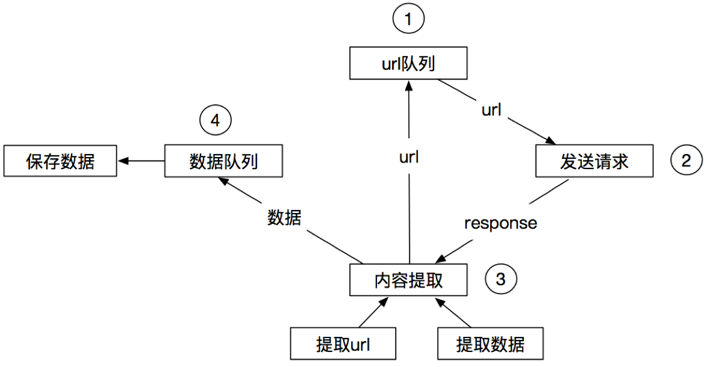
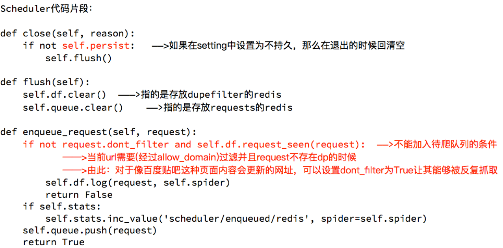
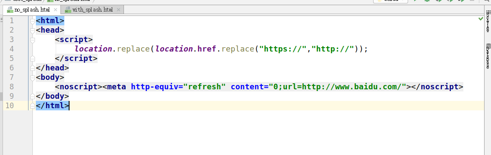
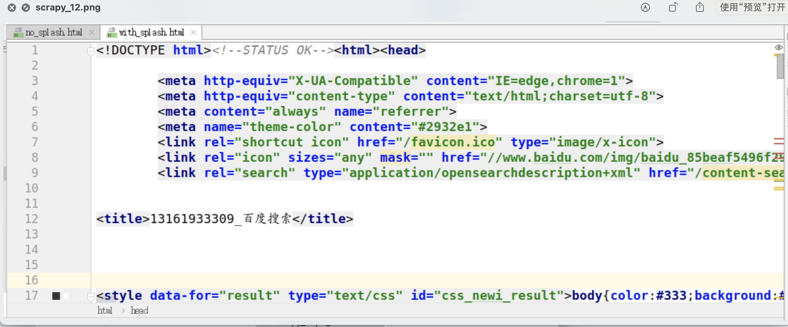
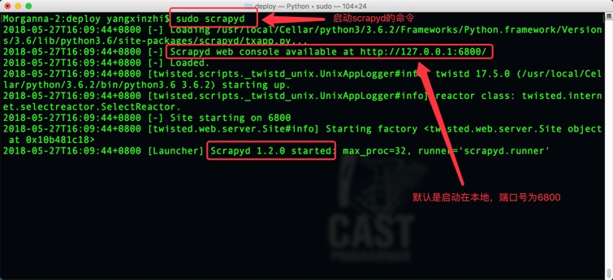
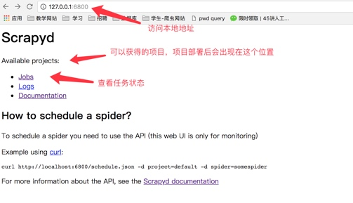
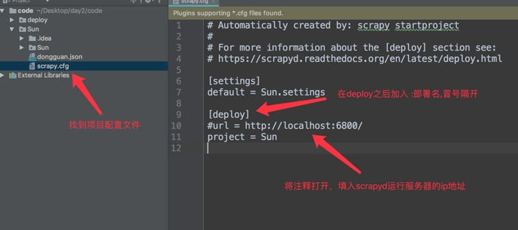
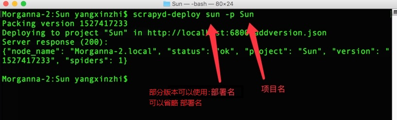

## scrapy的概念和流程 

**Scrapy是一个Python编写的开源网络爬虫框架。它是一个被设计用于爬取网络数据、提取结构性数据的框架。**

> Scrapy 使用了Twisted['twɪstɪd]异步网络框架，可以加快我们的下载速度。

> Scrapy文档地址：http://scrapy-chs.readthedocs.io/zh_CN/1.0/intro/overview.html

### 01 | scrapy的工作流程

####  回顾之前的爬虫流程


#### 上面的流程可以改写为



#### scrapy的流程

 

**其流程可以描述如下：**

1. 爬虫中起始的url构造成request对象-->爬虫中间件-->引擎-->调度器
2. 调度器把request-->引擎-->下载中间件--->下载器
3. 下载器发送请求，获取response响应---->下载中间件---->引擎--->爬虫中间件--->爬虫
4. 爬虫提取url地址，组装成request对象---->爬虫中间件--->引擎--->调度器，重复步骤2
5. 爬虫提取数据--->引擎--->管道处理和保存数据

**注意：**

- 图中中文是为了方便理解后加上去的
- 图中绿色线条的表示数据的传递
- 注意图中中间件的位置，决定了其作用
- 注意其中引擎的位置，所有的模块之前相互独立，只和引擎进行交互

#####  scrapy的三个内置对象

- request请求对象：由url method post_data headers等构成
- response响应对象：由url body status headers等构成
- item数据对象：本质是个字典

##### scrapy中每个模块的具体作用


> 注意：
>
> 爬虫中间件和下载中间件只是运行逻辑的位置不同，作用是重复的：如替换UA等

## scrapy的入门使用

1. 掌握 scrapy的安装
2. 应用 创建scrapy的项目
3. 应用 创建scrapy爬虫
4. 应用 运行scrapy爬虫
5. 应用 scrapy定位以及提取数据或属性值的方法
6. 掌握 response响应对象的常用属性

**安装scrapy**

命令:

sudo apt-get install scrapy

或者：

pip/pip3 install scrapy

### 01 | scrapy项目开发流程

1. 创建项目：

   scrapy startproject mySpider

2. 生成一个爬虫:

   scrapy genspider itcast itcast.cn

3. 提取数据:

   根据网站结构在spider中实现数据采集相关内容

4. 保存数据:

   使用pipeline进行数据后续处理和保存

### 02 | 创建项目

> 通过命令将scrapy项目的的文件生成出来，后续步骤都是在项目文件中进行相关操作，下面以抓取传智师资库来学习scrapy的入门使用：http://www.itcast.cn/channel/teacher.shtml

创建scrapy项目的命令：

​	`scrapy startproject <项目名字>`

示例：

​	`scrapy startproject myspider`

生成的目录和文件结果如下：

xxxxxxx

xxxxxx

### 03 | 创建爬虫

> 通过命令创建出爬虫文件，爬虫文件为主要的代码作业文件，通常一个网站的爬取动作都会在爬虫文件中进行编写

命令:

​	**在项目路径下执行**：scrapy genspider <爬虫名字> <允许爬取的域名>

**爬虫名字**: 作为爬虫运行时的参数

**允许爬取的域名**: 为对于爬虫设置的爬取范围，设置之后用于过滤要爬取的url，如果爬取的url与允许的域不通则

被过滤掉。

示例：

```
cd myspider
scrapy genspider itcast itcast.cn
```

生成的目录和文件结果如下：

.........

..........

### 04 | 完善爬虫

在上一步生成出来的爬虫文件中编写指定网站的数据采集操作，实现数据提取

#### 4.1 在/myspider/myspider/spiders/itcast.py中修改内容如下:

```python
import scrapy

class ItcastSpider(scrapy.Spider):  # 继承scrapy.spider
	# 爬虫名字 
    name = 'itcast' 
    # 允许爬取的范围
    allowed_domains = ['itcast.cn'] 
    # 开始爬取的url地址
    start_urls = ['http://www.itcast.cn/channel/teacher.shtml']
    
    # 数据提取的方法，接受下载中间件传过来的response
    def parse(self, response): 
    	# scrapy的response对象可以直接进行xpath
    	names = response.xpath('//div[@class="tea_con"]//li/div/h3/text()') 
    	print(names)

    	# 获取具体数据文本的方式如下
        # 分组
    	li_list = response.xpath('//div[@class="tea_con"]//li') 
        for li in li_list:
        	# 创建一个数据字典
            item = {}
            # 利用scrapy封装好的xpath选择器定位元素，并通过extract()或extract_first()来获取结果
            item['name'] = li.xpath('.//h3/text()').extract_first() # 老师的名字
            item['level'] = li.xpath('.//h4/text()').extract_first() # 老师的级别
            item['text'] = li.xpath('.//p/text()').extract_first() # 老师的介绍
            print(item)
```

##### 注意：

- scrapy.Spider爬虫类中必须有名为parse的解析
- 如果网站结构层次比较复杂，也可以自定义其他解析函数
- 在解析函数中提取的url地址如果要发送请求，则必须属于allowed_domains范围内，但是start_urls中的url地址不受这个限制，我们会在后续的课程中学习如何在解析函数中构造发送请求
- 启动爬虫的时候注意启动的位置，是在项目路径下启动
- parse()函数中使用yield返回数据，**注意：解析函数中的yield能够传递的对象只能是：BaseItem, Request, dict, None**

#### 4.2  定位元素以及提取数据、属性值的方法

> 解析并获取scrapy爬虫中的数据: 利用xpath规则字符串进行定位和提取

1. response.xpath方法的返回结果是一个类似list的类型，其中包含的是selector对象，操作和列表一样，但是有一些额外的方法
2. 额外方法extract()：返回一个包含有字符串的列表
3. 额外方法extract_first()：返回列表中的第一个字符串，列表为空没有返回None

#### 4.3 response响应对象的常用属性

- response.url：当前响应的url地址
- response.request.url：当前响应对应的请求的url地址
- response.headers：响应头
- response.requests.headers：当前响应的请求头
- response.body：响应体，也就是html代码，byte类型
- response.status：响应状态码

### 05 | 保存数据

利用管道pipeline来处理(保存)数据

#### 5.1 在pipelines.py文件中定义对数据的操作

1. 定义一个管道类
2. 重写管道类的process_item方法
3. process_item方法处理完item之后必须返回给引擎

```
import json

class ItcastPipeline():
    # 爬虫文件中提取数据的方法每yield一次item，就会运行一次
    # 该方法为固定名称函数
    def process_item(self, item, spider):
        print(item)
        return item
```

#### 5.2 在settings.py配置启用管道

```
ITEM_PIPELINES = {
    'myspider.pipelines.ItcastPipeline': 400
}
```

配置项中键为使用的管道类，管道类使用.进行分割，第一个为项目目录，第二个为文件，第三个为定义的管道

类。

配置项中值为管道的使用顺序，设置的数值约小越优先执行，该值一般设置为1000以内。


### 7. 运行scrapy

命令：在项目目录下执行scrapy crawl <爬虫名字>

示例：scrapy crawl itcast

### 小结

1. scrapy的安装：pip install scrapy
2. 创建scrapy的项目: scrapy startproject myspider
3. 创建scrapy爬虫：在项目目录下执行 scrapy genspider itcast itcast.cn
4. 运行scrapy爬虫：在项目目录下执行 scrapy crawl itcast
5. 解析并获取scrapy爬虫中的数据：
   1. response.xpath方法的返回结果是一个类似list的类型，其中包含的是selector对象，操作和列表一样，但是有一些额外的方法
   2. extract() 返回一个包含有字符串的列表
   3. extract_first() 返回列表中的第一个字符串，列表为空没有返回None
6. scrapy管道的基本使用:
   1. 完善pipelines.py中的process_item函数
   2. 在settings.py中设置开启pipeline
7. response响应对象的常用属性
   1. response.url：当前响应的url地址
   2. response.request.url：当前响应对应的请求的url地址
   3. response.headers：响应头
   4. response.requests.headers：当前响应的请求头
   5. response.body：响应体，也就是html代码，byte类型
   6. response.status：响应状态码

## scrapy数据建模与请求

1. 应用 在scrapy项目中进行建模
2. 应用 构造Request对象，并发送请求
3. 应用 利用meta参数在不同的解析函数中传递数据

### 01 |  数据建模

通常在做项目的过程中，在items.py中进行数据建模

**为什么建模：**

1. 定义item即提前规划好哪些字段需要抓，防止手误，因为定义好之后，在运行过程中，系统会自动检查
2. 配合注释一起可以清晰的知道要抓取哪些字段，没有定义的字段不能抓取，在目标字段少的时候可以使用字典代替
3. 使用scrapy的一些特定组件需要Item做支持，如scrapy的ImagesPipeline管道类，百度搜索了解更多

#### 1.1 如何建模

在items.py文件中定义要提取的字段：

```
class MyspiderItem(scrapy.Item): 
    name = scrapy.Field()   # 讲师的名字
    title = scrapy.Field()  # 讲师的职称
    desc = scrapy.Field()   # 讲师的介绍
```

#### 1.2 如何使用模板类

模板类定义以后需要在爬虫中导入并且实例化，之后的使用方法和使用字典相同

job.py：

```
from myspider.items import MyspiderItem   # 导入Item，注意路径
...
    def parse(self, response)

        item = MyspiderItem() # 实例化后可直接使用

        item['name'] = node.xpath('./h3/text()').extract_first()
        item['title'] = node.xpath('./h4/text()').extract_first()
        item['desc'] = node.xpath('./p/text()').extract_first()
        
        print(item)
```

注意：

1. from myspider.items import MyspiderItem这一行代码中 注意item的正确导入路径，忽略pycharm标记的错误
2. python中的导入路径要诀：从哪里开始运行，就从哪里开始导入

#### 1.3 开发流程总结

1. 创建项目：scrapy startproject 项目名
2. 明确目标：在items.py文件中进行建模
3. 创建爬虫
   - 创建爬虫：scrapy genspider 爬虫名 允许的域
   - 完成爬虫：
     - 修改start_urls
     - 检查修改allowed_domains
     - 编写解析方法
4. 保存数据
   - 在pipelines.py文件中定义对数据处理的管道
   - 在settings.py文件中注册启用管道

### 02 | 翻页请求的思路

>  对于要提取如下图中所有页面上的数据该怎么办？

回顾requests模块是如何实现翻页请求的：

1. 找到下一页的URL地址
2. 调用requests.get(url)

scrapy实现翻页的思路：

1. 找到下一页的url地址
2. 构造url地址的请求对象，传递给引擎

### 03 | 构造Request对象，并发送请求

#### 3.1 实现方法

1. 确定url地址
2. 构造请求，scrapy.Request(url,callback)
   - callback：指定解析函数名称，表示该请求返回的响应使用哪一个函数进行解析
3. 把请求交给引擎：yield scrapy.Request(url,callback)


#### 3.2 网易招聘爬虫

> 通过爬取网易招聘的页面的招聘信息,学习如何实现翻页请求

> 地址：https://hr.163.com/position/list.do

##### 思路分析：

1. 获取首页的数据
2. 寻找下一页的地址，进行翻页，获取数据

##### 注意：

1. 可以在settings中设置ROBOTS协议

```
# False表示忽略网站的robots.txt协议，默认为True
ROBOTSTXT_OBEY = False
```

2. 可以在settings中设置User-Agent：

```
# scrapy发送的每一个请求的默认UA都是设置的这个User-Agent
USER_AGENT = 'Mozilla/5.0 (Macintosh; Intel Mac OS X 10_12_5) AppleWebKit/537.36 (KHTML, like Gecko) Chrome/59.0.3071.115 Safari/537.36'
```

#### 3.3 代码实现

在爬虫文件的parse方法中：

```
......
	# 提取下一页的href
	next_url = response.xpath('//a[contains(text(),">")]/@href').extract_first()

	# 判断是否是最后一页
	if next_url != 'javascript:void(0)':

        # 构造完整url
        url = 'https://hr.163.com/position/list.do' + next_url

		# 构造scrapy.Request对象，并yield给引擎
		# 利用callback参数指定该Request对象之后获取的响应用哪个函数进行解析
    	yield scrapy.Request(url, callback=self.parse)
......
```


#### 3.4 scrapy.Request的更多参数

```python
scrapy.Request(url[,callback,method="GET",headers,body,cookies,meta,dont_filter=False])
```

##### 参数解释

1. 中括号里的参数为可选参数
2. **callback**：表示当前的url的响应交给哪个函数去处理
3. **meta**：实现数据在不同的解析函数中传递，meta默认带有部分数据，比如下载延迟，请求深度等
4. dont_filter:默认为False，会过滤请求的url地址，即请求过的url地址不会继续被请求，对需要重复请求的url地址可以把它设置为Ture，比如贴吧的翻页请求，页面的数据总是在变化;start_urls中的地址会被反复请求，否则程序不会启动
5. method：指定POST或GET请求
6. headers：接收一个字典，其中不包括cookies
7. cookies：接收一个字典，专门放置cookies
8. body：接收json字符串，为POST的数据，发送payload_post请求时使用（在下一章节中会介绍post请求）

### 04 | meta参数的使用

> meta的作用：meta可以实现数据在不同的解析函数中的传递

在爬虫文件的parse方法中，提取详情页增加之前callback指定的parse_detail函数：

```
def parse(self,response):
    ...
    yield scrapy.Request(detail_url, callback=self.parse_detail,meta={"item":item})
...

def parse_detail(self,response):
    #获取之前传入的item
    item = resposne.meta["item"]
```

##### 特别注意

1. meta参数是一个字典
2. meta字典中有一个固定的键`proxy`，表示代理ip，关于代理ip的使用我们将在scrapy的下载中间件的学习中进行介绍

### 小结

1. 完善并使用Item数据类：
  2. 在items.py中完善要爬取的字段
  3. 在爬虫文件中先导入Item
  4. 实力化Item对象后，像字典一样直接使用
5. 构造Request对象，并发送请求：
  6. 导入scrapy.Request类
  7. 在解析函数中提取url
  8. yield scrapy.Request(url, callback=self.parse_detail, meta={})
9. 利用meta参数在不同的解析函数中传递数据:
  10. 通过前一个解析函数 yield scrapy.Request(url, callback=self.xxx, meta={}) 来传递meta
  11. 在self.xxx函数中 response.meta.get('key', '') 或 response.meta['key'] 的方式取出传递的数据

### 参考代码

wangyi/spiders/job.py

```
import scrapy


class JobSpider(scrapy.Spider):
    name = 'job'
    # 2.检查允许的域名
    allowed_domains = ['163.com']
    # 1 设置起始的url
    start_urls = ['https://hr.163.com/position/list.do']

    def parse(self, response):
        # 获取所有的职位节点列表
        node_list = response.xpath('//*[@class="position-tb"]/tbody/tr')
        # print(len(node_list))

        # 遍历所有的职位节点列表
        for num, node in enumerate(node_list):
            # 索引为值除2取余为0的才是含有数据的节点，通过判断进行筛选
            if num % 2 == 0:
                item = {}

                item['name'] = node.xpath('./td[1]/a/text()').extract_first()
                item['link'] = node.xpath('./td[1]/a/@href').extract_first()
                item['depart'] = node.xpath('./td[2]/text()').extract_first()
                item['category'] = node.xpath('./td[3]/text()').extract_first()
                item['type'] = node.xpath('./td[4]/text()').extract_first()
                item['address'] = node.xpath('./td[5]/text()').extract_first()
                item['num'] = node.xpath('./td[6]/text()').extract_first().strip()
                item['date'] = node.xpath('./td[7]/text()').extract_first()
                yield item

        # 翻页处理
        # 获取翻页url
        part_url = response.xpath('//a[contains(text(),">")]/@href').extract_first()

        # 判断是否为最后一页，如果不是最后一页则进行翻页操作
        if part_url != 'javascript:void(0)':
            # 拼接完整翻页url
            next_url = 'https://hr.163.com/position/list.do' + part_url

            yield scrapy.Request(
                url=next_url,
                callback=self.parse
            )
```


wangyi/items.py

```
class WangyiItem(scrapy.Item):
    # define the fields for your item here like:

    name = scrapy.Field()
    link = scrapy.Field()
    depart = scrapy.Field()
    category = scrapy.Field()
    type = scrapy.Field()
    address = scrapy.Field()
    num = scrapy.Field()
    date = scrapy.Field()
```


## scrapy模拟登陆

1. 应用 请求对象cookies参数的使用
2. 了解 start_requests函数的作用
3. 应用 构造并发送post请求

### 01 | 回顾之前的模拟登陆的方法

#### 1.1 requests模块是如何实现模拟登陆的？

1. 直接携带cookies请求页面
2. 找url地址，发送post请求存储cookie

#### 1.2 selenium是如何模拟登陆的？

1. 找到对应的input标签，输入文本点击登陆

#### 1.3 scrapy的模拟登陆

1. 直接携带cookies
2. 找url地址，发送post请求存储cookie


### 02 | scrapy携带cookies直接获取需要登陆后的页面

##### 应用场景

1. cookie过期时间很长，常见于一些不规范的网站
2. 能在cookie过期之前把所有的数据拿到
3. 配合其他程序使用，比如其使用selenium把登陆之后的cookie获取到保存到本地，scrapy发送请求之前先读取本地cookie

#### 2.1 实现：重构scrapy的starte_rquests方法

scrapy中start_url是通过start_requests来进行处理的，其实现代码如下

```
# 这是源代码
def start_requests(self):
    cls = self.__class__
    if method_is_overridden(cls, Spider, 'make_requests_from_url'):
        warnings.warn(
            "Spider.make_requests_from_url method is deprecated; it "
            "won't be called in future Scrapy releases. Please "
            "override Spider.start_requests method instead (see %s.%s)." % (
                cls.__module__, cls.__name__
            ),
        )
        for url in self.start_urls:
            yield self.make_requests_from_url(url)
    else:
        for url in self.start_urls:
            yield Request(url, dont_filter=True)
```

**所以对应的，如果start_url地址中的url是需要登录后才能访问的url地址，则需要重写start_request方法并在其中手动添加上cookie**

#### 2.2 携带cookies登陆github

> 测试账号 noobpythoner zhoudawei123

```python
import scrapy
import re

class Login1Spider(scrapy.Spider):
    name = 'login1'
    allowed_domains = ['github.com']
    start_urls = ['https://github.com/NoobPythoner'] # 这是一个需要登陆以后才能访问的页面

    def start_requests(self): # 重构start_requests方法
        # 这个cookies_str是抓包获取的
        cookies_str = '...' # 抓包获取
        # 将cookies_str转换为cookies_dict
        cookies_dict = {i.split('=')[0]:i.split('=')[1] for i in cookies_str.split('; ')}
        yield scrapy.Request(
            self.start_urls[0],
            callback=self.parse,
            cookies=cookies_dict
        )

    def parse(self, response): # 通过正则表达式匹配用户名来验证是否登陆成功
        # 正则匹配的是github的用户名
        result_list = re.findall(r'noobpythoner|NoobPythoner', response.body.decode()) 
        print(result_list)
        pass
```

##### 注意：

1. scrapy中cookie不能够放在headers中，在构造请求的时候有专门的cookies参数，能够接受字典形式的coookie
2. 在setting中设置ROBOTS协议、USER_AGENT

### 03 | scrapy.Request发送post请求

>我们知道可以通过scrapy.Request()指定method、body参数来发送post请求；但是通常使用scrapy.FormRequest()来发送post请求

#### 3.1 发送post请求

> 注意：scrapy.FormRequest()能够发送表单和ajax请求，参考阅读 https://www.jb51.net/article/146769.htm

##### 3.1.1 思路分析

1. 找到post的url地址：点击登录按钮进行抓包，然后定位url地址为https://github.com/session

2. 找到请求体的规律：分析post请求的请求体，其中包含的参数均在前一次的响应中

3. 否登录成功：通过请求个人主页，观察是否包含用户名

##### 3.1.2 代码实现如下：

```
import scrapy
import re

class Login2Spider(scrapy.Spider):
   name = 'login2'
   allowed_domains = ['github.com']
   start_urls = ['https://github.com/login']

   def parse(self, response):
       authenticity_token = response.xpath("//input[@name='authenticity_token']/@value").extract_first()
       utf8 = response.xpath("//input[@name='utf8']/@value").extract_first()
       commit = response.xpath("//input[@name='commit']/@value").extract_first()
        
        #构造POST请求，传递给引擎
       yield scrapy.FormRequest(
           "https://github.com/session",
           formdata={
               "authenticity_token":authenticity_token,
               "utf8":utf8,
               "commit":commit,
               "login":"noobpythoner",
               "password":"***"
           },
           callback=self.parse_login
       )

   def parse_login(self,response):
       ret = re.findall(r"noobpythoner|NoobPythoner",response.text)
       print(ret)
```

##### 小技巧

> 在settings.py中通过设置COOKIES_DEBUG=TRUE 能够在终端看到cookie的传递传递过程

### 小结

1. start_urls中的url地址是交给start_request处理的，如有必要，可以重写start_request函数
2. 直接携带cookie登陆：cookie只能传递给cookies参数接收
3. scrapy.Request()发送post请求

##  scrapy管道的使用

掌握 scrapy管道(pipelines.py)的使用

> 之前我们在scrapy入门使用一节中学习了管道的基本使用，接下来我们深入的学习scrapy管道的使用

### 01 | pipeline中常用的方法：

1. process_item(self,item,spider): 
   - 管道类中必须有的函数
   - 实现对item数据的处理
   - 必须return item
2. open_spider(self, spider): 在爬虫开启的时候仅执行一次
3. close_spider(self, spider): 在爬虫关闭的时候仅执行一次


### 02 | 管道文件的修改

> 继续完善wangyi爬虫，在pipelines.py代码中完善

```
import json
from pymongo import MongoClient

class WangyiFilePipeline(object):
    def open_spider(self, spider):  # 在爬虫开启的时候仅执行一次
        if spider.name == 'itcast':
            self.f = open('json.txt', 'a', encoding='utf-8')

    def close_spider(self, spider):  # 在爬虫关闭的时候仅执行一次
        if spider.name == 'itcast':
            self.f.close()

    def process_item(self, item, spider):
        if spider.name == 'itcast':
            self.f.write(json.dumps(dict(item), ensure_ascii=False, indent=2) + ',\n')
        # 不return的情况下，另一个权重较低的pipeline将不会获得item
        return item  

class WangyiMongoPipeline(object):
    def open_spider(self, spider):  # 在爬虫开启的时候仅执行一次
        if spider.name == 'itcast':
        # 也可以使用isinstanc函数来区分爬虫类:
            con = MongoClient(host='127.0.0.1', port=27017) # 实例化mongoclient
            self.collection = con.itcast.teachers # 创建数据库名为itcast,集合名为teachers的集合操作对象

    def process_item(self, item, spider):
        if spider.name == 'itcast':
            self.collection.insert(item) 
            # 此时item对象必须是一个字典,再插入
            # 如果此时item是BaseItem则需要先转换为字典：dict(BaseItem)
        # 不return的情况下，另一个权重较低的pipeline将不会获得item
        return item  
```


### 03 | 开启管道

在settings.py设置开启pipeline

```
......
ITEM_PIPELINES = {
    'myspider.pipelines.ItcastFilePipeline': 400, # 400表示权重
    'myspider.pipelines.ItcastMongoPipeline': 500, # 权重值越小，越优先执行！
}
......
```

**别忘了开启mongodb数据库 ```sudo service mongodb start```**
**并在mongodb数据库中查看 ```mongo```**

**思考：在settings中能够开启多个管道，为什么需要开启多个？**

1. 不同的pipeline可以处理不同爬虫的数据，通过spider.name属性来区分
2. 不同的pipeline能够对一个或多个爬虫进行不同的数据处理的操作，比如一个进行数据清洗，一个进行数据的保存
3. 同一个管道类也可以处理不同爬虫的数据，通过spider.name属性来区分

### 04 | pipeline使用注意点

1. 使用之前需要在settings中开启
2. pipeline在setting中键表示位置(即pipeline在项目中的位置可以自定义)，值表示距离引擎的远近，越近数据会越先经过：**权重值小的优先执行**
3. 有多个pipeline的时候，process_item的方法必须return item,否则后一个pipeline取到的数据为None值
4. pipeline中process_item的方法必须有，否则item没有办法接受和处理
5. process_item方法接受item和spider，其中spider表示当前传递item过来的spider
6. open_spider(spider) :能够在爬虫开启的时候执行一次
7. close_spider(spider) :能够在爬虫关闭的时候执行一次
8. 上述俩个方法经常用于爬虫和数据库的交互，在爬虫开启的时候建立和数据库的连接，在爬虫关闭的时候断开和数据库的连接

### 小结

- 管道能够实现数据的清洗和保存，能够定义多个管道实现不同的功能，其中有个三个方法
  - process_item(self,item,spider):实现对item数据的处理
  - open_spider(self, spider):  在爬虫开启的时候仅执行一次
  - close_spider(self, spider):  在爬虫关闭的时候仅执行一次

## scrapy中间件的使用

1. 应用 scrapy中使用间件使用随机UA的方法
2. 应用 scrapy中使用代理ip的的方法
3. 应用 scrapy与selenium配合使用

### 01 | scrapy中间件的分类和作用

##### 1.1 scrapy中间件的分类

根据scrapy运行流程中所在位置不同分为：

1. 下载中间件
2. 爬虫中间件

##### 1.2 scrapy中间的作用：预处理request和response对象

1. 对header以及cookie进行更换和处理
2. 使用代理ip等
3. 对请求进行定制化操作，

但在scrapy默认的情况下 两种中间件都在middlewares.py一个文件中

爬虫中间件使用方法和下载中间件相同，且功能重复，通常使用下载中间件

### 02 | 下载中间件的使用方法：

> 接下来我们对腾讯招聘爬虫进行修改完善，通过下载中间件来学习如何使用中间件
> 编写一个Downloader Middlewares和我们编写一个pipeline一样，定义一个类，然后在setting中开启

Downloader Middlewares默认的方法：

  - process_request(self, request, spider)：
    1. 当每个request通过下载中间件时，该方法被调用。
       2. 返回None值：没有return也是返回None，该request对象传递给下载器，或通过引擎传递给其他权重低的process_request方法
       3. 返回Response对象：不再请求，把response返回给引擎
       4. 返回Request对象：把request对象通过引擎交给调度器，此时将不通过其他权重低的process_request方法

  - process_response(self, request, response, spider)：
    1. 当下载器完成http请求，传递响应给引擎的时候调用
       2. 返回Resposne：通过引擎交给爬虫处理或交给权重更低的其他下载中间件的process_response方法
       3. 返回Request对象：通过引擎交给调取器继续请求，此时将不通过其他权重低的process_request方法

  - 在settings.py中配置开启中间件，权重值越小越优先执行

### 03 | 定义实现随机User-Agent的下载中间件

#### 3.1 在middlewares.py中完善代码

```
import random
from Tencent.settings import USER_AGENTS_LIST # 注意导入路径,请忽视pycharm的错误提示

class UserAgentMiddleware(object):
    def process_request(self, request, spider):
        user_agent = random.choice(USER_AGENTS_LIST)
        request.headers['User-Agent'] = user_agent
        # 不写return

class CheckUA:
    def process_response(self,request,response,spider):
        print(request.headers['User-Agent'])
        return response # 不能少！
```

#### 3.2 在settings中设置开启自定义的下载中间件，设置方法同管道

```python
DOWNLOADER_MIDDLEWARES = {
   'Tencent.middlewares.UserAgentMiddleware': 543, # 543是权重值
   'Tencent.middlewares.CheckUA': 600, # 先执行543权重的中间件，再执行600的中间件
}
```

#### 3.3 在settings中添加UA的列表

```
USER_AGENTS_LIST = [
    "Mozilla/5.0 (compatible; MSIE 9.0; Windows NT 6.1; Win64; x64; Trident/5.0; .NET CLR 3.5.30729; .NET CLR 3.0.30729; .NET CLR 2.0.50727; Media Center PC 6.0)",
    "Mozilla/5.0 (compatible; MSIE 8.0; Windows NT 6.0; Trident/4.0; WOW64; Trident/4.0; SLCC2; .NET CLR 2.0.50727; .NET CLR 3.5.30729; .NET CLR 3.0.30729; .NET CLR 1.0.3705; .NET CLR 1.1.4322)",
    "Mozilla/4.0 (compatible; MSIE 7.0b; Windows NT 5.2; .NET CLR 1.1.4322; .NET CLR 2.0.50727; InfoPath.2; .NET CLR 3.0.04506.30)",
    "Mozilla/5.0 (Windows; U; Windows NT 5.1; zh-CN) AppleWebKit/523.15 (KHTML, like Gecko, Safari/419.3) Arora/0.3 (Change: 287 c9dfb30)",
    "Mozilla/5.0 (X11; U; Linux; en-US) AppleWebKit/527+ (KHTML, like Gecko, Safari/419.3) Arora/0.6",
    "Mozilla/5.0 (Windows; U; Windows NT 5.1; en-US; rv:1.8.1.2pre) Gecko/20070215 K-Ninja/2.1.1",
    "Mozilla/5.0 (Windows; U; Windows NT 5.1; zh-CN; rv:1.9) Gecko/20080705 Firefox/3.0 Kapiko/3.0",
    "Mozilla/5.0 (X11; Linux i686; U;) Gecko/20070322 Kazehakase/0.4.5"
]
```

#### 运行爬虫观察现象


### 04 | 代理ip的使用

#### 4.1 思路分析

1. 代理添加的位置：request.meta中增加`proxy`字段
2. 获取一个代理ip，赋值给`request.meta['proxy']`
   - 代理池中随机选择代理ip
   - 代理ip的webapi发送请求获取一个代理ip

#### 4.2 具体实现

免费代理ip：

```
class ProxyMiddleware(object):
    def process_request(self,request,spider):
        # proxies可以在settings.py中，也可以来源于代理ip的webapi
        # proxy = random.choice(proxies) 

        # 免费的会失效，报 111 connection refused 信息！重找一个代理ip再试
        proxy = 'https://1.71.188.37:3128' 

        request.meta['proxy'] = proxy
        return None # 可以不写return
```

收费代理ip：

```
# 人民币玩家的代码(使用abuyun提供的代理ip)
import base64

# 代理隧道验证信息  这个是在那个网站上申请的
proxyServer = 'http://proxy.abuyun.com:9010' # 收费的代理ip服务器地址，这里是abuyun
proxyUser = 用户名
proxyPass = 密码
proxyAuth = "Basic " + base64.b64encode(proxyUser + ":" + proxyPass)

class ProxyMiddleware(object):
    def process_request(self, request, spider):
        # 设置代理
        request.meta["proxy"] = proxyServer
        # 设置认证
        request.headers["Proxy-Authorization"] = proxyAuth
```

#### 4.3 检测代理ip是否可用

在使用了代理ip的情况下可以在下载中间件的process_response()方法中处理代理ip的使用情况，如果该代理ip不能使用可以替换其他代理ip

```
class ProxyMiddleware(object):
    ......
    def process_response(self, request, response, spider):
        if response.status != '200':
            request.dont_filter = True # 重新发送的请求对象能够再次进入队列
            return requst
```

##### 在settings.py中开启该中间件

### 05 | 在中间件中使用selenium

> 以github登陆为例

#### 5.1 完成爬虫代码

```
import scrapy

class Login4Spider(scrapy.Spider):
    name = 'login4'
    allowed_domains = ['github.com']
    start_urls = ['https://github.com/1596930226'] # 直接对验证的url发送请求

    def parse(self, response):
        with open('check.html', 'w') as f:
            f.write(response.body.decode())
```

#### 5.2 在middlewares.py中使用selenium

```
import time
from selenium import webdriver


def getCookies():
    # 使用selenium模拟登陆，获取并返回cookie
    username = input('输入github账号:')
    password = input('输入github密码:')
    options = webdriver.ChromeOptions()
    options.add_argument('--headless')
    options.add_argument('--disable-gpu')
    driver = webdriver.Chrome('/home/worker/Desktop/driver/chromedriver',
                              chrome_options=options)
    driver.get('https://github.com/login')
    time.sleep(1)
    driver.find_element_by_xpath('//*[@id="login_field"]').send_keys(username)
    time.sleep(1)
    driver.find_element_by_xpath('//*[@id="password"]').send_keys(password)
    time.sleep(1)
    driver.find_element_by_xpath('//*[@id="login"]/form/div[3]/input[3]').click()
    time.sleep(2)
    cookies_dict = {cookie['name']: cookie['value'] for cookie in driver.get_cookies()}
    driver.quit()
    return cookies_dict

class LoginDownloaderMiddleware(object):

    def process_request(self, request, spider):
        cookies_dict = getCookies()
        print(cookies_dict)
        request.cookies = cookies_dict # 对请求对象的cookies属性进行替换
```

##### 配置文件中设置开启该中间件后，运行爬虫可以在日志信息中看到selenium相关内容

### 小结

中间件的使用：

1. 完善中间件代码：

  - process_request(self, request, spider)：
    1. 当每个request通过下载中间件时，该方法被调用。
    2. 返回None值：没有return也是返回None，该request对象传递给下载器，或通过引擎传递给其他权重低的process_request方法
    3. 返回Response对象：不再请求，把response返回给引擎
    4. 返回Request对象：把request对象通过引擎交给调度器，此时将不通过其他权重低的process_request方法

  - process_response(self, request, response, spider)：
    1. 当下载器完成http请求，传递响应给引擎的时候调用
    2. 返回Resposne：通过引擎交给爬虫处理或交给权重更低的其他下载中间件的process_response方法
    3. 返回Request对象：通过引擎交给调取器继续请求，此时将不通过其他权重低的process_request方法

2. 需要在settings.py中开启中间件
   ```
   DOWNLOADER_MIDDLEWARES = {
   'myspider.middlewares.UserAgentMiddleware': 543,
   }
   ```

## scrapy_redis概念作用和流程

了解

在前面scrapy框架中我们已经能够使用框架实现爬虫爬取网站数据,如果当前网站的数据比较庞大, 我们就需要使用

分布式来更快的爬取数据

**分布式是什么：**

简单的说 分布式就是不同的节点（服务器，ip不同）共同完成一个任务


**scrapy_redis的概念：**

scrapy_redis是scrapy框架的基于redis的分布式组件


**scrapy_redis的作用:**

crapy_redis在scrapy的基础上实现了更多，更强大的功能，具体体现在：

通过持久化请求队列和请求的指纹集合来实现：

- 断点续爬
- 分布式快速抓取

### scrapy_redis的工作流程

- 在scrapy_redis中，所有的待抓取的request对象和去重的request对象指纹都存在所有的服务器公用的redis中
- 所有的服务器中的scrapy进程公用同一个redis中的request对象的队列
- 所有的request对象存入redis前，都会通过该redis中的request指纹集合进行判断，之前是否已经存入过
- 在默认情况下所有的数据会保存在redis中

 

## scrapy_redis原理分析并实现断点续爬以及分布式爬虫

1. 了解 scrapy实现去重的原理
2. 了解 scrapy中请求入队的条件
3. 掌握 scrapy_redis基于url地址的增量式单机爬虫
4. 掌握 scrapy_redis分布式爬虫

### 01 |下载github的demo代码

1. clone github scrapy-redis源码文件 

   `git clone https://github.com/rolando/scrapy-redis.git `

2. 研究项目自带的demo

   `mv scrapy-redis/example-project ~/scrapyredis-project`

### 02 | 观察dmoz文件

在domz爬虫文件中，实现方式就是之前的`crawlspider`类型的爬虫

```python
from scrapy.linkextractors import LinkExtractor
from scrapy.spiders import CrawlSpider, Rule


class DmozSpider(CrawlSpider):
    """Follow categories and extract links."""
    name = 'dmoz'
    allowed_domains = ['dmoztools.net']
    start_urls = ['http://dmoztools.net/'] # 这里修改了url
    
    # 定义数据提取规则，使用了css选择器
    rules = [
        Rule(LinkExtractor(
            restrict_css=('.top-cat', '.sub-cat', '.cat-item')
        ), callback='parse_directory', follow=True),
    ]

    def parse_directory(self, response):
        for div in response.css('.title-and-desc'):
            yield {
                'name': div.css('.site-title::text').extract_first(),
                'description': div.css('.site-descr::text').extract_first().strip(),
                'link': div.css('a::attr(href)').extract_first(),
            }


```

但是在settings.py中多了以下内容,这几行表示`scrapy_redis`中重新实现的了去重的类，以及调度器，并且使

用`RedisPipeline`管道类

```python
DUPEFILTER_CLASS = "scrapy_redis.dupefilter.RFPDupeFilter"
SCHEDULER = "scrapy_redis.scheduler.Scheduler"
SCHEDULER_PERSIST = True

ITEM_PIPELINES = {
    'example.pipelines.ExamplePipeline': 300,
    'scrapy_redis.pipelines.RedisPipeline': 400,
}
```

### 03 | 运行dmoz爬虫，观察现象

- 首先我们需要添加redis的地址，程序才能够使用redis

  ```python
  REDIS_URL = "redis://127.0.0.1:6379"
  #或者使用下面的方式
  # REDIS_HOST = "127.0.0.1"
  # REDIS_PORT = 6379
  ```

- 我们执行domz的爬虫，会发现redis中多了一下三个键：

   

- 中止进程后再次运行dmoz爬虫：继续执行程序，会发现程序在前一次的基础之上继续往后执行，**所以**

  **domz爬虫是一个基于url地址的增量式的爬虫**

### 04 | scrapy_redis的原理分析

我们从settings.py中的三个配置来进行分析
分别是：

- RedisPipeline # 管道类
- RFPDupeFilter # 指纹去重类
- Scheduler # 调度器类
- SCHEDULER_PERSIST # 是否持久化请求队列和指纹集合

#### 4.1 Scrapy_redis之RedisPipeline

RedisPipeline中观察process_item，进行数据的保存，存入了redis中


#### 4.2 Scrapy_redis之RFPDupeFilter

RFPDupeFilter 实现了对request对象的加密


  #### 4.3 Scrapy_redis之Scheduler

scrapy_redis调度器的实现了决定什么时候把request对象加入带抓取的队列，同时把请求过的request对象过滤掉



#### 4.4 由此可以总结出request对象入队的条件

- request的指纹不在集合中
- request的dont_filter为True，即不过滤
  - start_urls中的url地址会入队，因为他们默认是不过滤

#### 4.5 实现单机断点续爬

> 改写网易招聘爬虫，该爬虫就是一个经典的基于url地址的增量式爬虫

### 05 | 实现分布式爬虫

#### 5.1 分析demo中代码

> 打开example-project项目中的myspider_redis.py文件

通过观察代码：

1. 继承自父类为RedisSpider
2. 增加了一个redis_key的键，没有start_urls，因为分布式中，如果每台电脑都请求一次start_url就会重复
3. 多了`__init__`方法，该方法不是必须的，可以手动指定allow_domains
4. 启动方法：
   1. 在每个节点正确的目录下执行`scrapy crawl 爬虫名`，使该节点的scrapy_redis爬虫程序就位
   2. 在共用的redis中 `lpush redis_key 'start_url'`，使全部节点真正的开始运行
5. settings.py中关键的配置

```
DUPEFILTER_CLASS = "scrapy_redis.dupefilter.RFPDupeFilter"
SCHEDULER = "scrapy_redis.scheduler.Scheduler"
SCHEDULER_PERSIST = True

ITEM_PIPELINES = {
    'example.pipelines.ExamplePipeline': 300,
    'scrapy_redis.pipelines.RedisPipeline': 400,
}
REDIS_URL = "redis://127.0.0.1:6379"
```


#### 5.2 动手实现分布式爬虫

> 改写tencent爬虫为分布式爬虫

##### 注意：启动方式发生改变

### 小结

1. scrapy_redis的含义和能够实现的功能
   1. scrapy是框架
   2. scrapy_redis是scrapy的组件
   3. scrapy_redis能够实现断点续爬和分布式爬虫

2. scrapy_redis流程和实现原理
   1. 在scrapy框架流程的基础上，把存储request对象放到了redis的有序集合中，利用该有序集合实现了请求队列
   2. 并对request对象生成指纹对象，也存储到同一redis的集合中，利用request指纹避免发送重复的请求
3. request对象进入队列的条件
   1. request的指纹不在集合中
   2. request的dont_filter为True，即不过滤

4. request指纹的实现
   - 请求方法
   - 排序后的请求地址
   - 排序并处理过的请求体或空字符串
   - 用hashlib.sha1()对以上内容进行加密

5. scarpy_redis实现增量式爬虫、布式爬虫
   1. 对setting进行如下设置
      - DUPEFILTER_CLASS = "scrapy_redis.dupefilter.RFPDupeFilter"
      - SCHEDULER = "scrapy_redis.scheduler.Scheduler"
      - SCHEDULER_PERSIST = True
      - ITEM_PIPELINES = {'scrapy_redis.pipelines.RedisPipeline': 400,}
      - REDIS_URL = "redis://127.0.0.1:6379" # 请正确配置REDIS_URL
   2. 爬虫文件中的爬虫类继承RedisSpider类
   3. 爬虫类中redis_key替代了start_urls
   4. 启动方式不同
      - 通过`scrapy crawl spider`启动爬虫后，向redis_key放入一个或多个起始url（lpush或rpush都可以），才能够让scrapy_redis爬虫运行
   5. 除了以上差异点以外，scrapy_redis爬虫和scrapy爬虫的使用方法都是一样的

## scrapy_splash组件的使用：了解

### 01 | 什么是scrapy_splash？

scrapy_splash是scrapy的一个组件

- scrapy-splash加载js数据是基于Splash来实现的。
- Splash是一个Javascript渲染服务。它是一个实现了HTTP API的轻量级浏览器，Splash是用Python和Lua语言实现的，基于Twisted和QT等模块构建。
- 使用scrapy-splash最终拿到的response相当于是在浏览器全部渲染完成以后的网页源代码。

> splash官方文档 https://splash.readthedocs.io/en/stable/

### 02 |scrapy_splash的作用

scrapy-splash能够模拟浏览器加载js，并返回js运行后的数据

### 03 | scrapy_splash的环境安装

#### 3.1 使用splash的docker镜像

> splash的dockerfile https://github.com/scrapinghub/splash/blob/master/Dockerfile

观察发现splash依赖环境略微复杂，所以我们可以直接使用splash的docker镜像

如果不使用docker镜像请参考 [splash官方文档](https://github.com/scrapinghub/splash/blob/master/Dockerfile) 安装相应的依赖环境

##### 3.1.1 安装并启动docker服务

> 安装参考 https://blog.csdn.net/sanpic/article/details/81984683

##### 3.1.2 获取splash的镜像

> 在正确安装docker的基础上pull取splash的镜像

`sudo docker pull scrapinghub/splash`

##### 3.1.3 验证是否安装成功

> 运行splash的docker服务，并通过浏览器访问8050端口验证安装是否成功

- 前台运行 `sudo docker run -p 8050:8050 scrapinghub/splash`

- 后台运行 `sudo docker run -d -p 8050:8050 scrapinghub/splash`

访问 http://127.0.0.1:8050 看到如下截图内容则表示成功


##### 3.1.4 解决获取镜像超时:修改docker的镜像源

> 以ubuntu18.04为例

1. 创建并编辑docker的配置文件

`sudo vi /etc/docker/daemon.json`

2. 写入国内docker-cn.com的镜像地址配置后保存退出

```
{ 
"registry-mirrors": ["https://registry.docker-cn.com"] 
}
```

3. 重启电脑或docker服务后重新获取splash镜像

4. 这时如果还慢，请使用手机热点（流量orz）

##### 3.1.5 关闭splash服务

> 需要先关闭容器后，再删除容器

```
sudo docker ps -a
sudo docker stop CONTAINER_ID
sudo docker rm CONTAINER_ID
```

#### 3.2 在python虚拟环境中安装scrapy-splash包

`pip install scrapy-splash`

### 04 | 在scrapy中使用splash

> 以baidu为例

#### 4.1 创建项目创建爬虫

```
scrapy startproject test_splash
cd test_splash
scrapy genspider no_splash baidu.com
scrapy genspider with_splash baidu.com
```

#### 4.2 完善settings.py配置文件

在settings.py文件中添加splash的配置以及修改robots协议

```
# 渲染服务的url
SPLASH_URL = 'http://127.0.0.1:8050'
# 下载器中间件
DOWNLOADER_MIDDLEWARES = {
    'scrapy_splash.SplashCookiesMiddleware': 723,
    'scrapy_splash.SplashMiddleware': 725,
    'scrapy.downloadermiddlewares.httpcompression.HttpCompressionMiddleware': 810,
}
# 去重过滤器
DUPEFILTER_CLASS = 'scrapy_splash.SplashAwareDupeFilter'
# 使用Splash的Http缓存
HTTPCACHE_STORAGE = 'scrapy_splash.SplashAwareFSCacheStorage'

# Obey robots.txt rules
ROBOTSTXT_OBEY = False
```

#### 4.3 不使用splash

在spiders/no_splash.py中完善

```
import scrapy


class NoSplashSpider(scrapy.Spider):
    name = 'no_splash'
    allowed_domains = ['baidu.com']
    start_urls = ['https://www.baidu.com/s?wd=13161933309']

    def parse(self, response):
        with open('no_splash.html', 'w') as f:
            f.write(response.body.decode())
```

#### 4.4 使用splash

```
import scrapy
from scrapy_splash import SplashRequest # 使用scrapy_splash包提供的request对象

class WithSplashSpider(scrapy.Spider):
    name = 'with_splash'
    allowed_domains = ['baidu.com']
    start_urls = ['https://www.baidu.com/s?wd=13161933309']

    def start_requests(self):
        yield SplashRequest(self.start_urls[0],
                            callback=self.parse_splash,
                            args={'wait': 10}, # 最大超时时间，单位：秒
                            endpoint='render.html') # 使用splash服务的固定参数

    def parse_splash(self, response):
        with open('with_splash.html', 'w') as f:
            f.write(response.body.decode())

```

#### 4.5 分别运行俩个爬虫，并观察现象

##### 4.5.1 分别运行俩个爬虫

```
scrapy crawl no_splash
scrapy crawl with_splash
```

##### 4.5.2 观察获取的俩个html文件

不使用splash



使用splash:



#### 4.6 结论

1. splash类似selenium，能够像浏览器一样访问请求对象中的url地址
2. 能够按照该url对应的响应内容依次发送请求
3. 并将多次请求对应的多次响应内容进行渲染
4. 最终返回渲染后的response响应对象


### 05 | 了解更多

> 关于splash https://www.cnblogs.com/zhangxinqi/p/9279014.html

> 关于scrapy_splash（截屏，get_cookies等） https://www.e-learn.cn/content/qita/800748

### 小结

1. scrapy_splash组件的作用
   1. splash类似selenium，能够像浏览器一样访问请求对象中的url地址
   2. 能够按照该url对应的响应内容依次发送请求
   3. 并将多次请求对应的多次响应内容进行渲染
   4. 最终返回渲染后的response响应对象
2. scrapy_splash组件的使用
   1. 需要splash服务作为支撑
   2. 构造的request对象变为splash.SplashRequest
   3. 以下载中间件的形式使用
   4. 需要scrapy_splash特定配置
3. scrapy_splash的特定配置

```python
SPLASH_URL = 'http://127.0.0.1:8050'
DOWNLOADER_MIDDLEWARES = {
    'scrapy_splash.SplashCookiesMiddleware': 723,
    'scrapy_splash.SplashMiddleware': 725,
    'scrapy.downloadermiddlewares.httpcompression.HttpCompressionMiddleware': 810,
}
DUPEFILTER_CLASS = 'scrapy_splash.SplashAwareDupeFilter'
HTTPCACHE_STORAGE = 'scrapy_splash.SplashAwareFSCacheStorage'
```


## scrapy的日志信息与配置

1. 了解 scrapy的日志信息
2. 掌握 scrapy的常用配置
3. 掌握 scrapy_redis配置
4. 了解scrapy_splash配置
5. 了解scrapy_redis和scrapy_splash配合使用的配置

### 01 | 了解scrapy的日志信息


### 02 | scrapy的常用配置

- ROBOTSTXT_OBEY 是否遵守robots协议，默认是遵守
  - 关于robots协议
    1. 在百度搜索中，不能搜索到淘宝网中某一个具体的商品的详情页面，这就是robots协议在起作用
    2. Robots协议：网站通过Robots协议告诉搜索引擎哪些页面可以抓取，哪些页面不能抓取，但它仅仅是互联网中的一般约定
    3. 例如：[淘宝的robots协议](https://www.taobao.com/robots.txt)


- USER_AGENT 设置ua
- DEFAULT_REQUEST_HEADERS 设置默认请求头，这里加入了USER_AGENT将不起作用


- ITEM_PIPELINES 管道，左位置右权重：权重值越小，越优先执行
- SPIDER_MIDDLEWARES 爬虫中间件，设置过程和管道相同
- DOWNLOADER_MIDDLEWARES 下载中间件


- COOKIES_ENABLED 默认为True表示开启cookie传递功能，即每次请求带上前一次的cookie，做状态保持
- COOKIES_DEBUG 默认为False表示日志中不显示cookie的传递过程


- LOG_LEVEL 默认为DEBUG，控制日志的等级
  - LOG_LEVEL = "WARNING"
- LOG_FILE 设置log日志文件的保存路径，如果设置该参数，日志信息将写入文件，终端将不再显示，且受到LOG_LEVEL日志等级的限制
  - LOG_FILE = "./test.log"

### 03 | scrapy_redis配置

- DUPEFILTER_CLASS = "scrapy_redis.dupefilter.RFPDupeFilter" # 指纹生成以及去重类
- SCHEDULER = "scrapy_redis.scheduler.Scheduler" # 调度器类
- SCHEDULER_PERSIST = True # 持久化请求队列和指纹集合
- ITEM_PIPELINES = {'scrapy_redis.pipelines.RedisPipeline': 400} # 数据存入redis的管道
- REDIS_URL = "redis://host:port" # redis的url

### 04 | scrapy_splash配置

```
SPLASH_URL = 'http://127.0.0.1:8050'
DOWNLOADER_MIDDLEWARES = {
'scrapy_splash.SplashCookiesMiddleware': 723,
'scrapy_splash.SplashMiddleware': 725,
'scrapy.downloadermiddlewares.httpcompression.HttpCompressionMiddleware': 810,
}
DUPEFILTER_CLASS = 'scrapy_splash.SplashAwareDupeFilter' 
HTTPCACHE_STORAGE = 'scrapy_splash.SplashAwareFSCacheStorage'
```

### 05 | scrapy_redis和scrapy_splash配合使用的配置

#### 5.1 原理

- scrapy-redis中配置了”DUPEFILTER_CLASS” : “scrapy_redis.dupefilter.RFPDupeFilter”，与scrapy-splash配置的DUPEFILTER_CLASS = ‘scrapy_splash.SplashAwareDupeFilter’ 相冲突！
- 查看了scrapy_splash.SplashAwareDupeFilter源码后，发现他继承了scrapy.dupefilter.RFPDupeFilter，并重写了request_fingerprint()方法。
- 比较scrapy.dupefilter.RFPDupeFilter和scrapy_redis.dupefilter.RFPDupeFilter中的request_fingerprint()方法后，发现是一样的，因此重写了一个SplashAwareDupeFilter，继承scrapy_redis.dupefilter.RFPDupeFilter，其他代码不变。

#### 5.2 重写dupefilter去重类，并在settings.py中使用

##### 5.2.1 重写去重类

```
from __future__ import absolute_import

from copy import deepcopy

from scrapy.utils.request import request_fingerprint
from scrapy.utils.url import canonicalize_url

from scrapy_splash.utils import dict_hash

from scrapy_redis.dupefilter import RFPDupeFilter


def splash_request_fingerprint(request, include_headers=None):
    """ Request fingerprint which takes 'splash' meta key into account """

    fp = request_fingerprint(request, include_headers=include_headers)
    if 'splash' not in request.meta:
        return fp

    splash_options = deepcopy(request.meta['splash'])
    args = splash_options.setdefault('args', {})

    if 'url' in args:
        args['url'] = canonicalize_url(args['url'], keep_fragments=True)

    return dict_hash(splash_options, fp)


class SplashAwareDupeFilter(RFPDupeFilter):
    """
    DupeFilter that takes 'splash' meta key in account.
    It should be used with SplashMiddleware.
    """
    def request_fingerprint(self, request):
        return splash_request_fingerprint(request)


"""以上为重写的去重类，下边为爬虫代码"""

from scrapy_redis.spiders import RedisSpider
from scrapy_splash import SplashRequest


class SplashAndRedisSpider(RedisSpider):
    name = 'splash_and_redis'
    allowed_domains = ['baidu.com']

    # start_urls = ['https://www.baidu.com/s?wd=13161933309']
    redis_key = 'splash_and_redis'
    # lpush splash_and_redis 'https://www.baidu.com'

    # 分布式的起始的url不能使用splash服务!
    # 需要重写dupefilter去重类!

    def parse(self, response):
        yield SplashRequest('https://www.baidu.com/s?wd=13161933309',
                            callback=self.parse_splash,
                            args={'wait': 10}, # 最大超时时间，单位：秒
                            endpoint='render.html') # 使用splash服务的固定参数

    def parse_splash(self, response):
        with open('splash_and_redis.html', 'w') as f:
            f.write(response.body.decode())
```

##### 5.2.2 scrapy_redis和scrapy_splash配合使用的配置

```
# 渲染服务的url
SPLASH_URL = 'http://127.0.0.1:8050'
# 下载器中间件
DOWNLOADER_MIDDLEWARES = {
    'scrapy_splash.SplashCookiesMiddleware': 723,
    'scrapy_splash.SplashMiddleware': 725,
    'scrapy.downloadermiddlewares.httpcompression.HttpCompressionMiddleware': 810,
}
# 使用Splash的Http缓存
HTTPCACHE_STORAGE = 'scrapy_splash.SplashAwareFSCacheStorage'

# 去重过滤器
# DUPEFILTER_CLASS = 'scrapy_splash.SplashAwareDupeFilter'
# DUPEFILTER_CLASS = "scrapy_redis.dupefilter.RFPDupeFilter" # 指纹生成以及去重类
DUPEFILTER_CLASS = 'test_splash.spiders.splash_and_redis.SplashAwareDupeFilter' # 混合去重类的位置

SCHEDULER = "scrapy_redis.scheduler.Scheduler" # 调度器类
SCHEDULER_PERSIST = True # 持久化请求队列和指纹集合, scrapy_redis和scrapy_splash混用使用splash的DupeFilter!
ITEM_PIPELINES = {'scrapy_redis.pipelines.RedisPipeline': 400} # 数据存入redis的管道
REDIS_URL = "redis://127.0.0.1:6379" # redis的url
```

##### 注意：

- scrapy_redis分布式爬虫在业务逻辑结束后并不能够自动退出
- 重写的dupefilter去重类可以自定义位置，也须在配置文件中写入相应的路径

### 06 | 了解scrapy的其他配置

- CONCURRENT_REQUESTS 设置并发请求的数量，默认是16个
- DOWNLOAD_DELAY 下载延迟，默认无延迟，单位为秒
- 其他设置参考：https://www.jianshu.com/p/df9c0d1e9087


## scrapyd部署scrapy项目

了解 scrapyd的使用流程

了解 scrapyd的使用流程

了解 scrapyd的使用流程

### 01 | scrapyd的介绍 

scrapyd是一个用于部署和运行scrapy爬虫的程序，它允许你通过JSON API来**部署爬虫项目和控制爬虫运行**，scrapyd是一个守护进程，监听爬虫的运行和请求，然后启动进程来执行它们

> 所谓json api本质就是post请求的webapi

### 02 |scrapyd的安装

scrapyd服务:
`pip install scrapyd`

scrapyd客户端:
`pip install scrapyd-client`

### 03 | 启动scrapyd服务

1. **在scrapy项目路径下** 启动scrapyd的命令：`sudo scrapyd` 或 `scrapyd`

2. 启动之后就可以打开本地运行的scrapyd，浏览器中访问本地6800端口可以查看scrapyd的监控界面

 

 

- 点击job可以查看任务监控界面

  

### 04 | scrapy项目部署

#### 4.1 配置需要部署的项目

编辑需要部署的项目的scrapy.cfg文件(需要将哪一个爬虫部署到scrapyd中，就配置该项目的该文件)

 ```
[deploy:部署名(部署名可以自行定义)]
url = http://localhost:6800/
project = 项目名(创建爬虫项目时使用的名称)
 ```

  

#### 4.2 部署项目到scrapyd

同样在**scrapy项目路径下**执行：

`scrapyd-deploy 部署名(配置文件中设置的名称) -p 项目名称` 

  

部署成功之后就可以看到部署的项目 

  

#### 4.3 管理scrapy项目

* 启动项目：`curl http://localhost:6800/schedule.json -d project=project_name -d spider=spider_name `    

* 关闭爬虫：`curl http://localhost:6800/cancel.json -d project=project_name -d job=jobid`

##### 注意；curl是命令行工具，如果没有则需要额外安装

#### 4.4 使用requests模块控制scrapy项目

```
import requests

# 启动爬虫
url = 'http://localhost:6800/schedule.json'
data = {
	'project': 项目名,
	'spider': 爬虫名,
}
resp = requests.post(url, data=data)

# 停止爬虫
url = 'http://localhost:6800/cancel.json'
data = {
	'project': 项目名,
	'job': 启动爬虫时返回的jobid,
}
resp = requests.post(url, data=data)
```

### 05 | 了解scrapyd的其他webapi

* curl http://localhost:6800/listprojects.json    （列出项目）
* curl http://localhost:6800/listspiders.json?project=myspider   （列出爬虫）
* curl http://localhost:6800/listjobs.json?project=myspider    （列出job）
* curl http://localhost:6800/cancel.json -d project=myspider -d job=tencent    （**终止爬虫**，该功能会有延时或不能终止爬虫的情况，此时可用kill -9杀进程的方式中止）
* scrapyd还有其他webapi，百度搜索了解更多

### 小结

1. 在scrapy项目路径下执行`sudo scrapyd`或`scrapyd`，启动scrapyd服务；或以后台进程方式启动```nohup scrapyd > scrapyd.log 2>&1 &```
2. 部署scrapy爬虫项目`scrapyd-deploy -p myspider`
3. 启动爬虫项目中的一个爬虫`curl http://localhost:6800/schedule.json -d project=myspider -d spider=tencent`